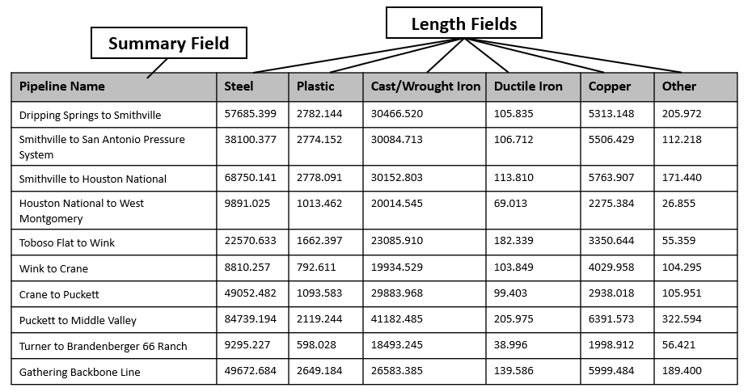
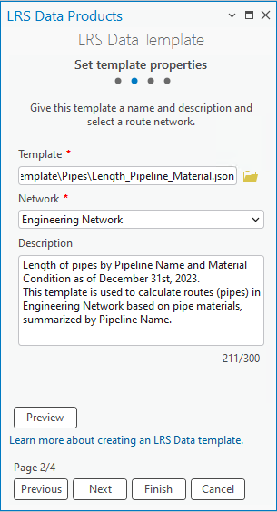

# Create a template for an LRS length data product

| Field | Value |
| --- | --- |
| **Doc** | 317 · Data Template · Pro |
| **Product** | Pipeline Referencing |
| **Release** | 3.4 |
| **Issues** | — |
| **Source** | [working_wizard_APR_doc.docx](<https://esriis.sharepoint.com/sites/LocationReferencing/Shared%20Documents/General/Doc%20Reviews/5984_Generate_LRS%20Data_Product/working_wizard_APR_doc.docx>) |
| **People** | author Claire Wang · PE — · dev — |
| **Edited** | 2024-09-04 03:22 by unknown |
| **Extracted** | 2026-09-04 · lane xmlstrip · format 3.0 · prompt v2.0.2 |
| **Keywords** | length data product · template · summary layer · length field · filter expression · pipe material |
| **Tools** | Generate LRS Data Product |

## Summary

This document explains how to create a template for an LRS length data product using the LRS Data Template wizard in ArcGIS Pro. It covers selecting the product type, setting template properties, configuring summary layers and fields, and defining length fields with filters. The template is then used as input for the Generate LRS Data Product geoprocessing tool.

## Related documents

<!-- related:begin -->
- [LRS Data Template](<https://esriis.sharepoint.com/sites/lrsworkspace/LRS Doc Index/Other/lrs-data-template.md>) — similar text 0.51 · 2 filename words · same surface/release 3.4/folder <!-- rel:316 s=6.889 -->
- [Generate LR Data Product: Support summary and length fields from the template – Test Plan](<https://esriis.sharepoint.com/sites/lrsworkspace/LRS Doc Index/Test Plans/5769-generate-lr-data-product-support-summary-and-length-fields.md>) — similar text 0.16 · 2 title words · same surface <!-- rel:339 s=3.251 -->
- [Generate LRS Data Product Support Summary and Length](<https://esriis.sharepoint.com/sites/lrsworkspace/LRS%20Doc%20Index/User%20Stories/generate-lrs-data-product-support-summary-and-length.md>) — similar text 0.12 · 2 title words · same surface <!-- rel:357 s=3.222 -->
- [Create a template for an LRS feature count data product](<https://esriis.sharepoint.com/sites/lrsworkspace/LRS Doc Index/Other/create-a-template-for-an-lrs-feature-count-data-product-apr.md>) — similar text 0.27 · 2 title words · 1 filename word · same surface <!-- rel:198 s=3.218 -->
- [Create a template for an LRS feature count data product](<https://esriis.sharepoint.com/sites/lrsworkspace/LRS Doc Index/Other/create-a-template-for-an-lrs-feature-count-data-product-rh.md>) — similar text 0.24 · 2 title words · same surface <!-- rel:196 s=2.926 -->
<!-- related:end -->

<!-- docs:begin -->
## Esri documentation

[Create a template for an LRS length data product](https://doc.esri.com/en/arcgis-pro/latest/help/production/roads-highways/create-a-template-for-an-lrs-length-data-product.html)

_No page matched:_ [Generate LRS Data Product](https://www.google.com/search?q=%22Generate%20LRS%20Data%20Product%22+site%3Adoc.esri.com)
<!-- docs:end -->

---

## Create a template for an LRS length Ddata Templateproduct
To create linear referencing system (LRS) dData Pproducts, you need to first create an LRS Ddata Ttemplate and then, use the template as an input in the Generate LRS Data Product geoprocessing tool (link).
The following sections guide you through creating a template for an LRS length data product. This documentation introduces LRS Length Data Product and steps to create a template for such product.
Choose an LRS dData Pproduct Ttype
As of ArcGIS Pro 3.4,The LRS lLength Ddata Pproduct is the only type of product currently supported and this is the default selection in the first pane of the. In LRS Data Template wizard, this is selected in the first pane.
(alt text: Choose an LRS dData Pproduct Ttype in the first pane of LRS Data Template wizard.)

An LRS Llength Ddata Pproduct is used to calculate length of routes based on their characteristics. Here is an example of an LRS lLength Ddata Pproduct that computes length of pipes in different materials summarized by lLine nName.
(alt text: An example of an LRS lLength Ddata Pproduct.)

Other types of LRS lLength dData pProducts you can configure include the following:

- Length of types of pipe systems, such as on-shore transmission, on-shore gathering, and so on, summarized by installation year.
- Length of leak report summarized by pipeline name and status code
- Length of categories of pipe diameters and pipe materials summarized by pipe systems
In this workflow, you'll learn how create a template to produce an LRS Llength Ddata Pproduct similar to the one shown in the table above.
Set template properties
Once a pProduct Ttype is selected, you can provide template properties in the next pane.

1. Type Provide a template name.

1. By default, the template will be saved in the project folder. When needed, click the folder button to browse to a location that the template will be saved to, and provide a template name.

1. Click the Network drop-down arrow and choose a network from the Network dropdown.
This network is used to calculate the length of the routes.

1. Optionally, provide a description.
(alt text: Set template properties in the second pane of LRS Data Template wizard.)

1. Optionally, click Preview to open the canvas. The canvas formats information entered in the wizard.
Screenshot of canvas
(alt text: Template properties shown in canvas.)

1. Click Next.

Set template summary fields
The next stage in producing the LRS dData Ttemplate is to select a summary layer and summary fields. The LRS lLength Ddata Pproduct is summarized on the basis ofbased on unique values present in the summary layer.
You can configure multiple summary layers and summary fields. The summary layers are arranged and subdivided by levels based on their spatial relationships. For example, you can configure Pipe system layer as level one, and Pipeline layer as level two. The LRS lLength Ddata Pproduct will summarizes the length of each pipeline within each pipe system.
This is an optional choice. If you don't want to add summary fields to your template, skip this step pane by clicking Next.

1. Click Add to add a summary level.

1. Select Click the Summary Layer drop-down arrow and choose a summary layer from Layer dropdown.
This layer can be a polygon feature class, a line event registered to the network selected in the 2nd second pane, or the network itself. This layer must be in the same geodatabase and have the same projection as the selected network.
For this workflowexample, Engineering Network is the summary layer for the first level as shown in the table above.

1. Click the Field drop-down arrow and chooseSelect a summary field from Field dropdown.

1. For this workflowexample, Line Name is the summary field for the Engineering Network.
Once a summary field is selected, the Display Value Map section shows the unique values present in the summary field. You can edit the display value field in the table if the initial display values are abbreviations or coded values. The LRS lLength Ddata Pproduct will only calculate route length for values in Display Value Map section.
Screenshot of wizard
(alt text: Set the first summary layer in the third pane of LRS Data Template wizard.)

1. Type to pProvide a name for this summary level.

1. For this workflowexample, the level name is Pipeline Name.

1. Optionally, you can delete display values from the Display Value Map section, or use a Ffilter Eexpression to manage Ddisplay Vvalues.
For this workflowexample, the pipelines that are gathering field pipes are chosen. Only the length of routes in these pipelines will be calculated.
Screenshot of wizard
(alt text: Manage display values in the third pane of LRS Data Template wizard.)

Screenshot of canvas
(alt text: Summary fields shown in canvas.)

1. Optionally, you can add multiple summary levels. Repeat the steps above for the additional levels.

1. Click Next.
Set template length fields
After selecting the summary layer, the next step is to add the length fields. These length fields form the columns that show the length of routes in the LRS lLength Ddata Pproduct.

1. Click Add to add a lLength Ffield.

1. Select Click thea Length Layer from the drop-down arrow and choose a length layer.
This layer can be a line event registered to the network selected in the 2nd second pane, or the network itself. This layer must be in the same geodatabase and have the same projection as the selected network.
For this workflowexample, line event Gathering Field Pipe is the first lLength Llayer.
Single Value is the only selection method currently supported and this is the default option.

1. Type to pProvide a name for this lLength fField.

1. For this workflowexample, Steel is the name for the first lLength fField.

1. Optionally, you can use a Ffilter Eexpression to manage lLength Ffields.
For this workflowexample, since the template is used to calculate length of pipes in different materials, the length fields will beare the unique values in the Material field. The first length field is called Steel, and a filter is applied to the Material field to select values that correspond to the steel category, such as bare steel and coated steel.
Screenshot of wizard
(alt text: Set the first length field in the fourth pane of LRS Data Template wizard.)

1. Optionally, you can add multiple length fields. Repeat the steps above for the additional levelsfields.
For this workflowexample, the additional length fields are Plastic, Cast/Wrought Iron, Ductile Iron, Copper, and Other.
Screenshot of wizard
(alt text: Set multiple length fields in the fourth pane of LRS Data Template wizard.)

Screenshot of canvas
(alt text: Length fields shown in canvas.)

1. Click Finish to save the template.
Note:
To view or edit an existing template, click the folder button next to Template. You can choose a template from the default project folder location or browse to other locations.
Now you can use this template in the Generate LRS Data Product (link) geoprocessing tool.

