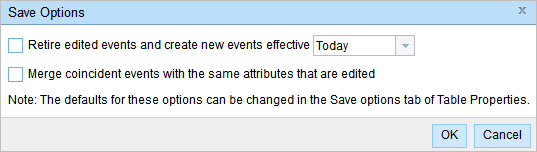

# Spike: Advanced Table Editing options in Pro

| Field | Value |
| --- | --- |
| **Doc** | 492 · Design Spike · Pro |
| **Product** | — |
| **Release** | — |
| **Issues** | — |
| **Source** | [Spike AdvancedTableEditingPro.pptx](<https://esriis.sharepoint.com/sites/LocationReferencing/Shared%20Documents/General/Spike%20AdvancedTableEditingPro.pptx>) |
| **People** | author Nathan Easley · PE — · dev — |
| **Edited** | 2023-09-25 20:26 by Nathan Easley |
| **Extracted** | 2026-09-04 · lane xmlstrip · format 3.0 · prompt v2.0.2 |
| **Keywords** | attribute table · event editor · arcgis pro · location referencing ribbon · table editing |
| **Tools** | — |

## Summary

This spike investigates the feasibility of intercepting edits within the attribute table in ArcGIS Pro, similar to the prompt functionality in Event Editor. It explores whether this can be supported via Pro project options or options on the Location Referencing ribbon. The deliverable is a write-up answering these questions for the team.

## Related documents

<!-- related:begin -->
- [Advanced Table Editing Options in ArcGIS Pro](<https://esriis.sharepoint.com/sites/lrsworkspace/LRS Doc Index/User Stories/advanced-table-editing-options-in-pro.md>) — similar text 0.20 · 5 title words · 4 filename words · same surface/folder <!-- rel:369 s=5.958 -->
- [Advanced Editing Options Test Plan](<https://esriis.sharepoint.com/sites/lrsworkspace/LRS Doc Index/Test Plans/5765-advanced-editing-options.md>) — similar text 0.08 · 3 title words · 3 filename words · same surface <!-- rel:336 s=4.804 -->
- [Conflict Prevention for Event Editing in Pro](<https://esriis.sharepoint.com/sites/lrsworkspace/LRS Doc Index/User Stories/conflict-prevention-for-event-editing-in-pro.md>) — similar text 0.12 · 2 title words · 2 filename words · same surface/folder <!-- rel:683 s=3.673 -->
- [Spike: Pro, Server, and Controller Dataset collaboration for Cartographic Realignment](<https://esriis.sharepoint.com/sites/lrsworkspace/LRS Doc Index/Design Spikes/pro-server-and-controller-dataset-collaboration.md>) — similar text 0.11 · 1 title word · 1 filename word · same kind/surface/folder <!-- rel:727 s=3.224 -->
- [Conflict Prevention for Event Editing in Pro – Core Tools](<https://esriis.sharepoint.com/sites/lrsworkspace/LRS Doc Index/Test Plans/conflict-prevention-for-event-editing-in-pro-core-tools-v4.md>) — similar text 0.05 · 2 title words · 2 filename words · same surface <!-- rel:670 s=2.785 -->
<!-- related:end -->

<!-- docs:begin -->
## Esri documentation

[Event editing using the attribute table](https://doc.esri.com/en/arcgis-pro/latest/help/production/location-referencing-pipelines/event-editing-using-the-attribute-table.html) · [Release locks through the LRS Locks table](https://doc.esri.com/en/arcgis-pro/latest/help/production/location-referencing-pipelines/lrs-locks-table.html)
<!-- docs:end -->

---

## Slide 1 — Spike: Advanced Table Editing options in Pro

Spike

## Slide 2 — Advanced Table Editing options

- Investigate the feasibility of being able to intercept edits within the attribute table in Pro
- In Event Editor, we were able to make a prompt after each event edit in the attribute table via a popup
- Can we do something similar in ArcGIS Pro when an event record is edited?
- If not, can we support this via either:
  - Pro project options
  - Options on the Location Referencing ribbon
- Deliverable is a write up answering these questions to be shared with the team

## Slide 3 — Assignment

Story Points:
Dev:
