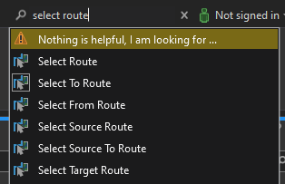
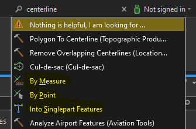

# Spike: Command Search in ArcGIS Pro

| Field | Value |
| --- | --- |
| **Doc** | 724 · Design Spike · Pro |
| **Product** | — |
| **Release** | — |
| **Issues** | — |
| **Source** | [Spike Command Search in Pro.pptx](<https://esriis.sharepoint.com/sites/LocationReferencing/Shared%20Documents/General/Spike%20Command%20Search%20in%20Pro.pptx>) |
| **People** | author Nathan Easley · PE — · dev — |
| **Edited** | 2021-03-24 23:37 by Nathan Easley |
| **Extracted** | 2026-09-04 · lane xmlstrip · format 3.0 · prompt v2.0.2 |
| **Keywords** | command search · arcgis pro · daml · command enable logic · contextual commands · command exclusion |
| **Tools** | — |

## Summary

Investigation into implementing and improving command search functionality within ArcGIS Pro. Covers contextual suggested commands, updating CommandSearchTerms.xml, enhancing DAML files with extendedCaption attributes, fixing command enable logic, and hiding duplicate or contextually inappropriate commands. Includes guidance on improving user experience with command search results.

## Related documents

<!-- related:begin -->
- [Migrate Location Referencing Pro Icons to XAML](<https://esriis.sharepoint.com/sites/lrsworkspace/LRS Doc Index/User Stories/migrate-lr-pro-icons-to-xaml.md>) — similar text 0.13 · 1 title word · 1 filename word · same surface/folder <!-- rel:835 s=2.467 -->
- [Conflict Prevention for Event Editing in Pro](<https://esriis.sharepoint.com/sites/lrsworkspace/LRS Doc Index/User Stories/conflict-prevention-for-event-editing-in-pro.md>) — similar text 0.05 · 1 title word · 1 filename word · same surface/folder <!-- rel:683 s=2.224 -->
- [Support Reverse Route in Pro](<https://esriis.sharepoint.com/sites/lrsworkspace/LRS%20Doc%20Index/User%20Stories/support-reverse-route-in-pro.md>) — similar text 0.04 · 1 title word · 1 filename word · same surface/folder <!-- rel:743 s=2.185 -->
- [Add Multiple Line Events tool in ArcGIS Pro](<https://esriis.sharepoint.com/sites/lrsworkspace/LRS Doc Index/User Stories/add-multiple-line-events-tool-in-pro.md>) — similar text 0.08 · 1 title word · same surface/folder <!-- rel:686 s=1.826 -->
- [Add Multiple Point Events tool in ArcGIS Pro](<https://esriis.sharepoint.com/sites/lrsworkspace/LRS Doc Index/User Stories/add-multiple-point-events-tool-in-pro.md>) — similar text 0.08 · 1 title word · same surface/folder <!-- rel:685 s=1.82 -->
<!-- related:end -->

---

## Slide 1 — Spike: Command Search in Pro

Spike

## Slide 2 — Command Search in Pro

The desktop architecture team is making a push to get command search supported fully within ArcGIS Pro.  They’ve asked each team to do the investigation below.
1. Determine the appropriate (contextual) Suggested Commands for your tabs.
Contextual Suggested Commands - the suggested commands list in Command Search dropdown can made contextual to the currently activated ribbon tab. This will be implemented at module level. Please follow the API documentation to implement changes for your module.
Spreadsheet for SuggestedCmds  has list of tabs by module to help with the process.
2. Add keywords to the CommandSearchTerms.xml file within your subsystem.
CommandSearchTerms.xml file is now available in daily builds with each extension folder at bin\Extensions. PEs and devs can modify this file to provide mapping between certain terms and commands.
https://devtopia.esri.com/ArcGISPro/desktop-architecture/wiki/Command-Search#commandsearchterms-xml
3. Add missing extendedCaption attributes in your DAML files.
Spreadsheet for DamlCmdSearch lists all the daml commands in the Pro system, and has a field for extendedCaption. Please check the commands from your team, and update extendedCaptions in daml files.
Documentation - https://devtopia.esri.com/ArcGISPro/desktop-architecture/wiki/DAML-Elements-(Plug-Ins)#extended-captions

## Slide 3 — Command Search in Pro

4. Resolve issues with your commands’ enable logic so that your commands are not improperly enabled out-of-context
Command Search exposes all commands in the system. Many of these show enabled even when they shouldn’t be enabled in the current application context.
Example: some mapping commands are enabled even when there is no map view; thus the commands are clickable, but do nothing when clicked.
Such commands can be updated to correct their context issues, or hidden (see below).
5. Hide commands that are functional duplicates, and those that are dependent on state like mouse cursor position.
Use daml attribute hidden="true" to exclude following commands from showing in command search results:

- Duplicates
- Custom Controls
- Positional contextual commands
Command Exclusion Tracking Spreadsheet: This spreadsheet contains a list of every daml command. If you see a command that should be hiddenm you can a note to exclude It.          
More info about exclusion is available at https://devtopia.esri.com/ArcGISPro/desktop-architecture/wiki/Command-Search#exclude-commands

## Slide 4 — Command Search in Pro

As part of the investigation make any changes to improve our tools experience within Command Search.
More information about Command Search can be found at Command Search · ArcGISPro/desktop-architecture Wiki (esri.com).

## Slide 5 — Additional Information

Yes, all buttons and tools that we have created so far have a DAML ID and are eligible for turning up in the new Command Search. I did a quick test and realized we have a bunch of unnecessary
commands turning up in the search bar which we should be hiding as Russell pointed out.

These commands are buttons which appear inside our editing panes, and I don’t see any benefit in having them appear in search results. If the necessary pane isn’t open, clicking these links don’t
do anything either.
Furthermore, some of the search result names aren’t fit for the command search experience IMO. Like:

## Slide 6 — Assignment

Story Points:
Dev:
