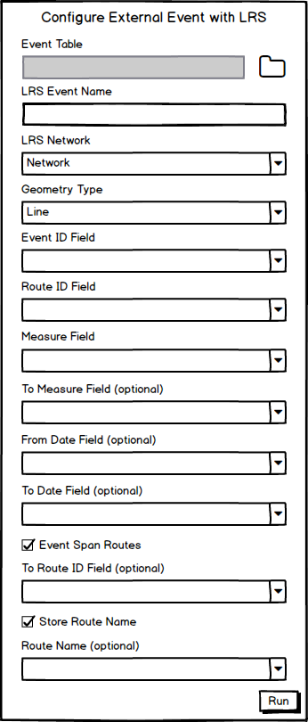

# Configure External Events

|   |   |
| --- | --- |
| **Kind** | Design Spike · Pro |
| **Release** | — |
| **Source** | [Configure External Events.pptx](<https://esriis.sharepoint.com/sites/LocationReferencing/Shared%20Documents/General/Configure%20External%20Events.pptx>) |
| **Edited** | 2020-05-01 18:41 by Nathan Easley |
| **Extracted** | 2026-09-04 · lane `xmlstrip` |

<!-- metadata
```yaml
title: "Configure External Events"
source_file: "Configure External Events.pptx"
source_url: "https://esriis.sharepoint.com/sites/LocationReferencing/Shared%20Documents/General/Configure%20External%20Events.pptx"
doc_id: 811
doc_kind: "Design Spike"
surface: "Pro"
doc_revision: ""
target_release: ""
pe: ""
dev: ""
author: "Nathan Easley"
last_edited_by: "Nathan Easley"
last_edited: "2020-05-01T18:41:18Z"
extracted: 2026-09-04
extraction_lane: xmlstrip
prompt_version: "v2.0.2"
keywords: ["external event", "event configuration", "geoprocessing tool", "event behaviors", "branch versioning", "database table", "feature class"]
tools: ["Configure External Event with LRS", "Modify Event Behaviors"]
products: []
issues: []
related: [{"doc":275,"file":"support-external-event-configuration-without-connection-file-test-plan__doc275.md","s":5.166},{"doc":744,"file":"support-updating-external-event-configuration__doc744.md","s":4.692},{"doc":288,"file":"create-external-event-with-no-connection-file__doc288.md","s":4.091},{"doc":812,"file":"relocate-events-in-pro__doc812.md","s":3.618},{"doc":246,"file":"external-system-integration-with-arcgis-roads-and-highways__doc246.md","s":3.172}]
```
-->

## Summary

This document describes a design spike for configuring external event data stored outside the LRS geodatabase to integrate with the LRS system. It outlines the creation of a new geoprocessing tool to register external events, requirements for input data, testing scenarios, and documentation plans. The goal is to enable LRS to access and update external event data while maintaining compatibility with existing ArcMap configurations and branch versioning in ArcGIS Pro.

## Related documents

<!-- related:begin -->
- [Support External Event Configuration Without Connection File – Test Plan](<https://esriis.sharepoint.com/sites/lrsworkspace/LRS Doc Index/Test Plans/support-external-event-configuration-without-connection-file-test-plan__doc275.md>) — similar text 0.25 · 1 title word · 3 filename words · same surface <!-- rel:275 -->
- [Support updating External Event configuration](<https://esriis.sharepoint.com/sites/lrsworkspace/LRS Doc Index/User Stories/support-updating-external-event-configuration__doc744.md>) — similar text 0.37 · 1 title word · 1 filename word · same surface/folder <!-- rel:744 -->
- [Create External Event with No Connection File](<https://esriis.sharepoint.com/sites/lrsworkspace/LRS Doc Index/User Stories/create-external-event-with-no-connection-file__doc288.md>) — similar text 0.24 · 1 title word · 1 filename word · same surface/folder <!-- rel:288 -->
- [Relocate Events in Pro](<https://esriis.sharepoint.com/sites/lrsworkspace/LRS Doc Index/Design Spikes/relocate-events-in-pro__doc812.md>) — similar text 0.22 · 1 title word · 1 filename word · same kind/surface/folder <!-- rel:812 -->
- [External system integration with ArcGIS Roads and Highways](<https://esriis.sharepoint.com/sites/lrsworkspace/LRS Doc Index/Other/external-system-integration-with-arcgis-roads-and-highways__doc246.md>) — similar text 0.22 · 1 title word · 1 filename word · same surface <!-- rel:246 -->
<!-- related:end -->

<!-- docs:begin -->
## Esri documentation

[External event registration](https://doc.esri.com/en/arcgis-pro/latest/help/production/location-referencing-pipelines/external-event-registration.html) · [Event behavior](https://doc.esri.com/en/arcgis-pro/latest/help/production/location-referencing-pipelines/what-is-event-behavior.html) · [View utility network feature class properties](https://doc.esri.com/en/arcgis-pro/latest/help/production/location-referencing-pipelines/view-utility-network-feature-class-properties.html)

_No page matched:_ [Configure External Event with LRS](https://www.google.com/search?q=%22Configure%20External%20Event%20with%20LRS%22+site%3Adoc.esri.com) · [Modify Event Behaviors](https://www.google.com/search?q=%22Modify%20Event%20Behaviors%22+site%3Adoc.esri.com)
<!-- docs:end -->

---

## Slide 1 — Configure External Events

Spike

## Slide 2 — User Story

As a LRS external system data owner, I need the ability to configure my event data stored outside the LRS gdb with the LRS, so that the LRS can access my data when providing updates based on LRS edits.

Cases
External System integration

## Slide 3 — Configure External Event with LRS

Create a new geoprocessing tool within the Events Configuration toolset called “Configure External Event with LRS”
Store the information for the external event in the controller dataset in a way that is compatible with how we stored them in ArcMap in the LRS Metadata table
External events configured in ArcMap should be recognized when moving an LRS gdb to use in Pro with branch versioning
Follow the existing rules for required fields/types when configuring the event in https://desktop.arcgis.com/en/arcmap/latest/extensions/roads-and-highways/registering-an-external-event-source.htm
Make sure the design aligns with GP design requirements (might need to move stuff around in the UI vs the field order for python to make it work)
Make sure the tool is 508 and l18n compliant
After tool completes running, add the information for the external event to the controller dataset
Make sure the external event appears in the LRS Hierarchy and is able to be added to the map for publishing in a service
Note: Event Behaviors would still be configured using the Modify Event Behaviors GP tool (if external events don’t work for that tool, make that fix as part of this story)



## Slide 4 — Configure External Event with LRS

The input external event should be a database table or feature class located outside the geodatabase that contains the LRS
We must have read access to the event table/fc
The LRS Event Name must be unique for the LRS
Show the names of the LRS Networks in the gdb in the LRS Network drop down
Event ID, Route ID, and Measure are required fields; see the previous slide for specific type/length requirements
To Measure becomes mandatory when a line event type is selected
To Route ID becomes mandatory when Event Span Routes is selected
From Date, To Date, and Route Name fields are optional


## Slide 5 — Testing

Negative

  - Feature Class/Table within the same gdb as the LRS
  - Invalid data type as the input
  - Event name already exists
  - Field types/lengths don’t meet requirements
Positive

  - Table as source
  - Feature Class as source
  - With dates
  - Without dates
  - With route name
  - Without route name
Verify existing external events from ArcMap will appear in Pro after running Modify LRS
Verify Event Behaviors can be configured/updated using an external event
Test with Oracle and SQL Server for the input event

## Slide 6 — Documentation

Create GP topic for the tool which includes code samples
Add information about external events to the Events Data Model topic
Create a topic specifically about requirements/configuration of external events within the LRS Data Model node of the help (use the existing ArcMap topic https://desktop.arcgis.com/en/arcmap/latest/extensions/roads-and-highways/registering-an-external-event-source.htm as a guide)

## Slide 7 — Questions

Do we want to support a map/feature service as an input?

## Slide 8 — Assignment

Story Points:
Dev:
PE:
