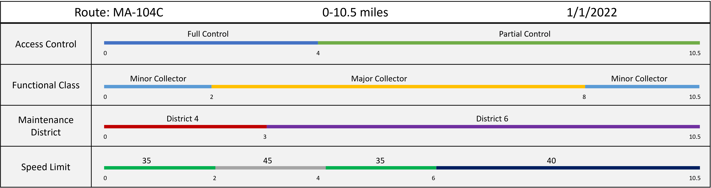

# Spike: Experience Builder UI

|   |   |
| --- | --- |
| **Kind** | Design Spike · Experience Builder |
| **Release** | — |
| **Source** | [Spike Experience Builder UI.pptx](<https://esriis.sharepoint.com/sites/LocationReferencing/Shared%20Documents/General/Spike%20Experience%20Builder%20UI.pptx>) |
| **Edited** | 2022-07-29 22:09 by Nathan Easley |
| **Extracted** | 2026-09-04 · lane `xmlstrip` |

<!-- metadata
```yaml
title: "Spike: Experience Builder UI"
source_file: "Spike Experience Builder UI.pptx"
source_url: "https://esriis.sharepoint.com/sites/LocationReferencing/Shared%20Documents/General/Spike%20Experience%20Builder%20UI.pptx"
doc_id: 651
doc_kind: "Design Spike"
surface: "Experience Builder"
doc_revision: ""
target_release: ""
pe: ""
dev: ""
author: "Nathan Easley"
last_edited_by: "Nathan Easley"
last_edited: "2022-07-29T22:09:49Z"
extracted: 2026-09-04
extraction_lane: xmlstrip
prompt_version: "v2.0.2"
keywords: ["experience builder", "straight line diagram", "dynamic segmentation", "event layers", "user interface", "lrs event", "hover interaction"]
tools: []
products: []
issues: []
related: [{"doc":824,"file":"spike-experience-builder__doc824.md","s":3.928},{"doc":348,"file":"experience-builder-straight-line-diagram-event-attributes-on-hover-click__doc348.md","s":3.307},{"doc":345,"file":"experience-builder-straight-line-diagram-event-attributes-editing-on-click__doc345.md","s":3.23},{"doc":292,"file":"support-overlapping-events-in-experience-builder-straight-line-diagram__doc292.md","s":3.181},{"doc":349,"file":"experience-builder-straight-line-diagram-symbology-and-display-field__doc349.md","s":3.086}]
```
-->

## Summary

This spike document explores building a sample UI within Experience Builder for a Straight-Line Diagram (SLD) that dynamically segments LRS event layers along a route. It investigates UI features such as layer toggling with greyscale effect, horizontal scrolling, attribute labeling, selection widgets, hover interactions, and image display for event records. The deliverable is a UI prototype and feasibility information for Experience Builder capabilities.

## Related documents

<!-- related:begin -->
- [Spike: Experience Builder](<https://esriis.sharepoint.com/sites/lrsworkspace/LRS Doc Index/Design Spikes/spike-experience-builder__doc824.md>) — similar text 0.18 · 2 title words · 2 filename words · same kind/surface/folder <!-- rel:824 -->
- [Experience Builder Straight Line Diagram Event Attributes on Hover/Click](<https://esriis.sharepoint.com/sites/lrsworkspace/LRS Doc Index/User Stories/experience-builder-straight-line-diagram-event-attributes-on-hover-click__doc348.md>) — similar text 0.19 · 2 title words · same surface/folder <!-- rel:348 -->
- [Experience Builder Straight Line Diagram Event Attributes/Editing on Click](<https://esriis.sharepoint.com/sites/lrsworkspace/LRS Doc Index/User Stories/experience-builder-straight-line-diagram-event-attributes-editing-on-click__doc345.md>) — similar text 0.18 · 2 title words · same surface/folder <!-- rel:345 -->
- [Support Overlapping Events in Experience Builder Straight Line Diagram](<https://esriis.sharepoint.com/sites/lrsworkspace/LRS Doc Index/User Stories/support-overlapping-events-in-experience-builder-straight-line-diagram__doc292.md>) — similar text 0.15 · 2 title words · same surface/folder <!-- rel:292 -->
- [Experience Builder Straight Line Diagram Symbology and Display Field](<https://esriis.sharepoint.com/sites/lrsworkspace/LRS Doc Index/User Stories/experience-builder-straight-line-diagram-symbology-and-display-field__doc349.md>) — similar text 0.15 · 2 title words · same surface/folder <!-- rel:349 -->
<!-- related:end -->

<!-- docs:begin -->
## Esri documentation

[Apply dynamic segmentation](https://doc.esri.com/en/arcgis-pro/latest/help/production/location-referencing-pipelines/apply-dynamic-segmentation.html) · [View LRS event properties](https://doc.esri.com/en/arcgis-pro/latest/help/production/location-referencing-pipelines/view-lrs-event-properties.html)

_No page matched:_ [experience builder](https://www.google.com/search?q=%22experience%20builder%22+site%3Adoc.esri.com)
<!-- docs:end -->

---

## Slide 1 — Spike: Experience Builder UI

Spike

## Slide 2 — Experience Builder UI

Build a sample UI within Experience Builder using the design on the next slide for a Straight-Line Diagram (SLD)
Investigate how to/incorporate the the following elements into the design:

  - A UI that can show LRS event layers dynamically segmented along a route (different colors for the different event attributes)
  - Be able to turn the layers on/off in the SLD
  - When a layer is turned off, change it to greyscale colors and move it to the bottom of the SLD UI
  - Provide an experience to be able to scroll horizontally in the SLD in case the route is very long
  - Determine how to best label the attributes for each event record shown in the SLD (we also need to be able to label the event layers that are part of the SLD, the beginning measure, end measure, and measures at defined intervals along the route)
  - Verify if other selection widgets can be used to select the route to dynamically segment for the SLD display
  - Investigate being able to hover along the route in the map and show a cross section of the events in the SLD
  - Investigate hover over one of the event records in the SLD and showing emphasis and additional attributes (such as measure range for the record); also see if the map can highlight the selected record on the map
  - Investigate if images can be configured so they display for certain event records (most likely point events like signs)
Deliverable from this spike is a UI along with additional information about what is/is not possible within Experience Builder

## Slide 3




## Slide 4 — Assignment

Story Points:
Dev:
