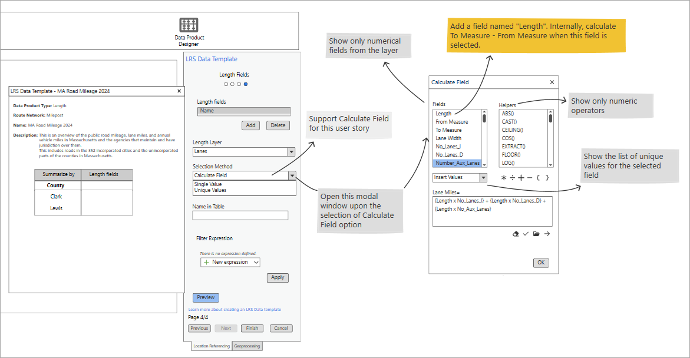

# Spike: Using the Calculate Field Control with the LRS Data Product Designer

| Field | Value |
| --- | --- |
| **Doc** | 237 · Design Spike · Pro |
| **Product** | — |
| **Release** | — |
| **Issues** | — |
| **Source** | [Spike_CalculateField.pptx](<https://esriis.sharepoint.com/sites/LocationReferencing/Shared%20Documents/General/Spike_CalculateField.pptx>) |
| **People** | author Rahul Rakshit · PE — · dev — |
| **Edited** | 2025-02-05 21:14 by Rahul Rakshit |
| **Extracted** | 2026-09-04 · lane xmlstrip · format 3.0 · prompt v2.0.2 |
| **Keywords** | calculate field · data product designer · proxy field · length · attribute table |
| **Tools** | Calculate field control |

## Summary

Investigation of using the Calculate field control from the attribute table in ArcGIS Pro within the LRS Data Product Designer. Evaluation includes the possibility of adding a proxy field called 'Length' to the field list and proposing solutions to support user story development.

## Related documents

<!-- related:begin -->
- [Date Comparison Data Product User Story and Design](<https://esriis.sharepoint.com/sites/lrsworkspace/LRS Doc Index/User Stories/date-comparison-data-product-and-design.md>) — similar text 0.09 · 1 title word · same surface/folder <!-- rel:162 s=2.242 -->
- [Generate LRS Data Product Support Summary and Length](<https://esriis.sharepoint.com/sites/lrsworkspace/LRS%20Doc%20Index/User%20Stories/generate-lrs-data-product-support-summary-and-length.md>) — similar text 0.10 · 1 title word · same surface/folder <!-- rel:357 s=2.213 -->
- [Conflict Prevention for Event Editing in Pro – Core Tools](<https://esriis.sharepoint.com/sites/lrsworkspace/LRS Doc Index/Test Plans/conflict-prevention-for-event-editing-in-pro-core-tools-v4.md>) — similar text 0.03 · same surface <!-- rel:670 s=1.843 -->
- [Support updating measures option in cartographic realignment](<https://esriis.sharepoint.com/sites/lrsworkspace/LRS Doc Index/User Stories/support-updating-measures-option-in-cartographic-realignment.md>) — similar text 0.06 · same surface/folder <!-- rel:736 s=1.436 -->
- [Generate Length Summary Geoprocessing Tool](<https://esriis.sharepoint.com/sites/lrsworkspace/LRS Doc Index/Other/generate-length-summary-gp.md>) — similar text 0.03 · same surface/folder <!-- rel:282 s=1.432 -->
<!-- related:end -->

<!-- docs:begin -->
## Esri documentation

[Create a template for an LRS length data product](https://doc.esri.com/en/arcgis-pro/latest/help/production/roads-highways/create-a-template-for-an-lrs-length-data-product.html) · [Event editing using the attribute table](https://doc.esri.com/en/arcgis-pro/latest/help/production/location-referencing-pipelines/event-editing-using-the-attribute-table.html)

_No page matched:_ [Calculate field control](https://www.google.com/search?q=%22Calculate%20field%20control%22+site%3Adoc.esri.com)
<!-- docs:end -->

---

## Slide 1 — Spike: Using the calculate field control with the LRS Data Product Designer

With reference to the design provided here, investigate:

- Can we use the Calculate field control used by the attribute table in Pro.
- Can we add a proxy field called “Length” in the field list.
Report the findings and propose solutions (if needed) to help us write the user story.

## Slide 2 — Estimate
