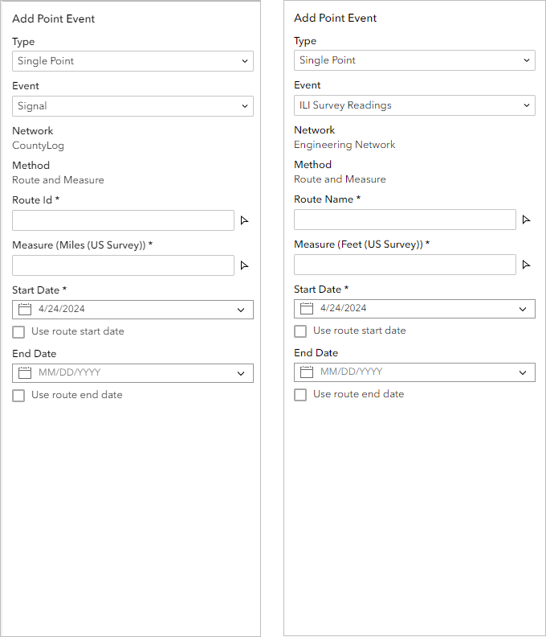
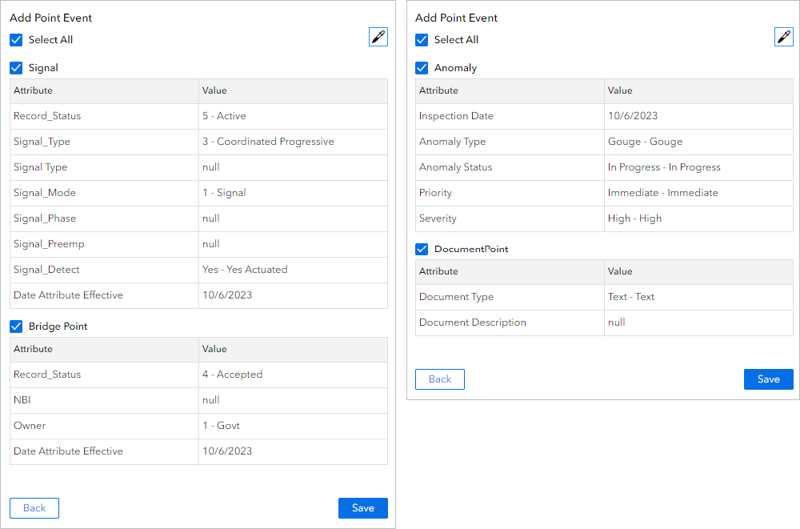

# Add Point Event widget

| Field | Value |
| --- | --- |
| **Doc** | 139 · Other · Experience Builder |
| **Product** | Roads & Highways · Pipeline Referencing |
| **Release** | — |
| **Issues** | [Beijing-R-D-Center/ExperienceBuilder-Web-Extensions#24791](https://devtopia.esri.com/Beijing-R-D-Center/ExperienceBuilder-Web-Extensions/issues/24791) |
| **Source** | [24791-AddPointEvent_CoordinatesMethod_V1.docx](<https://esriis.sharepoint.com/sites/LocationReferencing/Shared%20Documents/General/Doc%20Reviews/Pro36_Ent12/24791_AddPointLineWidgets_Coordinates/24791-AddPointEvent_CoordinatesMethod_V1.docx>) · rev V1 |
| **People** | author — · PE — · dev — |
| **Edited** | 2025-08-18 19:52 by unknown |
| **Extracted** | 2026-09-04 · lane xmlstrip · format 3.0 · prompt v2.0.2 |
| **Keywords** | point event · route · measure · coordinates method · attribute set · data actions · pipeline referencing · roads and highways |
| **Tools** | Add Point Event · Search By Route · LRS Identify · Table |

## Summary

Describes the Add Point Event widget used to create point events along routes in a Linear Referencing System (LRS) for pipeline and roadway data. Covers usage examples, configuration settings, methods for adding point events by route and measure or coordinates, and integration with other widgets via data actions.

## Related documents

<!-- related:begin -->
- [Add Line Event widget](<https://esriis.sharepoint.com/sites/lrsworkspace/LRS Doc Index/Other/24791-add-line-event-widget.md>) — shared issue Beijing-R-D-Center/ExperienceBuilder-Web-Extensions#24791 · similar text 0.80 · 3 title words · 4 filename words · same kind/surface/folder <!-- rel:138 s=1009.42 -->
- [Coordinates Method in Add Point and Add Line Widgets Test Plan](<https://esriis.sharepoint.com/sites/lrsworkspace/LRS Doc Index/Test Plans/24791-coordinates-method-in-add-point-and-add-line-widgets.md>) — shared issue Beijing-R-D-Center/ExperienceBuilder-Web-Extensions#24791 · similar text 0.12 · 2 title words · 2 filename words · same surface <!-- rel:49 s=1003.799 -->
- [Add Line Event Widget](<https://esriis.sharepoint.com/sites/lrsworkspace/LRS%20Doc%20Index/Other/add-line-event-widget-2024-03-2.md>) — similar text 0.46 · 3 title words · 1 filename word · same kind/surface <!-- rel:411 s=4.39 -->
- [Add Line Event Widget](<https://esriis.sharepoint.com/sites/lrsworkspace/LRS Doc Index/Other/add-line-event-widget-2024-03.md>) — similar text 0.46 · 3 title words · 1 filename word · same kind/surface <!-- rel:410 s=4.39 -->
- [Add Line Event Widget](<https://esriis.sharepoint.com/sites/lrsworkspace/LRS Doc Index/Other/add-line-event-widget-2024-03-4.md>) — similar text 0.45 · 3 title words · 1 filename word · same kind/surface <!-- rel:413 s=4.36 -->
<!-- related:end -->

<!-- docs:begin -->
## Esri documentation

[Release locks through the LRS Locks table](https://doc.esri.com/en/arcgis-pro/latest/help/production/roads-highways/lrs-locks-table.html) · [Split a centerline by measure](https://doc.esri.com/en/arcgis-pro/latest/help/production/roads-highways/split-a-centerline-by-measure.html) · [3D in Pipeline Referencing](https://doc.esri.com/en/arcgis-pro/latest/help/production/location-referencing-pipelines/3d-in-pipeline-referencing.html) · [3D in Roads and Highways](https://doc.esri.com/en/arcgis-pro/latest/help/production/roads-highways/3d-in-roads-and-highways.html)

_No page matched:_ [Add Point Event](https://www.google.com/search?q=%22Add%20Point%20Event%22+site%3Adoc.esri.com) · [Search By Route](https://www.google.com/search?q=%22Search%20By%20Route%22+site%3Adoc.esri.com) · [LRS Identify](https://www.google.com/search?q=%22LRS%20Identify%22+site%3Adoc.esri.com)
<!-- docs:end -->

---

## Add Point Event widget
The Add Point Event widget allows you to create point events along routes in a Linear Referencing System (LRS). You can use the widget to manage pipeline data with ArcGIS Pipeline Referencing and roadways data with ArcGIS Roads and Highways. You can represent characteristics of a route, such as inline inspection (ILI) survey readings for a pipeline or speed limit signs for a road, as single point events with measure information along the route.

### Examples for Pipeline Referencing
Use this widget to support app design requirements such as the following:

- You want to add anomaly information along a route.
- You want to add anomaly, inspection note, and documentation point information along a route in a single operation.
- You want to add event data to pipeline routes by entering station numbers, where the station measure values are used to calculate route and measure values for events.
- You want to add anomaly event data based on coordinates collected by field operators.

### Examples for Roads and Highways
Use this widget to support app design requirements such as the following:

- You want to add crash information along a route.
- You want to add stop sign, reference post, and bridge point information along a route in a single operation.
- You want to add event data to highway routes by entering station numbers, where the station measure values are used to calculate route and measure values for events.
- You want to add crash event data based on coordinates collected by first responders.

### Usage notes
This widget requires connection to a Map widget. To add point events, the Map widget must be connected to a web map data source with an LRS published with the Linear Referencing and Version Management capabilities enabled.
To create an LRS and publish a feature service with the Linear Referencing and Version Management capabilities enabled, follow the steps in the ArcGIS Pro documentation:

- Pipeline Referencing—Create an LRS and share an LRS as web layers
- Roads and Highways—Create an LRS and share an LRS as web layers
To use the Add Point Event widget with linear referencing services published with ArcGIS Enterprise, you must be signed in with an ArcGIS Enterprise account.
When you include this widget in an app, a panel provides users with the following parameters for adding a point event:

- Type—Choose to add single or multiple point events.
  - Single Point—Add a single point event.
  - Multiple Point—Add multiple point events in one edit activity.
- Event (appears when you choose Single Point under Type)—Choose the event layer from which to add a point event.
- Network—This label lists the network layer associated with the selected event.
- Attribute Set (appears when you choose Multiple Point under Type)—If a layer is configured with attribute sets for Pipeline Referencing or attribute sets for Roads and Highways, you can choose one from the drop-down menu. The widget only displays point events that are part of the attribute set. Attribute sets are collections of event layer attributes. You can use attribute sets to create multiple events with a set of additional, organization-specific attributes in a single edit.
- Method—The method the widget uses to specify the location of added point events is listed here.
  - Route and Measure – Add a point event to a route using a specific measure.
    - Route ID or Route Name—Provide a route ID or name for the route where you want to add a point event. If the network layer has route name configured as an identifier, this setting is labeled Route Name If the network layer has route name configured as an identifier, this setting is labeled Route Name.
    - Measure—Provide a measure value. The measure value defines the exact location on the route where the added event will be located. The label for this parameter setting also displays the unit of measure defined by the network layer. For example, if the unit of measure is meters, at run time this setting parameter is labeled Measure (Meters).
  - Coordinate – Add a point event to a route using x-, y-, and z- coordinates.
    - Route ID or Route Name—Provide a route ID or name for the route where you want to add a point event. If the network layer has route name configured as an identifier, this setting is labeled Route Name.
    - X Coordinate – Provide the X cCoordinate.
    - Y Coordinate – Provide the Y cCoordinate.
    - Z Coordinate – Optionally, provide the Z Coordinate.
    - Measure – This label notes the nearest measure to the input coordinates. The label for this setting parameter also displaysed the unit of measure defined by the network layer. For example, if the unit of measure is meters, at run time this setting is labeled Measure (Meters).
    - Distance – This label notes the distance between the input coordinates and the nearest measure. The label for this parameter also displays the distance between the input coordinates and the nearest measure in the unit of measure defined by the network layer. For example, if the input coordinates are 10 meters away from the route, at run time this parameter is labeled Distance (Meters).
- Start Date—Specify the start date of the event or events.
- End Date—Specify the end date of the event or events.

### Settings

### The Add Point Event widget includes the following settings:

- Select Map—Select a Map widget.
- Load Layers—Load layers from the web maps in the connected Map widget. To load layers, the Map widget must be connected to a web map with LRS layers.
- Clear Layers—Remove all loaded layers from the widget.
- Layer Configuration—Click a layer to open the Layer Configuration panel.
  - LRS Network Layers
    - Label—Provide a meaningful label for the layer. This label appears in the widget panel at run time.
    - Search Methods – Choose a method to use when adding events.
      - Route and Measure – If you choose this method, the widget specifies the location of added point events using the route name and measure value that the user provides.
      - Coordinate – If you choose this method, the widget specifies the location of added points using the x-, y-, and z- coordinates that the user provides.
    - Spatial Reference – Set a spatial reference for the Coordinate mMethod. You can use the spatial reference from the Mmap or from the LRS layers.
    - Search Radius – Set a search radius.
  - LRS Event Layers –
    - Label—Provide a meaningful label for the layer. This label appears in the widget panel at run time.
    - Use field alias—Turn on this setting to display field aliases at run time. An https://enterprise.arcgis.com/en/portal/11.5/use/describe-fields.htm  \halias, or display name, is an alternative name for a field. It is usually a more user-friendly description of the content of the field. Unlike true field names, aliases do not have to adhere to the limitations of the database, so they can contain special characters such as spaces.
    - Configure Fields—Choose which attribute fields from the layer to include in the widget panel at run time. You can define whether each attribute field is editable at run time by clicking Editable or Not editable.
  - Note:
  - The settings you define under Configure Fields only apply when the user is adding a single point event. For multiple points events, fields display if they are included in the attribute set the user chooses at run time.
- Default Settings—Configure the default settings that you want available in the widget when it first loads.
  - Event (Single Point)—Choose the default event layer for adding single point events.
  - Network (Multiple Point)—Choose the default network layer for adding multiple point events. When the user is adding single point events, the network is always the registered network for the selected event layer.
  - Method—Choose the default method for how the widget defines the event location when adding point events. You can choose the following method:
    - Route and measure—If you choose this method, the widget specifies the location of added point events using the route name and measure value that the user provides.
  - Type—Choose whether the widget is set to add single events or multiple events.
  - Attribute Set—If a layer is configured with https://pro.arcgis.com/en/pro-app/3.5/help/production/location-referencing-pipelines/configure-attribute-sets.htm \hattribute sets for Pipeline Referencing or https://pro.arcgis.com/en/pro-app/3.5/help/production/roads-highways/configure-attribute-sets.htm \hattribute sets for Roads and Highways, you can choose a default one from the drop-down menu. The widget only displays point events that are part of the attribute set. Attribute sets are collections of event layer attributes. You can use attribute sets to create multiple events with a set of additional, organization-specific attributes in a single edit.
- Display Settings—Choose which settings to display in the widget panel at run time. If you choose to hide a setting here, the widget settings you configure under Default Settings are unchangeable by the user at run time.
  - Hide Type—Hide the Type setting from the widget panel.
  - Hide Event—Hide the Event setting from the widget panel.
  - Hide Network—Hide the Network setting from the widget panel.
  - Hide Method—Hide the Method setting from the widget panel.
  - Hide Attribute Set—Hide the Attribute Set setting from the widget panel.

### Add a point event by rRoute and mMeasure
Complete the following steps to add a point event using the Route and Measure method.

1. Start Experience Builder. Sign in to an ArcGIS Enterprise portal.

1. Add a Map widget. Connect it to a web map with LRS data published with the Linear Referencing capability enabled and, optionally, the Version Management capability enabled.

- Learn more about enabling these capabilities in ArcGIS Pro for Pipeline Referencing
- Learn more about enabling these capabilities in ArcGIS Pro for Roads and Highways

1. Add an Add Point Event widget. Connect it to the Map widget, and load LRS layers from the Map widget.

1. Publish the app.

1. Launch the app. If prompted, sign in to your ArcGIS Enterprise portal.

1. Zoom to the location where you want to add a point event.

- Note:
- To zoom to route locations, you can use the
- Search By Route widget
- or use
- data actions
- with the Search By Route widget or Table widget.

1. Open the Add Point Event widget.

1. Use the default type or click the Type drop-down arrow and change the type, if necessary.

1. If Type is set to Single Point, use the default point event layer or click the Event drop-down arrow and choose another point event layer.

- The value that appears under Network is based on the selected event layer.

1. If Type is set to Multiple Point, use the default attribute set or choose another attribute set.

1. If there are multiple methods configured in the widget settings, choose Route and Measure from the Method drop-down menu.

1. Specify a route by doing one of the following:

  - Provide a route ID in the Route ID text box.
  - Click the route picker , and click a route on the map.
  - The Measure value populates based on the location you click.

1. Specify a location for the point event by doing one of the following:

  - Provide a measure value in the Measure text box.
  - Note:
  - Stationing measure values are also supported.
  - Click the measure picker , and click a point along the route.
  - Once you provide a measure value, a green dot appears at that location on the map.

1. Specify the start date of the event by doing one of the following:

  - Leave the default start date, which is the current date.
  - Provide a start date in the Start Date text box.
  - Click the calendar button  and choose a start date.
  - Check the Use route start date check box.

1. Optionally, specify the end date for the point event by doing one of the following:

  - Provide an end date in the End Date text box.
  - Click the calendar button  and choose an end date.
  - Check the Use route end date check box.
  - Note:
  - If you do not provide an end date, the event continues forever into the future.

1. Click Next.

- The attributes for the chosen point event appear in a second pane.

1. Provide attribute values for the event layer.

- You can use the Copy Attributes tool to copy attributes from an existing event.

1. Click Save.

- A confirmation message appears in the tool pane once the new point event is added and appears on the map.

### Add a point event by coordinates

1. Start Experience Builder. Sign in to an ArcGIS Enterprise portal.

1. Add a Map widget. Connect it to a web map with LRS data published with the Linear Referencing capability enabled and, optionally, the Version Management capability enabled.

- https://pro.arcgis.com/en/pro-app/3.5/help/production/location-referencing-pipelines/share-web-layers-with-linear-referencing-capability.htm \hLearn more about enabling these capabilities in ArcGIS Pro for Pipeline Referencing
- https://pro.arcgis.com/en/pro-app/3.5/help/production/roads-highways/share-as-web-layers.htm \hLearn more about enabling these capabilities in ArcGIS Pro for Roads and Highways

1. Add an Add Point Event widget. Connect it to the Map widget, and load LRS layers from the Map widget.

1. Publish the app.

1. Launch the app. If prompted, sign in to your ArcGIS Enterprise portal.

1. Zoom to the location where you want to add a point event.

- Note:
- To zoom to route locations, you can use the Search By Route widget or use data actions with the Search By Route widget or Table widget.

1. Open the Add Point Event widget.
[ADD SCREENSHOTS HERE]

1. Use the default type or click the Type drop-down arrow and change the type, if necessary.

1. If Type is set to Single Point, use the default point event layer or click the Event drop-down arrow and choose another point event layer.
The value that appears under Network is based on the selected event layer.

1. If Type is set to Multiple Point, use the default attribute set or choose another attribute set.

1. If there are multiple methods configured in the widget settings, choose Coordinate from the Method drop-down menu.

1. Specify a route by doing one of the following:

  - Provide a route ID in the Route ID text box.
  - Click the route picker [INSERT ROUTE PICKER ICON HERE], and click a route on the map.
  - Leave the Route ID text box blank and proceed to the next step. Once valid values are input provided into the X Coordinate, Y Coordinate, and optionally Z Coordinate (optional) text boxes, the nearest route’s route ID will populate the RouteID text box.

1. Specify a location for the point event by providing values in the X Coordinate and Y Coordinate text boxes. Optionally, provide a value in the Z Coordinate text box.

1. Specify the start date of the event by doing one of the following:

  - Leave the default start date, which is the current date.
  - Provide a start date in the Start Date text box.
  - Click the calendar button   and choose a start date.
  - Check the Use route start date check box.

1. Optionally, specify the end date for the point event by doing one of the following:

  - Provide an end date in the End Date text box.
  - Click the calendar button   and choose an end date.
  - Check the Use route end date check box.

1. Note:

1. If you do not provide an end date, the event continues forever into the future.

1. Click Next

1. Provide attribute values for the event layer.
You can use the Copy Attributes tool to copy attributes from an existing event.
[ADD SCREENSHOTS HERE]

1. Click Save.
A confirmation message appears in the tool pane once the new point event is added and appears in the map.

### Interaction options
You can use data actions in other widgets to launch the Add Point Event widget and populate associated values. To be able to use data actions, the network in the source widget must have associated point events, the data action options of Add Point Event in the source widget must be turned on, and the Add Point Event widget must be configured in the experience. Turn off the data action options of Add Point Event in the source widget to not use data actions.
The following widgets support data actions of the Add Point Event widget:

- https://doc.arcgis.com/en/experience-builder/11.5/configure-widgets/lrs-identify-widget.htm \hLRS Identify widget—Data action populates the event or attribute set, network, route, measure, and date options.
- https://doc.arcgis.com/en/experience-builder/11.5/configure-widgets/search-by-route-widget.htm \hSearch By Route widget—Data action populates the event or attribute set, network, route, measure, and date options.
- https://doc.arcgis.com/en/experience-builder/11.5/configure-widgets/table-widget.htm \hTable widget—Data action populates the event or attribute set, network, route, and date options.

#### Run data actions with the Search By Route widget
To use the data action at run time with the Search By Route widget, complete the following steps:

1. Select a result record in the Search By Route results.

1. Click the Action button at the top of the Search By Route widget panel.

1. Add a point event by doing one of the following:

  - Click Add Point Event, provide a measure value in the Measure option, and add attributes for the new point event.
  - The Event, Network, Route ID or Route Name, Measure, Start Date, and End Date parameters populate based on the selected route from the Search By Route widget.
  - If the searched result contains a route with a single measure value, choose Add Point Event to be the measure of the point event to be added.
  - The Event, Network, Route ID or Route Name, Measure, Start Date, and End Date parameters populate based on the selected route from the Search By Route widget.
Note:
You can change any values after they are populated. If you do, the Add Point Event widget still validates all entries.

#### Run data actions with the Table widget
To use the data action at run time with the Table widget, complete the following steps:

1. Select a record in the Table widget.

1. Click the Action button at the top of the Table widget panel.

1. Click Add Point Event.

- The Event or Attribute Set, Network, Route ID or Route Name, and Event OID parameters populate based on the selected event from the table. The Start Date and End Date values are populated using the start and end dates of the searched route.
Note:
You can change any values after they are populated. If you do, the Add Point Event widget still validates all entries.

#### Run data actions with the LRS Identify widget
To use the data action at run time with the LRS Identify widget, complete the following steps:

1. Identify a location on a route with the LRS Identify widget.

1. Click the Action button at the top of the LRS Identify widget panel.

1. Click Add Point Event.

- The Event, Network, Route ID or Route Name, Measure, Start Date, and End Date parameters are populated based on the route and location from the LRS Identify widget.

