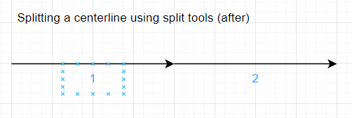
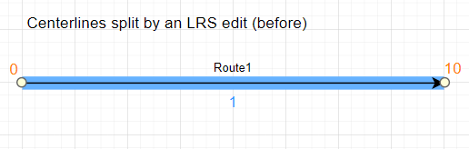
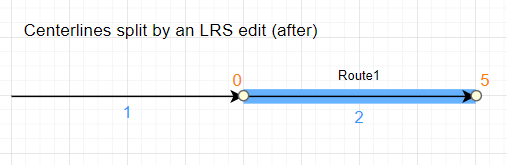

# Manage Roads and Highways with Address Data Management

| Field | Value |
| --- | --- |
| **Doc** | 403 · Other · Pro |
| **Product** | Roads & Highways |
| **Release** | — |
| **Issues** | [ArcGISPro/ps-location-referencing#5646](https://devtopia.esri.com/ArcGISPro/ps-location-referencing/issues/5646) |
| **Source** | [5646_AM-RH_V2.docx](<https://esriis.sharepoint.com/sites/LocationReferencing/Shared%20Documents/General/Doc%20Reviews/5646_AM-RH_V2.docx>) · rev V2 |
| **People** | author Mac Christmas · PE — · dev — |
| **Edited** | 2024-03-19 14:21 by Mac Christmas |
| **Extracted** | 2026-09-04 · lane xmlstrip · format 3.0 · prompt v2.0.2 |
| **Keywords** | address data management · roadway characteristic · centerline · line event · site address · address range · linear referencing system · dynamic segmentation |
| **Tools** | Configure Address Feature Classes · Create LRS · Create LRS From Existing Dataset · Create LRS Event · Create LRS Event From Existing Dataset · Create LRS Network · Create LRS Network From Existing Dataset · Append Routes · Append Events · Split Centerline By Point · Apply Event Behaviors · Overlay Events |

## Summary

This document describes how to manage address and roadway characteristic data together within a single geodatabase using ArcGIS Roads and Highways and the Address Data Management solution. It covers requirements, configuration, data loading, publishing, editing workflows, and combined analysis capabilities for integrating LRS and address management data. The document also details necessary feature classes, fields, and geoprocessing tools for deployment and editing in ArcGIS Pro and ArcGIS Enterprise.

## Related documents

<!-- related:begin -->
- [Manage Address and Roadway Characteristic Data Together](<https://esriis.sharepoint.com/sites/lrsworkspace/LRS Doc Index/Other/5646-manage-address-and-roadway-characteristic-data-together.md>) — shared issue ArcGISPro/ps-location-referencing#5646 · similar text 0.76 · 2 title words · same kind/surface/folder <!-- rel:400 s=1007.202 -->
- [Pro 3.3 and 11.3 Iteration Issue Tracking](<https://esriis.sharepoint.com/sites/lrsworkspace/LRS%20Doc%20Index/Schedules/504-pro-3-3-and-11-3-iteration-issue-tracking.md>) — shared issue ArcGISPro/ps-location-referencing#5646 · similar text 0.02 · same surface/folder <!-- rel:366 s=1001.412 -->
- [Manage Address and Roadway Characteristic Data Together with Roads and Highways and Address Data Management Solution](<https://esriis.sharepoint.com/sites/lrsworkspace/LRS Doc Index/Other/5783-manage-address-and-roadway-characteristic-data-together.md>) — similar text 0.70 · 5 title words · same kind/surface <!-- rel:276 s=7.94 -->
- [Manage Address and Roadway Characteristic Data Together](<https://esriis.sharepoint.com/sites/lrsworkspace/LRS Doc Index/Other/5930-manage-address-and-roadway-characteristic-data-together.md>) — similar text 0.70 · 2 title words · same kind/surface/folder <!-- rel:327 s=7.04 -->
- [Manage Address and Roadway Characteristic Data Together](<https://esriis.sharepoint.com/sites/lrsworkspace/LRS Doc Index/Other/6267-manage-address-and-roadway-characteristic-data-together.md>) — similar text 0.61 · 2 title words · same kind/surface <!-- rel:250 s=6.046 -->
<!-- related:end -->

<!-- docs:begin -->
## Esri documentation

[Create and modify LRS events](https://doc.esri.com/en/arcgis-pro/latest/help/production/roads-highways/create-and-modify-lrs-events.html) · [Create and modify an LRS Network](https://doc.esri.com/en/arcgis-pro/latest/help/production/roads-highways/create-and-modify-an-lrs-network.html) · [Split a centerline by point](https://doc.esri.com/en/arcgis-pro/latest/help/production/roads-highways/split-a-centerline-by-point.html) · [Manage address and roadway characteristic data together](https://doc.esri.com/en/arcgis-pro/latest/help/production/roads-highways/manage-address-and-roadway-characteristic-data-together.html) · [Merge centerlines](https://doc.esri.com/en/arcgis-pro/latest/help/production/roads-highways/merge-centerlines.html) · [View site address point properties](https://doc.esri.com/en/arcgis-pro/latest/help/production/roads-highways/view-site-address-point-properties.html) · [Apply dynamic segmentation](https://doc.esri.com/en/arcgis-pro/latest/help/production/roads-highways/apply-dynamic-segmentation.html)

_No page matched:_ [Configure Address Feature Classes](https://www.google.com/search?q=%22Configure%20Address%20Feature%20Classes%22+site%3Adoc.esri.com) · [Create LRS](https://www.google.com/search?q=%22Create%20LRS%22+site%3Adoc.esri.com) · [Create LRS From Existing Dataset](https://www.google.com/search?q=%22Create%20LRS%20From%20Existing%20Dataset%22+site%3Adoc.esri.com) · [Create LRS Event From Existing Dataset](https://www.google.com/search?q=%22Create%20LRS%20Event%20From%20Existing%20Dataset%22+site%3Adoc.esri.com) · [Create LRS Network From Existing Dataset](https://www.google.com/search?q=%22Create%20LRS%20Network%20From%20Existing%20Dataset%22+site%3Adoc.esri.com) · [Append Routes](https://www.google.com/search?q=%22Append%20Routes%22+site%3Adoc.esri.com) · [Append Events](https://www.google.com/search?q=%22Append%20Events%22+site%3Adoc.esri.com) · [Apply Event Behaviors](https://www.google.com/search?q=%22Apply%20Event%20Behaviors%22+site%3Adoc.esri.com) · [Overlay Events](https://www.google.com/search?q=%22Overlay%20Events%22+site%3Adoc.esri.com)
<!-- docs:end -->

---

## Manage Roads and Highways with Address Data Management address and roadway characteristic data together
For users that need to You can manage address and roadway characteristic data in their your organization, with ArcGIS Roads and Highways can support managing this data within in a linear referencing system (LRS).  ArcGIS Roads and Highways can be configured with the Address Data Management solution in a single geodatabase by including aAddress rRange fields within the ArcGIS Roads and Highways Centerline feature class. For users thatIf you want to manage address information on the LRS, this information can be added to a line event feature class or the LRS Centerline feature class. In both configurations, users would also configure the Site Address feature class needs to be configured with the LRS.
In ArcGIS, the Address Data Management solution can be used to maintain and improve upon an authoritative address repository. The solution contains a set of capabilities designed to help maintain, improve, and share address information.
The sections below describe the information model changes needed to maintain and edit both an LRS and address management solution within a single geodatabase using tools within ArcGIS Pro. Guidance is provided for loading data and publishing services with data managed by both capabilities.

### Requirements
You can use an out-of-the-box data model or customize a data model to meet your organization's rules and requirements, as long asif the required feature classes and tables in the Roads and Highways information model and Address Data Management solution are present in a single database.

- You can simplify the deployment process for the Address Data Management solution by deploying the solutionit to your organization’s ArcGIS Enterprise PPportal and then loading your LRS data into the solution. The https://prodev.arcgis.com/en/pro-app/latest/tool-reference/location-referencing/configure-address-feature-classes.htmConfigure Address Feature Classes
following tool will help to simplify the deployment process: associates the Centerline or line event feature classes and the Site Address feature class as part of the Address Data Management solution and LRS.

- https://prodev.arcgis.com/en/pro-app/latest/tool-reference/location-referencing/configure-address-feature-classes.htmConfigure Address Feature Classes
https://docdev.arcgis.com/en/arcgis-solutions/11.2/reference/introduction-to-address-data-management.htmLearn more about deploying the Address Data Management solution to your ArcGIS PEnterprise portal

To create a custom data model other than the Address Data Management solution, ensure that the required feature classes and tables for the solution and an LRS are present. This includes the Centerline or line event feature class and the Site Address Point feature class, which should be part of both the solution and the LRS.

| LRS data model |  | Address Data Management data model |
| --- | --- | --- |
| Centerline |  | Road Centerlines |
| Centerline Sequence |  | Site Address |
| Calibration Point |  | Address Line |
| Redline |  | Address Point |
|  |  | Entrance Points |
|  |  | Geopolitical Areas |
|  |  | Address Topology |

The following are required feature classes for the Roads and Highways schema to integrate with the Address Data Management solution:

- Centerline or line event
- Centerline Sequence
- Calibration Point
- Redline
The following are required Address Data Management solution feature classes to integrate with Roads and Highways:

- Road Centerlines
- Site Address
- Address Line
- Address Point
- Entrance Points
- Geopolitical Areas
- Address Topology
The following fields must be present in the Centerline or lLine Eevent feature class to successfully configure with an LRS and to take advantage of Roads and Highways and the Address Data Management solution configured together:

| Field | Data type | Length | IsNullable | Description |
| --- | --- | --- | --- | --- |
| From Left | Short or Long | N/A | Yes | The first address on the left side of a roadway. |
| To Left | Short or Long | N/A | Yes | The last address on the left side of a roadway. |
| From Right | Short or Long | N/A | Yes | The first address on the right side of a roadway. |
| To Right | Short or Long | N/A | Yes | The last address on the right side of a roadway. |

The following fields must be present in the Site Address feature class to successfully configure with an LRS and to take advantage of Roads and Highways and the Address Data Management solution configured together:

| Field | Data type | Length | IsNullable | Description |
| --- | --- | --- | --- | --- |
| Address Number | Short, Long, or Text | N/A | Yes | The site address number. |

### Configure, load data, and publish a Roads and Highways LRS with the Address Data Management sSolution
Both the Address Data Management solution and Roads and Highways have specific requirements to correctly deploy in a geodatabase.
To deploy a Roads and Highways LRS and the Address Data Management solution in a geodatabase, complete the following steps:
Note:
Ensure that the correct spatial reference; x, y, z, and m tolerances; and x, y, z, and m resolution are configured for feature classes used by Roads and Highways and the Address Data Management Solution so that the LRS can be configured correctly.

1. Deploy the Address Data Management solution to your ArcGIS Enterprise pPortal.

1. If you are using the LRS Centerline feature class as the Address Range layer, continue to step 2 and skip step 3. If you are using an LRS line event feature class as your Address Range layer, skip step 2 an continue to step 3.

1. Create the LRS using either the Create LRS or Create LRS From Existing Dataset geoprocessing tool.
Note:
If you are using the LRS Centerline feature class as the Address Range layer, then aAdd the FromLeft, ToLeft, FromRight, and ToRight fields to the centerline. If you are using an LRS line event feature class as your Address Range layer, then skip this step.

1. Create an LRS lLine Eevent using either the Create LRS Event or Create LRS Event From Existing Dataset geoprocessing tool.
Note:
If you are using an LRS Line Event feature class as the Address Range layer, then aAdd the FromLeft, ToLeft, FromRight, and ToRight fields to the LRS line event. If you are using the LRS Centerline feature class as your Address Range layer, then skip this step.

1. Run the Configure Address Feature Classes geoprocessing tool to associate the Centerline or lLine Eevent and the Site Address feature classes as part of the Address Data Management solution and LRS.

1. Create one or more LRS Networks using either the Create LRS Network or Create LRS Network From Existing Dataset geoprocessing tool.

1. Create each of the LRS Events using either the Create LRS Event or Create LRS Event From Existing Dataset geoprocessing tool.
Note:
The Site Address feature class should noty be registered as an LRS event.

1. Load data into the Centerline and Site Address and feature classes using the Append geoprocessing tool. and into the LRS using the https://prodev.arcgis.com/en/pro-app/3.3/tool-reference/location-referencing/append-routes.htmAppend Routes and https://prodev.arcgis.com/en/pro-app/3.3/tool-reference/location-referencing/append-events.htmAppend Events geoprocessing tools.
Note:
The Append Routes tool loads features into the combined Centerline feature class. Use tThe Append this tool first to populates the feature classes with features that do the following:

    - Have valid Centerline IDs
    - Populate the remaining attributes
    - Load more pipes road centerlines that won't be associated with the LRS

1. The Append Routes tool considers existing centerlines when appending routes. If a CenterlineID value already exists where you append a route, the existing centerline sequence record is updated with the appended route's RouteID value.TheLoad the data feature classes into the combined Centerline feature classLRS using the https://prodev.arcgis.com/en/pro-app/3.3/tool-reference/location-referencing/append-routes.htmAppend Routes and https://prodev.arcgis.com/en/pro-app/3.3/tool-reference/location-referencing/append-events.htmAppend Events tools.
The Append Routes tool considers existing centerlines when appending routes. If a CenterlineID value already exists where you append a route, the existing centerline sequence record is updated with the appended route's RouteID value.

1.

1. Ensure that the required fields to branch version the data are present (Global IDs and editor tracking are enabled) and cChange the connection file versioning type to https://pro.arcgis.com/en/pro-app/3.1/help/data/geodatabases/overview/branch-version-scenarios.htmBranch, and https://prodev.arcgis.com/en/pro-app/latest/help/production/location-referencing-pipelines/migrate-an-lrs-from-a-file-geodatabase-to-a-multiuser-geodatabase.htmregister the data as branch versioned.

### Note:

1. Ensure that the required fields are present to branch version the data (Global IDs and editor tracking are enabled)

1. Follow the steps to pPublish an https://prodev.arcgis.com/en/pro-app/3.3/help/data/utility-network/publishing-and-consuming-services-with-the-utility-network.htm  \hLRS in a service.

### Combined LRS and aAddress Data Management data editing
Combining a Roads and Highways LRS and the Address Data Management solution in a service allows users you to edit data managed by both with ArcGIS Pro. When editing a service with both LRS and aAddress Ddata Management data from a single database, some LRS editing workflows may differ as described in the following sections.

#### Splitting a cCenterline split using a split toolsCenterline
The following image and table and diagram show a centerline before being split using the Split Centerline By Point tool:

| OID | From Left | To Left | From Right | To Right |
| --- | --- | --- | --- | --- |
| 1 | 1120 | 1134 | 1117 | 1131 |

The From Left, To Left, From Right, and To Right field values are updated after the centerline is split.
The following image and table and diagram show the centerline and its attributes after the split operation:

| OID | From Left | To Left | From Right | To Right |
| --- | --- | --- | --- | --- |
| 1 | 1128 | 1134 | 1125 | 1131 |
| 2 | 1120 | 1126 | 1117 | 1126 |

#### Centerlines split by an LRS edit
The following image and table and diagram show a centerline and the route attributes before the Retire edit activity:

| OID | RouteID | From Left | To Left | From Right | To Right |
| --- | --- | --- | --- | --- | --- |
| 1 | Route1 | 1120 | 1134 | 1117 | 1131 |

The route is retired from the start of the route to the middle portion of the route. As a result, the centerline is split, and its From Left, To Left, From Right, and To Right field values are updated.
The following image and table and diagram show the centerline and its attributes after the Rretire route edit activity:

| OID | RouteID | From Left | To Left | From Right | To Right |
| --- | --- | --- | --- | --- | --- |
| 1 | Route1 | 1128 | 1134 | 1125 | 1131 |
| 2 | Route1 | 1120 | 1126 | 1117 | 1126 |

### Edit using a service with LRS and aAddress Ddata Management in ArcGIS Pro
To complete LRS editing using a service with LRS and Address Data Management data, complete the following steps:

1. Create and update any centerlines intended for use in LRS editing activities (create, extend, or realign a route).

1. Provide address values into the From Left, To Left, From Right, and To Right fields.

1. Complete the LRS editing activity.

1. Run the Apply Event Behaviors tool toand any other tools necessary to update the associated LRS data.

1. Validate the aAddress Ttopology to ensure all edits are valid.

1. To create or edit LRS events, use the event editing tools in Location Referencing tab event editing tools in ArcGIS Pro, the ArcGIS Event Editor web app, or ArcGIS Experience Builder Location Referencing widgets.

### Analysis capabilities in a combined LRS and aAddress Data Mmanagement dataset
Another advantage of configuring a Roads and Highways LRS and the Address Data Management solution in a single database is the combined analysis capabilities of both information models on a roadway system. You can maintain, update, and improve upon your authoritative address repository while also maintaining, updating, and improving upon your authoritative roadway data.
The Roads and Highways data is typically used by variosvarious integrity and compliance applications for analysis and reporting. Many of these processes apply dynamic segmentation using the Overlay Events geoprocessing tool. When the Centerline feature class is also configured as the Address Range layer in the Address Data Management solution using the Configure Address Feature Classes geoprocessing tool, this feature class can be included with networks and events in the Overlay Events geoprocessing tool for dynamic segmentation, allowing these features and their direction and attributes to be included without modeling a separate event.

