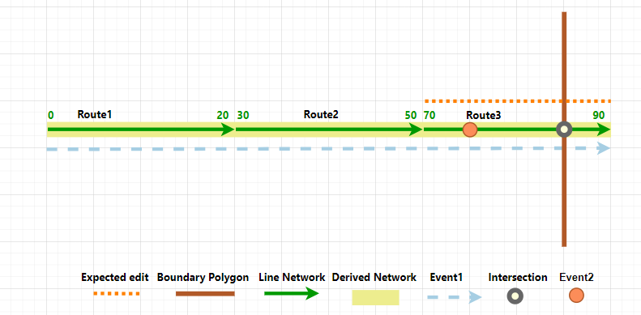
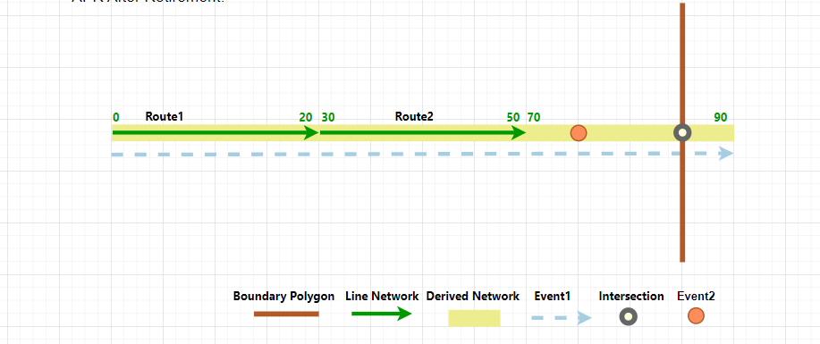
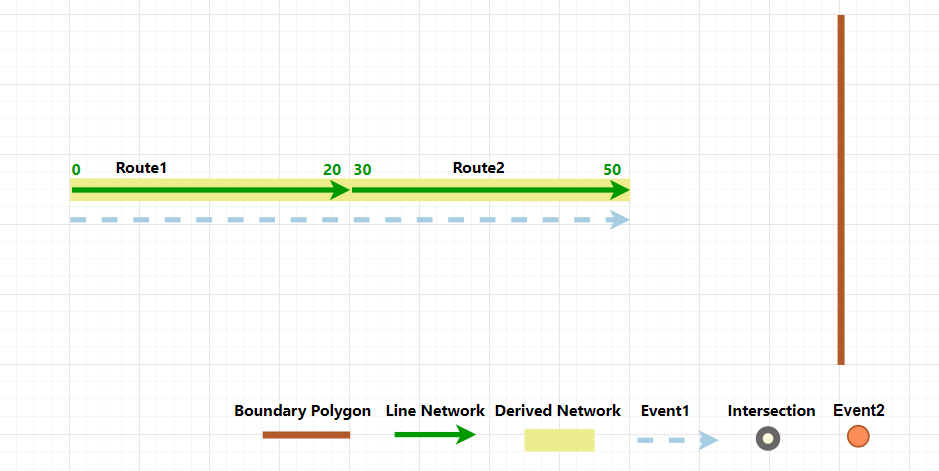
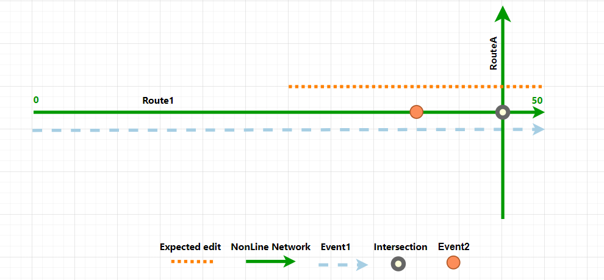
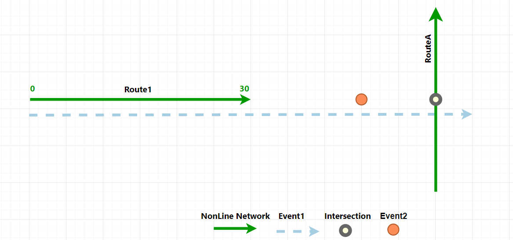
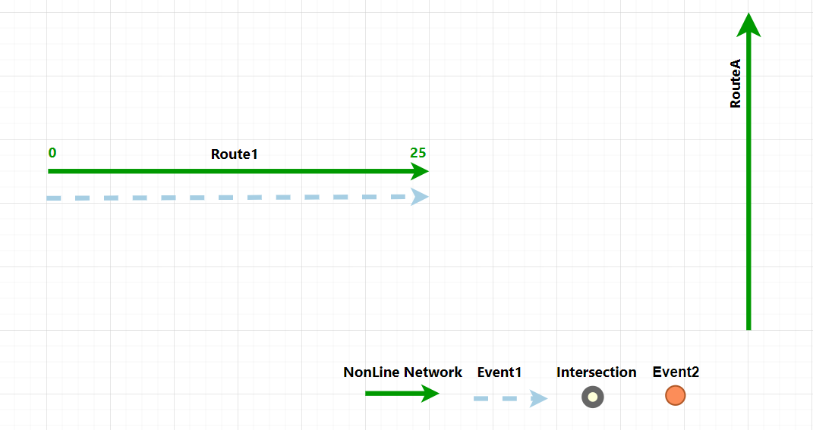

# Process Route Edits

| Field | Value |
| --- | --- |
| **Doc** | 328 · Other · Pro |
| **Product** | — |
| **Release** | — |
| **Issues** | [ArcGISPro/ps-location-referencing#5809](https://devtopia.esri.com/ArcGISPro/ps-location-referencing/issues/5809) |
| **Source** | [5809-ProcessEdits_V4.docx](<https://esriis.sharepoint.com/sites/LocationReferencing/Shared%20Documents/General/Doc%20Reviews/5809_ProcessEdits/5809-ProcessEdits_V4.docx>) · rev V4 |
| **People** | author Mac Christmas · PE — · dev — |
| **Edited** | 2024-08-01 20:58 by Mac Christmas |
| **Extracted** | 2026-09-04 · lane xmlstrip · format 3.0 · prompt v2.0.2 |
| **Keywords** | process edits · route edits · derived network · event behavior · intersections · route retirement · line network · nonline network |
| **Tools** | Process Edits · Generate Intersections · Apply Event Behaviors · Generate Routes · Derive Event Measures |

## Summary

Describes the Process Edits tool workflow for synchronizing an LRS after route editing. Explains the sequence of geoprocessing tools run for line and nonline networks, including generating intersections, applying event behaviors, generating routes, and deriving event measures. Provides examples of route retirement scenarios before and after processing edits.

## Related documents

<!-- related:begin -->
- [Process Route Edits](<https://esriis.sharepoint.com/sites/lrsworkspace/LRS Doc Index/Other/5809-process-route-edits-rh.md>) — shared issue ArcGISPro/ps-location-referencing#5809 · similar text 0.79 · 3 title words · 2 filename words · same kind/surface/folder <!-- rel:306 s=1008.145 -->
- [Pro 3.4 and 11.4 User Acceptance Issues and Documentation Updates](<https://esriis.sharepoint.com/sites/lrsworkspace/LRS%20Doc%20Index/Schedules/504-pro-3-4-and-11-4-user-acceptance-issues-and-documentation.md>) — shared issue ArcGISPro/ps-location-referencing#5809 · similar text 0.02 · same surface <!-- rel:194 s=1000.616 -->
- [Support Running AEB, Generate Routes, and Derive Event Measures as a Single Operation via the LR Pro Ribbon – Test Plan](<https://esriis.sharepoint.com/sites/lrsworkspace/LRS%20Doc%20Index/Test%20Plans/5198-support-running-aeb-generate-routes-and-derive-event.md>) — similar text 0.19 · 2 filename words · same surface <!-- rel:453 s=3.174 -->
- [Event Behavior for Route Retirement](<https://esriis.sharepoint.com/sites/lrsworkspace/LRS Doc Index/Other/eb-for-route-retirement-2024-02-2.md>) — similar text 0.25 · 1 title word · same kind/surface <!-- rel:425 s=3.113 -->
- [Event Behavior for Route Calibration](<https://esriis.sharepoint.com/sites/lrsworkspace/LRS Doc Index/Other/eb-for-route-calibration-rh-2023-11.md>) — similar text 0.19 · 1 title word · same kind/surface <!-- rel:447 s=3.047 -->
<!-- related:end -->

<!-- docs:begin -->
## Esri documentation

[Event behavior](https://doc.esri.com/en/arcgis-pro/latest/help/production/location-referencing-pipelines/what-is-event-behavior.html) · [View LRS intersection properties](https://doc.esri.com/en/arcgis-pro/latest/help/production/location-referencing-pipelines/view-lrs-intersection-properties.html) · [Retire routes](https://doc.esri.com/en/arcgis-pro/latest/help/production/location-referencing-pipelines/retire-routes.html)

_No page matched:_ [Process Edits](https://www.google.com/search?q=%22Process%20Edits%22+site%3Adoc.esri.com) · [Generate Intersections](https://www.google.com/search?q=%22Generate%20Intersections%22+site%3Adoc.esri.com) · [Apply Event Behaviors](https://www.google.com/search?q=%22Apply%20Event%20Behaviors%22+site%3Adoc.esri.com) · [Generate Routes](https://www.google.com/search?q=%22Generate%20Routes%22+site%3Adoc.esri.com) · [Derive Event Measures](https://www.google.com/search?q=%22Derive%20Event%20Measures%22+site%3Adoc.esri.com)
<!-- docs:end -->

---

## Process route edits
In [Product Name], 4 geoprocessing tools must be run to fully synchronize an LRS following an LRS route editing operation. The geoprocessing tools include Generate Intersections, to update existing or generate new intersections, Apply Event Behaviors, to apply specific event behaviors to events on edited routes, Generate Routes, to regenerate the derived network following edits to a line network, and also Derive Event Measures, to update any event configured with derived measure information. To streamline this process, use the Process Edits tool to synchronize an LRS and its layers following an LRS route editing session. When the Process Edits tool is executed, these geoprocessing tools will run in a sequence, only on the unprocessed edits within LRS Networks.
For a line network configured with a derived network, the following tools will execute sequentially:

| Step: | Geoprocessing Tool: | Description |
| --- | --- | --- |
| 1. | Generate Intersections | Creates or updates intersections based on routes that have been edited. |
| 2. | Apply Event Behaviors | Applies event behaviors on routes that have been edited. |
| 3. | Generate Route s | Generates the derived network based on routes that have been edited. |
| 4. | Derive Event Measures | Updates the derived event measures on events whose parent route or routes have been edited. |

Note:
For a nonline network or a line network configured without a derived network, only the Generate Intersections and Apply Event Behaviors steps will run.

### Processing edits on a line network
When using Process Edits against a line network, the Generate Intersections, Apply Event Behaviors, Generate Routes, and Derive Event Measures geoprocessing tools will run in a sequence against all routes in LRS Networks that have unprocessed edits.

#### Before route edit
In the following scenario, the last route on a line is about to be retired. There is a spanning line event, point event, and intersection along the line. The two event layers are both configured with Stay Put event behavior for route retirement operations.
The following diagram shows the state of the LRS data prior to the route retirement.

The following table shows the route information prior to the route retirement:

| Network | Line Name | Route Name | From Date | To Date | From Measure | To Measure |
| --- | --- | --- | --- | --- | --- | --- |
| Line Network | Line1 | Route1 | 1/1/2000 | <Null> | 0 | 20 |
| Line Network | Line1 | Route2 | 1/1/2000 | <Null> | 30 | 50 |
| Line Network | Line1 | Route3 | 1/1/2000 | <Null> | 70 | 90 |
| Derived Network | N/A | Line1 | 1/1/2000 | <Null> | 0 | 60 |

The following table shows the line event information prior to the route retirement:

| Event ID | From Route Name | To Route Name | From Date | To Date | From Measure | To Measure | Derived Route Name | Derived From Measure | Derived To Measure |
| --- | --- | --- | --- | --- | --- | --- | --- | --- | --- |
| LineEvent1 | Route1 | Route3 | 1/1/2000 | <Null> | 0 | 90 | Line1 | 0 | 60 |

The following table shows the point event information prior to the route retirement:

| Event ID | Route Name | From Date | To Date | Measure | Derived Route Name | Derived Measure |
| --- | --- | --- | --- | --- | --- | --- |
| PointEvent1 | Route3 | 1/1/2000 | <Null> | 75 | Line1 | 45 |

The following table shows the intersection information prior to the route retirement:

| Intersection Name | Route Name | From Date | To Date | Measure |
| --- | --- | --- | --- | --- |
| Route 3 , Boundary1 | Route 3 | 1/1/2000 | <Null> | 85 |

#### After route edit
Route3 was retired as of 1/1/2010. The Line Network has been updated, however the intersection, events, and derived network layers have not yet been updated.
The following diagram shows the updated routes after retirement:
The following table shows the route information after the route retirement:

| Network | Line Name | Route Name | From Date | To Date | From Measure | To Measure |
| --- | --- | --- | --- | --- | --- | --- |
| Line Network | Line1 | Route1 | 1/1/2000 | <Null> | 0 | 20 |
| Line Network | Line1 | Route2 | 1/1/2000 | <Null> | 30 | 50 |
| Line Network | Line1 | Route3 | 1/1/2000 | 1/1/2010 | 70 | 90 |
| Derived Network | N/A | Line1 | 1/1/2000 | <Null> | 0 | 60 |

Note:
The intersection, event, and derived network have not updated yet following the route retirement.

#### After processing edits
To complete the full LRS workflow, we need to run Process Edits. After executing the tool, the following updates are made to the edited route:

- Intersections are updated
- Event behaviors are applied
- Routes are generated, including the derived network
- Derived event measures are updated
The following diagram shows the fully updated LRS after running Process Edits:
The Derived Network has regenerated based on the route retirement. The following table shows the updated derived network information after running Process Edits:

| Network | Line Name | Route Name | From Date | To Date | From Measure | To Measure |
| --- | --- | --- | --- | --- | --- | --- |
| Line Network | Line1 | Route1 | 1/1/2000 | <Null> | 0 | 20 |
| Line Network | Line1 | Route2 | 1/1/2000 | <Null> | 30 | 50 |
| Line Network | Line1 | Route3 | 1/1/2000 | 1/1/2010 | 70 | 90 |
| Derived Network | N/A | Line1 | 1/1/2000 | 1/1/2010 | 0 | 60 |
| Derived Network | N/A | Line1 | 1/1/2010 | <Null> | 0 | 40 |

The Line Event layer performs the Stay Put event behavior and the derived measure information is updated based on the updated Derived Network. The following table shows the updated line event information after running Process Edits:

| Event ID | From Route Name | To Route Name | From Date | To Date | From Measure | To Measure | Derived Route Name | Derived From Measure | Derived To Measure |
| --- | --- | --- | --- | --- | --- | --- | --- | --- | --- |
| LineEvent1 | Route1 | Route3 | 1/1/2000 | 1/1/2010 | 0 | 90 | Line1 | 0 | 60 |
| LineEvent1 | Route1 | Route 2 | 1/1/2010 | <Null> | 0 | 50 | Line1 | 0 | 40 |

The Point Event layer performs the Stay Put event behavior and the derived measure information is updated based on the updated Derived Network. The following table shows the point event information after running Process Edits:

| Event ID | Route Name | From Date | To Date | Measure | Derived Route Name | Derived Measure |
| --- | --- | --- | --- | --- | --- | --- |
| PointEvent1 | Route3 | 1/1/2000 | 1/1/2010 | 85 | Line1 | 55 |

The intersections are regenerated, with the intersection retiring due to the route retirement. There are no longer any routes intersecting the boundary polygon along Line1. The following table shows the intersection information after running Process Edits:

| Intersection Name | Route Name | From Date | To Date | Measure |
| --- | --- | --- | --- | --- |
| Route 3 , Boundary1 | Route3 | 1/1/2000 | 1/1/2010 | 85 |

### Processing edits on a nonline network
When using Process Edits against a nonline network, only the Generate Intersections and Apply Event Behaviors geoprocessing tools will run in a sequence against all routes in LRS Networks that have unprocessed edits.
Note:
The Generate Routes and Derive Event Measure steps are skipped since a nonline network cannot have a configured derived network.

#### Before route edit
In the following scenario, the second half of Route1 is about to be retired. There is a line event, point event, and intersection along the route. The two event layers are both configured with Stay Put event behavior for route retirement operations.
The following diagram shows the state of the LRS data prior to the route retirement.

The following table shows the route information prior to the route retirement:

| Route Name | From Date | To Date | From Measure | To Measure |
| --- | --- | --- | --- | --- |
| Route1 | 1/1/2000 | <Null> | 0 | 60 |
| RouteA | 1/1/2000 | <Null> | 0 | 10 |

The following table shows the line event information prior to the route retirement:

| Event ID | Route Name | From Date | To Date | From Measure | To Measure |
| --- | --- | --- | --- | --- | --- |
| LineEvent1 | Route 1 | 1/1/2000 | <Null> | 0 | 60 |

The following table shows the point event information prior to the route retirement:

| Event ID | Route Name | From Date | To Date | Measure |
| --- | --- | --- | --- | --- |
| PointEvent1 | Route 1 | 1/1/2000 | <Null> | 45 |

The following table shows the intersection information prior to the route retirement:

| Intersection Name | Route Name | From Date | To Date | Measure |
| --- | --- | --- | --- | --- |
| Route1, RouteA | Route1 | 1/1/2000 | <Null> | 55 |

#### After route edit
The second half of Route1 was retired as of 1/1/2010. The Nonline Network has been updated, however the intersection and events have not yet been updated.
The following diagram shows the updated routes after retirement:

The following table shows the route information after the route retirement:

| Route Name | From Date | To Date | From Measure | To Measure |
| --- | --- | --- | --- | --- |
| Route1 | 1/1/2000 | 1/1/2010 | 0 | 60 |
| Route1 | 1/1/2010 | <Null> | 0 | 30 |
| RouteA | 1/1/2000 | <Null> | 0 | 10 |

Note:
The intersection and event layers have not updated yet following the route retirement.

#### After processing edits
To complete the full LRS workflow, we need to run Process Edits. After executing the tool, the following updates are made to the edited route:

- Intersections are updated
- Event behaviors are applied
The following diagram shows the fully updated LRS after running Process Edits:
The Line Event layer performs the Stay Put event behavior. The following table shows the updated line event information after running Process Edits:

| Event ID | Route Name | From Date | To Date | From Measure | To Measure |
| --- | --- | --- | --- | --- | --- |
| LineEvent1 | Route1 | 1/1/2000 | 1/1/2010 | 0 | 60 |
| LineEvent1 | Route1 | 1/1/2010 | <Null> | 0 | 30 |

The Point Event layer also performs the Stay Put event behavior. The following table shows the updated point event information after running Process Edits:

| Event ID | Route Name | From Date | To Date | Measure |
| --- | --- | --- | --- | --- |
| PointEvent1 | Route1 | 1/1/2000 | 1/1/2010 | 45 |

The intersection is regenerated, with the intersection retiring due to the route retirement. Route1 no longer intersects RouteA. The following table shows the intersection information after running Process Edits:

| Intersection Name | Route Name | From Date | To Date | Measure |
| --- | --- | --- | --- | --- |
| Route1, RouteA | Route1 | 1/1/2000 | 1/1/2010 | 55 |

