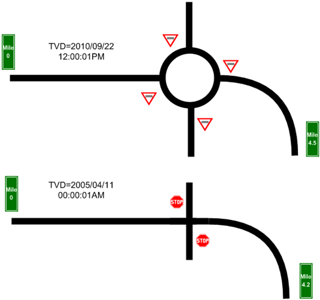
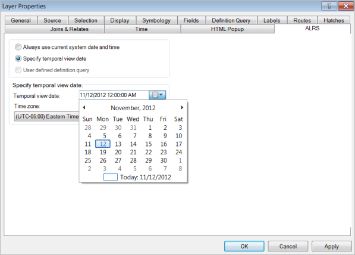
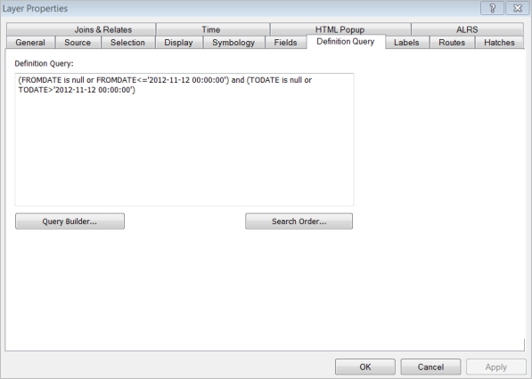
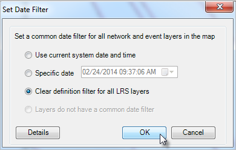

# Time-aware LRS

| Field | Value |
| --- | --- |
| **Doc** | 560 · Other · Pro |
| **Product** | Pipeline Referencing |
| **Release** | — |
| **Issues** | [ArcGISPro/ps-location-referencing#601](https://devtopia.esri.com/ArcGISPro/ps-location-referencing/issues/601) |
| **Source** | [601_Timeaware LRS.docx](<https://esriis.sharepoint.com/sites/LocationReferencing/Shared%20Documents/General/Doc%20Reviews/601_Timeaware%20LRS.docx>) |
| **People** | author Johum Khushk · PE — · dev — |
| **Edited** | 2023-06-01 18:46 by Johum Khushk |
| **Extracted** | 2026-09-04 · lane xmlstrip · format 3.0 · prompt v2.0.2 |
| **Keywords** | time aware · temporal data · temporal view date · routes · events · pipeline referencing · arcgis pro · arcmap |
| **Tools** | — |

## Summary

This document explains the implementation of temporal data in the linear referencing system (LRS), allowing routes and events to be viewed as they existed at specific dates and times. It describes setting the temporal view date (TVD) in ArcGIS Pro and ArcMap to visualize changes over time in routes and events. The document also covers how to analyze temporal events and use time-enabled layers with Pipeline Referencing and other ArcGIS tools.

## Related documents

<!-- related:begin -->
- [ArcGIS Pipeline Referencing: An Introduction](<https://esriis.sharepoint.com/sites/lrsworkspace/LRS Doc Index/Other/arcgis-apr-an-introduction-rh-apr-un.md>) — similar text 0.17 · same kind/surface <!-- rel:885 s=2.787 -->
- [Location Referencing GP Error Messages](<https://esriis.sharepoint.com/sites/lrsworkspace/LRS%20Doc%20Index/Other/3147-lr-gp-error-messages.md>) — similar text 0.13 · same kind/surface/folder <!-- rel:39 s=2.392 -->
- [Manage Pipeline Referencing and a Utility Network Together](<https://esriis.sharepoint.com/sites/lrsworkspace/LRS Doc Index/Other/5048-manage-apr-and-a-un-together.md>) — similar text 0.11 · same kind/surface/folder <!-- rel:565 s=2.334 -->
- [Unified Pipeline Tools add-in](<https://esriis.sharepoint.com/sites/lrsworkspace/LRS Doc Index/Other/5048-unified-pipeline-tools-add.md>) — similar text 0.10 · same kind/surface/folder <!-- rel:566 s=2.3 -->
- [Roads and Highways and Pipeline Referencing Enhancements](<https://esriis.sharepoint.com/sites/lrsworkspace/LRS Doc Index/Other/5671-rh-and-apr-enhancements.md>) — similar text 0.07 · same kind/surface/folder <!-- rel:408 s=2.206 -->
<!-- related:end -->

<!-- docs:begin -->
## Esri documentation

[Time awareness in Pipeline Referencing](https://doc.esri.com/en/arcgis-pro/latest/help/production/location-referencing-pipelines/time-awareness-in-pipeline-referencing.html) · [3D in Pipeline Referencing](https://doc.esri.com/en/arcgis-pro/latest/help/production/location-referencing-pipelines/3d-in-pipeline-referencing.html)
<!-- docs:end -->

---

Time-aware LRS
Temporal data can be implemented in the linear referencing system (LRS).
The LRS is said to be time aware because everything in it, from routes and events to route calibration, respects time. A route is a representation of a linear facility, such as a highway, at a specific date and time. When you locate events on a route, only the events that were active as of the date and time the route was active will display. The measure values on the route reflect the way the route was measured at that date and time, which may be different from the way the route is measured today. This allows you to set a specific date and time for each route, and each event layer, and see them as they were then. You can also add layers to your map with different time periods set so you can compare the past, present, and future.
Each representation of the network and its associated event layers is based on a temporal view date (TVD) set by the user in ArcGIS Pro in an ArcMap session. The TVD tells ArcMap how to render the feature and what events to display.

The example above shows a highway both before and after a roundabout (traffic circle) has been constructed. The roundabout not only adds length to the highway system, which changes the measure values, it also changes the collection of assets that are associated with the highway. In this case, the 2005 version of the highway was 4.2 miles with a standard T-intersection controlled by stop signs. The 2010 version is 4.5 miles with a roundabout controlled by yield signs.
For more information refer to topic:Learn more about time awareness in ArcGIS Pro https://pro.arcgis.com/en/pro-app/latest/help/production/roads-highways/time-awareness-in-roads-and-highways.htm
Setting the temporal view date
Set in ArcGIS Pro
You can set the temporal view date by For exact steps refer to topic:setting up the time filter for layers   https://pro.arcgis.com/en/pro-app/latest/help/production/roads-highways/set-up-the-time-filter-for-layers.htm https://pro.arcgis.com/en/pro-app/latest/help/production/roads-highways/set-up-the-time-filter-for-layers.htm or by setting the time view for LRS data in a group.
and
 https://pro.arcgis.com/en/pro-app/latest/help/production/roads-highways/set-the-time-view-for-lrs-data-in-a-group.htm https://pro.arcgis.com/en/pro-app/latest/help/production/roads-highways/set-the-time-view-for-lrs-data-in-a-group.htm
Set in ArcMap
The temporal view date (TVD) is a property of the map layer in ArcMap. In order to set the TVD, browse to the ALRS tab on the Layer Properties dialog box. You can choose to apply the current system date and time or use the interactive date picker to choose a specific TVD. By default, the current system date and time are automatically applied to the layer after it is added to the map.

When setting the TVD of LRS Networks, a definition query is automatically applied to the layer. You can manually edit the TVD definition query on the Definition Query tab.

You can clear definition filters for LRS layers using the Set Date Filter tool  provided in the toolbar.

Viewing and analyzing temporal events
By setting the TVD for events to different dates, you can easily visualize how events have changed over time. All events have From and To dates associated with them. ArcGIS Pipeline Referencing manages these dates for you when LRS Networks are updated. When you set the TVD for both routes and events, you can view the routes at a specific date and time. You can also add LRS networks and event layers to your map multiple times to provide multiple date and time representations. Use this technique to visualize changes in time, such as the change in the frequency of crashes when pavement conditions improve or degrade.
Pipeline Referencing allows you to work with time-enabled layers outside of the platform using ArcGIS Pro or the various web client APIs for . While temporal route edits should be made using the editing tools, your LRS can be used in conjunction with existing tools that work with time-enabled layers, such as the time slider.
Note:
To view time-enabled data using built-in ArcGIS Desktop functionality, you must remove all TVD definition queries from your layers.
Note:
To use time-enabled edits in the ArcGIS Event Editor, you must remove all TVD definition queries from your layers prior to publishing your map service.
Learn more about setting the time view for LRS data in ArcGIS Pro

