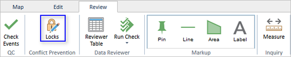
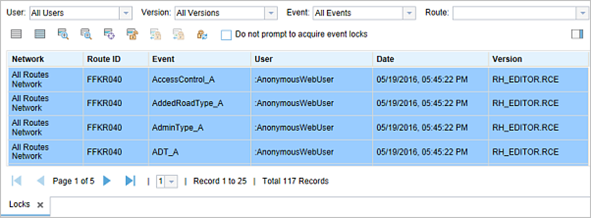

# Locks Table in Event Editor

| Field | Value |
| --- | --- |
| **Doc** | 493 · Other · Pro |
| **Product** | — |
| **Release** | — |
| **Issues** | [ArcGISPro/ps-location-referencing#613](https://devtopia.esri.com/ArcGISPro/ps-location-referencing/issues/613) |
| **Source** | [613_LocksTableinEventEditor_V2.docx](<https://esriis.sharepoint.com/sites/LocationReferencing/Shared%20Documents/General/Doc%20Reviews/613_LocksTableinEventEditor_V2.docx>) · rev V2 |
| **People** | author — · PE — · dev — |
| **Edited** | 2023-09-19 23:40 by Ignacia Galvan |
| **Extracted** | 2026-09-04 · lane xmlstrip · format 3.0 · prompt v2.0.2 |
| **Keywords** | locks table · event editor · route locks · event locks · conflict prevention · linear referencing system · filters |
| **Tools** | Locks Table · Event Editor |

## Summary

Describes the functionality of the locks table in the ArcGIS Event Editor for viewing and releasing route and event locks in a linear referencing system with conflict prevention. Explains tools available in the locks table for managing locks and the use of filters to sort locks by user, version, event, and route.

## Related documents

<!-- related:begin -->
- [Conflict Prevention for Event Editing in Pro – LR Event Tools](<https://esriis.sharepoint.com/sites/lrsworkspace/LRS Doc Index/Test Plans/conflict-prevention-for-event-editing-in-pro-lr-event-tools.md>) — similar text 0.19 · 1 title word · 1 filename word · same surface <!-- rel:666 s=2.669 -->
- [Conflict Prevention for Event Editing in Pro – Core Tools](<https://esriis.sharepoint.com/sites/lrsworkspace/LRS Doc Index/Test Plans/conflict-prevention-for-event-editing-in-pro-core-tools-2022-04.md>) — similar text 0.16 · 1 title word · 1 filename word · same surface <!-- rel:671 s=2.585 -->
- [Conflict Prevention for Event Editing in Pro – Core Tools](<https://esriis.sharepoint.com/sites/lrsworkspace/LRS Doc Index/Test Plans/conflict-prevention-for-event-editing-in-pro-core-tools-v4.md>) — similar text 0.15 · 1 title word · 1 filename word · same surface <!-- rel:670 s=2.573 -->
- [Conflict Prevention for Event Editing in Pro](<https://esriis.sharepoint.com/sites/lrsworkspace/LRS Doc Index/User Stories/conflict-prevention-for-event-editing-in-pro.md>) — similar text 0.15 · 1 title word · 1 filename word · same surface <!-- rel:683 s=2.549 -->
- [Acquire and Release Locks tool User Story](<https://esriis.sharepoint.com/sites/lrsworkspace/LRS Doc Index/User Stories/acquire-and-release-locks-tool.md>) — similar text 0.14 · 1 title word · 1 filename word · same surface <!-- rel:45 s=2.532 -->
<!-- related:end -->

<!-- docs:begin -->
## Esri documentation

[Release locks through the LRS Locks table](https://doc.esri.com/en/arcgis-pro/latest/help/production/location-referencing-pipelines/lrs-locks-table.html) · [Conflict prevention](https://doc.esri.com/en/arcgis-pro/latest/help/production/location-referencing-pipelines/conflict-prevention.html) · [Set a time filter](https://doc.esri.com/en/arcgis-pro/latest/help/production/location-referencing-pipelines/set-a-time-filter.html)

_No page matched:_ [Event Editor](https://www.google.com/search?q=%22Event%20Editor%22+site%3Adoc.esri.com)
<!-- docs:end -->

---

## Locks table in Event Editor
Using ArcGIS Event Editor during your everyday workflows, you may need to view and release locks. The locks table in Event Editor allows you to view and release route and event locks in a linear referencing system (LRS) with conflict prevention enabled in ArcGIS Pro or ArcMap.
For example, you may want to add events to a group of routes in a new subdivision. Before you acquire locks, you can use the locks table to see if any locks exist on routes where you want to add events. Once your editing is complete in the area, you can use the locks table to release any locks on routes without changes. The locks on routes with edits are released when changes from the version are posted to the lock root version.
You can open the locks table from the Conflict Prevention group of the Review tab. Clicking the Locks button opens the locks table.

### Locks table tools
You can use the locks table to view locks or release existing route and event locks with the buttons at the top of the toolbar. You can highlight a lock or group of locks by selecting the lock records in the table.
Note:
The Do not prompt to acquire event locks check box is unchecked by default. If you want locks to be automatically acquired when editing in Event Editor and no prompt message to appear, check the check box. This option is only applied to the local machine.
The table is populated with 25 locks per page. To browse through the pages of locks, use the Next Page button , Last Page button , Previous Page button , First Page button , and the page number drop-down list.

| Function or tool | Description |
| --- | --- |
| Clear Highlighted Locks | Clears all highlighted records in the locks table. |
| Highlight All Locks | Highlights all records in the locks table. |
| Zoom to Highlighted Locks | Zooms to the routes associated with the highlighted locks in the table. |
| Zoom to Selected Locks | Zooms to the routes associated with the selected locks in the table. |
| Center on Highlighted Locks | Centers on the routes associated with the highlighted locks on the map. |
| Unlock Highlighted Loc ks | Releases locks on highlighted records in the locks viewer table. If any locks were acquired by another user, acquired in another version, or have pending changes, a message appears and those locks remain. |
| Refresh Locks | Refreshes the list of locks. This also refreshes the list of values for each filter based on which users, versions, events, and routes are associated with the updated list of locks. |
| Transfer Highlighted Locks | Transfers locks on highlighted records in the locks viewer table. You need to select the geodatabase version using the Version drop-down arrow on the locks table to activate the tool. If any user is in an edit session using the same geodatabase version, a message appears and those locks remain with the existing user. Note: This tool is only available when Allow Lock Transfer is selected on the ALRS properties dialog box and Event Editor is configured to show the transfer locks tools. https://pro.arcgis.com/en/pro-app/3.1/help/production/roads-highways/conflict-prevention.htm  \h Learn more about enabling conflict prevention in the LRS in ArcMap and Learn more about configuring the Event Editor web app . Note: This tool is only available in feature service s published from ArcMap. Th is tool is unavailab le in feature services published from ArcGIS Pro as the locks will automatically transfer when attempting to make edits to events. |
| Trans fer Selected Locks | Transfers locks on selected records in the locks viewer table. Select the geodatabase version using the Version drop-down arrow on the locks table to activate the tool. If any user is in an edit session using the same geodatabase version, a message appears and those locks remain with the existing user. Note: This tool is only available when Allow Lock Transfer is selected on the ALRS properties dialog box and Event Editor is configured to show the transfer locks tools. https://pro.arcgis.com/en/pro-app/3.1/help/production/roads-highways/conflict-prevention.htm  \h Learn more about enabling conflict prevention in the LRS in ArcMap and Learn more about configuring the Event Editor web app . Note: This tool is only available in feature services published from ArcMap. This tool is unavailable in feature services published from ArcGIS Pro as the locks will automatically transfer when attempting to make edits to events. |

Tools available in the locks table

### Filters in the locks table
As Location Referencing users complete everyday editing workflows, the locks table can have route and event locks from a variety of users, in different versions, on a variety of events, and on a variety of routes. To expedite the sorting of the locks in the table, filters are available based on the user, version, event, and route in which the locks were acquired.
You can use filters individually or in combination to only show those locks that meet combined filter conditions.
Filtering by user or version provides a drop-down list of all the different values present in the locks table. The event filter contains all the event layers in the map. To filter by route, paste a route ID into the text box and press Enter or type the beginning of the route ID. After three characters are typed, a list of matching route IDs that can be selected appears.
In the previous example, the user locked a group of routes to perform edits on a new subdivision of routes. Once editing is complete, the user wants to release the locks for the routes that were not edited. You can use table filters to narrow the list of locks to those acquired by that user in the version used for editing.

- https://enterprisedev.arcgis.com/en/ \h Home
- Portal
- Server
- Data Stores
- Cloud
- Apps
- Documentation

###### ArcGIS

- ArcGIS Online
- ArcGIS Pro
- ArcGIS Enterprise
- ArcGIS
- ArcGIS Developer
- ArcGIS Solutions
- ArcGIS Marketplace

###### About Esri

- About Us
- Careers
- Esri Blog
- User Conference
- Developer Summit

Copyright © 2023 Esri. All rights reserved. | Privacy | Manage Cookies | Legal

