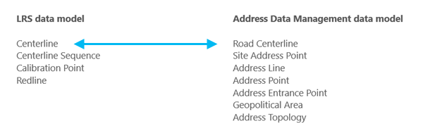

# Manage Address and Roadway Characteristic Data Together

| Field | Value |
| --- | --- |
| **Doc** | 250 · Other · Pro |
| **Product** | Roads & Highways |
| **Release** | — |
| **Issues** | [ArcGISPro/ps-location-referencing#6267](https://devtopia.esri.com/ArcGISPro/ps-location-referencing/issues/6267) |
| **Source** | [6267-ManageAddressandRoadwayCharacteristicsTogetherUpdate.docx](<https://esriis.sharepoint.com/sites/LocationReferencing/Shared%20Documents/General/Doc%20Reviews/Pro35_Ent115/6267_OverlayEvents/6267-ManageAddressandRoadwayCharacteristicsTogetherUpdate.docx>) |
| **People** | author — · PE — · dev — |
| **Edited** | 2025-01-21 22:51 by unknown |
| **Extracted** | 2026-09-04 · lane xmlstrip · format 3.0 · prompt v2.0.2 |
| **Keywords** | address data management · roadway characteristic · centerline · site address point · linear referencing system · dynamic segmentation · overlay events · address range |
| **Tools** | Configure Address Feature Classes · Create LRS From Existing Dataset · Create LRS Network · Create LRS Event · Append Routes · Append Events · Apply Event Behaviors · Overlay Events |

## Summary

Describes how to manage and maintain address and roadway characteristic data together in a linear referencing system using ArcGIS Roads and Highways and the Address Data Management solution. Covers data model requirements, configuration, loading, publishing workflows, combined editing in ArcGIS Pro, and analysis capabilities including dynamic segmentation with overlay events. Provides guidance for both out-of-the-box and custom address data models integrated with LRS.

## Related documents

<!-- related:begin -->
- [Configure Address Feature Classes (Location Referencing)](<https://esriis.sharepoint.com/sites/lrsworkspace/LRS Doc Index/Other/6267-configure-address-feature-classes-lr.md>) — shared issue ArcGISPro/ps-location-referencing#6267 · similar text 0.30 · 1 title word · same kind/surface/folder <!-- rel:249 s=1003.892 -->
- [Overlay Events (Location Referencing)](<https://esriis.sharepoint.com/sites/lrsworkspace/LRS Doc Index/Other/6267-overlay-events-lr.md>) — shared issue ArcGISPro/ps-location-referencing#6267 · similar text 0.22 · same kind/surface/folder <!-- rel:251 s=1002.732 -->
- [Manage address and roadway characteristic data together](<https://esriis.sharepoint.com/sites/lrsworkspace/LRS Doc Index/Other/manage-address-and-roadway-characteristic-data-together.md>) — similar text 0.92 · 5 title words · 3 filename words · same kind/surface <!-- rel:96 s=10.144 -->
- [Manage Address and Roadway Characteristic Data Together with Roads and Highways and Address Data Management Solution](<https://esriis.sharepoint.com/sites/lrsworkspace/LRS Doc Index/Other/5783-manage-address-and-roadway-characteristic-data-together.md>) — similar text 0.78 · 5 title words · same kind/surface <!-- rel:276 s=7.88 -->
- [Manage Address and Roadway Characteristic Data Together](<https://esriis.sharepoint.com/sites/lrsworkspace/LRS Doc Index/Other/5930-manage-address-and-roadway-characteristic-data-together.md>) — similar text 0.76 · 5 title words · same kind/surface <!-- rel:327 s=7.736 -->
<!-- related:end -->

<!-- docs:begin -->
## Esri documentation

[Create and modify an LRS Network](https://doc.esri.com/en/arcgis-pro/latest/help/production/roads-highways/create-and-modify-an-lrs-network.html) · [Create and modify LRS events](https://doc.esri.com/en/arcgis-pro/latest/help/production/roads-highways/create-and-modify-lrs-events.html) · [Manage address and roadway characteristic data together](https://doc.esri.com/en/arcgis-pro/latest/help/production/roads-highways/manage-address-and-roadway-characteristic-data-together.html) · [Merge centerlines](https://doc.esri.com/en/arcgis-pro/latest/help/production/roads-highways/merge-centerlines.html) · [View site address point properties](https://doc.esri.com/en/arcgis-pro/latest/help/production/roads-highways/view-site-address-point-properties.html) · [Apply dynamic segmentation](https://doc.esri.com/en/arcgis-pro/latest/help/production/roads-highways/apply-dynamic-segmentation.html)

_No page matched:_ [Configure Address Feature Classes](https://www.google.com/search?q=%22Configure%20Address%20Feature%20Classes%22+site%3Adoc.esri.com) · [Create LRS From Existing Dataset](https://www.google.com/search?q=%22Create%20LRS%20From%20Existing%20Dataset%22+site%3Adoc.esri.com) · [Append Routes](https://www.google.com/search?q=%22Append%20Routes%22+site%3Adoc.esri.com) · [Append Events](https://www.google.com/search?q=%22Append%20Events%22+site%3Adoc.esri.com) · [Apply Event Behaviors](https://www.google.com/search?q=%22Apply%20Event%20Behaviors%22+site%3Adoc.esri.com) · [Overlay Events](https://www.google.com/search?q=%22Overlay%20Events%22+site%3Adoc.esri.com)
<!-- docs:end -->

---

## Manage address and roadway characteristic data together
ArcGIS Roads and Highways provides options to manage and maintain address and roadway characteristic data in a linear referencing system with a common geodatabase. Roads and Highways can be configured out of the box with the Address Data Management solution in a single geodatabase by including address range fields from the Address Data Management solution in a feature class that also serves as the Roads and Highways centerline feature class. You also have the option to support address data in a customized fashion by modeling address information on either the LRS centerline or LRS line event. In both the Address Data Management solution configuration and the custom data model configuration, a feature class with site address points must be configured with the LRS.
In ArcGIS, the Address Data Management solution can be used to maintain and improve an authoritative address repository. The solution contains a set of capabilities designed to help maintain, improve, and share address information in support of services and commerce within a community, such as E911, permitting, and assessment.
The sections below describe how to model address information in conjunction with the Roads and Highways schema to maintain and edit both an LRS and Address Data Management solution in a single geodatabase using tools in ArcGIS Pro. Guidance is provided for loading data and publishing services with data managed by both capabilities.

### Requirements
If the required feature classes and tables in the Roads and Highways information model and Address Data Management solution are present in a single geodatabase, you can use an out-of-the-box data model or customize a data model to meet your organization's rules and requirements.

#### Address Data Management solution data model
You can simplify the deployment process for the Address Data Management solution by deploying it to your organization’s ArcGIS Enterprise portal and loading your LRS data into the solution. The Configure Address Feature Classes tool associates the centerline or line event feature classes and the Site Address Point feature class as part of the Address Data Management solution and LRS.
Learn more about deploying the Address Data Management solution to your Enterprise portal

The following are required feature classes for the Roads and Highways schema to integrate with the Address Data Management solution:

- Centerline or line event
- Centerline Sequence
- Calibration Point
- Redline
The following are required Address Data Management solution feature classes to integrate with Roads and Highways:

- Road Centerline
- Site Address Point
- Address Line
- Address Point
- Address Entrance Point
- Geopolitical Area
- Address Topology
Note:
You can run the Create LRS in Address Data Management solution tool to create an LRS in an Address Data Management geodatabase that contains an existing Road Centerline feature class.
The following fields must be present in the centerline or line event feature class to successfully configure with an LRS and to take advantage of Roads and Highways and the Address Data Management solution configured together:

| Field |  | Data type |  | Length |  | IsNullable |  | Description |  |
| --- | --- | --- | --- | --- | --- | --- | --- | --- | --- |
| FromLeft |  | Short or Long |  | N/A |  | Yes |  | The first address on the left side of a roadway. |  |
| ToLeft |  | Short or Long |  | N/A |  | Yes |  | The last address on the left side of a roadway. |  |
| FromRight |  | Short or Long |  | N/A |  | Yes |  | The first address on the right side of a roadway. |  |
| ToRight |  | Short or Long |  | N/A |  | Yes |  | The last address on the right side of a roadway. |  |
| FullName | Text | N/A | Yes | The name of the roadway. |  |  |  |  |  |

The following fields must be present in the Site Address Point feature class to successfully configure with an LRS and to take advantage of Roads and Highways and the Address Data Management solution configured together:

| Field |  | Data type |  | Length |  | IsNullable |  | Description |  |
| --- | --- | --- | --- | --- | --- | --- | --- | --- | --- |
| AddressNumber |  | Short, Long, or Text |  | N/A |  | Yes |  | The site address number. |  |
| FullName | Text | N/A | Yes | The name of the roadway. |  |  |  |  |  |

#### Custom address data model
To create a custom data model other than the Address Data Management solution, ensure that the required feature classes and tables for an LRS are present. This includes the centerline or line event feature class, and the Site Address Point feature class.
The following are required feature classes for the Roads and Highways schema to integrate with a custom address data model:

- Centerline or line event
- Centerline Sequence
- Calibration Point
- Redline
A Site Address Point feature class is required to integrate with Roads and Highways.
The following fields must be present in the centerline or line event feature class to be configured with an LRS using a custom address data model:

| Field |  | Data type |  | Length |  | IsNullable |  | Description |  |  |
| --- | --- | --- | --- | --- | --- | --- | --- | --- | --- | --- |
| FromLeft |  | Short or Long |  | N/A |  | Yes |  | The first address on the left side of a roadway. |  |  |
| ToLeft |  | Short or Long |  | N/A |  | Yes |  | The last address on the left side of a roadway. |  |  |
| FromRight |  | Short or Long |  | N/A |  | Yes |  | The first address on the right side of a roadway. |  |  |
| ToRight |  | Short or Long |  | N/A |  | Yes |  | The last address on the right side of a roadway. |  |  |
| RoadName | Text | N/A | Yes | The name of the roadway. |  |  |  |  |  |  |

The following fields must be present in the Site Address Point feature class to successfully configure with an LRS and to take advantage of Roads and Highways and a custom address data model:

| Field |  | Data type |  |  |  | Length |  |  | IsNullable |  |  | Description |
| --- | --- | --- | --- | --- | --- | --- | --- | --- | --- | --- | --- | --- |
| AddressNumber |  | Short, Long, or Text |  |  |  | N/A |  |  | Yes |  |  | The site address number. |
| RoadName |  | Text |  |  | N/A |  |  | Yes |  |  | The name of the roadway. |  |

Note:
When using a custom address data model configured with an LRS, the additional capabilities of the Address Data Management solution are not included, such as specialized attribute rules, relationship classes, topology, special workflows, and more. These capabilities can be re-created in a custom address data model, but they are not available out of the box as they are with the Address Data Management solution.

### Configure, load data, and publish a Roads and Highways LRS with the Address Data Management solution
Both the Address Data Management solution and Roads and Highways have specific requirements to deploy in a geodatabase.
To deploy a Roads and Highways LRS and the Address Data Management solution in a geodatabase, complete the following steps:
Note:
Ensure that the correct spatial reference, x, y, z, and m tolerances, and x, y, z, and m resolution are configured for feature classes used by Roads and Highways and the Address Data Management solution so that the LRS can be configured correctly.
You can use the LRS centerline feature class or an LRS line event feature class as the Address Range layer for this workflow.

#### Configure, load, and publish with the LRS centerline feature class in the Address Data Management Solution ArcGIS Pro project
Use the LRS centerline feature class as the Address Range layer to configure, load, and publish.

1. https://doc.arcgis.com/en/arcgis-solutions/latest/get-started/deploy-an-arcgis-solution.htm \hDeploy the Address Data Management solution to your Enterprise portal.

1. Download and open the Address Data Management ArcGIS Pro project.

1. Create a calibration point feature class and a redline feature class that reside in the Address feature dataset in the Address Data Management geodatabase. Create a centerline sequence table that resides in the Address Data Management geodatabase.

- Note:
- The field data type and length in the feature class and table must adhere to the
- LRS data model
- .

1. Use the Create LRS From Existing Dataset tool with the Road Centerline, calibration point, redline, and centerline sequence layers as inputs.

1. Run the Configure Address Feature Classes tool to associate the Road Centerline and Site Address Point feature classes as part of the Address Data Management solution and the LRS.

1. Load data into the Road Centerline and Site Address Point feature classes using the Append tool.

- Tip:
- This step can be performed at any point between steps 3 to 6.

1. Create LRS Networks using the Create LRS Network tool. If you have a layer that is pre-configured as an LRS Network, use the Create LRS Network From Existing Dataset tool.

1. Create LRS events using the Create LRS Event tool. If you have layers that are pre-configured to be LRS events, use the Create LRS Event From Existing Dataset tool.

1. Load data into the LRS Network using the Append Routes tool.

- Note:
- The Append Routes tool considers existing centerlines when the Consider existing centerlines parameter is checked. If a CenterlineID value already exists where you append a route, the existing centerline sequence record is updated with the appended route's RouteID value.

1. Load data into LRS events using the Append Events tool.

1. https://prodev.arcgis.com/en/pro-app/3.5/help/production/roads-highways/share-as-web-layers.htm \hPublish an LRS in a service.

- Note:
- When publishing an LRS in a service, the enterprise geodatabase connection file must use branch versioning. The Address feature dataset and other required feature classes and tables must be registered as branch versioned before publishing.

#### Configure, load, and publish with an LRS line event feature class
Use an LRS line event feature class as the Address Range layer to configure, load, and publish.

1. https://doc.arcgis.com/en/arcgis-solutions/latest/get-started/deploy-an-arcgis-solution.htm \hDeploy the Address Data Management solution to your Enterprise portal.

1. Create an LRS using the Create LRS or Create LRS From Existing Dataset tool.

1. Create an LRS Network using the Create LRS Network or Create LRS Network From Existing Dataset tool.

1. Create an LRS line event using the Create LRS Event or Create LRS Event From Existing Dataset tool.

- Note:
- Add the FromLeft, ToLeft, FromRight, and ToRight fields to the LRS line event.

1. Run the Configure Address Feature Classes tool to associate the LRS line event (created in step 4) and the Site Address Point feature class as part of the Address Data Management solution and the LRS.

1. Create more LRS Networks using the Create LRS Network or Create LRS Network From Existing Dataset tool, if necessary.

1. Create more LRS events using the Create LRS Event or Create LRS Event From Existing Dataset tool, if necessary.

- Note:
- The Site Address Point feature class should not be registered as an LRS event.

1. Load data into the Site Address Point feature class using the Append tool.

1. Load data into the LRS Network using the Append Routes tool.

- Note:
- The Append Routes tool considers existing centerlines when the Consider existing centerlines parameter is checked. If a CenterlineID value already exists where you append a route, the existing centerline sequence record is updated with the appended route's RouteID value.

1. Load data into LRS events using the Append Events tool.

1. https://prodev.arcgis.com/en/pro-app/3.5/help/production/roads-highways/share-as-web-layers.htm \hPublish an LRS in a service.

- Note:
- When publishing an LRS in a service, the enterprise geodatabase connection file must use branch versioning. The Address feature dataset and other required feature classes and tables must be registered as branch versioned before publishing.

### Combined LRS and address data editing
Combining a Roads and Highways LRS and the Address Data Management solution in a service allows you to edit data managed by both with ArcGIS Pro. When editing a service with both LRS and address data from a single geodatabase, some LRS editing workflows may differ as described in the following sections.
If the Road Centerline feature class from the Address Data Management solution is used as the LRS centerline feature class, an attribute rule exists within the layer to update the FromLeft, ToLeft, FromRight, and ToRight fields upon splitting a road centerline. This attribute rule proportionally updates the address values based on the split location.

#### Centerline split using a split tool
The following image and table show a centerline before being split using the Split Centerline By Point tool:

| OID | FromLeft | ToLeft | FromRight | ToRight |
| --- | --- | --- | --- | --- |
| 1 | 1120 | 1134 | 1117 | 1131 |

The FromLeft, ToLeft, FromRight, and ToRight field values are updated after the centerline is split.
The following image and table show the centerline and its attributes after the split operation:

| OID | FromLeft | ToLeft | FromRight | ToRight |
| --- | --- | --- | --- | --- |
| 1 | 1120 | 1128 | 1117 | 1125 |
| 2 | 1130 | 1134 | 1127 | 1131 |

##### Centerlines split by an LRS edit
The following image and table show a centerline and the route attributes before the Retire edit activity:

| OID | RouteID | FromLeft | ToLeft | FromRight | ToRight |
| --- | --- | --- | --- | --- | --- |
| 1 | Route1 | 1120 | 1134 | 1117 | 1131 |

The route is retired from the start of the route to the middle portion of the route. As a result, the centerline is split, and its FromLeft, ToLeft, FromRight, and ToRight field values are updated.
The following table and image show the centerline and its attributes after the Retire route edit activity:

| OID | RouteID | FromLeft | ToLeft | FromRight | ToRight |
| --- | --- | --- | --- | --- | --- |
| 1 | Route1 | 1120 | 1128 | 1117 | 1125 |
| 2 | Route1 | 1130 | 1134 | 1127 | 1131 |

### Edit using a service with LRS and address data in ArcGIS Pro
To edit a service that contains LRS and address data, complete the following steps:

1. Create and update any centerlines intended for use in LRS editing activities:

  - https://prodev.arcgis.com/en/pro-app/3.5/help/production/roads-highways/create-a-new-route.htm \hCreate a route
  - https://prodev.arcgis.com/en/pro-app/3.5/help/production/roads-highways/extend-a-route.htm \hExtend a route
  - https://prodev.arcgis.com/en/pro-app/3.5/help/production/roads-highways/realign-routes.htm \hRealign a route

1. Provide address values in the FromLeft, ToLeft, FromRight, and ToRightToRight, and RoadName fields.

1. Complete the LRS editing activity.

1. Run the Apply Event Behaviors tool to update the associated LRS data.

1. Validate the address topology to ensure all edits are valid.

1. To create or edit LRS events, use the event editing tools on the Location Referencing tab in ArcGIS Pro or ArcGIS Experience Builder Location Referencing widgets.

### Analysis capabilities in a combined LRS and Address Data Management dataset
Another advantage of configuring a Roads and Highways LRS and the Address Data Management solution in a single geodatabase is the combined analysis capabilities of both information models on a roadway system. You can maintain, update, and improve your authoritative address repository while also maintaining, updating, and improving your authoritative roadway data.

#### The Roads and Highways data is typically used by various integrity and compliance applications for analysis and reporting. Many of these processes apply dynamic segmentation using the https://prodev.arcgis.com/en/pro-app/3.5/tool-reference/location-referencing/overlay-events.htm \hOverlay Events tool. When the centerline feature class is also configured as the Address Range layer in the Address Data Management solution using the https://prodev.arcgis.com/en/pro-app/3.5/tool-reference/location-referencing/configure-address-feature-classes.htm \hConfigure Address Feature Classes tool, this feature class can be included with networks and events in the Overlay Events tool for dynamic segmentation, allowing these features and their direction and attributes to be included without modeling a separate event.Advanced Overlay Events Capabilities
When a configured address range layer is included as an input event layer in Overlay Events, the Address Block Split Type parameter is exposed. The Address Block Split Type parameter is available when a configured Address Range layer is used as an input event layer in the Overlay Events tool.  This parameter specifies how input address range values are updated as part of the dynamic segmentation process of the tool Overlay Events. The Proportional option updates address range values proportionally for each segment from the split location, and the Nearest Address Point option updates address range values for each segment based on the nearest upstream and downstream address points

#### Overlay Events scenario
In the following diagram, thea centerline featurelayer, one event layer, a Speed line event, and a Signs pPoint eEvent, Signs, are associated with a single route, S. Main St. The centerline layer is configured as the Address Range layer.
[Insert “Input” Draw.io diagram here]
The route is calibrated from left to right between measures 0 and 10. The centerline, Speed, and Signs layers are present on the route and have the input and output properties described in the subsections below.

#### Input
The following tables show the input layer’s measures and valuesattributes:

#### Centerline

| Centerline ID |  | From Left |  | To Left |  | From Right |  | To Right |  | Road Name |  |
| --- | --- | --- | --- | --- | --- | --- | --- | --- | --- | --- | --- |
| RD-100 |  | 1000 |  | 1100 |  | 1001 |  | 1099 |  | S. Main St. |  |

#### Speed Limit

| Event ID | Ro ute ID | From Measure | To Measure | From Date | To Date | Speed Limit |
| --- | --- | --- | --- | --- | --- | --- |
| Speed1 | S. Main St. | 0 | 4 | 1/1/2000 | <Null> | 45 |
| Speed2 | S. Main St. | 4 | 10 | 1/1/2000 | <Null> | 35 |

#### Signs

| Event ID |  | Route ID |  | Measure |  | From Date |  | To Date |  | Sign Type |  |
| --- | --- | --- | --- | --- | --- | --- | --- | --- | --- | --- | --- |
| Sign1 |  | S. Main St. |  | 7 |  | 1/1/2000 |  | <Null> |  | Stop |  |

#### Output forof Proportional Address Block Split Type
When the Proportional option is chosen for the Address Block Split Type parameter, the address range values will be updated for each segment proportionally.
Moving in the direction of calibration of the route (from left to right):

- The first segment in the events is caused by the Speed Limit event, 45, which starts at measure 0 and ends at measure 4.
- The second segment is caused by the Speed event, 35, which starts at measure 4 and ends at measure 7 due to the precense of the Signs event, Stop.
- The third segment is caused by the Signs point event, Stop, at measure 7.
- The final segment between measures 7 and 10 containsis caused by the Speed Limit event, 35.
The following diagram shows the Overlay Events output dataset when the Proportional option is chosen:
[Insert “Output” draw.io diagram here]
The following table provides details about the output dataset shows the Overlay Events output when the Proportional option is chosen:

| Route ID |  | Type |  | From Measure |  | To Measure |  | From Date |  | T o Date |  | From Left |  | To Left | From Right |  | To Right |  | Road Name |  | Speed Limit |  | Sign Type |  |
| --- | --- | --- | --- | --- | --- | --- | --- | --- | --- | --- | --- | --- | --- | --- | --- | --- | --- | --- | --- | --- | --- | --- | --- | --- |
| S. Main St. |  | Line |  | 0 |  | 4 |  | 1/1/2000 |  | <Null> |  | 1000 |  | 1040 | 1001 |  | 1039 |  | S. Main St. |  | 45 |  | <Null> |  |
| S. Main St. |  | Line |  | 4 |  | 7 |  | 1/1/2000 |  | <Null> |  | 1042 |  | 1070 | 1041 |  | 1069 |  | S. Main St. |  | 35 |  | <Null> |  |
| S. Main St. |  | Point |  | 7 |  | 7 |  | 1/1/2000 |  | <Null> |  | <Null> |  | <Null> | <Null> |  | <Null> |  | S. Main St. |  | 35 |  | Stop |  |
| S. Main St. |  | Line |  | 7 |  | 10 |  | 1/1/2000 |  | <Null> |  | 1072 |  | 1100 | 1071 |  | 1099 |  | S. Main St. |  | 35 |  | <Null> |  |

#### Output for of Nearest Upstream  address Point Address Block Split Type
When the Nearest Address Point option is chosen for the Address Block Split Type, the address range values will update for each section based on the nearest upstream and downstream site address points
Moving in the direction of calibration of the route (from left to right):

- The first segment in the events is caused by the Speed, 45, which starts at measure 0 and ends at measure 4.
- The second segment is caused by the Speed, 35, which starts at measure 4 and ends at measure 7 due to the precense of the Signs event, Stop.
- The third segment is caused by the Signs point event, Stop, at measure 7.
- The final segment between measures 7 and 10 contains the Speed, 35.
The following diagram shows the Overlay Events output when the Nearest Address Point option is chosen:
[Insert “Output” draw.io diagram here]
The following table shows the Overlay Events output when the Nearest Address Point option is chosen:

| Route ID |  | Type |  | From Measure |  | To Measure |  | From Date |  | To Date |  | From Left |  | To Left |  | From Right |  | To Right |  | Road Name |  | Speed Limit |  | Sign Type |  |
| --- | --- | --- | --- | --- | --- | --- | --- | --- | --- | --- | --- | --- | --- | --- | --- | --- | --- | --- | --- | --- | --- | --- | --- | --- | --- |
| S. Main St. |  | Line |  | 0 |  | 4 |  | 1/1/2000 |  | <Null> |  | 1000 |  | 1052 |  | 1001 |  | 1051 |  | S. Main St. |  | 45 |  | <Null> |  |
| S. Main St. |  | Line |  | 4 |  | 7 |  | 1/1/2000 |  | <Null> |  | 1054 |  | 10 8 7 |  | 1053 |  | 10 88 |  | S. Main St. |  | 35 |  | <Null> |  |
| S. Main St. |  | Point |  | 7 |  | 7 |  | 1/1/2000 |  | <Null> |  | <Null> |  | <Null> |  | <Null> |  | <Null> |  | S. Main St. |  | 35 |  | Stop |  |
| S. Main St. |  | Line |  | 7 |  | 10 |  | 1/1/2000 |  | <Null> |  | 10 90 |  | 1 100 |  | 10 89 |  | 1099 |  | S. Main St. |  | 35 |  | <Null> |  |

