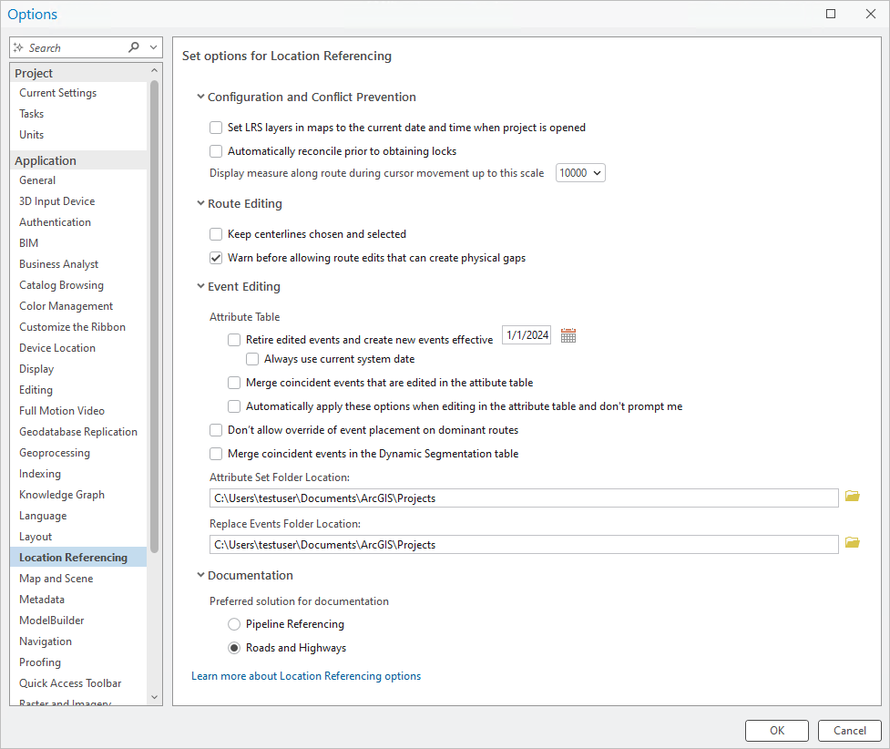

# Set Location Referencing options

| Field | Value |
| --- | --- |
| **Doc** | 199 · Other · Pro |
| **Product** | Roads & Highways · Pipeline Referencing |
| **Release** | — |
| **Issues** | [ArcGISPro/ps-location-referencing#6463](https://devtopia.esri.com/ArcGISPro/ps-location-referencing/issues/6463) |
| **Source** | [6463-SetLROptionsUpdate.docx](<https://esriis.sharepoint.com/sites/LocationReferencing/Shared%20Documents/General/Doc%20Reviews/Pro35_Ent115/6463_Go%20to%20next%20measure%20upon%20run/6463-SetLROptionsUpdate.docx>) |
| **People** | author — · PE — · dev — |
| **Edited** | 2025-03-10 21:20 by unknown |
| **Extracted** | 2026-09-04 · lane xmlstrip · format 3.0 · prompt v2.0.2 |
| **Keywords** | location referencing options · route editing · event editing · conflict prevention · dynamic segmentation · attribute set · replace events |
| **Tools** | — |

## Summary

Instructions for configuring Location Referencing options in ArcGIS Pro, including settings for configuration, conflict prevention, route editing, event editing, and documentation preferences. Describes various check box options and folder location settings to customize behavior during route and event editing workflows.

## Related documents

<!-- related:begin -->
- [Set Location Referencing options](<https://esriis.sharepoint.com/sites/lrsworkspace/LRS Doc Index/Other/set-lr-options-rh-apr-v2-2024-08.md>) — similar text 0.80 · 2 title words · 2 filename words · same kind/surface <!-- rel:315 s=7.252 -->
- [Set Location Referencing options](<https://esriis.sharepoint.com/sites/lrsworkspace/LRS%20Doc%20Index/Other/set-lr-options-rh-apr-v2-2024-09.md>) — similar text 0.77 · 2 title words · 2 filename words · same kind/surface <!-- rel:307 s=6.709 -->
- [Set Location Referencing options](<https://esriis.sharepoint.com/sites/lrsworkspace/LRS%20Doc%20Index/Other/set-lr-options-rh-apr-2024-09.md>) — similar text 0.69 · 2 title words · 1 filename word · same kind/surface <!-- rel:308 s=5.979 -->
- [Reorganize Location Referencing Pro Options Test Plan](<https://esriis.sharepoint.com/sites/lrsworkspace/LRS Doc Index/Test Plans/5826-reorganize-lr-pro-options-rh-apr-v2-2024-08-2.md>) — similar text 0.35 · 1 title word · 1 filename word · same surface <!-- rel:341 s=3.487 -->
- [Reorganize Location Referencing Pro Options Test Plan](<https://esriis.sharepoint.com/sites/lrsworkspace/LRS Doc Index/Test Plans/5826-reorganize-lr-pro-options-rh-apr-v2-2024-08.md>) — similar text 0.35 · 1 title word · 1 filename word · same surface <!-- rel:340 s=3.487 -->
<!-- related:end -->

<!-- docs:begin -->
## Esri documentation

[Event editing using the attribute table](https://doc.esri.com/en/arcgis-pro/latest/help/production/roads-highways/event-editing-using-the-attribute-table.html) · [Set Location Referencing options](https://doc.esri.com/en/arcgis-pro/latest/help/production/roads-highways/set-location-referencing-options.html) · [Conflict prevention](https://doc.esri.com/en/arcgis-pro/latest/help/production/roads-highways/conflict-prevention.html) · [Apply dynamic segmentation](https://doc.esri.com/en/arcgis-pro/latest/help/production/roads-highways/apply-dynamic-segmentation.html)
<!-- docs:end -->

---

## Set Location Referencing options
To configure Location Referencing options in ArcGIS Pro, complete the following steps:

1. Open the project where you want to set Location Referencing options.

1. On the Location Referencing tab, in the Routes group or the Events group, click the Location Referencing Options launcher .

- The Options dialog box appears with the Location Referencing tab active.
- Tip:
- You can also access Location Referencing options by clicking Project > Options and clicking the Location Referencing tab on the Options dialog box.

1. Configure any of the following options as often as needed:

| Option section | Option name | Description |
| --- | --- | --- |
| Configuration and Conflict Prevention | Set LRS Layers in maps to the current date and time when project is opened | Check this check box to set the current date and time for the current project and user if time is enabled for LRS data . When this check box is checked, the current date and time is set on maps in the project each time the project is launched. |
|  | Automatically reconcile prior to obtaining locks | Check this check box to configure automatic lock reconciliation for conflict prevention. Learn more about conflict prevention |
|  | Display measure along route during cursor movement up to this scale | Click the drop-down arrow and choose a scale for the display of routes and measures while moving the pointer on the map in a feature service. The default is 1:10,000. |
| Route Editing | Keep centerlines chosen and selected | Check this check box to keep centerlines in the Location Referencing pane chosen and selected on the map after route edits. When this check box is not checked, centerlines chosen in the Location Referencing pane are deselected, and selected features on the map are cleared. |
|  | Warn before allowing route edits that can create physical gaps | Uncheck this check box to disable the warning prompt that appears when a route edit will result in one or more physical gaps. |
| Event Editing | Retire edited events and create new events effective | Check this check box to retire events as of the date set in the text box following an update to an event’s attributes using the Attributes pane, attribute table, or Edit Vertices tool . When this check box is checked, the Retire edited events and create new events effective option in LRS Advanced Options will be checked by default. The default date is the current date. |
|  | Always use current system date | Check this check box to always use the current system date when retiring edited events and creating a new record in LRS Advanced Options . When this check box is checked, the text box in the Retire edited events and create new events effective option above is unavailable. |
|  | Merge coincident events that are edited in the attribute table | Check this check box to merge events that are coincident and edited to have identical attributes following an update to an event's attributes using the Attributes pane, attribute table, or Edit Vertices tool . When checked, the Merge coincident events that are edited in the table option in LRS Advanced Options is checked by default. |
|  | Automatically apply these options when editing in the attribute table and don't prompt me | Check this check box to automatically apply the options above without prompting the LRS Advanced Options pop-up when editing event attributes using the Attributes pane, attribute table, or Edit Vertices tool . To disable the LRS Advanced Options pop-up, check this check box and leave the check boxes above unchecked. |
|  | Don't allow override of event placement on dominant routes | Check this check box to automatically add events to the dominant routes without showing the route concurrency pane if the Add event to dominant route check box in the add event tools is checked. If the Add event to dominant route check box in the add event tools is unchecked, events are still added to the selected route. |
|  | Merge coincident events in the Dynamic Segmentation table | Check this check box to automatically merge coincident events following attribute updates in the Dynamic Segmentation table. When this check box is checked, events that are coincident and edited to have identical attributes are merged. Learn more about dynamic segmentation |
|  | Go to next measure upon run when using Add Line Event tools | Check this check box to automatically go the next measure upon running the Add Line Event or Add Multiple Line Events tools . When this check box is checked, the next edit within the Add Line Event T ools will begin at the To M easure end measure location of the p revious edit and use the same method as the To Method in the p revious edit . |
|  | Attribute Set Folder Location | Choose an alternate attribute set folder location, either by clicking the Browse button to choose a folder other than the default location, or by providing the folder path. |
|  | Replace Events Folder Location | Choose an alternate replace events folder location, either by clicking the Browse button to choose a folder other than the default location, or by providing the folder path. |
| Documentation | Pipeline Referencing | Set this preference to have Pipeline Referencing documentation load when context-sensitive help links are clicked. |
|  | Roads and Highways | Set this preference to have Roads and Highways documentation load when context-sensitive help links are clicked. |

1. Click OK.

