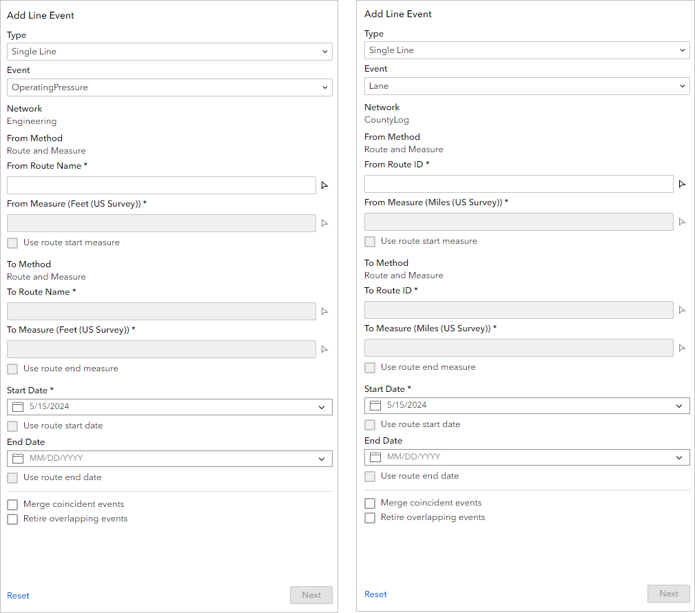
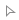
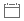
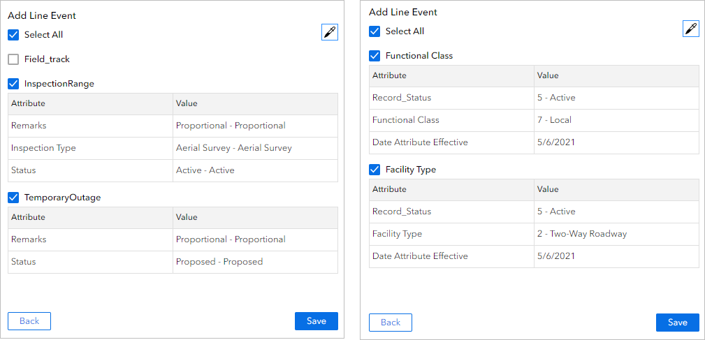
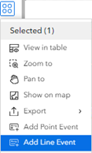
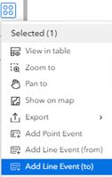

# Add Line Event widget

|   |   |
| --- | --- |
| **Kind** | Other · Experience Builder |
| **Release** | — |
| **Product** | Roads & Highways · Pipeline Referencing |
| **Issue** | [Beijing-R-D-Center/ExperienceBuilder-Web-Extensions#24791](https://devtopia.esri.com/Beijing-R-D-Center/ExperienceBuilder-Web-Extensions/issues/24791) |
| **Source** | [24791-AddLineEvent_CoordinatesMethod_V1.docx](<https://esriis.sharepoint.com/sites/LocationReferencing/Shared%20Documents/General/Doc%20Reviews/Pro36_Ent12/24791_AddPointLineWidgets_Coordinates/24791-AddLineEvent_CoordinatesMethod_V1.docx>) |
| **Edited** | 2025-08-18 23:54 by unknown |
| **Extracted** | 2026-09-04 · lane `xmlstrip` |

<!-- metadata
```yaml
title: "Add Line Event widget"
source_file: "24791-AddLineEvent_CoordinatesMethod_V1.docx"
source_url: "https://esriis.sharepoint.com/sites/LocationReferencing/Shared%20Documents/General/Doc%20Reviews/Pro36_Ent12/24791_AddPointLineWidgets_Coordinates/24791-AddLineEvent_CoordinatesMethod_V1.docx"
doc_id: 138
doc_kind: "Other"
surface: "Experience Builder"
doc_revision: "V1"
target_release: ""
pe: ""
dev: ""
author: ""
last_edited_by: ""
last_edited: "2025-08-18T23:54:35.8830985Z"
extracted: 2026-09-04
extraction_lane: xmlstrip
prompt_version: "v2.0.2"
keywords: ["line event", "route", "measure", "coordinate", "attribute set", "data validation", "pipeline referencing", "roads and highways"]
tools: ["Add Line Event", "Search By Route", "LRS Identify", "Table"]
products: ["Roads & Highways", "Pipeline Referencing"]
issues: ["Beijing-R-D-Center/ExperienceBuilder-Web-Extensions#24791"]
related: [{"doc":139,"file":"add-point-event-widget__doc139.md","s":1009.42},{"doc":49,"file":"coordinates-method-in-add-point-and-add-line-widgets-test-plan__doc49.md","s":1004.299},{"doc":411,"file":"add-line-event-widget__doc411.md","s":5.821},{"doc":410,"file":"add-line-event-widget__doc410.md","s":5.809},{"doc":413,"file":"add-line-event-widget__doc413.md","s":5.791}]
```
-->

## Summary

Describes the Add Line Event widget used to create and manage line events along routes in a Linear Referencing System for pipeline and roadway data. Covers configuration, usage with route and measure or coordinate methods, data validation options, and integration with other widgets via data actions.

## Related documents

<!-- related:begin -->
- [Add Point Event widget](<https://esriis.sharepoint.com/sites/lrsworkspace/LRS Doc Index/Other/add-point-event-widget__doc139.md>) — shared issue Beijing-R-D-Center/ExperienceBuilder-Web-Extensions#24791 · similar text 0.80 · 3 title words · 4 filename words · same kind/surface/folder <!-- rel:139 -->
- [Coordinates Method in Add Point and Add Line Widgets Test Plan](<https://esriis.sharepoint.com/sites/lrsworkspace/LRS Doc Index/Test Plans/coordinates-method-in-add-point-and-add-line-widgets-test-plan__doc49.md>) — shared issue Beijing-R-D-Center/ExperienceBuilder-Web-Extensions#24791 · similar text 0.12 · 2 title words · 3 filename words · same surface <!-- rel:49 -->
- [Add Line Event Widget](<https://esriis.sharepoint.com/sites/lrsworkspace/LRS%20Doc%20Index/Other/add-line-event-widget__doc411.md>) — similar text 0.54 · 4 title words · 2 filename words · same kind/surface <!-- rel:411 -->
- [Add Line Event Widget](<https://esriis.sharepoint.com/sites/lrsworkspace/LRS Doc Index/Other/add-line-event-widget__doc410.md>) — similar text 0.53 · 4 title words · 2 filename words · same kind/surface <!-- rel:410 -->
- [Add Line Event Widget](<https://esriis.sharepoint.com/sites/lrsworkspace/LRS Doc Index/Other/add-line-event-widget__doc413.md>) — similar text 0.53 · 4 title words · 2 filename words · same kind/surface <!-- rel:413 -->
<!-- related:end -->

<!-- docs:begin -->
## Esri documentation

[Release locks through the LRS Locks table](https://doc.esri.com/en/arcgis-pro/latest/help/production/roads-highways/lrs-locks-table.html) · [Split a centerline by measure](https://doc.esri.com/en/arcgis-pro/latest/help/production/roads-highways/split-a-centerline-by-measure.html) · [3D in Pipeline Referencing](https://doc.esri.com/en/arcgis-pro/latest/help/production/location-referencing-pipelines/3d-in-pipeline-referencing.html) · [3D in Roads and Highways](https://doc.esri.com/en/arcgis-pro/latest/help/production/roads-highways/3d-in-roads-and-highways.html)

_No page matched:_ [Add Line Event](https://www.google.com/search?q=%22Add%20Line%20Event%22+site%3Adoc.esri.com) · [Search By Route](https://www.google.com/search?q=%22Search%20By%20Route%22+site%3Adoc.esri.com) · [LRS Identify](https://www.google.com/search?q=%22LRS%20Identify%22+site%3Adoc.esri.com)
<!-- docs:end -->

---

## Add Line Event widget
The Add Line Event widget allows you to create line events along routes in a Linear Referencing System (LRS). You can use the widget to manage pipeline data with ArcGIS Pipeline Referencing and roadways data with ArcGIS Roads and Highways. You can represent characteristics of a route, such as operating pressure for a pipeline or lane information for a road, as line events.

### Examples for Pipeline Referencing
Use this widget to support app design requirements such as the following:

- You are a pipeline inspector and want to add inspection notes information for a pipe that is under maintenance.
- You want to add a new event feature and retire the overlapping section of a previous feature.
- You want to add operating pressure and DOT class information in one editing session.
- You want to add inspection range event data based on coordinates collected by field operators.

### Examples for Roads and Highways
Use this widget to support app design requirements such as the following:

- You want to add lane information for a freeway.
- You want to add a new median to a route and retire the overlapping section of the previous median.
- You want to add parking and access control information in one editing session.
- You want to add road closure event data based on coordinates collected by first responders.

### Usage notes
This widget requires connection to a Map widget. To add line events, the Map widget must be connected to a web map data source with an LRS published with the Linear Referencing and Version Management capabilities enabled.
To create an LRS and publish a feature service with the Linear Referencing and Version Management capabilities enabled, follow the steps in the ArcGIS Pro documentation:

- Pipeline Referencing—Create an LRS and share an LRS as web layers
- Roads and Highways—Create an LRS and share an LRS as web layers
To use the Add Line Event widget with linear referencing services published with ArcGIS Enterprise, you must be signed in with an ArcGIS Enterprise account.
When you include this widget in an app, a panel provides users with the following options for adding a line event:

- Type—Choose to add single or multiple line events.
  - Single Line—Add a single line event.
  - Multiple Line—Add multiple line events in one edit activity.
- Event (appears when you choose Single Line under Type)—Choose the event layer from which to add a line event.
- Network—This label lists the network layer that is used to add line events.
- Attribute Set (appears when you choose Multiple Line under Type)—If a layer is configured with attribute sets for Pipeline Referencing or attribute sets for Roads and Highways, you can choose one from the drop-down menu. The widget only displays line events that are part of the attribute set. Attribute sets are collections of event layer attributes. You can use attribute sets to create multiple events with a set of additional, organization-specific attributes in a single edit.
- From Method— The method the widget uses to specify the starting location of the added line event is listed here.This label lists the method the widget uses to define the point on the route where the line event starts.
  - Route and Measure – Specify the starting location of the added line event using a specific measure along a route.
    - From Route ID or From Route Name—Provide the name of the route you want to use to define the line event starting point. If the network layer has route name configured as an identifier, this setting is labeled From Route Name.
    - From Measure—Provide a measure value for the line event starting point. The measure value defines the exact location on the route where the line event starts. The label for this setting also displays the unit of measure defined by the network layer. For example, if the unit of measure is meters, at run time this setting is labeled From Measure (Meters).
  - Coordinate – Specify the starting location of the added line event using x-, y-, and z- coordinates.
    - From Route ID or Route Name - Provide the name of the route you want to use to define the line event starting point. If the network layer has route name configured as an identifier, this setting is labeled as From Route Name.
    - X Coordinate – Provide the xX cCoordinate.
    - Y Coordinate – Provide the Y Coordinate.
    - Z Coordinate – Optionally, provide the Z Coordinate.
    - From Measure – This label notes the nearest measure to the input coordinates. The label for this settingparameter also displayed the unit of measure defined by the network layer. For example, if the unit of measure is meters, at run time this setting is labeled From Measure (Meters).
    - Distance - This label notes the distance between the input coordinates and the nearest measure. The label for this parameter also displays the distance between the input coordinates and the nearest measure in the unit of measure defined by the network layer. For example, if the input coordinates are 10 meters away from the route, at run time this parameter is labeled Distance (Meters).
- To Method— The method the widget uses to specify the ending location of the added line event is listed here.This label lists the method the widget uses to define the point where the line event ends.
  - Route and Measure - Specify the ending location of the added line event using a specific measure along a route.
    - To RouteID or To Route Name—Provide the name of the route you want to use to define the line event ending point. If the network layer has route name configured as an identifier, this setting is labeled To Route Name. This option is only available when either the chosen event layer is a spanning line event or the chosen attribute set includes a spanning line event layer.
    - To Measure—Provide a measure value for the line event ending point. The measure value defines the exact location on the route where the line event endstarts. The label for this setting also displays the unit of measure defined by the network layer. For example, if the unit of measure is meters, at run time this setting is labeled To Measure (Meters).
  - Coordinate - Specify the ending location of the added line event using x-, y-, and z- coordinates.
    - To Route ID or To Route Name - Provide the name of the route you want to use to define the line event startingending point. If the network layer has route name configured as an identifier, this setting is labeled To Route Name.
    - X Coordinate – Provide the X Coordinate.
    - Y Coordinate – Provide the Y Coordinate.
    - Z Coordinate – Optionally, provide the Z Coordinate.
    - To Measure – This label notes the nearest measure to the input coordinates. The label for this setting also displayeds the unit of measure defined by the network layer. For example, if the unit of measure is meters, at run time this setting is labeled To Measure (Meters).
    - Distance - This label notes the distance between the input coordinates and the nearest measure. The label for this parameter also displays the distance between the input coordinates and the nearest measure in the unit of measure defined by the network layer. For example, if the input coordinates are 10 meters away from the route, at run time this parameter is labeled Distance (Meters).
- Start Date—Specify the start date of the event or events.
- End Date—Specify the end date of the event or events.
- Merge coincident events—Merge the new events with any existing attribute-exact events that overlap with the new events.Merge edited events that have exactly the same attributes as an existing event and are adjacent to or overlapping with that existing event in terms of measure values.
- Retire overlapping events—Retire existing events that overlap with the new events.

### Settings
The Add Line Event widget includes the following settings:

- Select Map—Select a Map widget.
- Load Layers—Load layers from the web maps in the connected Map widget. To load layers, the Map widget must be connected to a web map with LRS layers.
- Clear Layers—Remove all loaded layers from the widget.
- Layer Configuration—Click a layer to open the Layer Configuration panel.
  - LRS Network Layers
    - Label—Provide a meaningful label for the layer. This label appears in the widget panel at run time.
    - Search Methods
      - From Method
        - Route and Measure - If you choose this method, the widget specifies the location of added point events using the route name and measure value that the user provides.
        - Coordinate - If you choose this method, the widget specifies the location of added points using the x-, y-, and z- coordinates that the user provides.
      - To Method
        - Route and Measure - If you choose this method, the widget specifies the location of added point events using the route name and measure value that the user provides.
        - Coordinate - If you choose this method, the widget specifies the location of added points using the x-, y-, and z- coordinates that the user provides.
    - Spatial Reference – Set a spatial reference for the Coordinate Mmethod. You can use the spatial reference from the Mmap or from the LRS layers.
    - Search Radius – Set a search radius.
  - Event Layer
    - Label—Provide a meaningful label for the layer. This label appears in the widget panel at run time.
    - Use Field Alias—Turn on this setting to display field aliases at run time. An https://enterprise.arcgis.com/en/portal/11.5/use/describe-fields.htm  \halias, or display name, is an alternative name for a field. It is usually a more user-friendly description of the content of the field. Unlike true field names, aliases do not have to adhere to the limitations of the database, so they can contain special characters such as spaces.
    - Configure Fields—Choose which attribute fields from the layer to include in the widget panel at run time. You can define whether each attribute field is editable at run time by clicking Editable or Not editable.
- Note:
- The settings you define under Configure Fields only apply when the user is adding a single point event. For multiple points events, fields display if they are included in the attribute set the user chooses at run time.
- Default Settings—Configure the default settings that you want available in the widget when it first loads.
  - Event (Single Line)—Choose the default event layer for adding a single line event.
  - Network (Multiple Line)—Choose the default network layer for adding multiple line events. When the user is adding a single line event, the network is always the registered network for the selected event layer.
  - Type—Choose whether the widget is set to add single events or multiple events.
- From Method—Choose the default method for how the widget defines the line event starting point.
  - To Method—Choose the default method for how the widget defines the line event ending point.
  - For both From Method and To Method options, you can choose the following method:
    - Route and measure—The widget specifies locations using the route name and measure value that the user provides.
  - Type—Choose whether the widget is set to add single events or multiple events.
  - Attribute Set—If a layer is configured with attribute sets for Pipeline Referencing or attribute sets for Roads and Highways, you can choose a default one from the drop-down menu. The widget only displays line events that are part of the attribute set. Attribute sets are collections of event layer attributes. You can use attribute sets to create multiple events with a set of additional, organization-specific attributes in a single edit.
- Display Settings—Choose which settings to display in the widget panel at run time. If you choose to hide a setting here, the widget settings you configure under Default Settings are unchangeable by the user at run time.
  - Hide Type—Hide the Type setting from the widget panel.
  - Hide Event—Hide the Event setting from the widget panel.
  - Hide Network—Hide the Network setting from the widget panel.
  - Hide Method—Hide the From Method and To Method settings from the widget panel.
  - Hide Attribute Set—Hide the Attribute Set setting from the widget panel.
  - Hide Measures—Hide the From Measure and To Measure settings from the widget panel.

### Add a line event by providing a route name and measure valuesrRoute and mMeasure
Complete the following steps to add a line event using the Route and Measure method.

- Start Experience Builder. Sign in to an ArcGIS Enterprise portal.
- Add a Map widget. Connect it to a web map with LRS data published with the Linear Referencing capability enabled and, optionally, the Version Management capability enabled.
- Learn more about enabling these capabilities in ArcGIS Pro for Pipeline Referencing
- Learn more about enabling these capabilities in ArcGIS Pro for Roads and Highways
- Add an Add Line Event widget. Connect it to the Map widget, then load LRS layers from the Map widget.
- Publish the app.
- Launch the app. If prompted, sign in to your ArcGIS Enterprise portal.
- Zoom to the location where you want to add a line event.
- Note:
- To zoom to route locations, you can use the
- Search By Route widget
- or use
- data actions
- with the Search By Route widget or Table widget.
- Open the Add Line Event widget.
- You can also use data actions to add line events.
- Use the default type or click the Type drop-down arrow and change the type, if necessary.
- If Type is set to Single Line, use the default line event layer or click the Event drop-down arrow and choose another line event layer.
- If Type is set to Multiple Line, you can use the default attribute set or choose another attribute set.
- The value that appears under Network appears based on the selected event layer.
- Specify the starting location for the line event by doing one of the following:
  - Provide a route name in the From Route Name text box.
  - Click the route picker , then click a route on the map.
- The From Measure value populates based on the location you click. Once you provide a starting measure value, a green dot appears at that location on the map.
- Optionally, change the starting measure value by doing one of the following:
  - Provide a measure value in the From Measure text box.
  - Note:
  - Stationing measure values are also supported.
  - Click the measure picker , then click a point along the route.
- Specify the ending location for the line event by doing one of the following:
  - For events on a non-line network or non-spanning events on a line network, click the measure picker , then click the point on the route where you want the line event to end.
  - The To Route Name defaults to the From Route Name and cannot be changed. If you need to change the To Route Name, provide a new route name under From Route Name.
  - For spanning events on a line network, accept the default name for To Route Name, or change the ending route by providing another route name in the To Route Name text box.
  - Alternatively, click the route picker , then click the point on the route where you want the line event to end.
  - Note:
  - The From Route and To Route values must be on the same line.
- Once you provide an ending measure value, a red dot appears at that location on the map.
- Optionally, specify a new ending measure by doing one of the following:
  - Provide a measure value in the To Measure text box.
  - Note:
  - Stationing measure values are also supported.
  - Click the measure picker  and click the measure value along the route on the map.
- Specify the starting date of the event by doing one of the following:
  - Leave the default start date, which is the current date.
  - Provide a start date in the Start Date text box.
  - Click the calendar button  and choose a start date.
  - Check the Use route start date check box.
- Optionally, specify the ending date for the line event by doing one of the following:
  - Provide an end date in the End Date text box.
  - Click the calendar button  and choose an end date.
  - Check the Use route end date check box.
  - Note:
  - If you do not provide an end date, the event continues forever into the future.
- Choose a data validation option to prevent erroneous input while characterizing a route with line events.
  - Merge coincident events—When all attribute values for a new event are exactly the same as an existing event, and if the new event is adjacent to or overlapping an existing event in terms of its measure values, and its time slices are coincident or overlapping, the new event is merged with the existing event and the measure range is expanded accordingly. For more information, refer to scenarios for merging coincident events in ArcGIS Pipeline Referencing or retire overlaps scenarios in ArcGIS Roads and Highways.
  - Retire overlapping events—The measure, start date, and end date of existing events are adjusted to prevent overlaps with respect to time and measure values once the new line event or events are created. For more information, refer to retire overlaps scenarios in ArcGIS Pipeline Referencing or retire overlaps scenarios in ArcGIS Roads and Highways.
- Click Next.
- The attributes for the chosen line event layer appear in a second pane.
- Provide attribute values for the event layer.
- For multiple events, an attribute set can contain events associated with different networks. Only events associated with the selected network appear.
- For multiple events, use the check boxes of the event layers to include or exclude them in the edit activity. Unselected events will not be added.
- For multiple events, whether an event field is visible and editable depends on the configuration of the attribute set. The event configuration for single events does not apply when adding multiple events.
- You can use the Copy Attributes tool to copy attributes from an existing event.
- Click Save.
- A confirmation message appears on the tool pane once the new line event is added and appears on the map.

### Add a line event by cCoordinates
Complete the following steps to add a line event using the Route and Measure method.

- Start Experience Builder. Sign in to an ArcGIS Enterprise portal.
- Add a Map widget. Connect it to a web map with LRS data published with the Linear Referencing capability enabled and, optionally, the Version Management capability enabled.
- https://pro.arcgis.com/en/pro-app/3.5/help/production/location-referencing-pipelines/share-web-layers-with-linear-referencing-capability.htm \hLearn more about enabling these capabilities in ArcGIS Pro for Pipeline Referencing
- https://pro.arcgis.com/en/pro-app/3.5/help/production/roads-highways/share-as-web-layers.htm \hLearn more about enabling these capabilities in ArcGIS Pro for Roads and Highways
- Add an Add Line Event widget. Connect it to the Map widget, then load LRS layers from the Map widget.
- Publish the app.
- Launch the app. If prompted, sign in to your ArcGIS Enterprise portal.
- Zoom to the location where you want to add a line event.
- Note:
- To zoom to route locations, you can use the Search By Route widget or use data actions
- with the Search By Route widget or Table widget.
- Open the Add Line Event widget.
[ADD SCREENSHOTS HERE]

- Use the default type or click the Type drop-down arrow and change the type, if necessary.
- If Type is set to Single Line, use the default point event layer or click the Event drop-down arrow and choose another point event layer.
The value that appears under Network is based on the selectedchosen event layer.

- If Type is set to Multiple Line, use the default attribute set or choose another attribute set.
- If there are multiple methods configured in the widget settings, choose Coordinate from the From Method drop-down menu.
- Specify a route by doing one of the following:
  - Provide a route ID in the From RouteID text box.
  - Click the route picker [INSERT ROUTE PICKER ICON HERE], and click a route on the map.
  - Leave the From RouteID text box blank and proceed to the next step. Once valid values are input into the X Coordinate, Y Coordinate, and optionally Z Coordinate text boxes, the nearest route’s route ID will populate the RouteID text box.
- Specify a location for the starting measure of the line event by providing values in the X Coordinate and Y Coordinate text boxes. Optionally, provide a value in the Z Coordinate text box.
- If there are multiple methods configured in the widget settings, choose Coordinate from the To Method drop-down menu.
- Specify the ending routeID for the line event by doing one of the following:
  - For events on a non-line network or non-spanning line events on a line network, the To RouteID defaults to the From RouteID and cannot be changed. If you need to change the To RouteID, provide a new routeID under From RouteID.
  - For spanning events on a line network, accept the default ID for the To RouteID, or change the ending route by providing another routeID in the To RouteID text box.
- Specify a location for the ending measure of the line event by providing values in the X Coordinate and Y Coordinate text boxes. Optionally, provide a value in the Z Coordinate text box.
- Specify the starting edate of the event by doing one of the following:
  - Leave the default start date, which is the current date.
  - Provide a start date in the Start Date text box.
  - Click the calendar button  and choose a start date.
  - Check the Use route start date check box.
- Optionally, specify the ending date for the line event by doing one of the following:
  - Provide an end date in the End Date text box.
  - Click the calendar button  and choose an end date.
  - Check the Use route end date check box.
  - Note:
  - If you do not provide an end date, the event continues forever into the future.
- Choose a data validation option to prevent erroneous input while characterizing a route with line events.
  - Merge coincident events—When all attribute values for a new event are exactly the same as an existing event, and if the new event is adjacent to or overlapping an existing event in terms of its measure values, and its time slices are coincident or overlapping, the new event is merged with the existing event and the measure range is expanded accordingly. For more information, refer to https://pro.arcgis.com/en/pro-app/3.5/help/production/location-referencing-pipelines/add-a-line-event.htm  \hscenarios for merging coincident events in ArcGIS Pipeline Referencing or https://pro.arcgis.com/en/pro-app/3.5/help/production/roads-highways/add-a-line-event.htm  \hretire overlaps scenarios in ArcGIS Roads and Highways.
  - Retire overlapping events—The measure, start date, and end date of existing events are adjusted to prevent overlaps with respect to time and measure values once the new line event or events are created. For more information, refer to https://pro.arcgis.com/en/pro-app/3.5/help/production/location-referencing-pipelines/add-a-line-event.htm  \hretire overlaps scenarios in ArcGIS Pipeline Referencing or https://pro.arcgis.com/en/pro-app/3.5/help/production/roads-highways/add-a-line-event.htm  \hretire overlaps scenarios in ArcGIS Roads and Highways.
- Click Next.
- The attributes for the chosen line event layer appear in a second pane.
- Provide attribute values for the event layer.
- For multiple events, an attribute set can contain events associated with different networks. Only events associated with the selected network appear.
- For multiple events, use the check boxes of the event layers to include or exclude them in the edit activity. Unselected events will not be added.
- For multiple events, whether an event field is visible and editable depends on the configuration of the attribute set. The event configuration for single events does not apply when adding multiple events.
- You can use the Copy Attributes tool to copy attributes from an existing event.
- [ADD SCREENSHOTS HERE]
- Click Save.
- A confirmation message appears on the tool pane once the new line event is added and appears on the map.

### Interaction options
You can use data actions in other widgets to launch the Add Line Event widget and populate associated values. To be able to use data actions, the network in the source widget must have associated line events, the data action options of Add Line Event in the source widget must be turned on, and the Add Line Event widget must be configured in the experience. Turn off the data action options of Add Line Event in the source widget to not use data actions.
The following widgets support data actions of the Add Line Event widget:

- https://doc.arcgis.com/en/experience-builder/11.5/configure-widgets/lrs-identify-widget.htm \hLRS Identify widget—Data action populates the event or attribute set, network, route, measure, and date options.
- https://doc.arcgis.com/en/experience-builder/11.5/configure-widgets/search-by-route-widget.htm \hSearch By Route widget—Data action populates the event or attribute set, network, route, measure, and date options.
- https://doc.arcgis.com/en/experience-builder/11.5/configure-widgets/table-widget.htm \hTable widget—Data action populates the event or attribute set, network, route, and date options.
Note:
You can change any values after they are populated. If you do, the Add Line Event widget still validates all entries.

#### Run data actions with the Search By Route widget
To use the data action at run time with the Search By Route widget, complete the following steps:

- Select a result record in the Search By Route results.
- Click the Action button at the top of the Search By Route widget panel.
- Add a line event by doing one of the following:
  - Click Add Line Event, provide an ending measure value in the To Measure option, and attributes for the new line event.
  - The Event, Network, From Route ID or From Route Name, From Measure, To Route ID or To Route Name, Start Date, and End Date parameters populate based on the selected route from the Search By Route widget.
  - If the searched result contains a route with two measure values, click Add Line Event.
  - The Event, Network, From Route ID or From Route Name, From Measure, To Measure, To Route ID or To Route Name, Start Date, and End Date parameters populate based on the selected route from the Search By Route widget.
  - If the searched result contains a route with a single measure value, choose Add Line Event (from) to be the starting measure or Add Line Event (to) to be the ending measure of the line event to be added.
  - If you chose Add Line Event (from), the From Measure value populates and you must provide a To Measure value.
  - If you chose Add Line Event (to), the To Measure value populates and you must provide a From Measure value.
  - The Event, Network, From Route ID or From Route Name, From Measure or To Measure, To Route ID or To Route Name, Start Date, and End Date parameters populate based on the selected route from the Search By Route widget.
Note:
You can change any values after they are populated. If you do, the Add Line Event widget still validates all entries.

#### Run data actions with the Table widget
To use the data action at run time with the Table widget, complete the following steps:

- Select a record in the Table widget.
- Click the Action button at the top of the Table widget panel.
- Click Add Line Event.
- The Event or Attribute Set, Network, Route ID or Route Name, and Event OID parameters populate based on the selected event from the table.
- For a non-line network, select a route.
- The route you select populates both From Route and To Route values. You need to populate the measure values to add the events.
- For a line network, select one or two routes on the same line.
- If two routes are selected for a spanning event or events in an attribute set, they populate the From Route and To Route values according to their line order. You need to populate the measure values to add the events.
The From Date and To Date values are populated using the start and end dates of the searched route, or the route with the lower line order if two routes are selected.
Note:
You can change any values after they are populated. If you do, the Add Line Event widget still validates all entries.

#### Run data actions with the LRS Identify widget
To use the data action at run time with the LRS Identify widget, complete the following steps:

- Identify a location on a route with the LRS Identify widget.
- Click the Action button at the top of the LRS Identify widget panel.
- Click Add Point Event.
- The Event, Network, Route ID or Route Name, Measure, Start Date, and End Date parameters are populated based on the route and location from the LRS Identify widget.

     
