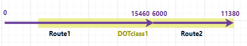
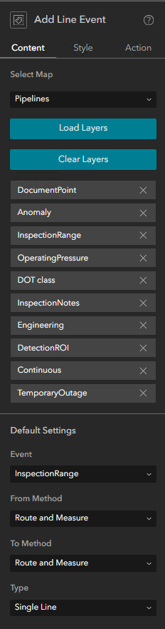
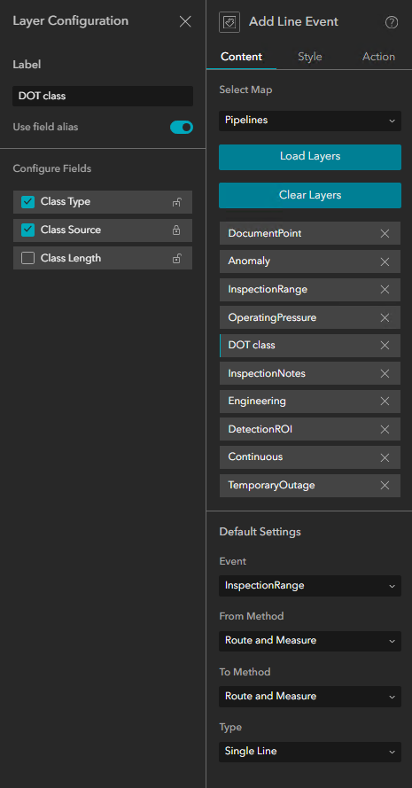
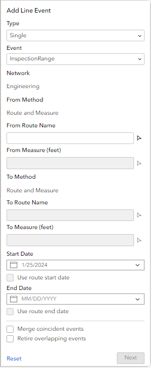
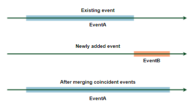
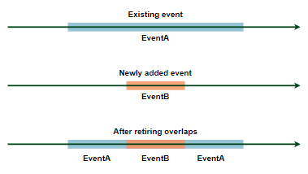
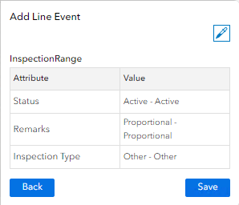

# Add Line Event Widget

|   |   |
| --- | --- |
| **Kind** | Other · Experience Builder |
| **Release** | — |
| **Source** | [Doc_AddSingleLineAPR_praveenfeedback (1).docx](<https://esriis.sharepoint.com/sites/LocationReferencing/Shared%20Documents/LR%20Product%20Engineers/Doc_AddSingleLineAPR_praveenfeedback%20(1).docx>) |
| **Edited** | 2024-03-11 20:17 by Mac Christmas |
| **Extracted** | 2026-09-04 · lane `xmlstrip` |

<!-- metadata
```yaml
title: "Add Line Event Widget"
source_file: "Doc_AddSingleLineAPR_praveenfeedback (1).docx"
source_url: "https://esriis.sharepoint.com/sites/LocationReferencing/Shared%20Documents/LR%20Product%20Engineers/Doc_AddSingleLineAPR_praveenfeedback%20(1).docx"
doc_id: 412
doc_kind: "Other"
surface: "Experience Builder"
doc_revision: ""
target_release: ""
pe: ""
dev: ""
author: "Mac Christmas"
last_edited_by: "Mac Christmas"
last_edited: "2024-03-11T20:17:00Z"
extracted: 2026-09-04
extraction_lane: xmlstrip
prompt_version: "v2.0.2"
keywords: ["line event", "route", "measure", "experience builder", "linear referencing", "event layer", "merge coincident events", "retire overlapping events"]
tools: ["Add Line Event"]
products: []
issues: []
related: [{"doc":410,"file":"add-line-event-widget__doc410.md","s":9.251},{"doc":413,"file":"add-line-event-widget__doc413.md","s":9.074},{"doc":411,"file":"add-line-event-widget__doc411.md","s":8.565},{"doc":138,"file":"add-line-event-widget__doc138.md","s":5.758},{"doc":455,"file":"experience-builder-add-single-line-event-widget__doc455.md","s":5.222}]
```
-->

## Summary

Describes the Add Line Event widget used to create new line events along routes in a Linear Referencing System (LRS). Covers widget parameters, configuration settings, usage examples, and step-by-step instructions for adding line events by route and measure in an Experience Builder application.

## Related documents

<!-- related:begin -->
- [Add Line Event Widget](<https://esriis.sharepoint.com/sites/lrsworkspace/LRS Doc Index/Other/add-line-event-widget__doc410.md>) — similar text 0.89 · 4 title words · 4 filename words · same kind/surface/folder <!-- rel:410 -->
- [Add Line Event Widget](<https://esriis.sharepoint.com/sites/lrsworkspace/LRS Doc Index/Other/add-line-event-widget__doc413.md>) — similar text 0.83 · 4 title words · 4 filename words · same kind/surface/folder <!-- rel:413 -->
- [Add Line Event Widget](<https://esriis.sharepoint.com/sites/lrsworkspace/LRS%20Doc%20Index/Other/add-line-event-widget__doc411.md>) — similar text 0.83 · 4 title words · 3 filename words · same kind/surface/folder <!-- rel:411 -->
- [Add Line Event widget](<https://esriis.sharepoint.com/sites/lrsworkspace/LRS Doc Index/Other/add-line-event-widget__doc138.md>) — similar text 0.52 · 4 title words · 2 filename words · same kind/surface <!-- rel:138 -->
- [Experience Builder: Add Single Line Event Widget](<https://esriis.sharepoint.com/sites/lrsworkspace/LRS Doc Index/User Stories/experience-builder-add-single-line-event-widget__doc455.md>) — similar text 0.26 · 4 title words · 3 filename words · same surface <!-- rel:455 -->
<!-- related:end -->

<!-- docs:begin -->
## Esri documentation

[Split a centerline by measure](https://doc.esri.com/en/arcgis-pro/latest/help/production/location-referencing-pipelines/split-a-centerline-by-measure.html) · [Multiple linear referencing methods](https://doc.esri.com/en/arcgis-pro/latest/help/production/location-referencing-pipelines/multiple-linear-referencing-methods.html)

_No page matched:_ [Add Line Event](https://www.google.com/search?q=%22Add%20Line%20Event%22+site%3Adoc.esri.com)
<!-- docs:end -->

---

## Add Line Event
The Add Line Event widget allows you to create new line events along routes in an LRS (Linear Referencing System). Characteristics of a route, such as DOT class and temporary outageInspection Range, can be represented as line events with measure information along the route.
As shown in the following example, Route1 and Route2 are on Line1, and a spanning line event, DOT class, with ID DOTclass1 is added to the two routes using the Add Line Event widget.

The following table provides details about the line event:

| Event | From Date | To Date | From Route Name | From Measure | To Route Name | To Measure | Location Error | Status |
| --- | --- | --- | --- | --- | --- | --- | --- | --- |
| DOTclass 1 | 1/1/2000 | <Null> | Route1 | 4000 | Route2 | 11380 | No Error | Proposed |

### Examples
Use this widget to support app design requirements such as the following:

- You are a pipeline inspector and want to add Inspection Notes information for a pipe under maintenance.
- You want to add a new DOT class and retire the overlapping section of the previous DOT class.

### Usage notes
This widget requires a connection to a Map Widget. To add line events, the Map widget must be connected to a web map data source published with an LRS with the Linear Referencing capability enabled.

- To create an LRS and publish a feature service with the Linear Referencing capability enabled, follow the steps for creating an LRS and sharing an LRS as web layers.
To use the Add Line Event widget with linear referencing services published with ArcGIS Enterprise, the user must be signed in with an ArcGIS Enterprise account with an assigned license for the {Location Referencing Experience Builder license name}.
When you include this widget in an app, a panel provides users with the following parameters for adding a line event:

- Type-Choose whether to add single or multiple line events.
  - Single-Add a single line event.
  - Multiple-Add multiple line events in one edit activity.
- Network-This is a label showing the associated network of the event(s) selected.
- From Method-Choose a method to specify the start location of line events.
  - Route and measure-The start location of the line events is based on route and measure inputs
- From Route Name-Provide a route name and the start location of for the line events will to be added on this route.
- From Measure-Provide a measure value on the From Route chosen. This label also contains the unit of measure of the network.
- To Method-Choose a method to specify the end location of line events
  - Route and measure-The end location of the line events is based on route and measure inputs
- To Route Name-Provide a route name and the end location of for the line events will to be added on this route.
- To Measure-Provide a measure value on the To Route chosen. This label also contains the unit of measure of the network.
- Start Date-Specify the start date of the events.
- End Date-Specify the end date of the events.
- Merge coincident events-When this option is turned on, the events to be added will merge with existing events if criteria are met. See more information below.
- Retire overlapping events- When this option is turned on, the events to be added will retire existing events where they overlap if criteria are met. See more information below.

### Configuration Settings
The Add Line Event widget includes the following settings:

- Select Map-Select a map that contains LRS data.
- Load Layers-Clicking on Load Layers button will load the event layers in the map and associated network layer.
- Clear Layers-Clicking on Clear Layers button will clear the loaded event and network layers. Use this button if you want to refresh the layers or the selected map is changed.
- Event Layers
  - Clicking on each event layer will show event Layer Configuration settings. Clicking on X will remove the event layer/s from the widget. Removed events will not show up in the published experience builder app.
- Layer Configuration-Select the event layer to add events to. For each layer, specify the following settings:
  - Label-Type a name for the event layer. This name appears in the widget.
  - Use field alias-Change the event layer’s attribute fields to display as either the field name or field alias.
  - Configure Fields-Turn the layer attribute fields on or off. Turned off layer attribute fields will not show up in the published experience builder app. You can also make an attribute field unnon-editable by clicking on the lock icon next to attribute field.
- Default Settings
  - Event-Choose the default event layer that will be chosen upon opening the widget.
  - From Method-Choose the default method for the events' start location when adding line events.
  - To Method-Choose the default method for the events' end location when adding line events.
  - Type-Choose whether the widget will add single or multiple line events.

#### Adding Line Event by Route and Measure

- Open your Experience Builder application, and sign into your ArcGIS Enterprise account.
Note:
Your ArcGIS Enterprise account must be licensed with {Location Referencing Experience Builder license name}.

- Add a Map widget and configure it with a Web map with LRS data published with the linear referencing and version management capabilities enabled.
- Add the Add Line Event widget, connecting it with the Map widget and importing its LRS data.
- Publish the experience builder app.
- Open the published app, if prompted, sign into your organization’s Portal for ArcGIS.
- Zoom in to the location where you want to add the line event. Open the Add Line Event widget.

For the Route and Measure method, the measure location is based on the measure values from the selected route.

- Use the default line event layer or click the Event Layer drop-down arrow and choose another line event layer to add

The selected Network value is based on the selected event layer.

- Specify the start location for the line eventSpecify a route for the line event to start from by doing either of the following:
- Provide a route name in the From Route Name text box.
- Click the route picker (insert icon) and click on the route where you want the line event to start from
The measure is initially populated using the route location where you clicked.

- If necessary, specify a new From Measure by doing one of the following:
- Provide the value in the From Measure text box.
- Click measure picker (insert icon) and click the measure value along the route on the map.
Once the From Measure is provided, a green dot appears on the map at that measure location.

- Specify the end location for the line event by doing the following:
- For events on a non-line network or non-spanning events on a line network, click the measure picker (insert icon) and click on the measure value where you want the line event to end.
The To Route Name defaults to the From Route Name and cannot be changed. If you need to change the route, re-select the From Route Name.

- For spanning events on a line network, accept the default To Route Name, or change the To Route Name by providing another route name in the To Route Name text box or clicking the route picker (insert icon) and click on the route where you want the line event to end.
The From Route and To Route must be on the same line.
The measure is initially populated using the route location where you clicked.

- If necessary, specify a new To Measure by doing one of the following:
- Provide the value in the To Measure text box.
- Click measure picker (insert icon) and click the measure value along the route on the map.
Once the To Measure is provided, a red dot appears on the map at that measure location.

- Specify the start date of the event by doing one of the following:
- Accept the start date default value that is today's date
- Type the start date in the Start Date text box.
- Click Calendar (insert icon) and choose the end date.
- Check the Use route start date check box.
- Optionally, specify the end date for the line event by doing one of the following:
- Type the end date in the End Date text box.
- Click Calendar (insert icon) and choose the end date.
- Check the Use Route end date check box.
If no end date is provided, the event remains valid from the event start date into the future.

- Choose a data validation option to prevent erroneous input while characterizing a route with line events.
- Merge coincident events—When all attribute values for a new event are exactly the same as an existing event, and if the new event is adjacent to or overlapping an existing event in terms of its measure values, and its time slices are coincident or overlapping, the new event is merged with the existing event and the measure range is expanded accordingly. For more information, refer to the merge coincident events scenarios.
- Retire overlaps—The measure, start date, and end date of existing events are adjusted to prevent overlaps with respect to time and measure values once the new line event or events are created. For more information, refer to the retire overlaps scenarios.
- Click Next.
- The attributes for the chosen line event layer appear on second pane. Provide attribute values for the event layer.

You can use the Copy Attributes tool to copy attributes from an existing event
.

- Click Save.
A confirmation message appears on the tool pane once the new line event is added and appears on the map.

      
