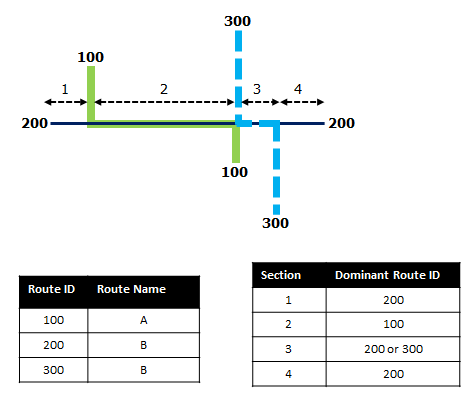
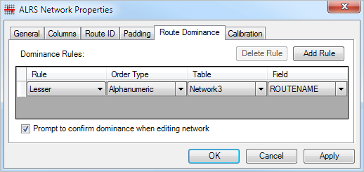
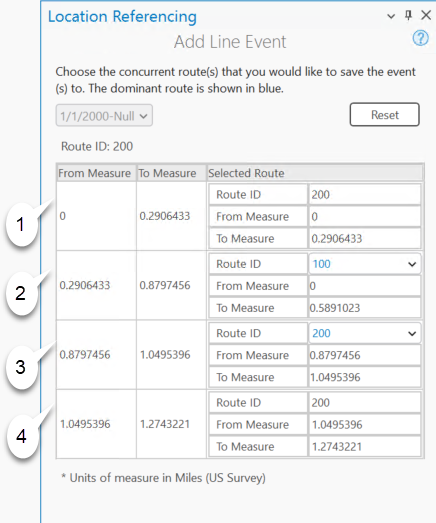
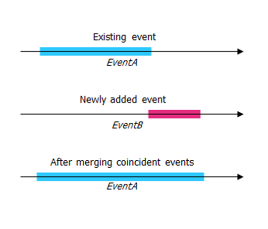
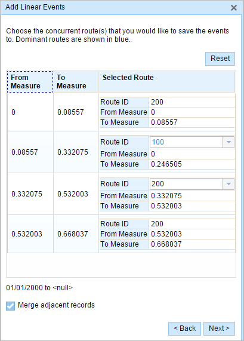
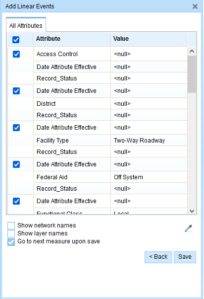
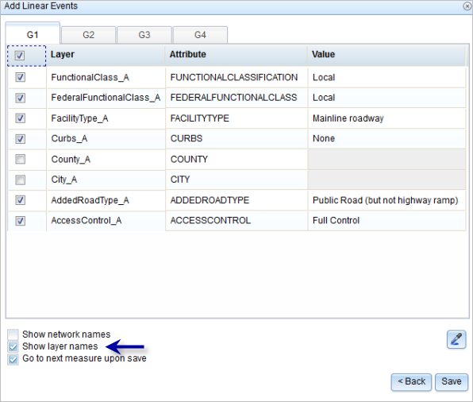
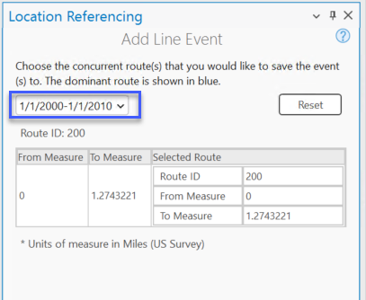
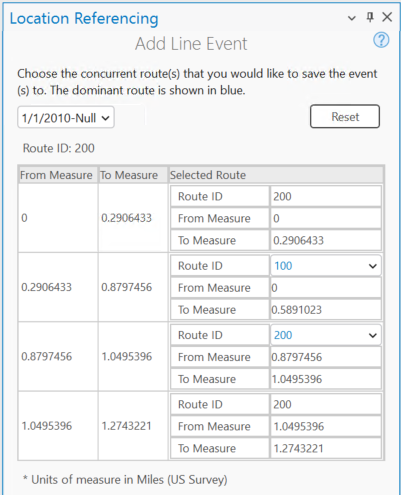

# Add Linear Events to Dominant Routes

| Field | Value |
| --- | --- |
| **Doc** | 326 · Other · Pro |
| **Product** | Roads & Highways |
| **Release** | — |
| **Issues** | — |
| **Source** | [AddLinearEvents_DominantRoute_RH.docx](<https://esriis.sharepoint.com/sites/LocationReferencing/Shared%20Documents/General/Doc%20Reviews/5858_line-event-dominant-route/AddLinearEvents_DominantRoute_RH.docx>) |
| **People** | author — · PE — · dev — |
| **Edited** | 2024-08-29 22:36 by unknown |
| **Extracted** | 2026-09-04 · lane xmlstrip · format 3.0 · prompt v2.0.2 |
| **Keywords** | linear event · dominant route · concurrent routes · route dominance · route concurrency · event attributes · data validation |
| **Tools** | Add Line Event · Event Editor · Copy Attribute Values |

## Summary

Describes the Add Line Event tool for adding linear events to dominant routes in cases of route concurrences. Explains route dominance rules, steps to add line events using ArcGIS Pro and Event Editor, data validation options, and handling concurrent routes with different time ranges.

## Related documents

<!-- related:begin -->
- [Adding Linear Events to Dominant Routes](<https://esriis.sharepoint.com/sites/lrsworkspace/LRS Doc Index/Other/adding-linear-events-to-dominant-routes.md>) — similar text 0.57 · 4 title words · 5 filename words · same kind/surface/folder <!-- rel:301 s=9.11 -->
- [Adding Point Events to Dominant Routes](<https://esriis.sharepoint.com/sites/lrsworkspace/LRS Doc Index/Other/adding-point-events-to-dominant-routes-rh.md>) — similar text 0.46 · 3 title words · 1 filename word · same kind/surface <!-- rel:310 s=5.435 -->
- [Adding Point Events to Dominant Routes](<https://esriis.sharepoint.com/sites/lrsworkspace/LRS Doc Index/Other/adding-point-events-to-dominant-routes-apr.md>) — similar text 0.45 · 3 title words · 1 filename word · same kind/surface <!-- rel:309 s=5.146 -->
- [Add multiple line events by route and measure](<https://esriis.sharepoint.com/sites/lrsworkspace/LRS Doc Index/Other/6134-add-multiple-line-events-by-route-and-measure.md>) — similar text 0.39 · 2 title words · 2 filename words · same kind/surface <!-- rel:120 s=4.915 -->
- [Add Line Event to Dominant Route in ArcGIS Pro](<https://esriis.sharepoint.com/sites/lrsworkspace/LRS Doc Index/User Stories/add-line-event-to-dominant-route-in-pro.md>) — similar text 0.17 · 2 title words · 2 filename words · same surface <!-- rel:370 s=4.176 -->
<!-- related:end -->

<!-- docs:begin -->
## Esri documentation

[Event editing using the attribute table](https://doc.esri.com/en/arcgis-pro/latest/help/production/roads-highways/event-editing-using-the-attribute-table.html)

_No page matched:_ [Add Line Event](https://www.google.com/search?q=%22Add%20Line%20Event%22+site%3Adoc.esri.com) · [Event Editor](https://www.google.com/search?q=%22Event%20Editor%22+site%3Adoc.esri.com) · [Copy Attribute Values](https://www.google.com/search?q=%22Copy%20Attribute%20Values%22+site%3Adoc.esri.com)
<!-- docs:end -->

---

## Add linear events to dominant routes
The Add Line Event tool allows you to add linear events to dominant routes where route concurrences exist.

### Concurrent routes
Concurrent routes are routes that share the same centerlines; that is, they travel the same pavement but are modeled with different measures. This relationship may exist to model two routes with different directions of calibration, or to model locations on highways where multiple routes converge into a common roadway for a subset of their paths. Where these concurrent routes exist, you can choose a route that's considered dominant using a set of rules.
The Add Line Event tool allows you to add linear events to dominant routes. For example, in the following image, there are three routes with route IDs: 100 with Name A, 200 with Name B, and 300 with Name B.

The route dominance rule is set as the lesser the Route Name, the more dominant the route. Using this condition, route 100 is the most dominant route, and routes 200 and 300 have the same order in dominance.

If you want to add linear events from the start of route 200 to the end of route 200, that process is done in four sections as shown in the following image and table.

| Section |  | Description |  |
| --- | --- | --- | --- |
|  |  | Route 200 is the dominant route, since no other route exists in this section; therefore, the event will be added to route 200. |  |
|  |  | Route 100 has the greater order of dominance; therefore, the event will be added to route 100. |  |
|  |  | Both route 200 and route 300 have the same order of dominance; therefore, the event will be added to the route of your choice. |  |
|  |  | Route 200 is the dominant route, since no other route exists in this section; therefore, the event will be added to route 200. |  |

1. Section 1—Route 200 is the dominant route, since no other route exists in this section; therefore, the event will be added to route 200.

1. Section 2—Route 100 has the greater order of dominance; therefore, the event will be added to route 100.

1. Section 3—Both route 200 and route 300 have the same order of dominance; therefore, the event will be added to the route of your choice.

1. Section 4—Route 200 is the dominant route, since no other route exists in this section; therefore, the event will be added to route 200.
Note:
Route dominance rules should be configured to access this functionality.
Events in the aAttribute Sset should belong to the same network for which the Route ID is selected.
You can add events to one route at a time.
Cocurrent_page1.png

### Add the line events
To add linear events to dominant routes, complete the following steps:

1. Open the map in ArcGIS Pro and zoom to the location where you want to add the line event.

1. Click the Location Referencing tab, and in the Events group, click Add > Line Event .

- The Add Line Event pane appears with the Route and Measure default value as the From Method and To Method values.
- Using the Route and Measure method, the measure location is based on the measure values from the selected route.

1. Click Next.

- The route, measure, and date text boxes appear in the Add Line Event pane. The From: Route and Measure, To: Route and Measure, and Dates sections appear in the Add Line Event pane.
- Firstpane_RH.png

1. Click the Event Layer drop-down arrow and choose the line event layer.

- The Network layer is automatically populated once the event layer is chosen. The network serves as the source linear referencing method (LRM) to define the input measures for the event.
- The network is an LRS Network published as a layer in the feature service.

1. Click Choose route from map  and select the route on the map to populate the Route ID value.

- Note:
- If a message regarding acquiring locks or reconciling appears, https://pro.arcgis.com/en/pro-app/3.3/help/production/roads-highways/conflict-prevention.htm \hconflict prevention is enabled.

1. In the From: Route and Measure section, specify the start measure for the new line event along the route by doing one of the following to populate the Measure text box:

- Click Choose measure from map  and click the start measure value along the route on the map.
- Check the Route start date check box.
- Provide the start measure value in the Measure text box.
- A green point appears at the selected location on the map.

1. Optionally, in the To: Route and Measure section, specify the end measure for the new line event along the route by doing one of the following to populate the Measure text box:

- Click Choose measure from map  and select the start end measure value along the route on the map.
- Check the Use route end measure check box.
- Provide the end measure value in the Measure text box.
- A red point appears at the selected location on the map. The event will be created between the green and the red points.

1. Specify the start date of the event by doing one of the following:

- Click Calendar  and choose the start date.
- Provide the start date in the Start Date text box.
- Check the Route start date check box.
- Double-click in the Start Date text box to use the current date.
- The start date default value is today's the current date, but you can choose a different date using the date picker.

1. Optionally, specify the end date of the event by doing one of the following:

- Click Calendar  and choose the end date.
- Provide the end date in the End Date text box.
- Check the Route end date check box.
- Double-click in the End Date text box to use today's the current date.
- If no end date is provided, the event remains valid from the route start date into the future.

1. Choose a data validation option to prevent erroneous input while characterizing a route with line events.

  - Retire overlaps—The measure, start date, and end date of existing events are adjusted to prevent overlaps with respect to time and measure values once the new line event or events are created. For more information, refer to the https://pro.arcgis.com/en/pro-app/3.3/help/production/roads-highways/add-a-line-event.htm  \hretire overlaps scenarios.
  - Learn more about retire overlap scenarios
  - Merge coincident events—When all attribute values for a new event are exactly the same as an existing event, and if the new event is adjacent to or overlapping an existing event in terms of its measure values, and its time slices are coincident or overlapping, the new event is merged with the existing event and the measure range is expanded accordingly. For more information, refer to the https://pro.arcgis.com/en/pro-app/3.3/help/production/roads-highways/add-a-line-event.htm  \hmerge coincident events scenarios.

1.

1. Check the Add event to dominant route check box.

1. Click Next.

1. The route dominance table appears.
Cocurrent_page.png

- The From Measure and To Measure columns show the values for each section of the chosen route from the previous pane. The From Measure and To Measure boxes under Route ID show the value for each dominant route where the events will be added.
- A black route ID without a drop-down arrow signifies that there was a single route in that section. A blue route ID with a drop-down arrow signifies that there are concurrent routes in that section, and the blue route is selected by the software based on the route dominance rules. You can select any other route using the drop-down arrow.
- If you check the Merge coincident events check box, the records in sections 3 and 4 will be merged since they have the same route ID.

1. Click Next.

- The attributes for the chosen event layer appear under Manage Attributes.

1. Provide attribute value information for the event.

- Attributespane_RH.png
- Note:
- Click Copy attribute values by choosing event from map  and click an existing line event belonging to the same event layer on the map to copy event attributes from that event.
- Note:
- https://pro.arcgis.com/en/pro-app/3.3/help/data/geodatabases/overview/an-overview-of-attribute-domains.htm  \hCoded value domains, https://pro.arcgis.com/en/pro-app/3.3/help/data/geodatabases/overview/an-overview-of-attribute-domains.htm \hrange domains, https://pro.arcgis.com/en/pro-app/3.3/help/data/geodatabases/overview/an-overview-of-subtypes.htm \hsubtypes, https://pro.arcgis.com/en/pro-app/3.3/help/data/geodatabases/overview/contingent-values.htm \hcontingent values, and https://pro.arcgis.com/en/pro-app/3.3/help/data/geodatabases/overview/an-overview-of-attribute-rules.htm \hattribute rules are supported when configured for a field.

1. Click Run.

- A confirmation message appears once the line event is added and appears on the map.

1. Open Event Editor and, if prompted, sign in to your ArcGIS organization.

1. Click the Edit tab.

1. In the Edit Events group, click Line Events .

- The Add Linear Events widget appears.
- Note:
- The selections for the network To and From method and measure can be configured in advance when configuring, creating, or editing the default settings for attribute sets.
- Learn more about https://enterprise.arcgis.com/en/roads-highways/11.3/event-editor/configuring-attribute-sets.htm \hconfiguring and https://enterprise.arcgis.com/en/roads-highways/11.3/event-editor/producing-attribute-sets.htm \hcreating and editing default settings for attribute sets.

1. Click the Network drop-down arrow and choose the network that will serve as a source linear referencing method (LRM) for defining the input measures for the new events.

- The network is an LRS Network published as a layer in Event Editor.
- You can specify the LRS Network to be used as the linear referencing method (LRM) for defining the start and end measures of the new linear event.

1. Provide the route ID on which the event's From Measure will be located.

- Tip:
- You can also click Select a Route on the Map  to select the route on the map.

1. In the From section, choose the first option (with the suffix Network) in the Method drop-down list.

1. Provide the intended start location for the new linear event along the route using any of the following options:

  - Provide the value in the Measure text box.
  - Click the Select From Measure on the Map button  and choose the From Measure value along the route on the map.
  - Click the Measure drop-down arrow and choose either Use the Route Start or Use the Route End as the From Measure value for the event.
- If you provide the From Measure value, you can choose the unit of measurement for that value using the drop-down arrow. The From Measure value will be converted into LRS units before saving the newly added events. For example, if the LRS is in miles and you've specified 528 feet as the From Measure value, the newly added events will have a From Measure value of 0.1 miles, because 528 feet equals 0.1 miles.
- A green plus symbol appears at the selected location on the map.

1. For the To Measure value, repeat steps 4 through 6 for the To section.

- A red x symbol appears at the selected location on the map.

1. Choose the date that will define the start date of the events by doing one of the following:

  - Provide the start date in the Start Date text box.
  - Click the Start Date drop-down arrow and choose the start date.
  - Check the Use route start date check box.
- The start date default value is the current date, but you can choose a different date using the date picker.
- Note:
- If you configured the Event Editor instance to not allow dates before the start date of the route, and you provide a date that is before the start date of the selected route in Start Date, a warning message appears alerting you to choose a date on or after the start date of the selected route.

1. Choose the date that will define the end date of the events by doing one of the following:

  - Provide the end date in the End Date text box.
  - Click the End Date drop-down arrow and choose the end date.
  - Check the Use route end date check box.
- The end date is optional, and if it is not provided, the event remains valid now and into the future.

1. Choose from the following data validation options to prevent erroneous input while characterizing a route with linear events:

  - Retire overlaps—The system adjusts the measure and start and end dates of existing events so that the new event does not cause an overlap with respect to time and measure values.
  - Merge coincident events—When all attribute values for a new event are exactly the same as an existing event, and if the new event is adjacent to or overlapping the existing event in terms of measure values, the new event is merged into the existing event and the measure range is expanded accordingly.
  - Prevent measures not on route—The input measure values for the starting measure and ending measure values fall in the minimum and maximum range of measure values on the selected route.
  - Save events to dominant routes—Events are added to the dominant route in a section with concurrent routes. If enabled, any concurrent sections on the route selected allow you to choose which route the events will be added to on each concurrent section. This option is available when the network selected has dominance rules configured.

1. Check the Save events to dominant routes check box.

- This https://enterprise.arcgis.com/en/roads-highways/11.3/event-editor/configuring-the-event-editor-web-application.htm \hdominant routes option can be configured to be checked or not checked by default using the Event Editor configuration file.

1. Click Next.

- The route dominance table appears.
- The From Measure and To Measure columns show the values for each section of the chosen route from the previous pane. The From Measure and To Measure boxes under Route ID show the value for each dominant route where the events will be added.
- A black route ID without a drop-down arrow signifies that there was a single route in that section. A blue route ID with a drop-down arrow signifies that there are concurrent routes in that section, and the blue route is selected by the software based on the route dominance rules. You can select any other route using the drop-down arrow.
- A yellow route ID box with a drop-down arrow signifies that there is an ambiguous situation in selecting the dominant route, as there is a tie in the route names of route 200 and route 300. In this case, you need to manually select a route ID using the drop-down arrow. The yellow color disappears once you've manually selected a route.
- Select route 200. If you check the Merge adjacent records check box, the records in sections 3 and 4 will be merged since they have the same route ID.

1. Click Next.

- The tab showing the attribute set for the events opens. The event fields are shown under attribute group G1.
- Note:
- You can check the check boxes to add data for specific events within the attribute set. No records are added for the events that are not checked. As shown in the following image, no records are added to the County_A and City_A events.

1.  Provide the attribute information for the new event in the tables defined by attribute sets.

- You can use the Copy Attribute Values tool  to copy event attributes from another route. Click the tool and click a route on the map to copy the event attributes.
- Event Editor uses a default attribute set, as shown on the Edit tab. You can modify the attribute set to https://enterprise.arcgis.com/en/roads-highways/11.3/event-editor/configuring-attribute-sets.htm \hcreate custom attribute sets or use the administrator-configured attribute set.

1. To access more information about the attribute set, do any of the following:

  - Check the Show network name check box to show the LRS Network associated with the selected event layer.
  - The list of attributes in the tables defined by attribute sets can be from more than one event layer. To identify the source event layer for each attribute, check the Show layer names check box.
  - Check the Go to the next measure upon save check box to prepopulate the From Measure value using the To Measure value of the present section to continue the event creation process.

1. Click Save.

- The new linear events are created and appear on the map. A confirmation message appears at the lower right once the newly added line events are saved.
After an event has been created, you can do the following to continue characterizing the route:

1. Click New Edit to clear all the input entries in the widget and restore the default values from the geodatabase to the attribute table.

1. Click Next Edit to retain all the existing entries in the widget and the attribute table for the convenience of quick editing of similar characteristics.

### Concurrent routes with different time ranges
The following image shows concurrent routes with different time ranges:

Route 200 has the From Date value of 1/1/2000, whereas route 100 and route 300 have the From Date value of 1/1/2010. Therefore, if the selected start date of the event is 1/1/2000, there are two route time ranges:

1. 1/1/2000 to 1/1/2010, when only route 200 existed.

- Timeslices_RH.png

1. 1/1/2010 to Null, when all three routes existed.

- Timeslices1_RH.png

