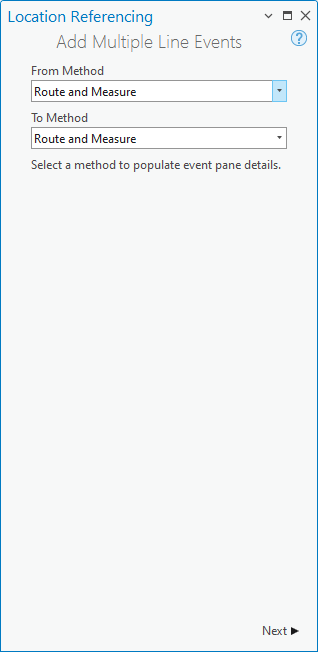
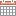
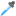

# Add multiple line events by route and measure

|   |   |
| --- | --- |
| **Kind** | Other · Pro |
| **Release** | — |
| **Product** | Pipeline Referencing |
| **Issue** | [ArcGISPro/ps-location-referencing#6134](https://devtopia.esri.com/ArcGISPro/ps-location-referencing/issues/6134) |
| **Source** | [6134_APR_Add multiple line events.docx](<https://esriis.sharepoint.com/sites/LocationReferencing/Shared%20Documents/General/Doc%20Reviews/Pro36_Ent12/6134_APR_Add%20multiple%20line%20events.docx>) |
| **Edited** | 2025-09-18 17:29 by unknown |
| **Extracted** | 2026-09-04 · lane `xmlstrip` |

<!-- metadata
```yaml
title: "Add multiple line events by route and measure"
source_file: "6134_APR_Add multiple line events.docx"
source_url: "https://esriis.sharepoint.com/sites/LocationReferencing/Shared%20Documents/General/Doc%20Reviews/Pro36_Ent12/6134_APR_Add%20multiple%20line%20events.docx"
doc_id: 120
doc_kind: "Other"
surface: "Pro"
doc_revision: ""
target_release: ""
pe: ""
dev: ""
author: ""
last_edited_by: ""
last_edited: "2025-09-18T17:29:28.1026441Z"
extracted: 2026-09-04
extraction_lane: xmlstrip
prompt_version: "v2.0.2"
keywords: ["line event", "route", "measure", "referent", "retire overlaps", "merge coincident events", "attribute set", "data validation"]
tools: ["Add Multiple Line Events"]
products: ["Pipeline Referencing"]
issues: ["ArcGISPro/ps-location-referencing#6134"]
related: [{"doc":235,"file":"add-point-events-by-location-offset__doc235.md","s":5.351},{"doc":686,"file":"add-multiple-line-events-tool-in-arcgis-pro__doc686.md","s":4.977},{"doc":326,"file":"add-linear-events-to-dominant-routes__doc326.md","s":4.915},{"doc":234,"file":"add-point-events-by-location-offset__doc234.md","s":4.899},{"doc":410,"file":"add-line-event-widget__doc410.md","s":4.855}]
```
-->

## Summary

Describes the workflow and tool usage for adding multiple line events simultaneously by specifying routes and measures in ArcGIS Pro. Explains configuration options including referent offsets, data validation choices such as retiring overlaps and merging coincident events, and provides examples illustrating these scenarios with event attribute details.

## Related documents

<!-- related:begin -->
- [Add Point Events by Location Offset](<https://esriis.sharepoint.com/sites/lrsworkspace/LRS Doc Index/Other/add-point-events-by-location-offset__doc235.md>) — similar text 0.43 · 2 title words · 3 filename words · same kind/surface <!-- rel:235 -->
- [Add Multiple Line Events tool in ArcGIS Pro](<https://esriis.sharepoint.com/sites/lrsworkspace/LRS Doc Index/User Stories/add-multiple-line-events-tool-in-arcgis-pro__doc686.md>) — similar text 0.19 · 4 title words · 3 filename words · same surface <!-- rel:686 -->
- [Add Linear Events to Dominant Routes](<https://esriis.sharepoint.com/sites/lrsworkspace/LRS Doc Index/Other/add-linear-events-to-dominant-routes__doc326.md>) — similar text 0.39 · 2 title words · 2 filename words · same kind/surface <!-- rel:326 -->
- [Add Point Events by Location Offset](<https://esriis.sharepoint.com/sites/lrsworkspace/LRS Doc Index/Other/add-point-events-by-location-offset__doc234.md>) — similar text 0.44 · 2 title words · 2 filename words · same kind/surface <!-- rel:234 -->
- [Add Line Event Widget](<https://esriis.sharepoint.com/sites/lrsworkspace/LRS Doc Index/Other/add-line-event-widget__doc410.md>) — similar text 0.40 · 2 title words · 3 filename words · same kind <!-- rel:410 -->
<!-- related:end -->

<!-- docs:begin -->
## Esri documentation

[Add multiple line events](https://doc.esri.com/en/arcgis-pro/latest/help/production/location-referencing-pipelines/add-multiple-line-events.html) · [Split a centerline by measure](https://doc.esri.com/en/arcgis-pro/latest/help/production/location-referencing-pipelines/split-a-centerline-by-measure.html) · [Storing referent and offset information for event location](https://doc.esri.com/en/arcgis-pro/latest/help/production/location-referencing-pipelines/storing-referent-and-offset-information-for-event-location.html)
<!-- docs:end -->

---

## Add multiple line events by route and measure
Characteristics of a route can be represented as a line event with start and end measure information along the route. Use the Add Multiple Line Events tool  to add multiple line events at the same time.
The example in the following workflow demonstrates adding multiple line events.
The following diagram shows the routes and their attributes:

The following table provides details about attributes for the routes (R1, R2, and R3) that belong to Line A. Events are added between R1 and R3.

| Route ID | From Date | To Date |
| --- | --- | --- |
| R1 | 1/1/2000 | <Null> |
| R2 | 1/1/2000 | <Null> |
| R3 | 1/1/2000 | <Null> |

### Add multiple line events by route and measure
Complete the following steps to add multiple line events by route and measure:

- Open the map in ArcGIS Pro and zoom in to the location where you want to add the line events.
- Click the Location Referencing tab, and in the Events group, click Add > Multiple Line Events .
- The Add Multiple Line Events pane appears with the Route and Measure default value as the From Measure and To Measure values.
- Using the Route and Measure method, the measure location is based on the measure values from the selected route.
- Click Next.
- The From: Route and Measure, To: Route and Measure and Dates sections appear in the Add Multiple Line Events pane.
- Click the Network drop-down arrow and choose the LRS Network of the route where you want to add line events.
- The network serves as the source linear referencing method (LRM) to definelocate the input measures for the event.
- The network is an LRS Network published as a layer in the feature service.
- If the selected network is a line network, click Choose line from map  and choose a line from the map to populate the Line Name text box.
- Alternatively, provide the line name in the Line Name text box.
- In the From: Route and Measure section, specify a starting route by doing one of the following:
- Cclick Choose route from map  and click the starting from route on the map.
- Provide the route name in the Route Name text box.
- Click the Route Name drop-down arrow and choose a route.

If the selected network is a line network, the starting route must belong to the same line selected in step 5.

- Alternatively, provide the route name in the Route Name text box.
- Tip:
- After clicking Choose route from map  or Choose measure from map , hover over routes on the map to see the route and measure at the location of the pointer.
- You can set map scale options for display of route and measure information on the Options dialog box on the Location Referencing tab.
- Note:
- If a message regarding acquiring locks or reconciling appears, conflict prevention is enabled.
- After a route is selected, the tool will attempt to release the route lock if the route lock is acquired by the current user in a different version and its releasable status is yes.
- In the From: Route and Measure section, specify the start measure for the new line events along the route by doing one of the following to populate the Measure text box:
  - Click Choose measure from map  and click the route on the map where you want the start measure placed.
  - Check the Use route start measure check box.
  - Provide the start measure value in the Measure text box.
- A green point appears at the selected location on the map.
- In the To: Route and Measure section, specify an ending route by doing one of the following:
- - Cclick Choose route from map  and click the endingto route on the map.
- Provide the route name in the Route Name text box.
- Click the Route Name drop-down arrow and choose a route.

If the selected network is a line network, the starting route must belong to the same line selected in step 5.

- Alternatively, provide the route name in the Route Name text box.
- In the To: Route and Measure section, specify the end measure for the new line events along the route by doing one of the following to populate the Measure text box:
  - Click Choose measure from map  and click the route on the map where you want to place the end measure value.
  - Check the Use route end measure check box.
  - Provide the end measure value in the Measure text box.
- A red point appears at the selected location on the map.
- The new events are created between the green and red dotspoints.
- Specify the start date of the line events by doing one of the following:
  - Provide the start date in the Start Date text box.
  - Double-click in the Start Date text box to use the current date.
  - Check the Route start date check box.
- The start date default value is the current date, but you can choose a different date using the date picker.
- Optionally, specify the end date of the event by doing one of the following:
  - Click Calendar  and choose the end date.
  - Provide the end date in the End Date text box.
  - Double-click in the End Date text box to use the current date.
- If no end date is provided, the event remains valid from the event start date into the future.
- Choose a data validation option to prevent erroneous input while characterizing a route with line events.
  - Retire overlaps—The measure, start date, and end date of existing events are adjusted to prevent overlaps with respect to time and measure values once the new line event or events have been created. Refer to the retire overlaps scenarios for more examples.
  - Merge coincident events—When all attribute values for a new event are exactly the same as an existing event, and if the new event is adjacent to or overlapping an existing event in terms of its measure values, and its time slices are coincident or overlapping, the new event is merged with the existing event and the measure range is expanded accordingly. Refer to the merge coincident events scenarios for more examples.
- Click Next.
- The Manage Attributes section appears in the pane with the default attribute set in the Attribute Set drop-down list.
- The Attribute Set drop-down list includes other attribute sets if configured.
- Learn more about configuring attribute sets
- Optionally, click the Attribute Set drop-down arrow and choose the attribute set.
- Provide attribute value information for the events in the attribute set.
- Note:
- Click Copy attribute values by selecting event on the map  and click an existing line event belonging to the same event layer on the map to copy event attributes from that event.
- Note:
- https://pro.arcgis.com/en/pro-app/3.4/help/data/geodatabases/overview/an-overview-of-attribute-domains.htm  \hCoded values, range domains, subtypes, contingent values, and attribute rules are supported when configured for a field in an Attribute Value table.
- Note:
- After events are selected, event locks are acquired or transferred to the current user in the current version.
- Unlike route locks, there is no attempt to release event locks in any editing activity.
- Click Run.
- A confirmation message appears once the line events are added and appear on the map.
The following tables provide details about the line events by event layer:

##### Consequence Segment

| Event | From Route ID | To Route ID | From Date | To Date | From Measure | To Measure | Location Error | Consequence Area Type |
| --- | --- | --- | --- | --- | --- | --- | --- | --- |
| Event1 | R1 | R3 | 1/1/2000 | <Null> | 1 0 | 18 | No Error | High Consequence |

##### DOT Class

| Event | From Route ID | To Route ID | From Date | To Date | From Measure | To Measure | Location Error | Class Type |
| --- | --- | --- | --- | --- | --- | --- | --- | --- |
| Event1 | R1 | R3 | 1/1/2000 | <Null> | 1 0 | 18 | No Error | Class 3 |

##### Inspection Range

| Event | From Route ID | To Route ID | From Date | To Date | From Measure | To Measure | Location Error | Inspection Type |
| --- | --- | --- | --- | --- | --- | --- | --- | --- |
| Event1 | R1 | R3 | 1/1/2000 | <Null> | 1 0 | 18 | No Error | Aerial Survey |

##### Operating Pressure Range

| Event | From Route ID | To Route ID | From Date | To Date | From Measure | To Measure | Location Error | Pressure Type |
| --- | --- | --- | --- | --- | --- | --- | --- | --- |
| Event1 | R1 | R3 | 1/1/2000 | <Null> | 1 0 | 18 | No Error | Design |

##### Test Pressure Range

| Event | From Route ID | To Route ID | From Date | To Date | From Measure | To Measure | Location Error | Test Medium |
| --- | --- | --- | --- | --- | --- | --- | --- | --- |
| Event1 | R1 | R3 | 1/1/2000 | <Null> | 1 0 | 18 | No Error | Water |

The following diagram shows the route and the associated line events that begin at measure 1 0 on R1 and end at measure 18 on R3 after the edit:

### Referent offset when using the route and measure method
The Pipeline Referencing events data model supports the configuration of referent event fields and their enablement using the Enable Referent Fields tool. Once referent fields are configured and enabled in a layer, referent locations are populated and persisted in that layer when events are added or edited.
When events are created using the route and measure method in a referent-enabled layer, the parent LRS Network is used as the FromRefMethod and ToRefMethod values by default, and the route ID is used as the FromRefLocation and ToRefLocation values. The start and end measures of the new line events are used as the FromRefOffset and ToRefOffset values.
If either measure of a line event is updated, the corresponding offset value updates to reflect the new measure.
The examples below demonstrate the impact of adding multiple line events that have referent values enabled.

#### Before adding multiple line events with referents
The following diagram shows the routes before event creation:
The following table provides details about the routes:

| Route ID | From Date | To Date | From Measure | To Measure |
| --- | --- | --- | --- | --- |
| R1 | 1/1/2000 | <Null> | 0 | 4 |
| R2 | 1/1/2000 | <Null> | 8 | 12 |
| R3 | 1/1/2000 | <Null> | 1 4 | 18 |

#### After adding multiple line events with referents
The following diagram shows multiple line events that have referents enabled:

The following table provides details about the event referent fields after event creation:

| FromRefMethod | FromRefLocation | FromRefOffset | ToRefMethod | ToRefLocation | ToRefOffset |
| --- | --- | --- | --- | --- | --- |
| PipeSeriesNetwork | R1 | 2 | PipeSeriesNetwork | R 2 | 1 2 |

The following tables provide details about the defaultother event fields after event creation:

##### Consequence Segment

| Event ID | From Route ID | To Route ID | From Date | To Date | From Measure | To Measure | Severity |
| --- | --- | --- | --- | --- | --- | --- | --- |
| Event1 | R1 | R 2 | 1/1/2000 | <Null> | 2 | 1 2 | Low |

##### DOT Class

| Event ID | From Route ID | To Route ID | From Date | To Date | From Measure | To Measure | Class Type |
| --- | --- | --- | --- | --- | --- | --- | --- |
| Event1 | R1 | R 2 | 1/1/2000 | <Null> | 2 | 1 2 | Class 1 |

##### Excavation Damage

| Event ID | From Route ID | To Route ID | From Date | To Date | From Measure | To Measure | Damage Type |
| --- | --- | --- | --- | --- | --- | --- | --- |
| Event1 | R1 | R 2 | 1/1/2000 | <Null> | 2 | 1 2 | Dent |

You can https://pro.arcgis.com/en/pro-app/3.4/help/production/location-referencing-pipelines/event-editing-using-the-attribute-table.htm edit the event using the attribute table so that it uses referents other than the default values. If subsequent route edits are made, the RefMethod and RefLocation values revert to the parent LRS Network and the route, respectively.

### Retire overlaps scenario
The example below demonstrates adding line events that overlap when the Retire overlaps option is checked.
In this example, an existing DOT Class event, Event A, spans R2 and R3. Event A has a start date of 1/1/2000. This example demonstrates the impact of adding a second DOT Class event, Event B, which has overlapping measures.
The following diagram shows the routes and Event A:

The following table provides details about the attributes of Event A:

| Event ID | From Route ID | From Measure | To Route ID | To Measure | From Date | To Date | Class Type |
| --- | --- | --- | --- | --- | --- | --- | --- |
| EventA | R 2 | 14 | R3 | 27 | 1/1/2000 | <Null> | Class 1 |

The following diagram shows Event B that has a start date of 1/1/2005:

The following table provides details about the attributes of Event B:

| Event ID | From Route ID | From Measure | To Route ID | To Measure | From Date | To Date | Class Type |
| --- | --- | --- | --- | --- | --- | --- | --- |
| Event B | R 3 | 21 | R3 | 27 | 1/1/200 5 | <Null> | Class 2 |

The following diagram shows the impact of checking the Retire Overlaps option when adding Event B:

The following table provides details about event attributes after the Retire Overlaps option is checked, and Event B is added: 

| Event ID | From Route ID | From Measure | To Route ID | To Measure | From Date | To Date | Class Type |
| --- | --- | --- | --- | --- | --- | --- | --- |
| EventA | R 2 | 14 | R3 | 27 | 1/1/2000 | 1/1/2005 | Class 1 |
| Event A | R2 | 14 | R3 | 21 | 1/1/2005 | <Null> | Class 1 |
| EventB | R3 | 21 | R3 | 27 | 1/1/2005 | <Null> | Class 2 |

### Merge coincident events scenario
The example below demonstrates adding line events that have coincident measures when the Merge coincident events option is checked.
In this example, an existing DOT Class event, Event A, spans R1 and R2. Event A has a start date of 1/1/2000. This example demonstrates the impact of adding a second DOT Class event, Event B, which has coincident measures.
The following diagram shows the routes and Event A:

The following table provides details about the attributes of Event A:

| Event ID | From Route ID | From Measure | To Route ID | To Measure | From Date | To Date | Class Type |
| --- | --- | --- | --- | --- | --- | --- | --- |
| Event A | R 1 | 0 | R 2 | 14 | 1/1/200 0 | <Null> | Class 1 |

The following diagram shows the routes and a new event:

The following table provides details about the attributes of the new event: 

| Event ID | From Route ID | From Measure | To Route ID | To Measure | From Date | To Date | Class Type |
| --- | --- | --- | --- | --- | --- | --- | --- |
| [NewEvent input] | R 2 | 14 | R 3 | 27 | 1/1/200 0 | <Null> | Class 1 |

The following diagram shows the impact of checking the Merge coincident events option when adding the new event:

The following table provides details about the attributes of Event A after the new event is merged with it:

| Event ID | From Route ID | From Measure | To Route ID | To Measure | From Date | To Date | Class Type |
| --- | --- | --- | --- | --- | --- | --- | --- |
| EventA | R 1 | 0 | R 3 | 27 | 1/1/200 0 | <Null> | Class 1 |

     
