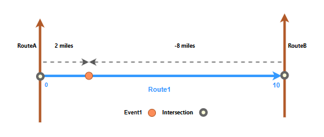
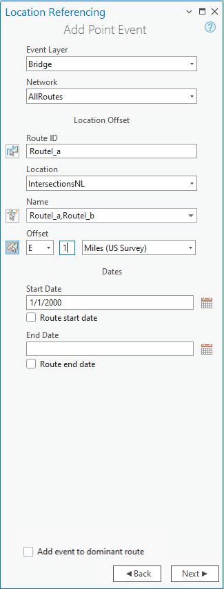
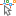
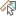
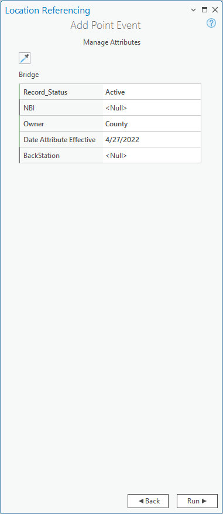
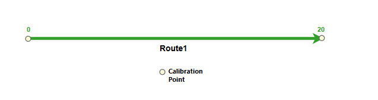
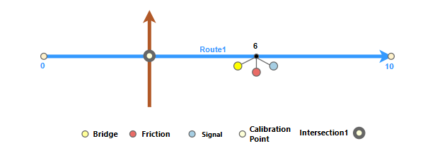

# Add Point Events by Location Offset

| Field | Value |
| --- | --- |
| **Doc** | 234 · Other · Pro |
| **Product** | Roads & Highways |
| **Release** | — |
| **Issues** | — |
| **Source** | [RH_Add point events by location offset.docx](<https://esriis.sharepoint.com/sites/LocationReferencing/Shared%20Documents/General/Doc%20Reviews/Pro35_Ent115/6357_AddPointEvents_LocationOffset/RH_Add%20point%20events%20by%20location%20offset.docx>) |
| **People** | author — · PE — · dev — |
| **Edited** | 2025-02-13 19:26 by unknown |
| **Extracted** | 2026-09-04 · lane xmlstrip · format 3.0 · prompt v2.0.2 |
| **Keywords** | point event · location offset · referent · route · intersection · event attributes · attribute table |
| **Tools** | Add Point Event · Add Multiple Point Events · Enable Referent Fields |

## Summary

Describes the process of adding point events to routes using the location offset method in ArcGIS Pro. Covers adding single and multiple point events by specifying intersection or point layers, offset values, and event dates. Explains the use of referent fields for event location referencing and how these are managed and updated.

## Related documents

<!-- related:begin -->
- [Add Point Events by Location Offset](<https://esriis.sharepoint.com/sites/lrsworkspace/LRS Doc Index/Other/add-point-events-by-location-offset-apr.md>) — similar text 0.81 · 4 title words · 4 filename words · same kind/surface/folder <!-- rel:235 s=9.375 -->
- [Add Line Events Point Offset Method](<https://esriis.sharepoint.com/sites/lrsworkspace/LRS Doc Index/User Stories/add-line-events-point-offset-method.md>) — similar text 0.20 · 4 title words · 3 filename words · same surface <!-- rel:268 s=5.172 -->
- [Add Point Events by offsetting from other points – Test Plan](<https://esriis.sharepoint.com/sites/lrsworkspace/LRS Doc Index/Test Plans/3906-add-point-events-by-offsetting-from-other-points.md>) — similar text 0.16 · 3 title words · 4 filename words · same surface <!-- rel:241 s=4.967 -->
- [Add multiple line events by route and measure](<https://esriis.sharepoint.com/sites/lrsworkspace/LRS Doc Index/Other/6134-add-multiple-line-events-by-route-and-measure.md>) — similar text 0.44 · 2 title words · 2 filename words · same kind/surface <!-- rel:120 s=4.899 -->
- [Add Line Events by offsetting from other points – Test Plan](<https://esriis.sharepoint.com/sites/lrsworkspace/LRS Doc Index/Test Plans/3913-add-line-events-by-offsetting-from-other-points.md>) — similar text 0.18 · 2 title words · 4 filename words · same surface <!-- rel:231 s=4.742 -->
<!-- related:end -->

<!-- docs:begin -->
## Esri documentation

[Add multiple point events](https://doc.esri.com/en/arcgis-pro/latest/help/production/roads-highways/add-multiple-point-events.html) · [Storing referent and offset information for event location](https://doc.esri.com/en/arcgis-pro/latest/help/production/roads-highways/storing-referent-and-offset-information-for-event-location.html) · [View LRS intersection properties](https://doc.esri.com/en/arcgis-pro/latest/help/production/roads-highways/view-lrs-intersection-properties.html) · [Event editing using the attribute table](https://doc.esri.com/en/arcgis-pro/latest/help/production/roads-highways/event-editing-using-the-attribute-table.html)

_No page matched:_ [Add Point Event](https://www.google.com/search?q=%22Add%20Point%20Event%22+site%3Adoc.esri.com) · [Enable Referent Fields](https://www.google.com/search?q=%22Enable%20Referent%20Fields%22+site%3Adoc.esri.com)
<!-- docs:end -->

---

## Add point events by location offset
Characteristics of a route can be represented as a point event offset from a location such as an intersection, an LRS point event, or a non-LRS point feature.
In the example below, a point event's measure is established using the location offset method. The route has start and end measure values of 0 and 10 miles, respectively. Event1 is located 2 miles from the intersection on the left and 8 miles from the intersection on the right.
Since the direction of calibration of the route is from left to right, the offset distance is calculated in the positive direction and the offset distance in the second case is shown as a negative number.

### Add a point event by intersection location offset
To add a point event using intersection location offset, complete the following steps:

1. Open the map in ArcGIS Pro and zoom in to the location where you want to add the point event.

1. On the Location Referencing tab, in the Events group, click Add > Point Event .

- The Add Point Event pane appears with a Route and Measure value for Method as the default.

1. Click the Method drop-down arrow and choose Location Offset.

1. Click Next.

- The Event Layer drop-down menu, the Network drop-down menu, and the Location Offset section, and the Dates section appear in the pane.

1. Click the Event Layer drop-down arrow and choose an event layer where the event will be created.

1. The Network value is populated based on the Event Layer value.

1. Specify the route ID by doing one of the following:

1. - Type the route ID in the Route ID text box.
- Click Choose route from map and click a route on the map.

1. Click the Location Point Layer drop-down arrow and choose the intersection, LRS point event, or non-LRS point layer name.

- Note: All the intersection point layers that are published with the mapfeature service and are registered with the parent LRS Network are listed. LRS point events from a network other than the one specified under Network will not be listed. The LRS calibration point layer is not supported.

1. For the text box below the Point Layer drop-down menu, sSpecify the intersection point feature’s name by doing one of the following:

  - Type the point feature’sintersection name in the Name text box.
  - Click Choose location from map  and click thea intersection point feature on the map to populate the Name text box.

### Note:

- The name of the text box below the Point Layer drop-down list is dependent on the point layer’s https://pro.arcgis.com/en/pro-app/latest/help/editing/set-the-layer-display-field.htm https://pro.arcgis.com/en/pro-app/latest/help/editing/set-the-layer-display-field.htmdisplay field.
- If more than one point feature exists at the clicked location, the Select Feature dialog box appears.

1. Optionally, provide the Offset value for the location by doing one of the following:

  - Click the Offset drop-down arrow to choose the offset direction, provide a measure value, and choose the units.
  - Provide the measure value and choose the units.
  - Click Choose offset from map  and click a location along the route on the map.
- A green dot appears at the offset location along the route on the map. This is the location of the measure value for the event.

1. Specify the date that defines the start date of the event by doing one of the following:

  - Provide the start date in the Start Date text box.
  - Click Calendar  and choose the start date.
  - Check the Route start date check box to use the route start date.
- The start date default value is the current date, but you can choose a different date.

1. Specify the date that defines the end date of the event by doing one of the following:

  - Provide the end date in the End Date text box.
  - Click the End Date drop-down arrow and choose the end date.
  - Check the Route end date check box.
- The end date is optional. If no end date is provided, the events remain valid from the event start date and into the future.

1. Click Next.

- Attributes for the chosen event layer appear under Manage Attributes.

1. Provide attribute information for the events i layer.n the attribute set.

- Note:
- Click Copy attribute values by selecting event on the map  and click an existing point event belonging to the same event layer on the map to copy event attributes from that event.

1. Click Run.

- A confirmation message appears once the newly added point event is created. The new point event is created and appears on the map.

### Add multiple point events by location offset
To add multiple point events using location offset, complete the following steps:

1. Open the map in ArcGIS Pro and zoom to the location where you want to add the point events.

1. On the Location Referencing tab, in the Events group, click Add > Multiple Point Events .

- The Add Multiple Point Events pane appears with a Route and Measure value for Method as the default.

1. Click the Method drop-down arrow and choose Location Offset.

1. Click Next.

- The Event Layer drop-down menu, the Network drop-down menu,  and the Location Offset section, and the Dates section appear in the pane.

1. Click the Network drop-down arrow and choose the parentan LRS Network. of the intersection layer to use as the location offset.

1. Specify the route ID by doing one of the following:

1. -Type the route ID in the Route ID text box.
-Click Choose route from map and click a route on the map.

1. Click the Location Point Layer drop-down arrow and choose the intersection, LRS point event, or non-LRS point layer name.

- All the intersection layers that are published with the map service and are registered with the parent LRS Network are listed. Note: All the point layers that are published with the feature service are listed. LRS point events from a network other than the one specified under Network will not be listed. The LRS calibration point layer is not supported.

1. For the text box below the Point Layer drop-down menu, sSpecify the intersection point feature’s name by doing one of the following:

  - ProvideType the intersection point feature’s name in the  Name text box.
  - Click Choose location from map  and click the intersection point feature on the map to populate the Name text box.
  - Note:
-The name of the text box below the Point Layer drop-down menu is dependent on the point layer’s display field.
-If more than one point feature exists at the clicked location, the Select Feature dialog box appears.

1. Optionally, specify the Offset direction for the referent offsetlocation by doing one of the following:

  - Click the Offset drop-down arrow to choose the offset direction, provide the measure value, and choose the units.
  - Provide the measure value and choose the units.
  - Click Choose offset from map  and click a location along the route on the map.
- A green dot appears at the offset location along the route on the map. This is the location of the measure value for the event.

1. Specify the date that defines the start date of the events by doing one of the following:

  - Provide the start date in the Start Date text box.
  - Click Calendar  and choose the start date.
  - Check the Route start date check box to use the route start date.
- Note:
- The start date default value is today's date, but you can choose a different date.

1. Specify the date that defines the end date of the event by doing one of the following:

  - Provide the end date in the End Date text box.
  - Click Calendarthe End Date drop-down arrow and choose the end date.
  - Check the Route end date check box.
- The end date is optional. If no end date is provided, the events remain valid from the event start date and into the future.

1. Click Next.

- Manage Attributes appears.
- The Attribute Set drop-down menu includes other attribute sets if configured for the parent LRS Network.

1. Optionally, choose an attribute from the Attribute Set drop-down menulist.

1. Note: You can uncheck the box next to individual event layers to exclude them from event creation.

1. Provide attribute information for the events in the attribute set.

- Note:
- Click Copy attribute values by selecting event on the map  and click an existing point event belonging to the same event layer on the map to copy event attributes from that event.

1. Click Run.

- A confirmation message appears once the newly added point events are created. The new point eventss are created and appear on the map.

### Referent offset when using the location offset method
The Roads and Highways events data model supports the configuration of referent fields and their enablement using the Enable Referent Fields tool. Once referent fields are configured and enabled in a layer, referent locations are populated and persisted in that layer when events are added or edited.
When point events are created using the location offset method in a referent-enabled layer, the intersection point layer's name is used as the RefMethod value, and the point feature’s intersection Object ID is used as the RefLocation value.

If the measure of a point event is updated, the RefOffset value updates to reflect the new value.
Note:
If you want to offset an event from a point feature class that is not part of the LRS (but present in the geodatabase), you need to manually add that feature class's code and description (name) into the dReferentMethod domain.
Learn more about the properties of manually added referent and offset fields in an event layer

The examples below demonstrate the impact of adding point event recordss to a layer that has referent values enabled.

#### Before adding a point event with referents
In the following diagram, Route1 has measures from 0 to 10 and no associated event:

The following table provides details about the route:

| Route ID | From Date | To Date |
| --- | --- | --- |
| Route1 | 1/1/2000 | <Null> |

#### After adding a point event with referents
In the following diagram, a point event that has referents has been added at measure 6:

The following table provides details about the referent-enabled fields after event creation:

| RefMethod | RefLocation | RefOffset |
| --- | --- | --- |
| IntersectionLayer | Intersection1 | 3 |

The following table provides details about the default event attributes after event creation:

| Event ID | Route ID | From Date | To Date | Measure |
| --- | --- | --- | --- | --- |
| Event1 | Route1 | 1/1/2000 | <Null> | 6 |

You can edit the event using the attribute table so that it uses referents other than the default values. If subsequent route edits are made, the RefMethod and RefLocation values revert to the parent LRS Network and the route, respectively.

#### Before adding multiple point events with referents
When multiple point events are created using the coordinates method in a referent-enabled layer, X/Y is used as the RefMethod value, and the geographic coordinates are used as the RefLocation value.
The following diagram shows the route before events are created:

The following table provides details about the route:

| Route ID | From Date | To Date |
| --- | --- | --- |
| Route1 | 1/1/2000 | <Null> |

#### After adding multiple point events with referents
The following diagram shows multiple point events that have been added to point event layers that have referents enabled:

The following table provides details about the event referent fields in each of the event layers after event creation:

| RefMethod | RefLocation | RefOffset |
| --- | --- | --- |
| IntersectionLayer | Intersection1 | 3 |

The following table provides details about the default event fields after event creation:

##### Bridge

| Event ID | From Date | To Date | Route ID | Measure |
| --- | --- | --- | --- | --- |
| Event1 | 1/1/2000 | <Null> | Route1 | 6 |

##### Signal

| Event ID | From Date | To Date | Route ID | Measure |
| --- | --- | --- | --- | --- |
| Event1 | 1/1/2000 | <Null> | Route1 | 6 |

##### Friction

| Event ID | From Date | To Date | Route ID | Measure |
| --- | --- | --- | --- | --- |
| Event1 | 1/1/2000 | <Null> | Route1 | 6 |

The Roads and Highways events data model supports the configuration of referent event fields and their enablement using the Enable Referent Fields tool. Once referent fields are configured and enabled in a layer, referents are populated in that layer when events are added or edited using ArcGIS Pro.
You can https://prodev.arcgis.com/en/pro-app/3.5/help/production/roads-highways/event-editing-using-the-attribute-table.htm edit the event using the attribute table so that it uses referents other than the default values. If subsequent route edits are made, the RefMethod and RefLocation values revert to the parent LRS Network and the route, respectively.

