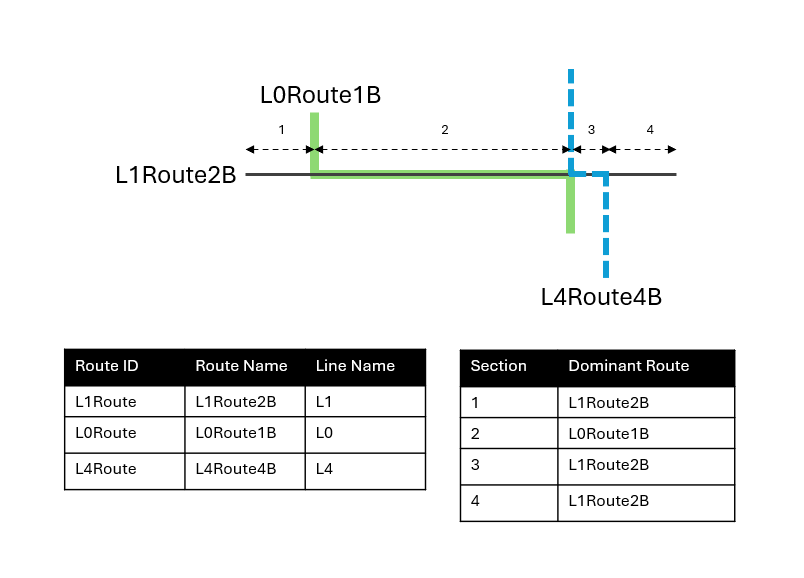
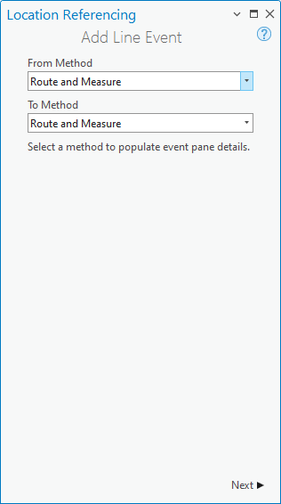
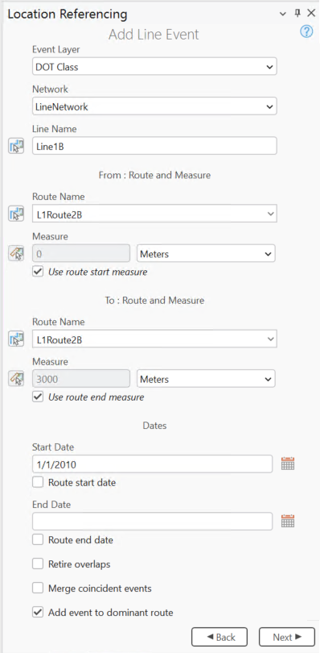
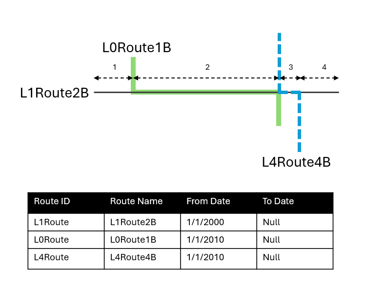
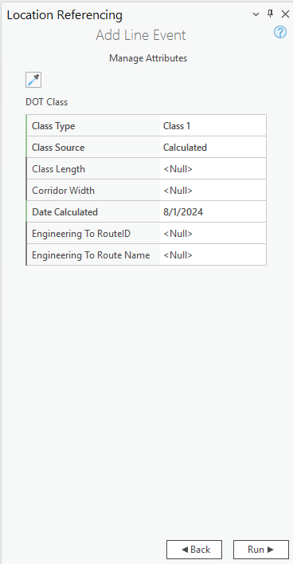
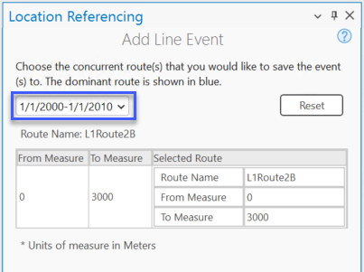
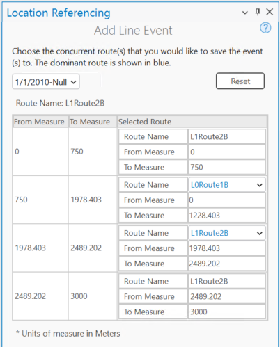

# Adding Linear Events to Dominant Routes

| Field | Value |
| --- | --- |
| **Doc** | 301 · Other · Pro |
| **Product** | Pipeline Referencing |
| **Release** | — |
| **Issues** | — |
| **Source** | [AddLinearEvents_DominantRoute_APR.docx](<https://esriis.sharepoint.com/sites/LocationReferencing/Shared%20Documents/General/Doc%20Reviews/5858_line-event-dominant-route/AddLinearEvents_DominantRoute_APR.docx>) |
| **People** | author Praveen Kumar · PE — · dev — |
| **Edited** | 2024-10-10 21:20 by unknown |
| **Extracted** | 2026-09-04 · lane xmlstrip · format 3.0 · prompt v2.0.2 |
| **Keywords** | linear event · dominant route · concurrent routes · route dominance · measure · event attributes · route time range |
| **Tools** | Add Line Event |

## Summary

This document explains how to use the Add Line Event tool to add linear events to dominant routes in cases where route concurrences exist. It covers the concept of concurrent routes, route dominance rules, and step-by-step instructions for adding line events including specifying measures, dates, and attribute values. The document also discusses handling concurrent routes with different time ranges and spanning events across multiple concurrent routes.

## Related documents

<!-- related:begin -->
- [Add Linear Events to Dominant Routes](<https://esriis.sharepoint.com/sites/lrsworkspace/LRS Doc Index/Other/add-linear-events-to-dominant-routes.md>) — similar text 0.57 · 4 title words · 5 filename words · same kind/surface/folder <!-- rel:326 s=9.11 -->
- [Adding Point Events to Dominant Routes](<https://esriis.sharepoint.com/sites/lrsworkspace/LRS Doc Index/Other/adding-point-events-to-dominant-routes-apr.md>) — similar text 0.44 · 4 title words · 2 filename words · same kind/surface <!-- rel:309 s=5.951 -->
- [Adding Point Events to Dominant Routes](<https://esriis.sharepoint.com/sites/lrsworkspace/LRS Doc Index/Other/adding-point-events-to-dominant-routes-rh.md>) — similar text 0.45 · 4 title words · 1 filename word · same kind/surface <!-- rel:310 s=5.475 -->
- [Add multiple line events by route and measure](<https://esriis.sharepoint.com/sites/lrsworkspace/LRS Doc Index/Other/6134-add-multiple-line-events-by-route-and-measure.md>) — similar text 0.38 · 1 title word · 3 filename words · same kind/surface <!-- rel:120 s=4.75 -->
- [Add Point Events by Location Offset](<https://esriis.sharepoint.com/sites/lrsworkspace/LRS Doc Index/Other/add-point-events-by-location-offset-apr.md>) — similar text 0.28 · 1 title word · 3 filename words · same kind/surface <!-- rel:235 s=4.178 -->
<!-- related:end -->

<!-- docs:begin -->
## Esri documentation

[Split a centerline by measure](https://doc.esri.com/en/arcgis-pro/latest/help/production/location-referencing-pipelines/split-a-centerline-by-measure.html) · [Event editing using the attribute table](https://doc.esri.com/en/arcgis-pro/latest/help/production/location-referencing-pipelines/event-editing-using-the-attribute-table.html)

_No page matched:_ [Add Line Event](https://www.google.com/search?q=%22Add%20Line%20Event%22+site%3Adoc.esri.com)
<!-- docs:end -->

---

## Adding linear events to dominant routes
The Add Line Event tool allows you to add linear events to dominant routes where route concurrences exist.

### Concurrent routes
Concurrent routes are routes that share the same centerlines. This relationship may exist to model two routes with different directions of calibration. Where these concurrent routes exist, you can https://pro.arcgis.com/en/pro-app/3.3/help/production/roads-highways/route-dominance-configuration.htm#GUID-1FF73DF6-B333-4975-AB9E-9239FF8F3AE0 https://pro.arcgis.com/en/pro-app/latest/help/production/location-referencing-pipelines/route-dominance-configuration.htm choose a route that's considered dominant using a set of rules.
The Add Line Event tool allows you to add linear events to dominant routes. For example, in the following image, there are three routes with route names: L1Route2B, L0Route1B, and L4Route4B.
APR_Conroutes1.png
The route dominance rule is set as the lesser the Route Name, the more dominant the route. Using this condition, route L1Route2B is the most dominant route.
If you want to add linear events from the start to end of route L1Route2B, that process is done in four sections as shown in the following image and table.

- Section 1—Route L1Route2B is the dominant route since no other route exists in this section.
- Section 2—Route L0Route1B has the greater order of dominance; therefore, the event will be added to route L0Route1B.
- Section 3— Route L1Route2B is the dominant route, based on the dominance rule in this section.
- Section 4— Route L1Route2B is the dominant route since no other route exists in this section.

Note:
Route dominance rules should be configured to access this functionality.
Events in the aAttribute sSet should belong to the same network for which the Route ID is selected.
APR_concurrentpane1.png

Add the line events
To add linear events to dominant routes, complete the following steps:

1. Open the map in ArcGIS Pro and zoom to the location where you want to add the line event.

1. Click the Location Referencing tab, and in the Events group, click Add > Line Event .

- The Add Line Event pane appears with the Route and Measure default value as the From Method and To Method values.
- Using the Route and Measure method, the measure location is based on the measure values from the selected route.
- 3. Click Next.
- The From: Route and Measure, To: Route and Measure, and Dates sections appear in the Add Line Event pane.
- APR_Firstpane.png
- 4. Click the Event Layer drop-down arrow and choose the line event layer.
- The Network layer is automatically populated once the event layer is chosen. The network serves as the source linear referencing method (LRM) to define the input measures for the event.
- The network is an LRS Network published as a layer in the feature service.
- 5. If the selected event layer's parent network is a line network, click Choose line from map  and choose a value to populate the Line Name text box.
Alternatively, provide the line name in the Line Name text box.

- 6. Click Choose route from map  and select the route on the map to populate the route Route ID value.
- Note:
- If a message regarding acquiring locks or reconciling appears, conflict prevention is enabled.
- 7. In the From: Route and Measure section, specify the start measure by doing one of the following to populate the Measure text box:
- Click Choose measure from map  and click the start measure value along the route on the map.
- Check the Route start date check box.
- Provide the start measure value in the Measure text box.
- A green point appears at the selected location on the map.
- 8. Optionally, in the To: Route and Measure section, specify the end measure for the new line event along the route by doing one of the following to populate the Measure text box:
- Click Choose measure from map  and select the startend measure value along the route on the map.
- Check the Use route end measure check box.
- Provide the end measure value in the Measure text box.
- A red point appears at the selected location on the map. The event will be created between the green and the red points.
- 9. Specify the start date of the event by doing one of the following:

  1. Click Calendar  and choose the start date.

  1. Provide the start date in the Start Date text box.

  1. Check the Route start date check box.

  1. Double-click in the Start Date text box to use today'sthe current date.

- The start date default value is today's date, but you can choose a different date using the date picker.
- 10. Optionally, specify the end date of the event by doing one of the following:
- Click Calendar  and choose the end date.
- Provide the end date in the End Date text box.
- Check the Route end date check box.
- Double-click in the End Date text box to use today's date.
- If no end date is provided, the event remains valid from the route start date into the future.
- 11. Choose a data validation option to prevent erroneous input while characterizing a route with line events.

  1. Retire overlaps—The measure, start date, and end date of existing events are adjusted to prevent overlaps with respect to time and measure values once the new line event or events are created. For more information, refer to the retire overlaps scenarios.

  - Learn more about retire overlap scenarios

  1. Merge coincident events—When all attribute values for a new event are exactly the same as an existing event, and if the new event is adjacent to or overlapping an existing event in terms of its measure values, and its time slices are coincident or overlapping, the new event is merged with the existing event and the measure range is expanded accordingly. For more information, refer to the merge coincident events scenarios.

- 12. Check the Add event to dominant route check box.
- 13. Click Next.
The route dominance table appears.
APR_concurrentpane.png

- The From Measure and To Measure columns show the values for each section of the chosen route from the previous pane. The From Measure and To Measure boxes under Route Name show the value for each dominant route where the events will be added.
- A black route name without a drop-down arrow signifies that there was a single route in that section. A blue route name with a drop-down arrow signifies that there are concurrent routes in that section, and the blue route is selected by the software based on the route dominance rules. You can select any other route using the drop-down arrow.
- If you check the Merge coincident events check box, the records in sections 3 and 4 will be merged since they have the same route name.
- 14. Click Next.
- The attributes for the chosen event layer appear under Manage Attributes.
- 15. Provide attribute value information for the event.
- APR_Attributes.png
- Note:
- Click Copy attribute values by choosing event from map  and click an existing line event belonging to the same event layer on the map to copy event attributes from that event.
- Note:
- https://pro.arcgis.com/en/pro-app/3.3/help/data/geodatabases/overview/an-overview-of-attribute-domains.htm  \hCoded value domains, range domains, subtypes, contingent values, and attribute rules are supported when configured for a field.
- 16. Click Run.
- A confirmation message appears once the line event is added and appears on the map.

### Concurrent routes with different time ranges
The following image shows concurrent routes with different time ranges:
APR_Conroutes2.png
Route L1Route2B has the From Date value of 1/1/2000, whereas route L0Route1B and route L4Route4B have the From Date value of 1/1/2010. Therefore, if the selected start date of the event is 1/1/2000, there are two route time ranges:

1. 1/1/2000 to 1/1/2010, when only route L1Route2B existed.

- APR_Timeslice1.png

1. 1/1/2010 to Null, when all three routes existed.

- APR_Timeslice2.png

### Concurrent routes in a line for spanning event
APR_Conroutes3.png

Concurrent sections will be identified route by route and the table will contain all the routes in the span of the line event being added.

