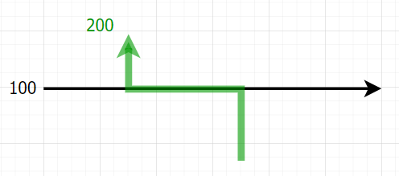
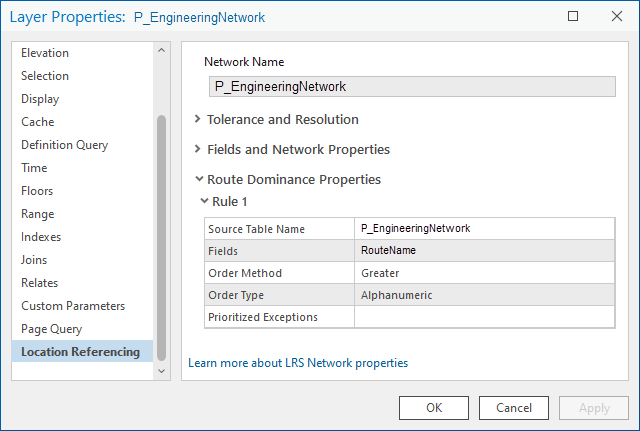
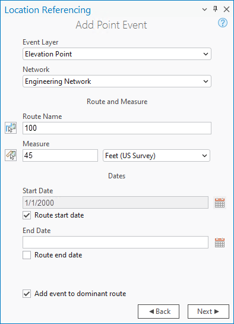
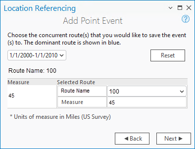
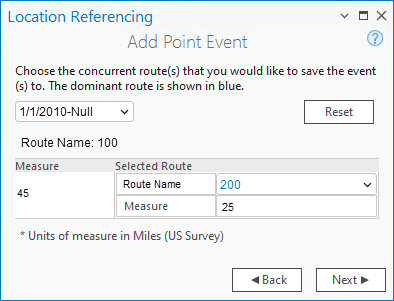
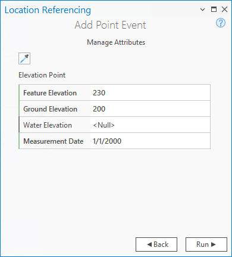

# Adding Point Events to Dominant Routes

| Field | Value |
| --- | --- |
| **Doc** | 309 · Other · Pro |
| **Product** | Pipeline Referencing |
| **Release** | — |
| **Issues** | — |
| **Source** | [AddPtDomi_APR.docx](<https://esriis.sharepoint.com/sites/LocationReferencing/Shared%20Documents/General/Doc%20Reviews/5810_Add-Point-Dominant-Route/AddPtDomi_APR.docx>) |
| **People** | author Claire Wang · PE — · dev — |
| **Edited** | 2024-09-10 00:05 by unknown |
| **Extracted** | 2026-09-04 · lane xmlstrip · format 3.0 · prompt v2.0.2 |
| **Keywords** | point event · dominant route · concurrent routes · route dominance · event attributes · measure · time slice |
| **Tools** | Add Point Event · Add Multiple Point Events |

## Summary

This document explains how to add point events to dominant routes in networks with concurrent routes. It covers the concept of route dominance, configuration of dominance rules, and step-by-step instructions for adding point events using ArcGIS Pro tools. The document also details handling time slices and attributes for events on dominant and subordinate routes.

## Related documents

<!-- related:begin -->
- [Adding Point Events to Dominant Routes](<https://esriis.sharepoint.com/sites/lrsworkspace/LRS Doc Index/Other/adding-point-events-to-dominant-routes-rh.md>) — similar text 0.76 · 5 title words · 2 filename words · same kind/surface/folder <!-- rel:310 s=8.362 -->
- [Adding Linear Events to Dominant Routes](<https://esriis.sharepoint.com/sites/lrsworkspace/LRS Doc Index/Other/adding-linear-events-to-dominant-routes.md>) — similar text 0.44 · 4 title words · 2 filename words · same kind/surface <!-- rel:301 s=5.951 -->
- [Add Linear Events to Dominant Routes](<https://esriis.sharepoint.com/sites/lrsworkspace/LRS Doc Index/Other/add-linear-events-to-dominant-routes.md>) — similar text 0.45 · 3 title words · 1 filename word · same kind/surface <!-- rel:326 s=5.146 -->
- [Add Point Events by Location Offset](<https://esriis.sharepoint.com/sites/lrsworkspace/LRS Doc Index/Other/add-point-events-by-location-offset-apr.md>) — similar text 0.32 · 2 title words · 2 filename words · same kind/surface <!-- rel:235 s=4.471 -->
- [Add Point Events by Location Offset](<https://esriis.sharepoint.com/sites/lrsworkspace/LRS Doc Index/Other/add-point-events-by-location-offset-rh.md>) — similar text 0.31 · 2 title words · 1 filename word · same kind/surface <!-- rel:234 s=3.959 -->
<!-- related:end -->

<!-- docs:begin -->
## Esri documentation

[Add multiple point events](https://doc.esri.com/en/arcgis-pro/latest/help/production/roads-highways/add-multiple-point-events.html) · [Event editing using the attribute table](https://doc.esri.com/en/arcgis-pro/latest/help/production/location-referencing-pipelines/event-editing-using-the-attribute-table.html) · [Split a centerline by measure](https://doc.esri.com/en/arcgis-pro/latest/help/production/location-referencing-pipelines/split-a-centerline-by-measure.html)

_No page matched:_ [Add Point Event](https://www.google.com/search?q=%22Add%20Point%20Event%22+site%3Adoc.esri.com)
<!-- docs:end -->

---

## Adding point events to dominant routes
You can add point events to dominant routes in casewhere route concurrences exist.

### Concurrent routes
Concurrent routes are routes that share the same centerlines.; that is, they travel the same pavement but are modeled with different measures. This relationship may exist to model two routes with different directions of calibration., to model different directions of travel on the highway, or to model locations on highways where multiple routes converge into a common roadway for a subset of their paths.
You can configure a set of rules to determine the dominant route in a network where there are concurrent routes. As eEvents are usually associated with a dominant route, sothe dominant rules are needed for event editors to identify the dominant route, and to add and edit events on the correct route location when multiple routes overlap.
You can add point events to dominant routes with thein Add Point Event and Add Multiple Point Events tools. For example, in the following graphic and tables, there are two routes with route nameIDs: 100 and 200. The concurrent routes have opposite directions and different ranges in time. (use title as hover text)

| Route Name | From Date | To Date |
| --- | --- | --- |
| 100 | 1/1/2000 | Null |
| 200 | 1/1/2010 | Null |

The route dominance rule is set as Greater Alphanumeric on Route Name. Using this condition, route 2300 is the most dominant route, and route 100 is the most subordinate route. (Hover text: Route Dominance Properties)

For example, you want to add point events at two2 locations on route 100. At Location 1, since no other route exists at that point, the event will be added to route 100. At Location 2, route 100 is the only route that exists until 1/1/2010, so the event is added to route 100 from 1/1/2000 to 1/1/2010./ Starting from 1/1/2010,. route 200 has a greater order of dominance, so the event will be added to route 200. Since the measures of the two routes are different at the event location, the event has different measures in different time slices.

| Point Event | Route Name | Measure | From Date | To Date |  |
| --- | --- | --- | --- | --- | --- |
| A | 100 | 10 | 1/1/2000 | < Null > |  |
| B | 100 | 45 | 1/1/2000 | 1/1/2010 |  |
| B | 200 | 25 | 1/1/2010 | < Null > |  |

(use title as hover text)

### Note:

- Route dominance rules should be configured to access this functionality.
- When adding multiple point events, the events in the aAttribute Sset should belong to the same network for which the Route NameID is selected.
- By default, events are added to the dominant route, but you can also choose to add events on subordinate routes.

### Add the point events to dominant routes
Complete the following steps to add point events to dominant routes. In the example below, an elevation point event which is event B in the table above Point Event 3 is added.

1. Open the map in ArcGIS Pro and zoom in to the location where you want to add the point event.

1. On the Location Referencing tab, in the Events group, click Add > Point Event .

1. The Add Point Event pane appears. The Method drop-down list is populated with the Route and Measure value by default.
Note:
Click the Method drop-down arrow to choose another method.

1. 3. Click Next.
The Route and Measure fields appear in the Add Point Event pane.

1. Click the Event Layer drop-down arrow and choose the point event layer where you want to add the event.
The selected Network value is based on the selected event layer.

1. Specify a route by doing oneeither of the following:

  - Provide a route name in the Route Name text box.
  - Click Choose route from map , and click on the route where you want to add the point event.
The measure is initially populated using the route location where that you clicked.
Tip:
After clicking Choose route from map  or Choose measure from map , hover over the route to see the route and measure at the location of the pointer.
You can choose a scale for the display of route and measures.
Note:
If a message regarding acquiring locks or reconciling appears, conflict prevention is enabled.

1. Specify a new location by doing one of the following:

  - Provide the value in the Measure text box.
  - Click Choose measure from map  and click the measure value along the route on the map.
Once the measure is provided, a green dot appears on the map at that measure location.
Note:
If you've chosen another method, a green dot appears on the map at the measure location that the input of the chosen method is translated to.

1. The start date default value is today's the current date, but you can change the date by doing one of the following:

  - Provide the start date in the Start Date text box.
  - Click Calendar  and choose the start date.
  - Check the Route start date check box.

1. Optionally, specify the end date for the point event by doing one of the following:

  - Type Provide the end date in the End Date text box.
  - Click Calendar  and choose the end date.
  - Check the Route end date check box.
If no end date is provided, the event remains valid from the event start date into the future.

1. Check the Add event to dominant route check box. (Hover text: Add Point Event pane)

1. Click Next.
The route concurrency pane appears. (Hover text: Route concurrency pane)
Note:
If the Don't allow override of event placement of dominant routes is checked in the Location Referencing options (link to latest https://pro.arcgis.com/en/pro-app/latest/help/production/location-referencing-pipelines/set-location-referencing-options.htm https://pro.arcgis.com/en/pro-app/latest/help/production/location-referencing-pipelines/set-location-referencing-options.htm), and the Add event to dominant route check box is checked, the route concurrency pane does not show appear. E and events will be automatically added to the dominant route.
For more details about the Don't allow override of event placement of dominant routes option, click the link above.

(Add number annotation to screenshots above. Connect with Claire Wang or Rahul Rakshit if you need help)
(1) The time drop-down list shows the time slice for the particular concurrency shown below. (1) If there is only one time slice for the concurrency scenario, the drop-down list is disabled. (2) To configure adding events adding in another time slice, choose another time slice in the drop-down list.
As an example, routes 100 and 200 have a From Date value of 1/1/2000, and route 300 has a From Date value of 1/1/2010. Therefore, if you choose 1/1/2000 as the start date of the event, there will be two time ranges:
1/1/2000–1/1/2010, when only route 100 exists.
1/1/2010–Null, when both routes existed.
(3)The Route Name label shows the selected route from the previous pane.
(4)The Measure column shows the measure value in the network's default measure unit on the selected route from the previous pane.
(5)The Selected Route columns show the Route Name and Measure for each dominant route where the events will be added.
(6) A black route nName without a drop-down arrow signifies that there was a single route in that location. (7) A blue route nName with a drop-down arrow signifies that there are concurrent routes in that location, and the blue route is chosen by the software based on the route dominance rules. You can choose any other route using the drop-down arrow, and the chosen subordinate route is shown in black.
Note:
If you've chosen another method, the Measure values indicate the measure of the location from the input of the chosen method.
(8) The Reset button resets the Selected Route to the dominant route based on the route dominance rules across all time slices.
For the 1/1/2000 – 1/1/2010 time slice, the event can only be added on route 100.  For the 1/1/2010 – Nnull time slice, you would choose route 200.  The Measure value along the selected route is the measure for that route at the same location in the specific time range.

1. Click Next.
The attributes for the chosen point event layer appear under Manage Attributes. (Hover text: Mange attributes table)

Note:
Coded values, range domains, and subtypes, contingent values, and attribute rules are supported when configured for any field in the Attribute-Value table.

1. Provide attribute information for the new event in the table.
Tip:
You can click Copy aAttribute vValues by selecting event on the map  and click an existing point event belonging to the same event layer on the map to copy event attributes from that point.

1. Click Run.
A confirmation message appears once the new point event is added and appears on the map.
The following table provides details about the Eelevation Ppoint event example:

| Event | Route Name | From Date | To Date | Measure | Location Error | Feature Elevation | Ground Elevation | Water Elevation | Measurement Date |
| --- | --- | --- | --- | --- | --- | --- | --- | --- | --- |
| B Event 2 | 100 | 1/1/2000 | 1/1/201 0 | 45 | No Error | 230 | 200 | <Null> | 1/1/2000 |
| B Event 2 | 2 00 | 1/1/201 0 | <Null> | 25 | No Error | 230 | 200 | <Null> | 1/1/2000 |

The following diagram shows the route and the associated event after the edit: (use title as hover text)

