# Pipeline Referencing Across the ArcGIS Platform

| Field | Value |
| --- | --- |
| **Doc** | 784 · Other · Enterprise |
| **Product** | Pipeline Referencing · Utility Network |
| **Release** | — |
| **Issues** | — |
| **Source** | [UC2020_APR_Short.pptx](<https://esriis.sharepoint.com/sites/LocationReferencing/Shared%20Documents/UC%202020%20prep%20for%20RH/UC2020_APR_Short.pptx>) |
| **People** | author — · PE — · dev — |
| **Edited** | 2020-07-09 15:56 by unknown |
| **Extracted** | 2026-09-04 · lane xmlstrip · format 3.0 · prompt v2.0.2 |
| **Keywords** | pipeline referencing · network · centerline · route editing · event editing · geoprocessing tools · dynamic segmentation · utility network · calibration point · event behaviors · event location methods |
| **Tools** | Append Routes · Generate Calibration Points · Append Events · Apply Event Behaviors · Delete Routes · Derive Event Measures · Generate Events · Generate Routes · Overlay Events · Remove Overlapping Centerlines · Translate Event Measures · Update Measures From LRS · Remove LRS Entity · Configure Utility Network Feature Class |

## Summary

Overview of pipeline referencing capabilities across ArcGIS Pro, ArcGIS Enterprise, and web applications. Covers information models, types of networks, route editing tools, geoprocessing tools, event types and behaviors, event location methods, event editing in the web, and integration with Utility Network. Describes server features, dynamic segmentation, and combined information models for pipeline referencing and utility networks.

## Related documents

<!-- related:begin -->
- [ArcGIS Pipeline Referencing: An Introduction](<https://esriis.sharepoint.com/sites/lrsworkspace/LRS Doc Index/Other/arcgis-apr-an-introduction-apr-un.md>) — similar text 0.62 · 1 title word · 1 filename word · same kind/folder <!-- rel:785 s=6.527 -->
- [Location Referencing for transportation across the ArcGIS Platform](<https://esriis.sharepoint.com/sites/lrsworkspace/LRS Doc Index/Other/lr-for-transportation-across-the-arcgis-platform-rh-2020-07.md>) — similar text 0.42 · 2 title words · same kind/folder <!-- rel:787 s=5.254 -->
- [Regression Testing Task List V1](<https://esriis.sharepoint.com/sites/lrsworkspace/LRS Doc Index/Test Plans/regression-testing-task-list-v1.md>) — similar text 0.19 <!-- rel:115 s=4.012 -->
- [Location Referencing GP Error Messages](<https://esriis.sharepoint.com/sites/lrsworkspace/LRS Doc Index/Other/3147-lr-gp-error-messages.md>) — similar text 0.11 · same kind <!-- rel:39 s=3.935 -->
- [Location Referencing for transportation across the ArcGIS Platform](<https://esriis.sharepoint.com/sites/lrsworkspace/LRS Doc Index/Other/lr-for-transportation-across-the-arcgis-platform-rh-2020-07-2.md>) — similar text 0.37 · 2 title words · same kind/folder <!-- rel:788 s=3.771 -->
<!-- related:end -->

<!-- docs:begin -->
## Esri documentation

[3D in Pipeline Referencing](https://doc.esri.com/en/arcgis-pro/latest/help/production/location-referencing-pipelines/3d-in-pipeline-referencing.html) · [LRS network](https://doc.esri.com/en/arcgis-pro/latest/help/production/location-referencing-pipelines/what-is-an-lrs-network.html) · [Split a centerline by point](https://doc.esri.com/en/arcgis-pro/latest/help/production/location-referencing-pipelines/split-a-centerline.html) · [Event editing using the attribute table](https://doc.esri.com/en/arcgis-pro/latest/help/production/location-referencing-pipelines/event-editing-using-the-attribute-table.html) · [Apply dynamic segmentation](https://doc.esri.com/en/arcgis-pro/latest/help/production/location-referencing-pipelines/apply-dynamic-segmentation.html) · [View utility network feature class properties](https://doc.esri.com/en/arcgis-pro/latest/help/production/location-referencing-pipelines/view-utility-network-feature-class-properties.html) · [Event behavior](https://doc.esri.com/en/arcgis-pro/latest/help/production/location-referencing-pipelines/what-is-event-behavior.html)

_No page matched:_ [Append Routes](https://www.google.com/search?q=%22Append%20Routes%22+site%3Adoc.esri.com) · [Generate Calibration Points](https://www.google.com/search?q=%22Generate%20Calibration%20Points%22+site%3Adoc.esri.com) · [Append Events](https://www.google.com/search?q=%22Append%20Events%22+site%3Adoc.esri.com) · [Apply Event Behaviors](https://www.google.com/search?q=%22Apply%20Event%20Behaviors%22+site%3Adoc.esri.com) · [Delete Routes](https://www.google.com/search?q=%22Delete%20Routes%22+site%3Adoc.esri.com) · [Derive Event Measures](https://www.google.com/search?q=%22Derive%20Event%20Measures%22+site%3Adoc.esri.com) · [Generate Events](https://www.google.com/search?q=%22Generate%20Events%22+site%3Adoc.esri.com) · [Generate Routes](https://www.google.com/search?q=%22Generate%20Routes%22+site%3Adoc.esri.com) · [Overlay Events](https://www.google.com/search?q=%22Overlay%20Events%22+site%3Adoc.esri.com) · [Remove Overlapping Centerlines](https://www.google.com/search?q=%22Remove%20Overlapping%20Centerlines%22+site%3Adoc.esri.com) · [Translate Event Measures](https://www.google.com/search?q=%22Translate%20Event%20Measures%22+site%3Adoc.esri.com) · [Update Measures From LRS](https://www.google.com/search?q=%22Update%20Measures%20From%20LRS%22+site%3Adoc.esri.com) +2
<!-- docs:end -->

---

## Slide 1 — Pipeline Referencing Across the ArcGIS Platform

ArcGIS Pro
ArcGIS Enterprise
Web Applications

- Pipeline Referencing extension is part of the ArcGIS Pro install
- Linear referencing capability for server is part of the ArcGIS Enterprise install
- Network and centerline
   management

- LRS configuration
- Route and event loading
- Geoprocessing tools
- Includes Workflow Manager
   & Data Reviewer for Desktop

- LRS web services
- Developer API samples
- Event editing
- Data queries
- Integrates with Data
   Reviewer for Server

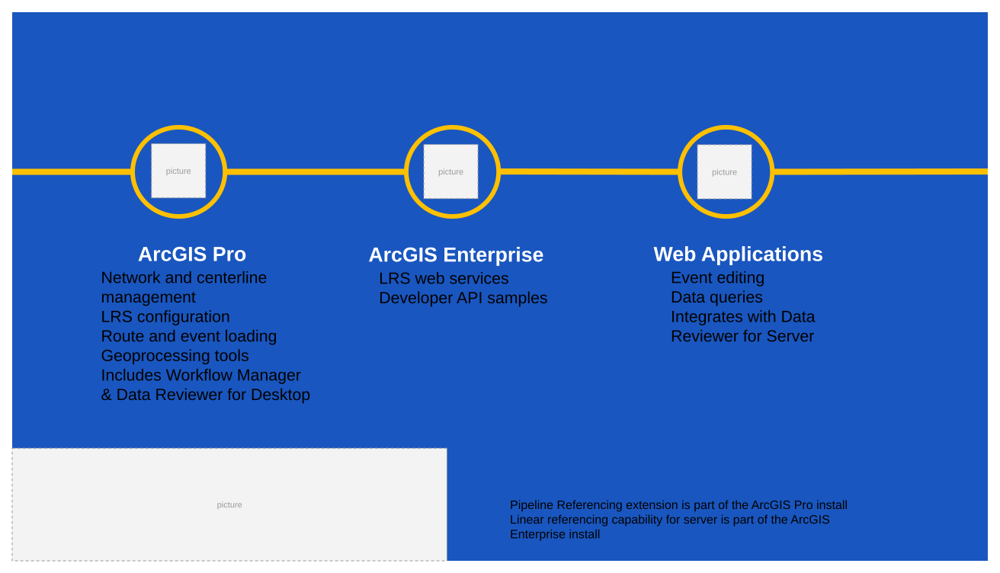

## Slide 2 — Pipeline Referencing – Information Model

m:n relationship
          routes and centerlines

Locks m at locations
M & Z enabled polyline

style.visibilitystyle.visibilitystyle.visibilitystyle.visibilitystyle.visibilitystyle.visibilitystyle.visibility
[figure: Centerline Sequence · 0 · 50 · Route1 · Route · Calibration Points · Network · Geometry and Location · Centerline · Route2 · Route3 · Events · Characteristics, assets · 15 · 25 · 40]

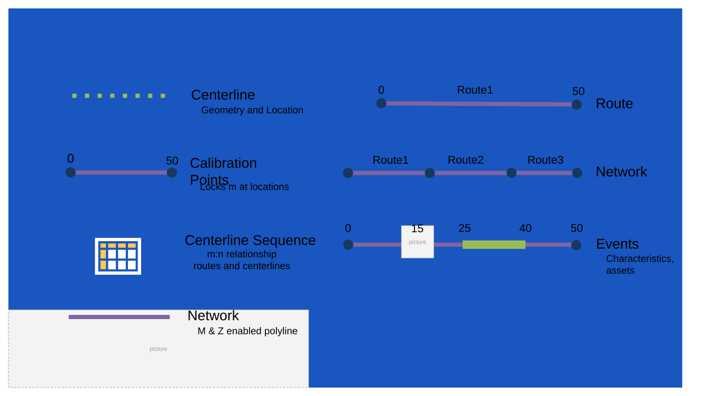

## Slide 3 — Pipeline Referencing – Types of Networks

“Engineering Station Network”
style.visibility
[figure: 0 · 50 · Route1 · Route2 · Continuous Network · Line Network, a.k.a., · Line1 · 55 · 105]

## Slide 4 — Pipeline Referencing – Types of Networks

“Engineering Station Network”

[figure: 0 · 50 · Route1 · Route2 · Continuous Network · Derived Network · 100 · Line1 · Line Network, a.k.a., · 55 · 105]

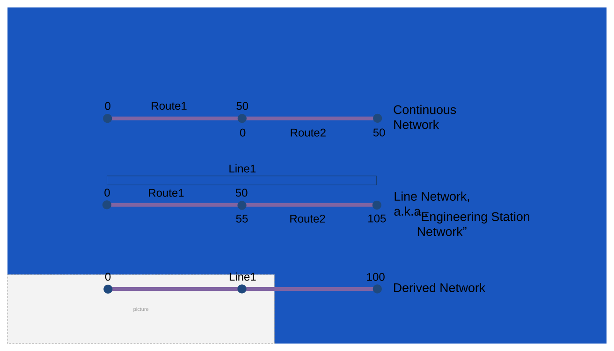

## Slide 5 — Location Referencing Route Editing Tools

style.visibilitystyle.visibilitystyle.visibilitystyle.visibilitystyle.visibilitystyle.visibilitystyle.visibility
[figure: Reassign - Split · Reassign - Merge · Realign - Abandon · Realign - Retire · Create · Extend · Retire · Cartorealign]

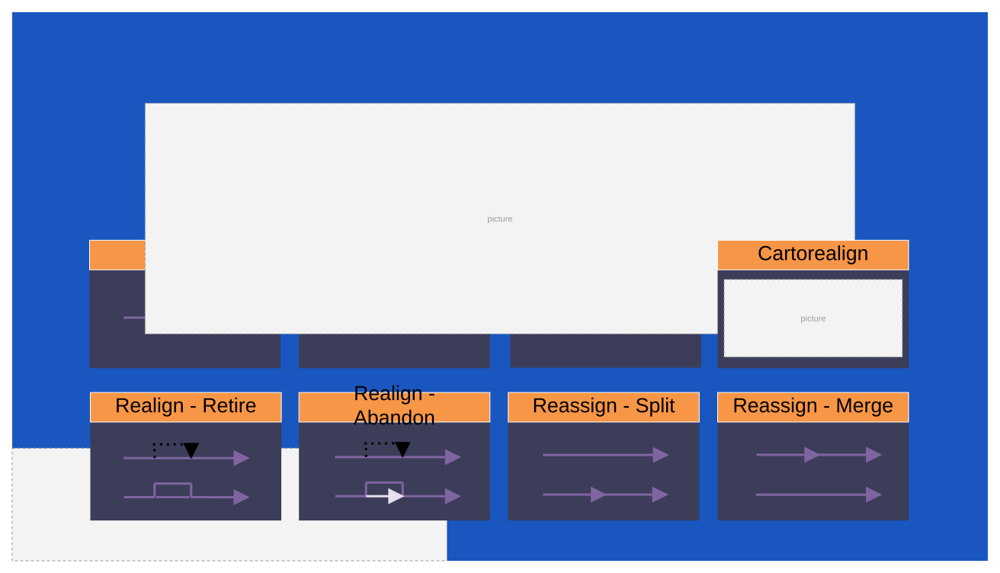

## Slide 6 — Geoprocessing Tools

- Configuration
  - LRS
  - LRS Event
  - LRS Intersection
  - LRS Network
  - Remove LRS Entity
  - Configure Utility Network Feature Class
- Append Routes
- Generate Calibration Points
- Append Events
- Apply Event Behaviors
- Delete Routes
- Derive Event Measures
- Generate Events
- Generate Routes
- Overlay Events
- Remove Overlapping Centerlines
- Translate Event Measures
- Update Measures From LRS

Data Loading

LRS Configuration

Transformations

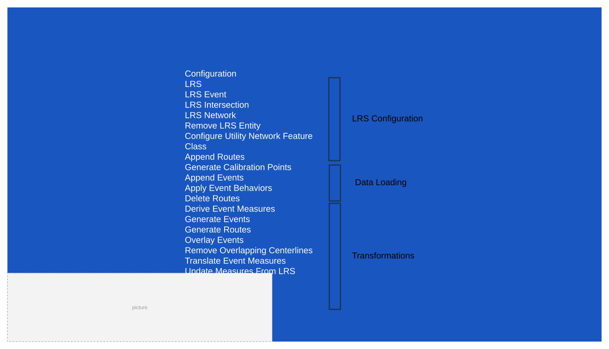

### Notes

Add intersection tools, Update measures from LRS + other UN tools , new tools mark with*

## Slide 7 — Pipeline Referencing – Types of Events

style.visibilitystyle.visibility
[figure: Point · Route1 · 0 · 10 · Line · Spanning Routes · 5 · Route2 · 2 · 7]

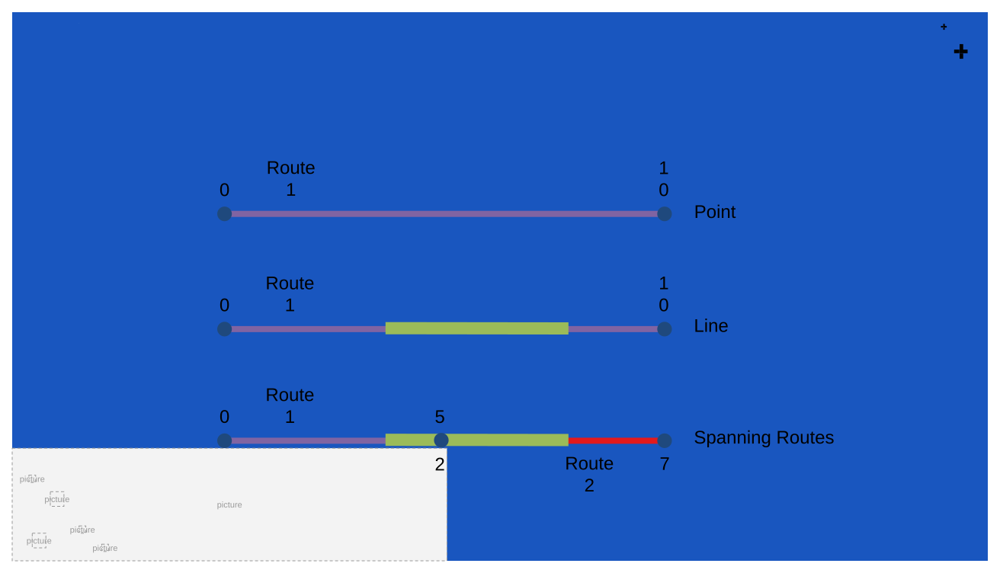

## Slide 8 — Event Behaviors After route edits, measure behavior rules can be applied to events

Preserves geographic
location. Measures may change.

Event gets retired.

Preserves measures.
Geographic location may change.

style.visibilitystyle.visibilitystyle.visibility
[figure: Stay Put · 0 · 15 · Retire · Move · Before Editing · 10 · Centerline · Event · Route]

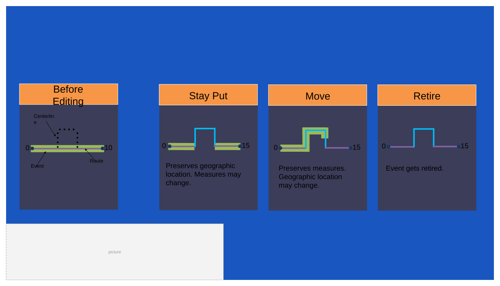

## Slide 9 — Event Location Methods

Route and measure
Event:
1.27 miles

Event:
456+25.00

Stationing
Event:
300 feet from US Highway 10
Intersections
US Highway 10 crossing

Referent and offset

  - Intersections
  - Events
  - Features
Event:
45 feet from Wellhead
Wellhead location:
34.0547,117.1825

Coordinates and offset
style.visibilitystyle.visibilitystyle.visibility

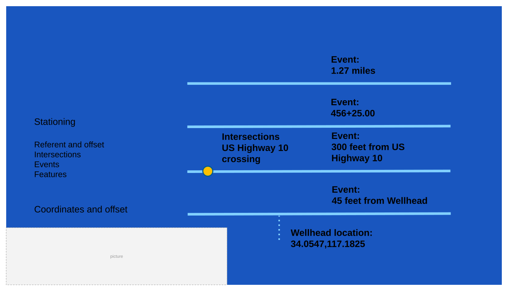

## Slide 10 — Event Editor: Event Editing in the web

- Editing
  - Lines and Points events
  - Event Attributes
  - Selection
  - Select by route, attribute, geometry, proximity
  - Single layer results or attribute sets
  - Quality Control
  - Gaps, overlaps, invalid measures
  - Data Reviewer batch checks

style.visibilitystyle.visibilitystyle.visibilitystyle.visibilitystyle.visibility

## Slide 11 — Pipeline Referencing in ArcGIS Enterprise

Pipeline Referencing Server
Linear Referencing Service Features

- Network editing
- Event editing
- Coordinate to measures
- Measure to coordinate
- Measure translation
- Dynamic Segmentation
- Check events (gaps, overlaps, invalid measures)

[figure: Desktop · Web · Connected Mobile · LRS Web Services]

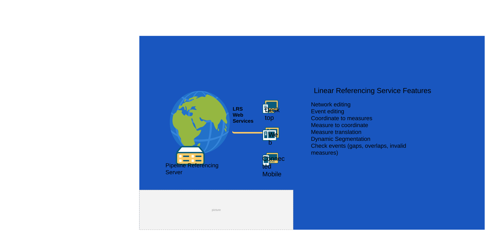

## Slide 12 — Combining Pipeline Referencing and Utility Network is the solution

style.visibilitystyle.visibilitystyle.visibilitystyle.visibilitystyle.visibilitystyle.visibilitystyle.visibilitystyle.visibilitystyle.visibilitystyle.visibilitystyle.visibility
[figure: Gathering · Transmission · Distribution · Linear Referencing · Geometric Network]

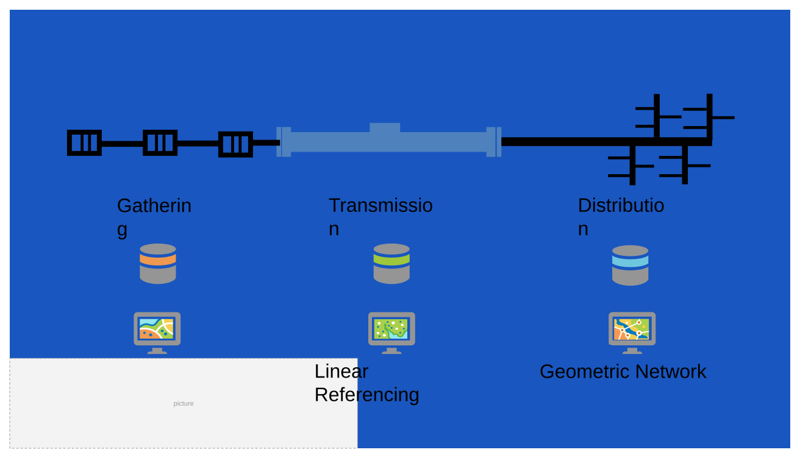

## Slide 13 — Combining Pipeline Referencing and Utility Network is the solution

Utility Network and Pipeline Referencing

[figure: Gathering · Transmission · Distribution · UPDM 2019]

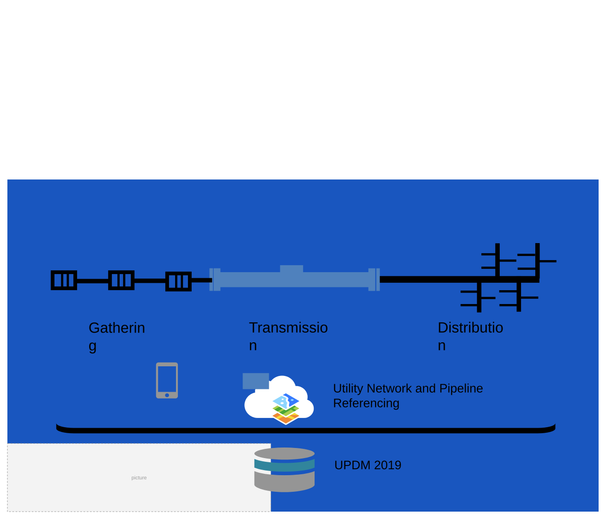

## Slide 14 — Integrating both information models

Utility Network

| Assembly |
| --- |
| Device |
| Junction |
| Pipeline |
| Structure Boundary |
| Structure Junction |
| Structure Line |

Pipeline Referencing

| Calibration Point |
| --- |
| Centerline |
| Centerline Sequence |
| Redline |

style.visibilitystyle.visibilitystyle.visibilitystyle.visibilitystyle.visibilitystyle.visibilitystyle.visibilitystyle.visibilitystyle.visibility

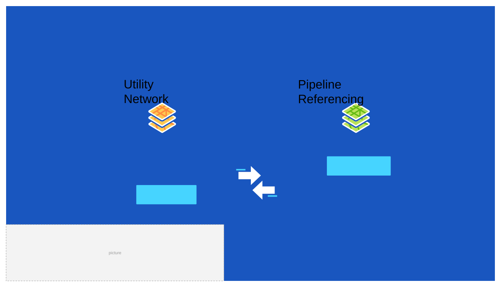
