# ArcGIS Pipeline Referencing: An Introduction

| Field | Value |
| --- | --- |
| **Doc** | 885 · Other · Pro |
| **Product** | Roads & Highways · Pipeline Referencing · Utility Network |
| **Release** | — |
| **Issues** | — |
| **Source** | [UC2019_IntroToAPR_v0.1.pptx](<https://esriis.sharepoint.com/sites/LocationReferencing/Shared%20Documents/General/UC2019_IntroToAPR_v0.1.pptx>) |
| **People** | author — · PE Rahul Rakshit · dev Gary Sinner |
| **Edited** | 2019-06-20 23:28 by unknown |
| **Extracted** | 2026-09-04 · lane xmlstrip · format 3.0 · prompt v2.0.2 |
| **Keywords** | pipeline referencing · routes · events · event behavior · linear referencing system · calibration point · centerline · network |
| **Tools** | Generate Routes · Update Event Shapes · Append Routes · Event Editor · Geoprocessing tools · REST API |

## Summary

This document provides an introduction to ArcGIS Pipeline Referencing, covering the information model, types of LRS networks, event location methods, event behavior rules, time-aware linear referencing, and applications within ArcGIS Pro and ArcGIS Enterprise. It includes details on route and event editing, geoprocessing tools, REST API usage, event editor capabilities, and integration with utility networks. The document also outlines quality control checks, conflict prevention, and future roadmap considerations.

## Related documents

<!-- related:begin -->
- [ArcGIS Pipeline Referencing: An Introduction](<https://esriis.sharepoint.com/sites/lrsworkspace/LRS%20Doc%20Index/Other/arcgis-apr-an-introduction-apr-un.md>) — similar text 0.33 · 2 title words · 1 filename word · same kind/surface <!-- rel:785 s=4.714 -->
- [Esri Roads and Highways Tutorial](<https://esriis.sharepoint.com/sites/lrsworkspace/LRS Doc Index/Other/esri-rh-tutorial.md>) — similar text 0.18 · same kind/surface/folder <!-- rel:875 s=4.097 -->
- [Pipeline Referencing Across the ArcGIS Platform](<https://esriis.sharepoint.com/sites/lrsworkspace/LRS%20Doc%20Index/Other/apr-across-the-arcgis-platform.md>) — similar text 0.25 · 1 title word · 1 filename word · same kind <!-- rel:784 s=3.835 -->
- [Location Referencing for transportation across the ArcGIS Platform](<https://esriis.sharepoint.com/sites/lrsworkspace/LRS%20Doc%20Index/Other/lr-for-transportation-across-the-arcgis-platform-rh-2020-07.md>) — similar text 0.28 · 1 filename word · same kind/surface <!-- rel:787 s=3.569 -->
- [Location Referencing GP Error Messages](<https://esriis.sharepoint.com/sites/lrsworkspace/LRS%20Doc%20Index/Other/3147-lr-gp-error-messages.md>) — similar text 0.17 · same kind/surface <!-- rel:39 s=3.459 -->
<!-- related:end -->

<!-- docs:begin -->
## Esri documentation

[3D in Pipeline Referencing](https://doc.esri.com/en/arcgis-pro/latest/help/production/location-referencing-pipelines/3d-in-pipeline-referencing.html) · [Event behavior](https://doc.esri.com/en/arcgis-pro/latest/help/production/roads-highways/what-is-event-behavior.html) · [LRS network](https://doc.esri.com/en/arcgis-pro/latest/help/production/location-referencing-pipelines/what-is-an-lrs-network.html)

_No page matched:_ [Generate Routes](https://www.google.com/search?q=%22Generate%20Routes%22+site%3Adoc.esri.com) · [Update Event Shapes](https://www.google.com/search?q=%22Update%20Event%20Shapes%22+site%3Adoc.esri.com) · [Append Routes](https://www.google.com/search?q=%22Append%20Routes%22+site%3Adoc.esri.com) · [Event Editor](https://www.google.com/search?q=%22Event%20Editor%22+site%3Adoc.esri.com) · [Geoprocessing tools](https://www.google.com/search?q=%22Geoprocessing%20tools%22+site%3Adoc.esri.com) · [REST API](https://www.google.com/search?q=%22REST%20API%22+site%3Adoc.esri.com)
<!-- docs:end -->

---

## Slide 1 — How to apply this template to existing slides

- Open your previous presentation.
- Copy all relevant slides from previous
presentation to this template. Paste using
Destination Theme.

- Going slide by slide, copy the Standard Background image.
- Paste and send to back. Windows shortcut: Ctrl+Shift+[
- Delete any remaining pieces left from the old background.
- For other backgrounds (Title, Section Divider, Demo Intro) use the provided slides in this template.
- Check your fonts. The default font is Arial to maintain consistency across the enterprise. If you used Avenir previously, consider switching to Arial to avoid unknown font substitution by other users. Instructions for changing font themes.

Why not use PowerPoint’s template features?
Standard Background
Demo Intro
—
Use behind Images
Which background to use?
Title
Section Divider

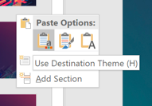
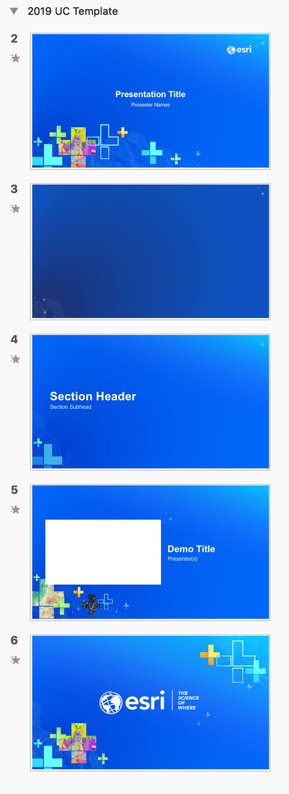

### Notes

g400077 UC Template for Esri staff

## Slide 2 — North Star Branding Visuals to Come ​

Updated walk-in and walk-out slides will be provided mid-June​
Show this before your presentation starts.

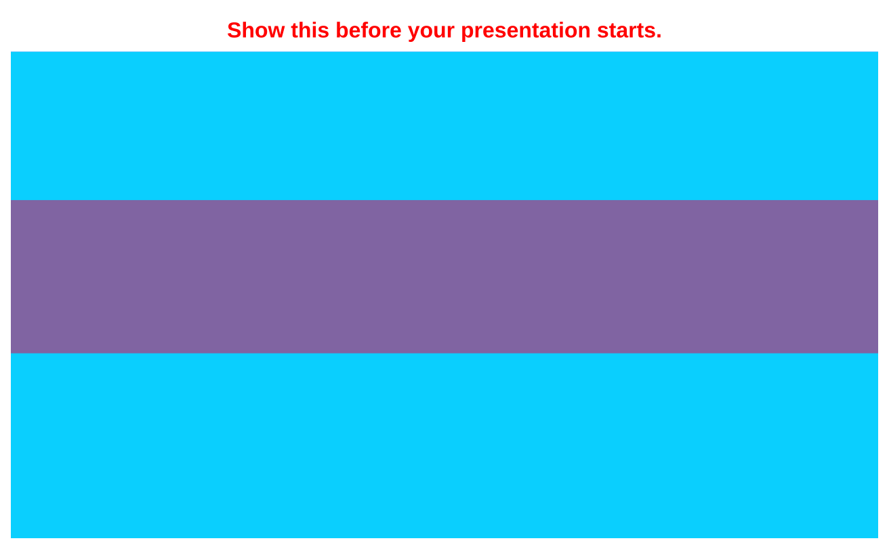

## Slide 3 — North Star Branding Visuals to Come ​

Updated walk-in and walk-out slides will be provided mid-June​
Show this before your presentation starts.

## Slide 4 — ArcGIS Pipeline Referencing: An Introduction

Rahul Rakshit | Gary Sinner
Please leave artwork “+” clustered.
Do not use them alone, as bullet points, or as a “plus” concept. Thank you.

## Slide 5 — ArcGIS Pipeline Referencing: An Introduction AGENDA

Information Model Overview
Location Referencing in

  - ArcGIS Pro
  - ArcGIS Enterprise
  - Event Editor
The Road Ahead
Q&A

Apps
Desktop
APIs

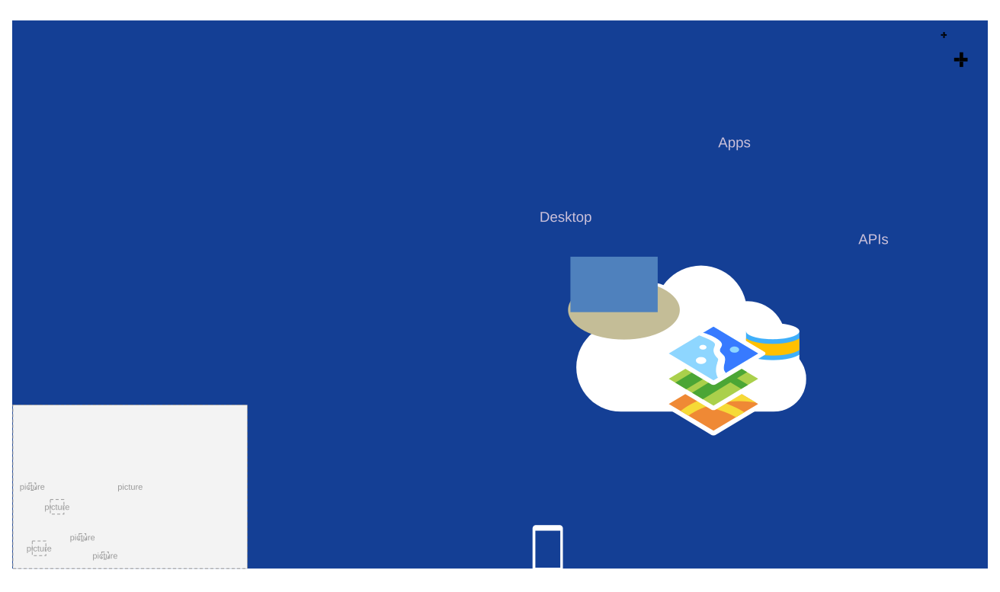

### Notes

Mention Matt’s Demo Theatre presentation that runs concurrent to this one – in case anyone is more “advanced” and wants to see that one…

## Slide 6 — Pipeline Referencing Overview

Information Model

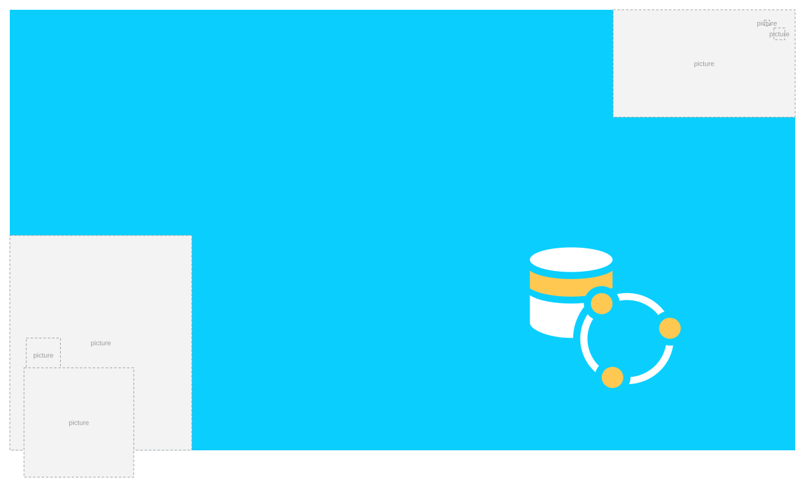

### Notes

Linear referencing system (LRS), is a method of spatial referencing, in which the locations of features are described in terms of measurements along a linear element, from a defined starting point, for example a milestone along a road.

## Slide 7 — Pipeline Referencing Overview – Routes and Networks

Locks m at locations

style.visibilitystyle.visibilitystyle.visibilitystyle.visibility
[figure: Information Model · Centerline · Shape & geometry · Network · M enabled polyline · Calibration Points · 0 · 50 · Route1 · Route · Route2 · Route3 · Route4]

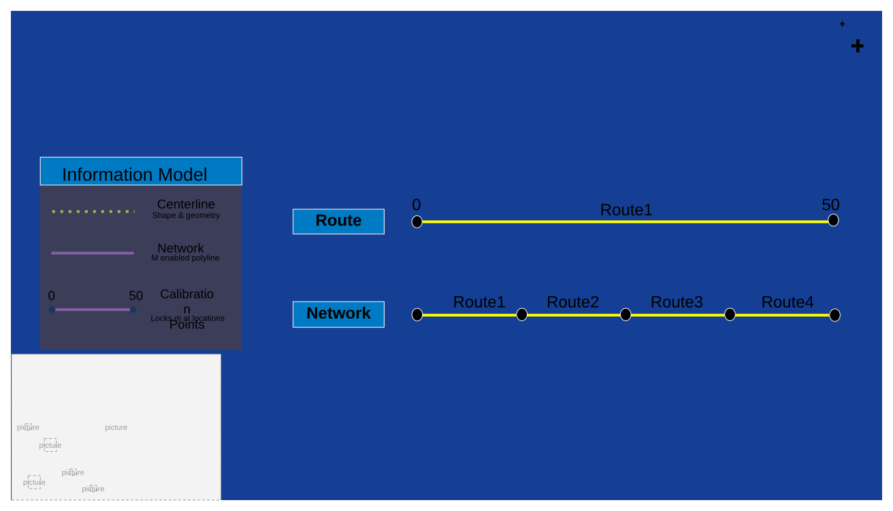

### Notes

Centerline—The polyline feature class that stores the route geometry

CenterlineSequence—The cross-reference table that manages the relationship between centerline and routes in network

CalibrationPoint—The point feature class that stores the route measure values

Routes – Polyline MZ feature class that combines geometry, measures, attributes (we call it the network feature class)
continuous, unbroken non-branching run of a physical pipe where measure values increasing or decreasing monotonically

Network - A collection of routes

The advanced linear referencing system (ALRS) supports the use of a single polyline feature class, known as centerlines, to store the geometry for multiple road/highway definitions, known as routes. The route definitions are stored in a route table, which has a many-to-many relationship to centerlines. This means that routes are typically made up of multiple centerline features and centerline features can participate in multiple routes. The many-to-many relationship between routes and centerlines is maintained through a cross-reference table known as the centerline sequence table. The centerline sequence table contains a reference to each centerline, indicating which routes a given centerline participates in. Because route IDs are not unique in the ALRS, the centerline sequence table also contains a reference to the LRS Network, named NetworkId. The combination of NetworkId and RouteId creates a way of uniquely identifying each route in the ALRS.

## Slide 8 — Types of LRS Networks

style.visibilitystyle.visibility
[figure: 0 · 50 · Route1 · Route2 · Continuous Network · 55 · 105 · Line1 · Line Network · 100 · Derived Network]

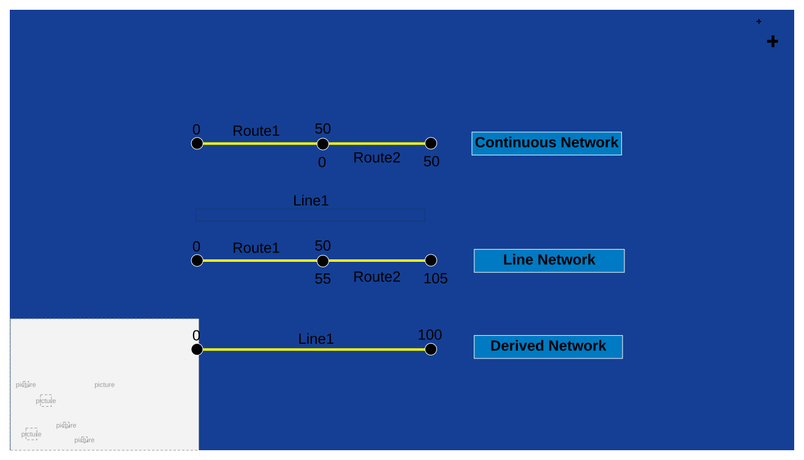

### Notes

Continuous – route where m values increase or decrease monotonically

Line – logical grouping of more than one route

Derived – routes from the same line are merged to create a single route

## Slide 9 — Pipeline Referencing Overview – Events

style.visibilitystyle.visibilitystyle.visibility
[figure: Point Event · Linear Events · RouteA · RouteB · Event1]

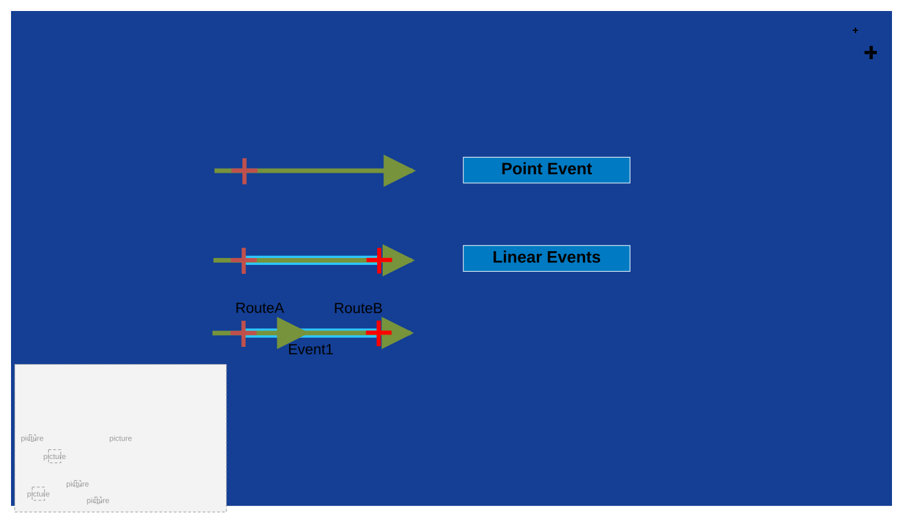

### Notes

Events - data that is located by its association to route and measure

May span routes

## Slide 10 — Pipeline Referencing Overview – Event Location Methods

Route and measure
Event:
1.27 miles
Calibration Point:
1 mile

Event:
456+25.00
Station Event:
100+00.00

Stationing

Event:
300 feet from US Highway 10
Intersection Features:
US Highway 10 crossing

Referent and offset

  - Intersections
  - Events
  - Features
Event:
45 feet from cell tower
Wellhead location:
34.0547,117.1825

Coordinates and offset
style.visibilitystyle.visibilitystyle.visibility

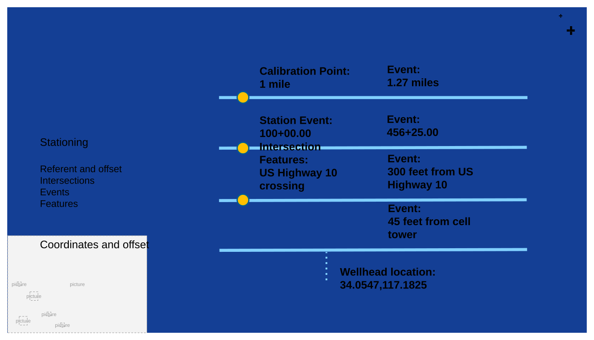

### Notes

- In addition to locating events on a pipeline by route and measure
	… LRP supports other methods for location referencing

- Events can be located
	…by station measures (w/ EQ)
	…as an offset from a referent feature, event, or intersection
	… and by coordinates + offset

Event behavior rules
Description
Stay Put
Preserves the geographic location of the event; measures may change.
Move
Preserves the measure(s) of the event; geographic location may change.
Retire
Preserves both measure and geographic location; event is retired.

The Move rule preserves the measure(s) of the event. When a route is modified, events retain their measure values. This means x,y coordinates may change.

The Stay Put rule preserves the geographic location of the event. When the route is modified, events retain their x,y coordinates. This means event measures will change whenever it is necessary to retain the location.

The Retire event behavior preserves both measure and location. When you modify a route, the system flags the event as retired by changing its To Date value to the effective date of the edit if the event is in an impacted region of the route.

Event Data Model

Reassign + Snap

Events are located along a route in a linear referencing system (LRS). Changes in the route due to route editing activities such as create, extend, realign, reassign, retire, cartographic realignment, and calibration have a direct impact on how the events are located and how they are rendered on a map. Behavior changes with measure or geographic location, or both, on one or more events due to route editing is called event behavior.
ArcGIS Pipeline Referencing keeps event measures and/or geographic location, for example x,y, in alignment with route edits. You can configure event behavior rules for an individual event layer to define how event measures and shapes are updated for each type of route edit.

Linear Referencing and Stationing are not one and the same.

Pipeline stationing is an “address” along a pipeline, a means to reference distance along a linear feature from start to end.  Unlike linear referencing, pipeline stationing doesn’t have to begin at zero.

While linear referencing and stationing are alike at the initial construction of a pipeline, throughout the history of a pipeline its stationing may change due to reroutes, extensions and removals.  These changes traditionally were handled by Engineering Stationing through Station Equations.

ALRP supports, but doesn’t require engineering stationing.  Location today can be established in multiple ways, including increasingly by accurate GPS surveys, and engineering stations can be used for connecting to legacy surveying systems and records.

## Slide 11 — Time Aware Linear Referencing Model

Users can view and analyze how routes, events, and intersections change over time…

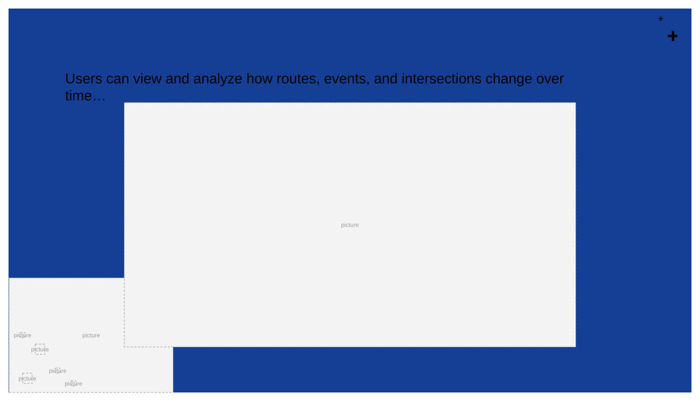

### Notes

Time-Aware

See how your network and associated events change through time.  Location Referencing for Pipelines is time-aware as everything, from rotes and events to route calibration, respects time.

- RH networks and events are time aware
- Edits that change networks or events, result in storage of both the new representation as well as the “retired” representation (the representation before the changes)
- Users can set the TVD in the product to view, edit, and due analysis on the network from any point in time
- Date ranges can be applied to LRS edits
- Event measure updates reflect date ranges of LRS edits
- Historical event measures that change du to LRS edits are “retired”
- “Temporal View Date” enables data visualization and query for any moment in time
- Integrated with the ArcGIS notion of time

## Slide 12

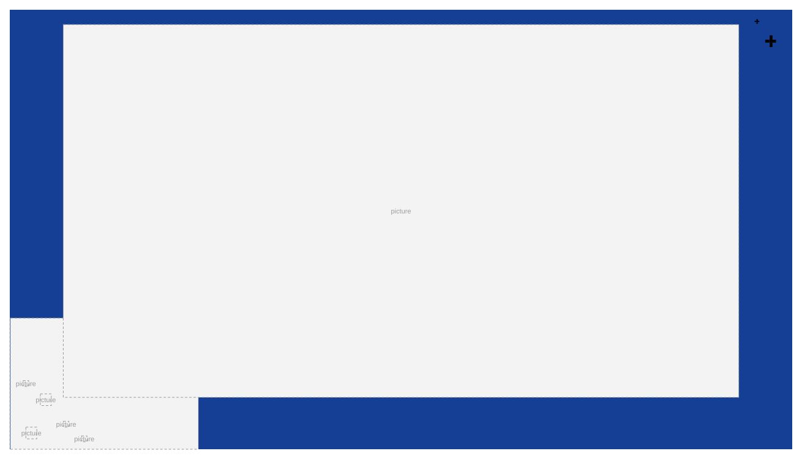

## Slide 13 — Pipeline Referencing Overview

Applications

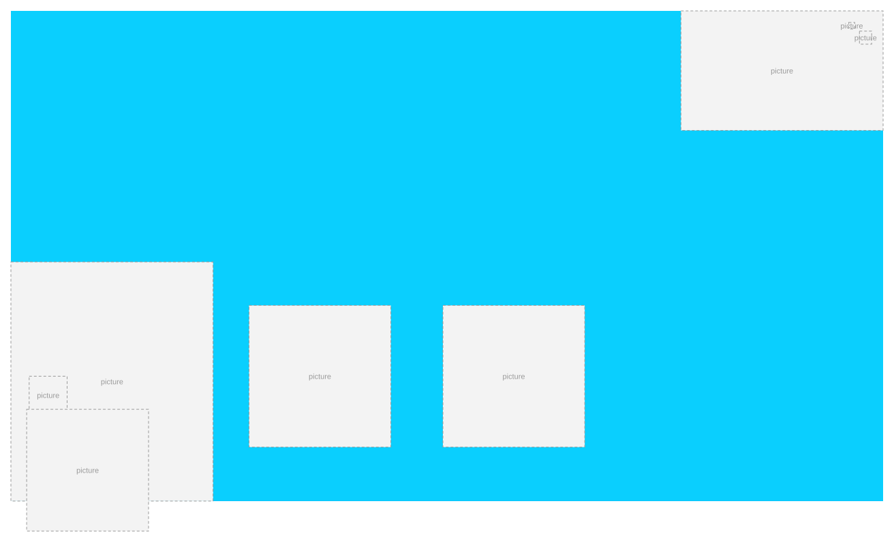

## Slide 14 — Pipeline Referencing Overview

- Network editing
- LRS management tools
- Geoprocessing tools
- Internationalized

ArcGIS Pro

- LRS web services
- Developer API samples

ArcGIS Enterprise

Event Editor

- Line and point event editing
- Data queries
- Quality checks
- Portal security
style.visibilitystyle.visibility

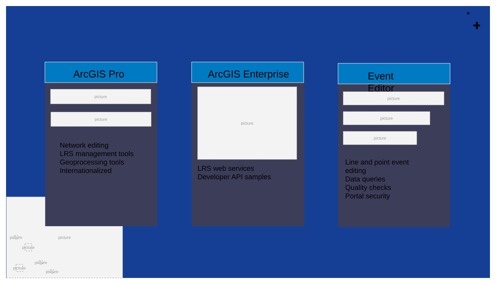

## Slide 15 — Pipeline Referencing in ArcGIS Pro

## Slide 16 — ArcGIS Pro Ribbon Toolbar

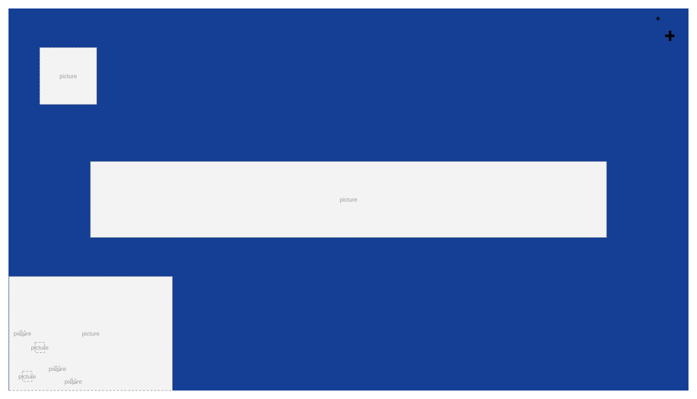

### Notes

Can I use the core ArcGIS editing tools to directly edit Roads and Highways LRS Network routes?
No. Though the software doesn't prevent you from doing so, the routes in the LRS Network feature classes should never have their shape, route ID, from date, or to date directly edited. The edit activities (create route, extend route, retire route, realign route, and reassign route) on the Roads And Highways Editingtoolbar should be used for making changes to routes in a network.
If you accidentally edit and save changes on a route or set of routes in an LRS Network, the change can be repaired using the Generate Routes geoprocessing tool or by right-clicking the LRS Network in the geodatabase in ArcCatalog and in the Catalog window in ArcMap and clicking Generate Routes.
For more information, see Generating routes.

Can I use the ArcGIS editing tools to directly edit Roads and Highways event feature classes?
Event feature classes (events modeled in the geodatabase and registered with Roads and Highways) are events that have a shape column managed by Roads and Highways. You should not edit event shapes. You can edit event attributes, route ID, from date, to date, and measures in the ArcMap attribute table, and Roads and Highways will take care of updating the shape. Roads and Highways for Server also provides REST services to support editing event feature classes in a manner that allows Roads and Highways to update the shape.

If you accidentally edit an event feature class shape and save the changes, Roads and Highways has a menu option in the Catalog window in ArcMap on the geodatabase for the LRS event node that is registered with Roads and Highways. Click Update Event Shapes to correct the shapes of the events.
For more information, see Updating event shapes.

## Slide 17 — Geoprocessing Tools

Configuring

Loading

Transformations

  - Event Measure Behaviors
  - Dynamic Segmentation
  - Measure Translation

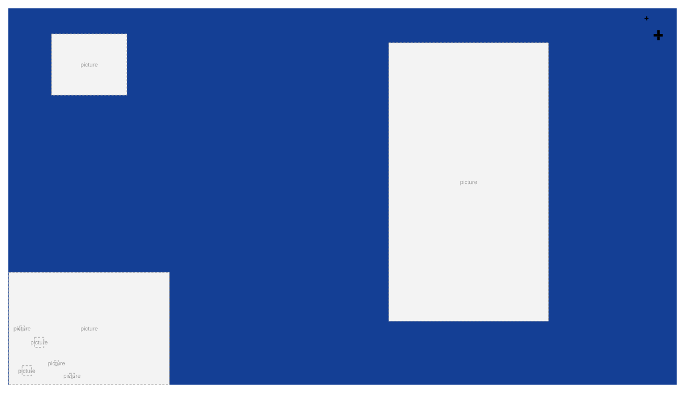

### Notes

ALRP supports geoprocessing tools to help with the management and data conversions of data in the LRS.

## Slide 18 — Demo: Data Loading

Append Routes
Or maybe do append events as lead in for next subject – QC checks?
Probably only time for one or the other demo, but not both?
Could just describe “similar tool for loading event data…”

## Slide 19 — Quality Control Checks

[figure: Gaps · Overlaps · Invalid Measures · Event Checks · Non-monotonic · 0 · 20 · 40 · Route Checks]

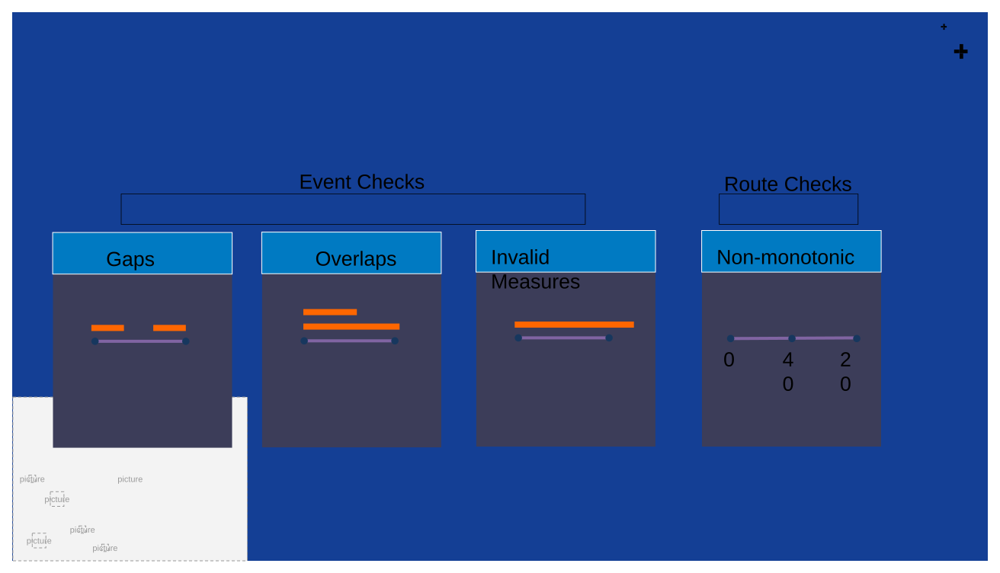

## Slide 20 — Demo: Running QC Checks

Presenter(s)

## Slide 21 — Pipeline Referencing in ArcGIS Enterprise

## Slide 22 — Pipeline Referencing for ArcGIS Enterprise

Pipeline Referencing Server

Linear Referencing Features

- layers
- networkLayers
- eventLayers
- redlineLayers
- centerlineLayers
- calibrationPointLayers
- intersectionLayers
- nonLRSLayers
- tables
- locks
- jobs
- applyEdits
- createVersion
- deleteVersion
- reconcileVersion
- queryEditLog
- Mapping
- Query
- Geoprocessing
- Enterprise security
- Scalability

[figure: Desktop · Web · Connected Mobile · LRS Web Services · Child Resources · Supported Operations · ArcGIS Enterprise]

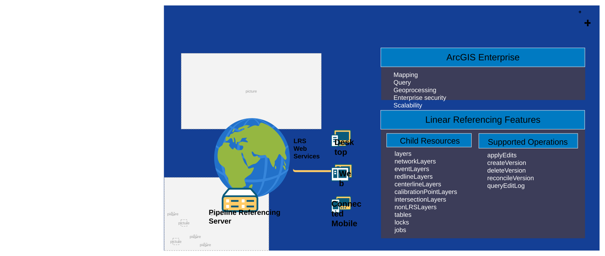

### Notes

ArcGIS Server provides

- Mapping
- Query
- Geoprocessing
- Enterprise security
- Scalability

## Slide 23 — Creating a Location Referencing Feature Service

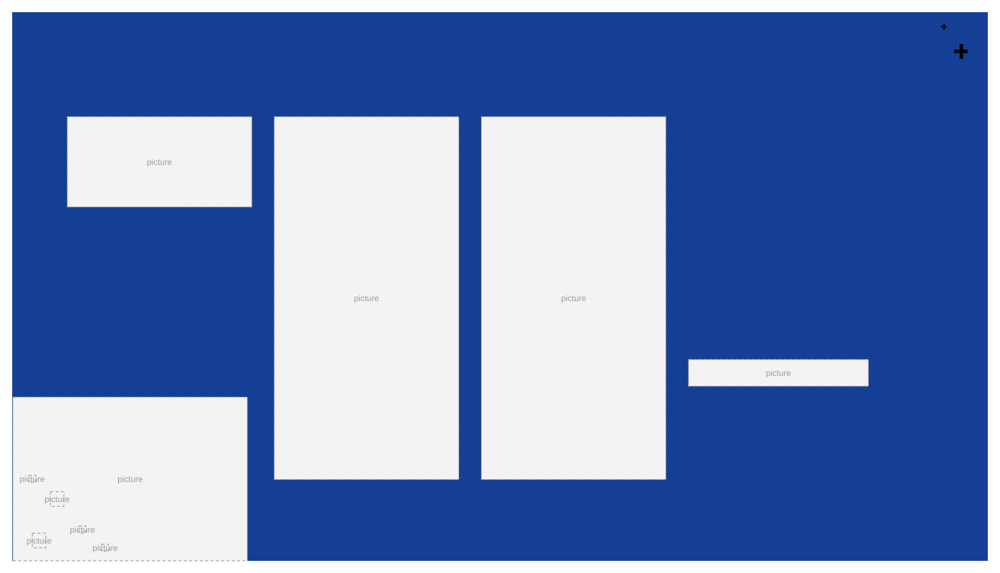

### Notes

Talk a bit about branch versioning requirement and move to feature services in preference to direct connections
Don’t bother with demo of this – takes time and other sessions for that – just point out the key things that need to remember to do when creating an LR feature service

## Slide 24 — Pipeline Referencing Overview – The REST API

https://<domain>/server/rest/services/<mapservice>/MapServer/exts/LRServer

Developer Resources
http://pipelinesample.esri.com/pipeline

## Slide 25 — Utilizing REST APIs for Location Referencing Workflows

Session ID: 6850

Tuesday 4:00 PM – 4:45 PM
Expo Demo Theater 12

### Notes

The pipeline location platform is extensible…

- BPs and customers can:
	… extend existing solutions with its capabilities
	…as well as build new solutions on the platform

## Slide 26 — Event Editor

## Slide 27 — Event Editor

- Gaps, Overlaps & Invalid Measures
- Data Reviewer Batch Checks
- Line & Point Events
- Event Replacement
- Event Attributes

Select By:

  - Route
  - Attribute
  - Geometry
  - Proximity

[figure: Browser Experience · Quality Checks · Editing · Selection]

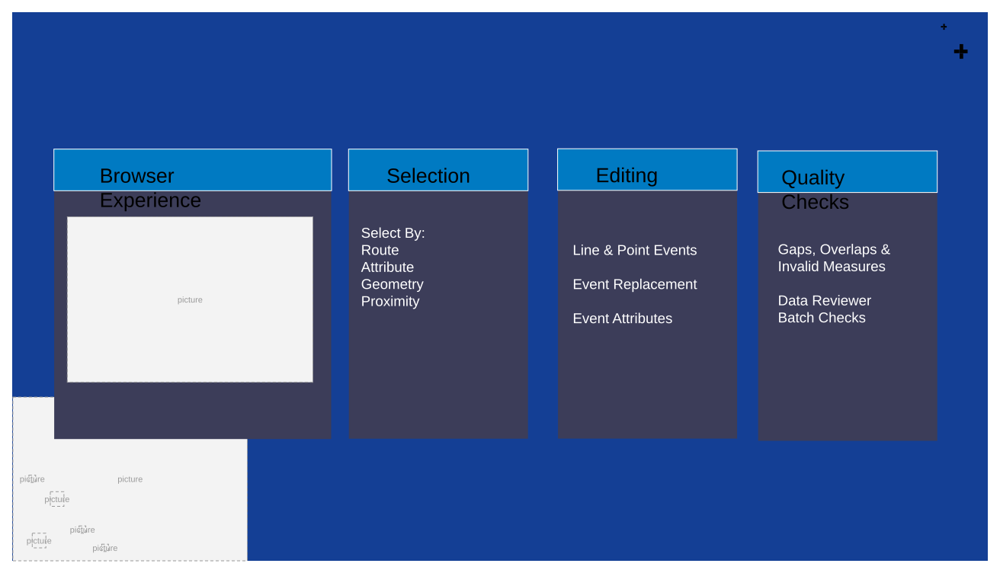

### Notes

Web based event editing and QC.

- Which opens up the data management of pipeline data beyond the GIS professional

## Slide 28 — Demo: Event Editor

Presenter(s)

## Slide 29 — Event Behaviors After route edits, measure behavior rules can be applied to events

Preserves geographic
location. Measures may change.

Event gets retired.

Preserves measures.
Geographic location may change.

[figure: Before Editing · 0 · 10 · Centerline · Event · Route · Realign Route · Stay Put · 15 · Retire · Move]

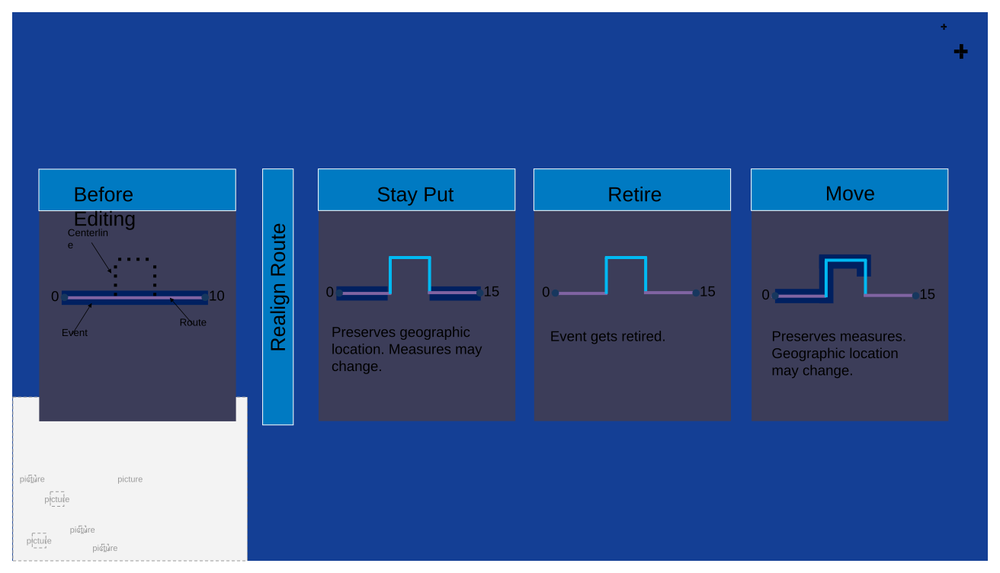

### Notes

Pretty good description of event behaviors here (R&H graphics, but good discussion):
https://enterprise.arcgis.com/en/pipeline-referencing/latest/get-started/event-behaviors.htm

Easily keep all systems aligned with pipeline network changes by rule-based location management that allows you to define how event measures and route associations should react to changes or edits.

This is done by your setting rules for each event layer.  By telling the events what to do when the pipeline changes, you establish priorities to preserve location, position, or neither.  You have four options for setting location management rules: Stay Put which preserves event position (x,y coordinates), Move which preserves location (measure values), Retire (which preserves both position and location but changes its ToDate value), and Snap (which preserves the proportional location of an event by snapping to the new route or to the new alignment of the existing route).

## Slide 30 — Demo: Event Behaviors

Presenter(s)

## Slide 31 — Demo: Route Editing

Realign Route

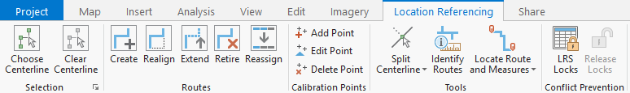

## Slide 32 — Conflict Prevention

This Intro session is concurrent w/ Matt’s talk so can’t put in plug to go see it…
Discuss briefly as “intro” level topic, but no demo…

## Slide 33

Slides for conflict prevention, locks

## Slide 34 — Utility Network Integration

Just touch on at “intro” level – no demo in this presentation.
Come by see us at Expo…

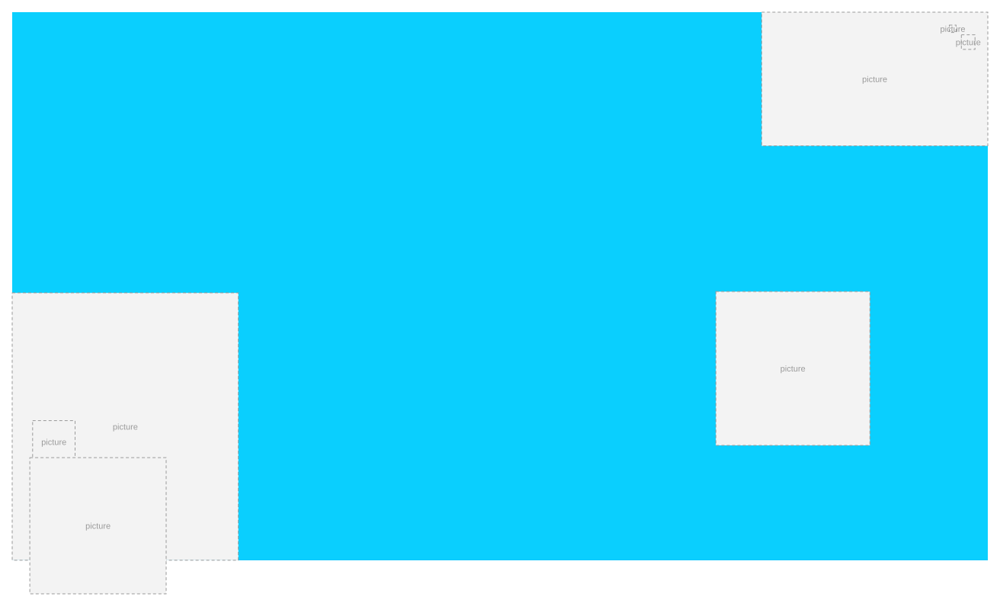

## Slide 35

Slides for Utility Network

## Slide 36 — The Road Ahead…

## Slide 37 — Road Map

- Product releases, dates, and availability are estimates and are subject to change
- Event Editor in ArcGIS Pro
- Complete Utility Network integration

[figure: Medium Term · Vertical pipe support · Long Term · Near term]

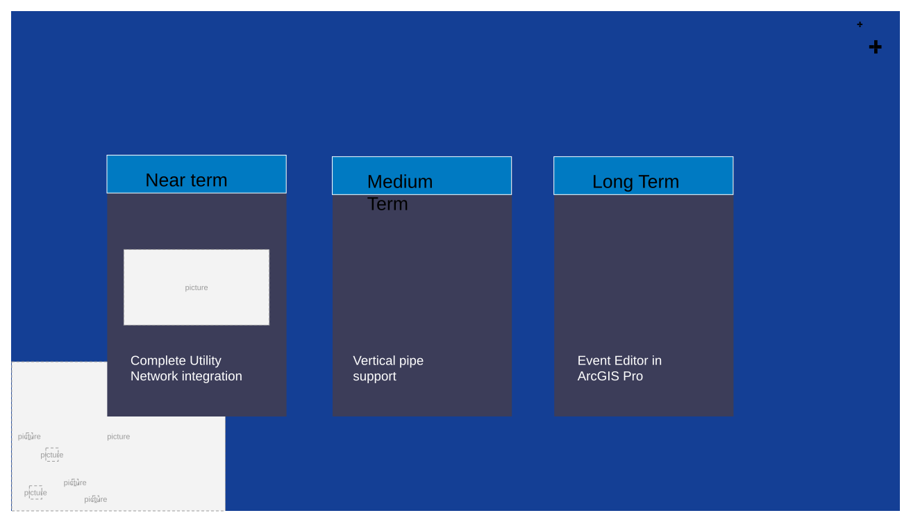

## Slide 38 — Resources

ArcGIS Pro Pipeline Referencing Help

  - https://pro.arcgis.com/en/pro-app/help/production/location-referencing-pipelines/
get-started-with-arcgis-pipeline-referencing.htm
ArcGIS Enterprise Help

  - https://enterprise.arcgis.com/en/pipeline-referencing/
  - http://pipelinesample.esri.com/pipeline/
Utility and Pipeline Data Model (UPDM)

  - https://community.esri.com/docs/DOC-11209-updm-2018-edition
GeoNet

  - https://community.esri.com/community/electric-and-gas
Esri Support Services

  - https://support.esri.com/en/
Esri Online Training

  - https://www.esri.com/training/

## Slide 39 — North Star Branding Visuals to Come ​

Updated walk-in and walk-out slides will be provided mid-June​
Show this after your presentation has ended.

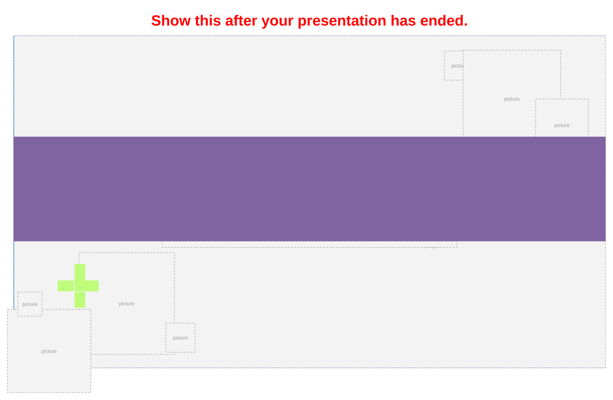

## Slide 40 — North Star Branding Visuals to Come ​

Updated walk-in and walk-out slides will be provided mid-June​
Show this after your presentation has ended.

## Slide 41 — Presentation Title

Presenter Names
Please leave artwork “+” clustered.
Do not use them alone, as bullet points, or as a “plus” concept. Thank you.

## Slide 42

## Slide 43 — Section Header

Section Subhead

## Slide 44 — Demo Title

Presenter(s)

