# ArcGIS Pipeline Referencing: An Introduction

|   |   |
| --- | --- |
| **Kind** | Other · Pro |
| **Release** | — |
| **Product** | Pipeline Referencing · Utility Network |
| **Source** | [UC2020_APR_Full.pptx](<https://esriis.sharepoint.com/sites/LocationReferencing/Shared%20Documents/UC%202020%20prep%20for%20RH/UC2020_APR_Full.pptx>) |
| **Edited** | 2020-07-09 15:10 by unknown |
| **Extracted** | 2026-09-04 · lane `xmlstrip` |

<!-- metadata
```yaml
title: "ArcGIS Pipeline Referencing: An Introduction"
source_file: "UC2020_APR_Full.pptx"
source_url: "https://esriis.sharepoint.com/sites/LocationReferencing/Shared%20Documents/UC%202020%20prep%20for%20RH/UC2020_APR_Full.pptx"
doc_id: 785
doc_kind: "Other"
surface: "Pro"
doc_revision: ""
target_release: ""
pe: "Johum Khushk"
dev: "Nathan Easley"
author: ""
last_edited_by: ""
last_edited: "2020-07-09T15:10:00Z"
extracted: 2026-09-04
extraction_lane: xmlstrip
prompt_version: "v2.0.2"
keywords: ["pipeline referencing", "event editing", "route editing", "utility network integration", "geoprocessing tools", "rest api", "calibration points", "dynamic segmentation"]
tools: ["Append Routes", "Generate Calibration Points", "Append Events", "Apply Event Behaviors", "Delete Routes", "Derive Event Measures", "Generate Events", "Generate Routes", "Overlay Events", "Remove Overlapping Centerlines", "Translate Event Measures", "Update Measures From LRS"]
products: ["Pipeline Referencing", "Utility Network"]
issues: []
related: [{"doc":784,"file":"pipeline-referencing-across-the-arcgis-platform__doc784.md","s":6.527},{"doc":787,"file":"location-referencing-for-transportation-across-the-arcgis-platform__doc787.md","s":5.709},{"doc":885,"file":"arcgis-pipeline-referencing-an-introduction__doc885.md","s":4.536},{"doc":115,"file":"regression-testing-task-list-v1__doc115.md","s":4.094},{"doc":39,"file":"location-referencing-gp-error-messages__doc39.md","s":3.634}]
```
-->

## Summary

This document introduces ArcGIS Pipeline Referencing, covering its information model, integration with ArcGIS Pro and ArcGIS Enterprise, event editing capabilities, utility network integration, and geoprocessing tools. It includes descriptions of pipeline referencing networks, event behaviors, route editing tools, REST API features, and a roadmap for future developments. The document also highlights demo scenarios and tool configurations relevant to pipeline referencing workflows.

## Related documents

<!-- related:begin -->
- [Pipeline Referencing Across the ArcGIS Platform](<https://esriis.sharepoint.com/sites/lrsworkspace/LRS Doc Index/Other/pipeline-referencing-across-the-arcgis-platform__doc784.md>) — similar text 0.62 · 1 title word · 1 filename word · same kind/folder <!-- rel:784 -->
- [Location Referencing for transportation across the ArcGIS Platform](<https://esriis.sharepoint.com/sites/lrsworkspace/LRS Doc Index/Other/location-referencing-for-transportation-across-the-arcgis-platform__doc787.md>) — similar text 0.49 · 1 filename word · same kind/surface/folder <!-- rel:787 -->
- [ArcGIS Pipeline Referencing: An Introduction](<https://esriis.sharepoint.com/sites/lrsworkspace/LRS%20Doc%20Index/Other/arcgis-pipeline-referencing-an-introduction__doc885.md>) — similar text 0.33 · 2 title words · 1 filename word · same kind/surface <!-- rel:885 -->
- [Regression Testing Task List V1](<https://esriis.sharepoint.com/sites/lrsworkspace/LRS Doc Index/Test Plans/regression-testing-task-list-v1__doc115.md>) — similar text 0.21 · same surface <!-- rel:115 -->
- [Location Referencing GP Error Messages](<https://esriis.sharepoint.com/sites/lrsworkspace/LRS Doc Index/Other/location-referencing-gp-error-messages__doc39.md>) — similar text 0.12 · same kind/surface <!-- rel:39 -->
<!-- related:end -->

<!-- docs:begin -->
## Esri documentation

[3D in Pipeline Referencing](https://doc.esri.com/en/arcgis-pro/latest/help/production/location-referencing-pipelines/3d-in-pipeline-referencing.html) · [Event editing using the attribute table](https://doc.esri.com/en/arcgis-pro/latest/help/production/location-referencing-pipelines/event-editing-using-the-attribute-table.html) · [Apply dynamic segmentation](https://doc.esri.com/en/arcgis-pro/latest/help/production/location-referencing-pipelines/apply-dynamic-segmentation.html)

_No page matched:_ [Append Routes](https://www.google.com/search?q=%22Append%20Routes%22+site%3Adoc.esri.com) · [Generate Calibration Points](https://www.google.com/search?q=%22Generate%20Calibration%20Points%22+site%3Adoc.esri.com) · [Append Events](https://www.google.com/search?q=%22Append%20Events%22+site%3Adoc.esri.com) · [Apply Event Behaviors](https://www.google.com/search?q=%22Apply%20Event%20Behaviors%22+site%3Adoc.esri.com) · [Delete Routes](https://www.google.com/search?q=%22Delete%20Routes%22+site%3Adoc.esri.com) · [Derive Event Measures](https://www.google.com/search?q=%22Derive%20Event%20Measures%22+site%3Adoc.esri.com) · [Generate Events](https://www.google.com/search?q=%22Generate%20Events%22+site%3Adoc.esri.com) · [Generate Routes](https://www.google.com/search?q=%22Generate%20Routes%22+site%3Adoc.esri.com) · [Overlay Events](https://www.google.com/search?q=%22Overlay%20Events%22+site%3Adoc.esri.com) · [Remove Overlapping Centerlines](https://www.google.com/search?q=%22Remove%20Overlapping%20Centerlines%22+site%3Adoc.esri.com) · [Translate Event Measures](https://www.google.com/search?q=%22Translate%20Event%20Measures%22+site%3Adoc.esri.com) · [Update Measures From LRS](https://www.google.com/search?q=%22Update%20Measures%20From%20LRS%22+site%3Adoc.esri.com)
<!-- docs:end -->

---

## Slide 1 — ArcGIS Pipeline Referencing

2020 ESRI USER CONFERENCE
Johum Khushk | Nathan Easley
An Introduction

 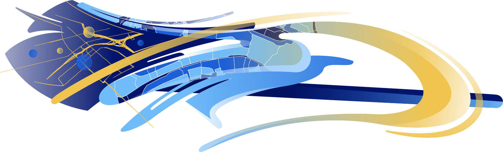 

## Slide 2 — Pipeline Referencing Across the ArcGIS Platform

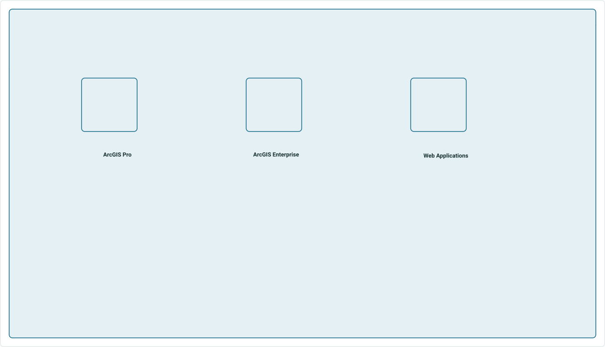

ArcGIS Pro
ArcGIS Enterprise
Web Applications

- Pipeline Referencing extension is part of the ArcGIS Pro install
- Linear referencing capability for server is part of the ArcGIS Enterprise install
- Network and centerline
   management

- LRS configuration
- Route and event loading
- Geoprocessing tools
- Includes Workflow Manager
   & Data Reviewer for Desktop

- LRS web services
- Developer API samples
- Event editing
- Data queries
- Integrates with Data
   Reviewer for Server

  

## Slide 3 — Agenda

Information Model
ArcGIS Pro
ArcGIS Enterprise
Event Editor
Utility Network Integration
The Road Ahead
Q&A


## Slide 4 — Pipeline Referencing – Information Model

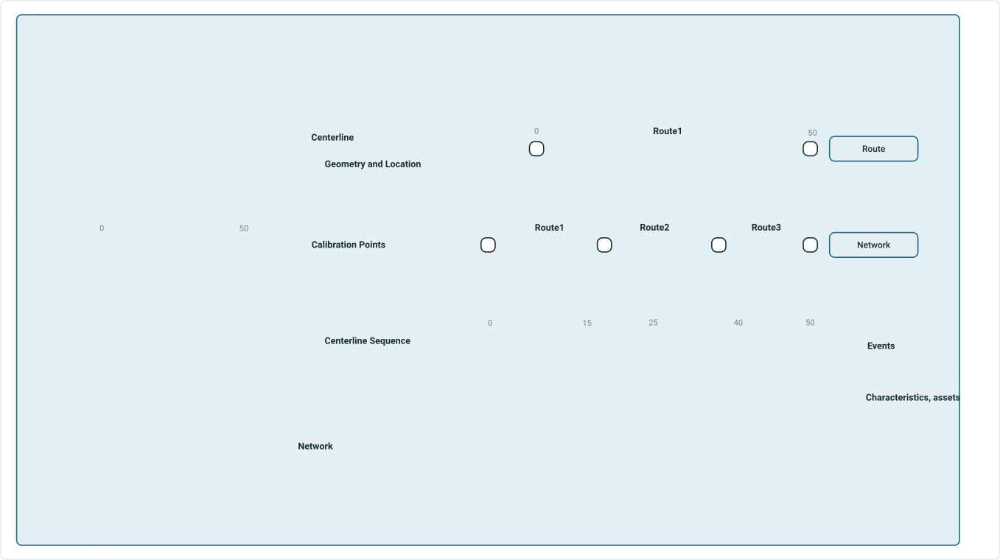

m:n relationship
          routes and centerlines

Locks m at locations
M & Z enabled polyline

style.visibilitystyle.visibilitystyle.visibilitystyle.visibilitystyle.visibilitystyle.visibilitystyle.visibility


## Slide 5 — Pipeline Referencing – Types of Networks

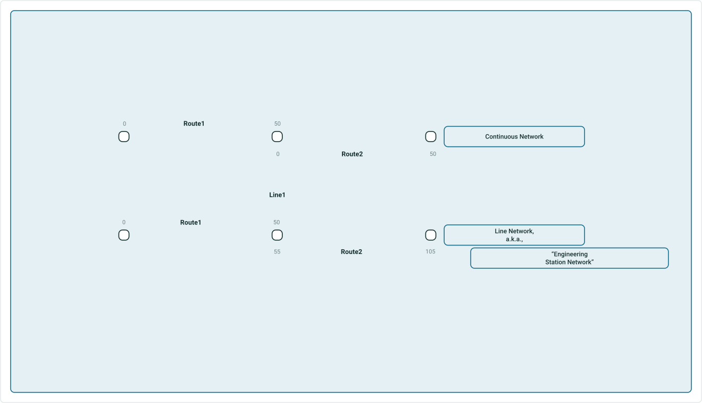

“Engineering Station Network”
style.visibility


## Slide 6 — Pipeline Referencing – Types of Networks

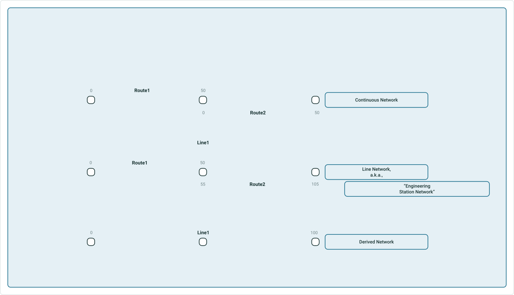

“Engineering Station Network”


## Slide 7 — Pipeline Referencing – Types of Events


style.visibilitystyle.visibility

 

## Slide 8 — ArcGIS Pipeline Referencing: An Introduction

Information Model
ArcGIS Pro
ArcGIS Enterprise
Event Editor
Utility Network Integration
The Road Ahead
Q&A

## Slide 9 — Location Referencing Route Editing Tools


## Slide 10 — Location Referencing Route Editing Tools

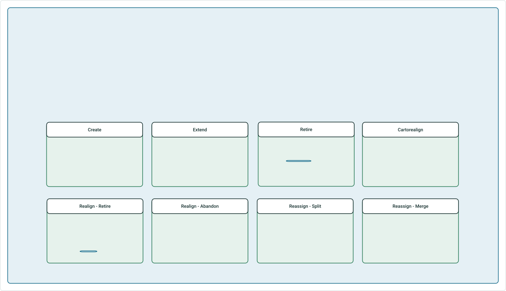

style.visibilitystyle.visibilitystyle.visibilitystyle.visibilitystyle.visibilitystyle.visibilitystyle.visibility


## Slide 11 — Demo: Route Editing

### Notes

(Daily build of 2.6) Create a route , realignment with abondenment (double equation point), time slider.

## Slide 12 — Event Behaviors After route edits, measure behavior rules can be applied to events

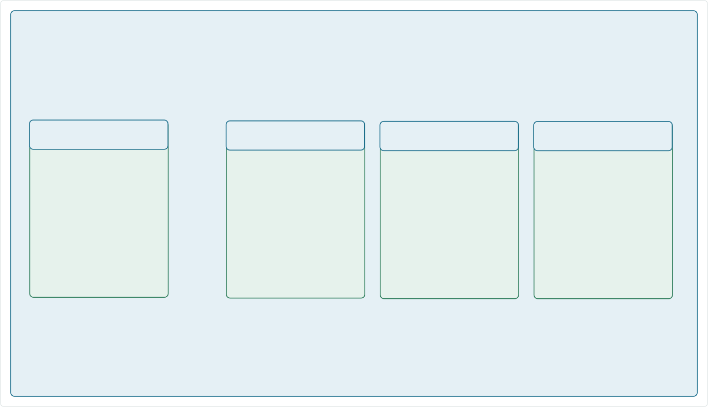

Preserves geographic
location. Measures may change.

Event gets retired.

Preserves measures.
Geographic location may change.

style.visibilitystyle.visibilitystyle.visibility


## Slide 13 — Demo: Event Behaviors

Using Extend Route

## Slide 14 — Geoprocessing Tools

- Configuration
  - LRS
  - LRS Event
  - LRS Intersection
  - LRS Network
  - Remove LRS Entity
  - Configure Utility Network Feature Class
- Append Routes
- Generate Calibration Points
- Append Events
- Apply Event Behaviors
- Delete Routes
- Derive Event Measures
- Generate Events
- Generate Routes
- Overlay Events
- Remove Overlapping Centerlines
- Translate Event Measures
- Update Measures From LRS

LRS Configuration


### Notes

Add intersection tools, Update measures from LRS + other UN tools , new tools mark with*

## Slide 15 — Geoprocessing Tools

- Configuration
  - LRS
  - LRS Event
  - LRS Intersection
  - LRS Network
  - Remove LRS Entity
  - Configure Utility Network Feature Class
- Append Routes
- Generate Calibration Points
- Append Events
- Apply Event Behaviors
- Delete Routes
- Derive Event Measures
- Generate Events
- Generate Routes
- Overlay Events
- Remove Overlapping Centerlines
- Translate Event Measures
- Update Measures From LRS

Data Loading


### Notes

Add intersection tools, Update measures from LRS + other UN tools , new tools mark with*

## Slide 16 — Geoprocessing Tools

- Configuration
  - LRS
  - LRS Event
  - LRS Intersection
  - LRS Network
  - Remove LRS Entity
  - Configure Utility Network Feature Class
- Append Routes
- Generate Calibration Points
- Append Events
- Apply Event Behaviors
- Delete Routes
- Derive Event Measures
- Generate Events
- Generate Routes
- Overlay Events
- Remove Overlapping Centerlines
- Translate Event Measures
- Update Measures From LRS

Transformations


### Notes

Add intersection tools, Update measures from LRS + other UN tools , new tools mark with*

## Slide 17 — Geoprocessing Tools – Overlay Events

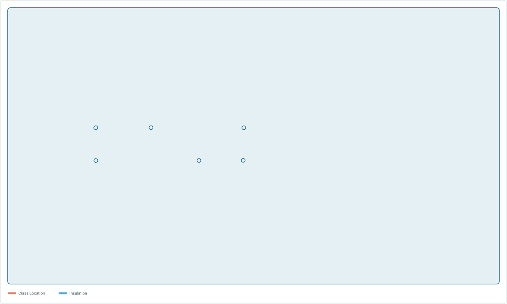

style.visibility


## Slide 18 — Geoprocessing Tools – Overlay Events


## Slide 19 — Geoprocessing Tools – Overlay Events

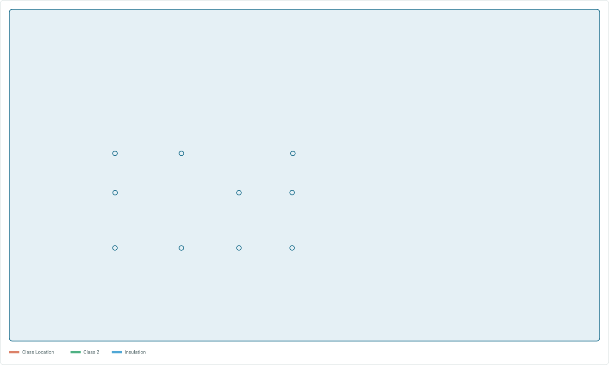


## Slide 20 — ArcGIS Pipeline Referencing: An Introduction

Information Model
ArcGIS Pro
ArcGIS Enterprise
Event Editor
Utility Network  Integration
The Road Ahead
Q&A

## Slide 21 — Pipeline Referencing in ArcGIS Enterprise

Pipeline Referencing Server
Linear Referencing Service Features

- Network editing
- Event editing
- Coordinate to measures
- Measure to coordinate
- Measure translation
- Dynamic Segmentation
- Check events (gaps, overlaps, invalid measures)

[figure: Desktop · Web · Connected Mobile · LRS Web Services]


## Slide 22 — Location Referencing REST API

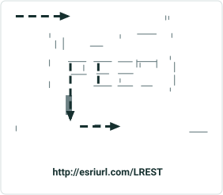

http://esriurl.com/LREST

http://esriurl.com/LRWIGET

- REST API developer guide
- Sample LRS-enabled services
- Sample web apps
- Web AppBuilder samples


## Slide 23 — Demo: Location Referencing REST API

### Notes

Two Sample web apps (<2min)

## Slide 24 — ArcGIS Pipeline Referencing: An Introduction

Information Model
ArcGIS Pro
ArcGIS Enterprise
Event Editor
Utility Network Integration
The Road Ahead
Q&A

## Slide 25 — Event Editor: Event Editing in the web

- Editing
  - Lines and Points events
  - Event Attributes
  - Selection
  - Select by route, attribute, geometry, proximity
  - Single layer results or attribute sets
  - Quality Control
  - Gaps, overlaps, invalid measures
  - Data Reviewer batch checks

style.visibilitystyle.visibilitystyle.visibilitystyle.visibilitystyle.visibility
  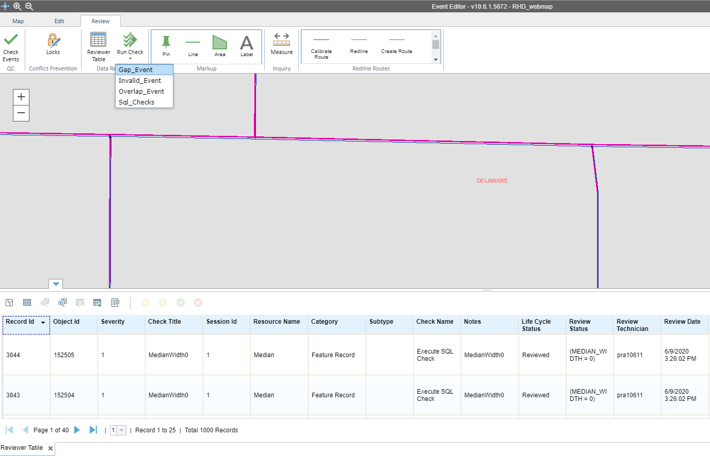

## Slide 26 — Event Location Methods

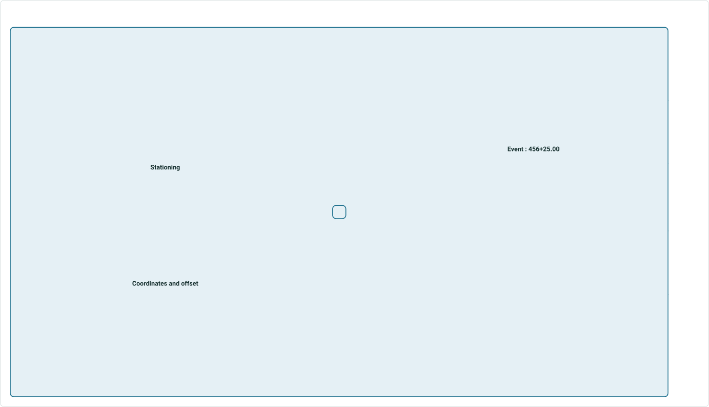

Route and measure
Event:
1.27 miles

Event:
456+25.00

Stationing
Event:
300 feet from US Highway 10
Intersections
US Highway 10 crossing

Referent and offset

  - Intersections
  - Events
  - Features
Event:
45 feet from Wellhead
Wellhead location:
34.0547,117.1825

Coordinates and offset
style.visibilitystyle.visibilitystyle.visibility


## Slide 27 — Demo: Event Editor

### Notes

Attribute sets, Add events,  Event Replacement, Return attribute sets.

## Slide 28 — ArcGIS Pipeline Referencing: An Introduction

Information Model
ArcGIS Pro
ArcGIS Enterprise
Event Editor
Utility Network Integration
The Road Ahead
Q&A

## Slide 29 — Combining Pipeline Referencing and Utility Network is the solution

style.visibilitystyle.visibilitystyle.visibilitystyle.visibilitystyle.visibilitystyle.visibilitystyle.visibilitystyle.visibilitystyle.visibilitystyle.visibilitystyle.visibility
[figure: Gathering · Transmission · Distribution · Linear Referencing · Geometric Network]


## Slide 30 — Combining Pipeline Referencing and Utility Network is the solution

Utility Network and Pipeline Referencing

[figure: Gathering · Transmission · Distribution · UPDM 2019]


## Slide 31 — Integrating both information models

Utility Network

| Assembly |
| --- |
| Device |
| Junction |
| Pipeline |
| Structure Boundary |
| Structure Junction |
| Structure Line |

Pipeline Referencing

| Calibration Point |
| --- |
| Centerline |
| Centerline Sequence |
| Redline |

style.visibilitystyle.visibilitystyle.visibilitystyle.visibilitystyle.visibilitystyle.visibilitystyle.visibilitystyle.visibilitystyle.visibility


## Slide 32 — ArcGIS Pipeline Referencing: Integration with Utility Network

## Slide 33 — ArcGIS Pipeline Referencing: An Introduction

Information Model
ArcGIS Pro
ArcGIS Enterprise
Event Editor
Utility Network Integration
The Road Ahead
Q&A

## Slide 34 — Road Map

- Product releases, dates, and availability are estimates and are subject to change

Event Editing in ArcGIS Pro
Field Data Collection with Linear Referencing
style.visibilitystyle.visibilitystyle.visibilitystyle.visibility
[figure: Near Term · Vertical Pipe Support · Medium Term · Long Term]


## Slide 35 — Resources


### Notes

Make sure links work

## Slide 36 — ArcGIS Pipeline Referencing: An Introduction


Information Model
ArcGIS Pro
ArcGIS Enterprise
Event Editor
Utility Network Integration
The Road Ahead
Q&A


## Slide 37

Copyright © 2020 Esri. All rights reserved.

  
