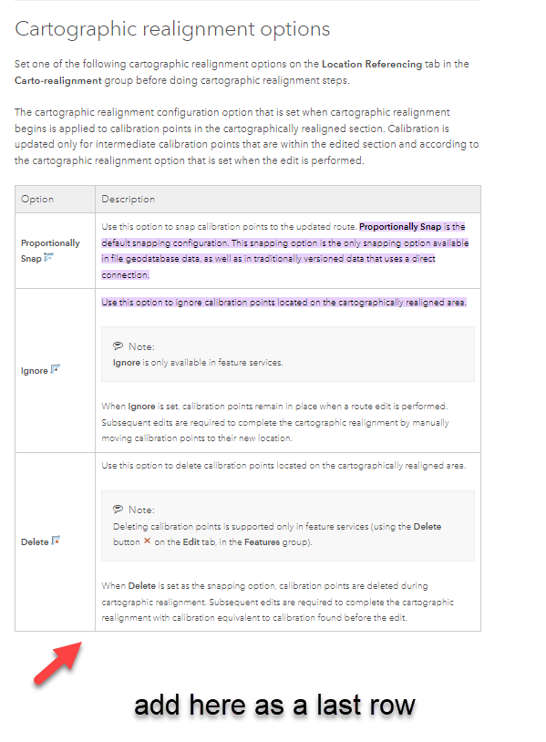
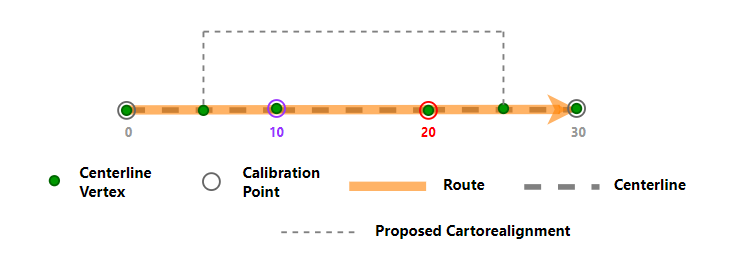
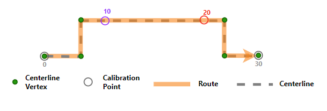
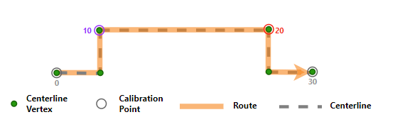

# Cartographic Realignment Options in Location Referencing

|   |   |
| --- | --- |
| **Kind** | Other · Pro |
| **Release** | — |
| **Product** | Pipeline Referencing |
| **Source** | [Snaptovertex_Cartographicrealignment_APR.docx](<https://esriis.sharepoint.com/sites/LocationReferencing/Shared%20Documents/General/Doc%20Reviews/5668_CartoRealignOptions/Snaptovertex_Cartographicrealignment_APR.docx>) |
| **Edited** | 2024-03-19 20:22 by Ignacia Galvan |
| **Extracted** | 2026-09-04 · lane `xmlstrip` |

<!-- metadata
```yaml
title: "Cartographic Realignment Options in Location Referencing"
source_file: "Snaptovertex_Cartographicrealignment_APR.docx"
source_url: "https://esriis.sharepoint.com/sites/LocationReferencing/Shared%20Documents/General/Doc%20Reviews/5668_CartoRealignOptions/Snaptovertex_Cartographicrealignment_APR.docx"
doc_id: 402
doc_kind: "Other"
surface: "Pro"
doc_revision: ""
target_release: ""
pe: ""
dev: ""
author: "Lakshmi Ananthanarayanan"
last_edited_by: "Ignacia Galvan"
last_edited: "2024-03-19T20:22:00Z"
extracted: 2026-09-04
extraction_lane: xmlstrip
prompt_version: "v2.0.2"
keywords: ["cartographic realignment", "calibration points", "snap to vertex", "centerline", "route measures", "generate routes", "location referencing"]
tools: ["Generate Routes", "Modify Network Calibration Rules"]
products: ["Pipeline Referencing"]
issues: []
related: [{"doc":401,"file":"cartographic-realignment-options-with-snap-to-vertex__doc401.md","s":9.085},{"doc":611,"file":"support-snap-to-vertex-option-for-calibration-points-impacted-by-cartographic__doc611.md","s":3.863},{"doc":736,"file":"support-updating-measures-option-in-cartographic-realignment__doc736.md","s":3.737},{"doc":407,"file":"event-behavior-for-cartographic-realignment__doc407.md","s":3.72},{"doc":387,"file":"event-behavior-for-cartographic-realignment__doc387.md","s":3.699}]
```
-->

## Summary

This document explains the cartographic realignment options available on the Location Referencing tab, including Proportional Snap, Delete, Ignore, and the newly added Snap To Vertex option. It describes how calibration points behave under each option during route edits and the conditions required for Snap To Vertex to function properly. The document also clarifies the impact of enabling or disabling the update route measures option during cartographic realignment.

## Related documents

<!-- related:begin -->
- [Cartographic Realignment Options with Snap To Vertex](<https://esriis.sharepoint.com/sites/lrsworkspace/LRS Doc Index/Other/cartographic-realignment-options-with-snap-to-vertex__doc401.md>) — similar text 0.72 · 3 title words · 2 filename words · same kind/surface/folder <!-- rel:401 -->
- [Support Snap to Vertex Option for Calibration Points Impacted by Cartographic Realignment](<https://esriis.sharepoint.com/sites/lrsworkspace/LRS Doc Index/User Stories/support-snap-to-vertex-option-for-calibration-points-impacted-by-cartographic__doc611.md>) — similar text 0.30 · 2 title words · same surface <!-- rel:611 -->
- [Support updating measures option in cartographic realignment](<https://esriis.sharepoint.com/sites/lrsworkspace/LRS Doc Index/User Stories/support-updating-measures-option-in-cartographic-realignment__doc736.md>) — similar text 0.20 · 2 title words · same surface <!-- rel:736 -->
- [Event Behavior for Cartographic Realignment](<https://esriis.sharepoint.com/sites/lrsworkspace/LRS Doc Index/Other/event-behavior-for-cartographic-realignment__doc407.md>) — similar text 0.20 · 2 title words · 1 filename word · same kind/surface <!-- rel:407 -->
- [Event Behavior for Cartographic Realignment](<https://esriis.sharepoint.com/sites/lrsworkspace/LRS Doc Index/Other/event-behavior-for-cartographic-realignment__doc387.md>) — similar text 0.20 · 2 title words · 1 filename word · same kind/surface <!-- rel:387 -->
<!-- related:end -->

<!-- docs:begin -->
## Esri documentation

[Apply cartographic realignment](https://doc.esri.com/en/arcgis-pro/latest/help/production/location-referencing-pipelines/apply-cartographic-realignment.html) · [Split a centerline by point](https://doc.esri.com/en/arcgis-pro/latest/help/production/location-referencing-pipelines/split-a-centerline.html) · [Set Location Referencing options](https://doc.esri.com/en/arcgis-pro/latest/help/production/location-referencing-pipelines/set-location-referencing-options.html)

_No page matched:_ [Generate Routes](https://www.google.com/search?q=%22Generate%20Routes%22+site%3Adoc.esri.com) · [Modify Network Calibration Rules](https://www.google.com/search?q=%22Modify%20Network%20Calibration%20Rules%22+site%3Adoc.esri.com)
<!-- docs:end -->

---

In
https://prodev.arcgis.com/en/pro-app/latest/help/production/location-referencing-pipelines/set-cartographic-realignment-options.htm#:~:text=Proportionally%20Snap%20is%20the%20default,that%20uses%20a%20direct%20connection.&text=Use%20this%20option%20to%20ignore,on%20the%20cartographically%20realigned%20area.
Under the cartographic realignment options add the following as an option

Option:
Snap Tto vVertex (icon from pro)
Description:
Use Tthis option allows you to keep any calibration points on the cartographically realigned area snapped to the vertex of the centerline.
By doing thisSetting Snap To Vertex , it will ensures that the calibration point, both before and after cartographic realignment, stays on the same vertex of the centerline.
Note:
Snap Tto vVertex option is only available only in feature services.
For this option to work as expected, the centerlines should have vertex IDs enabled. Already eExisting centerlines associated with a network may not have their vertex IDs enabled.  To solve this, run the Ggenerate rRoutes geoprocessing tool on the network.
This option will work only if the update route measures in cartographic realignment option is set toas No.
generate routes Geoprocessing tool – Provide link to generate routes GP tool.
update route measures in cartographic realignment – Provide link to update route measures in cartographic realignment.

Replace the current section under cartographic realignment as below.
Cartographic realignment options scenarios
The following scenario demonstrates the differing outcomes of a cartographic realignment for each of the four cartographic realignment options on the Location Referencing tab in the Carto-realignment group. The four options are the following:

- Proportional Snap
- Delete
- Ignore
- Snap tTo Vertex

Note:
If Update route measures in cartographic realignment is enabled for the LRS Network using the Modify Network Calibration Rules tool, the route length may change, in which case the measures are updated during cartographic realignment. If Update route measures in cartographic realignment is unavailabledisabled, the measures are not updated during cartographic realignment even if the route length changes.

For all examples in this section, The cartographic realignment options are demonstrated based on Update route measures in cartographic realignment is is disabled set as ‘No’ for the LRS Network.

Route1 has two intermediate calibration points at measure 10 and measure 20 that fall within the cartographic realignment section. Only calibration points in the edited section are updated using the configured option after cartographic realignment. The underlying centerline for Route1 is going to be modified as shown in the following image.

Proportional Snap option
                       If Proportionally Snap  is the configured cartographic realignment option before the route edit, the intermediate calibration points snap proportionally to the new location of their respective measures when the route edit occurs.

Ignore option
If Ignore  is the configured cartographic realignment option before the route edit, the intermediate calibration points do not move when the route edit occurs.

Delete option
If Delete  is the configured cartographic realignment option before the route edit, the intermediate calibration points are deleted when the route edit occurs.

Snap Tto Vertex option
If Snap to vertex (Icon) is the configured cartographic realignment option before the route edit, the intermediate calibration points snap to the vertex of the centerline when the route edit occurs.

        
