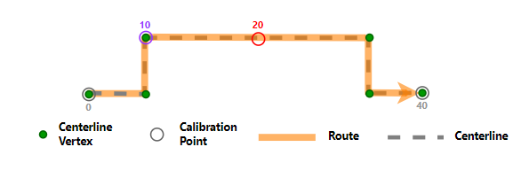
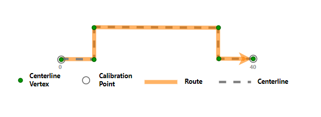

# Cartographic Realignment Options with Snap To Vertex

| Field | Value |
| --- | --- |
| **Doc** | 401 · Other · Pro |
| **Product** | Roads & Highways |
| **Release** | — |
| **Issues** | — |
| **Source** | [Snaptovertex_Cartographicrealignment_RH.docx](<https://esriis.sharepoint.com/sites/LocationReferencing/Shared%20Documents/General/Doc%20Reviews/5668_CartoRealignOptions/Snaptovertex_Cartographicrealignment_RH.docx>) |
| **People** | author Lakshmi Ananthanarayanan · PE — · dev — |
| **Edited** | 2024-03-19 20:23 by Ignacia Galvan |
| **Extracted** | 2026-09-04 · lane xmlstrip · format 3.0 · prompt v2.0.2 |
| **Keywords** | cartographic realignment · snap to vertex · calibration points · centerline · generate routes · update route measures |
| **Tools** | Generate Routes · Modify Network Calibration Rules |

## Summary

This document describes the cartographic realignment options available on the Location Referencing tab, including a new option called Snap To Vertex. It explains how calibration points behave under different realignment options and the conditions required for Snap To Vertex to function correctly. The document also clarifies the interaction with the update route measures setting during cartographic realignment.

## Related documents

<!-- related:begin -->
- [Cartographic Realignment Options in Location Referencing](<https://esriis.sharepoint.com/sites/lrsworkspace/LRS%20Doc%20Index/Other/cartographic-realignment-options-in-lr.md>) — similar text 0.72 · 3 title words · 2 filename words · same kind/surface/folder <!-- rel:402 s=7.392 -->
- [Support Snap to Vertex Option for Calibration Points Impacted by Cartographic Realignment](<https://esriis.sharepoint.com/sites/lrsworkspace/LRS Doc Index/User Stories/support-snap-to-vertex-option-for-cp-impacted.md>) — similar text 0.33 · 4 title words · same surface <!-- rel:611 s=3.637 -->
- [Support Snap, Delete, and Ignore Options for Calibration Points in Cartographic Realignment](<https://esriis.sharepoint.com/sites/lrsworkspace/LRS Doc Index/User Stories/support-snap-delete-and-ignore-options-for-cp.md>) — similar text 0.30 · 4 title words · same surface <!-- rel:729 s=3.448 -->
- [Event behavior for cartographic realignment](<https://esriis.sharepoint.com/sites/lrsworkspace/LRS Doc Index/Other/eb-for-cartographic-realignment-2024-04-2.md>) — similar text 0.22 · 2 title words · same kind/surface <!-- rel:383 s=2.988 -->
- [Event behavior for cartographic realignment](<https://esriis.sharepoint.com/sites/lrsworkspace/LRS Doc Index/Other/eb-for-cartographic-realignment-2024-04.md>) — similar text 0.23 · 2 title words · same kind/surface <!-- rel:382 s=2.858 -->
<!-- related:end -->

<!-- docs:begin -->
## Esri documentation

[Apply cartographic realignment](https://doc.esri.com/en/arcgis-pro/latest/help/production/roads-highways/apply-cartographic-realignment.html) · [Merge centerlines](https://doc.esri.com/en/arcgis-pro/latest/help/production/roads-highways/merge-centerlines.html)

_No page matched:_ [Generate Routes](https://www.google.com/search?q=%22Generate%20Routes%22+site%3Adoc.esri.com) · [Modify Network Calibration Rules](https://www.google.com/search?q=%22Modify%20Network%20Calibration%20Rules%22+site%3Adoc.esri.com)
<!-- docs:end -->

---

In
https://prodev.arcgis.com/en/pro-app/latest/help/production/roads-highways/set-cartographic-realignment-options.htm
Under the cartographic realignment options add the following as an option

Option:
Snap Tto vVertex (icon from pro)
Description:
Use this option to keep any calibration points on the cartographically realigned area snapped to the vertex of the centerline. By doing this,Setting Snap To Vertex  it will ensures that the calibration point, both before and after cartographic realignment, stays on the same vertex of the centerline.
Note:
Snap Tto vVertex option is only available only in feature services.
For this option to work as expected, the centerlines should have their vertex IDs enabled. Already eExisting centerlines associated with a network may not have their vertex IDs enabled.  To solve this, run the gGenerate rRoutes geoprocessing tool on the network.
This option will work only if the update route measures in cartographic realignment option is set as to No.
generate routes Geoprocessing tool – Provide link to generate routes GP tool.
update route measures in cartographic realignment – Provide link to update route measures in cartographic realignment.

Replace the current section under cartographic realignment as below.
Cartographic realignment options scenarios
The following scenario demonstrates the differing outcomes of a cartographic realignment for each of the four cartographic realignment options on the Location Referencing tab in the Carto-realignment group. The four options are the following:

- Proportional Snap
- Delete
- Ignore
- Snap Tto Vertex

Note:
If Update route measures in cartographic realignment is enabled for the LRS Network using the Modify Network Calibration Rules tool, the route length may change, in which case the measures are updated during cartographic realignment. If Update route measures in cartographic realignment is unavailabledisabled, the measures are not updated during cartographic realignment even if the route length changes.

For most examples in this section, The cartographic realignment options are demonstrated based on Update route measures in cartographic realignment is enabled for the LRS Network.; for the Snap To Vertex option, it is disabled.
Route1 has two intermediate calibration points at measure 10 and measure 20 that fall within the cartographic realignment section. Only calibration points in the edited section are updated using the configured option after cartographic realignment. The underlying centerline for Route1 is going to be modified as shown in the following image.

### Proportional Snap option
                       If Proportionally Snap  is the configured cartographic realignment option before the route edit, the intermediate calibration points snap proportionally to the new location of their respective measures when the route edit occurs.

### Ignore option
If Ignore  is the configured cartographic realignment option before the route edit, the intermediate calibration points do not move when the route edit occurs.

### Delete option
If Delete  is the configured cartographic realignment option before the route edit, the intermediate calibration points are deleted when the route edit occurs.

### Snap Tto Vertex option
            This is applicable only when the Uupdate route measures in cartographic realignment option is disabled (set to No)configured as ‘No’, meaning the measures are not updated during cartographic realignment even if the route length changes.
If Snap Tto vVertex (Icon) is the configured cartographic realignment option before the route edit, the intermediate calibration points snap to the vertex of the centerline when the route edit occurs.

