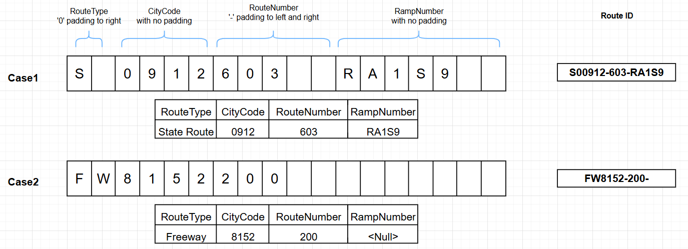
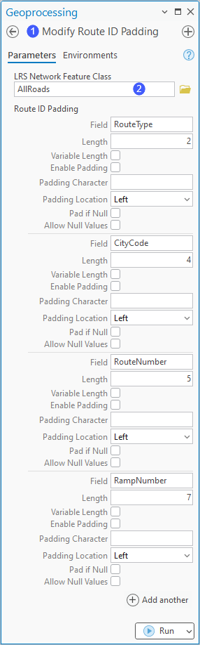
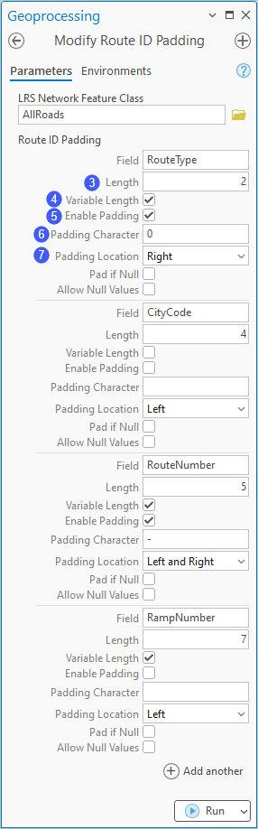
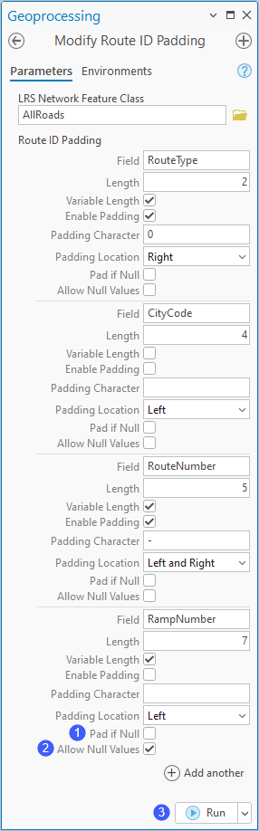
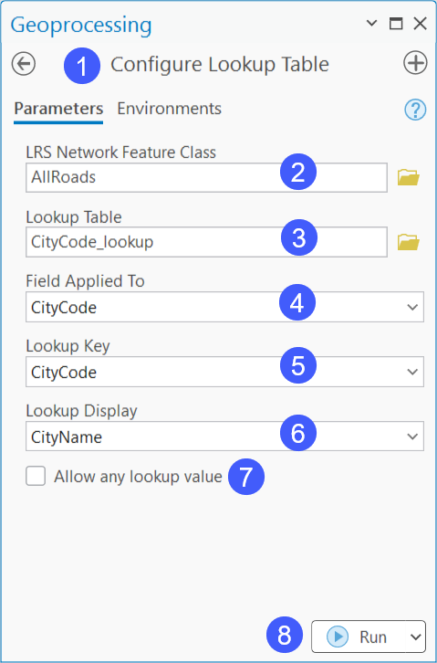

# Configure and Modify Route ID Padding and Lookup Table Settings

|   |   |
| --- | --- |
| **Kind** | Other · Pro |
| **Release** | — |
| **Product** | Roads & Highways |
| **Issue** | [ArcGISPro/ps-location-referencing#6344](https://devtopia.esri.com/ArcGISPro/ps-location-referencing/issues/6344) |
| **Source** | [6344_RH_Pro.docx](<https://esriis.sharepoint.com/sites/LocationReferencing/Shared%20Documents/General/Doc%20Reviews/Pro37_Ent121/6344_route_id_padding/6344_RH_Pro.docx>) |
| **Edited** | 2026-02-20 01:06 by Kyle Chin |
| **Extracted** | 2026-09-04 · lane `xmlstrip` |

<!-- metadata
```yaml
title: "Configure and Modify Route ID Padding and Lookup Table Settings"
source_file: "6344_RH_Pro.docx"
source_url: "https://esriis.sharepoint.com/sites/LocationReferencing/Shared%20Documents/General/Doc%20Reviews/Pro37_Ent121/6344_route_id_padding/6344_RH_Pro.docx"
doc_id: 70
doc_kind: "Other"
surface: "Pro"
doc_revision: ""
target_release: ""
pe: ""
dev: ""
author: ""
last_edited_by: "Kyle Chin"
last_edited: "2026-02-20T01:06:00Z"
extracted: 2026-09-04
extraction_lane: xmlstrip
prompt_version: "v2.0.2"
keywords: ["route id", "route id padding", "lookup table", "multifield route id", "null settings", "route creation"]
tools: ["Modify Route ID Padding", "Configure Lookup Table"]
products: ["Roads & Highways"]
issues: ["ArcGISPro/ps-location-referencing#6344"]
related: [{"doc":240,"file":"update-modify-route-id-padding-topic__doc240.md","s":4.226},{"doc":39,"file":"location-referencing-gp-error-messages__doc39.md","s":3.062},{"doc":610,"file":"support-modifying-and-deleting-lookup-table-in-an-lrs-network__doc610.md","s":2.729},{"doc":86,"file":"create-route-in-line-network-and-multifield-network-with-additional-attributes__doc86.md","s":2.285},{"doc":875,"file":"esri-roads-and-highways-tutorial__doc875.md","s":2.213}]
```
-->

## Summary

This document explains how to configure padding and null value settings for fields in a multifield route ID when creating an LRS Network. It also details the process to configure a lookup table for route ID fields to support large sets of key values, with examples for RouteType, CityCode, RouteNumber, and RampNumber fields.

## Related documents

<!-- related:begin -->
- [Update Modify Route ID Padding topic](<https://esriis.sharepoint.com/sites/lrsworkspace/LRS Doc Index/Other/update-modify-route-id-padding-topic__doc240.md>) — similar text 0.31 · 3 title words · same kind/surface <!-- rel:240 -->
- [Location Referencing GP Error Messages](<https://esriis.sharepoint.com/sites/lrsworkspace/LRS%20Doc%20Index/Other/location-referencing-gp-error-messages__doc39.md>) — similar text 0.21 · same kind/surface <!-- rel:39 -->
- [Support Modifying and Deleting Lookup Table in an LRS Network](<https://esriis.sharepoint.com/sites/lrsworkspace/LRS Doc Index/User Stories/support-modifying-and-deleting-lookup-table-in-an-lrs-network__doc610.md>) — similar text 0.19 · 2 title words · same surface <!-- rel:610 -->
- [Create Route in Line Network and Multifield Network with Additional Attributes Pro AI Assistant Test Plan](<https://esriis.sharepoint.com/sites/lrsworkspace/LRS Doc Index/Test Plans/create-route-in-line-network-and-multifield-network-with-additional-attributes__doc86.md>) — similar text 0.06 · 1 title word · same surface <!-- rel:86 -->
- [Esri Roads and Highways Tutorial](<https://esriis.sharepoint.com/sites/lrsworkspace/LRS Doc Index/Other/esri-roads-and-highways-tutorial__doc875.md>) — similar text 0.13 · same kind/surface <!-- rel:875 -->
<!-- related:end -->

<!-- docs:begin -->
## Esri documentation

_No page matched:_ [Modify Route ID Padding](https://www.google.com/search?q=%22Modify%20Route%20ID%20Padding%22+site%3Adoc.esri.com) · [Configure Lookup Table](https://www.google.com/search?q=%22Configure%20Lookup%20Table%22+site%3Adoc.esri.com)
<!-- docs:end -->

---

## Configure and modify rRoute ID padding and lookup table settings
When creating an LRS Network (https://prodev.arcgis.com/en/pro-app/latest/help/production/roads-highways/create-and-modify-an-lrs-network.htm), yYou can add padding and allow null valuerecords for each field that is part of a multifield (concatenated) route ID. in the route identifier whenever you create an LRS Network (link to https://prodev.arcgis.com/en/pro-app/latest/help/production/roads-highways/create-and-modify-an-lrs-network.htm). This workflow option is especially useful if external business systems utilize need to adhere to a specific rRoute ID definition and are not able to change.
Additionally, a lookup table of key values can be configured for any fields that are a part of the a concatenatedmultifield  rRoute ID.
In the image example below, a route ID is configured with four fields: RouteType, CityCode, RouteNumber, and RampNumber. Sample padding, null settings, and lookup table for the four fields are as follows:

- RouteType is a text field with a length of 2 and has a coded -value domain configured. The maximum number of characters in the domain values is two. However, some routes may only have a domain value that comprisesis one character, and a zero (0) is used as a padding character to the right.
- CityCode is a text field with a length of 4 and has a lookup table configured to allow you the user to search for the key value using a display field. Since all the CityCode values have a length of 4 in the lookup table, no padding is needed for this field.
- RouteNumber is a short field type. The field will have values ranging from 0 to 99999. A hyphen is used as a padding character to both the left and right.
- RampNumber is a text field with a length of 7. Some routes may not have all the 7 characters entered for this field. Some other routes will not have a value for this field and must be left blank, so no padding is needed for this field.

### Configure rRoute ID pPadding
The following are supported for eEach field that makes upin a multifield the rRoute ID can:
- Can have the maximum length shortened,
- Can be of variable or fixed length,
- Hhave padding characters added to the left, or right side, or to both sides, and
- Hhave padding added to an empty field.
Tip:
These settings are used duringimpact route loading, route creation, and route editing. when using Roads and Highways editing activities, such as creating routes.
The following section illustrates the Route ID Padding configuration for the example above.
To configure route ID padding, complete the following steps:
Note:
The following steps pertain to the image example above.

- In ArcGIS Pro, open the Modify Route ID Padding tool (https://prodev.arcgis.com/en/pro-app/latest/tool-reference/location-referencing/modify-route-id-padding.htm).
- Click the LRS Network Feature Class drop-down arrow and cChoose the an LRS Nnetwork feature class with fields for padding that need to be modified.
The Route ID fields that make up the route ID automatically populate the Route ID Padding parameter the tool.

- For each field, dDetermine the maximum number of characters any route in your LRS Nnetwork will use for each field and set the Llength value to at least that valuenumber.
The default Length valuefield defaults to is the length of the field in the geodatabase. The range for the field can be any number between 1 and the default. The Length value can be set to any number between 1 and the default value. Enter a value that is the maximum number of characters that field can contain in Roads and Highways.
For this example, the Llength values remain the same as the length of the field for all four fields.

- Note:
- Changing the Llength value only affectschanges the maximum number of characters  expected by Roads and Highways toolsexpects for each column fieldas part of a route in the network. Your data should still be modeled within your geodatabase with tThe RouteID field length being the sum of the lengths of the fields that make up composing the concatenated multifield rRoute ID must not exceed the length of the route ID field in the geodatabase.
- Choose whether the field will be Variable Length.Specify whether the Length value is a variable or fixed value by checking or unchecking the Variable Length check box.
If the field will always be populated with the number of characters specified selected in the Llength text box field in step 32, keep uncheck the Variable Length check box unchecked. This ensures that the number of characters in the Llength text box field is required fixed forin routes that are being loaded or created. in Roads and Highways.
If the field will have a variable number of characters, check the Variable Length check box. This allows for the number of characters in the field to range from 1 to the number selected specified in the Llength text box field in step 32 for routes that are being loaded or created. in Roads and Highways.
For this example, all fields except CityCode, which will always have 4 characters, are configured with Variable Length.
For this example, the RampNumber field is configured with variable length.

- Note:
- Having multiple fields that are variable length can result in duplicate route IDs composed of different values in the concatenated fields being loaded or created.
- Check the Enable Padding check box if you want to enable padding for the field.
For this example, padding is enabled for the RouteType and RouteNumber fields is enabled.

- Optionally, Choose specify a your pPadding cCharacter in the Padding Character text box.
- The default padding character is a space, but it can beThe padding character can be a number , space, or another character.
- Click the Padding Location drop-down arrow and select choose an option for the field.
- Padding can be added to the left, right, or both left and right of the characters value in the field.
- For this example, RouteType has a zero (0) as the padding character to the right, and RouteNumber has a hyphen as the padding character to both the left and right.
- Route ID padding is configured.

### Configure nNull sSettings
A null value can be used in for one or more of the fields that are part of in a concatenated multifield rRoute ID.
The following section illustrates the null settings for the RampNumber field in the example above.
To configure null route ID padding, complete the following steps:
Note:
The following steps pertain to the RampNumber field in the image example above.

- CCheck the Pad iIf Nullo Value Provided check box to add padding characters to the portion for that field within the RouteID and have a null value placed in the field.
when the field has a null value.

- For this example, this check box option remains unchecked for all the fields.
- Note:
- The Allow Null Values check box is automatically checked if you check the Pad If No Value Provided check box.
- Check the Allow Null Values check box if you want to supportto allow null values in the field.
For this example, null values areis allowed for the RampNumber field.

- Note:
- -The Allow Null Values check box must be checked if the Pad if Null check box is checked.
- -If you allow null values in a field, all fields to the right of that field must also allow null values. However, if you also check the Pad If No Value Provided ull check box, fields to the right do not needhave to allow null values.
- Click Run to execute run the tool.

Null settings are configured.

### Configure a lookup table
You can cConfigures a lookup table for one or more fields used in a multifield multifield route ID.
A lookup table is an alternative to using coded value domains when a field that makes up a multifield route ID has several hundred or thousands of potential values, for example, a list of street names or a Geographic Names Information System (GNIS) code. The lookup table is used primarily when creating a route (https://prodev.arcgis.com/en/pro-app/3.5/help/production/roads-highways/create-a-new-route.htm).
The following section illustrates the lookup table configuration for the CityCode field in the example above.
To configure a lookup table, complete the following steps:
Note:
The following steps pertain to the CityCode field in the image example above.

- In ArcGIS Pro, open the Configure Lookup Table tool (https://prodev.arcgis.com/en/pro-app/latest/tool-reference/location-referencing/configure-lookup-table.htm).
- Click the LRS Network Feature Class drop-down arrow and cChoose the an LRS Nnetwork feature class .you want to modify.
- Click the Lookup Table drop-down arrow and cChoose the a Lookup table. from the location in your geodatabase where the table is located.
- Note:
- -If the your lookup table is in an multiuserenterprise geodatabase, the tableit should must be nonunversioned.
- -Only one lookup table can be configured per LRS Network.
- Choose a field from the Click the Field Applied To parameter drop-down arrow and choose a route ID field in the LRS Network that the lookup table is configured formenu. Only fields that are part of the multifield route ID are displayed in the drop-down options. The drop-down displays only those fields that are part of a multifield route ID for the chosen LRS Network Feature Class.
For this example, the lookup table is configured for the CityCode field.

- 5. Select Click the Lookup Key drop-down arrow and choose a key field in the look up table. from the Lookup Key drop-down menu.
- Note:
- -The Lookup Key value will be saved in the geodatabase for both the field and as part of the concatenated RouteID.
-The Lookup Key parameter drop-down options display only the fields from the lookup table that have the same field type and a length less than or equal to the route field specified in the Field Applied To drop-down options. The only options that appear in the list will be the same field type with a length less than or equal to the route field selected in the Field Applied To parameter drop-down menu.

- (6) Optionally, click the Lookup Display drop-down arrow and choose Select a field that contains descriptions of the  lookup keys.
Tip:
When creating a route using the Create Route tool, the lookup display value appears in a text box next to the corresponding field under the Route ID Attributes section.

- field from the Lookup Display drop-down menu.
For this example, both lLookup kKey and lLookup dDisplay fields are configured.

- Note:
- -The Lookup Display parameter is required if the Allow any lookup value check box is unchecked.
- The Lookup Display Field is optional. If you want to allow a lookup value that is not in the table, do not configure a Lookup Display Field value.
- -The lLookup kKey and lLookup dDisplay fields can be the same or different fields in the lookup table.
- (7) Optionally, cCheck the Allow aAny lLookup vValue check box to allow a value not present in the lookup table for the field in the concatenated RouteID. allow a value that is not in the lookup table to be added when creating a route.

For this example, the Allow aAny lLookup vValue check box remains unchecked.

- Note:
- If you check the Allow Any Lookup Value check box, you can't configure a Lookup Display Field value.The Lookup Display parameter is not available if the Allow any lookup value check box is checked.
- 8. Click Run to execute run the tool.

Note:
Repeat the steps above if you need to configure lookup tables for multiple fields in your the LRS Nnetwork.

- The lookup table is configured.

    
