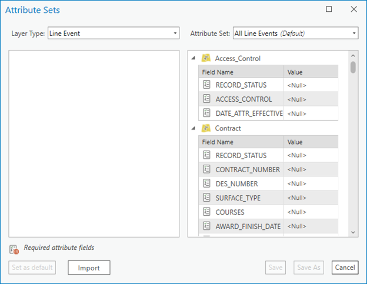
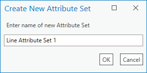
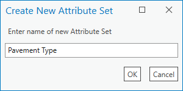
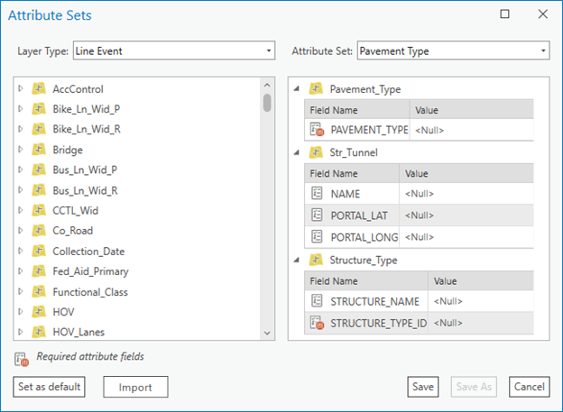
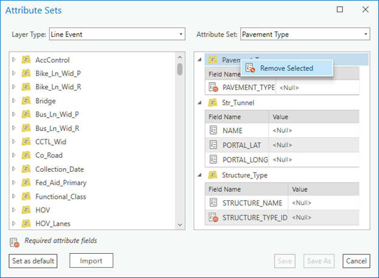

# Configure Attribute Sets

| Field | Value |
| --- | --- |
| **Doc** | 555 · Other · Pro |
| **Product** | Roads & Highways |
| **Release** | — |
| **Issues** | — |
| **Source** | [RH_Proattset.docx](<https://esriis.sharepoint.com/sites/LocationReferencing/Shared%20Documents/General/Doc%20Reviews/5102_AttributeSetsInCIM/RH_Proattset.docx>) |
| **People** | author — · PE — · dev — |
| **Edited** | 2023-06-07 16:36 by Claire Wang |
| **Extracted** | 2026-09-04 · lane xmlstrip · format 3.0 · prompt v2.0.2 |
| **Keywords** | attribute set · event layer · point event · line event · enterprise geodatabase · feature service · default values |
| **Tools** | Add Multiple Point Events · Add Multiple Line Events · Attribute Sets |

## Summary

This document explains how to configure attribute sets in ArcGIS Pro for event layers in an LRS-enabled dataset. It covers creating, editing, saving, importing, and publishing attribute sets for point and line events, and how these sets are used by editors in feature services.

## Related documents

<!-- related:begin -->
- [Configure Attribute Sets](<https://esriis.sharepoint.com/sites/lrsworkspace/LRS%20Doc%20Index/Other/configure-attribute-sets-apr.md>) — similar text 0.86 · 3 title words · 1 filename word · same kind/surface/folder <!-- rel:556 s=8.325 -->
- [Producing Attribute Sets](<https://esriis.sharepoint.com/sites/lrsworkspace/LRS Doc Index/Other/producing-attribute-sets-apr.md>) — similar text 0.36 · 2 title words · same kind/folder <!-- rel:552 s=3.671 -->
- [Configuring Attribute Sets](<https://esriis.sharepoint.com/sites/lrsworkspace/LRS Doc Index/Other/configuring-attribute-sets-rh.md>) — similar text 0.38 · 2 title words · same kind/folder <!-- rel:553 s=3.3 -->
- [Configuring Attribute Sets](<https://esriis.sharepoint.com/sites/lrsworkspace/LRS Doc Index/Other/configuring-attribute-sets-apr.md>) — similar text 0.38 · 2 title words · same kind/folder <!-- rel:554 s=3.294 -->
- [Producing Attribute Sets](<https://esriis.sharepoint.com/sites/lrsworkspace/LRS Doc Index/Other/producing-attribute-sets-rh.md>) — similar text 0.37 · 2 title words · same kind/folder <!-- rel:551 s=3.249 -->
<!-- related:end -->

<!-- docs:begin -->
## Esri documentation

[Add multiple point events](https://doc.esri.com/en/arcgis-pro/latest/help/production/roads-highways/add-multiple-point-events.html) · [Add multiple line events](https://doc.esri.com/en/arcgis-pro/latest/help/production/location-referencing-pipelines/add-multiple-line-events.html) · [Edit feature services](https://doc.esri.com/en/arcgis-pro/latest/help/production/roads-highways/edit-feature-services.html)

_No page matched:_ [Attribute Sets](https://www.google.com/search?q=%22Attribute%20Sets%22+site%3Adoc.esri.com)
<!-- docs:end -->

---

## Configure attribute sets
Attribute sets are a collection of event layer attributes you can use to create multiple events with a set of additional, organization-specific attributes in a single edit.
Attribute sets are created using event features in an LRS-enabled dataset. All point and line event layers included in the map are configurable as attribute sets. Each editable, non-LRS schema field in an event layer can be added to an attribute set. You can create a unique attribute set for characteristic data such as Pavement Type and Speed Limit.
Attribute sets can be published to feature service and made ready to use for editors. To publish attribute sets to service, one must configure attribute sets in an enterprise geodatabase and save them into the map before publishing (for more information about Map CIM, see this page). When publishing the map, all attribute sets are brought to service along with the data in the map.

### Configure an attribute set
Attribute sets are helpful when you're adding multiple point events or adding multiple line events in one edit. Pre-configuring and publishing attribute sets to service can benefit editors by reducing their workload and increasing their efficiency.
The enterprise geodatabase administrator can create an attribute set that can be accessed by an editor who is going to use the Add Multiple Point Events tool  or Add Multiple Line Events tool . Attributes in an attribute set can be configured with default values.

1. In ArcGIS Pro, open the map that contains the LRS dataset whose event layers from an enterprise geodatabase will define an attribute set.

1. Click the Location Referencing tab, and in the Events group, click the Attribute Sets button .

- The Attribute Sets dialog box appears with the line event default attribute set visible.
- There are attribute sets for both point events and line events that contain events and their attribute fields. These attribute sets are the default values for the currently geodatabase administrator. You can designate a different attribute set as the default attribute set after saving at least one custom attribute set. In the following image, all of the line event layers in the project are included in the All Line Events attribute set.
- If a field has a default value, it is shown when the attribute set that includes that field is selected on the Attribute Sets dialog box. Double-click a default value in the Value column to change its value. Values that are updated on the Attribute Sets dialog box can overwrite the default value set in the database.
- When one or more layers in an attribute set are not present in the feature service, the warning icon  appears next to the name of the attribute set on the Attribute Sets dialog box.
- To create an attribute set for a point event layer type, click the Layer Type drop-down arrow and choose Point Event.
- Note:
- An attribute set can contain either point events or line events; it cannot contain both.

1.  Click the Attribute Set drop-down arrow and choose Create New Attribute Set to create an attribute set based on the selected layer type.

- The Create New Attribute Set dialog box appears.
- A default name is provided based on the selected layer type.

1. Optionally, provide a different name for the new attribute set.

- For example, type Pavement Type.

1. Click OK.

- The newly created attribute set appears on the Attribute Set dialog box with all of the line event layers in the feature service listed.

1. Drag any layer of the layer column to the list on the right to define it as part of an attribute set.

- Alternatively, right-click an event layer on the left and choose Add Selected to add it to the attribute set.
- In the above image, the Pavement Type event and other line event layers are added to the attribute set.
- Note:
- Some event attributes are required fields. If you attempt to add attributes from an event layer that includes required fields, the required attributes are automatically added to the attribute set.
- Highlight and right-click an event layer in the attribute set and choose Remove Selected to move it back to the available event layers list on the left.
- Alternatively, drag items from the right side of the dialog box to the left to remove them from the attribute set.

1.  When you're finished adding attributes and providing values in the attribute set, click Save.

- Saved attribute sets are stored in the map.
- Tip:
- To remove an attribute set from the Attribute Set dialog box, click the remove button next to an attribute set in the drop-down.

1. To import a shared attribute set RHAS file, click Import in the Attribute Set dialog box. This will open the Attribute Set Folder Location. You can also browse to other locations if the attribute set RHAS file is not in the default location. Click the attribute set RHAS file and click OK to import it to the map.
Importing an attribute set RHAS file automatically saves it as an attribute set in the map.

1. Optionally, click the Set as default button to make a customized attribute set the default for the map.

1. Click Close  to close the Attribute Sets dialog box.
Attribute sets in feature service
After attribute sets in the map are published into a service, any feature service editor with access to the service can directly use any attribute set that is read from the service. The editor cannot edit or remove an attribute set that is from the service, though.

1. In ArcGIS Pro, open an LRS feature service that has published attribute sets in a map.

1. Click the Location Referencing tab, and in the Events group, click the Attribute Sets button .

- The Attribute Sets dialog box appears with the line event default attribute set visible.
- Expand the Attribute Sets dropdown to view all the available attribute sets in the map.
- You will see a list of Attribute Sets that are read from service and read from the Attribute Set Folder Location, if there is any.
- The attribute sets that are read from service are not removable from the Attribute Set dialog box nor from the service. In addition, editors cannot update layers or values and then save the update, and this is indicated by the greyed out Save button.
- Tip:
- To update an attribute set that is read from service and use the updated attribute set to add events, click the Save As button after the update. This will save the updated attribute set as an RHAS file in the specified Attribute Set Folder Location. The original attribute set from service remains unchanged.
- To remove an attribute set in service, the enterprise geodatabase administrator needs to remove it from the map that is used for publishing, and republish the map.
- The attribute sets that are read from the Attribute Set Folder Location, if any, are editable. Editors can update event layers and values in these RHAS attribute sets and save the update to the original RHAS file.
- Tip:
- The editor can also save the updated RHAS attribute set as a new RHAS attribute set.
- To remove an RHAS attribute set from the Attribute Set dialog box, delete it from the Attribute Set Folder Location.
- When one or more layers in an attribute set are not present in the map, the warning icon  appears next to the name of the attribute set on the Attribute Sets dialog box.

1. To import a shared attribute set RHAS file, click Import in the Attribute Set dialog box. This will open the Attribute Set Folder Location. You can also browse to other locations if the attribute set RHAS file is not in the default location. Click the attribute set RHAS file and click OK to import it to the map.
The imported attribute set RHAS file will appear in the Attribute Sets dropdown, but will not be saved in service.

1. Optionally, click the Set as default button to make a customized attribute set the default for the map.

1. Click Close  to close the Attribute Sets dialog box.

