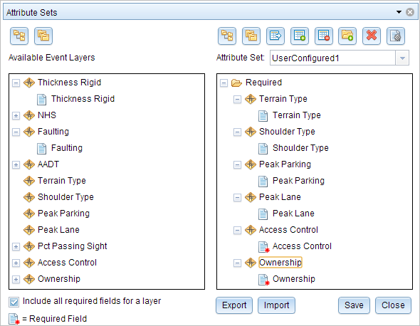
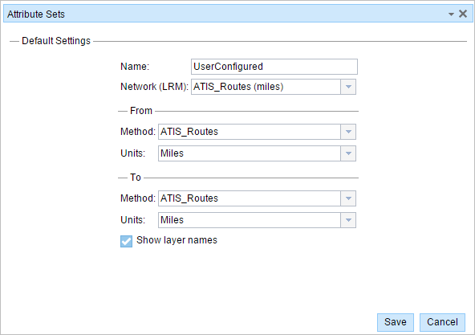

# Configuring Attribute Sets

| Field | Value |
| --- | --- |
| **Doc** | 553 · Other · Experience Builder |
| **Product** | Roads & Highways |
| **Release** | — |
| **Issues** | — |
| **Source** | [RH_EEattset_configure.docx](<https://esriis.sharepoint.com/sites/LocationReferencing/Shared%20Documents/General/Doc%20Reviews/5102_AttributeSetsInCIM/RH_EEattset_configure.docx>) |
| **People** | author — · PE — · dev — |
| **Edited** | 2023-06-07 17:49 by Claire Wang |
| **Extracted** | 2026-09-04 · lane xmlstrip · format 3.0 · prompt v2.0.2 |
| **Keywords** | attribute set · linear event · event editing · measure method · event layer · Add Linear Events widget · event attribute |
| **Tools** | Add Linear Events |

## Summary

This document explains how to configure attribute sets in the ArcGIS Event Editor for linear event layers. It covers creating, modifying, importing, and managing attribute sets to streamline event editing workflows by grouping related event fields and setting default measure methods. The document also describes the user interface elements and steps to customize attribute sets for different data collection and referencing scenarios.

## Related documents

<!-- related:begin -->
- [Configuring Attribute Sets](<https://esriis.sharepoint.com/sites/lrsworkspace/LRS Doc Index/Other/configuring-attribute-sets-apr.md>) — similar text 0.81 · 3 title words · 2 filename words · same kind/surface/folder <!-- rel:554 s=7.007 -->
- [Producing Attribute Sets](<https://esriis.sharepoint.com/sites/lrsworkspace/LRS Doc Index/Other/producing-attribute-sets-rh.md>) — similar text 0.60 · 2 title words · 1 filename word · same kind/surface/folder <!-- rel:551 s=5.198 -->
- [Producing Attribute Sets](<https://esriis.sharepoint.com/sites/lrsworkspace/LRS Doc Index/Other/producing-attribute-sets-apr.md>) — similar text 0.59 · 2 title words · 1 filename word · same kind/folder <!-- rel:552 s=4.674 -->
- [Configure Attribute Sets](<https://esriis.sharepoint.com/sites/lrsworkspace/LRS Doc Index/Other/configure-attribute-sets-rh.md>) — similar text 0.38 · 2 title words · same kind/folder <!-- rel:555 s=3.3 -->
- [Configure Attribute Sets](<https://esriis.sharepoint.com/sites/lrsworkspace/LRS%20Doc%20Index/Other/configure-attribute-sets-apr.md>) — similar text 0.37 · 2 title words · same kind/folder <!-- rel:556 s=3.255 -->
<!-- related:end -->

<!-- docs:begin -->
## Esri documentation

[Event editing using the attribute table](https://doc.esri.com/en/arcgis-pro/latest/help/production/roads-highways/event-editing-using-the-attribute-table.html)

_No page matched:_ [Add Linear Events](https://www.google.com/search?q=%22Add%20Linear%20Events%22+site%3Adoc.esri.com)
<!-- docs:end -->

---

## Configuring attribute sets
Attribute sets are a collection of linear event layer columns that can be edited as a logic group. The configuration of attribute sets provides flexibility to divide your event editing workflows by responsible party and the way data is collected and referenced.
For example, your pavement type, number of lanes, and median information may be collected from printed engineering drawings and referenced by engineering station measures. In this case, you can configure an attribute set for pavement type, number of lanes, and medians with the default location method as stationing. When you use the Add Linear Event widget to add data from an attribute set, the dialog box is autoconfigured with the designated settings for measures and columns to edit, streamlining your workflow.
In contrast, you may collect functional class, ownership, and speed limit from a Microsoft Excel file provided from a different group in which the data provided is located by route and mile point measure. You can create another attribute set for functional class, ownership, and speed limit with the default location method as your mile point network.
You may want to have different attribute sets to separate event layers to delegate editing responsibility between users or business units. You can create an attribute set for characteristic data such as access control, terrain type, or grade for the user or group of users who edit that data. You can create a separate attribute set for event layers that represent pavement characteristics for the user or set of users who edit that data.
Attribute sets are used to create a set or group of event column fields, from one or more event layers, which you can use to add records in the Add Linear Events widget in ArcGIS Event Editor. Each editable field in an event layer is present in the Available Event Layers list, which can be added to a group in the right pane. In addition, some default configurations for the attribute set can be provided—such as the default from measure method, from unit of measure, to measure method, and to unit of measure—that drive measure settings in the Add Linear Events widget. The Show Layer Names setting drives the layer name visibility in the Add Linear Events widget. The administrator can provide preconfigured attribute sets, or you can create your own attribute set using the steps outlined below.
Learn more about producing attribute sets and adding linear events by route and measure.

| Button | Name | Description |
| --- | --- | --- |
|  | Expand All | Shows all the attribute fields present in each event layer. |
|  | Collapse All | Hides the attribute fields to show only the event layers. |
|  | Copy Selected Attribute Set | Copies all the attribute fields present in an event from the left panel to the attribute group in the right panel. The copy is made permanent only when you click the Save button. |
|  | New Attribute Set | Creates an attribute set. The attribute sets created by using this button are saved in the browser. Therefore, these attribute sets are available only to the user's browser. |
|  | Remove Selected Attribute Set | Removes the selected attribute set from the widget. The administrator-configured attribute sets cannot be removed using this button. |
|  | New Group | Creates a group in the right panel. A group contains event attribute fields. An attribute set is made up of one or more groups. The group is saved permanently by clicking the Save button. |
|  | Remove Selected Group, Layer, or Attribute | Removes a selected group, layer, or attribute from the right panel. The removal is made permanent by clicking the Save button. |
|  | Default Settings | Allows configuration of default settings for attribute sets. These settings include the default network, from method, from measure units, to method, and to measure units for the Add Linear Events widget. |

- Note:
- You cannot modify or remove a preconfigured attribute set that is read from service or from the attributeSets folder in Event Editor folder. You can modify or remove an attribute set that is stored in the web browser for local access or imported from an .rhas file.

### Modifying a preconfigured attribute set
A new attribute set can be created from a preconfigured one that is read from service.
You can access a preconfigured attribute set and create new attribute sets by opening a web browser and browsing to Event Editor.

1. Click the Edit tab.

1.  In the Edit Events group, click the Modify Attribute Sets button .

- The Attribute Sets dialog box appears.
- The current attribute set appears in the window.

1.  To create an attribute set, click the New Attribute Set button .

- The Default Settings dialog box appears.

1. Choose the default Network, From Method, From Units, To Method, To Units, and Show layer names values, and click Save.

- The Attribute Sets dialog box appears.
- Note:
- To make changes to the default settings once they've been saved, click the Default Settings button  and change the settings.

1.  Click the New Group button  and type the name of a group.

- This new group will be part of the new attribute set.

1.  From the Available Event Layers list, drag a required event field to the group on the right.

1.  Add more event fields to the group.

1.  When you're finished adding attributes to the attribute set, click Save. This will save the new attribute set into the local browser storage, but not service. Saving a newly created attribute set does not change preconfigured attribute sets in service either.

- You can create a copy of existing attribute sets by clicking the Copy Selected Attribute Set button .

1.  Click Close.

- Now the current attribute set is UserConfigured2. You can also select the preconfigured attribute set (named Default) from the Attribute Set drop-down list in the upper right.

1.  On the Edit ribbon, in the Edit Events group, click Add Linear Events.

- The UserConfigured2 attribute set default settings and attributes appear and can now be used to add linear events by using the widget.
- Learn more about the Add Linear Events widget

### Import attribute sets
Alternatively, you can use the following steps to import attribute sets shared with you by other users:

1. Open a web browser and browse to Event Editor. On the Edit tab, in the Edit Events group, click the Modify Attribute Sets button .

1. Click Import and browse to the location of your ArcGIS Roads and Highways attribute set .rhas file.

1. Click Open to import your file.

- Learn more about exporting an .rhas file
- The imported attribute set is loaded into the Attribute Sets dialog box. You can modify the attribute set by following the steps outlined above.

1. Click Save.

- https://enterprise.arcgis.com/en/ \h Home
- Portal
- Server
- Data Stores
- Cloud
- Apps
- Documentation

###### ArcGIS

- ArcGIS Online
- ArcGIS Pro
- ArcGIS Enterprise
- ArcGIS
- ArcGIS Developer
- ArcGIS Solutions
- ArcGIS Marketplace

###### About Esri

- About Us
- Careers
- Esri Blog
- User Conference
- Developer Summit

Copyright © 2022 Esri. All rights reserved. | Privacy | Manage Cookies | Legal

