# Create a template for an LRS feature count data product

| Field | Value |
| --- | --- |
| **Doc** | 198 · Other · Pro |
| **Product** | Pipeline Referencing |
| **Release** | — |
| **Issues** | — |
| **Source** | [APR_Template_FeatureCount_APR_RR1.docx](<https://esriis.sharepoint.com/sites/LocationReferencing/Shared%20Documents/General/Doc%20Reviews/Pro35_Ent115/6353_FeatureCount_Data_Product_Template/APR_Template_FeatureCount_APR_RR1.docx>) |
| **People** | author Rahul Rakshit · PE — · dev — |
| **Edited** | 2025-03-15 22:04 by unknown |
| **Extracted** | 2026-09-04 · lane xmlstrip · format 3.0 · prompt v2.0.2 |
| **Keywords** | feature count · data product · template · route identifier · summary fields · feature count layer · pipeline crossings · ili anomalies · casing material |
| **Tools** | Data Product Designer · Generate LRS Data Product |

## Summary

Describes the process to create a template for an LRS feature count data product using the Data Product Designer in ArcGIS Pro. The template counts line events, point events, and intersections per route, with configuration options for summary fields, route identifier, and feature count layers using single or unique value selection methods. The template is used by the Generate LRS Data Product geoprocessing tool to produce feature count datasets for planning and maintenance.

## Related documents

<!-- related:begin -->
- [Create a template for an LRS feature count data product](<https://esriis.sharepoint.com/sites/lrsworkspace/LRS Doc Index/Other/create-a-template-for-an-lrs-feature-count-data-product-rh.md>) — similar text 0.62 · 4 title words · 2 filename words · same kind/surface/folder <!-- rel:196 s=8.184 -->
- [LRS Data Template: Create a template feature count](<https://esriis.sharepoint.com/sites/lrsworkspace/LRS Doc Index/User Stories/lrs-data-template-create-a-template-feature-count.md>) — similar text 0.19 · 3 title words · 2 filename words · same surface <!-- rel:258 s=4.571 -->
- [Feature Count Template Test Plan](<https://esriis.sharepoint.com/sites/lrsworkspace/LRS Doc Index/Test Plans/feature-count-template.md>) — similar text 0.23 · 2 title words · 2 filename words · same surface <!-- rel:254 s=4.462 -->
- [Create a template for an LRS route log data product](<https://esriis.sharepoint.com/sites/lrsworkspace/LRS Doc Index/Other/create-a-template-for-an-lrs-route-log-data-product-apr-un.md>) — similar text 0.33 · 2 title words · 1 filename word · same kind/surface <!-- rel:201 s=4.4 -->
- [Generate LRS Feature Count (Location Referencing)](<https://esriis.sharepoint.com/sites/lrsworkspace/LRS Doc Index/Other/6749-generate-lrs-feature-count-lr.md>) — similar text 0.14 · 2 title words · 1 filename word · same kind/surface <!-- rel:147 s=4.291 -->
<!-- related:end -->

<!-- docs:begin -->
## Esri documentation

[Create a template for an LRS feature count data product](https://doc.esri.com/en/arcgis-pro/latest/help/production/roads-highways/create-a-template-for-an-lrs-feature-count-data-product.html) · [LRS data products](https://doc.esri.com/en/arcgis-pro/latest/help/production/roads-highways/lrs-data-products.html) · [Create a template for an LRS length data product](https://doc.esri.com/en/arcgis-pro/latest/help/production/roads-highways/create-a-template-for-an-lrs-length-data-product.html)

_No page matched:_ [Data Product Designer](https://www.google.com/search?q=%22Data%20Product%20Designer%22+site%3Adoc.esri.com) · [Generate LRS Data Product](https://www.google.com/search?q=%22Generate%20LRS%20Data%20Product%22+site%3Adoc.esri.com)
<!-- docs:end -->

---

## Create a template for an LRS feature count data product
An LRS feature count data product provides the information on the number of line events, point events and intersections per route. You can find the number of pipeline crossings on a route or the number of ILI anomalies along a route that is part of a pipeline. This type of information can be useful for planning and maintenance purposes.

A sample feature count dataset is produced for Pipe1 and Pipe2 as shown below.

Figure  SEQ Figure \* ARABIC 1. Feature count for Pipe1
Pipe1 includes two routes RouteX and RouteY and the table below shows the distribution of Pipeline Crossings, ILI Anomalies and Pipeline Casing Material type per route.

| Line Name | Route Name | Pipeline Crossings | ILI Anomalies | Steel Casing | Concrete Casing | PVC Casing |
| --- | --- | --- | --- | --- | --- | --- |
| Pipe1 | RouteX | 1 | 3 | 1 | 1 | 0 |
| Pipe1 | RouteY | 1 | 2 | 0 | 0 | 1 |

Figure  SEQ Figure \* ARABIC 2. Feature count table for Pipe1
To produce this data product, you must first develop an LRS data template using the Data Product Designer. The template is then utilized by the Generate LRS Data Product geoprocessing tool.
The workflow below uses the Data Product Designer to create a template to produce an LRS feature count data product like the one shown in the table above.

### Choose an LRS data product type
Complete the following steps to choose a data product type.

Figure  SEQ Figure \* ARABIC 3 Selecting the Data Product type

1. Start ArcGIS Pro and open a project with LRS data in the map.

1. On the Location Referencing tab, in the LRS Data Products group, click Data Product Designer .
The Choose an LRS data product type pane of the Data Product Designer appears.

1. Click the Data Product Type drop-down arrow and choose Feature Count.

1. Click Next.
The Set template properties pane appears.

### Set template properties
Once specified, you can provide template properties for the product type.
To set the template properties, complete the following steps:

1. Provide a template name or browse to a location, provide a name for the template, and click OK.
By default, the template is saved in the project folder.

1. Click the Network drop-down arrow and choose a network.
Route characteristics will be provided for this network when the Generate LRS Data Product
geoprocessing tool is run with the template.

1. Optionally, provide a description.

Figure  SEQ Figure \* ARABIC 4 Setting up template properties

### Set template summary fields
The next step is to select a summary layer and summary fields. A feature count can be based on unique values in the summary layer at a per route basis. You can configure multiple summary layers. The summary layers are arranged and divided by levels based on their spatial relationships.
For example, you can configure a county boundary layer as level one, and a city boundary layer as level two.
This is optional. If you don't want to add summary fields to the template, click Next to proceed.
To set the template summary fields, complete the following steps:

1. Click Add to add a summary level.

1. Click the Summary Layer drop-down arrow and choose a summary layer.
This layer can be a polygon feature class, or a line event registered to the network specified in the second pane. This layer must be in the same geodatabase and have the same projection as the specified network.

1. Click the Field drop-down arrow and choose a summary field.

1. Once a summary field is chosen, the Display Value Map section shows the unique values in the summary field. You can edit the Display Value column in the table.

1. Provide a name for the summary level in the Name in Table text box.

1. Optionally, click the Filter Expression drop-down arrow and provide an expression to filter display values in the Display Value Map section.

1. If you're adding multiple summary levels, repeat the previous steps for each level.

1. Click Next.

The Select route identifier field pane appears.

### Set the route identifier field
The next step to produce an LRS feature count data template is to add a route identifier field. The route identifier can be a Route Name or Route ID.
This example uses Route Name as the network's route identifier field.

Figure 5. Selecting the route identifier field
To select the route identifier field, complete the following steps:

1. Click the Route Identifier drop-down arrow and choose a field.
This defaults to the selected network’s Route ID field if it is a non-line network, or Route Name if it is a line network.
If the selected network contains both Route ID and Route Name, you can choose between the two using the drop-down arrow.

1. Optionally, update the display name in the Name in Table text box.
This is the Route Identifier value by default.
Setting the route identifier field ensures that the feature count data product generated using this template will include the field for route information.

1. Optionally, click Preview to review the information in a canvas.

  - Note:
  - If the chosen network is a line network, a Line Name column appears in the feature count table next to the route identifier field.

Figure 6 Preview after adding the Route Identifier field

1. Click Next.
The Add feature count layer pane appears.

### Add feature count layers
The LRS feature count data product counts line events, point events and intersections on a per route basis.
There are two options to configure the feature count fields: Single Value and Unique Values. You can configure the feature count fields one by one using the Single Value option and applying a filter to create categories, or you can use the Unique Values option to configure all the unique values needed as feature count fields in the output.
For this example, Single Value is used to configure the Pipeline Crossing as a count field using the following steps:

1. Click Add to create a blank row in the Feature Count Fields table.

1. Click the Layer drop-down arrow and choose a feature count layer.
This layer must be stored in the same geodatabase or feature service and have the same projection as the specified network.
The first feature count layer configured in the example is the Pipeline Crossing point event layer.

1. Click the Selection Method drop-down arrow and choose a selection method.

  - Single Value—Add a single feature count field.
  - Unique Values—Add multiple unique values for a feature count layer and each unique value becomes an individual field. This option only appears when a feature count layer is provided without a name or filter.

Figure 7 Adding Pipeline Crossing as a feature count layer

1. Optionally, update the display name in the Name in Table text box.
The Field value appears by default.
The text that appears here populates the blank row in the Feature Count Fields table.

Figure 8 Preview after adding the Pipeline Crossing feature count field
Optionally, click the Filter Expression drop-down arrow and provide an expression to filter the feature count layer.

1. Repeat the same steps as outlined above to add an ILI Anomalies feature count layer.

Figure 9 Adding ILI Anomalies as a feature count layer

The next three feature count fields Casing Material Types. All the four Casing Material Types i.e., Concrete, Steel, PVC and High Density Polyethylene are available in the Casing line event layer. To add these four fields together, use the Unique Values option in the Selection method and follow these steps:

1. Click Add to create a blank row in the Feature Count Fields table.

1. Click the Layer drop-down arrow and choose Signs as the feature count layer.

1. Choose Unique values in the Selection Method drop-down.

Figure 10 Adding a feature count field using the unique values selection method

1. Choose a field in the feature count layer from the pop-up window that appears and do the following:

  1. Choose the unique values by checking the check boxes next to the values.

  1.  Optionally, change the name for each selected unique value.

  - The name becomes the name for the feature count field when the unique values are added to table.

  1. Click Add to add the selected unique values as feature count fields.

  - Each feature count field automatically has Single Value as the selection method, and a filter expression corresponding to the unique values.

Figure 11 Selecting the fields using the unique values method

  - Note:
  - The Unique Values option also honors values in coded value domains and subtypes.

1. Verify the fields by using the Preview button.

Figure  SEQ Figure \* ARABIC 6 Preview of the template after adding all the fields

1. Click Finish to save the template.
Note:
To view or edit an existing template, click the folder next to the Template. You can choose as template from the folder location.

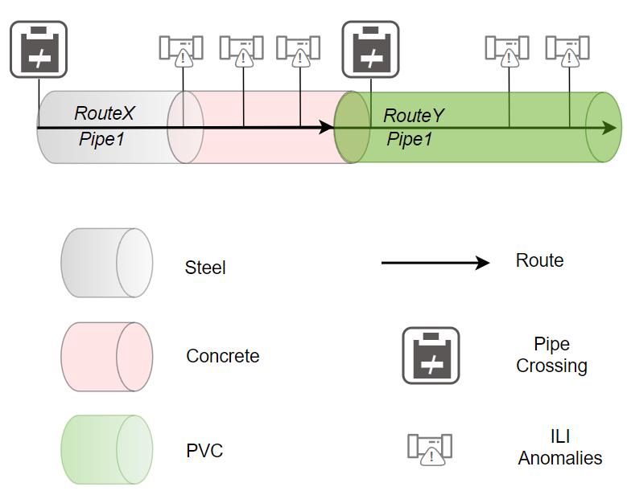
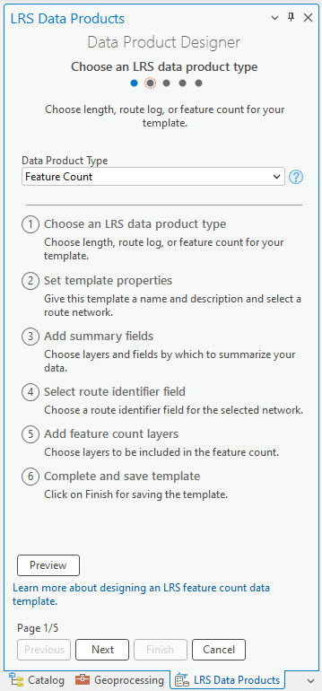

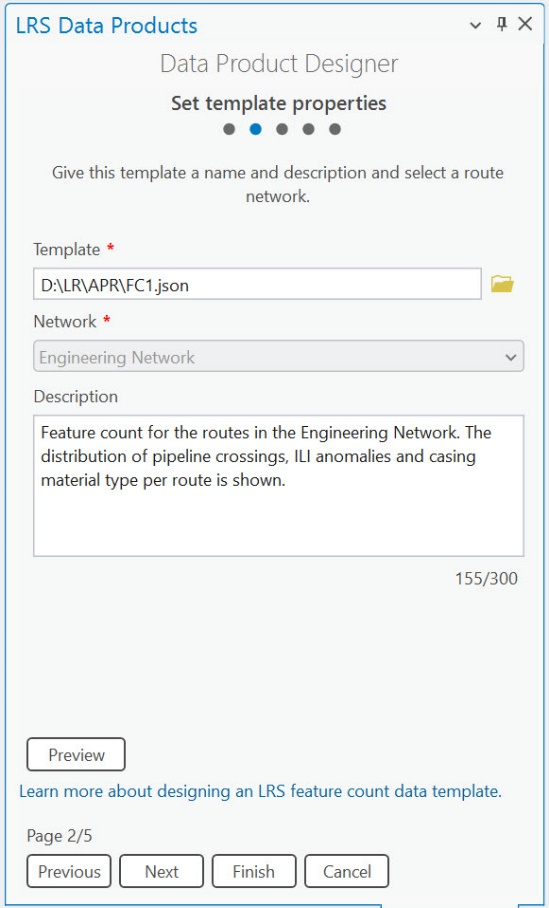
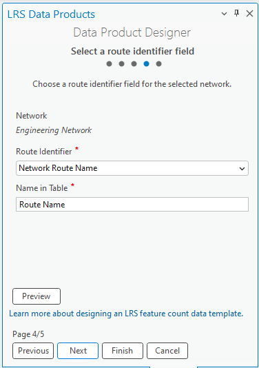
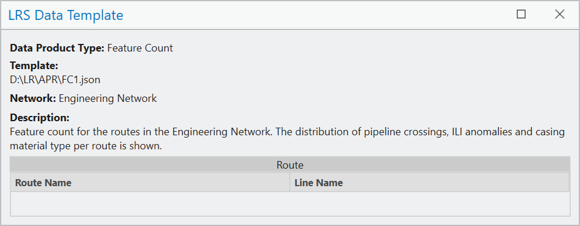
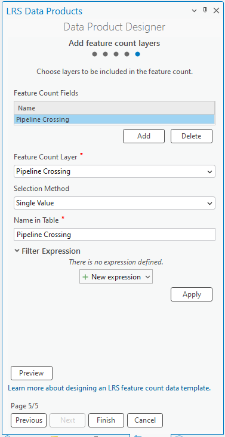
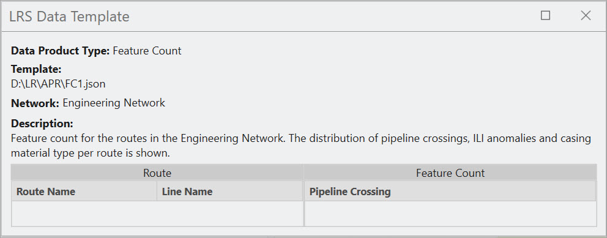
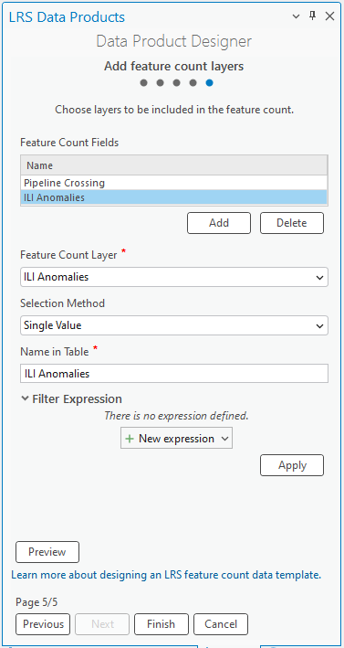
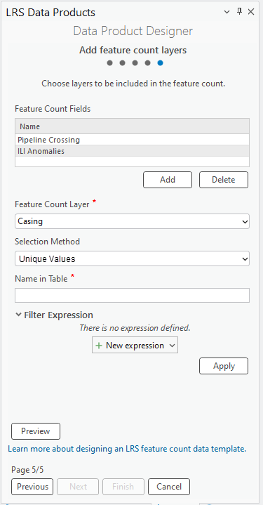
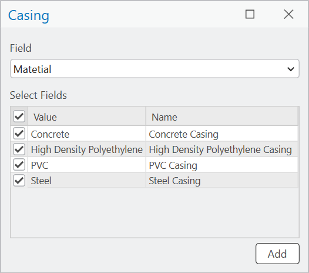
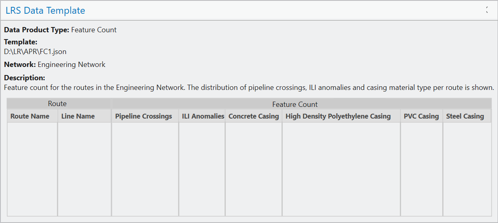
