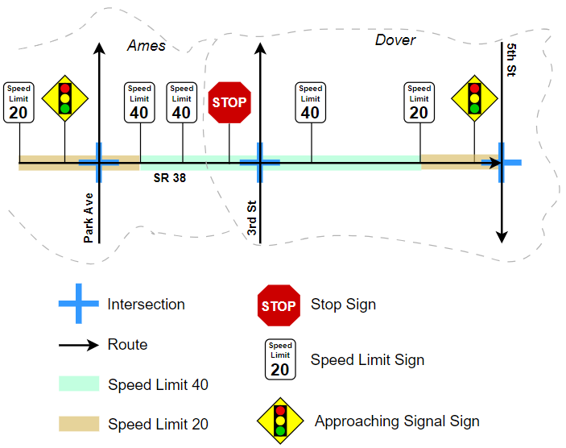
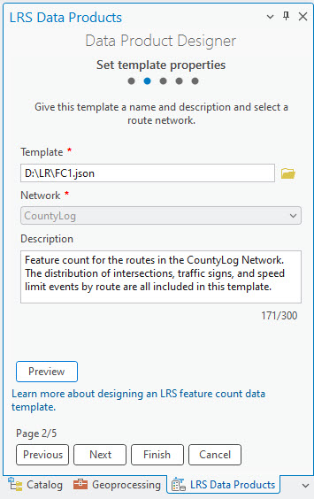
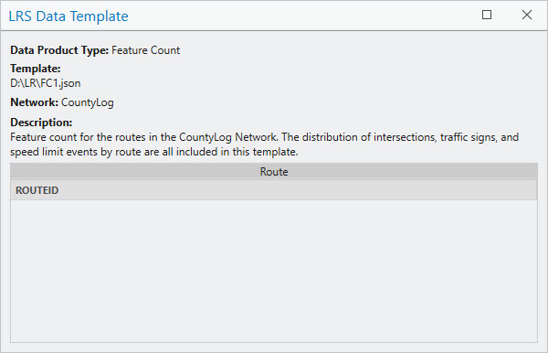
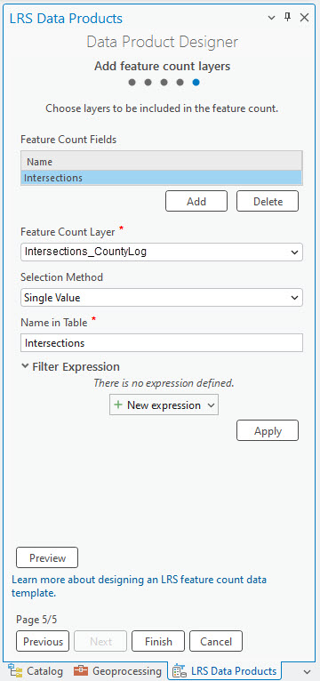
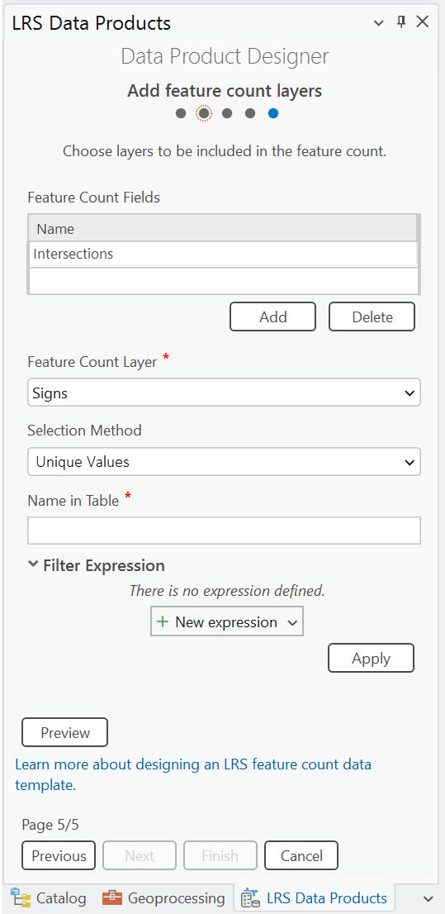
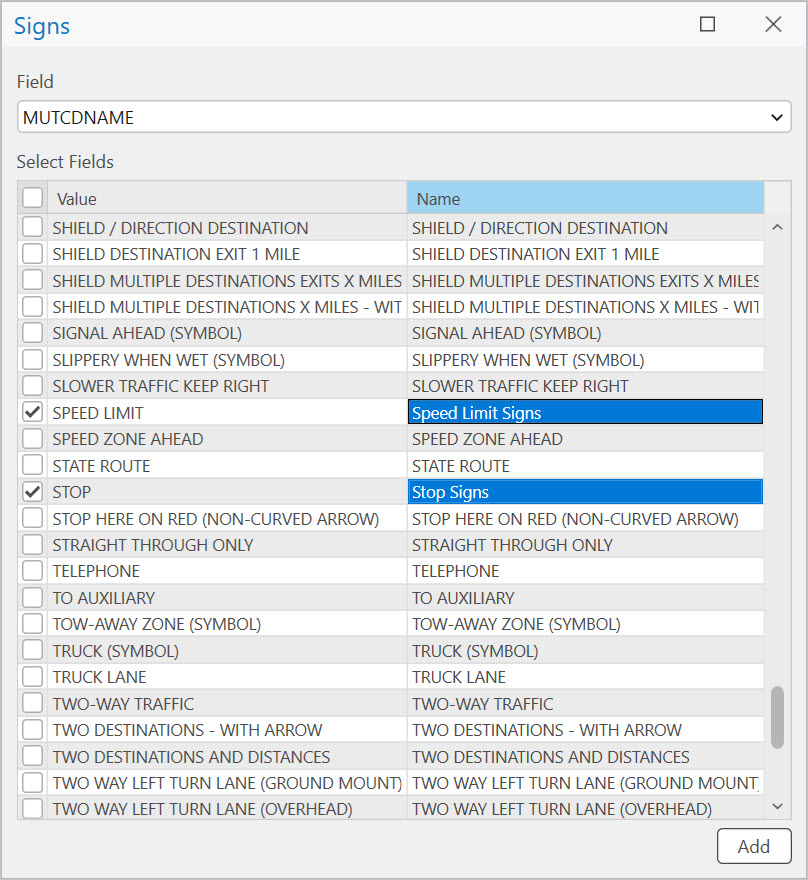
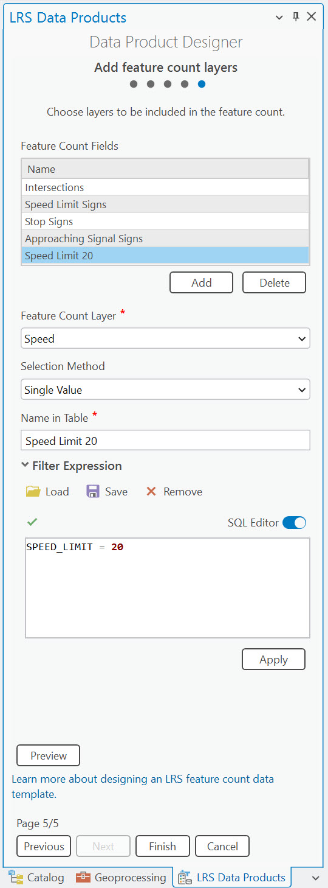
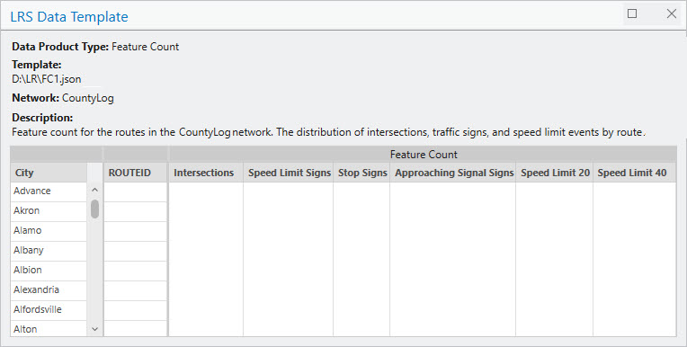

# Create a template for an LRS feature count data product

| Field | Value |
| --- | --- |
| **Doc** | 196 · Other · Pro |
| **Product** | Roads & Highways |
| **Release** | — |
| **Issues** | — |
| **Source** | [RH_Template_FeatureCount_RR1.docx](<https://esriis.sharepoint.com/sites/LocationReferencing/Shared%20Documents/General/Doc%20Reviews/Pro35_Ent115/6353_FeatureCount_Data_Product_Template/RH_Template_FeatureCount_RR1.docx>) |
| **People** | author Rahul Rakshit · PE — · dev — |
| **Edited** | 2025-03-16 02:16 by unknown |
| **Extracted** | 2026-09-04 · lane xmlstrip · format 3.0 · prompt v2.0.2 |
| **Keywords** | feature count · data product · template · route identifier · summary fields · feature count layer · filter expression · line event · point event · intersections |
| **Tools** | Generate LRS Data Product · Data Product Designer |

## Summary

This document explains how to create a template for an LRS feature count data product using the Data Product Designer in ArcGIS Pro. It covers specifying the data product type, setting template properties, adding summary fields, selecting a route identifier field, and configuring feature count layers with single and unique value options. The template is used with the Generate LRS Data Product geoprocessing tool to produce counts of line events, point events, and intersections per route.

## Related documents

<!-- related:begin -->
- [Create a template for an LRS feature count data product](<https://esriis.sharepoint.com/sites/lrsworkspace/LRS Doc Index/Other/create-a-template-for-an-lrs-feature-count-data-product-apr.md>) — similar text 0.62 · 4 title words · 2 filename words · same kind/surface/folder <!-- rel:198 s=8.184 -->
- [Feature Count Template Test Plan](<https://esriis.sharepoint.com/sites/lrsworkspace/LRS Doc Index/Test Plans/feature-count-template.md>) — similar text 0.22 · 2 title words · 2 filename words · same surface <!-- rel:254 s=4.902 -->
- [LRS Data Template: Create a template feature count](<https://esriis.sharepoint.com/sites/lrsworkspace/LRS Doc Index/User Stories/lrs-data-template-create-a-template-feature-count.md>) — similar text 0.19 · 3 title words · 2 filename words · same surface <!-- rel:258 s=4.599 -->
- [Generate LRS Feature Count (Location Referencing)](<https://esriis.sharepoint.com/sites/lrsworkspace/LRS Doc Index/Other/6749-generate-lrs-feature-count-lr.md>) — similar text 0.13 · 2 title words · 1 filename word · same kind/surface <!-- rel:147 s=4.14 -->
- [Generate Feature Count Geoprocessing Tool](<https://esriis.sharepoint.com/sites/lrsworkspace/LRS Doc Index/Other/generate-feature-count-gp.md>) — similar text 0.18 · 2 title words · 2 filename words · same kind/surface <!-- rel:281 s=4.065 -->
<!-- related:end -->

<!-- docs:begin -->
## Esri documentation

[Create a template for an LRS feature count data product](https://doc.esri.com/en/arcgis-pro/latest/help/production/roads-highways/create-a-template-for-an-lrs-feature-count-data-product.html) · [LRS data products](https://doc.esri.com/en/arcgis-pro/latest/help/production/roads-highways/lrs-data-products.html) · [Create a template for an LRS length data product](https://doc.esri.com/en/arcgis-pro/latest/help/production/roads-highways/create-a-template-for-an-lrs-length-data-product.html) · [View LRS intersection properties](https://doc.esri.com/en/arcgis-pro/latest/help/production/roads-highways/view-lrs-intersection-properties.html)

_No page matched:_ [Generate LRS Data Product](https://www.google.com/search?q=%22Generate%20LRS%20Data%20Product%22+site%3Adoc.esri.com) · [Data Product Designer](https://www.google.com/search?q=%22Data%20Product%20Designer%22+site%3Adoc.esri.com)
<!-- docs:end -->

---

## Create a template for an LRS feature count data product
An LRS feature count data product provides the information on the number of line events, point events, and intersections per route. You can find the number of traffic signals on a route or the number of traffic signs along a highway that is traversing through multiple counties. This type of information can be useful for planning and maintenance purposes.

A sample feature count dataset is produced for the SR 38 route depicted in the diagram as shown below.

Figure  SEQ Figure \* ARABIC 1. Feature count for SR 38
SR 38 goes through two cities: Ames and Dover. and Tthe table below shows the distribution of signs, intersections, and speed limit line events for theat route.

| City | Route ID | Intersections | Speed Limit Signs | Stop Signs | Approaching Signal Signs | Speed Limit 20 | Speed Limit 40 |
| --- | --- | --- | --- | --- | --- | --- | --- |
| Ames | SR38 | 1 | 3 |  | 1 | 1 | 1 |
| Dover | SR38 | 2 | 2 | 1 | 1 | 1 | 1 |

Figure  SEQ Figure \* ARABIC 2. Feature count table for SR 38
To produce this data product, you must first developcreate an LRS data template using the Data Product Designer. The template is then utilizedused by the Generate LRS Data Product geoprocessing tool.
The workflow below uses the Data Product Designer to create a template to produce an LRS feature count data product like the one shown in the table above.

### Choose an LRS data product type
The first step in the Data Product Designer is to specify the data product type.
Complete the following steps to specify the Feature Count choose a data product type.

Figure  SEQ Figure \* ARABIC 3 Selecting the Data Product type

1. Start ArcGIS Pro and open a project with LRS data in the map.

1. On the Location Referencing tab, in the LRS Data Products group, click Data Product Designer .
The Choose an LRS data product type pagne of the Data Product Designer appears.

1. Click the Data Product Type drop-down arrow and choose Feature Count.

1. Click Next.
The Set template properties pane appears.

### Set template properties
Once the data product type is specified, you can provideset the template’s properties for the product type.
To set the template’s properties, complete the following steps:

1. Provide a template name. or browse to a location, provide a name for the template, and click OK.
By default, the template is saved in the project folder.

1. Click the Network drop-down arrow and choose a network.
Route characteristics will be provided for this network when the Generate LRS Data Product
geoprocessing tool is run with the template.

1. Optionally, provide a description.

Figure  SEQ Figure \* ARABIC 4 Setting up template properties

1. Optionally, click Preview to preview the information in a canvas.

Figure  SEQ Figure \* ARABIC 5 Preview after setting up template properties

  - Note:
  - If the chosen network is a line network, a Line Name column appears in the route log next to the route identifier field.

### SetAdd template summary fields
The next step is to selectchoose a summary layers and summary fields. A feature count can be based on unique values in the summary layer at a per route basis. You can configure multiple summary layers. The summary layers are arranged and divided by levels based on their spatial relationships.
For example, you can configure a county boundary layer as level one, and a city boundary layer as level two.
ThisNote: Adding summary fields is optional. If you don't want to add summary fields to the template, click Next to proceed to selecting a route identifier field.

### To set the templateadd summary fields, complete the following steps:

1. Click Add to create a blank row in the add a Ssummary Fields tablelevel.

1. Click the Summary Layer drop-down arrow and choose a summary layer.

Figure  SEQ Figure \* ARABIC 6 Selecting the summary fields
Theis layer can be a polygon feature class or a line event that is registered to the network specified in the second panewhen setting the template properties. ItThis layer must be in the same geodatabase or feature service and have the same projection as the specified network.
For this example, City Boundary is the summary layer for the first level.

1. Click the Field drop-down arrow and choose a summary field.
For this example, Name is the summary field. This field contains the city names.

1. Once a summary field is chosen, the Display Value Map section shows a table of the unique values in the summary field. You can edit the Display Value column in the table.

Figure  SEQ Figure \* ARABIC 7 Preview after adding the summary field

1. Optionally, Provideupdate the display a name for the summary level in the Name in Table text box.
For this example, the level name is City.

1. Optionally, click the Filter Expression drop-down arrow and providedefine an expression to filter display values in the Display Value Map section.

1. If you're want to adding multiple summary levels, repeat the previous steps for each level.

1. Click Next.

The Select route identifier field pagne appears.

### Select athe route identifier field
The next step to produce a template for an LRS feature count data templateproduct is to add a route identifier field. The route identifier can be a route name or a route ID.
This example uses ROUTE_outeID as the network's route identifier field.

Figure  SEQ Figure \* ARABIC 8 Selecting the route identifier field
To selectchoose athe route identifier field, complete the following steps:

1. Click the Route Identifier drop-down arrow and choose a field.
This defaults to the selected network’s Route ID field if it is a non-line network, or Route Name if it is a line network.
If the selected network contains both Route ID and Route Name, you can choose between the two using the drop-down arrow.

1. Optionally, update the display name in the Name in Table text box.
This is the Route Identifier value by default.
Setting Choosing a the route identifier field ensures that the feature count data product generated using this template will include the field for route information.

1. Click Next.
The  Add feature count layers pagne appears.

### Add feature count layers
The LRS feature count data product counts line events, point events, and intersections on a per route basis.
There are two options to configure the feature count fields: Single Value and Unique Values. You can configure the feature count fields one by one by using the Single Value option and applying a filter to create categories. Alternatively,, or you can use the Unique Values option to configure all the unique values needed as feature count fields in the output.
For this example, Single Value is used to configure the Iintersections layer as a count field.

### To add feature count layers, complete using the following steps:

1. Click Add to create a blank row in the Feature Count Fields table.

1. Click the Feature Count Layer drop-down arrow and choose a feature count layer.
This layer must be stored in the same geodatabase or feature service and have the same projection as the specified network.
The first feature count layer configured in the example is the Intersections layer.

1. Click the Selection Method drop-down arrow and choose a selection method:.

  - Single Value—Add a single feature count field.
  - Unique Values—Add multiple unique values for a feature count layer. and Eeach unique value becomes an individual field. This option only appearsis only available when a feature count layer is provided without a name or filter.
For this example, Single Value is used to configure the Intersections laye

Figure  SEQ Figure \* ARABIC 9 Adding intersection as a feature count layer

1. Optionally, update the display name in the Name in Table text box.
The Field value appears by default display name is the Field value.
The text that appearsentered here populates the blank row in the Feature Count Fields table.

Figure  SEQ Figure \* ARABIC 10 Preview after adding the Intersections feature count field

1. Optionally, click the Filter Expression drop-down arrow and providedefine an expression to filter the feature count layer.

1. The next three feature count fields are Speed Limit Signs, Stop Signs and Approaching Signal Signs. All the three sign types are available inbelong to the Signs point event layer. To add these three fields together, use the Unique Values option in the Selection method and follow these complete the following steps:

1. Click Add to create a blank row in the Feature Count Fields table.

1. Click the Feature Count Layer drop-down arrow and choose Signs as the feature count layer.

1. Choose Unique values in Click the Selection Method drop-down arrow and choose Unique Values.

Figure  SEQ Figure \* ARABIC 11 Adding a feature count field using the unique values selection method

1. Choose a field in the feature count layer from the pop-up window that appears and do the following:
Choose the unique values by checking the check boxes next to the values.
 Optionally, change the name for each selected unique value.

  - The name becomes the name for the feature count field when the unique values are added to table.

  1. Click Add to add the selected unique values as feature count fields.

  - Each feature count field automatically has Single Value as the selection method, and a filter expression corresponding to the unique values.

Figure  SEQ Figure \* ARABIC 12 Selecting the fields using the unique values method

  - Note:
  - The Unique Values option also honors values in coded value domains and subtypes.
The final two fields are Speed Limit 20 and Speed Limit 40. These two values are counted from the Speed line event layer. To add these fields, use the Filter Expression option and follow these steps:

1. Click Add to create a blank row in the Feature Count Fields table.

1. Click the Layer drop-down arrow and choose Speed as the feature count layer.

1. Choose Single Value in the Selection Method drop-down.

1. Add Speed Limit 20 as the Name in the table.

1. Use the filter expression as shown below to filter line events that has a Speed Limit of 20:

Figure  SEQ Figure \* ARABIC 13 Adding a feature count field using the single value selection method

1. Repeat steps 9-13 with a new name and new filter expression to filter line events that haves a Speed Limit of 40.

1. Verify the fields by using the Preview button.

Figure  SEQ Figure \* ARABIC 14 Preview of the template after adding all the fields

1. Click Finish to save the template.
Note:
To view or edit an existing template, click the folder next to the Template. You can choose as template from the folder location.

You can use this template in the Generate LRS Data Product tool.

