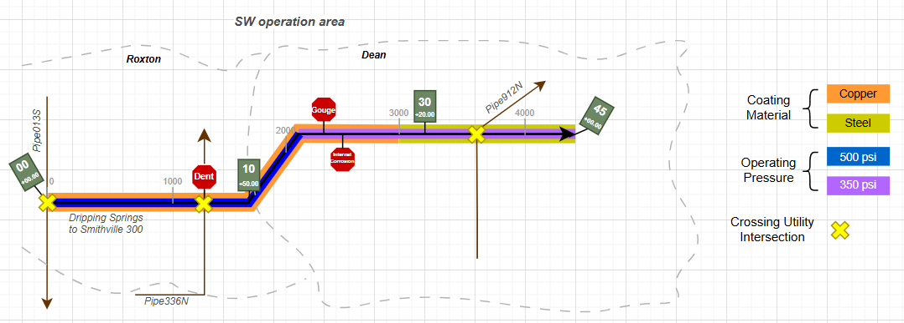
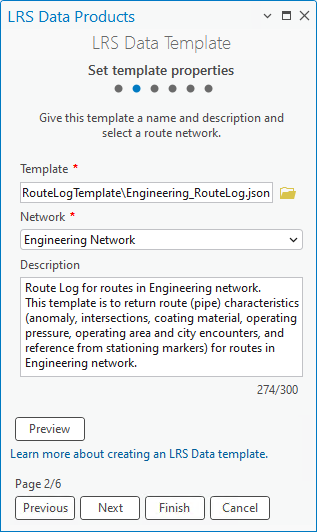
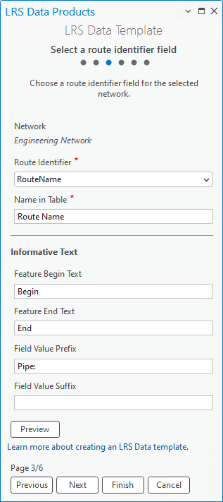
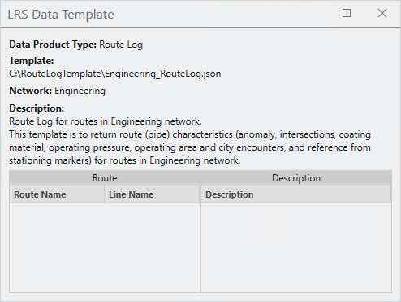
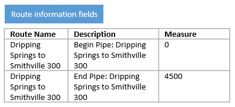
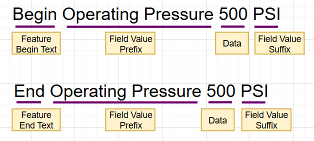
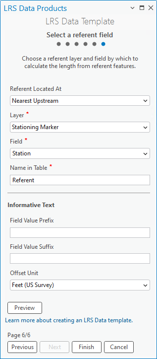
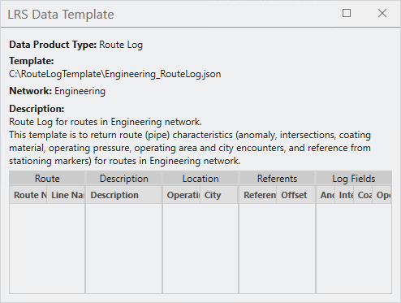
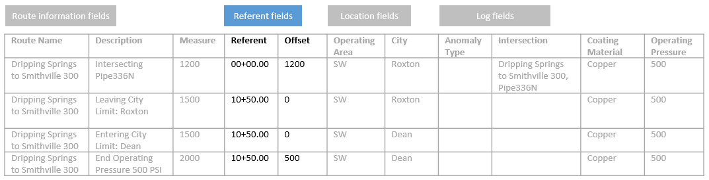

# Create a template for an LRS route log data product

| Field | Value |
| --- | --- |
| **Doc** | 201 · Other · Pro |
| **Product** | Pipeline Referencing · Utility Network |
| **Release** | — |
| **Issues** | — |
| **Source** | [APR_routelogtemplate_20250219.docx](<https://esriis.sharepoint.com/sites/LocationReferencing/Shared%20Documents/General/Doc%20Reviews/Pro35_Ent115/6271_RouteLog_Data_Product_Template/APR_routelogtemplate_20250219.docx>) |
| **People** | author Doug Haller · PE — · dev — |
| **Edited** | 2025-03-09 23:52 by unknown |
| **Extracted** | 2026-09-04 · lane xmlstrip · format 3.0 · prompt v2.0.2 |
| **Keywords** | route log · data product · template · log fields · location fields · referent field · pipeline referencing · engineering route |
| **Tools** | Generate LRS Data Product · Data Product Designer |

## Summary

Describes how to create a template for an LRS route log data product using the Data Product Designer in ArcGIS Pipeline Referencing. Covers specifying data product type, setting template properties, selecting route identifier fields, adding log and location fields, and configuring a referent field. Provides an example route log and guidance for generating route log data products with the Generate LRS Data Product tool.

## Related documents

<!-- related:begin -->
- [Create a template for an LRS route log data product](<https://esriis.sharepoint.com/sites/lrsworkspace/LRS Doc Index/Other/create-a-template-for-an-lrs-route-log-data-product-rh-un.md>) — similar text 0.44 · 4 title words · 1 filename word · same kind/surface/folder <!-- rel:203 s=6.704 -->
- [Create a template for an LRS feature count data product](<https://esriis.sharepoint.com/sites/lrsworkspace/LRS Doc Index/Other/create-a-template-for-an-lrs-feature-count-data-product-apr.md>) — similar text 0.33 · 2 title words · 1 filename word · same kind/surface <!-- rel:198 s=4.4 -->
- [Create a template for an LRS feature count data product](<https://esriis.sharepoint.com/sites/lrsworkspace/LRS Doc Index/Other/create-a-template-for-an-lrs-feature-count-data-product-rh.md>) — similar text 0.29 · 2 title words · same kind/surface <!-- rel:196 s=3.956 -->
- [Route Log data product template – Test Plan](<https://esriis.sharepoint.com/sites/lrsworkspace/LRS Doc Index/Test Plans/6203-route-log-data-product-template.md>) — similar text 0.26 · 3 title words · same surface <!-- rel:256 s=3.874 -->
- [Generate a route Log including spanning events and centerline – Test Plan](<https://esriis.sharepoint.com/sites/lrsworkspace/LRS Doc Index/Test Plans/6240-generate-a-route-log-including-spanning-events.md>) — similar text 0.17 · 2 title words · same surface <!-- rel:255 s=3.347 -->
<!-- related:end -->

<!-- docs:begin -->
## Esri documentation

[Create a template for an LRS route log data product](https://doc.esri.com/en/arcgis-pro/latest/help/production/roads-highways/create-a-template-for-an-lrs-route-log-data-product.html) · [LRS data products](https://doc.esri.com/en/arcgis-pro/latest/help/production/roads-highways/lrs-data-products.html) · [Create a template for an LRS length data product](https://doc.esri.com/en/arcgis-pro/latest/help/production/roads-highways/create-a-template-for-an-lrs-length-data-product.html) · [3D in Pipeline Referencing](https://doc.esri.com/en/arcgis-pro/latest/help/production/location-referencing-pipelines/3d-in-pipeline-referencing.html)

_No page matched:_ [Generate LRS Data Product](https://www.google.com/search?q=%22Generate%20LRS%20Data%20Product%22+site%3Adoc.esri.com) · [Data Product Designer](https://www.google.com/search?q=%22Data%20Product%20Designer%22+site%3Adoc.esri.com)
<!-- docs:end -->

---

## Create a template for an LRS route log data product
A Linear Referencing System (LRS) route log data product is used to provide measure locations for characteristics, such as events and intersections, along a route.
You can create LRS route log data products using the Generate LRS Data Product tool. This tool requires an LRS data template.
The ArcGIS Pipeline Referencing extension includes a Data Product Designer to create LRS data templates.
The sample route log shown below is produced for the engineering route Dripping Springs to Smithville 300. The measures on the route increase in the direction of the arrow. The route log places the records on the route as if a person moving in the direction of the arrow notes the pipe characteristics and measure value information of the chosen layers as they are encountered.

The route log data product returns the location and information of point events, line events, intersections, referent features, and polygon boundaries for Engineering Route Dripping Springs to Smithville 300. The following list shows the characteristics found along the example engineering route:

- Log fields: Anomaly Type, Coating Material, Operating Pressure, and crossing-utility Intersection
- Location fields: Operating Area and City boundaries
- Referent field: Stationing Marker
The following table is the returned route log for the example route after inputting the template into the Generate LRS Data Product tool.

| Route Name | Description | Measure | Referent | Offset | Operati ng Area | City | Anomaly Type | Intersection | Coating Material | Operating Pressure |
| --- | --- | --- | --- | --- | --- | --- | --- | --- | --- | --- |
| Dripping Springs to Smithville 300 | Begin Pipe: Dripping Springs to Smithville 300 | 0 | 00+00 .00 | 0 | SW | Roxton |  |  | Copper | 500 |
| Dripping Springs to Smithville 300 | Intersecting Pipe013S | 0 | 00+00.00 | 0 | SW | Roxton |  | Dripping Springs to Smithville 300 , Pipe013S | Copper | 500 |
| Dripping Springs to Smithville 300 | Begin Copper coating | 0 | 00+00.00 | 0 | SW | Roxton |  |  | Copper | 500 |
| Dripping Springs to Smithville 300 | Begin Operating Pressure 500 PSI | 0 | 00+00.00 | 0 | SW | Roxton |  |  | Copper | 500 |
| Dripping Springs to Smithville 300 | Dent | 1200 | 00+00.00 | 1200 | SW | Roxton | Dent |  | Copper | 500 |
| Dripping Springs to Smithville 300 | Intersecting Pipe336N | 1200 | 00+00.00 | 1200 | SW | Roxton |  | Dripping Springs to Smithville 300 , Pipe336N | Copper | 500 |
| Dripping Springs to Smithville 300 | Leaving City Limit: Roxton | 1500 | 10+50 .00 | 0 | SW | Roxton |  |  | Copper | 500 |
| Dripping Springs to Smithville 300 | Entering City Limit: Dean | 1500 | 10+50.00 | 0 | SW | Dean |  |  | Copper | 500 |
| Dripping Springs to Smithville 300 | End Operating Pressure 500 PSI | 2000 | 10+50.00 | 500 | SW | Dean |  |  | Copper | 500 |
| Dripping Springs to Smithville 300 | Begin Operating Pressure 350 PSI | 2000 | 10+50.00 | 500 | SW | Dean |  |  | Copper | 350 |
| Dripping Springs to Smithville 300 | Gouge | 2300 | 10+50.00 | 800 | SW | Dean | Gouge |  | Copper | 350 |
| Dripping Springs to Smithville 300 | Internal Corrosion | 2500 | 10+50.00 | 1000 | SW | Dean | Internal Corrosion |  | Copper | 350 |
| Dripping Springs to Smithville 300 | End Copper coating | 3000 | 10+50.00 | 1500 | SW | Dean |  |  | Copper | 350 |
| Dripping Springs to Smithville 300 | Begin Steel coating | 3000 | 10+50.00 | 1500 | SW | Dean |  |  | Steel | 350 |
| Dripping Springs to Smithville 300 | Intersecting Pipe912N | 3650 | 30+20 .00 | 300 | SW | Dean |  | Dripping Springs to Smithville 300 , Pipe912N | Steel | 350 |
| Dripping Springs to Smithville 300 | End Operating Pressure 350 PSI | 4500 | 45+00 .00 | 0 | SW | Dean |  |  | Steel | 350 |
| Dripping Springs to Smithville 300 | End Steel coating | 4500 | 45+00.00 | 0 | SW | Dean |  |  | Steel | 350 |
| Dripping Springs to Smithville 300 | End Pipe: Dripping Springs to Smithville 300 | 4500 | 45+00.00 | 0 | SW | Dean |  |  | Steel | 350 |

Other types of LRS route log data products that you can configure include the following:

- Change of operating conditions along pipes in different operating areas
- In-line Inspection (ILI) survey reading, document point, and ILI range along pipes with markers being the referent location
- The measure of intersections between a pipe and features such as hydrology units, transportation lines, utility lines, other pipelines, and operating area boundaries
The next sections provide guidance on using the Data Product Designer to create the templates for the Generate LRS Data Product tool to produce an LRS route log data product like the one shown in the table above.

### Choose an LRS data product type
The first step in the Data Product Designer is to specify the data product type that the template is for.

### Complete the following steps to specify the type:

1. Start ArcGIS Pro and open a project with LRS data in the map.

1. On the Location Referencing tab, in the LRS Data Products group, click Data Product Designer .
The Choose an LRS data product type pane of the Data Product Designer appears.

1. Click the Data Product Type drop-down arrow and choose Route Log.

1. Click Next.

- The Set template properties pane appears.

### Set template properties
Once the product type is specified, you can set the template’s properties.
To set the template properties, complete the following steps:

1. Provide a template name or browse to a location and provide a template name, then click OK.

- By default, the template is saved in the project folder.

1. Click the Network drop-down arrow and choose a network.

- Route characteristics will be provided for this network when the Generate LRS Data Product tool is run with the template.

1. Optionally, provide a description.

1. Optionally, click Preview to review the information in a canvas.

  - Note:
  - If the chosen network is a line network, a Line Name column appears in the route log next to the route identifier field.

1. Click Next.
The Select route identifier field pane appears.

### Select a route identifier field
The next step to produce an LRS route log data template is to add a route identifier field and provide informative text. The route identifier can be a route name or route ID.
This example uses RouteName as the engineering network's route identifier field and Route Name as the display field name in Name in Table text box. The display field name also updates in the preview canvas. In the route log, the start and end points of a route are: Begin Pipe: Dripping Springs to Smithville 300 and End Pipe: Dripping Springs to Smithville 300.
To select the route identifier fields, complete the following steps:

1. Click the Route Identifier drop-down arrow and choose a field.
This defaults to the selected network’s Route ID field if it is a non-line network or to Route Name if it is a line network.
If the selected network contains both Route ID and Route Name, you can choose between the two using the drop-down arrow.

1. Optionally, update the display name in the Name in Table text box.
This is the Route Identifier value by default.

1. Optionally, update text in the Feature Begin Text and Feature End Text text boxes to indicate the start and end of routes.
The default values are Begin and End, as shown in the example.

1. Optionally, provide text in the Field Value Prefix and Field Value Suffix text boxes to supplement information before and after the route identifier value, respectively.
In the example, Pipe:, is the prefix text for the Begin and End text. The example does not include suffix text.

Setting the route identifier field ensures that the route log data product generated using this template will include the fields for route information.

1. Click Next.
The Add log fields pane appears.

### Add log fields
In the LRS route log data product, the log fields form the columns that contain the route events and intersections. You can add log fields from log layers and supplement informative text. Informative text provides details about the log layers.

- Note:
- An LRS centerline can also be used as a log layer when it is configured for Address Data Management or Utility Network.

### The example in this section uses four log layers:

- Anomaly point event
- Crossing-utility intersection
- Coating line event
- Operating Pressure line event
An LRS route log data product generated using this template would return a record when any of these layers appear and end on a route.
Adding log fields is optional. If you don't want to add log fields to the template, click Next to proceed to adding location fields.

### To add log fields, complete the following steps:

1. Click Add to create a blank row in the Log Fields table.

1. Click the Layer drop-down arrow and choose a log layer.
The layer can be a point event, a line event, or an intersection registered to the network specified when setting the template properties. It must be stored in the same geodatabase or feature service and have the same projection as the specified network. The layer you specify determines what fields are available for Field.
The first log layer configured in the example is the Anomaly point event.

1. Click the Field drop-down arrow and choose a field from the layer specified.
For this example, Anomaly Type is configured as the log field.

1. Optionally, update the display name in the Name in Table text box.
The Field value appears by default.
The text that appears here populates the blank row in the Log Fields table.

1. Optionally, update text to appear before the start and end log fields in the Feature Begin Text and Feature End Text text boxes.
The default values are Begin and End.
Point events and intersections do not have a Feature Begin Text or Feature End Text.

1. Optionally, provide Field Value Prefix and Field Value Suffix text.
The texts entered provide additional information about the log value and are inserted before and after the value, respectively.

In the example below, Operating Pressure is the Field Value Prefix value and PSI is the Field Value Suffix value added for the line event, Operating Pressure.

1. Optionally, click the Filter Expression drop-down arrow and provide an expression to filter specific log values.
Only features that meet the filter expression will be returned in route log. For example, "COATING_MATEIRAL <> 'Plastic' " would return non-plastic coating material events.

1. Optionally, check the Merge Coincident Events check box for line event log layers.
Checking this box returns coincident events with the same value in log field as a single event in the route log.

1. Repeat the steps to add more log fields.
The example has four log fields.

Setting template log fields configures route log data products that are generated using this template with the columns that contain event and intersection information.

1. Click Next.
The Add location fields pane appears.

### Add location fields
After adding log layers, you can add location layers and location fields. The location fields form the columns that contain the polygon boundaries that the routes cross. You can also provide informative text for the location layers.
The example in this section uses Operating Area and City as the location layers. An LRS route log data product generated using this template will return a record when a route enters or leaves an operating area or city.
Adding location fields is optional. If you don't want to add location fields to the template, click Next to proceed to select a referent field.

### To add location fields, complete the following steps:

1. Click Add to create a blank row in the Location Fields table.

1. Click the Layer drop-down arrow and choose a location layer.
This layer must be a polygon feature class stored in the same geodatabase or feature service with the same projection as the specified network when setting the template properties.
The first location layer configured in the example is OperatingArea.

1. Click the Field drop-down arrow and choose a field from the location specified.
For this example, Operating Area is configured as the location field.

1. Optionally, update display name in the Name in Table text box.
The Location value appears by default.
The text that appears here populates the blank row in the Location Fields.

1. Optionally, update text to appear before the start and end log fields in the Feature Begin Text and Feature End Text text.
The default values are Begin and End.
For this example, the Feature Begin Text and Feature End Text appear as Entering Operating Area Limit: and Leaving Operating Area Limit:.

1. Optionally, click the Filter Expression drop-down arrow and provide an expression to filter by a specific location field.
Only features that meet the filter expression will be returned in the route log.
The example template does not have a filter expression configured to location fields. One example of a filter expression, "REGION = "S-US", would return only route interactions with operating areas in the southern US.

1. Repeat the steps to add more location fields.
The example has two location fields.

Setting template location fields configures route log data products that are generated using this template with the columns that record when a route enters or leaves a location.

1. Click Next.
The Select a referent field pane appears.

### Select a referent field
After adding location layers, you can add a referent field from a referent layer. The referent field forms the columns that show the offset distance to the corresponding reference. You can also provide informative text for the referent layer. The example in this section uses Stationing Marker as the referent layer.
Configuring a referent field is optional. If you do not want to configure the referent field, keep None as the default option and click Finish to save the template.

Note:
You can configure only one referent layer for the route log template.
To select the template referent field, complete the following steps:

1. Click the Referent Located At drop-down arrow and choose a referent method.
If Nearest Upstream is chosen, the nearest referent feature upstream of the route log entry will be used to calculate the referent offset. If no upstream referent feature exists, the referent values will be empty.
If Nearest is chosen, the nearest referent feature, upstream or downstream, to the route log entry will be used to calculate the referent offset.

The following graphic and table illustrate the difference between the two referent methods. The Dent anomaly is 1,000 feet upstream from the nearest stationing marker, so the offset is -1000. The same anomaly is 6,000 feet from the nearest upstream stationing marker, so the offset is 6,000.

| Referent method | Referent | Offset ( Feet (US Survey)) |
| --- | --- | --- |
| Nearest | 70+00 .00 | -1 000 |
| Nearest Upstream | 00+00 .00 | 6 000 |

1. Click the Layer drop-down arrow and choose a referent layer.
This layer must be a point event stored in the same geodatabase or feature service with the same projection as the specified network when setting the template properties.
For this example, Stationing Marker is configured as the referent layer.

1. Click the Field drop-down arrow and choose a referent field.
For this example, Station is the referent field for Stationing Marker.

1. Optionally, update the display name for the Name in Table text box.
The Referent value appears by default.

1. Optionally, provide text in the Field Value Prefix and Field Value Suffix text boxes.
The texts entered provide more information about the referent value and are inserted before and after the value, respectively.

1. Click the Offset Unit drop-down arrow and choose a value.
The default value is Feet (International).
For this example, the Offset Unit value is set to Feet (US Survey).

Setting a template referent field configures route log data products that are generated using this template with columns which return referent and offset values.

1. Click Finish to save the template.
Note:
To view or edit an existing template, click the folder next to Template. You can choose a template from the default project folder location or browse to other locations.
You can use this template in the https://prodev.arcgis.com/en/pro-app/3.5/tool-reference/location-referencing/generate-lrs-data-product.htm \hGenerate LRS Data Product tool.

