# Create a template for an LRS route log data product

|   |   |
| --- | --- |
| **Kind** | Other · Pro |
| **Release** | — |
| **Product** | Roads & Highways · Utility Network |
| **Source** | [RH_routelogtemplate.docx](<https://esriis.sharepoint.com/sites/LocationReferencing/Shared%20Documents/General/Doc%20Reviews/Pro35_Ent115/6271_RouteLog_Data_Product_Template/RH_routelogtemplate.docx>) |
| **Edited** | 2025-03-06 18:52 by unknown |
| **Extracted** | 2026-09-04 · lane `xmlstrip` |

<!-- metadata
```yaml
title: "Create a template for an LRS route log data product"
source_file: "RH_routelogtemplate.docx"
source_url: "https://esriis.sharepoint.com/sites/LocationReferencing/Shared%20Documents/General/Doc%20Reviews/Pro35_Ent115/6271_RouteLog_Data_Product_Template/RH_routelogtemplate.docx"
doc_id: 203
doc_kind: "Other"
surface: "Pro"
doc_revision: ""
target_release: ""
pe: ""
dev: ""
author: ""
last_edited_by: ""
last_edited: "2025-03-06T18:52:25.3024147Z"
extracted: 2026-09-04
extraction_lane: xmlstrip
prompt_version: "v2.0.2"
keywords: ["route log", "data product", "template", "route identifier", "log fields", "location fields", "referent field", "measure locations", "events", "intersections", "polygon boundaries"]
tools: ["Generate LRS Data Product", "LRS Data Template"]
products: ["Roads & Highways", "Utility Network"]
issues: []
related: [{"doc":201,"file":"create-a-template-for-an-lrs-route-log-data-product__doc201.md","s":6.704},{"doc":202,"file":"lrs-data-products__doc202.md","s":4.085},{"doc":284,"file":"lrs-data-template-and-route-log-configuration__doc284.md","s":3.853},{"doc":256,"file":"route-log-data-product-template-test-plan__doc256.md","s":3.749},{"doc":196,"file":"create-a-template-for-an-lrs-feature-count-data-product__doc196.md","s":3.729}]
```
-->

## Summary

This document explains how to create a template for an LRS route log data product using the LRS Data Template wizard in ArcGIS Pro. It covers selecting the data product type, setting template properties, choosing route identifier fields, adding log fields, location fields, and a referent field to configure the route log output. The route log data product provides detailed measure locations and attributes such as events, intersections, and boundaries along routes.

## Related documents

<!-- related:begin -->
- [Create a template for an LRS route log data product](<https://esriis.sharepoint.com/sites/lrsworkspace/LRS Doc Index/Other/create-a-template-for-an-lrs-route-log-data-product__doc201.md>) — similar text 0.44 · 4 title words · 1 filename word · same kind/surface/folder <!-- rel:201 -->
- [LRS Data Products](<https://esriis.sharepoint.com/sites/lrsworkspace/LRS Doc Index/Other/lrs-data-products__doc202.md>) — similar text 0.15 · same kind/surface/folder <!-- rel:202 -->
- [LRS Data Template and Route Log Configuration](<https://esriis.sharepoint.com/sites/lrsworkspace/LRS%20Doc%20Index/Other/lrs-data-template-and-route-log-configuration__doc284.md>) — similar text 0.34 · 2 title words · same kind/surface <!-- rel:284 -->
- [Route Log data product template – Test Plan](<https://esriis.sharepoint.com/sites/lrsworkspace/LRS Doc Index/Test Plans/route-log-data-product-template-test-plan__doc256.md>) — similar text 0.32 · 3 title words · same surface <!-- rel:256 -->
- [Create a template for an LRS feature count data product](<https://esriis.sharepoint.com/sites/lrsworkspace/LRS Doc Index/Other/create-a-template-for-an-lrs-feature-count-data-product__doc196.md>) — similar text 0.31 · 2 title words · same kind/surface <!-- rel:196 -->
<!-- related:end -->

<!-- docs:begin -->
## Esri documentation

[Create a template for an LRS length data product](https://doc.esri.com/en/arcgis-pro/latest/help/production/roads-highways/create-a-template-for-an-lrs-length-data-product.html) · [Create a template for an LRS route log data product](https://doc.esri.com/en/arcgis-pro/latest/help/production/roads-highways/create-a-template-for-an-lrs-route-log-data-product.html) · [LRS data products](https://doc.esri.com/en/arcgis-pro/latest/help/production/roads-highways/lrs-data-products.html) · [View LRS intersection properties](https://doc.esri.com/en/arcgis-pro/latest/help/production/roads-highways/view-lrs-intersection-properties.html)

_No page matched:_ [Generate LRS Data Product](https://www.google.com/search?q=%22Generate%20LRS%20Data%20Product%22+site%3Adoc.esri.com)
<!-- docs:end -->

---

## Create a template for an LRS route log data product
To create linear referencing system (LRS) data products, you must create an LRS data template first and then use the template as an input to the Generate LRS Data Product tool.
An LRS route log data product is used to provide measure locations for characteristics, such as events and intersections, along the route as if it traverses a route.
The sample road log shown below is produced for Route ID SR9WB. The measures on the route increase from left to right. The road log places the records on the route as if a person moving in that direction notes the classification and measure value information of the chosen layers as they are encountered.
The route log data product returns the location and information of point events, line events, intersections, referent features, and polygon boundaries for Route ID SR9WB.

- Log fields: Sign Type, Functional Class, Speed Limit, and Intersection
- Location fields: County and City boundaries
- Referent field: Mile post
 (alt text: Route ID SR9WB and associated route characteristics along the route.)
The following table is the route log returned for Route ID SR9WB.

| Route ID | Description | Measure | Referent | Offset | County | City | Sign Type | Intersection | Functional Class | Speed Limit |
| --- | --- | --- | --- | --- | --- | --- | --- | --- | --- | --- |
| SR9WB | Begin Route: SR9WB | 0 | Mile 0 | 0 | Union | Titan |  |  | Interstate | 65 |
| SR9WB | Intersecting SR26WB | 0 | Mile 0 | 0 | Union | Titan |  | SR9WB, SW26WB | Interstate | 65 |
| SR9WB | Begin Functional Class Interstate | 0 | Mile 0 | 0 | Union | Titan |  |  | Interstate | 65 |
| SR9WB | Begin Speed Limit 65 MPH | 0 | Mile 0 | 0 | Union | Titan |  |  | Interstate | 65 |
| SR9WB | Speed Limit Sign | 1.4 | Mile 0 | 1.4 | Union | Titan | Speed Limit |  | Interstate | 65 |
| SR9WB | Stop Sign | 2.5 | Mile 2 | 0.5 | Union | Titan | Stop |  | Interstate | 65 |
| SR9WB | Intersecting NR38WB | 2.5 | Mile 2 | 0.5 | Union | Titan |  | SR9WB, NR38WB | Interstate | 65 |
| SR9WB | Leaving City Limit: Titan | 3.5 | Mile 2 | 1.5 | Union | Titan |  |  | Interstate | 65 |
| SR9WB | Entering City Limit: Adam | 3.5 | Mile 2 | 1.5 | Union | Adam |  |  | Interstate | 65 |
| SR9WB | End Functional Class Interstate | 4 | Mile 2 | 2 | Union | Adam |  |  | Interstate | 65 |
| SR9WB | Begin Functional Class Local | 4 | Mile 2 | 2 | Union | Adam |  |  | Local | 65 |
| SR9WB | End Speed Limit 65 MPH | 6 | Mile 6 | 0 | Union | Adam |  |  | Local | 65 |
| SR9WB | Begin Speed Limit 40 MPH | 6 | Mile 6 | 0 | Union | Adam |  |  | Local | 40 |
| SR9WB | Speed Limit Sign | 7.6 | Mile 6 | 1.6 | Union | Adam | Speed Limit |  | Local | 40 |
| SR9WB | End Speed Limit 40 MPH | 10 | Mile 10 | 0 | Union | Adam |  |  | Local | 40 |
| SR9WB | End Functional Class Local | 10 | Mile 10 | 0 | Union | Adam |  |  | Local | 40 |
| SR9WB | Intersectin g NR71WB | 10 | Mile 10 | 0 | Union | Adam |  | SR9WB, NR71WB | Local | 40 |
| SR9WB | End Route: SR9WB | 10 | Mile 10 | 0 | Union | Adam |  |  | Local | 40 |

Other types of LRS route log data products that you can configure include the following:

- Change of pavement conditions along routes in different urban areas
- Crash, speed limit, and intersections along routes with signs being the referent location
- The entry and exit measures of interstate routes when they cross counties and cities
In this workflow, you'll learn how create a template to produce an LRS route log data product like the one shown in the table above.

### Choose an LRS data product type
Choose Route Log from the Data Product Type dropdown in the Choose an LRS data product type pane of the LRS Data Template wizard.
(alt text: Route Log Data Product in the Choose an LRS data product type pane of the LRS Data Template wizard)

- Start ArcGIS Pro and open a project with LRS data in the map.
- On the Location Referencing tab, in the LRS Data Products group, click LRS Data Template .
- The Choose an LRS data product type pane of the LRS Data Template wizard appears.
- 3. Choose Route Log from the Data Product Type dropdown. (pane PNG)
4. Click Next.

- The Set template properties pane appears.

### Set template properties
Once a product type is specified, you can provide template properties.
To set the template properties, complete the following steps:

- Provide a template name.
- By default, the template is saved in the project folder. Optionally, browse to a different location, provide a name for the template, and click OK.
- Click the Network drop-down arrow and choose a network.
- Route characteristics will be provided for this network.
- Optionally, provide a description.
 (alt text: Template properties are set in the second pane in the LRS Data Template wizard)

- Optionally, click Preview to open the canvas.
- The canvas formats the information provided in the wizard.
- (alt text: Template properties in the canvas)
  - Note:
  - If the chosen network is a line network, an additional column "Line Name" will be automatically added to the route log, to the right of the route identifier field.
- Click Next.

### Select a route identifier field
The next stage in producing the LRS route log data template is to select a route identifier field and set informative text. The route identifier field can be Route ID or Route Name. You can use informative texts to provide more details regarding the routes.
For this example, ROUTE_ID is CountyLog's route identifier field and Route ID is the display field name in table. The display field name also updates in the preview canvas. In this route log data product, the start and end points of a route are: Begin Route: SR9WB and End Route: SR9WB. You can configure different informative text for your route log data product.
To set the route identifier fields, complete the following steps:

- The Network label indicates the selected network in the second pane. The Route Identifier Field is Route ID field from the selected network if it is a non-line network, and Route Name if the selected network is a line network.
If the selected network is configured with both Route ID and Route Name, you can select a different route identifier field from the drop-down arrow.

- Name in Table is Route Identifier Field value by default. Optionally, set a different display Name in Table for the Route Identifier Field.
- Feature Begin Text and Feature End Text indicate the start and end of routes in a route log data product. The default values are Begin and End. Optionally, set different values for these fields.
- Field Value Prefix is an additional text attached between Feature Begin Text and the route identifier value. Field Value Suffix is an additional text attached after the route identifier value.
The default values are null. Optionally, provide Field Value Prefix and Suffix values.
In the example, Route: is the prefix text...
(alt text: Set a route identifier field and informative texts for a route log template)

(alt text: Canvas after configuring route identifier field.)

- After setting a route identifier field, the route log data product will include fields to return route information. (alt: Route information fields in route log after setting a route identifier field.)
- Click Next.
The Add log fields pane appears.

### Set Add log fields
Then, you can select log layers, log fields, and set informative texts. The log fields form the columns that show the specified events and intersections on the roads in the LRS route log data product. You can use informative texts to show more details of the log layers.

- Note:
- Centerline can also be used as a log layer when it is configured for Address Data Management or Utility Network
This example includes Signs point event, Intersection, Speed Limit line event, and Functional Class line event as log layers.
The LRS route log data product returns a record whenever these layers appear and end on a route.
Adding log fields is optional. To skip this step, click Next to proceed.
To set the template log fields, complete the following steps:

- Click Add to add a log layer.
- Click the Layer drop-down arrow and choose a log layer.
Layer options include point events, line events, or intersections registered to the network specified in the second pane. This layer must be in the same geodatabase or feature service and have the same projection as the specified network.
For this example, point event Signs is the first log layer.

- Click the Field drop-down arrow and choose a log field.
For this example, Sign Type is configured as the log field.

- Name in Table is log Field value by default. Optionally, set a different display Name in Table for the log Field.
- Point events and intersections do not have a Feature Begin or End Text.
For a line log layer, Feature Begin Text and Feature End Text indicate the start and end of the log layer in a route log data product. The default values are Begin and End. Optionally, set different values for these fields.

- Field Value Prefix is additional text attached before the log value. Field Value Suffix is additional text attached after the log value. The default values are null. Optionally, provide Field Value Prefix and Suffix values.
For this example, the Speed Limit events are Field Prefix Value and Field Suffix Value are 65 and MPH respectively. In the route log data product, speed limit entries as shown in the image. (alt: Speed Limit entries with informative texts in a route log data product)

- Optionally, click the Filter Expression drop-down arrow and provide an expression to filter specific log values. Only features that meet the filter expression will be returned in route log. The example template does not have any filter expression configured to log fields. One example of a filter expression, "FUNCTIONAL_CLASS = 1", would return only interstate functional classes.
- Optionally, check the Merge Coincident Events box for any line event log layers. Selecting this box returns coincident events with the same value in log field as a single event in the route log.
- If you are adding multiple log fields, repeat the previous steps for each field.
For this example, Sign Type, Intersection, Speed Limit, and Functional Class are configured as log fields.
(alt text: Add log fields for a route log template)

(alt text: Canvas after adding log fields.)

- After setting log fields, the route log data product will include fields to return information for events and intersections. (alt: Log fields in route log after setting log fields.)
- Click Next.

### Set Add location fields
Next, add location layers and location fields. Adding location fields updates the route log data product with columns for polygon boundaries which the routes cross. You can use informative texts to show more details of the location layers.
For this example, County and City are configured as location layers. The LRS route log data product returns a record whenever a route enters or leaves a county and city.
Adding location fields is optional. To skip this step, click Next.
To set the template location fields, complete the following steps:

- Click Add to add a location layer.
- Click the Layer drop-down arrow and choose a location layer.
This layer must be a polygon feature class in the same geodatabase or feature service with the same projection as the specified network.
For this example, CountyBoundary is configured as the first location layer.

- Click the Field drop-down arrow and choose a location field.
For this example, CountyName is the location field for CountyBoundary.
Name in Table is location Field value by default. Optionally, set a different display Name in Table for the location Field.
For this example, County is set as the display Name in Table.

- Feature Begin Text and Feature End Text indicate when a route enters and leaves a polygon in the location layer. The default values are Begin and End. Optionally, set custom values for these fields.
For this example, the Feature Begin Text and Feature End Text are changed to Entering County Limit: and Leaving County Limit:, respectively.

- Optionally, click the Filter Expression drop-down arrow and provide an expression to filter specific location field. Only features that meet the filter expression will be returned in route log. The example template does not model a filter expression configured to location fields. One example of a Filter Expression, "REGION = "SOUTHWEST", would return only route interactions with counties in the southwest region.
- To add multiple location fields, repeat the previous steps for each field.
In this example, CityBoundary is the second location layer, Name is the location field, and City is the display Name in Table for the location field.
(alt text: Add location fields for a route log template)

(alt text: Canvas after adding location fields.)

- After setting location fields, the route log data product will include fields to return information for location polygons that the route traverses. (alt: Location fields in route log after setting location fields.)
- Click Next.

### Set a referent field
After selecting adding the location layers, add select a referent layer and the referent field. The referent field forms the columns which show the distance to the corresponding reference for each entry in the route log data product. You can use informative texts to show more details regarding the referent layer.
In this example, MilePost is configured as the referent layer. For each entry in the LRS route log data product, the referent fields show the corresponding referent feature and the distance to the reference.
Configuring a referent field for the template is optional. If you do not want to configure the referent field, keep None as Referent Located At option in the pane.
Note:
You can only configure one referent layer for the route log template.
To set the template referent field, complete the following steps:

- Expand the Referent Located At drop-down arrow to choose a referent method.
If Nearest Upstream is selected, the nearest referent feature upstream of the route log entry will be used to calculate the referent offset. If no upstream referent feature exists, the referent values will be empty.
If Nearest is selected, the nearest referent feature, upstream or downstream, of the route log entry will be used to calculate the referent offset.
The following graphic and table illustrate the difference between the two referent methods. The stop sign is 1 mile upstream from the nearest mile post, so the offset is -1. Similarly, its offset is 6 from the nearest upstream mile post.
(alt: A stop sign with two mile posts on Route1)

| Referent method | Referent | Offset (Miles (US Survey)) |
| --- | --- | --- |
| Nearest | Mile 7 | -1 |
| Nearest Upstream | Mile 0 | 6 |

- Click the Layer drop-down arrow and choose a referent layer.
This layer must be a point event registered to the network specified in the second pane.
In this example, MilePost is configured as the referent layer.

- Click the Field drop-down arrow and choose a referent field.
In this example, Post_Name is the referent field for MilePost.

- Name in Table is Referent by default. Optionally, set a custom display Name in Table for the referent Field.
- Field Value Prefix appends additional text before the referent value. Field Value Suffix adds text after the referent value. The default values are null. Optionally, provide Field Value Prefix and Suffix values.
- Offset Unit determines in which unit the offset value will be displayed in the route log data product. The default value is Feet (International). Optionally, you can change to a different unit in the Offset Unit dropdown.
For this example, Offset Unit is set to Miles (US Survey).

 (alt text: Add referent field for a route log template)

(alt text: Canvas after adding a referent field.)

- After setting a referent field, the route log data product includes columns which  return referent and offset values. (alt: Referent and offset fields in route log after setting a referent field.)
- Click Finish to save the template.
Note:
To view or edit an existing template, click the folder next to Template. You can choose a template from the default project folder location or browse to other locations.
You can use this template in the Generate LRS Data Product tool.

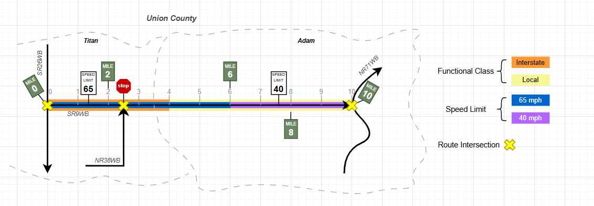 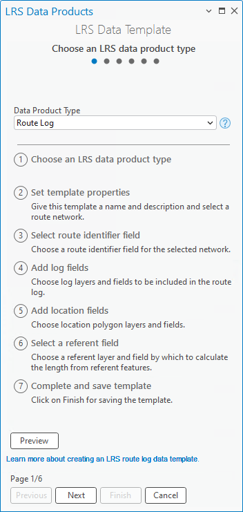  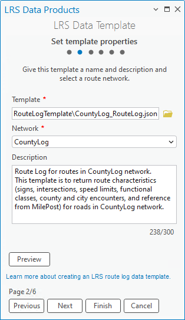 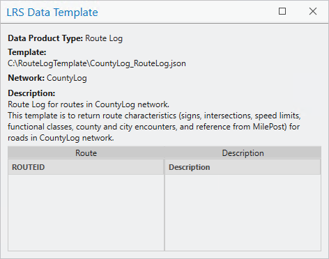 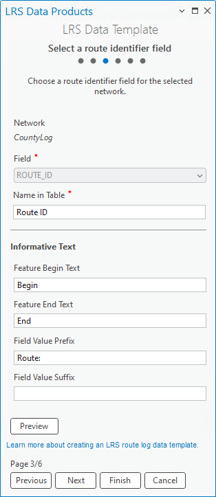 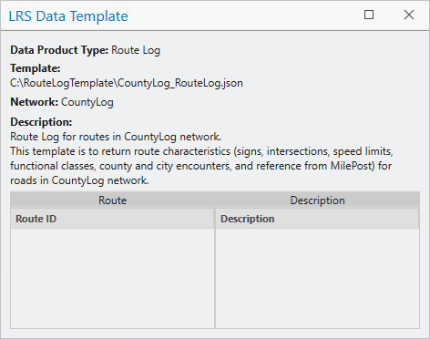 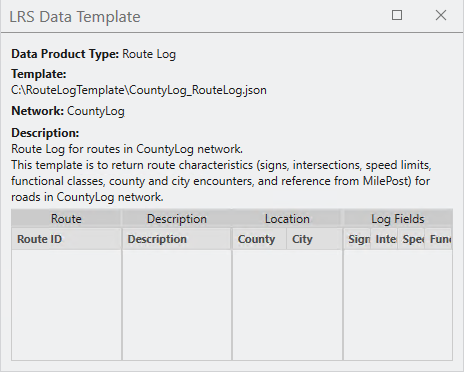 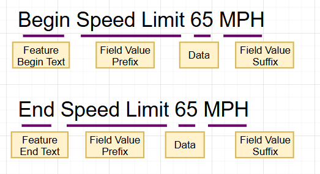 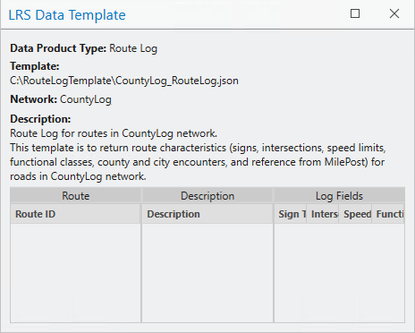 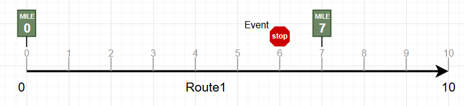 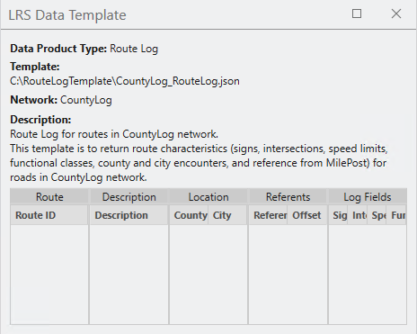
