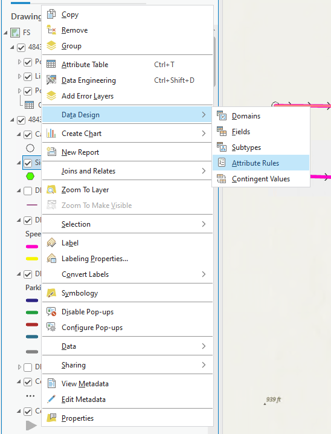
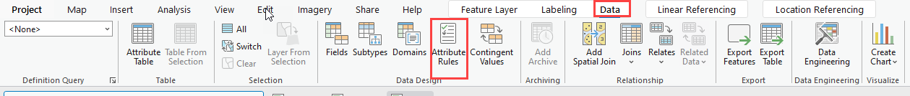
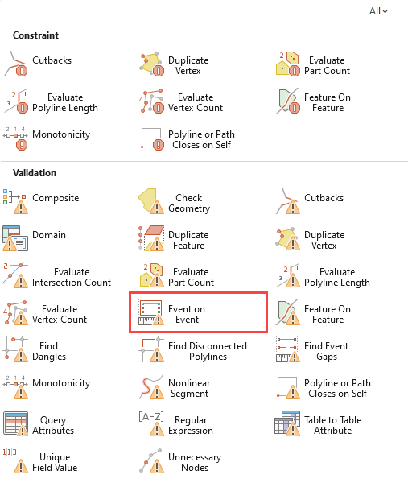
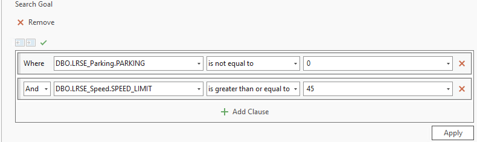
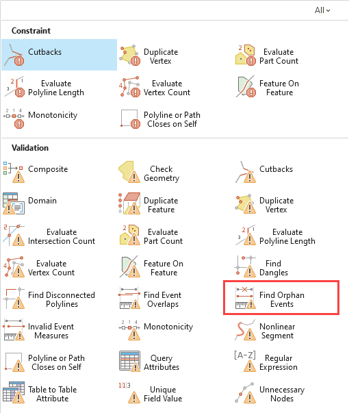
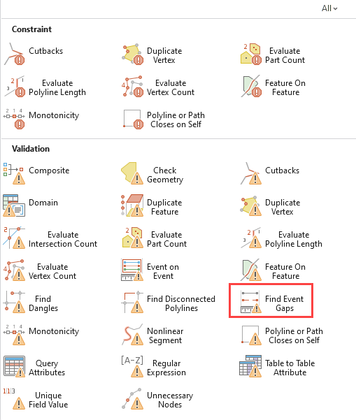
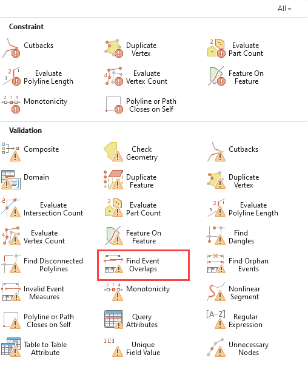
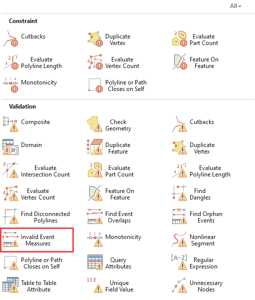
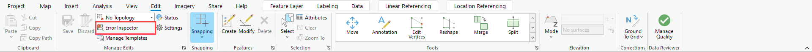
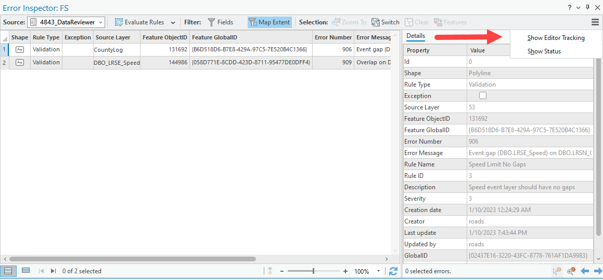

# Deployment Guide: Ready-to-Use LRS Checks Attribute Rules

|   |   |
| --- | --- |
| **Kind** | Other · Pro |
| **Release** | 3.1 |
| **Issue** | [ArcGISPro/ps-location-referencing#4843](https://devtopia.esri.com/ArcGISPro/ps-location-referencing/issues/4843) |
| **Source** | [4843-ProLRSChecksDeploymentDoc.docx](<https://esriis.sharepoint.com/sites/LocationReferencing/Shared%20Documents/General/4843-ProLRSChecksDeploymentDoc.docx>) |
| **Edited** | 2023-02-13 15:59 by Mac Christmas |
| **Extracted** | 2026-09-04 · lane `xmlstrip` |

<!-- metadata
```yaml
title: "Deployment Guide: Ready-to-Use LRS Checks Attribute Rules"
source_file: "4843-ProLRSChecksDeploymentDoc.docx"
source_url: "https://esriis.sharepoint.com/sites/LocationReferencing/Shared%20Documents/General/4843-ProLRSChecksDeploymentDoc.docx"
doc_id: 613
doc_kind: "Other"
surface: "Pro"
doc_revision: ""
target_release: "3.1"
pe: ""
dev: ""
author: "Mac Christmas"
last_edited_by: "Mac Christmas"
last_edited: "2023-02-13T15:59:00Z"
extracted: 2026-09-04
extraction_lane: xmlstrip
prompt_version: "v2.0.2"
keywords: ["attribute rules", "event checks", "validation", "feature service", "data reviewer", "event on event", "orphan events", "event gaps", "event overlaps", "invalid event measures"]
tools: ["Attribute Rules", "Data Reviewer", "Error Inspector"]
products: []
issues: ["ArcGISPro/ps-location-referencing#4843"]
related: [{"doc":875,"file":"esri-roads-and-highways-tutorial__doc875.md","s":2.559},{"doc":814,"file":"spike-attribute-rules-in-lrs__doc814.md","s":2.477},{"doc":185,"file":"spike-benchmark-overlay-events-in-gp-vs-api__doc185.md","s":2.211},{"doc":373,"file":"realign-event-behavior__doc373.md","s":2.19},{"doc":555,"file":"configure-attribute-sets__doc555.md","s":2.189}]
```
-->

## Summary

Guide for deploying ready-to-use LRS checks attribute rules focused on event checks within ArcGIS Pro. Describes configuration steps for various event validation rules and instructions for publishing data as a feature service with validation capabilities. Explains how to validate data using Data Reviewer and manage validation errors.

## Related documents

<!-- related:begin -->
- [Esri Roads and Highways Tutorial](<https://esriis.sharepoint.com/sites/lrsworkspace/LRS Doc Index/Other/esri-roads-and-highways-tutorial__doc875.md>) — similar text 0.30 · same kind/surface/folder <!-- rel:875 -->
- [Spike: Attribute Rules in LRS](<https://esriis.sharepoint.com/sites/lrsworkspace/LRS Doc Index/Design Spikes/spike-attribute-rules-in-lrs__doc814.md>) — similar text 0.11 · 2 title words · same surface/folder <!-- rel:814 -->
- [Spike Benchmark Overlay Events in GP vs API](<https://esriis.sharepoint.com/sites/lrsworkspace/LRS Doc Index/Design Spikes/spike-benchmark-overlay-events-in-gp-vs-api__doc185.md>) — similar text 0.07 · same surface/folder <!-- rel:185 -->
- [Realign Event Behavior](<https://esriis.sharepoint.com/sites/lrsworkspace/LRS Doc Index/User Stories/realign-event-behavior__doc373.md>) — similar text 0.06 · same surface/folder <!-- rel:373 -->
- [Configure Attribute Sets](<https://esriis.sharepoint.com/sites/lrsworkspace/LRS Doc Index/Other/configure-attribute-sets__doc555.md>) — similar text 0.20 · 1 title word · same kind/surface <!-- rel:555 -->
<!-- related:end -->

<!-- docs:begin -->
## Esri documentation

[Edit feature services](https://doc.esri.com/en/arcgis-pro/latest/help/production/location-referencing-pipelines/edit-feature-services.html)

_No page matched:_ [Attribute Rules](https://www.google.com/search?q=%22Attribute%20Rules%22+site%3Adoc.esri.com) · [Data Reviewer](https://www.google.com/search?q=%22Data%20Reviewer%22+site%3Adoc.esri.com) · [Error Inspector](https://www.google.com/search?q=%22Error%20Inspector%22+site%3Adoc.esri.com)
<!-- docs:end -->

---

## Deployment Guide: Ready-to-Use LRS Checks Attribute Rules
This doc will stand as a basic guide on how to deploy the LRS checks built by the Data Reviewer team within Pro.  See here for an informational poster of all the ready-to-use Attribute Rules.
While we can use most, if not all, of these ready-to-use rules with LRS data, this guide will focus on the “EVENTS CHECKS” section of the informational poster above.
These are the Event Checks available, as of Pro 3.1.  Some checks are set up on event layers, whereas others are set up on network layers.

- Event on Event (LRS Network Layer): Finds linear referenced events that overlay other events based on a user-defined relationship.
- Find Orphan Events (Line or Point Event Layer): Finds linear referenced events that have no association to a route feature.
- Find Event Gaps (LRS Network Layer): Finds linear referenced events with gaps between events of the same category, in the same route, or across multiple routes.
- Find Event Overlaps (Line Event Layer): Finds linear referenced events that have overlaps with events of the same category, in the same route, or across multiple routes.
- Invalid Event Measures (Line or Point Event Layer)*: Finds linear referenced events that contain invalid measure values in the same route or across multiple routes

*Note: Invalid Event Measures has a known limitation as of the Pro 3.1 release.  Events that are not drawn due to invalid measures will not be checked.  This is going to be fixed in the Pro 3.2 release.

## Ready to Use Attribute Rules Configuration
Here are the steps to access the Attribute Rule window.  Note that this setup can only occur in a File or Enterprise Geodatabase.  Once published as a Feature Service, the Attribute Rules will become read-only and cannot be edited.
Editor Tracking and Global IDs must be enabled for the layer for the Validation Attribute Rule to be saved.  An error message will appear when attempting to save if these capabilities are not configured.
Note: When a Validation Attribute Rule is created, Validation Error Layers will be added to the map and geodatabase where the event or LRS network layer resides.  These layers are used for the actual validation of the Attribute Rules, which will be discussed later.

- Decide on which LRS layer type you would like to create attribute rules for.
- From the Contents pane, right click the layer that will have attribute rules. Hover over Data Design, and then choose Attribute Rules from the list.  This can also be performed when right clicking the layer within the Catalog Pane.
- Alternatively, left click the layer you wish to set up Attribute Rules for and on the Pro Ribbon, click Data.  From this tab, Click Attribute Rules within the Data Design group.
- The Attribute Rules window will now open.  Notice how there are 3 different tabs, Calculation, Constraint, and Validation.  This guide will focus on Validation only.
- Click the Ready to Use Rules icon on the Attribute Rules tab.  Depending on the layer type that you have chosen (Event versus LRS Network layer) as well as the geometry type, different Ready to Use Attribute Rules will appear.
Now we will set up Ready to Use Attribute Rules by layer type.

### Event on Event (LRS Network Layer):

- Open the Attribute Rules window on a LRS Network Layer.
- From the Ready to Use drop down menu, left click Event on Event.
- A new rule record will appear on within the window, and the parameters will appear on the right of the window.  Note that you can resize the parameters to be easier to read.
- Notice that some parameters auto-populate. If this information is not correct, change the parameters to accurately reflect your data.
- Within the Check Parameters section, choose the events you would like to check from the Overlay Events parameter.  Check the checkboxes to select the event layer.
- Define a search goal.  This specified goal will be used to check the data for potential errors.  Click the New search goal button to begin creating a function.
- Select fields and values for chosen event layers to create a search goal.
- In the Details section, provide a Name, Description, and Severity level for the new rule.
- Click Save on the Attribute Rules tab on the Pro Ribbon, and the rule is now ready to use.
  - Example: If the speed limit is over or equal to 45 mph, then no parking is allowed.  Note that the input values are based upon the Coded Value Domain for the specified field (0 is the coded value for No Parking and 45 is the coded value for 45 mph).  The search checks for areas where parking is allowed and the speed limit is over 45mph.  This alerts the user that they need to fix the mistake within their data.

### Find Orphan Events (Line or Point Event Layer):

- Open the Attribute Rules window on a line or point event layer.
- From the Ready to Use drop down menu, left click on Find Orphan Events
- A new rule record will appear on within the window, and the parameters will appear on the right of the window.  Note that you can resize the parameters to be easier to read.
- Notice that some parameters auto-populate. If this information is not correct, change the parameters to accurately reflect your data.
- Within the Input Filters section, select a Subtype and/or create an attribute filter, if necessary.
- Within the Check Parameters section, ensure that all auto-populated Route information is correct.  If not, fix the inputs to accurately reflect your data.
- In the Details section, provide a Name, Description, and Severity level for the new rule.
- Click Save on the Attribute Rules tab on the Pro Ribbon, and the rule is now ready to use.
  - Example: An LRS user configures this rule for their Anomaly Point layer.  With this check active, any erroneous created events that do not have their route identifier field populated will be flagged for the user to fix.

### Find Event Gaps (LRS Network Layer):

- Open the Attribute Rules window on a LRS Network Layer.
- From the Ready to Use drop down menu, left click on Find Event Gap.
- A new rule record will appear on within the window, and the parameters will appear on the right of the window.  Note that you can resize the parameters to be easier to read.
- Notice that some parameters auto-populate. If this information is not correct, change the parameters to accurately reflect your data.
- Within the Input Filters section, select a Subtype and/or create an attribute filter, if necessary.
- Within the Event Properties section, choose the line event you wish to check for gaps.
- Once a line event is chosen, the other parameters of this section will auto-populate. If this information is not correct, change the parameters to accurately reflect your data.
- In the Details section, provide a Name, Description, and Severity level for the new rule.
- Click Save on the Attribute Rules tab on the Pro Ribbon, and the rule is now ready to use.
  - Example: A user sets this rule on their Speed layer.  This will ensure that there are no gaps on the routes within the network that the layer is found, as all roads should have a speed limit event.  Note that this check not only checks the event geometry for gaps, but also temporally for gaps in time where no event is found.

### Find Event Overlaps (Line Event Layer):

- Open the Attribute Rules window on a line event layer.
- From the Ready to Use drop down menu, left click Find Event Overlaps.
- A new rule record will appear on within the window, and the parameters will appear on the right of the window.  Note that you can resize the parameters to be easier to read.
- Notice that some parameters auto-populate. If this information is not correct, change the parameters to accurately reflect your data.
- Within the Input Filters section, select a Subtype and/or create an attribute filter, if necessary.
- In the Details section, provide a Name, Description, and Severity level for the new rule.
- Click Save on the Attribute Rules tab on the Pro Ribbon, and the rule is now ready to use.
  - Example: A user configures this rule with the OperatingPressure line event layer.  This check will ensure that there are no overlaps upon the line event layer.  The user can then investigate the error and choose how to proceed.

### Invalid Event Measures (Line or Point Event Layer):

- Open the Attribute Rules window on a line or point event layer.
- From the Ready to Use drop down menu, left click Invalid Event Measures.
- A new rule record will appear on within the window, and the parameters will appear on the right of the window.  Note that you can resize the parameters to be easier to read.
- Notice that some parameters auto-populate. If this information is not correct, change the parameters to accurately reflect your data.
- Within the Input Filters section, select a Subtype and/or create an attribute filter, if necessary.
- In the Details section, provide a Name, Description, and Severity level for the new rule.
- Click Save on the Attribute Rules tab on the Pro Ribbon, and the rule is now ready to use.
  - Example: A user configures this check with their DOT_Class line event layer.  This check will search for any DOT_Class events that have an invalid measure.  The user can then review the area and fix the measures upon the event.

### Publish Data as Feature Service
Now that the LRS data has been configured with Validation Attribute Rules, we’re ready to publish the data as a Feature Service.  When we publish, we must ensure that our data is published with Linear Referencing, Version Management, and Validation Capabilities.
We must also ensure that the Validation error layers are found within the map.  These layers will be added to the map and geodatabase upon the creation of the first Validation Attribute Rule.  If these layers are not present in the map that will be published, an error message will appear that they are not within the map.  Add them from the Enterprise Geodatabase into the map to publish to resolve this error.
These layers can also be added to the map by right clicking on a layer with Validation Attribute Rules, and clicking Add Error Layers.

### Validate Data using Data Reviewer
Once the Feature Service has been added to a map, we can now begin to validate and fix potential errors within our data.  Follow these steps to validate your data:

- On the Edit tab within the Pro Ribbon, click on the Error Inspector icon within the Manage Edits group.
- The Error Inspector window will appear for the active map.
- For ease of use, click on the overflow menu in the top right of the window, and click Show Status.  This will allow the user to see whether the rule violation has been reviewed yet
- Consider these options before evaluating the rules:
  - Filter: We can set a filter for what rules we want to show in the window.  We can filter by Severity, Rule Type, Exception, and Geometry Type.
  - Map Extent: Enabling or disabling this icon will change whether the validation records are updated based upon the map extent.  As you pan or zoom around the map, the records will change to reflect the current map view.
  - Selection: These are the general selection tools that allow us to select validation records.
    - We can use the Features icon to change the selection from the validation layer to the actual LRS feature that has violated a Validation Rule.
- To evaluate the configured rules, we will click Evaluate Rules.  If we click the carrot icon next to Evaluate Rules, options appear to change how we evaluate the rules.
  - Rule Type:
    - Batch Calculation: This will calculate any Calculation Attribute Rules that are configured as batch calculation.
    - Validation: This will evaluate Validation Rules we have configured.  We want this checkbox to be checked.
  - Extent:
    - Visible Extent will only check the area visible within the map frame.
    - Full extent will evaluate the full extent of the data within the map.
  - Options:
    - Modified in this version: This will only evaluate features modified in the current version.
    - Execute asynchronously: Executes Evaluate Rules on the service asynchronously.  This uses the ValidationTools geoprocessing service which allows for long-running processes.
- Once these options have been configured, we will click Evaluate Rules.  The features that violate the rules we have set will appear as records in the Error Inspector.
- From here, we can review the rules and decide how to proceed.
  - If the feature needs to be fixed, we can select and zoom to it to view the error area.  Once we have decided how to move forward, we fix the error as needed and the Phase of the error will change from the red X icon to a green check icon.
  - If the feature does not need to be fixed, we can check the Exception box and it will be marked as an exception to our rule.
For more info, visit here to visit the Data Reviewer help documentation.

         
