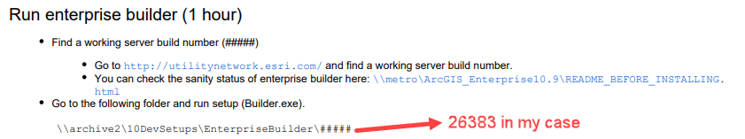

# Developer Server Setup Notes

| Field | Value |
| --- | --- |
| **Doc** | 734 · Other · Server |
| **Product** | — |
| **Release** | — |
| **Issues** | — |
| **Source** | [DeveloperServerSetup_Notes.docx](<https://esriis.sharepoint.com/sites/LocationReferencing/Shared%20Documents/LR%20Developers/DeveloperServerSetup_Notes.docx>) |
| **People** | author Sharon Lai · PE — · dev — |
| **Edited** | 2021-02-05 01:20 by Sharon Lai |
| **Extracted** | 2026-09-04 · lane xmlstrip · format 3.0 · prompt v2.0.2 |
| **Keywords** | location referencing core · build process · dll deployment · server setup |
| **Tools** | — |

## Summary

Instructions for building the Location Referencing core solution after running the GetBuildServer.bat script. Explains that copying the LocationReferencingCore.dll manually is no longer necessary due to unified bin locations.

## Related documents

<!-- related:begin -->
- [Developer Server Setup](<https://esriis.sharepoint.com/sites/lrsworkspace/LRS Doc Index/Other/developer-server-setup.md>) — similar text 0.10 · 3 title words · 3 filename words · same kind/folder <!-- rel:735 s=4.997 -->
<!-- related:end -->

---

After running the GetBuildServer.bat, we open just the X:\ArcGIS\PS-Products\LocationReferencing\LocationReferencing\LocRefCore\LocRefCore.sln to build and no longer need to copy and paste LocationReferencingCore.dll from one place to the other because X:\arcgis\bin\ and C:\ArcGIS\framework\runtime\ArcGIS\bin are the same location.

