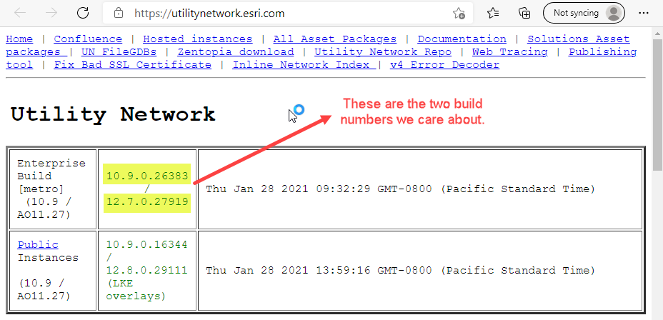
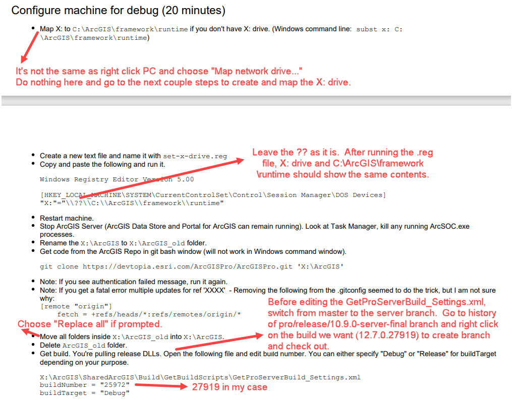

# Developer Server Setup Notes

|   |   |
| --- | --- |
| **Kind** | Other · Server |
| **Release** | — |
| **Source** | [DeveloperServerSetup_Notes.docx](<https://esriis.sharepoint.com/sites/LocationReferencing/Shared%20Documents/LR%20Developers/DeveloperServerSetup_Notes.docx>) |
| **Edited** | 2021-02-05 01:20 by Sharon Lai |
| **Extracted** | 2026-09-04 · lane `xmlstrip` |

<!-- metadata
```yaml
title: "Developer Server Setup Notes"
source_file: "DeveloperServerSetup_Notes.docx"
source_url: "https://esriis.sharepoint.com/sites/LocationReferencing/Shared%20Documents/LR%20Developers/DeveloperServerSetup_Notes.docx"
doc_id: 734
doc_kind: "Other"
surface: "Server"
doc_revision: ""
target_release: ""
pe: ""
dev: ""
author: "Sharon Lai"
last_edited_by: "Sharon Lai"
last_edited: "2021-02-05T01:20:00Z"
extracted: 2026-09-04
extraction_lane: xmlstrip
prompt_version: "v2.0.2"
keywords: ["location referencing core", "build process", "dll deployment", "server setup"]
tools: []
products: []
issues: []
related: [{"doc":735,"file":"developer-server-setup__doc735.md","s":4.997}]
```
-->

## Summary

Instructions for building the Location Referencing core solution after running the GetBuildServer.bat script. Explains that copying the LocationReferencingCore.dll manually is no longer necessary due to unified bin locations.

## Related documents

<!-- related:begin -->
- [Developer Server Setup](<https://esriis.sharepoint.com/sites/lrsworkspace/LRS Doc Index/Other/developer-server-setup__doc735.md>) — similar text 0.10 · 3 title words · 3 filename words · same kind/folder <!-- rel:735 -->
<!-- related:end -->

---

After running the GetBuildServer.bat, we open just the X:\ArcGIS\PS-Products\LocationReferencing\LocationReferencing\LocRefCore\LocRefCore.sln to build and no longer need to copy and paste LocationReferencingCore.dll from one place to the other because X:\arcgis\bin\ and C:\ArcGIS\framework\runtime\ArcGIS\bin are the same location.

  
