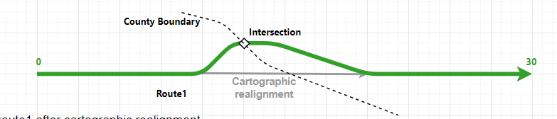
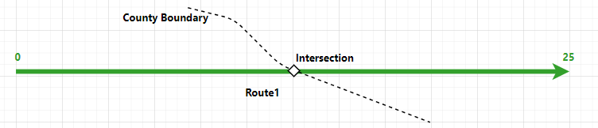
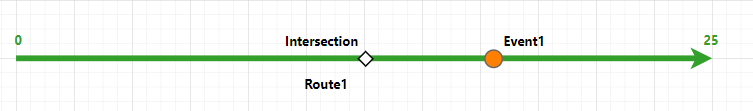
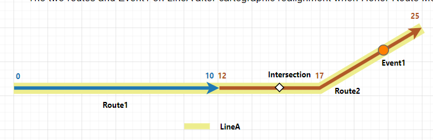
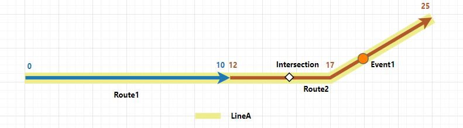

# Event behavior for cartographic realignment

| Field | Value |
| --- | --- |
| **Doc** | 382 · Other · Pro |
| **Product** | — |
| **Release** | — |
| **Issues** | — |
| **Source** | [cartorealignRH.new.docx](<https://esriis.sharepoint.com/sites/LocationReferencing/Shared%20Documents/General/Doc%20Reviews/5748_EB_topics/cartorealignRH.new.docx>) |
| **People** | author — · PE — · dev — |
| **Edited** | 2024-04-17 01:44 by unknown |
| **Extracted** | 2026-09-04 · lane xmlstrip · format 3.0 · prompt v2.0.2 |
| **Keywords** | cartographic realignment · event behavior · route geometry · event update · referent location · route measure · line network · event referent |
| **Tools** | Apply Event Behaviors · Generate Intersections |

## Summary

This document explains the effects of cartographic realignment on route geometry and associated event behaviors in a linear referencing system. It details how events are updated based on configured behaviors such as Honor Route Measure and Honor Referent Location when route measures change. Examples illustrate the before and after states of routes and events during cartographic realignment, including scenarios with routes spanning line networks.

## Related documents

<!-- related:begin -->
- [Event behavior for cartographic realignment](<https://esriis.sharepoint.com/sites/lrsworkspace/LRS Doc Index/Other/eb-for-cartographic-realignment-2024-04-2.md>) — similar text 0.84 · 4 title words · 1 filename word · same kind/surface/folder <!-- rel:383 s=8.105 -->
- [Event behavior for cartographic realignment](<https://esriis.sharepoint.com/sites/lrsworkspace/LRS Doc Index/Other/eb-for-cartographic-realignment-2024-04-3.md>) — similar text 0.73 · 4 title words · 1 filename word · same kind/surface/folder <!-- rel:386 s=7.594 -->
- [Event Behavior for Cartographic Realignment](<https://esriis.sharepoint.com/sites/lrsworkspace/LRS Doc Index/Other/eb-for-cartographic-realignment-2024-04-4.md>) — similar text 0.74 · 4 title words · 1 filename word · same kind/surface/folder <!-- rel:387 s=7.352 -->
- [Event behavior for cartographic realignment](<https://esriis.sharepoint.com/sites/lrsworkspace/LRS Doc Index/Other/eb-for-cartographic-realignment-rh-2024-03.md>) — similar text 0.72 · 4 title words · 1 filename word · same kind/surface <!-- rel:406 s=6.398 -->
- [Event behavior for cartographic realignment](<https://esriis.sharepoint.com/sites/lrsworkspace/LRS Doc Index/Other/eb-for-cartographic-realignment-apr-2024-03.md>) — similar text 0.72 · 4 title words · 1 filename word · same kind/surface <!-- rel:407 s=6.394 -->
<!-- related:end -->

<!-- docs:begin -->
## Esri documentation

[Apply cartographic realignment](https://doc.esri.com/en/arcgis-pro/latest/help/production/location-referencing-pipelines/apply-cartographic-realignment.html) · [Event behavior](https://doc.esri.com/en/arcgis-pro/latest/help/production/location-referencing-pipelines/what-is-event-behavior.html) · [Configure continuous measure networks and events to update with an engineering network](https://doc.esri.com/en/arcgis-pro/latest/help/production/location-referencing-pipelines/configure-continuous-measure-networks-and-events-to-update-with-an-engineering-network.html) · [Storing referent and offset information for event location](https://doc.esri.com/en/arcgis-pro/latest/help/production/location-referencing-pipelines/storing-referent-and-offset-information-for-event-location.html)

_No page matched:_ [Apply Event Behaviors](https://www.google.com/search?q=%22Apply%20Event%20Behaviors%22+site%3Adoc.esri.com) · [Generate Intersections](https://www.google.com/search?q=%22Generate%20Intersections%22+site%3Adoc.esri.com)
<!-- docs:end -->

---

## Event behavior for cartographic realignment
Cartographic realignment is the method of updating the route geometry based on aerial imagery, as-built drawings, or input from field data collectors. To do this, you can directly modify the centerline that is associated with the route.
Learn more about applying cartographic realignment
Note:
Events are not updated until the Apply Event Behaviors tool is run after route edits. If you are using conflict prevention on branch versioned data, you are prompted to run Apply Event Behaviors before posting to the default version.

### Cartographic realignment scenario
When cartographic realignment occurs, events are impacted depending on the configured event behavior for each event layer. The following are the results of running the Apply Event Behaviors tool on event features:

| Behavior | Description |
| --- | --- |
| Honor Route Measure | Preserves the measure of the event and changes shape according to the route. |
| Honor Referent Location | Changes both measure and geographic location to maintain the referent location of the event using a persistent offset value. |

Note:
When Update route measures in cartographic realignment is enabled in a network in which cartographic realignment is performed, the route's measures can change after cartographic realignment. Subsequently, the configured cartographic realignment event behavior and calibrate event behavior are both applied to events in impacted sections on the route.
You can review the configured event behaviors per edit type by viewing LRS event properties.
For all examples in this topic, Update route measures in cartographic realignment is enabled.

### Route cartographic realignment results
In this example, the route Route1 is active from 1/1/2000. The cartographic realignment is set to occur on 1/1/2005 where an incorrect curve is fixed. Route1's measures adjust to its new geometry as Update route measures in cartographic realignment is enabled for the network. The graphics and tables in the following sections demonstrate the route information before and after the cartographic realignment.

#### Before route cartographic realignment
The following image shows the route before cartographic realignment. There is an intersection on Route1 where Route1 intersects the County boundary. The intersection is the referent location in the Honor Referent Location event behavior scenario below.
The following table provides details about the route and intersection before cartographic realignment:

| Route ID | From Date | To Date | From Measure | To Measure |
| --- | --- | --- | --- | --- |
| Route1 | 1/1/2000 | <Null> | 0 | 30 |

| Intersection ID | From Date | To Date | Route ID | Measure |
| --- | --- | --- | --- | --- |
| Intersection | 1/1/2000 | <Null> | Route1 | 12 |

#### After route cartographic realignment
The following image shows the route and intersection after cartographic realignment:

The following tables provides details about the route and intersection after cartographic realignment:

| Route ID | From Date | To Date | From Measure | To Measure |
| --- | --- | --- | --- | --- |
| Route1 | 1/1/2000 | <Null> | 0 | 25 |

| Intersection ID | From Date | To Date | Route ID | Measure |
| --- | --- | --- | --- | --- |
| Intersection | 1/1/2000 | <Null> | Route1 | 1 3 |

Note:
When the centerlines are edited, all routes in all networks, across all times, are modified accordingly. Hence, Route1 does not get a new time slice, but its shape is changed in the existing time slice.
The intersection's shape and measure are also updated after running Generate Intersections. The intersection does not get a new time slice as because its associated route does not time slice.

#### Events before route cartographic realignment
There is a point event on Route1 and it has a starting date (From Date) of 1/1/2000. The following image shows the route and event before cartographic realignment:

The following tables provide details about the event before cartographic realignment:

| Event | Route ID | From Date | To Date | Measure |
| --- | --- | --- | --- | --- |
| Event1 | Route1 | 1/1/2000 | <Null> | 1 7 |

The following sections detail how event behavior rules are enforced after running the Apply Event Behaviors tool with this route cartographic realignment scenario.
Note:
For a line event, its start and end points follow the same cartographic realignment event behavior as a point event.

#### Honor Route Measure behavior
If the Update route measures in cartographic realignment parameter is enabled for the network and the route's measures are updated due to cartographic realignment, the resulting event behavior will be a combined behavior of the cartographic realignment behavior and the calibrate behavior. Events in the cartographic realignment area will move proportionally.
Note:
If the route measures have not changed because the Update route measures in cartographic realignment parameter is disabled for the network, the Honor Route Measure event behavior preserves the measures of the event and updates the event's location.
The following table shows the edit activities involved in the route edit and their corresponding event behaviors:

| Edit activity | Event behavior |
| --- | --- |
| Cartographic realignment | Honor Route Measure |
| Calibrate | Stay Put |

The route cartographic realignment described above has the following effects:

- Event1 was located on Route1 at measure 17. Because it is within cartographic realignment and the route's measures have changed, both the cartographic realignment Honor Route Measure and the calibrate Stay Put behaviors are applied. Event1's measure is updated proportionally to be at measure 14.2 on Route1, and its location is also updated to stay on Route1.
The following image shows the route and event after cartographic realignment:

Note:
Because cartographic realignment does not change a route's time slice, the time slices of the event on the route are notdoesn’t changed either.
The following tables provides details about the event after cartographic realignment:

| Event | Route ID | From Date | To Date | Measure |
| --- | --- | --- | --- | --- |
| Event1 | Route1 | 1/1/2000 | <Null> | 1 4.2 |

#### Honor Referent Location behavior
The Honor Referent Location event behavior preserves the referent offset of the event and updates the event's geographic location and measures.
Events can have event referent fields to derive its location using referent location information. The following referent locations can be stored:

- Offset distance from any point feature in the geodatabase
- Offset distance from an intersection point feature
- Offset distance from a point event feature
- Offset distance from an x,y coordinate
- Offset distance from a station
The following table shows the edit activities involved in the route edit and their corresponding event behaviors:

| Edit activity | Event behavior |
| --- | --- |
| Cartographic realignment | Honor Referent Location |
| Calibrate | Stay Put |

The following table shows referent fields in Event1:

| Event | Route ID | Ref Location | Ref Offset |
| --- | --- | --- | --- |
| Event1 | Route1 | Intersection | 5 |

The route cartographic realignment described above has the following effects:

- Event1 was located 5 miles downstream of the intersection on Route1, resulting in a measure of 17. After the cartographic realignment is applied, the intersection's measure is updated to 13 on Route1. When the cartographic realignment Honor Referent Location behavior is applied to Event1, it is still locateds 5 miles downstream of the intersection. The measure of Event1 is updated to 18 on Route1.
The following image shows the route and event after cartographic realignment:
Note:
Because cartographic realignment does not change a route's time slice, the time slices of the event on the route are notdoesn’t changed either.
The following tables provides details about the event after cartographic realignment:

| Event | Route ID | From Date | To Date | Measure |
| --- | --- | --- | --- | --- |
| Event1 | Route1 | 1/1/2000 | <Null> | 1 8 |

### Cartographic realignment on routes in a line network with events that span routes
Routes in a line network can also be cartographically realigned by modifying the associated centerline.
In the following example, there are two routes on LineA and the routes are active from 1/1/2000. The cartographic realignment is set to occur on 1/1/2005 from the middle to the end of Route2. Route2's measures adjust to its new geometry because Update route measures in cartographic realignment is enabled for the network. The graphics and tables in the following sections demonstrate the route information before and after the cartographic realignment.

#### Before route cartographic realignment
The following image shows the routes before cartographic realignment. There is an intersection on Route2 where Route2 intersects the County boundary. The intersection is the referent location in the Honor Referent Location event behavior scenario below.

Note:
The length of cartographic realignment is 1.3 times longer than the part of the route being cartographically realigned.
The following table provides details about the route and intersection before cartographic realignment:

| Route Name | Line Name | Line Order | From Date | To Date | From Measure | To Measure |
| --- | --- | --- | --- | --- | --- | --- |
| Route1 | LineA | 100 | 1/1/2000 | <Null> | 0 | 10 |
| Route2 | LineA | 200 | 1/1/2000 | <Null> | 12 | 22 |

| Intersection ID | From Date | To Date | Route ID Name | Measure |
| --- | --- | --- | --- | --- |
| Intersection | 1/1/2000 | <Null> | Route2 | 15 |

#### After route cartographic realignment
The following image shows the route and intersection after cartographic realignment:

The following table provides details about the routes and intersection after cartographic realignment:

| Route Name | Line Name | Line Order | From Date | To Date | From Measure | To Measure |
| --- | --- | --- | --- | --- | --- | --- |
| Route1 | LineA | 100 | 1/1/2000 | <Null> | 0 | 10 |
| Route2 | LineA | 200 | 1/1/2000 | <Null> | 12 | 25 |

| Intersection ID | From Date | To Date | Route ID Name | Measure |
| --- | --- | --- | --- | --- |
| Intersection | 1/1/2000 | <Null> | Route2 | 15 |

Note:
When the centerlines are edited, all routes in all networks, across all times, are modified accordingly. Hence, Route2 does not get a new time slice, but its shape is changed in the existing time slice.

#### Events before route cartographic realignment
There is a point event on Route2 and it has a start date of 1/1/2000. The following image shows the routes and event before cartographic realignment:

The following tables provide details about the event before cartographic realignment:

| Event | Route Name | From Date | To Date | Measure |
| --- | --- | --- | --- | --- |
| Event1 | Route2 | 1/1/2000 | <Null> | 20 |

The following sections detail how event behavior rules are enforced after running the Apply Event Behaviors tool under this route cartographic realignment scenario.
Note:
For a line event, its start and end points follow the same cartographic realignment event behavior as a point event.

#### Honor Route Measure behavior
If the Update route measures in cartographic realignment parameter is enabled for the network and the route measures are updated due to cartographic realignment, the resulting event behavior will be a combined behavior of the cartographic realignment behavior and the calibrate behavior. Events in the cartographic realignment area will move proportionally.
Note:
If the route measures have not changed because the Update route measures in cartographic realignment parameter is disabled for the network, the Honor Route Measure event behavior preserves the measures of the event and updates the event's location.
The following table shows the edit activities involved in the route edit and their corresponding event behaviors:

| Edit activity | Event behavior |
| --- | --- |
| Cartographic realignment | Honor Route Measure |
| Calibrate | Stay Put |

The route cartographic realignment described above has the following effects:

- Event1 was located on Route2 at measure 20. Because it is within cartographic realignment and the route's measures have changed, both the cartographic realignment Honor Route Measure and the calibrate Stay Put behaviors are applied. Event1's measure is updated proportionally to be at measure 22.4 on Route2, and its location is also updated to stay on Route2.
The following image shows the routes and event after cartographic realignment:

Note:
Because cartographic realignment does not change a route's time slice, the time slices of the event on the route are notdoesn’t changed either.
The following tables provides details about the event after cartographic realignment:

| Event | Route Name | From Date | To Date | Measure |
| --- | --- | --- | --- | --- |
| Event1 | Route | 1/1/2000 | <Null> | 22.4 |

#### Honor Referent Location behavior
The Honor Referent Location event behavior preserves the referent offset of the event and updates the event's geographic location and measures.
Events can have event referent fields to derive its location using referent location information. The following referent locations can be stored:

- Offset distance from any point feature in the geodatabase
- Offset distance from an intersection point feature
- Offset distance from a point event feature
- Offset distance from an x,y coordinate
- Offset distance from a station
The following table shows the edit activities involved in the route edit and their corresponding event behaviors:

| Edit activity | Event behavior |
| --- | --- |
| Cartographic realignment | Honor Referent Location |
| Calibrate | Stay Put |

The following table shows referent fields in Event1:

| Event | Route ID | Ref Location | Ref Offset |
| --- | --- | --- | --- |
| Event1 | Route2 | Intersection | 5 |

The route cartographic realignment described above has the following effects:

- Event1 was located 5 miles downstream of the intersection on Route2, resulting in a measure of 20. After the cartographic realignment is applied, it is still locateds 5 miles downstream of the intersection which is measure 20 on Route2. The location of Event1 is updated to stay on Route2.
The following image shows the route and event after cartographic realignment:
The following tables provides details about the event after cartographic realignment:

| Event | Route Name | From Date | To Date | Measure |
| --- | --- | --- | --- | --- |
| Event1 | Route 2 | 1/1/2000 | <Null> | 20 |

