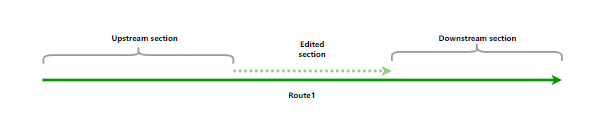
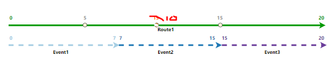
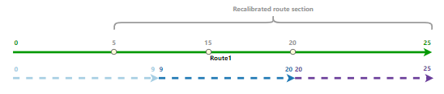
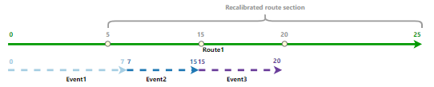
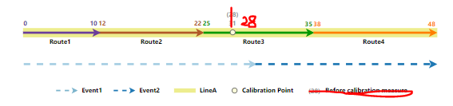

# Event Behavior for Route Calibration

| Field | Value |
| --- | --- |
| **Doc** | 449 · Other · Pro |
| **Product** | Roads & Highways |
| **Release** | — |
| **Issues** | — |
| **Source** | [compare_calibrate_RH.docx](<https://esriis.sharepoint.com/sites/LocationReferencing/Shared%20Documents/General/Doc%20Reviews/5581_calibrate_behavior/compare_calibrate_RH.docx>) |
| **People** | author Claire Wang · PE — · dev — |
| **Edited** | 2023-11-28 20:22 by Claire Wang |
| **Extracted** | 2026-09-04 · lane xmlstrip · format 3.0 · prompt v2.0.2 |
| **Keywords** | route calibration · event behavior · calibration point · stay put · move · retire · line network · time slice |
| **Tools** | Apply Event Behaviors |

## Summary

This document explains how route calibration affects events in a linear referencing system, detailing the behaviors Stay Put, Move, and Retire. It describes the impact of calibration on events upstream, downstream, and crossing calibration points, including scenarios for routes in a line network with spanning events. The document includes examples, tables, and explanations of event behavior before and after calibration.

## Related documents

<!-- related:begin -->
- [Event Behavior for Route Calibration](<https://esriis.sharepoint.com/sites/lrsworkspace/LRS Doc Index/Other/eb-for-route-calibration-apr-2023-11.md>) — similar text 0.92 · 4 title words · 2 filename words · same kind/surface/folder <!-- rel:446 s=8.396 -->
- [Event Behavior for Route Calibration](<https://esriis.sharepoint.com/sites/lrsworkspace/LRS Doc Index/Other/eb-for-route-calibration-rh-2023-11.md>) — similar text 0.82 · 4 title words · 1 filename word · same kind/surface/folder <!-- rel:447 s=7.615 -->
- [Event Behavior for Route Calibration](<https://esriis.sharepoint.com/sites/lrsworkspace/LRS Doc Index/Other/eb-for-route-calibration-apr-2023-11-2.md>) — similar text 0.82 · 4 title words · 1 filename word · same kind/surface/folder <!-- rel:448 s=7.612 -->
- [Event Behavior for Route Retirement](<https://esriis.sharepoint.com/sites/lrsworkspace/LRS Doc Index/Other/eb-for-route-retirement-2024-02-2.md>) — similar text 0.51 · 3 title words · 1 filename word · same kind/surface <!-- rel:425 s=5.63 -->
- [Event Behavior for Route Retirement](<https://esriis.sharepoint.com/sites/lrsworkspace/LRS Doc Index/Other/eb-for-route-retirement-apr-2024-01-2.md>) — similar text 0.62 · 3 title words · same kind/surface <!-- rel:443 s=5.618 -->
<!-- related:end -->

<!-- docs:begin -->
## Esri documentation

[Event behavior](https://doc.esri.com/en/arcgis-pro/latest/help/production/roads-highways/what-is-event-behavior.html) · [Retire routes](https://doc.esri.com/en/arcgis-pro/latest/help/production/roads-highways/retire-routes.html)

_No page matched:_ [Apply Event Behaviors](https://www.google.com/search?q=%22Apply%20Event%20Behaviors%22+site%3Adoc.esri.com)
<!-- docs:end -->

---

## Event behavior for route calibration
When route calibration occurs, events are impacted, depending on the configured event behavior for each event layer.
Note:
Events are not updated until the Apply Event Behaviors tool is run after route edits. If you are using conflict prevention on branch versioned data, you are prompted to run Apply Event Behaviors before posting to the default version.
Calibration can occur on a route when one or more calibration points are added, edited, deleted, or when recalibration downstream is selected for LRS route editing tools.
Calibration point changes can be made using Location Referencing tab calibration tools, by creating or editing calibration points using create features in ArcGIS Pro, by using Apply downstream recalibration in Location Referencing route editing tools, or by checking the Record calibration changes for event location updates option when running the Generate Routes tool.
The route calibration and corresponding event behaviors are described below.

### Route calibration scenario
This route calibration scenario involves one route with two existing calibration points. A calibration point at existing measure 10 is changed to 15, resulting in recalibrated measures downstream.

#### Stay Put behavior
The geographic location of the event is maintained; the measures can change.

#### Move behavior
The measures from the event are maintained; the geographic location can change.

#### Retire behavior
The geographic location and measures are maintained; the event retires.

A route can be calibrated at any location on the route.

#### Upstream and downstream sections
Route editing impacts upstream and downstream sections differently.
Refer to the following diagrams to understand the upstream and downstream section for the route calibration scenario:

The following table details how the calibration editing activity impacts upstream and downstream events according to the configured event behavior:

| Behavior | Events upstream of calibration point edit | Events crossing calibration point edit | Events downstream of calibration point edit |
| --- | --- | --- | --- |
| Stay Put | Measures on an event update to maintain the geographic location if the event crosses the section between the edited calibration point and the nearest upstream calibration point. | Measures on an event update to maintain the geographic location of the event. | Measures on an event update to maintain the geographic location of the event. If the event crosses the section between the edited calibration point and the nearest upstream calibration point, measures update due to calibration point values changing. |
| Move | The event polyline shape updates to the new location of measures on the route if the event crosses the section between the edited calibration point and the nearest upstream calibration point. | The event polyline shape is updated to the new location of measures on the route. | The event polyline shape is updated to the new location of measures on the route if crossing a section of the route with a calibration point with measures is updated. |
| Retire | The event retires if the event crosses the section between the edited calibration point and the nearest upstream calibration point. | The event retires; line events crossing the edited calibration point are not split. | The event retires if the event crosses a section of the route with a calibration point with measures updated. |

Note:

- Point events follow the same behavior as line events but don't need to be split.
- If the option to  https://pro.arcgis.com/en/pro-app/3.2/help/production/roads-highways/reassign-routes.htm  \h recalibrate route downstream is selected, calibrate route event behaviors are applied to the events downstream of the edited portion of the route.
The network can contain events that span routes in a  https://prodev.arcgis.com/en/pro-app/3.2/help/production/location-referencing-pipelines/essential-pipeline-referencing-vocabulary.htm  \h line network. The behaviors are still applied in the same manner.

- Since the LRS is  https://pro.arcgis.com/en/pro-app/3.2/help/production/roads-highways/time-awareness-in-roads-and-highways.htm \h time aware https://pro.arcgis.com/en/pro-app/3.1/help/production/roads-highways/time-awareness-in-roads-and-highways.htm \h time aware, edit activities, such as calibrating or retiring a route result in, time-sliced slices routes and events.
- If the route is calibrated the same day that it's created and the event behavior for calibrate is set to retire, the events are deleted and not retired.

#### Detailed behaviorRoute Calibration results
The following sections detail how event behavior rules are enforced when a routeIn this example, the route Route1 is calibrated.

#### Stay Put event behavior
active from 1/1/2000. The calibration is set to occur on 1/1/2005 where A calibration point is added to the route at existing measure 10 with an effective date of 1/1/2000. is changed to 15, resulting in recalibrated measures downstream. The added calibration point has a new measure of 15 with recalibrate downstream applied and an effective date of 1/1/2005. This calibration has the following effects:graphics and tables below demonstrate the route information before and after the calibration.

#### Before route calibration
The following image shows the route before calibration: (create this graphic by 1. removing the events; 2. Changing the orange measure 15 to 10 and making the text size and color match 5 and 15; 3. Changing the orange dot to a white dot that matches the other calibration point symbology)

The following table provides details about the route before calibration:

| Route ID | From Date | To Date | From Measure | To Measure |
| --- | --- | --- | --- | --- |
| Route1 | 1/1/2000 | <Null> | 0 | 20 |

#### After route calibration
The following image shows the route after calibration:
Event1 is represented by two time slices because the route
Note:
The recalibrated tosection starts from the nearest upstream calibration point withof the edited calibration point to the end of calibration.
The following table provides details about the route after calibration:

| Route ID | From Date | To Date | From Measure | To Measure |
| --- | --- | --- | --- | --- |
| Route1 | 1/1/2000 | 1/1/2005 | 0 | 20 |
| Route1 | 1/1/2005 | <Null> | 0 | 25 |

#### Events before route calibration

- There are three events on Route1 and all of them have a From Date of 1/1/2000. The following image shows the route and events before calibration: (create this graphic by 1. Changing the orange measure 5. There is a time slice from 1/1/2000 to 1/1/2005 with the original measures from 0 to 7, and a time slice from 1/1/2005 to <Null> that stays in the same location geographically but has the new measures 015 to 9 of Route1.10 and making the text size and color match 5 and 15; 2. Changing the orange dot to a white dot that matches the other calibration point symbology)
- Event2 is represented by two time slices because it crosses the location where the recalibration took place on the route. There is a time slice from 1/1/2000 to 1/1/2005 with the original measures from 7 to 15, and a time slice from 1/1/2005 to <Null> that stays in the same location geographically but has the new measures 9 to 20 of Route1.
- Event3 is represented by two time slices because it crosses the location on the route where it was recalibrated downstream. There is a time slice from 1/1/2000 to 1/1/2005 with the original measures from 15 to 20, and a time slice from 1/1/2005 to <Null> that stays in the same location geographically but has the new measures 20 to 25 of Route1.

##### Before Stay Put event behavior
The following image shows the route before calibration:

The following table provides details about the events before calibration:

| Event | Route Name ID | From Date | To Date | From Measure | To Measure |
| --- | --- | --- | --- | --- | --- |
| Event1 | Route1 | 1/1/2000 | <Null> | 0 | 7 |
| Event2 | Route1 | 1/1/2000 | <Null> | 7 | 15 |
| Event3 | Route1 | 1/1/2000 | <Null> | 15 | 20 |

After
The following sections detail how event behavior rules are enforced after running the  https://prodev.arcgis.com/en/pro-app/3.2/tool-reference/location-referencing/apply-event-behaviors.htm  \h Apply Event Behaviors tool under this route calibration scenario.

#### Stay Put event behavior
The following image shows the route after calibration:

Although the geographic location of the event is maintained, the measures can change.
The route calibration described above has the following effects:

- Event1 is retired on the date of calibration since it is partially within the recalibrated route section. A new event is created on the post-calibration route with the calibration date as the From Date. The From and To Measures are changed to 0 to 9 to accommodate the new measures of Route1.
- Event2 is retired on the date of calibration since it is completely within the recalibrated route section. A new event is created on the post-calibration route with the calibration date as the From Date. The From and To Measures are changed to 9 to 20 to accommodate the new measures of Route1.
- Event3 is retired on the date of calibration since it is completely within the recalibrated route section. A new event is created on the post-calibration route with the calibration date as the From Date. The From and To Measures are changed to 20 to 25 to accommodate the new measures of Route1.
The following image shows the route and events after calibration:

Note:
It is important to note that the retired event is not drawn in the graphic above.
The following table provides details about the events after calibration when Stay Put is the configured event behavior:

| Event | Route Name ID | From Date | To Date | From Measure | To Measure | Location Error |
| --- | --- | --- | --- | --- | --- | --- |
| Event1 | Route1 | 1/1/2000 | 1/1/2005 | 0 | 7 | No Error |
| Event1 | Route1 | 1/1/2005 | <Null> | 0 | 9 | No Error |
| Event2 | Route1 | 1/1/2000 | 1/1/2005 | 7 | 15 | No Error |
| Event2 | Route1 | 1/1/2005 | <Null> | 9 | 20 | No Error |
| Event3 | Route1 | 1/1/2000 | 1/1/2005 | 15 | 20 | No Error |
| Event3 | Route1 | 1/1/2005 | <Null> | 20 | 25 | No Error |

#### Move event behavior
AAlthough the measures of the event are maintained, the geographic location can change.
The route calibration point is added to the route at existing measure 10 with an effective described above has the following effects:

- Event1 is retired on the date of 1/1/2000. The added calibration point has a since it is partially within the recalibrated route section. A new measure of 15 with recalibrate downstream applied and an effective date of 1/1/2005. This event is created on the post-calibration has the following effects:route with the calibration date as the From Date. Because the measures do not change for the Move behavior, the event is slightly shortened on the end to maintain its original From and To Measures of 0 to 7.
- Event1 is represented by two time slices because the route recalibrated to the nearest upstream calibration point with measure 5. There is a time slice from 1/1/2000 to 1/1/2005 with the original measures from 0 to 7, and a time slice from 1/1/2005 to <Null> that retains the original event measures from 0 to 7, but for which the geographic x,y location moves to the new location of those measures on the route because the route recalibrated to the nearest upstream calibration point with measure 5.
- Event2 is represented by two time slices because it crosses the location where the recalibration took place on the route. There is a time slice from 1/1/2000 to 1/1/2005 with the original measures from 7 to 15, and a time slice from 1/1/2005 to <Null> with the same measures from 7 to 15 that move to their new location on the route.
- Event3 is represented by two time slices because it crosses the location on the route where it was recalibrated downstream. There is a time slice from 1/1/2000 to 1/1/2005 with the original measures from 15 to 20, and a time slice from 1/1/2005 to <Null> with measures from 15 to 20 that move to their new location on the route.

##### Before Move event behavior

- Event2 is retired on the date of calibration since it is completely within the recalibrated route section. A new event is created on the post-calibration route with the calibration date as the From Date. Because the measures do not change for the Move behavior, the event shifts to the left to maintain its original From and To Measures of 7 to 15.
- Event3 is retired on the date of calibration since it is completely within the recalibrated route section. A new event is created on the post-calibration route with the calibration date as the From Date. Because the measures do not change for the Move behavior, the event shifts to the left to maintain its original From and To Measures of 15 to 20.
The following image shows the route before calibration:
and
The following table provides details about the events before calibration:

| Event | Route Name | From Date | To Date | From Measure | To Measure |
| --- | --- | --- | --- | --- | --- |
| Event1 | Route1 | 1/1/2000 | <Null> | 0 | 7 |
| Event2 | Route1 | 1/1/2000 | <Null> | 7 | 15 |
| Event3 | Route1 | 1/1/2000 | <Null> | 15 | 20 |

##### After Move event behavior
The following image shows the route after calibration:

The following table provides details about the events after calibration when Move is the configured event behavior:

| Event | Route Name ID | From Date | To Date | From Measure | To Measure | Location Error |
| --- | --- | --- | --- | --- | --- | --- |
| Event1 | Route1 | 1/1/2000 | 1/1/2005 | 0 | 7 | No Error |
| Event1 | Route1 | 1/1/2005 | <Null> | 0 | 7 | No Error |
| Event2 | Route1 | 1/1/2000 | 1/1/2005 | 7 | 15 | No Error |
| Event2 | Route1 | 1/1/2005 | <Null> | 7 | 15 | No Error |
| Event3 | Route1 | 1/1/2000 | 1/1/2005 | 15 | 20 | No Error |
| Event3 | Route1 | 1/1/2005 | <Null> | 15 | 20 | No Error |

#### Retire event behavior
A calibration point is added toEvents in the recalibrated route at existing measure 10 with an effective date of 1/1/2000. section are retired. All 3 events are retired.
The added calibration point has a new measure of 15 with recalibrate downstream applied and an effective date of 1/1/2005. This calibrationroute calibration described above has the following effects:

- Event1 retires becausewas partially within the route recalibrated to the nearest upstream calibration point with measure 5.
- Event2 retires because it crosses the location where the recalibration took place on the route.
- Event3 retires because it crosses the location on the route where it was recalibrated downstreamroute section; it is retired on the date of calibration.

##### Before Retire event behavior

- The following image showsEvent2 was completely within the recalibrated route beforesection; it is retired on the date of calibration:.
- The following table provides details aboutEvent3 was completely within the events beforerecalibrated route section; it is retired on the date of calibration:.

| Event | Route Name | From Date | To Date | From Measure | To Measure |
| --- | --- | --- | --- | --- | --- |
| Event1 | Route1 | 1/1/2000 | <Null> | 0 | 7 |
| Event2 | Route1 | 1/1/2000 | <Null> | 7 | 15 |
| Event3 | Route1 | 1/1/2000 | <Null> | 15 | 20 |

##### After Retire event behavior
The following image shows the route and events after calibration:

The following table provides details about the events after calibration when Retire is the configured event behavior:

| Event | Route Name ID | From Date | To Date | From Measure | To Measure | Location Error |
| --- | --- | --- | --- | --- | --- | --- |
| Event1 | Route1 | 1/1/2000 | 1/1/2005 | 0 | 7 | No Error |
| Event2 | Route1 | 1/1/2000 | 1/1/2005 | 7 | 15 | No Error |
| Event3 | Route1 | 1/1/2000 | 1/1/2005 | 15 | 20 | No Error |

### Detailed behavior results on routes in a line network with events that span routes
The following sections describe how event behavior rules are enforced when a route on a line in a line network is calibrated.
Note:

#### Stay Put event behavior
AIn this example, there are four routes on the LineA and the routes are active from 1/1/2000. The calibration is set to occur on 1/1/2005 where a new calibration point is added to the routeRoute3 at existing measure 28 with a new measure value of 31 and an effective date of 1/1/2005.. Recalibrate downstream is not applied. This calibration has the following effects:

- Event1 is represented by two time slices. There is a time slice from 1/1/2000 to 1/1/2005, with the original measures of 0 on Route1 to 30 on Route3,The graphics and a time slice from 1/1/2005 to <Null> that stays intables below demonstrate the route information before and after the same location geographically but has the new measures 0 on Route1 to 33 on Route3calibration.
- Event2 is represented by two time slices. There is a time slice from 1/1/2000 to 1/1/2005, with the original measures of 30 on Route3 to 48 on Route4, and a time slice from 1/1/2005 to <Null> that stays in the same location geographically but has the new measures 33 on Route3 to 48 on Route4.

#### Before Stay Put event behaviorroute calibration
The following image shows the routes before calibration: (create this graphic by 1. removing the events from the graphic and legend; 2. Showing only 28 at the calibration point location and make the text size and color match the original grey text)

The following table provides details about the routes before calibration:

| Route Name | Line Name | Line Order | From Date | To Date | From Measure | To Measure |
| --- | --- | --- | --- | --- | --- | --- |
| Route1 | LineA | 100 | 1/1/2000 | <Null> | 0 | 10 |
| Route2 | LineA | 200 | 1/1/2000 | <Null> | 12 | 22 |
| Route3 | LineA | 300 | 1/1/2000 | <Null> | 25 | 35 |
| Route4 | LineA | 400 | 1/1/2000 | <Null> | 38 | 48 |

#### After route calibration
The following image shows the routes after calibration: (create this graphic by 1. removing the events; 2. Showing only 31 at the calibration point location and making the text size and color match the original grey text; 3. Drawing a Recalibrated route section bracket from the beginning for Route3 to the end of Route3 (mimic the grey bracket above))
----------------------------------------------------

The following table provides details about the routes after calibration:

| Route Name | Line Name | Line Order | From Date | To Date | From Measure | To Measure |
| --- | --- | --- | --- | --- | --- | --- |
| Route1 | LineA | 100 | 1/1/2000 | <Null> | 0 | 10 |
| Route2 | LineA | 200 | 1/1/2000 | <Null> | 12 | 22 |
| Route3 | LineA | 300 | 1/1/2000 | 1/1/2005 | 25 | 35 |
| Route3 | LineA | 300 | 1/1/2005 | <Null> | 25 | 35 |
| Route4 | LineA | 400 | 1/1/2000 | <Null> | 38 | 48 |

Note:
Calibration points affect only the route on which they are added or updated.

The following table provides details about the events before calibration:

| Event ID | From Date | To Date | From RouteID | To Route ID | From Measure | To Measure |
| --- | --- | --- | --- | --- | --- | --- |

Route3 did not change its end measure because recalibrate downstream is not applied.

#### Events before calibration
There are two spanning events on routes on LineA. The following image shows the routes and events before calibration: (create this graphic by 1. Showing only 28 at the calibration point location and make the text size and color match the original grey text; 2. Removing the (28) before calibration measure from the legend)

The following table provides details about the events before calibration:

| Event ID | From Date |  | To Date |  | From Route Name |  | To Route Name | From Measure |  | To Measure |  |  |  |  |
| --- | --- | --- | --- | --- | --- | --- | --- | --- | --- | --- | --- | --- | --- | --- |
| Event1 |  | 1/1/2000 |  | <Null> |  | Route1 |  | Route3 |  |  | 0 |  | 30 |  |
| Event2 |  | 1/1/2000 |  | <Null> |  | Route3 |  | Route4 |  |  | 30 |  | 48 |  |

The following sections describe how event behavior rules are enforced when a route on a line in a line network is calibrated.

#### After Stay Put event behavior
The following image shows the routes after calibration:

Although the geographic location of the event is maintained, the measures can change.
The route calibration described above has the following effects:

- Event1 is retired on the date of calibration since it is partially within the recalibrated route section. A new event is created on the post-calibration route with the calibration date as the From Date. The From and To Measures are changed to measure 0 on Route1 to measure 33 on Route3 to accommodate the new measures of Route3.
- Event2 is retired on the date of calibration since it is partially within the recalibrated route section. A new event is created on the post-calibration route with the calibration date as the From Date. The From and To Measures are changed to measure 33 on Route3 to measure 48 on Route4 to accommodate the new measures of Route3.
The following image shows the routes and events after calibration: (create this graphic by 1. Showing only 31 at the calibration point location and making the text size and color match the original grey text; 2. Drawing a Recalibrated route section bracket from the beginning for Route3 to the end of Route3 (mimic the grey bracket above); 3. Removing the (33) from graphic and the (33) after calibration measure from the legend)
Note:
It is important to note that the retired event is not drawn in the graphic above.
The following table provides details about the events after calibration when Stay Put is the configured event behavior:

| Event ID | From Date | To Date | From RouteID Route Name | To Route ID From Measure | From Measure To Route Name | To Measure |
| --- | --- | --- | --- | --- | --- | --- |
| Event1 | 1/1/2000 | 1/1/2005 | Route1 | Route3 0 | Route3 0 | 30 |
| Event1 Event 1 | 1/1/2005 | <Null> | Route1 | Route3 0 | 0 Route3 | 3 3 |
| Event2 | 1/1/2000 | 1/1/2005 | Route3 | Route4 30 | Route4 30 | 48 |
| Event2 Event 1 | 1/1/2005 | <Null> | Route3 | 3 3 Route4 | 33 Route4 | 48 |

#### Move event behavior
A calibration point is added to Although the route at existing measure 28 with an effective date of 1/1/2005. The added calibration point has a new measure of 31 without recalibration downstream applied.

- Event1 is represented by two time slices. There is a time slice from 1/1/2000 to 1/1/2005, with the original measures of 0 on Route1 to 30 on Route3, and a time slice from 1/1/2005 to <Null>, also with measures 0 on Route1 to 30 on Route3. The measure 30 moves to the new the event are maintained, the geographic location of the measure on Route3can change.
Event2 is also represented by two time slices. ThereThe route calibration described above has the following effects:

- Event1 is retired on the date of calibration since it is a time slice from 1/1/2000 to 1/1/2005,partially within the recalibrated route section. A new event is created on the post-calibration route with the calibration date as the From Date. Because the measures do not change for the Move behavior, the event is slightly shortened on the end to maintain its original measures of From and To Measures of measure 0 on Route1 to measure 30 on Route3 to 48 on Route4, and a time slice from 1/1/2005 to <Null>, also.
- Event2 is retired on the date of calibration since it is completely within the recalibrated route section. A new event is created on the post-calibration route with the calibration date as the From Date. Because the measures of do not change for the Move behavior, the event shifts to the left to maintain its original From and To Measures of measure 30 on Route3 to 48 on Route4. The measure 30 moves to the new geographic location of the measure on Route3measure 48 on Route4.

##### Before Move event behavior
The following image shows the routes before calibration:

The following table provides details about the events before calibration:

| Event ID | From Date | To Date | From RouteID | To Route ID | From Measure | To Measure |
| --- | --- | --- | --- | --- | --- | --- |
| Event1 | 1/1/2000 | <Null> | Route1 | Route3 | 0 | 30 |
| Event2 | 1/1/2000 | <Null> | Route3 | Route4 | 30 | 48 |

##### After Move event behavior
The following image shows the routes after calibration:

The following image shows the route and events after calibration: (create this graphic by 1. Showing only 31 at the calibration point location and making the text size and color match the original grey text; 2. Drawing a Recalibrated route section bracket from the beginning for Route3 to the end of Route3 (mimic the grey bracket above); 3. Removing the (33) from graphic and the (33) after calibration measure from the legend)

The following table provides details about the events after calibration when Move is the configured event behavior:

| Event ID | From Date | To Date | From RouteID Route Name | To Route ID From Measure | From Measure To Route Name | To Measure |
| --- | --- | --- | --- | --- | --- | --- |
| Event1 | 1/1/2000 | 1/1/2005 | Route1 | Route3 0 | 0 Route3 | 30 |
| Event1 Event 1 | 1/1/2005 | <Null> | Route1 | 0 Route3 | 0 Route3 | 3 0 |
| Event2 | 1/1/2000 | 1/1/2005 | Route3 | 30 Route4 | 30 Route4 | 48 |
| Event2 Event 1 | 1/1/2005 | <Null> | Route3 | Route4 30 | Route4 30 | 48 |

####  

#### Retire event behavior
AEvents in the recalibrated route section are retired. All 2 events are retired.
The route calibration point is added to the route at existing measure 28 with a new measure value of 31 and an effective date of 1/1/2005. Recalibrate downstream is not applied. This calibrationdescribed above has the following effects:

- Event1 retires because it intersectswas partially within the route that is recalibrated route section; it is retired on the date of calibration.
- Event2 retires because it intersects the route that is was partially within the recalibrated route section; it is retired on the date of calibration.

##### Before Retire event behavior
The following image shows the routes before calibration:

The following table provides details about the events before calibration:

| Event ID | From Date | To Date | From RouteID | To Route ID | From Measure | To Measure |
| --- | --- | --- | --- | --- | --- | --- |
| Event1 | 1/1/2000 | <Null> | Route1 | Route3 | 0 | 30 |
| Event2 | 1/1/2000 | <Null> | Route3 | Route4 | 30 | 48 |

##### After Retire event behavior
Bothroute and events are impacted so both events are retired.
The following image shows the routes after calibration:

The following table provides details about the events after calibration when Retire is the configured event behavior:

| Event ID | From Date | To Date | From RouteID | To From Route ID Name |  | From Measure | To Route Name | To Measure | Location Error |
| --- | --- | --- | --- | --- | --- | --- | --- | --- | --- |
| Event1 | 1/1/2000 | 1/1/2005 |  | Route1 Route 1 | Route3 | 0 | Route 3 | 30 | No Error |
| Event2 | 1/1/2000 | 1/1/2005 |  | Route3 Route 3 | Route4 | 30 | Route 4 | 48 | No Error |

