# Event Behavior for Route Reassignment – Merge to Adjacent Route Method

| Field | Value |
| --- | --- |
| **Doc** | 522 · Other · Pro |
| **Product** | — |
| **Release** | — |
| **Issues** | — |
| **Source** | [ReassignEB-MergeToAdjacentRoute_doc.docx](<https://esriis.sharepoint.com/sites/LocationReferencing/Shared%20Documents/General/Doc%20Reviews/ReassignEventBehavior_3docs/ReassignEB-MergeToAdjacentRoute_doc.docx>) |
| **People** | author — · PE — · dev — |
| **Edited** | 2023-08-17 19:15 by Claire Wang |
| **Extracted** | 2026-09-04 · lane xmlstrip · format 3.0 · prompt v2.0.2 |
| **Keywords** | route reassignment · merge to adjacent route · event behavior · event splitting · event retirement · route calibration · line network · event snapping |
| **Tools** | Apply Event Behaviors |

## Summary

This document explains the event behavior during route reassignment using the merge to adjacent route method in a linear referencing system. It details how events upstream, intersecting, and downstream of the reassignment are affected based on configured event behaviors such as Stay Put, Move, Retire, and Snap. The document includes examples with route and event data before and after reassignment, illustrating the impact on event measures and locations.

## Related documents

<!-- related:begin -->
- [Event Behavior for Route Reassignment – Form a New Route Method](<https://esriis.sharepoint.com/sites/lrsworkspace/LRS Doc Index/Other/eb-for-route-reassignment-form-a-new-route-method.md>) — similar text 0.80 · 5 title words · 2 filename words · same kind/surface/folder <!-- rel:523 s=7.96 -->
- [Event Behavior for Route Reassignment – Transfer to Another Line Method](<https://esriis.sharepoint.com/sites/lrsworkspace/LRS Doc Index/Other/eb-for-route-reassignment-transfer-to-another-line-method.md>) — similar text 0.73 · 5 title words · 1 filename word · same kind/surface/folder <!-- rel:36 s=7.861 -->
- [Event Behavior for Route Retirement](<https://esriis.sharepoint.com/sites/lrsworkspace/LRS Doc Index/Other/eb-for-route-retirement-2024-02-2.md>) — similar text 0.59 · 3 title words · same kind/surface <!-- rel:425 s=5.806 -->
- [Event Behavior for Route Retirement](<https://esriis.sharepoint.com/sites/lrsworkspace/LRS Doc Index/Other/eb-for-route-retirement-rh-2024-01-2.md>) — similar text 0.59 · 3 title words · same kind/surface <!-- rel:442 s=5.663 -->
- [Event Behavior for Route Retirement](<https://esriis.sharepoint.com/sites/lrsworkspace/LRS Doc Index/Other/eb-for-route-retirement-apr-2024-01.md>) — similar text 0.58 · 3 title words · same kind/surface <!-- rel:441 s=5.63 -->
<!-- related:end -->

<!-- docs:begin -->
## Esri documentation

[Route reassignment](https://doc.esri.com/en/arcgis-pro/latest/help/production/location-referencing-pipelines/reassign-routes.html) · [Merge to adjacent route method](https://doc.esri.com/en/arcgis-pro/latest/help/production/location-referencing-pipelines/merge-to-adjacent-route-method.html) · [Event behavior](https://doc.esri.com/en/arcgis-pro/latest/help/production/location-referencing-pipelines/what-is-event-behavior.html) · [Event behavior for route retirement](https://doc.esri.com/en/arcgis-pro/latest/help/production/location-referencing-pipelines/event-behavior-for-route-retirement.html)

_No page matched:_ [Apply Event Behaviors](https://www.google.com/search?q=%22Apply%20Event%20Behaviors%22+site%3Adoc.esri.com)
<!-- docs:end -->

---

## Event behavior for route reassignment – Merge to adjacent route Method
During route reassignment, events are impacted in the edit section, and upstream and downstream of the reassignment, depending on the configured event behavior for the event layer.
Note:
Events are not updated until the Apply Event Behaviors tool is run after route edits. If you are using conflict prevention on branch versioned data, you are prompted to run Apply Event Behaviors before posting to the default version .
Note:
When Recalibrate route downstream is chosen for an LRS route edit, the configured calibrate event behavior is applied to downstream sections. You can review configured event behaviors by viewing LRS event properties.
Running the Apply Event Behaviors tool on event features after a corresponding route edit is described below.
Merge to adjacent route Method
This route reassignment method involves two routes. A portion of Route1 is reassigned and merged to Route2.

#### Upstream and downstream sections
Route editing impacts upstream and downstream sections differently.
The following image shows the upstream and downstream section for the route reassignment scenario:

The following table details how the reassignment editing activity impacts upstream and downstream events according to the configured event behavior:

| Behavior | Events upstream reassignment | Events intersecting reassignment | Events downstream reassignment |
| --- | --- | --- | --- |
| Stay Put | No action | Retire event. Line events crossing the edit section are split and the original event is retired. | If route calibration is changed, the calibrate event behavior is applied; otherwise, no action is taken. |
| Move | Shape regenerated, if needed, to new location of route measures | Shape regenerated to the new location of route measures. | If route calibration is changed, the calibrate event behavior is applied; otherwise, no action is taken. |
| Retire | No action | Retire event. Line events crossing the reassignment region do not split. | If route calibration is changed, the calibrate event behavior is applied; otherwise, no action is taken. |
| Snap | No action | Geographic location (x,y) is maintained. The event is migrated to the reassigned route. Line events crossing the edit section are split. | If route calibration is changed, the calibrate event behavior is applied; otherwise, no action is taken. |

Note:
The network can contain events that span multiple routes in a line network; the behaviors are still applied in the same manner.
Since the LRS is time aware, edit activities—such as reassigning a route—time slice routes and events.

### Merge to adjacent route results
In this example, the routes are active from 1/1/2000, and the reassignment is set to occur on 1/1/2005 where the second half of Route1 is merged into Route2 in 2005. The graphics and tables below demonstrate the route information before and after the reassignment.

##### Before Route Reassignment
The following image shows the routes before reassignment:

The following tables provide details about the routes before reassignment:

| Route Name | From Date | To Date | From Measure | To Measure |
| --- | --- | --- | --- | --- |
| Route1 | 1/1/2000 | <Null> | 0 | 10 |
| Route2 | 1/1/2000 | <Null> | 0 | 5 |

##### After Route Reassignment
The following image shows the routes after reassignment:

The following tables provide details about the routes after reassignment:

| Route Name | From Date | To Date | From Measure | To Measure |
| --- | --- | --- | --- | --- |
| Route1 | 1/1/2000 | 1/1/2005 | 0 | 10 |
| Route1 | 1/1/200 5 | <Null> | 0 | 5 |
| Route2 | 1/1/2000 | 1/1/2005 | 0 | 5 |
| Route2 | 1/1/200 5 | <Null> | 0 | 10 |

##### Events before reassignment
The following image shows the routes and events before reassignment:

The following tables provide details about the events before reassignment:

| Event | Route Name | From Date | To Date | From Measure | To Measure |
| --- | --- | --- | --- | --- | --- |
| Event1 | Route1 | 1/1/2000 | <Null> | 0 | 7 |
| Event2 | Route1 | 1/1/2000 | <Null> | 7 | 10 |

The following sections detail how event behavior rules are enforced after running the Apply Event Behaviors geoprocessing tool under this route reassignment scenario.

#### Stay Put event behavior
Although the geographic location of the event outside the reassign region is maintained, the measures can change. The event can also split if it crosses the reassign region. Portions in the reassign region are retired.
The reassignment described above will have the following effects:

- Event1 was partially in the edit section; it is retired on the date of reassignment, and a new event is created on the non-impacted portion with the reassignment date as the From Date. The To Measure is changed to accommodate the new ending measure (5) of Route1.
- Event2 is retired on the date of reassignment because it fell entirely within the edit section.
The following image shows the routes and events after reassignment:

The following tables provide details about the events after reassignment when Stay Put is the configured event behavior:

| Event | Route Name | From Date | To Date | From Measure | To Measure | Loc Error |
| --- | --- | --- | --- | --- | --- | --- |
| Event1 | Route1 | 1/1/2000 | 1/1/2005 | 0 | 7 | No Error |
| Event 1 | Route1 | 1/1/200 5 | <Null> | 0 | 5 | No Error |
| Event2 | Route1 | 1/1/2000 | 1/1/2005 | 7 | 10 | No Error |

Note:
It is important to note that retired events are not drawn in the graphic above

#### Move event behavior
Although the measures of the event are maintained, the geographic location can change.

### The reassignment described above has the following effects:

- Event1 was partially in the edit section; it is retired on the date of reassignment, and a new event with the reassignment date as the From Date is created on the non-impacted portion. Because the measures do not change for the Move behavior, there is a location error for the To Measure because that measure (7) no longer exists on Route1.
- Event2 is retired on the date of reassignment since it fell within the edit section. From the date of reassignment, a new event is created. Because the measures remain same, the newly produced event receives the location error because both its From and To measures cannot be found on Route1.
The following image shows the routes and events after reassignment:

The following tables provide details about the events after reassignment when Move is the configured event behavior:

| Event | Route Name | From Date | To Date | From Measure | To Measure | Location Error |
| --- | --- | --- | --- | --- | --- | --- |
| Event1 | Route1 | 1/1/2000 | 1/1/2005 | 0 | 7 | No Error |
| Event2 | Route1 | 1/1/2000 | 1/1/2005 | 7 | 10 | No Error |
| Event1 | Route1 | 1/1/2005 | <Null> | 0 | 7 | Partial Match for the To Measure |
| Event2 | Route1 | 1/1/2005 | <Null> | 7 | 10 | Measure Extent Out of Route Measure Range |

#### Retire event behavior
Events intersecting the reassignment region are retired. Both the events are retired.

- Event1 was present in the edit section; it is retired on the date of reassignment.
- Event2 was present in the edit section; it is retired on the date of reassignment.
The following image shows the routes and events after reassignment:

The following tables provide details about the events after reassignment when Retire is the configured event behavior:

| Event | Route Name | From Date | To Date | From Measure | To Measure | Loc Error |
| --- | --- | --- | --- | --- | --- | --- |
| Event1 | Route1 | 1/1/2000 | 1/1/2005 | 0 | 7 | No Error |
| Event2 | Route1 | 1/1/2000 | 1/1/2005 | 7 | 10 | No Error |

#### Snap event behavior
Although the geographic location of the event is maintained by snapping to the route that it was reassigned to, the measures can change. The event can also split if it crosses the reassign region.

### The reassignment described above has the following effects:

- Event1 was partially in the edit section; it is retired on the date of reassignment, and a new event with the reassignment date as the From Date is created on the non-impacted portion of Route1.
- Part of Event1, that was in the impacted portion, gets snapped to the new route with the new measures underlying on Route2. It gets its From Date from the date of reassignment.
- Event2 is retired on the date of reassignment since it fell within the edit section. From the date of reassignment, a new event is created snapped to the route with the new measures underlying on Route2. It gets its From Date from the date of reassignment.
The following image shows the routes and events after reassignment:
The following tables provide details about the events after reassignment when Snap is the configured event behavior:

| Event | Route Name | From Date | To Date | From Measure | To Measure | Location Error |
| --- | --- | --- | --- | --- | --- | --- |
| Event1 | Route1 | 1/1/2000 | 1/1/2005 | 0 | 7 | No Error |
| Event1 | Route1 | 1/1/2005 | <Null> | 0 | 5 | No Error |
| Event1 | Route2 | 1/1/2005 | <Null> | 0 | 2 | No Error |
| Event2 | Route1 | 1/1/2000 | 1/1/2005 | 7 | 10 | No Error |
| Event2 | Route2 | 1/1/2005 | <Null> | 2 | 5 | No Error |

### Detailed behavior results on routes in a line network with events that span routes
In this example, there are 4 routes on the same line and the routes are active from 1/1/2000. The reassignment is set to occur on 1/1/2005 where entire Route3 is merged into Route4 in 2005. Recalibrate route downstream is checked. The graphics and tables below demonstrate the route information before and after the reassignment.

##### Before Route Reassignment
The following image shows the routes before reassignment:

The following tables provide details about the routes before reassignment:

| Route Name | Line Name | Line Order | From Date | To Date | From Measure | To Measure |
| --- | --- | --- | --- | --- | --- | --- |
| Route1 | LineA | 100 | 1/1/2000 | <Null> | 0 | 10 |
| Route2 | LineA | 200 | 1/1/2000 | <Null> | 12 | 22 |
| Route 3 | LineA | 300 | 1/1/2000 | <Null> | 25 | 35 |
| Route 4 | LineA | 400 | 1/1/2000 | <Null> | 38 | 48 |

##### After Route Reassignment
The following image shows the routes after reassignment:

The following tables provide details about the routes after reassignment:

| Route Name | Line Name | Line Order | From Date | To Date | From Measure | To Measure |
| --- | --- | --- | --- | --- | --- | --- |
| Route1 | LineA | 100 | 1/1/2000 | <Null> | 0 | 10 |
| Route2 | LineA | 200 | 1/1/2000 | <Null> | 12 | 22 |
| Route 3 | LineA | 300 | 1/1/2000 | 1/1/2005 | 25 | 35 |
| Route 4 | LineA | 400 | 1/1/2000 | 1/1/2005 | 38 | 48 |
| Route 4 | LineA | 300 | 1/1/200 5 | <Null> | 25 | 45 |

##### Events before reassignment
The following image shows the routes and event before reassignment:

The following table provides details about the event before reassignment:

| Event ID | From Date | To Date | From Route Name | To Route Name | From Measure | To Measure |
| --- | --- | --- | --- | --- | --- | --- |
| Event1 | 1/1/2000 | <Null> | Route1 | Route 4 | 0 | 48 |

The following sections detail how event behavior rules are enforced when routes on a line in a line network are reassigned.

#### Stay Put behavior
The reassignment described above will have the following effects:

- Event1 falls in the edit section; it is retired on the date of reassignment, and a new event with the reassignment date as the From Date is created. The new event is located only on Route1 and Route2 that were unimpacted by the edit.
The following image shows the routes and events after reassignment:

The following table provides details about the events after reassignment when Stay Put is the configured event behavior: 

| Event | From Route Name | To Route Name | From Date | To Date | From Measure | To Measure | Loc Error |
| --- | --- | --- | --- | --- | --- | --- | --- |
| Event1 | Route1 | Route 4 | 1/1/2000 | 1/1/2005 | 0 | 48 | No Error |
| Event1 | Route1 | Route2 | 1/1/2005 | <Null> | 0 | 22 | No Error |

Note:
It is important to note that retired events are not drawn in the graphic above

#### Move behavior

### The reassignment described above has the following effects:

- Event1 was partially in the edit section; it is retired on the date of reassignment, and a new event with the reassignment date as the From Date is created. The move behavior does not allow changing the From and To Route IDs or measures of the event, hence, there is a location error for the To Measure because that measure (48) no longer exists on Route4.
The following image shows the routes and events after reassignment:

The following table provides details about the events after reassignment when Move is the configured event behavior:

| Event ID | From Route Name | To Route Name | From Date | To Date | From Measure | To Measure | Location Error |
| --- | --- | --- | --- | --- | --- | --- | --- |
| Event1 | Route1 | Route 4 | 1/1/2000 | 1/1/2005 | 0 | 48 | No Error |
| Event1 | Route1 | Route 4 | 1/1/2005 | <Null> | 0 | 48 | Partial Match for the To Measure |

#### Retire behavior
Events intersecting the reassignment region are retired.

- Event1 was present in the edit section; it is retired on the date of reassignment.
The following image shows the routes and events after reassignment:

The following table provides details about the events after reassignment when Retire is the configured event behavior:

| Event | From Route Name | To Route Name | From Date | To Date | From Measure | To Measure | Loc Error |
| --- | --- | --- | --- | --- | --- | --- | --- |
| Event1 | Route1 | Route 4 | 1/1/2000 | 1/1/2005 | 0 | 48 | No Error |

#### Snap event behavior

### The reassignment described above has the following effects:

- Event1 was present in the edit section; it is retired on the date of reassignment, and a new event with the reassignment date as the From Date is created on the new routes with the new underlying measures to maintain its geographic location.
The following image shows the routes and events after reassignment:
The following table provides details about the events after reassignment when Snap is the configured event behavior:

| Event | From Date | To Date | From Route Name | To Route Name | From Measure | To Measure | Location Error |
| --- | --- | --- | --- | --- | --- | --- | --- |
| Event1 | 1/1/2000 | 1/1/2005 | Route1 | Route 4 | 0 | 48 | No Error |
| Event1 | 1/1/2005 | <Null> | Route1 | Route4 | 0 | 45 | No Error |

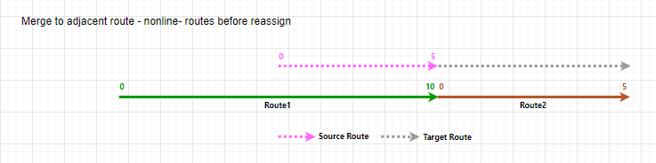
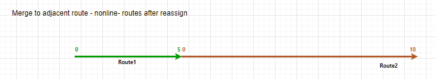
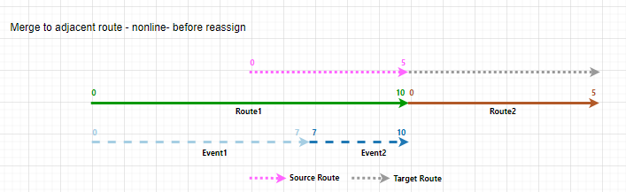
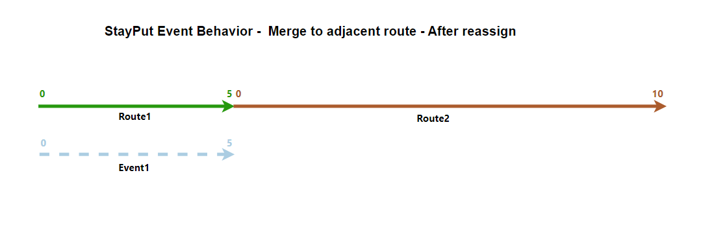
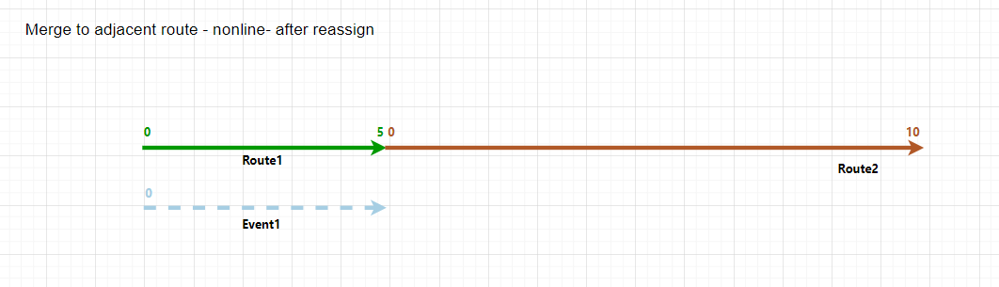
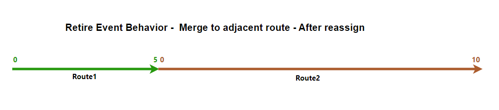
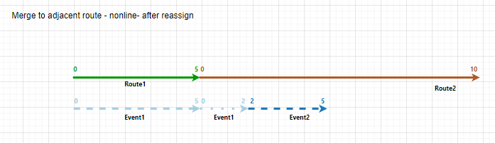
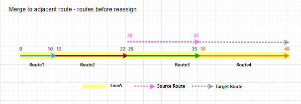
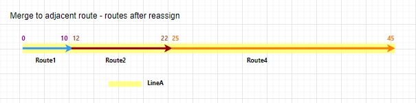
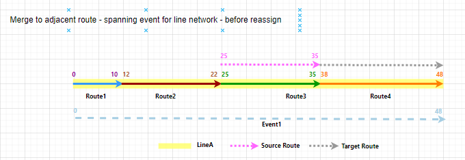
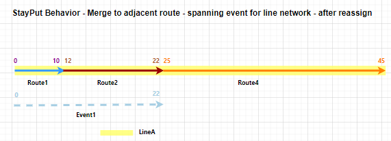
