# Event Behavior for Route Reassignment – Transfer to Another Line Method

| Field | Value |
| --- | --- |
| **Doc** | 36 · Other · Pro |
| **Product** | — |
| **Release** | — |
| **Issues** | — |
| **Source** | [ReassignEB-TransferToAnotherLine_doc.docx](<https://esriis.sharepoint.com/sites/LocationReferencing/Shared%20Documents/General/Doc%20Reviews/ReassignEventBehavior_3docs/ReassignEB-TransferToAnotherLine_doc.docx>) |
| **People** | author Claire Wang · PE — · dev — |
| **Edited** | 2026-05-12 22:30 by Kevin Roper |
| **Extracted** | 2026-09-04 · lane xmlstrip · format 3.0 · prompt v2.0.2 |
| **Keywords** | route reassignment · event behavior · line network · transfer routes · upstream events · downstream events · event splitting |
| **Tools** | Apply Event Behaviors |

## Summary

This document explains the event behavior during route reassignment in a line network, detailing how events are impacted upstream, downstream, and within the edit section based on configured event behaviors such as Stay Put, Move, Retire, and Snap. It provides examples of transferring routes to a new line and to an existing adjacent line, illustrating the effects on routes and events before and after reassignment. The document also describes the application of the Apply Event Behaviors tool and the handling of time slicing and event splitting during reassignment.

## Related documents

<!-- related:begin -->
- [Event Behavior for Route Reassignment – Form a New Route Method](<https://esriis.sharepoint.com/sites/lrsworkspace/LRS Doc Index/Other/eb-for-route-reassignment-form-a-new-route-method.md>) — similar text 0.69 · 5 title words · 1 filename word · same kind/surface/folder <!-- rel:523 s=8.867 -->
- [Event Behavior for Route Reassignment – Merge to Adjacent Route Method](<https://esriis.sharepoint.com/sites/lrsworkspace/LRS Doc Index/Other/eb-for-route-reassignment-merge-to-adjacent-route-method.md>) — similar text 0.73 · 5 title words · 1 filename word · same kind/surface/folder <!-- rel:522 s=7.861 -->
- [Event Behavior for Route Retirement](<https://esriis.sharepoint.com/sites/lrsworkspace/LRS Doc Index/Other/eb-for-route-retirement-rh-2024-01-2.md>) — similar text 0.51 · 3 title words · same kind/surface <!-- rel:442 s=5.305 -->
- [Event Behavior for Route Retirement](<https://esriis.sharepoint.com/sites/lrsworkspace/LRS Doc Index/Other/eb-for-route-retirement-apr-2024-01-2.md>) — similar text 0.51 · 3 title words · same kind/surface <!-- rel:443 s=5.167 -->
- [Event Behavior for Route Retirement](<https://esriis.sharepoint.com/sites/lrsworkspace/LRS Doc Index/Other/eb-for-route-retirement-2024-02.md>) — similar text 0.55 · 3 title words · same kind/surface <!-- rel:420 s=5.095 -->
<!-- related:end -->

<!-- docs:begin -->
## Esri documentation

[Route reassignment](https://doc.esri.com/en/arcgis-pro/latest/help/production/location-referencing-pipelines/reassign-routes.html) · [Event behavior](https://doc.esri.com/en/arcgis-pro/latest/help/production/location-referencing-pipelines/what-is-event-behavior.html)

_No page matched:_ [Apply Event Behaviors](https://www.google.com/search?q=%22Apply%20Event%20Behaviors%22+site%3Adoc.esri.com)
<!-- docs:end -->

---

## Event behavior for route reassignment – Transfer to another line Method
During route reassignment, events are impacted in the edit section, and upstream and downstream of the reassignment, depending on the configured event behavior for the event layer.
Note:
Events are not updated until the Apply Event Behaviors tool is run after route edits. If you are using conflict prevention on branch versioned data, you are prompted to run Apply Event Behaviors before posting to the default version .
Note:
When Recalibrate route downstream is chosen for an LRS route edit, the configured calibrate event behavior is applied to downstream sections. You can review configured event behaviors by viewing LRS event properties.
Running the Apply Event Behaviors tool on event features after a corresponding route edit is described below.
Transfer to another line Method

#### This method is for line network only.

#### Routes are transferred to a new line if a new line name is provided.

#### Routes are transferred to an adjacent line if an existing line name is provided.

#### Upstream and downstream sections
Route editing impacts upstream and downstream sections differently.
The following image shows the upstream and downstream section for the route reassignment scenario:

The following table details how the reassignment editing activity impacts upstream and downstream events according to the configured event behavior:

| Behavior | Events upstream reassignment | Events intersecting reassignment | Events downstream reassignment |
| --- | --- | --- | --- |
| Stay Put | No action | Retire event. Line events crossing the edit section are split and the original event is retired. | If route calibration is changed, the calibrate event behavior is applied; otherwise, no action is taken. |
| Move | Shape regenerated, if needed, to new location of route measures | Shape regenerated to the new location of route measures. | If route calibration is changed, the calibrate event behavior is applied; otherwise, no action is taken. |
| Retire | No action | Retire event. Line events crossing the reassignment region do not split. | If route calibration is changed, the calibrate event behavior is applied; otherwise, no action is taken. |
| Snap | No action | Geographic location ( x,y ) is maintained. The event is migrated to the reassigned route. Line events crossing the edit section are split. | If route calibration is changed, the calibrate event behavior is applied; otherwise, no action is taken. |

Note:
The network can contain events that span multiple routes in a line network; the behaviors are still applied in the same manner.
Since the LRS is time aware, edit activities—such as reassigning a route—time slice routes and events.

### Transfer routes to a new line
In this example, there are 2 lines, each with 3 routes that are active from 1/1/2000. On 1/1/2005, all 3 routes within LineA are transferred to a new line, LineNew.

- Route2 has changed its name.
- Route3 has changed measures in the reassignment.
The graphics and tables below demonstrate the route information before and after the reassignment.

##### Before Route Reassignment
The following image shows the routes before reassignment:

The following tables provide details about the routes before reassignment:

| Route Name | Line Name | Line Order | From Date | To Date | From Measure | To Measure |
| --- | --- | --- | --- | --- | --- | --- |
| Route1 | LineA | 100 | 1/1/2000 | <Null> | 0 | 10 |
| Route2 | LineA | 200 | 1/1/2000 | <Null> | 5 | 15 |
| Route 3 | LineA | 300 | 1/1/2000 | <Null> | 20 | 40 |
| Route A | LineB | 100 | 1/1/2000 | <Null> | 5 | 15 |
| Route B | LineB | 200 | 1/1/2000 | <Null> | 0 | 10 |
| Route C | LineB | 300 | 1/1/2000 | <Null> | 25 | 45 |

##### After Route Reassignment
The following image shows the routes after reassignment:

The following tables provide details about the routes after reassignment:

| Route Name | Line Name | Line Order | From Date | To Date | From Measure | To Measure |
| --- | --- | --- | --- | --- | --- | --- |
| Route1 | LineA | 100 | 1/1/2000 | 1/1/2005 | 0 | 10 |
| Route1 | LineNew | 100 | 1/1/200 5 | <Null> | 0 | 10 |
| Route2 | LineA | 200 | 1/1/2000 | 1/1/2005 | 5 | 15 |
| Route2 _new | LineNew | 200 | 1/1/200 5 | <Null> | 5 | 15 |
| Route 3 | LineA | 300 | 1/1/2000 | 1/1/2005 | 20 | 40 |
| Route 3 | LineNew | 300 | 1/1/200 5 | <Null> | 20 | 60 |
| Route A | LineB | 100 | 1/1/2000 | <Null> | 5 | 15 |
| Route B | LineB | 200 | 1/1/2000 | <Null> | 0 | 10 |
| Route C | LineB | 300 | 1/1/2000 | <Null> | 25 | 45 |

##### Events before reassignment
The following image shows the routes and events before reassignment:

The following tables provide details about the events before reassignment:

| Event | From Route Name | To Route Name | From Date | To Date | From Measure | To Measure |
| --- | --- | --- | --- | --- | --- | --- |
| Event1 | Route1 | Route3 | 1/1/2000 | <Null> | 5 | 40 |
| Event2 | Route A | RouteB | 1/1/2000 | <Null> | 5 | 5 |

The following sections detail how event behavior rules are enforced after running the Apply Event Behaviors geoprocessing tool, when the routes on LineA are transferred to a new line, LineNew.

#### Stay Put event behavior
Although the geographic location of the event outside the reassign region is maintained, the measures can change. The event can also split if it crosses the reassign region. Portions in the reassign region are retired.
The route reassignment described above has the following effects:

- Event1 is retired on the date of reassignment because it fell entirely within the edit section.
- Event2 is not affected by the reassignment as it is in part of routes in LineB.
The following image shows the routes and events after reassignment:

The following tables provide details about the events after reassignment when Stay Put is the configured event behavior:

| Event | From Route Name | To Route Name | From Date | To Date | From Measure | To Measure | Loc Error |
| --- | --- | --- | --- | --- | --- | --- | --- |
| Event1 | Route1 | Route3 | 1/1/2000 | 1/1/2005 | 5 | 40 | No Error |
| Event2 | RouteA | RouteB | 1/1/2000 | <Null> | 5 | 5 | No Error |

Note:
It is important to note that retired events are not drawn in the graphic above

#### Move event behavior
Although the measures of the event are maintained, the geographic location can change.
The route reassignment described above has the following effects:

- Event1 was entirely in the edit section; it is retired on the date of reassignment, and a new event with the reassignment date as the From Date is created. Because the measures do not change for the Move behavior, this new event still spans from measure (5) on Route1 to measure (40) on Route3 but its location has changed due to change in the underlying measures in Route3.
- Event2 is not affected by the reassignment as it is in LineB.
The following image shows the routes and events after reassignment:

The following tables provide details about the events after reassignment when Move is the configured event behavior:

| Event | From Route Name | To Route Name | From Date | To Date | From Measure | To Measure | Location Error |
| --- | --- | --- | --- | --- | --- | --- | --- |
| Event1 | Route1 | Route3 | 1/1/2000 | 1/1/2005 | 5 | 40 | No Error |
| Event2 | Route A | RouteB | 1/1/2000 | <Null> | 5 | 5 | No Error |
| Event1 | Route1 | Route3 | 1/1/2005 | <Null> | 5 | 40 | No Error |

#### Retire event behavior
Events intersecting the reassignment region are retired.
The route reassignment described above has the following effects:

- Event1 was present in the edit section; it is retired on the date of reassignment.
- Event2 is not affected by the reassignment as it is in Line B.
The following image shows the routes and events after reassignment:

The following tables provide details about the events after reassignment when Retire is the configured event behavior:

| Event | From Route Name | To Route Name | From Date | To Date | From Measure | To Measure | Loc Error |
| --- | --- | --- | --- | --- | --- | --- | --- |
| Event1 | Route1 | Route3 | 1/1/2000 | 1/1/2005 | 5 | 40 | No Error |
| Event2 | RouteA | RouteB | 1/1/2000 | <Null> | 5 | 5 | No Error |

#### Snap event behavior
Although the geographic location of the event is maintained by snapping to the route that it was reassigned to, the measures can change. The event gets a new time slice when the route it belongs to has reassigned to another line, no matter the Route ID or measures change or not in the reassignment. The event can also split if it crosses the reassign region.
The route reassignment described above has the following effects:

- Event1 was present in the edit section; it is retired on the date of reassignment, and a new event with the reassignment date as the From Date is created on the new routes with the new underlying measures to maintain its geographic location.
- Event2 is not affected by the reassignment as it is in Line B.
The following image shows the routes and events after reassignment:

The following tables provide details about the events after reassignment when Snap is the configured event behavior:

| Event | From Route Name | To Route Name | From Date | To Date | From Measure | To Measure | Location Error |
| --- | --- | --- | --- | --- | --- | --- | --- |
| Event1 | Route1 | Route3 | 1/1/2000 | 1/1/2005 | 5 | 40 | No Error |
| Event1 | Route1 | Route3 | 1/1/200 5 | <Null> | 5 | 60 | No Error |
| Event2 | Route A | RouteB | 1/1/2000 | <Null> | 5 | 5 | No Error |

### Transfer routes to an existing, adjacent line
In this example, there are 2 lines, each with 3 routes that are active from 1/1/2000. On 1/1/2005, a portion of Route2 and the entire Route3 within LineA are transferred to an existing line, LineB.

- The reassigned portion of Route2 has got a new route name.
- Route3 has changed measures in the reassignment.
The graphics and tables below demonstrate the route information before and after the reassignment.

##### Before Route Reassignment
The following image shows the routes before reassignment:

The following tables provide details about the routes before reassignment:

| Route Name | Line Name | Line Order | From Date | To Date | From Measure | To Measure |
| --- | --- | --- | --- | --- | --- | --- |
| Route1 | LineA | 100 | 1/1/2000 | <Null> | 0 | 10 |
| Route2 | LineA | 200 | 1/1/2000 | <Null> | 5 | 15 |
| Route 3 | LineA | 300 | 1/1/2000 | <Null> | 20 | 40 |
| Route A | LineB | 100 | 1/1/2000 | <Null> | 5 | 15 |
| Route B | LineB | 200 | 1/1/2000 | <Null> | 0 | 10 |
| Route C | LineB | 300 | 1/1/2000 | <Null> | 25 | 45 |

##### After Route Reassignment
The following image shows the routes after reassignment:

The following tables provide details about the routes after reassignment:

| Route Name | Line Name | Line Order | From Date | To Date | From Measure | To Measure |
| --- | --- | --- | --- | --- | --- | --- |
| Route1 | LineA | 100 | 1/1/2000 | <Null> | 0 | 10 |
| Route2 | LineA | 200 | 1/1/2000 | 1/1/2005 | 5 | 15 |
| Route2 | LineA | 200 | 1/1/200 5 | <Null> | 5 | 10 |
| Route2 _ reassign | Line B | 1 00 | 1/1/200 5 | <Null> | 10 | 15 |
| Route 3 | LineA | 300 | 1/1/2000 | 1/1/2005 | 20 | 40 |
| Route 3 | Line B | 2 00 | 1/1/200 5 | <Null> | 20 | 60 |
| Route A | LineB | 100 | 1/1/2000 | 1/1/2005 | 5 | 15 |
| Route A | LineB | 300 | 1/1/200 5 | <Null> | 5 | 15 |
| Route B | LineB | 200 | 1/1/2000 | 1/1/2005 | 0 | 10 |
| Route B | LineB | 400 | 1/1/200 5 | <Null> | 0 | 10 |
| Route C | LineB | 300 | 1/1/2000 | 1/1/2005 | 25 | 45 |
| Route C | LineB | 500 | 1/1/200 5 | <Null> | 25 | 45 |

##### Events before reassignment
The following image shows the routes and events before reassignment:

The following tables provide details about the events before reassignment:

| Event | From Route Name | To Route Name | From Date | To Date | From Measure | To Measure |
| --- | --- | --- | --- | --- | --- | --- |
| Event1 | Route1 | Route3 | 1/1/2000 | <Null> | 5 | 40 |
| Event2 | Route A | RouteB | 1/1/2000 | <Null> | 5 | 5 |

The following sections detail how event behavior rules are enforced after running the Apply Event Behaviors geoprocessing tool, when the routes on LineA are transferred to LineB.

#### Stay Put event behavior
Although the geographic location of the event outside the reassign region is maintained, the measures can change. The event can also split if it crosses the reassign region. Portions in the reassign region are removed.
The route reassignment described above has the following effects:

- Event1 falls in the edit section; it is retired on the date of reassignment, and a new event with the reassignment date as the From Date is created. The new event is located only on Route1 and part of Route2 that were unimpacted by the edit.
- Even though the line orders have changed on the 3 routes on LineB, Event2 is not affected by the reassignment, because it can still locate the from and to routes and measures.
The following image shows the routes and events after reassignment:

The following tables provide details about the events after reassignment when Stay Put is the configured event behavior:

| Event | From Route Name | To Route Name | From Date | To Date | From Measure | To Measure | Loc Error |
| --- | --- | --- | --- | --- | --- | --- | --- |
| Event1 | Route1 | Route3 | 1/1/2000 | 1/1/2005 | 5 | 40 | No Error |
| Event1 | Route1 | Route2 | 1/1/2005 | <Null> | 5 | 10 | No Error |
| Event2 | RouteA | RouteB | 1/1/2000 | <Null> | 5 | 5 | No Error |

Note:
It is important to note that retired events are not drawn in the graphic above

#### Move event behavior
Although the measures of the event are maintained, the geographic location can change.
The route reassignment described above has the following effects:

- Event1 was partially in the edit section; it is retired on the date of reassignment, and a new event with the reassignment date as the From Date is created. The move behavior does not allow changing the From and To route IDs or measures of the event, hence, it returns a location error because Route1 and Route3 are now on different lines, but the event cannot span across lines.
- Even though the line orders have changed on the 3 routes on LineB, Event2 is not affected by the reassignment, because it can still locate the from and to routes and measures.
The following image shows the routes and events after reassignment:

The following tables provide details about the events after reassignment when Move is the configured event behavior:

| Event | From Route Name | To Route Name | From Date | To Date | From Measure | To Measure | Location Error |
| --- | --- | --- | --- | --- | --- | --- | --- |
| Event1 | Route1 | Route3 | 1/1/2000 | 1/1/2005 | 5 | 40 | No Error |
| Event2 | Route A | RouteB | 1/1/2000 | <Null> | 5 | 5 | No Error |
| Event1 | Route1 | Route3 | 1/1/2005 | <Null> | 5 | 40 | Different From and To Route Line IDs |

#### Retire event behavior
Events intersecting the reassignment region are retired.
The route reassignment described above has the following effects:

- Event1 was present in the edit section; it is retired on the date of reassignment.
- Even though the line orders have changed on the 3 routes on LineB, Event2 is not affected by the reassignment, because it can still locate the from and to routes and measures.
The following image shows the routes and events after reassignment:

The following tables provide details about the events after reassignment when Retire is the configured event behavior:

| Event | From Route Name | To Route Name | From Date | To Date | From Measure | To Measure | Loc Error |
| --- | --- | --- | --- | --- | --- | --- | --- |
| Event1 | Route1 | Route3 | 1/1/2000 | 1/1/2005 | 5 | 40 | No Error |
| Event2 | RouteA | RouteB | 1/1/2000 | <Null> | 5 | 5 | No Error |

#### Snap event behavior
Although the geographic location of the event is maintained by snapping to the route that it was reassigned to, the measures can change. The event gets a new time slice when the route it belongs to has reassigned to another line, no matter the Route ID or measures change or not in the reassignment. The event can also split if it crosses the reassign region.
The route reassignment described above has the following effects:

- Event1 was partially in the edit section; it is retired on the date of reassignment, and a new event with the reassignment date as the From Date is created on the non-impacted portion from Route1 to the measure (10) of Route2
- Part of Event1, that was in the impacted portion, gets snapped to the new routes with the new measures: from measure (10) of Route2_reassign to measure (60) of Route3. It gets its From Date from the date of reassignment.
- Even though the line orders have changed on the 3 routes on LineB, Event2 is not affected by the reassignment, because it can still locate the from and to routes and measures.
The following image shows the routes and events after reassignment:

The following tables provide details about the events after reassignment when Snap is the configured event behavior:

| Event | From Route Name | To Route Name | From Date | To Date | From Measure | To Measure | Location Error |
| --- | --- | --- | --- | --- | --- | --- | --- |
| Event1 | Route1 | Route3 | 1/1/2000 | 1/1/2005 | 5 | 40 | No Error |
| Event1 | Route1 | Route2 | 1/1/200 5 | <Null> | 5 | 10 | No Error |
| Event1 | Route 2_reassign | Route3 | 1/1/200 5 | <Null> | 1 0 | 60 | No Error |
| Event2 | Route A | RouteB | 1/1/2000 | <Null> | 5 | 5 | No Error |

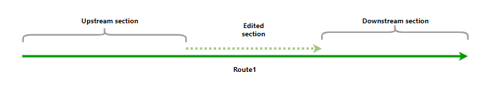
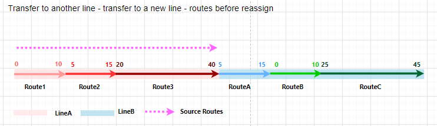
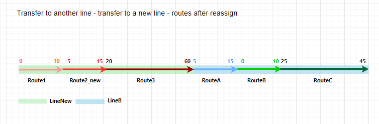
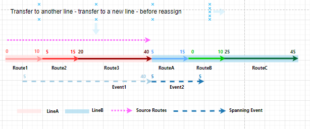
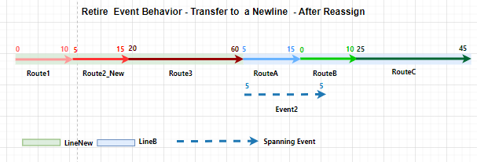
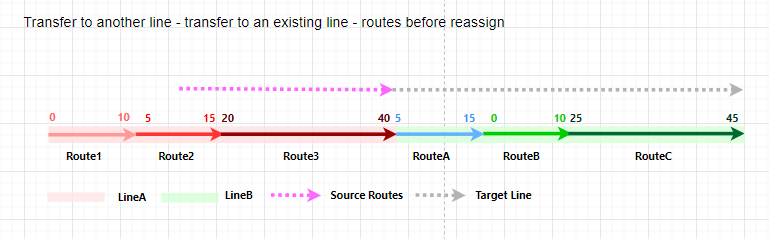
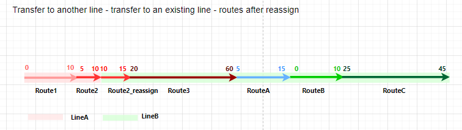
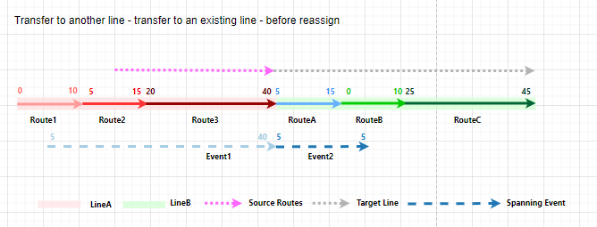
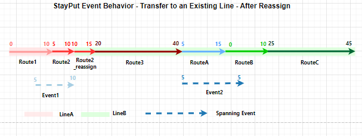
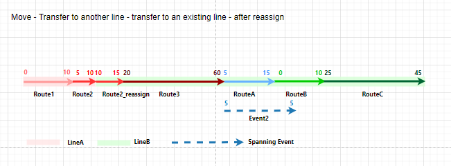
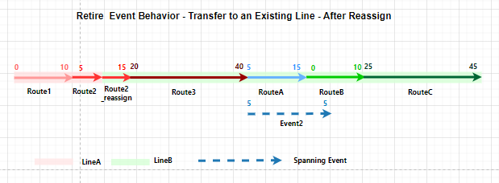
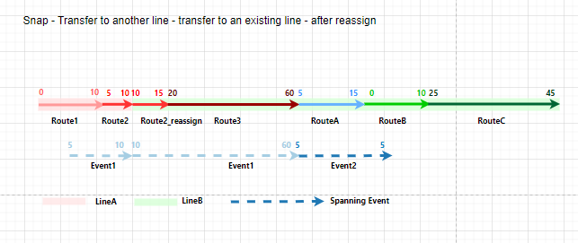
