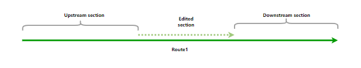
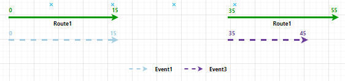
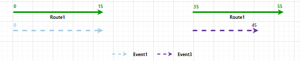
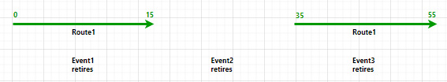
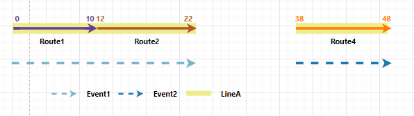
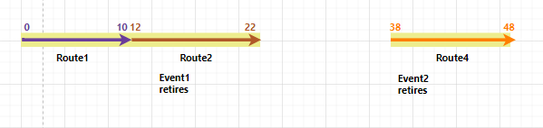

# Event Behavior for Route Retirement

| Field | Value |
| --- | --- |
| **Doc** | 440 · Other · Pro |
| **Product** | Roads & Highways |
| **Release** | — |
| **Issues** | — |
| **Source** | [EB.retire.RH.docx](<https://esriis.sharepoint.com/sites/LocationReferencing/Shared%20Documents/General/Doc%20Reviews/5515_retirement_behavior/EB.retire.RH.docx>) |
| **People** | author — · PE — · dev — |
| **Edited** | 2024-01-05 19:43 by Ignacia Galvan |
| **Extracted** | 2026-09-04 · lane xmlstrip · format 3.0 · prompt v2.0.2 |
| **Keywords** | route retirement · event behavior · stay put · move · retire · line network · gapped route · event splitting · route recalibration |
| **Tools** | Apply Event Behaviors |

## Summary

This document explains how events are affected when routes are retired in a linear referencing system. It details the impact on events based on configured event behaviors such as Stay Put, Move, and Retire, including scenarios for single routes and routes spanning multiple segments in a line network. The document also describes the application of event behaviors after route edits and provides examples with tables illustrating event and route changes before and after retirement.

## Related documents

<!-- related:begin -->
- [Event Behavior for Route Retirement](<https://esriis.sharepoint.com/sites/lrsworkspace/LRS Doc Index/Other/eb-for-route-retirement-apr-2024-01.md>) — similar text 0.90 · 4 title words · 1 filename word · same kind/surface/folder <!-- rel:441 s=7.944 -->
- [Event Behavior for Route Retirement](<https://esriis.sharepoint.com/sites/lrsworkspace/LRS Doc Index/Other/eb-for-route-retirement-rh-2024-01-2.md>) — similar text 0.73 · 4 title words · 1 filename word · same kind/surface/folder <!-- rel:442 s=7.215 -->
- [Event Behavior for Route Retirement](<https://esriis.sharepoint.com/sites/lrsworkspace/LRS Doc Index/Other/eb-for-route-retirement-apr-2024-01-2.md>) — similar text 0.73 · 4 title words · 1 filename word · same kind/surface/folder <!-- rel:443 s=7.209 -->
- [Event Behavior for Route Retirement](<https://esriis.sharepoint.com/sites/lrsworkspace/LRS Doc Index/Other/eb-for-route-retirement-2024-02-2.md>) — similar text 0.76 · 4 title words · 1 filename word · same kind/surface <!-- rel:425 s=7.024 -->
- [Event Behavior for Route Retirement](<https://esriis.sharepoint.com/sites/lrsworkspace/LRS Doc Index/Other/eb-for-route-retirement-2024-02.md>) — similar text 0.74 · 4 title words · 1 filename word · same kind/surface <!-- rel:420 s=6.976 -->
<!-- related:end -->

<!-- docs:begin -->
## Esri documentation

[Retire routes](https://doc.esri.com/en/arcgis-pro/latest/help/production/roads-highways/retire-routes.html) · [Event behavior](https://doc.esri.com/en/arcgis-pro/latest/help/production/roads-highways/what-is-event-behavior.html)

_No page matched:_ [Apply Event Behaviors](https://www.google.com/search?q=%22Apply%20Event%20Behaviors%22+site%3Adoc.esri.com)
<!-- docs:end -->

---

## Event behavior for route retirement
When routes are retired, events are impacted, depending on the configured event behavior for each event layer.
Note:
Events are not updated until the Apply Event Behaviors tool is run after route edits. If you are using conflict prevention on branch versioned data, you are prompted to run Apply Event Behaviors before posting to the default version.
Note:
When Recalibrate route downstream is chosen for an LRS route edit, the configured calibrate event behavior is applied to downstream sections. You can review configured event behaviors by viewing LRS event properties.
The route retirement and corresponding event behaviors are described below.

### Route retirement scenario
A route can be retired at the beginning, in the middle, or at the end of the route. If the retirement takes place in the middle of the route, the resultingant route is a gapped route. For line network, yYou can fully or partially retire multiple adjoining routes that belong to the same line.

#### Upstream and downstream sections
Route editing impacts upstream and downstream sections differently.
The following image shows the upstream and downstream sections for the route retirement scenario: (Please use updated svg and use the title as hover text)

The following table details how the retirement editing activity impacts upstream and downstream events according to the configured event behavior:

| Behavior | Events upstream | Events intersecting | Events downstream |
| --- | --- | --- | --- |
| Stay Put | No action. | Retire event; line events crossing the edit region are split and the original event is retired. | If route calibration is changed, the calibrate event behavior is applied; otherwise, no action is taken. |
| Move | Shape regenerated, if needed, to new location of route measures. | Shape regenerated to new location of route measures. | If route calibration is changed, the calibrate event behavior is applied; otherwise, no action is taken. |
| Retire | No action. | Retire event; line events crossing the edit region are not split. | If route calibration is changed, the calibrate event behavior is applied; otherwise, no action is taken. |

Note:
The network can contain events that span routes in a line network. The behaviors are still applied in the same manner.
Since Because the LRS is time aware, edit activities such as retiring a route will time slice routes and events.

#### Route rRetirement results
In this example, the route Route1 is active from 1/1/2000. The retirement is set to occur in the middle of the route on 1/1/2005. Recalibrate route downstream option is not chosen. The graphics and tables below demonstrate the route information before and after the retirement.

#### Before route retirement
The following image shows the route before the retirement: (Please use updated svg and use the title as hover text
The following table provides details about the route before the retirement:

| Route ID | From Date | To Date | From Measure | To Measure |
| --- | --- | --- | --- | --- |
| Route1 | 1/1/2000 | <Null> | 0 | 55 |

#### After route retirement
The following image shows the route after the retirement. A gapped a route is created. (Please use updated svg and use the title as hover text
The following table provides details about the route after the retirement:

| Route ID | From Date | To Date | From Measure | To Measure |
| --- | --- | --- | --- | --- |
| Route1 | 1/1/2000 | 1/1/2005 | 0 | 55 |
| Route1 | 1/1/2005 | <Null> | 0 | 55 |

#### Events before route retirement
There are three events on Route1 and all of them have a From Date of 1/1/2000. The following image shows the route and events before the retirement: (Please use updated svg and use the title as hover text

The following table provides details about the events before the retirement:

| Event | Route ID | From Date | To Date | From Measure | To Measure |
| --- | --- | --- | --- | --- | --- |
| Event1 | Route1 | 1/1/2000 | <Null> | 0 | 20 |
| Event2 | Route1 | 1/1/2000 | <Null> | 20 | 30 |
| Event3 | Route1 | 1/1/2000 | <Null> | 30 | 45 |

The following sections detail how event behavior rules are enforced after running the Apply Event Behaviors tool under this route retirement scenario.

#### Stay Put event behavior
Although the geographic location of the event is maintained, the measures can change. The event can also split if it crosses the retire region. Portions of the reassign region are retired.
The route retirement described above has the following effects:

- Event1 is retired on the date of the retirement since part of it is in the edit section. A new event is created on the post-retirement route with the retirement date as the From Dstarting date (From Date). The From start (From) and To end (To) mMeasure values are changed to 0 to and 15, respectively, to accommodate the new measures of Route1.
- Event2 is retired on the date of the retirement since because it is completely in the edit section.
- Event3 is retired on the date of the retirement since because part of it is in the edit section. A new event is created on the post-retirement route with the retirement date as the From starting dDate. The From start and To end mMeasures are changed to 35 to and 45, respectively, to accommodate the new measures of Route1.
The following image shows the route and events after the retirement: (Please use updated svg and use the title as hover text

Note:
It is important to note that tThe retired event is not drawn in the graphic above.
The following table provides details about the events after the retirement when Stay Put is the configured event behavior:

| Event | Route ID | From Date | To Date | From Measure | To Measure | Location Error |
| --- | --- | --- | --- | --- | --- | --- |
| Event1 | Route1 | 1/1/2000 | 1/1/2005 | 0 | 20 | No Error |
| Event1 | Route1 | 1/1/2005 | <Null> | 0 | 15 | No Error |
| Event 2 | Route1 | 1/1/2000 | 1/1/2005 | 20 | 3 0 | No Error |
| Event3 | Route1 | 1/1/2000 | 1/1/2005 | 30 | 45 | No Error |
| Event3 | Route1 | 1/1/2005 | <Null> | 35 | 45 | No Error |

#### Move event behavior
Although the measures of the event are maintained, the geographic location can change.
The route retirement described above has the following effects:

- Event1 is retired on the date of the retirement since because part of it is in the edit section. A new event is created on the post-retirement route with the retirement date as the From starting dDate. Because the measures do not change for the Move behavior, there is a location error for the To ending Mmeasure because that measure (20) no longer exists on Route1.
- Event2 is retired on the date of the retirement since because it is completely in the edit section. A new event is created on the post-retirement route with the retirement date as the From starting Ddate. Because the measures do not change for the Move behavior, there is a location error as because both From starting Mmeasure (20) and Toending Mmeasure (30) no longer exist on Route1.
- Event1 is retired on the date of the retirement since because part of it is in the edit section. A new event is created on the post-retirement route with the retirement date as the From starting Ddate. Because the measures do not change for the Move behavior, there is a location error for the From starting Mmeasure because that measure (30) no longer exists on Route1.
The following image shows the route and events after the retirement: (Please use updated svg and use the title as hover text

The following table provides details about the events after retirement when Move is the configured event behavior:

| Event | Route ID | From Date | To Date | From Measure | To Measure | Location Error |
| --- | --- | --- | --- | --- | --- | --- |
| Event1 | Route1 | 1/1/2000 | 1/1/2005 | 0 | 20 | No Error |
| Event1 | Route1 | 1/1/2005 | <Null> | 0 | 20 | Partial match for the to measure |
| Event 2 | Route1 | 1/1/2000 | 1/1/2005 | 20 | 3 0 | No Error |
| Event 2 | Route1 | 1/1/2005 | <Null> | 20 | 3 0 | Route Location Not Found |
| Event3 | Route1 | 1/1/2000 | 1/1/2005 | 30 | 45 | No Error |
| Event3 | Route1 | 1/1/2005 | <Null> | 30 | 45 | Partial match for the from measure |

#### Retire event behavior
Events intersecting the retire region are retired.

- Event1 retires on the date of the retirement since because it intersects the retired region.
- Event2 retires on the date of the retirement because since it is completely inside the retired region.
- Event3 retires on the date of the retirement because since it intersects the retired region.
The following image shows the route and events after the retirement: (Please use updated svg and use the title as hover text

The following table provides details about the events after the retirement when Retire is the configured event behavior:

| Event | Route ID | From Date | To Date | From Measure | To Measure | Location Error |
| --- | --- | --- | --- | --- | --- | --- |
| Event1 | Route1 | 1/1/2000 | 1/1/2005 | 0 | 20 | No Error |
| Event2 | Route1 | 1/1/2000 | 1/1/2005 | 20 | 30 | No Error |
| Event3 | Route1 | 1/1/2000 | 1/1/2005 | 30 | 45 | No Error |

### Detailed behavior on routes in a line network with events that span routes
In this example, there are four routes on the same line and the routes are active from 1/1/2000. The retirement is set to occur on 1/1/2005 where entire Route3 is retired. Recalibrate route downstream is not chosen. The graphics and tables below demonstrate the route information before and after the retirement.

#### Before route retirement
The following image shows the routes before the retirement: (Please use updated svg and use the title as hover text

The following table provides details about the routes before the retirement:

| Route Name | Line Name | Line Order | From Date | To Date | From Measure | To Measure |
| --- | --- | --- | --- | --- | --- | --- |
| Route1 | LineA | 100 | 1/1/2000 | <Null> | 0 | 10 |
| Route2 | LineA | 200 | 1/1/2000 | <Null> | 12 | 22 |
| Route3 | LineA | 300 | 1/1/2000 | <Null> | 25 | 35 |
| Route4 | LineA | 4 00 | 1/1/2000 | <Null> | 38 | 48 |

#### After route retirement
The following image shows the routes after the retirement: (Please use updated svg and use the title as hover text
The following table provides details about the routes after the retirement:

| Route Name | Line Name | Line Order | From Date | To Date | From Measure | To Measure |
| --- | --- | --- | --- | --- | --- | --- |
| Route1 | LineA | 100 | 1/1/200 0 | <Null> | 0 | 20 |
| Route2 | LineA | 200 | 1/1/2000 | <Null> | 12 | 22 |
| Route3 | LineA | 300 | 1/1/2000 | 1/1/2005 | 25 | 35 |
| Route4 | LineA | 400 | 1/1/2000 | 1/1/2005 | 38 | 48 |
| Route4 | LineA | 300 | 1/1/2005 | <Null> | 38 | 48 |

#### Events before retirement
There are two spanning events on routes on LineA. The following image shows the routes and events before the retirement: (Please use updated svg and use the title as hover text

The following table provides details about the events before the retirement:

| Event ID | From Date | To Date | From Route Name | To Route Name | From Measure | To Measure |
| --- | --- | --- | --- | --- | --- | --- |
| Event1 | 1/1/2000 | <Null> | Route1 | Route3 | 0 | 30 |
| Event2 | 1/1/2000 | <Null> | Route3 | Route4 | 30 | 48 |

The following sections describe how event behavior rules are enforced when a route on a line in a line network is retired.

#### Stay Put event behavior
Although the geographic location of the event is maintained, the measures can change.
The route retirement described above has the following effects:

- Event1 is retired on the date of the retirement since because part of it is in the edit section. A new event is created on the post-retirement route with the retirement date as the From starting Ddate. The From start and To end Mmeasure values are changed to measure 0 on Route1 to and 22 on Route2, respectively, since because Route3 is no longer present in the line.
- Event2 is retired on the date of the retirement because since part of it is in the edit section. A new event is created on the post-retirement route with the retirement date as the From starting Ddate. The From start and To end Mmeasure values are changed to measure 38 on Route4 to and 48 on Route4, respectively, because since Route3 is no longer present in the line.
The following image shows the routes and events after the retirement: (Please use updated svg and use the title as hover text

Note:
It is important to note that tThe retired event is not drawn in the graphic above.
The following table provides details about the events after retirement when Stay Put is the configured event behavior:

| Event ID | From Date | To Date | From Route Name | To Route Name | From Measure | To Measure | Location Error |
| --- | --- | --- | --- | --- | --- | --- | --- |
| Event1 | 1/1/2000 | 1/1/2005 | Route1 | Route3 | 0 | 30 | No Error |
| Event1 | 1/1/2005 | <null> | Route1 | Route2 | 0 | 22 | No Error |
| Event2 | 1/1/2000 | 1/1/2005 | Route3 | Route4 | 30 | 48 | No Error |
| Event2 | 1/1/2005 | <null> | Route4 | Route4 | 38 | 48 | No Error |

#### Move event behavior
Although the measures of the event are maintained, the geographic location can change.
The route retirement described above has the following effects:

- Event1 is retired on the date of the retirement because since part of it is in the edit section. A new event is created on the post-retirement route with the retirement date as the From starting Ddate. Because the measures do not change for the Move behavior, there is a location error for the To ending Mmeasure because Route3 no longer exists in the line.
- Event2 is retired on the date of the retirement because since part of it is in the edit section. A new event is created on the post-retirement route with the retirement date as the From starting Ddate. Because the measures do not change for the Move behavior, there is a location error for the From starting Mmeasure because Route3 no longer exists in the line.
The following image shows the route and events after the retirement: (Please use updated svg and use the title as hover text

The following table provides details about the events after the retirement when Move is the configured event behavior:

| Event ID | From Date | To Date | From Route Name | To Route Name | From Measure | To Measure | Location Error |
| --- | --- | --- | --- | --- | --- | --- | --- |
| Event1 | 1/1/2000 | 1/1/2005 | Route1 | Route3 | 0 | 30 | No Error |
| Event1 | 1/1/2005 | <null> | Route1 | Route3 | 0 | 30 | Partial Match for the To Measure |
| Event2 | 1/1/2000 | 1/1/2005 | Route3 | Route4 | 30 | 48 | No Error |
| Event2 | 1/1/2005 | <null> | Route3 | Route4 | 30 | 48 | Partial Match for the From Measure |

#### Retire event behavior
Events intersecting the retire region are retired.

- Event1 retires on the date of the retirement since because it intersects the retired region.
- Event2 retires on the date of the retirement because since it is completely inside the retired region.
- Event3 retires on the date of the retirement because since it intersects the retired region.
The following image shows the route and events after the retirement: (Please use updated svg and use the title as hover text

The following table provides details about the events after the retirement when Retire is the configured event behavior:

| Event ID | From Date | To Date | From Route Name | To Route Name | From Measure | To Measure | Location Error |
| --- | --- | --- | --- | --- | --- | --- | --- |
| Event1 | 1/1/2000 | 1/1/2005 | Route1 | Route3 | 0 | 30 | No Error |
| Event2 | 1/1/2000 | 1/1/2005 | Route3 | Route4 | 30 | 48 | No Error |

