# Event Behavior for Route Retirement

| Field | Value |
| --- | --- |
| **Doc** | 419 · Other · Pro |
| **Product** | Roads & Highways |
| **Release** | — |
| **Issues** | — |
| **Source** | [EB retire RH 5633.docx](<https://esriis.sharepoint.com/sites/LocationReferencing/Shared%20Documents/General/Doc%20Reviews/5633_Retire/EB%20retire%20RH%205633.docx>) |
| **People** | author — · PE — · dev — |
| **Edited** | 2024-02-29 19:10 by Ignacia Galvan |
| **Extracted** | 2026-09-04 · lane xmlstrip · format 3.0 · prompt v2.0.2 |
| **Keywords** | route retirement · event behavior · stay put · move · retire · line network · event splitting |
| **Tools** | Apply Event Behaviors |

## Summary

This document explains how events are affected when routes are retired in an LRS system. It details different event behaviors—Stay Put, Move, and Retire—and their effects on upstream, intersecting, and downstream events during route retirement scenarios, including examples with single and multiple routes in a line network.

## Related documents

<!-- related:begin -->
- [Event Behavior for Route Retirement](<https://esriis.sharepoint.com/sites/lrsworkspace/LRS Doc Index/Other/eb-for-route-retirement-2024-02.md>) — similar text 0.82 · 4 title words · 1 filename word · same kind/surface/folder <!-- rel:420 s=7.509 -->
- [Event Behavior for Route Retirement](<https://esriis.sharepoint.com/sites/lrsworkspace/LRS Doc Index/Other/eb-for-route-retirement-2024-02-3.md>) — similar text 0.79 · 4 title words · 1 filename word · same kind/surface/folder <!-- rel:426 s=7.396 -->
- [Event Behavior for Route Retirement](<https://esriis.sharepoint.com/sites/lrsworkspace/LRS Doc Index/Other/eb-for-route-retirement-2024-02-2.md>) — similar text 0.76 · 4 title words · 1 filename word · same kind/surface/folder <!-- rel:425 s=7.313 -->
- [Event Behavior for Route Retirement](<https://esriis.sharepoint.com/sites/lrsworkspace/LRS Doc Index/Other/eb-for-route-retirement-rh-2024-01.md>) — similar text 0.71 · 4 title words · 1 filename word · same kind/surface <!-- rel:440 s=6.673 -->
- [Event Behavior for Route Retirement](<https://esriis.sharepoint.com/sites/lrsworkspace/LRS Doc Index/Other/eb-for-route-retirement-apr-2024-01-2.md>) — similar text 0.67 · 4 title words · 1 filename word · same kind/surface <!-- rel:443 s=6.541 -->
<!-- related:end -->

<!-- docs:begin -->
## Esri documentation

[Retire routes](https://doc.esri.com/en/arcgis-pro/latest/help/production/roads-highways/retire-routes.html) · [Event behavior](https://doc.esri.com/en/arcgis-pro/latest/help/production/roads-highways/what-is-event-behavior.html)

_No page matched:_ [Apply Event Behaviors](https://www.google.com/search?q=%22Apply%20Event%20Behaviors%22+site%3Adoc.esri.com)
<!-- docs:end -->

---

## Event behavior for route retirement
When routes are retired, events are impacted depending on the configured event behavior for each event layer.
Note:
Events are not updated until the Apply Event Behaviors tool is run after route edits. If you are using conflict prevention on branch versioned data, you are prompted to run Apply Event Behaviors before posting to the default version.
Note:
When Recalibrate route downstream is chosen for an LRS route edit, the configured calibrate event behavior is applied to downstream sections. You can review configured event behaviors by viewing LRS event properties.
The route retirement and corresponding event behaviors are described below.

### Route retirement scenario
A route can be retired at the beginning, in the middle, or at the end of the route. If the retirement takes place in the middle of the route, the resulting route is a gapped route. For line network, you can fully or partially retire multiple adjoining routes that belong to the same line.

#### Upstream and downstream sections
Route editing impacts upstream and downstream sections differently.
The following image shows the upstream and downstream sections for the route retirement scenario: (Please use updated svg and use the title as hover text)

The following table details how the retirement editing activity impacts upstream and downstream events according to the configured event behavior:

| Behavior | Events upstream | Events intersecting | Events downstream |
| --- | --- | --- | --- |
| Stay Put | No action. | Retire event; line events crossing the edit region are split and the original event is retired. | If route calibration is changed, the calibrate event behavior is applied; otherwise, no action is taken. |
| Move | Shape regenerated, if needed, to new location of route measures. | Shape regenerated to new location of route measures. | If route calibration is changed, the calibrate event behavior is applied; otherwise, no action is taken. |
| Retire | No action. | Retire event; line events crossing the edit region are not split. | If route calibration is changed, the calibrate event behavior is applied; otherwise, no action is taken. |

Note:
The network can contain events that span routes in a line network. The behaviors are still applied in the same manner.
Because the LRS is time aware, edit activities such as retiring a route will time slice routes and events.

#### Route retirement results
In this example, the route Route1 is active from 1/1/2000. The retirement is set to occur at the beginning of the route on 1/1/2005. The Recalibrate route downstream option is chosen and the route is recalibrated after retirement. The graphics and tables below demonstrate the route information before and after the retirement.
Note:
In all the examples below, the calibrate event behavior for the events is set to Stay Put.
The calibrate event behavior is applied before the retire event behavior, so it is important to verify the event feature layer's calibrate event behavior configuration before checking the Recalibrate route downstream check box.
To seeFor other event behaviors for calibration, refer to the calibrate event behavior. I made the links to prodev. Feel free to change them if needed!

#### Before route retirement
The following image shows the route before the retirement: (Please use updated svg and use the title as hover text. Please make sure to include the white space for some graphics – this way we can illustrate the left part of the route is retired)
The following table provides details about the route before the retirement:

| Route ID | From Date | To Date | From Measure | To Measure |
| --- | --- | --- | --- | --- |
| Route1 | 1/1/2000 | <Null> | 0 | 55 |

#### After route retirement
The following image shows the route after the retirement.
The following table provides details about the route after the retirement:

| Route ID | From Date | To Date | From Measure | To Measure |
| --- | --- | --- | --- | --- |
| Route1 | 1/1/2000 | 1/1/2005 | 0 | 55 |
| Route1 | 1/1/2005 | <Null> | 0 | 30 |

#### Events before route retirement
There are three events on Route1 and all of them have a start date (From Date) of 1/1/2000. The following image shows the route and events before the retirement:

The following table provides details about the events before the retirement:

| Event | Route ID | From Date | To Date | From Measure | To Measure |
| --- | --- | --- | --- | --- | --- |
| Event1 | Route1 | 1/1/2000 | <Null> | 0 | 20 |
| Event2 | Route1 | 1/1/2000 | <Null> | 20 | 30 |
| Event3 | Route1 | 1/1/2000 | <Null> | 30 | 45 |

The following sections detail how event behavior rules are enforced after running the Apply Event Behaviors tool under this route retirement scenario.

#### Stay Put event behavior
Although the geographic location of the event is maintained, the measures can change. The event can also split if it crosses the retire region and portions within the retirement region are retired.
The following table shows the edit activities involved in the route edit and their corresponding event behaviors:

| Edit A a ctivity | Event b B ehavior |
| --- | --- |
| Retire | Stay Put |
| Calibrate | Stay Put |

The route retirement described above has the following effects:

- Event1 is retired on the date of the retirement because it is completely in the edit section.
- Event2 is retired on the date of the retirement because part of it is in the edit section. A new event is created on the post-retirement route with the retirement date as the starting date (From Date). The length of the new Event2 is shorter andas its start measure (From Measure) value changes to 0 and end measure (To Measure) measure values are changesd to 0 to 5 to accommodate the new measures of Route1.
- Event3 is not in the retirement region, so retire event behavior does not apply to it. As Route1 is recalibrated, the calibratratione Stay Put behavior is applied to maintain Event3's geographic location. Event3's start measure value changes to 5 and end measure values are changesd to 5 to 20 to accommodate the new measures of Route1.
The following image shows the route and events after the retirement:

Note:
The retired event is not drawn in the graphic above.
The following table provides details about the events after the retirement:

| Event | Route ID | From Date | To Date | From Measure | To Measure | Location Error |
| --- | --- | --- | --- | --- | --- | --- |
| Event1 | Route1 | 1/1/2000 | 1/1/2005 | 0 | 20 | No Error |
| Event 2 | Route1 | 1/1/2000 | 1/1/2005 | 20 | 3 0 | No Error |
| Event 2 | Route1 | 1/1/2005 | <Null> | 0 | 5 | No Error |
| Event3 | Route1 | 1/1/2000 | 1/1/2005 | 30 | 45 | No Error |
| Event3 | Route1 | 1/1/2005 | <Null> | 5 | 20 | No Error |

#### Move event behavior
Although the measures of the event are maintained, the geographic location can change.
The following table shows the edit activities involved in the route edit and their corresponding event behaviors:

| Edit A a ctivity | Event b B ehavior |
| --- | --- |
| Retire | Move |
| Calibrate | Stay Put |

The route retirement described above has the following effects:

- Event1 is retired on the date of the retirement because part of it is in the edit section. A new event is created on the post-retirement route with the retirement date as the starting date. Because the measures do not change for the Move behavior, the event moves to the new location of Route1 to maintain its original start measure value of 0 and end measure values of 0 to 20.
- Event2 is retired on the date of the retirement because it is completely in the edit section. A new event is created on the post-retirement route with the retirement date as the starting date. Because the measures do not change for the Move behavior, the event moves to the new location of Route1 to maintain its original start measure value of 20 and end measure values of 20 to 30.
- Event3 is not in the retirement region, so retire event behavior does not apply to it. As Route1 is recalibrated, the calibratratione Stay Put behavior is applied to maintain Event3's geographic location. Event3's start measure value changes to 5 and end measure values are changesd to 5 to 20 to accommodate the new measures of Route1.
The following image shows the route and events after the retirement:

The following table provides details about the events after the retirement:

| Event | Route ID | From Date | To Date | From Measure | To Measure | Location Error |
| --- | --- | --- | --- | --- | --- | --- |
| Event1 | Route1 | 1/1/2000 | 1/1/2005 | 0 | 20 | No Error |
| Event1 | Route1 | 1/1/2005 | <Null> | 0 | 20 | No Error |
| Event 2 | Route1 | 1/1/2000 | 1/1/2005 | 20 | 3 0 | No Error |
| Event 2 | Route1 | 1/1/2005 | <Null> | 20 | 3 0 | No Error |
| Event3 | Route1 | 1/1/2000 | 1/1/2005 | 30 | 45 | No Error |
| Event3 | Route1 | 1/1/2005 | <Null> | 5 | 20 | No Error |

#### Retire event behavior
Events intersecting the retire region are retired.
The following table shows the edit activities involved in the route edit and their corresponding event behaviors:

| Edit a A ctivity | Event B b ehavior |
| --- | --- |
| Retire | Retire |
| Calibrate | Stay Put |

The route retirement described above has the following effects:

- Event1 retires on the date of the retirement since because it is completely inside the retired region.
- Event2 retires on the date of the retirement since because it intersects the retired region.
- Event3 is not in the retirement region, so retire event behavior does not apply to it. As Route1 is recalibrated, the calibrateion Stay Put behavior is applied to maintain Event3's geographic location. Event3's start measure value changes to 5 and end measure values are changesd to 5 to 20 to accommodate the new measures of Route1.
The following image shows the route and events after the retirement:

The following table provides details about the events after the retirement:

| Event | Route ID | From Date | To Date | From Measure | To Measure | Location Error |
| --- | --- | --- | --- | --- | --- | --- |
| Event1 | Route1 | 1/1/2000 | 1/1/2005 | 0 | 20 | No Error |
| Event2 | Route1 | 1/1/2000 | 1/1/2005 | 20 | 30 | No Error |
| Event3 | Route1 | 1/1/2000 | 1/1/2005 | 30 | 45 | No Error |
| Event3 | Route1 | 1/1/2005 | <Null> | 5 | 20 | No Error |

### Detailed behavior on routes in a line network with events that span routes
In this example, there are four routes on the same line and the routes are active from 1/1/2000. The retirement is set to occur on 1/1/2005 where the entire Route1 and half of Route2 are retired. Recalibrate route downstream is chosen and Route2 is recalibrated after retirement. The graphics and tables below demonstrate the route information before and after the retirement.
Note:
In all the examples below, the calibrate event behavior for the events is set to Stay Put.
The calibrate event behavior is applied before the retire event behavior, so it is important to verify the event feature layer's calibrate event behavior configuration before checking the Recalibrate route downstream check box.
To seeFor other event behaviors for calibration, refer to the calibrate event behavior. I made the links to prodev. Feel free to change them if needed!

#### Before route retirement
The following image shows the routes before the retirement:

The following table provides details about the routes before the retirement:

| Route Name ID | Line Name | Line Order | From Date | To Date | From Measure | To Measure |
| --- | --- | --- | --- | --- | --- | --- |
| Route1 | LineA | 100 | 1/1/2000 | <Null> | 0 | 10 |
| Route2 | LineA | 200 | 1/1/2000 | <Null> | 12 | 22 |
| Route3 | LineA | 300 | 1/1/2000 | <Null> | 25 | 35 |
| Route4 | LineA | 4 00 | 1/1/2000 | <Null> | 38 | 48 |

#### After route retirement
The following image shows the routes after the retirement:
The following table provides details about the routes after the retirement:

| Route Name ID | Line Name | Line Order | From Date | To Date | From Measure | To Measure |
| --- | --- | --- | --- | --- | --- | --- |
| Route1 | LineA | 100 | 1/1/200 0 | 1/1/2005 | 0 | 20 |
| Route2 | LineA | 200 | 1/1/2000 | 1/1/2005 | 12 | 22 |
| Route2 | LineA | 100 | 1/1/2005 | <Null> | 12 | 17 |
| Route3 | LineA | 300 | 1/1/2000 | 1/1/2005 | 25 | 35 |
| Route3 | LineA | 200 | 1/1/2005 | <Null> | 25 | 35 |
| Route4 | LineA | 400 | 1/1/2000 | 1/1/2005 | 38 | 48 |
| Route4 | LineA | 300 | 1/1/2005 | <Null> | 38 | 48 |

#### Events before retirement
There are two spanning events on routes on LineA. The following image shows the routes and events before the retirement:

The following table provides details about the events before the retirement:

| Event ID | From Date | To Date | From Route Name | To Route Name | From Measure | To Measure |
| --- | --- | --- | --- | --- | --- | --- |
| Event1 | 1/1/2000 | <Null> | Route1 | Route3 | 0 | 30 |
| Event2 | 1/1/2000 | <Null> | Route3 | Route4 | 30 | 48 |

The following sections describe how event behavior rules are enforced when a route on a line in a line network is retired.

#### Stay Put event behavior
Although the geographic location of the event is maintained, the measures can change. The event can also split if it crosses the retire region and portions within the retirement region are retired.
The following table shows the edit activities involved in the route edit and their corresponding event behaviors:

| Edit a A ctivity | Event b B ehavior |
| --- | --- |
| Retire | Stay Put |
| Calibrate | Stay Put |

The route retirement described above has the following effects:

- Event1 is retired on the date of the retirement because part of it is in the edit section. A new event is created on the post-retirement routes with the retirement date as the starting date. The length of the new Event1 is shorter becauseas its start measure value changes to 12 on Route2 and the end measure values are changesd to 12 on Route2 to 30 on Route3 to accommodate the new measures of Route2.
- Event2 is not affected because as it is not in the retirement region.
The following image shows the routes and events after the retirement:

Note:
The retired event is not drawn in the graphic above.
The following table provides details about the events after the retirement:

| Event ID | From Date | To Date | From Route Name | To Route Name | From Measure | To Measure | Location Error |
| --- | --- | --- | --- | --- | --- | --- | --- |
| Event1 | 1/1/2000 | 1/1/2005 | Route1 | Route3 | 0 | 30 | No Error |
| Event1 | 1/1/2005 | <null> | Route 2 | Route 3 | 12 | 30 | No Error |
| Event2 | 1/1/2000 | <null> | Route3 | Route4 | 30 | 48 | No Error |

#### Move event behavior
Although the measures of the event are maintained, the geographic location can change.
The following table shows the edit activities involved in the route edit and their corresponding event behaviors:

| Edit Activity | Event Behavior |
| --- | --- |
| Retire | Move |
| Calibrate | Stay Put |

The route retirement described above has the following effects:

- Event1 is retired on the date of the retirement because part of it is in the edit section. A new event is created on the post-retirement route with the retirement date as the starting date. Because the measures do not change for the Move behavior, the new Event1 gets a location error while trying to locate Route1 for its start measure but Route1 no longer exists. There is a record for the new Event1 in the event table, but it is not drawn as because it does not have a length due to the location error.
- Event2 is not affected as because it is not in the retirement region.
The following image shows the routes and events after the retirement:

The following table provides details about the events after the retirement:

| Event ID | From Date | To Date | From Route Name | To Route Name | From Measure | To Measure | Location Error |
| --- | --- | --- | --- | --- | --- | --- | --- |
| Event1 | 1/1/2000 | 1/1/2005 | Route1 | Route3 | 0 | 30 | No Error |
| Event1 | 1/1/2005 | <null> | Route1 | Route3 | 0 | 30 | Route Not Found |
| Event2 | 1/1/2000 | <null> | Route3 | Route4 | 30 | 48 | No Error |

#### Retire event behavior
Events intersecting the retire region are retired.
The following table shows the edit activities involved in the route edit and their corresponding event behaviors:

| Edit Activity | Event Behavior |
| --- | --- |
| Retire | Retire |
| Calibrate | Stay Put |

The route retirement described above has the following effects:

- Event1 retires on the date of the retirement because it intersects the retired region.
- Event2 is not affected as it is not in the retirement region.
The following image shows the routes and events after the retirement:

The following table provides details about the events after the retirement:

| Event ID | From Date | To Date | From Route Name | To Route Name | From Measure | To Measure | Location Error |
| --- | --- | --- | --- | --- | --- | --- | --- |
| Event1 | 1/1/2000 | 1/1/2005 | Route1 | Route3 | 0 | 30 | No Error |
| Event2 | 1/1/2000 | <null> | Route3 | Route4 | 30 | 48 | No Error |

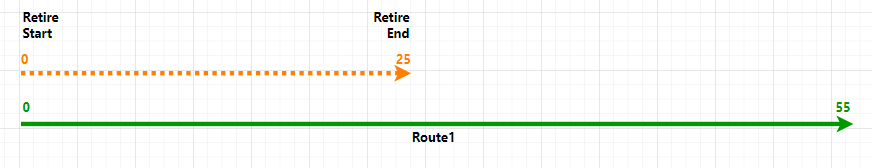
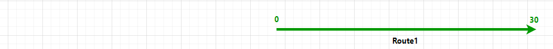
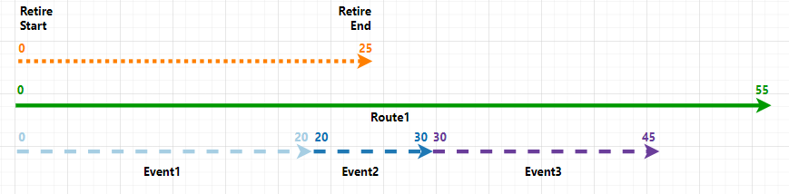
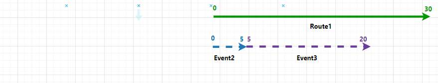
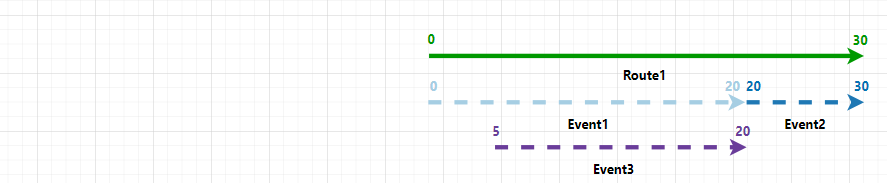
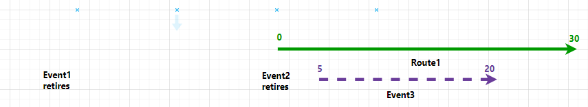
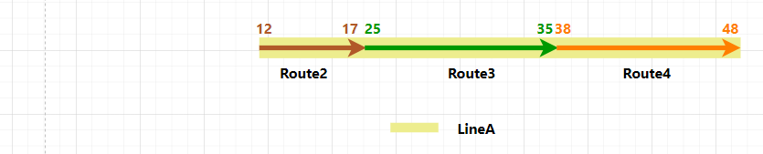
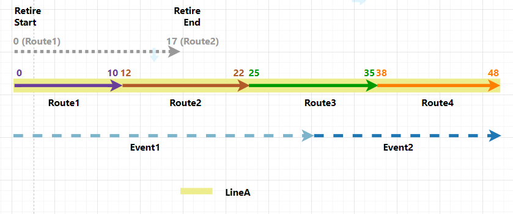
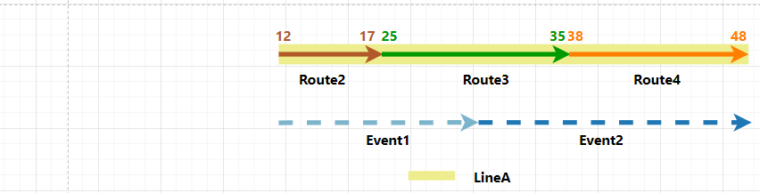
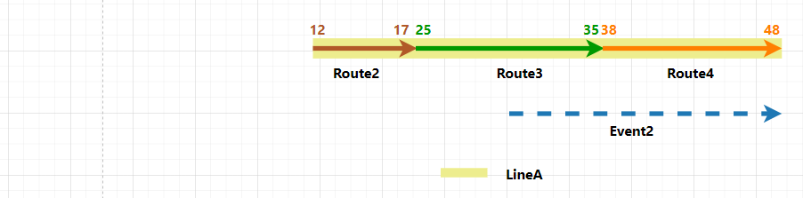
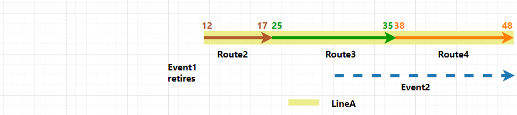
