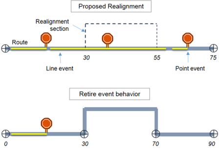
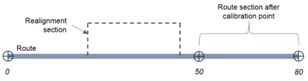
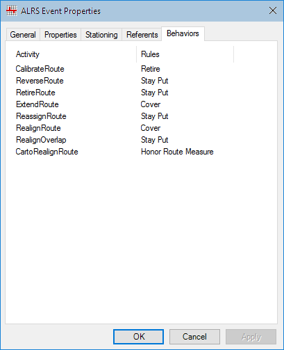

# Event behaviors in ArcGIS Pipeline Referencing

| Field | Value |
| --- | --- |
| **Doc** | 302 · Other · Pro |
| **Product** | Pipeline Referencing |
| **Release** | — |
| **Issues** | — |
| **Source** | [APRServer_EssentialPipelineReferencingConcepts_EventBehaviors.docx](<https://esriis.sharepoint.com/sites/LocationReferencing/Shared%20Documents/General/Doc%20Reviews/700_EssentialPipelineReferencingConcepts_EventBehaviors/APRServer_EssentialPipelineReferencingConcepts_EventBehaviors.docx>) |
| **People** | author — · PE — · dev — |
| **Edited** | 2024-10-02 00:56 by Kyle Chin |
| **Extracted** | 2026-09-04 · lane xmlstrip · format 3.0 · prompt v2.0.2 |
| **Keywords** | event behavior · pipeline referencing · route edit · stay put · move · retire · event measures · event rules |
| **Tools** | Apply Event Behaviors · Create LRS Event · Create LRS Event From Existing Dataset · Modify Event Behavior Rules |

## Summary

This document explains event behavior rules in ArcGIS Pipeline Referencing that define how event measures are updated when LRS routes are edited. It describes the Stay Put, Move, and Retire rules and their effects on events during various route edit activities. It also covers configuration and application of event behavior rules within the LRS network.

## Related documents

<!-- related:begin -->
- [Event behaviors in ArcGIS Pipeline Referencing](<https://esriis.sharepoint.com/sites/lrsworkspace/LRS Doc Index/Other/eb-in-arcgis-apr-apr-2024-10-2.md>) — similar text 0.74 · 3 title words · 6 filename words · same kind/folder <!-- rel:862 s=8.648 -->
- [Configure External Event Behaviors With LRS](<https://esriis.sharepoint.com/sites/lrsworkspace/LRS Doc Index/Other/configure-external-eb-with-lrs.md>) — similar text 0.22 · 2 title words · 2 filename words · same kind/surface <!-- rel:248 s=4.841 -->
- [Support Event Behaviors on Vertical Route Shapes in Reassign Route](<https://esriis.sharepoint.com/sites/lrsworkspace/LRS Doc Index/User Stories/support-eb-on-vertical-route-shapes-in-reassign-route.md>) — similar text 0.20 · 2 title words · 1 filename word · same surface <!-- rel:758 s=3.43 -->
- [Support Event Behaviors on Vertical Route Shapes in Calibrate Route](<https://esriis.sharepoint.com/sites/lrsworkspace/LRS Doc Index/User Stories/support-eb-on-vertical-route-shapes-in-calibrate-route.md>) — similar text 0.20 · 2 title words · 1 filename word · same surface <!-- rel:759 s=3.39 -->
- [Event Behavior for Route Calibration](<https://esriis.sharepoint.com/sites/lrsworkspace/LRS Doc Index/Other/eb-for-route-calibration-apr-2023-11-2.md>) — similar text 0.24 · 1 title word · same kind/surface <!-- rel:448 s=3.303 -->
<!-- related:end -->

<!-- docs:begin -->
## Esri documentation

[Create and modify LRS events](https://doc.esri.com/en/arcgis-pro/latest/help/production/location-referencing-pipelines/create-and-modify-lrs-events.html) · [Event behavior](https://doc.esri.com/en/arcgis-pro/latest/help/production/location-referencing-pipelines/what-is-event-behavior.html) · [3D in Pipeline Referencing](https://doc.esri.com/en/arcgis-pro/latest/help/production/location-referencing-pipelines/3d-in-pipeline-referencing.html) · [Retire routes](https://doc.esri.com/en/arcgis-pro/latest/help/production/location-referencing-pipelines/retire-routes.html) · [Configure continuous measure networks and events to update with an engineering network](https://doc.esri.com/en/arcgis-pro/latest/help/production/location-referencing-pipelines/configure-continuous-measure-networks-and-events-to-update-with-an-engineering-network.html)

_No page matched:_ [Apply Event Behaviors](https://www.google.com/search?q=%22Apply%20Event%20Behaviors%22+site%3Adoc.esri.com) · [Create LRS Event From Existing Dataset](https://www.google.com/search?q=%22Create%20LRS%20Event%20From%20Existing%20Dataset%22+site%3Adoc.esri.com) · [Modify Event Behavior Rules](https://www.google.com/search?q=%22Modify%20Event%20Behavior%20Rules%22+site%3Adoc.esri.com)
<!-- docs:end -->

---

## Event behaviors
ArcGIS Pipeline Referencing keeps event measures in alignment with LRS route edits. You can configure event behavior rules to define how event measures are updated for each type of route edit.

### What is event behavior?
Events are located along a route in a linear referencing system (LRS) using a location reference, such as a measure distance down a route. Because location is based on the route length, changes in the length have a direct impact on how events will be located and how they are rendered on a map. The impact that changes to the route have on events is called event behavior.
Pipeline Referencing supports multiple ways to locate your event on a route, such as measure on route, reference offset from intersection, stations, feature offsets, offset from another event, or x,y coordinates.
The following diagram is an example of a route being realigned. This route has a line event and a point event located along the route. After a route is edited, the events are updated using the event behavior rules.

### Types of event behavior rules
When an LRS route is edited, behavior rules are applied to the events. By providing the event behavior rules, you decide what the event does when the route changes: preserve location or preserve measure.

| Event behavior rules | Description |
| --- | --- |
| Stay Put | Preserves the geographic location of the event; measures may change. |
| Move | Preserves the measures of the event; geographic location may change. |
| Retire | Preserves both measure and geographic location; event is retired. |

#### Stay Put
The Stay Put rule preserves the geographic location of the event. When the route is modified, events retain their x,y coordinates. This means event measures will change whenever it is necessary to retain the location.
With Stay Put event behavior, events downstream of an edit section retain their location. The line events that intersect the edit section will be split into two or more events, so the portion unaffected by the route edit will retain its location. Events that are completely contained in the edited section are retired.

In the above example, the upstream events that did not intersect the realignment did not change, where possible. The line event that spans the realignment section gets split into two parts, and the original event is retired. The point event that falls inside the realignment section is retired. The downstream events retain the x,y location.
The table below shows how the Stay Put event behavior updates events for each edit activity.

| Activity | Events upstream | Events in edited section | Events downstream |
| --- | --- | --- | --- |
| Extend Route | No action. | Shape regenerated. | Measures adjusted to retain x,y if recalibrate downstream is checked. |
| Calibrate Route, Reverse Route | Measures adjusted to retain x,y. | Measures adjusted to retain x,y. | Measures adjusted to retain x,y. |
| Realign Route, Realign Overlapping Route | Up to closest upstream calibration point; measures adjusted to retain x,y if needed. | Retire event; line events crossing edit section will be split and the original event is retired. | Measures adjusted to retain x,y if recalibrate downstream is checked. |
| Retire Route, Reassign Route | No action. | Retire event; line events crossing edit section will be split and the original event is retired. | Measures adjusted to retain x,y if recalibrate downstream is checked. |

#### Move
The Move rule preserves the measures of the event. When a route is modified, events retain their measure values. This means x,y coordinates may change.
For example, with Move event behavior, events downstream of a realignment retain their measure, although the location along the route changes.

In the above example, events in the realignment section and downstream keep their measures and their shape is updated per the new route shape.
The table below shows how the Move event behavior updates events for each edit activity.

| Activity | Events upstream | Events in edited section | Events downstream |
| --- | --- | --- | --- |
| Extend Route | No action. | Shape regenerated. | Shape regenerated if recalibrate downstream is checked. |
| Calibrate Route, Reverse Route | Shape regenerated if needed. | Shape regenerated. | Shape regenerated if needed. |
| Realign Route, Realign Overlapping Route, Retire Route, or Reassign Route | Shape regenerated if needed. | Shape regenerated. | Shape regenerated if recalibrate downstream is checked. |

#### Retire
The Retire event behavior preserves both measure and location. When you modify a route, the system flags the event as retired by changing its To Date value to the effective date of the edit if the event is in an impacted region of the route.
The event measures do not change, but the event will no longer be displayed in the current alignment of the highway. If you want to see the event, you must set the event layer's temporal view date (TVD) to a date and time before the edit.

In the above example, the upstream events retained their measure and location, where possible. The line events that fall in the realignment section completely or partially are retired. The point event that falls inside the realignment section is retired. The downstream events are retired as well.
The table below shows how the Retire event behavior updates events for each edit activity.

| Activity | Events upstream | Events in edited section | Events downstream |
| --- | --- | --- | --- |
| Extend Route | No action. | Retire event. | Retire event if recalibrate downstream is checked. |
| Calibrate Route, Reverse Route | Retire event. | Retire event. | Retire event. |
| Realign Route, Realign Overlapping Route | Up to closest upstream calibration point; retire event if needed. | Retire event; line events crossing edit section will not be split. | Retire event if recalibrate downstream is checked. |
| Retire Route, Reassign Route | No action. | Retire event; line events crossing edit section will not be split. | Retire event if recalibrate downstream is checked. |

### Factors to consider
In addition to the above event behavior rules, consider the following additional factors to understand event behavior.

#### Recalibrate downstream
Route edits affect the calibration of the route, and during the edit activity, the Pipeline Referencing dialog box prompt you to recalibrate downstream.

As shown in the above example, there are calibration points at measures 0, 50, and 80. You can choose to recalibrate downstream during realignment activity. This will update the calibration of the route after the calibration point at measure 50 until the end of the route.
Due to recalibration, the event behavior you set for Calibrate Route is applied to the recalibrated section.

### Application of event behavior
Event layers reside in the geodatabase that contains your LRS.
https://pro.arcgis.com/en/pro-app/3.3/help/production/location-referencing-pipelines/events-data-model.htm  \hLearn more about event types
Events can have event behavior applied after each edit or after a series of edits using the https://pro.arcgis.com/en/pro-app/tool-reference/location-referencing/apply-event-behaviors.htm \hApply Event Behaviors geoprocessing tool.

### Configuration of event behavior rules
Event behavior is configured when you register events with the LRS Network. You can also reconfigure event behavior at any time by opening the event layer's properties.
Default event behavior is configured during the event registration process when using either the https://pro.arcgis.com/en/pro-app/3.3/tool-reference/location-referencing/createlrsevent.htmCreate LRS Event or https://pro.arcgis.com/en/pro-app/3.3/tool-reference/location-referencing/create-lrs-event-from-existing-dataset.htmCreate LRS Event From Existing Dataset tool.
https://pro.arcgis.com/en/pro-app/help/production/location-referencing-pipelines/create-and-modify-lrs-events.htm \hLearn more about creating and modifying LRS events
During the process of registering events through the LRS event setup wizard, you can set event behavior rules for each type of activity applied to the route.
Note:
Event behavior rules are not applied to x and y offset events, offset from an event, and offset from a point feature class.

The following event behavior rules are set by default:

| Activity |  | Rule |  |
| --- | --- | --- | --- |
| Calibrate Route |  | Stay Put |  |
| Retire Route |  | Stay Put |  |
| Extend Route |  | Stay Put |  |
| Reassign Route |  | Stay Put |  |
| Realign Route |  | Stay Put |  |
| Reverse Route |  | Stay Put |  |
| Carto Realign Route |  | Honor Route Measure |  |

https://pro.arcgis.com/en/pro-app/help/production/location-referencing-pipelines/create-and-modify-lrs-events.htm \hLearn more about creating and modifying LRS events
You can review configured event behaviors by https://pro.arcgis.com/en/pro-app/3.3/help/production/location-referencing-pipelines/view-lrs-event-properties.htmviewing LRS event properties. To modify event behavior rules, use the https://pro.arcgis.com/en/pro-app/3.3/tool-reference/location-referencing/modify-event-behavior-rules.htmModify Event Behavior Rules tool.

### Application of event behavior
Event layers reside in the geodatabase that contains your LRS.
https://pro.arcgis.com/en/pro-app/3.3/help/production/location-referencing-pipelines/events-data-model.htm  \hLearn more about event types
Events can have event behavior applied after each edit or after a series of edits using the https://pro.arcgis.com/en/pro-app/tool-reference/location-referencing/apply-event-behaviors.htm \hApply Event Behaviors geoprocessing tool.

