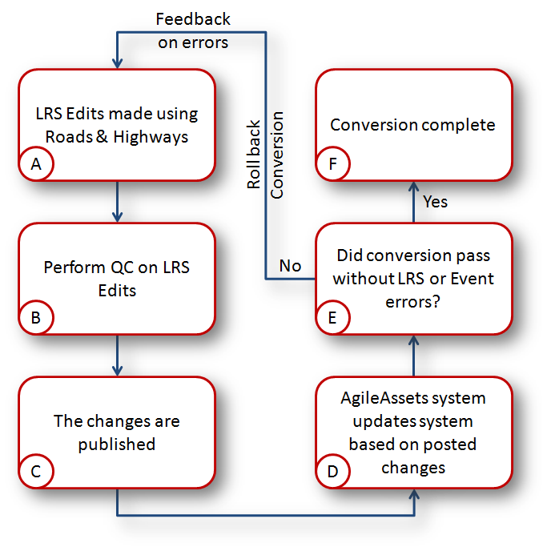
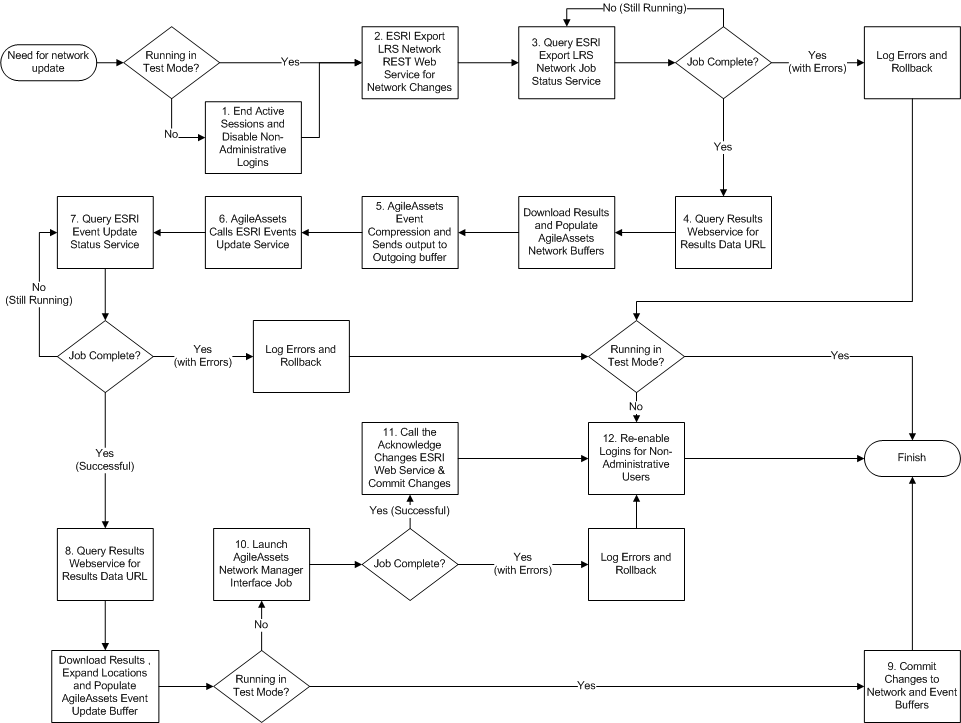

# Esri Roads and Highways and AgileAssets Integration Technical Specification

|   |   |
| --- | --- |
| **Kind** | Other · Server |
| **Release** | — |
| **Product** | Roads & Highways |
| **Source** | [Roads and Highways - AgileAssets Integration Version 1_13 (2013-08-29).docx](<https://esriis.sharepoint.com/sites/LocationReferencing/Shared%20Documents/General/Roads%20and%20Highways%20-%20AgileAssets%20Integration%20Version%201_13%20(2013-08-29).docx>) |
| **Edited** | 2020-05-08 15:25 by Eric Blasko |
| **Extracted** | 2026-09-04 · lane `xmlstrip` |

<!-- metadata
```yaml
title: "Esri Roads and Highways and AgileAssets Integration Technical Specification"
source_file: "Roads and Highways - AgileAssets Integration Version 1_13 (2013-08-29).docx"
source_url: "https://esriis.sharepoint.com/sites/LocationReferencing/Shared%20Documents/General/Roads%20and%20Highways%20-%20AgileAssets%20Integration%20Version%201_13%20(2013-08-29).docx"
doc_id: 810
doc_kind: "Other"
surface: "Server"
doc_revision: ""
target_release: ""
pe: "Eric Perrone"
dev: "Will Isley"
author: "Eric Perrone"
last_edited_by: "Eric Blasko"
last_edited: "2020-05-08T15:25:15Z"
extracted: 2026-09-04
extraction_lane: xmlstrip
prompt_version: "v2.0.2"
keywords: ["agileassets", "roads and highways", "lrs update", "event conversion", "rest services", "quality control", "event data", "temporal data management"]
tools: ["Export LRS Network", "Query Event Changes", "Acknowledge Event Changes", "Relocate Events on LRS"]
products: ["Roads & Highways"]
issues: []
related: [{"doc":875,"file":"esri-roads-and-highways-tutorial__doc875.md","s":3.756},{"doc":885,"file":"arcgis-pipeline-referencing-an-introduction__doc885.md","s":2.111},{"doc":806,"file":"export-network-in-pro__doc806.md","s":2.095},{"doc":805,"file":"support-line-networks-and-json-in-export-network__doc805.md","s":1.99},{"doc":639,"file":"test-plan-for-supporting-json-in-export-network__doc639.md","s":1.918}]
```
-->

## Summary

This document specifies the technical approach for integrating Esri Roads and Highways with AgileAssets. It covers DOT requirements, solution approaches including LRS update and event conversion, REST services for exporting LRS data and event measure changes, quality control checks, data import strategies, system recovery, and handling large updates. The document also details target data schemas, field mappings, and temporal data management for event synchronization between the systems.

## Related documents

<!-- related:begin -->
- [Esri Roads and Highways Tutorial](<https://esriis.sharepoint.com/sites/lrsworkspace/LRS Doc Index/Other/esri-roads-and-highways-tutorial__doc875.md>) — similar text 0.20 · 2 title words · 2 filename words · same kind/folder <!-- rel:875 -->
- [ArcGIS Pipeline Referencing: An Introduction](<https://esriis.sharepoint.com/sites/lrsworkspace/LRS Doc Index/Other/arcgis-pipeline-referencing-an-introduction__doc885.md>) — similar text 0.15 · same kind/folder <!-- rel:885 -->
- [Export Network in Pro](<https://esriis.sharepoint.com/sites/lrsworkspace/LRS Doc Index/Design Spikes/export-network-in-pro__doc806.md>) — similar text 0.23 · same folder <!-- rel:806 -->
- [Support line networks and JSON in Export Network](<https://esriis.sharepoint.com/sites/lrsworkspace/LRS%20Doc%20Index/User%20Stories/support-line-networks-and-json-in-export-network__doc805.md>) — similar text 0.14 · same folder <!-- rel:805 -->
- [Test Plan for Supporting JSON in Export Network](<https://esriis.sharepoint.com/sites/lrsworkspace/LRS Doc Index/Test Plans/test-plan-for-supporting-json-in-export-network__doc639.md>) — similar text 0.12 · same surface <!-- rel:639 -->
<!-- related:end -->

<!-- docs:begin -->
## Esri documentation

[3D in Roads and Highways](https://doc.esri.com/en/arcgis-pro/latest/help/production/roads-highways/3d-in-roads-and-highways.html) · [Events data model](https://doc.esri.com/en/arcgis-pro/latest/help/production/roads-highways/events-data-model.html)

_No page matched:_ [Export LRS Network](https://www.google.com/search?q=%22Export%20LRS%20Network%22+site%3Adoc.esri.com) · [Query Event Changes](https://www.google.com/search?q=%22Query%20Event%20Changes%22+site%3Adoc.esri.com) · [Acknowledge Event Changes](https://www.google.com/search?q=%22Acknowledge%20Event%20Changes%22+site%3Adoc.esri.com) · [Relocate Events on LRS](https://www.google.com/search?q=%22Relocate%20Events%20on%20LRS%22+site%3Adoc.esri.com)
<!-- docs:end -->

---

## Esri Roads and Highways

## and

## AgileAssets

## Integration

## Technical Specification

Document History

| Date | Version | Participants | Notes |
| --- | --- | --- | --- |
| 8/14/2013 | 1.12 | State Reviewed Version | Eric Perrone/Will Isley |
| 8/29/2013 | 1.13 | Added Page Numbers and Document History Table Accepted All Previous Changes , Edited headings | Eric Perrone |

 TOC  \h \z \u 1Purpose PAGEREF _Toc365537365 \h 4
1DOT Requirements PAGEREF _Toc365537366 \h 4
1.1Single-source LRS PAGEREF _Toc365537367 \h 4
1.2Event Location Stability PAGEREF _Toc365537368 \h 4
1.3Quality Control Check Requirements PAGEREF _Toc365537369 \h 4
1.4AgileAssets Event Data Consumption and Publication PAGEREF _Toc365537370 \h 4
1.5System Recovery PAGEREF _Toc365537371 \h 4
1.6Large Updates PAGEREF _Toc365537372 \h 4
2Solution Approaches PAGEREF _Toc365537373 \h 4
2.1LRS Update and Event Conversion PAGEREF _Toc365537374 \h 5
2.1.1Interface Processing Flow PAGEREF _Toc365537375 \h 6
2.1.2Source Specifications PAGEREF _Toc365537376 \h 8
2.1.3Roads and Highways REST Services PAGEREF _Toc365537377 \h 9
2.1.4Target Specifications PAGEREF _Toc365537378 \h 34
2.1.5AgileAssets and Temporal Data Management PAGEREF _Toc365537379 \h 40
2.2Quality Control Approach PAGEREF _Toc365537380 \h 40
2.3AgileAssets Event Data Utilization Approach PAGEREF _Toc365537381 \h 41
2.4AgileAssets Data Imports PAGEREF _Toc365537382 \h 42
2.5System Recovery Approach PAGEREF _Toc365537383 \h 43
2.6Large Updates Approach PAGEREF _Toc365537384 \h 43
3Appendix PAGEREF _Toc365537385 \h 43
3.1Reporting of Alternate LRM PAGEREF _Toc365537386 \h 44
3.2Measure Change LRM PAGEREF _Toc365537387 \h 44
3.3Event Retirement PAGEREF _Toc365537388 \h 44
3.4Event Splitting PAGEREF _Toc365537389 \h 45

## 1Purpose
The purpose of this document is to describe the DOT requirements and suggested approach for the integration of the AgileAssets and Esri Roads and Highways.

## DOT Requirements
In a meeting at GIS-T, hosted by NYSDOT, NCDOT, VDOT, GDOT, WVDOT, LaDOTD with Esri and AgileAssets in attendance, the DOTs requested the following requirements for integration (please note, this document of DOTs' needs is only a mechanism to begin design discussions while these DOTs more formally document their requirements, led by Kevin Hunt of NYSDOT):

### Single-source LRS
The DOTs require a single LRS data maintenance point for the entire enterprise.  The resulting LRS should be able to fill all of the LRS needs within the DOT.

### Event Location Stability
The DOTs require that some event data, wherever it may reside, be updated to reflect changes to the LRS network.  The changes to the various event warehouses should be done as soon as possible while maintaining data quality.

### Quality Control Check Requirements
The DOTs require QC checks and correction ability for both the LRS and for Event data.

### AgileAssets Event Data Consumption and Publication
The DOTs need to consume AgileAssets event data within ArcGIS and Roads and Highways in order to support the following functions:

- Visualize event locations on a map
- Symbolize event data on the map based on attributes
- Query event records for analysis against LRS
- Export event records in LRS to other spatial formats for publication
- Publish REST services for mapping and query that incorporate the event data

### System Recovery
The DOTs need a way to recover their system in case of an unexpected system failure and the 2 systems become out of sync.

### Large Updates
The DOTs need the systems to be able to support the performing of mass edits to the LRS, such as bringing online county or municipal LRS routes.

## Solution Approaches

### LRS Update and Event Conversion
The chart below describes the integration approach between AgileAssets and Esri Roads and Highways to support requirements 2.1 (Single-source LRS) and 2.2 (Event Location Stability).

Step A - The user makes LRS edits in Roads and Highways. The assumption, though not a requirement, is that the edits make up a cohesive package such as all of the recent changes to a specific route.
When a user edits a route, or set of routes, as part of a logical set of changes to the network, they would create an ArcSDE GDB version in ArcMap. They would then perform the Roads and Highways route edits.
Step B - At some deliberate point the user makes the decision to perform Quality Control measures on their edits.  The QC would be performed by running QC tools to verify the changes against the GDB version (checking for LRS monotonic calibration). The user would then, in Roads and Highways, correct any mistakes to the route edit or calibration changes. Optionally, a different user can be assigned to cross check Roads and Highways edits using QC tools orchestrated by ArcGIS Workflow Manager.
Step C – Once QC has passed the edited LRS is published.
The publishing is accomplished by posting the changes to a designated GDB ArcSDE named version. At this point the LRS is ready for the AgileAssets system to then acquire.
Step D – Either through a manual or scheduled process, the AgileAssets system will then consume the Roads and Highways LRS changes.  At this point, the AgileAssets system will be set up to disallow users to log in and use the system during the update process.
The AgileAssets system will then invoke a REST service to generate the attribute data required of the AgileAssets LRS.
Step E & F - If any errors were found during the conversion a list of those errors is logged in the appropriate tables.  If critical errors were found, all changes will be rolled back.  If not then the conversion is complete. LRS uniqueness errors are typically critical errors and would need to be corrected in Roads and Highways prior to successful completion of the interface, event location errors may be considered critical or not by the Agency and would need to be corrected in AgileAssets manually.
If there are fatal errors (database crashes, network fails, hardware failure, etc.), then the Agile system will roll back all changes and not ingest any updates from Roads and Highways. Additionally errors related to basic ambiguities in the LRS itself are considered critical and would need to be corrected in Roads & Highways before the interface will complete successfully.  It is expected that the core QA procedures in Esri Roads and Highways will prevent these types of errors from occurring well before the interface runs. However, if the failure was related to the LRS, i.e., a route not having monotonic calibration, then fixing the LRS would need to take place in Roads and Highways and then the interface process would need to be rerun. Roads and Highways has a geoprocessing tool to detect routes that do not have monotonic calibration. Roads and Highways also provides calibration point editing tools to correct route calibration.
With respect to location errors related to event data, the Agency can choose whether to allow these errors to prevent the interface from running or not.  If these errors are ignored and the interface is allowed to proceed, the system will log which event updates were not successfully located (either by Esri when being read from the AgileAssets system, or by Agile when attempting to apply an event update on the new network) in the AgileAssets NET_EXT_LOCATIONS_U_OUT table.  Then the AgileAssets business users and system administrators will need to update those events manually after the interface completes.  Otherwise the interface is prevented from running and the business users can correct the events before trying to run the interface again.
In order to further reduce the possibility of data errors, the interface also includes the ability to run the processing in a “test mode” that allows AgileAssets business data owners to identify and correct errors prior to processing the changes against the final data sets.  This mode allows the AgileAssets business owners to see the prospective changes to the network and events within AgileAssets.  In the “test mode” the interface processes all steps except the final push of the changes into the AgileAssets system.  This leaves all the updated network and event data in the AgileAssets interface buffer tables that can then be made available to users in the front end of AgileAssets for review using standard AgileAssets data windows, reports and graphs.
Based on our history with LRS interfaces we believe it is critical for the data owners to have the opportunity to see the effects that LRS changes will have on their data so any procedurally valid but ultimately incorrect edits to the network can be found and corrected.  AgileAssets has created standard report views that show where the network is changing and lists the before and after LRS values for the events to be updated. These views are generic and can be utilized by any AgileAssets clients to review the test-mode changes prior to running the interface in production.

#### Interface Processing Flow
This subsection provides flow diagram(s) and a pictorial view of the Process Flow, as applicable to the interface.  The interface is designed with a test mode to allow business users within AgileAssets system to review prospective changes to the events and the network prior to running the full update.
Exhibit  SEQ Exhibit \* ARABIC 1: Process Flow

The need to update the route network (per business logic) in the AgileAssets system triggers the process. This may be a scheduled process or manually triggered.  The following steps are performed to update the route network and events within the AgileAssets system.

- If the interface is not running in Test mode then End Active Sessions and Disable non-administrative logins.  This step will remove any currently active sessions and prevent any non-administrative users from logging into the system.  This will prevent the system from generating any new location data while the interface is running.
- Call the Esri Export LRS REST web service.  AgileAssets will call the Esri web service starting the Esri process of creating the necessary export data to update the AgileAssets route network to the currently published Esri route network.  AgileAssets will request the output for all changed routes since the last interface run. This web service returns to AgileAssets a job identification ID that AgileAssets will use in subsequent steps to check the status of the job and then retrieve the output from the job.
- Query Esri Job Status Operation - Export LRS Network REST web service to check the status of the job.  This step will be repeated periodically until the service indicates that the job has been completed.  If the status indicates that errors have occurred, the interface will log the errors, rollback changes, and re-enable logins if the interface is not in test mode.
- After the job has completed AgileAssets will call the Network Export Job Results service to obtain the URL for the results file.  The AgileAssets will download the file from the URL and parse its contents into the AgileAssets buffer tables.
  - The Routes and geometry information will be parsed and placed in the buffer table NET_EXT_ROUTES
  - The GAPS information will be parsed into the NET_EXT_GAPS buffer table
  - The Concurrency information will be parsed into the NET_EXT_CONCURRENCY table
  - The mapping between base and alternate LRMs will be parsed into the NET_EXT_LRMS table
- After the successful download of the route network data, AgileAssets prepares for the event updating portion of the interface by creating a listing of all distinct LRS locations within the system.  This table NET_EXT_LOCATIONS_UPD will be populated with unique location identifiers and the currently active LRS reference for each.  This table is registered with the ESRI Roads and Highways system which in a later step allows the ESRI Event updates web service to read events that need updating and process the required updates.
- AgileAssets will call the ESRI Event Update web service asynchronously.  This will start the Event updating process within ESRI Roads and Highways. The ESRI system will read all events that need to be updated from the registered AgileAssets table NET_EXT_LOCATIONS_UPD (populated in the previous step).
- AgileAssets will query the Esri Job Status Operation for the running Event Update job to check the status of the job.  This step will be repeated periodically until the service indicates that the job has completed.  If the status indicates that errors have occurred, the interface will log the errors, rollback changes, and re-enable logins if the interface is not in test mode.
- If the Event Update job completes successfully AgileAssets calls the Job Results service to obtain the URL of the output results file.  This file is downloaded and parsed and the results are placed into the NET_EXT_LOCATIONS_U_OUT buffer table which maps each updated location in AgileAssets with the newly updated LRS reference.
- If the interface is running in test mode the system will commit the changes to the buffer tables and finish the process.  The buffer tables will then be used to generate comparison reports that show before and after comparisons of the network and event changes that would be applied during the interface. Business data owners and application administrators may review the changes and identify problems before running the interface in production mode.
- If the interface is running in production mode AgileAssets will then kick off the standard AgileAssets NetworkManagerInterface job to push the network and event updates into the system.
- If the NetworkManagerInterface job within AgileAssets completes successfully AgileAssets will call the Esri Acknowledge Event Changes web service to acknowledge that the updates have been applied. If the NetworkManagerInterface job does not complete successfully the error is logged and all changes rolled back.  The Esri Acknowledge changes service is not called leaving those updates unacknowledged.
- If in production mode re-enable Non-Administrative logins to the system.

#### Source Specifications
This section outlines the existing and to be developed interfaces in the Esri Roads and Highways that can be leveraged to integrate with the AgileAssets system. The purpose of the integration is to provide the AgileAssets system a copy of the Linear Referencing System (LRS) as well as measure updates to asset event data that references the LRS network in order to maintain measures on event data that are synced with the LRS in Esri Roads and Highways.
The approach of copying the LRS, described in this section, is an integration pattern with Roads and Highways that is specific to AgileAssets due to that systems need to maintain a copy of the LRS modeled in an AgileAssets specific schema.
There are 2 methods exist for acquiring an LRS copy from Roads and Highways:

- Invoking REST services exposed by Roads and Highways for Server
- Querying Geodatabase feature classes and tables in Roads and Highways

The technology choice for integration (REST services or Geodatabase queries) depends on the need for updating the data in the AgileAssets system. The defined approach is to use the Roads and Highways REST services.

#### Roads and Highways REST Services
This section documents the REST services exposed by Road and Highways for Server for acquiring information about the LRS, including measure updates required to external system (AgileAssets system) event data mapped on the LRS.
The Roads and Highways for Server REST API online documentation is located at:
http://roadsandhighwayssample.esri.com/roads/api/index.html
The ArcGIS for Server REST API online documentation is located at:
http://help.arcgis.com/en/arcgisserver/10.0/apis/rest/index.html?gettingstarted.html

##### Linear Referencing System Export REST Service
At the 10.2.1 release of Esri Roads and Highways, the plan is to support exporting the linear referencing system via a REST service call to export LRS elements such as the list of networks, network routes, route gaps, concurrencies, and Linear Referencing Method (LRM) measure translations in an easy to consume format that abstracts callers from the schema Roads and Highways uses to managed the multi-LRM LRS. This service will be implemented as an ArcGIS Server Geoprocessing (GP) Service. This service is the recommended approach for the AgileAssets system to acquire a copy of LRS elements that it needs given that the Agile Network Manager requires the ability to copy the LRS into its internal database structure.  The interface will be designed to query changes to the route network from the last update.
The to be built GP service supports exporting the LRS to one of 3 file formats, JSON, File Geodatabase or a single compressed (zipped) file containing a shape file for route geometry and CSV files for other related data.  The interface will be configured to download the required network changes via JSON, an Esri File Geodatabase, shape file, or CSV data for transfer of geometric data. The GP service can be invoked asynchronously, allowing the caller to get progress of the execution of the export. The export file is acquired through via calling 3 different REST operations. These REST operations are:

- Submit Job
- Job Status
- Job Results
The caller invokes the submit job REST endpoint, passing desired parameters for the export (output file format, spatial reference of routes, etc.). This call returns a job ID. Subsequent calls invoke the job status REST endpoint passing the job ID. This call returns the status of the job (the status of which routines are being executed). The caller should continue to invoke the job status call until the returned status is job complete. Upon this call, the caller should invoke the job results REST endpoint to acquire the URL of the LRS export file.
This Roads and Highways for Server REST service are hosted in Esri’s ArcGIS for Server product which has an administrator interface, documented in the user help located at:
http://resources.arcgis.com/en/help/main/10.1/index.html#//np000000).
From this interface you can view ArcGIS for Server logs, view service status, admin, and publish services. In addition, the Roads and Highways services produce a detailed execution log for technical administration trouble shooting. AgileAssets will also display status information for the processing on screen if the user is running the interface job in interactive mode, otherwise job status will be timestamped and logged in the job log for later review by system administrators.
Note: The DOTs may load county and municipal routes into the LRS that they may not want to expose to the AgileAssets system (they can if they want to however). If they wish to filter this data to the Agile system, the approach would be to apply a definition filter on the network layer published in the geoprocessing service to hide these layers. If layers are filtered, the Agile system will not ingest them. If routes are reassigned to filtered routes (county routes), then the Agile system will treat event reassignment to these filtered routes as retirement. In order to use a definition filter to filter non-state managed routes from the Agile system, this attribute would need to be modeled on the Road and Highways route table.

- Submit Job Operation - Export LRS Network

Example URL

http://<server>/arcgis/rest/services/<serviceName>/GPServer/ExportLRSNetwork/submitJob

##### Description
Gives the caller the ability to export the Linear Referencing System, via a REST service, to acquire details on:

- Routes
- Concurrencies
- LRM Translations
- Gaps

##### Parameters

| Parameter | Details | Value used in this integration |
| --- | --- | --- |
| f | Description : The response format. The default response format is html. Values : html \| json | f= json |
| lastInvokedTime | Description : When an external system makes a relocate measures service request, the time of the request is returned in the response (based on the date / time of the Roads and Highways server system time) . The external system should pass this date / time back to this call on subsequent requests if they only want changes to the LRS since the last time they made this request. If no value is provided , then the entire network will be exported for all transactions , constrained by the lrsTime and lastLrsTime parameter (see lrsTime and lastLrsTime parameter definition s ). This parameter is required if the invoker wishes to ingest only network changes for a fixed lrsTime (see lrsTime parameter) as Roads and Highways supports editing routes for future or past dates. Without this parameter, I would be unclear which edits need to be applied to the desired lrsTime without potentially reporting a route as changed on more than one subsequent call. Such is the case if a user edits a Roads and Highways route effect the 1/1/2015 (but made the edit in 1/1/2013). If the external system then requests the network on 2/1/2013, then 2/1/14, then on 2/2/15, then on 3/2/15. We want to ensure the first 2 requests don’t return the route change, the 3rd one does, and the 4 th one does not. Example : lastInvoked T ime = (1 Jan 2008 00:00:00 GMT) | lastInvokedTime = Time of previous call (actual date using the UTC millisec format). |
| lsr Time | Description : The temporal view date for which LRS network element are desired. Roads and Highways stores routes and other network details with different representations across time. This parameter can be used to focus the time view of the network being returned , especially useful for external systems that don’t support multiple representations of the LRS network across time. For such systems, a specific time snapshot of the network can be requested. If no value is provided, t he default is to return all route elements across all time , contrained by the lastInvokedTime parameter if one is provided (see lastInvokedTime parameter). The parameter value for lrsTime is a number that represents the number of milliseconds since epoch (January 1, 1970) in UTC. Example : lrs T ime = (1 Jan 2008 00:00:00 GMT) | lrsTime = Today (actual date using the UTC millisec format). |
| lastLrs Time | Description : This parameter represents the last lrsTime that the caller used in the previous call to this service. The value provided is used to tell Roads and Highways which route changes have already been returned to previous invocations. If no value is provided, the default is to return all route elements across all time , contrained by the lastInvokedTime parameter if one is provided (see lastInvokedTime parameter). The parameter value for lastLrsTime is a number that represents the number of milliseconds since epoch (January 1, 1970) in UTC. Example : lastLrs T ime = (1 Jan 2008 00:00:00 GMT) | lastLRSTime = lrsTime of previous call (actual date using the UTC millisec format). |
| outputFormat | Description : The desired output file format. JSON, File Geodatabase, and CSV files are supported. If CSV format is selected, then the CSV files are all zipped into a single file. The shape component of the routes for the CSV file export are exported to shape file and all files are zipped into a single file. The default is json . Values: json \| csv \| fgdb | outputFormat = fgdb |
| outputSpatialReference | Description: The well know ID (WKID) of the desired spatial reference for the LRS network route geometries. The default is to return the geometry of the routes in the spatial reference of the network. Example : outputSpatialReference = 4312 | Not specified |
| measureScale | Description: The number of digits, for measure values in routes, to provide that are to the right of the decimal point. Roads and Highways stores measures as floating point numbers, but can return these numbers to a fixed decimal point rounded to the nearest measure. Default is 3. Example : measureScale = 3 If the measures were stored in miles, then the above call would return the measures to the nearest thousandths of a mile. | 4 |
| lrmTranslations | Description: The comma separated list of network IDs desired for LRM translation, translated from the base network. Default is to return no LRM translations. Example: lrmTranslations =2,3 | TBD once the LRM’s are configured within ESRI Roads and Highways, this will be provided |

##### Example Usage
Example 1: URL for exporting the network as a JSON file, defaulting other parameters
http://<server>/arcgis/rest/services/ExportLRSNetwork/GPServer/ExportLRSData/submitJob?
&f=json

Example 2: URL for exporting the network as a JSON file, for all network changes since transaction ID 71649b80-fcf3-4fd0-a884-84dee25c03ff, from the DEFAULT ArcSDE version, into the 4312 spatial reference.
http://<server>/arcgis/rest/services/ExportLRSNetwork/GPServer/ExportLRSData/submitJob? lastInvokedTime=&lrsTime=&lastLrsTime=&gdbVersion=DEFAULT&outputFormat=JSON&outputSpatialReference=4312&f=pjson

##### JSON Response Syntax
{
 "jobId": "<jobId>",
 "jobStatus": "esriJobSubmitted"
}

##### JSON Response Example
{
 "jobId": "j02079c45889d4e12a71d5078e9e4e7da",
 "jobStatus": "esriJobSubmitted"
}

- Job Status Operation - Export LRS Network

URL

http://<server>/arcgis/rest/services/<serviceName>/GPServer/ExportLRSNetwork/jobs/<jobId>

##### Description
Allows the caller to check job status on a GP service.

##### Example Usage
Example 1: URL for checking the job status of the network export operation for job ID j7f6dbec6ef0d490e91f719afa878f706.

http://<server>/arcgis/rest/services/ExportLRSNetwork/GPServer/ExportLRSNetwork/jobs/j7f6dbec6ef0d490e91f719afa878f706

##### JSON Response Syntax
{
 "jobId": "<jobId>",
 "jobStatus": "esriJobSubmitted"
}

##### JSON Response Example
{
 "jobId": " j7f6dbec6ef0d490e91f719afa878f706",
 "jobStatus": "esriJobSubmitted"
}

- Job Results Operation - Export LRS Network

URL

http://<server>/arcgis/rest/services/<serviceName>/GPServer/ ExportLRSNetwork/jobs/<jobID>/results/outputFile

##### Description
Allows the caller to acquire the URL of the LRS export file once the export job is complete.

##### Example Usage
Example 1: URL for getting the URL of the export file produced as a result of invoking a network export operation for job ID j7f6dbec6ef0d490e91f719afa878f706.

http://<server>/arcgis/rest/services/ ExportLRSNetwork/GPServer/ ExportLRSNetwork/jobs/ j7f6dbec6ef0d490e91f719afa878f706/results/outputFile

##### JSON Response Syntax
{
  "paramName": "outputFile",
  "dataType": "GPDataFile",

```
  "value": {
    "url": “<outputFileUrl>”
    }
}
```

##### JSON Response Example
{
  "paramName": "outputFile",
  "dataType": "GPDataFile",

```
  "value": {
    "url": “http://rhdemo.esri.com /arcgis/rest/directories/arcgisjobs/exportlrsdata_gpserver/jb631ae854703433c99c0f2214f266da2/scratch/export.json”
    }
}
```

##### Table Export Schema & Examples
The following describes the file schema to support the CSV and File Geodatabase exports. All data types reflect Esri geodatabase data types. The routes table is exported to shape file to support open standard storage of the route geometry.  If a file geodatabase is used the routes and geometry information is stored in a feature class.
Note: Most examples show sample CSV output, but the plan is to use File Geodatabase for the AgileAssets to Roads and Highways integration. The outputted values for FGDB are the same, just provided in FGDB format. Example output for JSON is excluded from this document, since the Agile system will not leverage the JSON output.
Though Roads and Highways supports multiple export formats, the Agile system will use the File Geodatabase export format option.
Export Details Table
This table holds the information related to the export operation.

| Column Name | Description | Primary Key | Null? | DataType |
| --- | --- | --- | --- | --- |
| LRS_TIME | The temporal view date / time of the network requested. If null, the network information provided spans all time. | N | Y | DATE |
| LAST_LRS_TIME | The temporal view date / time requested in the previous invocation of the Export LRS Network service. | N | Y | DATE |
| INVOKED_TIME | The Roads and Highways recorded time stamp of the external system’s invocation of the Export LRS Network service. | N | Y | DATE |
| LAST_INVOKE_TIME | The time stamp of the previous invocation of the Export LRS Network service by the external system. | N | Y | DATE |

Networks Table
This table holds the list of network records relevant to the export, the base network and any networks included in the LRM translations.

| Column Name | Description | Primary Key | Null? | DataType |
| --- | --- | --- | --- | --- |
| NETWORK_ID | String that holds an ID that uniquely identifies the network. | Y | N | TEXT(32) |
| NETWORK_NAME | The name of the network. | N | N | TEXT(100) |
| UNITS_OF_MEASURE | Holds the integer that represents the “ Esri measure units” (see table at the end of this section) | N | N | INTEGER |

CSV File Example (to show contents, real contents could be File Geodatabase):

“1”,”State Mile Point”,5
“1”,”County Mile Point”,5

Routes Table
This table is a shape file that holds the list of routes in the base network, including the PolylineMZ shape of the route.  This will be exported to a shape file or a Feature class within a file geodatabase.

Note: Measures are stored in a text field vs. a double or float in order to provide fixed point number storage and prevent number approximations that can occur with floating point numbers like doubles or floats.

| Column Name | Description | Primary Key | Null? | DataType |
| --- | --- | --- | --- | --- |
| NETWORK_ID | String that holds a GUID that uniquely identifies the network. | Y | N | TEXT(32) |
| ROUTE_ID | String that holds the ID that uniquely identifies the route. This is the route ID configured in Roads and Highways, and is entered by the user when creating routes. | Y | N | TEXT( 255 ) |
| START_MEASURE | The start measure of the route (measure on the first vertex of the route, may not be the minimum measure on the route). | N | Y | TEXT |
| END_MEASURE | The end measure of the route (measure on the last vertex of the route, may not be the maximum measure on the route). | N | Y | TEXT |
| START_DATE | The network start date that the route geometry is effective. | N | Y | DATE |
| END_DATE | The network end date that the route geometry is retired. | N | Y | DATE |
| SHAPE | The polyline geometry of the route including spatial reference and M’s (measures) and Z’s (elevation) on each vertex. | N | Y | POLYLINEMZ |

CSV File Example (to show contents, real file will be shape file or File Geodatabase):

Gaps Table
This table defines the schema of the CSV file/file geodatabase table that will store the route gaps in the base network. The Roads and Highways export LRS Network service creates a table of physical and measure gaps on routes for the Agile system to ingest. In the Roads and Highways data model, physical and measure gaps are not explicitly stored in a table but are derived from the PolylineM geometry of the route. In the Agile database, physical and measure gaps are stored in a table.

| Column Name | Description | Primary Key | Null? | DataType |
| --- | --- | --- | --- | --- |
| NETWORK_ID | String that holds a GUID that uniquely identifies the network for the specified route gap. | Y | N | TEXT(32) |
| ROUTE_ID | String that holds the ID that uniquely identifies the route. This is the route ID configured in Roads and Highways, and is entered by the user when creating routes. | Y | N | TEXT( 255 ) |
| GAP_START_MEASURE | The start measure for the gap. | Y | Y | TEXT |
| GAP_END_MEASURE | The end measure of the gap. | Y | Y | TEXT |
| GAP_TYPE | Specifies if the gap is a measure gap = 0, a physical gap = 1, or both = 2. | N | Y | INTEGER |
| START_DATE | The network start date that the gap lives on the route. | Y | Y | DATE |
| END_DATE | The network end date that the gap no longer lives on the route. | N | Y | DATE |

CSV File Example:

Concurrencies Table
This table defines the schema of the CSV file/file geodatabase table that will store route concurrencies on the base network.

| Column Name | Description | Primary Key | Null? | DataType |
| --- | --- | --- | --- | --- |
| DOMINANT_NETWORK_ID | String that holds a GUID that uniquely identifies the network for the dominant route in the concurrency. | Y | N | TEXT(32) |
| DOMINANT_ROUTE_ID | String that holds the ID that uniquely identifies the dominant route in the concurrency. This is the route ID configured in Roads and Highways, and is entered by the user when creating routes. | Y | N | TEXT( 255 ) |
| DOMINANT_START_MEASURE | The start measure of the concurrency for the dominant route. | Y | Y | TEXT |
| DOMINANT_END_MEASURE | The end measure of the concurrency for the dominant route. | Y | Y | TEXT |
| SUBORDINATE_ROUTE_ID | String that holds the ID that uniquely identifies the subordinate route in the concurrency. This is the route ID configured in Roads and Highways, and is entered by the user when creating routes. | Y | N | TEXT( 255 ) |
| SUBORDINATE_START_MEASURE | The start measure of the concurrency for the subordinate route. | N | Y | TEXT |
| SUBORDINATE_END_MEASURE | The end measure of the concurrency for the subordinate route. | N | Y | TEXT |
| START_DATE | The network start date that the concurrency lives on the route. | Y | Y | DATE |
| END_DATE | The network end date that the concurrency lives on the route. | N | Y | DATE |

CSV File Example:

LRM Translations Table
This table defines the schema of the CSV/file geodatabase table file that will store LRM translations from the base network.

| Column Name | Description | Primary Key | Null? | DataType |
| --- | --- | --- | --- | --- |
| BASE_NETWORK_ID | String that holds a GUID that uniquely identifies the network for the base route in the LRM translation. | Y | N | TEXT(32) |
| BASE _ROUTE_ID | String that holds the ID that uniquely identifies the base network route in the LRM translation. This is the route ID configured in Roads and Highways, and is entered by the user when creating routes. | Y | N | TEXT( 255 ) |
| BASE _START_MEASURE | The start measure of the LRM translation for the base route. | Y | Y | TEXT |
| BASE_END_MEASURE | The end measure of the LRM translation for the base route. | Y | Y | TEXT |
| TRANSLATED_NETWORK_ID | String that holds a GUID that uniquely identifies the network for the translated route in the LRM translation. | Y | N | TEXT(32) |
| TRANSLATED_ROUTE_ID | String that holds the ID that uniquely identifies the translated network route in the LRM translation. This is the route ID configured in Roads and Highways, and is entered by the user when creating routes. | Y | N | TEXT( 255 ) |
| TRANSLATED_START_MEASURE | The start measure of the LRM translation for the translated route. | N | Y | TEXT |
| TRANSLATED_END_MEASURE | The end measure of the LRM translation for the translated route | N | Y | TEXT |
| START_DATE | The network start date that the LRM translation lives on the route. | Y | Y | DATE |
| END_DATE | The network end date that the LRM translation lives on the route. | N | Y | DATE |

CSV File Example:

##### Event Measure Changes REST Service
Road and Highways for Server exposes a REST operation called Query Event Changes that enables external systems, like the AgileAssets system, to acquire measure changes to event records required to bring the event measures into alignment with the changes made to the LRS in Roads and Highways. External systems acquire measure changes to events by calling this REST endpoint, passing the transaction ID of the last Roads and Highways LRS transaction the system acknowledged event measure changes for. If no transaction ID is provided, Roads and Highways will assume to use the last transaction ID the external system acknowledged changes for with Roads and Highways. The transaction ID can be acquired by calling this REST operation.
The external system event tables will need to be registered with Esri Roads and Highways as described in the following documentation link:
http://help.arcgis.com/en/arcgisdesktop/10.0/help/#/Registering_an_event_no_offset//
Note: This operation in Roads and Highways for Server exists at the 10.0 release, but will be extended at 10.2.1 to support being supplied the transaction ID parameter.
This operation is documented at:
http://roadsandhighwayssample.esri.com/roads/api/queryeventchanges.html
The entire Roads and Highways REST API is documented at:
http://roadsandhighwayssample.esri.com/roads/api/index.html
AgileAssets will place all events to be updated by the web service into a table named NET_EXT_LOCATIONS_UPD.  This table will be registered with the ESRI Roads and Highways product as described in the URL above.  The structure and comments for this table are listed here.
Table  SEQ Table \* ARABIC 1 - NET_EXT_LOCATIONS_UPD Table structure and description

| Column | Null? | Datatype | Comment |
| --- | --- | --- | --- |
| NET_EXT_SYSTEM_ID | N | INTEGER | External System Identifier (normally 1) |
| NET_ROUTE_NAME | N | VARCHAR2 (100 Byte) | External System Route Name |
| LANE_DIR | N | INTEGER | Location Direction Identifier |
| LANE_ID | N | INTEGER | Location Lane Identifier |
| NET_OFFSET_FROM | N | NUMBER (22,3) | Begin measure of the location |
| NET_OFFSET_TO | N | NUMBER (22,3) | End measure of the location |
| LOCATION_ID | N | INTEGER | Location Unique Identifier |

This service exists at the 10.0 release of Roads and Highways but will be enhanced at 10.2.1 to support invoking it as a Geoprocessing Service that can be invoked asynchronously, similar to the export LRS service with the GP operations of:

- Submit Job
- Job Status
- Job Results
The result can be downloaded as a file with the same JSON request syntax and response as supported by the export LRS service.
Note: The DOTs may load county and municipal routes and event data into the LRS that they may not want to expose to the AgileAssets system (they can if they want to however). If they wish to filter this data to the Agile system, the approach would be to apply a definition filter on the network layer published in this geoprocessing service to hide these records. If route records are filtered out, the Agile system will not receive related events when invoking this web service. If events on routes are reassigned to filtered routes (county routes), then the Agile system will treat event reassignment to these filtered routes as retirement. In order to use a definition filter to filter non-state managed routes from the Agile system, this attribute would need to be modeled on the Road and Highways route table.
Query Event Changes (Operation)

| URL | http:// <event-layer-url> / relocateEvents |
| --- | --- |
| Parent Resource | Event Layer |

##### Description
Queries the changes that have been made to an event layer. 

Once the event changes have been reviewed, they can be accepted or rejected using theacknowledgeRelocation operation.

##### Parameters

| Parameter | Details | Value used for this integration |
| --- | --- | --- |
| f | Description : The response format. The default response format is html. Values : json \| csv | f= json |
| lastInvokedTime | Description : When an external system makes a relocate measures service request, the time of the request is returned in the response (based on the date / time of the Roads and Highways server system time). The external system should pass this date / time back to t his call on subsequent requests. This time stamp is used by Roads and Highways to help determine which LRS edits need to be processed in order to calculate new measures for the events that are on impacted portions of routes. If no value is provided, all LRS edits that apply to the lrsTime (see lrsTime parameter) and lastLrsTime (see lastLrsTime parameter) will be used to calculate the measures for events located on impacted portions of routes. Example : lastInvokedT ime = (1 Jan 2008 00:00:00 GMT) | lastInvokedTime = Time of previous call (actual date using the UTC millisec format). |
| lrsTime | Description : The temporal view date of LRS network in the external system. Roads and Highways stores routes and other network details with different representations across time. This parameter can be used to focus the time view of the network being used to calculate measure behaviors. This is especially useful for external systems that don’t support multiple representations of the LRS network across time. For such systems, a specific time snapshot of the network can be specified to use to relocate measures . If no value is provided, the time view of the network is not constrained when calculating event relocation. The parameter value for lrsTime is a number that represents the number of milliseconds since epoch (January 1, 1970) in UTC. If the external system, in conjunction with calling the relocate measures service, also invokes the Export LRS Network service due to the need to persist a copy of the LRS (vs. using Roads and Highways web services for LRS operations), then this lrsTime should be the same as the lrsTime provided in the Export LRS Network call. Example : lrs T ime = (1 Jan 2008 00:00:00 GMT) | lrsTime = Today (actual date using the UTC millisec format). |
| lastLrsTime | Description : This parameter represents the last lrsTime that the caller used in the previous call to this service. The value provided is used to tell Roads and Highways which route changes have already been processed for event measure relocation in previous invocations. If no value is provided, the default is to process all route changes s ince the lastInvokedTime (see lastInvokedTime parameter) for the specified lrsTime (see lrsTime parameter) . The parameter value for lastLrsTime is a number that represents the number of milliseconds since epoch (January 1, 1970) in UTC. If the external system, in conjunction with calling the relocate measures service, also invokes the Export LRS Network service due to the need to persist a copy of the LRS (vs. using Roads and Highways web services for LRS operations), then this lastLrsTime should be the same as the lastLrsTime provided in the Export LRS Network call. Example : lastLrs T ime = (1 Jan 2008 00:00:00 GMT) | lastLRSTime = lrsTime of previous call (actual date using the UTC millisec format). |
| layer | Description: The name of the layer as published in the service. Example : pavement_conditions | TBD, this will be name of the layer configured within ESRI Roads and Highways that corresponds to the NET_EXT_LOCATIONS_UPD table within the AgileAssets schema |
| outputFormat | Description : The output response format. The default response format is html. Values : json \| csv \| fgdb | outputFormat = csv |

Note: Though Roads and Highways support multiple export formats for this operation, the Agile system will use the CSV export format.

##### Example Usage
Example 1: URL for querying changes to event layer ID 2.
http://<server>/arcgis/rest/services/MyLRS/MapServer/exts/LRSServer/eventLayers/2/relocateEvents?lastInvokedTime=&lrsTime=&lastLrsTime=&f=json

##### JSON Response Syntax
{
  "invokedTime" : "",
  "lastInvokedTime" : "",
  "lrsTime" : "",
  "lastLrsTime" : "",
  "fields" : [
    { "name" : "<fieldName1>", "type" : "<fieldType1>", "alias" : "<fieldAlias1>", "length" : <length1> },
    { "name" : "<fieldName2>", "type" : "<fieldType2>", "alias" : "<fieldAlias2>", "length" : <length2> },
    ...

```
  ],
  "changes" : [
    {
      "attributes" : {
```

        "<name1>" : <value11>,
        "<name2>" : <value12>,
        ...

```
      }
    },
    {
      "attributes" : {
```

        "<name1>" : <value21>,
        "<name2>" : <value22>,
        ...

```
      }
    },
    ...
  ]
}
```

##### JSON Response Example
{
    "invokedTime" : "<invokedTime>",
  "lastInvokedTime" : "<lastInvokedTime>",
  "lrsTime" : "<lrsTime>",
  "lastLrsTime" : "<lastLrsTime>",
  "fields" : [
    { "name" : "change_id", "type" : "esriFieldTypeInteger", "alias" : "Change ID" },
    { "name" : "event_id", "type" : "esriFieldTypeInteger", "alias" : "Event ID" },
    { "name" : "desc", "type" : "esriFieldTypeString", "alias" : "Description", "length" : 100 }

```
  ],
  "changes" : [
    {
      "attributes" : {
```

        "change_id" : 1348,
        "event_id" : 2,
        "desc" : "Crash occurred on 12/3/2011"

```
      }
    },
    {
      "attributes" : {
```

        "change_id" : 1362,
        "event_id" : 7,
        "desc" : "Crash occurred on I-10 at exit #45"

```
      }
    }
  ]
}
```

Export Details CSV format
This table defines the schema of the CSV file that will store the information related to the export operation.

| Column Name | Description | Primary Key | Null? | DataType |
| --- | --- | --- | --- | --- |
| LRS_TIME | The temporal view date / time of the network requested. If null, the network information provided spans all time. | N | Y | DATE |
| LAST_LRS_TIME | The temporal view date / time requested in the previous invocation of the Export LRS Network service. | N | Y | DATE |
| INVOKED_TIME | The Roads and Highways recorded time stamp of the external system’s invocation of the Export LRS Network service. | N | Y | DATE |
| LAST_INVOKE_TIME | The time stamp of the previous invocation of the Export LRS Network service by the external system. | N | Y | DATE |

Event Measure Updates CSV format
This table defines the schema of the CSV file that will store the measure updates that result from route edits from the last update transaction.

Note: As specified in this table, point events will have a null “TO_MEASURE” in order to facilitate distinguishing point events from line events.

| Column Name | Description | Primary Key | Null ? | Data Type |
| --- | --- | --- | --- | --- |
| EVENT_ID | The unique identifier, as reported by the external system, which identifies the event. | Y | N | TEXT |
| NEW_ROUTE_ID | The unique identifier for the route that the event is now associated due to a route edit. This is the route ID configured in Roads and Highways, and is entered by the user when creating routes. | Y | N | TEXT |
| NEW_START_DATE | The new date start date of the event resulting from a route edit . If null, the start date is the assumed to be the earliest date supported by the external system. | Y | Y | DATE |
| NEW_END_DATE | The new end date of the event resulting from a route edit . If null, the start date is the assumed to be the latest date supported by the external system. | Y | Y | DATE |
| NEW_FROM_MEASURE | The new from measure of the event record resulting from a route edit. | Y | N | TEXT |
| NEW_TO_MEASURE | The new to measure of the event record resulting from a route edit. Point events will have this field null. | Y | Y | TEXT |
| PREVIOUS_ROUTE_ID | The unique identifier for the route that the event is was previously associated before any route edit. This is the route ID configured in Roads and Highways, and is entered by the user when creating routes. | N | N | TEXT |
| PREVIOUS_START_DATE | The previous start date, as reported by the external system, of the event before the route edit. If null, the start date is the assumed to be the earliest date supported by the external system. | N | Y | DATE |
| PREVIOUS _END_DATE | The previous end date, as reported by the external system, of the event before the route edit. If null, the start date is the assumed to be the latest date supported by the external system. | N | Y | DATE |
| PREVIOUS_FROM_MEASURE | The previous from measure, as reported by the external system, of the event record before the route edit. | N | N | TEXT |
| PREVIOUS_TO_MEASURE | The previous to measure, as reported by the external system, of the event record before the route edit. Point events will have this field null. | N | Y | TEXT |

##### CSV Response Example
If the input events had the following:

| EVENT_ID | ROUTE_ID | FROM_MEASURE | TO_MEASURE | FROM_DATE | TO_DATE |
| --- | --- | --- | --- | --- | --- |
| 1 | A | 0 | 1 | 1/1/2000 | 1/1/2020 |
| 2 | A | 0 | 2 | 1/1/2000 | 1/1/2020 |
| 3 | A | 0 | 3 | 1/1/2000 | 1/1/2020 |

If route ‘A’ was split on 1/1/2010 at measure 0.5, and the portion of the route after 0.5 was renamed to route ‘B’, then the result would be:

1,A,,,0.0,1.0,A,,,0.0,1.0
1,A,,,0.0,0.5,A,,,0.0,1.0
1,B,,,0.5,1.0,A,,,0.0,1.0
2,A,,,0.0,2.0,A,,,0.0,2.0
2,A,,,0.0,0.5,A,,,0.0,2.0
2,B,,,0.5,2.0,A,,,0.0,2.0
3,A,,,0.0,3.0,A,,,0.0,3.0
3,A,,,0.0,0.5,A,,,0.0,3.0
3,B,,,0.5,3.0,A,,,0.0,3.0

Where:
 = 1/1/2000 00:00:00
 = 1/1/2010 0:00:00
 = 1/1/2020 00:00:00

Functional Note 1: When mileage is added at the end of the route, no changed events will be returned.  If mileage is added at the beginning of the route (e.g. zero location is changed), all previously existing events along the route will be returned with updated mileage.

Functional Note 2:  AgileAssets will ignore records that indicate retirement of existing events if other records with the same event ID exist in the dataset since this indicates an update not a retirement operation within AgileAssets. If the only record for a given event is a retirement record AgileAssets will use that to retire the event within the system

In the example above these are records 1, 4, and 7 and can be identified for any event id where the new start date and previous start date are the same.  These changes are automatically created when the subsequent edit records are processed and are not needed to be passed to the AgileAssets buffer.

##### Acknowledge Event Changes REST Service
Once event measure changes have been ingested from Roads and Highways by an external event system such as the AgileAssets system, the external system must acknowledge the changes to Roads and Highways by calling the Acknowledge Event Changes REST operation. The online documentation for this operation can be found at:
http://roadsandhighwayssample.esri.com/roads/api/ackeventchanges.html
Acknowledge Event Changes (Operation)

| URL | http:// <event-layer-url> / acknowledgeRelocation |
| --- | --- |
| Parent Resource | Event Layer |

##### Description
Acknowledges a set of changes to an event layer.

##### Parameters

| Parameter | Details | Value to be used in this integration |
| --- | --- | --- |
| f | Description : The response format. The default response format is html. Values : html \| json | f= json |
| invoked Time | Description : When an external system makes a relocate measures service request, the time of the request is returned in the response (based on the date / time of the Roads and Highways server system time). The external system should pass this date / time back to t his call to acknowledge that the event relocations were processed successfully . This is a required field. This value is provided to give Roads and Highways the ability to log and provide information to users / administrators as to the parameters under which an external system has relocated events and when. The parameter value for invokedTime is a number that represents the number of milliseconds since epoch (January 1, 1970) in UTC. Example : i nvokedT ime = (1 Jan 2008 00:00:00 GMT) | invokedTime = i nvokedTime returned by relocate measure call. |
| lrsTime | Description : The temporal view date of LRS network in the external system. Roads and Highways stores routes and other network details with different representations across time. This parameter can be used to focus the time view of the network being used to calculate measure behaviors. This is especially useful for external systems that don’t support multiple representations of the LRS network across time. For such systems, a specific time snapshot of the network can be specified to use to relocate measures. If no value is provided, it is assumed that the time view of the network is not constrained when calculating event relocation. This value is provided to give Roads and Highways the ability to log and provide information to users / administrators as to the parameters under which an external system has relocated events and when. The parameter value for lrsTime is a number that represents the number of milliseconds since epoch (January 1, 1970) in UTC. Example : lrs T ime = (1 Jan 2008 00:00:00 GMT) | lrstime = lrsTime requested in relocate measures call. |
| lastLrsTime | Description : This parameter represents the last lrsTime that the caller used in the previous call to this service. The value provided is used to tell Roads and Highways which route changes have already been processed for event measure relocation in previous invocations. If no value is provided, the default is to assume that all route changes since the lastInvokedTime (see lastInvokedTime parameter) for the specified lrsTime (see lrsTime parameter) have been processed . This value is provided to give Roads and Highways the ability to log and provide information to users / administrators as to the parameters under which an external system has relocated events and when. The parameter value for lastLrsTime is a number that represents the number of milliseconds since epoch (January 1, 1970) in UTC. Example : lastLrs T ime = (1 Jan 2008 00:00:00 GMT) | lastL rstime = lastL rstime requested in relocate measures call. |

##### Example Usage
Example 1: URL for acknowledging changes to event layer ID 2 on sampleserver.
http://sampleserver/arcgis/rest/services/MyLRS/MapServer/exts/LRSServer/eventLayers/2/acknowledgeRelocation?f=json&invokedTime=&lrsTime=&lastLrsTime=  

##### JSON Response Syntax
{ "success" : true }

##### JSON Response Example
{ "success" : true }

#### Target Specifications
This section describes the data target for the AgileAssets system.

##### List of Target Tables
This subsection lists the AgileAssets tables associated with the interface. The AgileAssets system will read the Roads and Highways REST services to ultimately populate these tables.
Table  SEQ Table \* ARABIC 2 - NET_EXT_ROUTES
Route storage in the AgileAssets database.

| Column | Null? | Datatype | Comment |
| --- | --- | --- | --- |
| NET_EXT_SYSTEM_ID | N | INTEGER | External System Identifier (normally 1) |
| NET_ROUTE_NAME | N | VARCHAR2 (100 Char) | External System Route Name |
| SHAPE | Y | SDO_GEOMETRY | Multi-part measured geometry for the route |
| NET_OFFSET_FROM | Y | NUMBER (22,3) | Begin measure of the route |
| NET_OFFSET_TO | Y | NUMBER (22,3) | End measure of the route |

Table  SEQ Table \* ARABIC 3 - NET_EXT_GAPS
Gap storage in the AgileAssets database.

| Column | Null? | Datatype | Comment |
| --- | --- | --- | --- |
| NET_EXT_SYSTEM_ID | N | INTEGER | External System Identifier (normally 1) |
| NET_ROUTE_NAME | Y | VARCHAR2 (100 Char) | External System Route Name |
| NET_OFFSET_FROM | Y | NUMBER (22,3) | Begin measure of the gap |
| NET_OFFSET_TO | Y | NUMBER (22,3) | End measure of the gap |
| ERROR_TEXT | Y | VARCHAR2 (2000 Char) | If the record cannot be properly located during the NetworkManagerJob this column is populated with an error description. |
| ALLOW_SPANNING | Y | NUMBER (1) | Indicates if a gap is physical (value 0) or measure gap (value 1) |

Table  SEQ Table \* ARABIC 4 - NET_EXT_CONCURRENCIES
Route concurrency storage in the AgileAssets database.

| Column | Null? | Datatype | Comment |
| --- | --- | --- | --- |
| NET_EXT_SYSTEM_ID | N | INTEGER | External System Identifier (normally 1) |
| NET_DOM_ROUTE_NAME | Y | VARCHAR2 (100 Char) | External System Route Dominant Name |
| NET_DOM_OFFSET_FROM | Y | NUMBER (22,3) | Begin Measure of Dominant Section |
| NET_DOM_OFFSET_TO | Y | NUMBER (22,3) | End Measure of Dominant Section |
| NET_SUB_ROUTE_NAME | Y | VARCHAR2 (100 Char) | External System Route Subordinate Name |
| NET_SUB_OFFSET_FROM | Y | NUMBER (22,3) | Begin Measure of Subordinate Section |
| NET_SUB_OFFSET_TO | Y | NUMBER (22,3) | End Measure of Subordinate Section |
| ERROR_TEXT | Y | VARCHAR2 (2000 Char) | If the record cannot be properly located during the NetworkManagerJob this column is populated with an error description. |

Table  SEQ Table \* ARABIC 5 - NET_EXT_LRMS
Linear referencing method measure translation storage in the AgileAssets database.

| Column | Null? | Datatype | Comment |
| --- | --- | --- | --- |
| NET_EXT_SYSTEM_ID | N | INTEGER | External System Identifier (normally 1) |
| NET_LRM_ID | N | INTEGER | LRM Identifier |
| NET_LRM_LOCATION | N | VARCHAR2 (100 Char) | Semi-colon delimited list of attribute labels for each alternate location |
| NET_LRM_OFFSET_FROM | N | NUMBER (22,3) | Begin alternate measure of alternate location |
| NET_LRM_OFFSET_TO | N | NUMBER (22,3) | End alternate measure of alternate location |
| NET_ROUTE_NAME | N | VARCHAR2 (100 Char) | External System Route Name |
| NET_OFFSET_FROM | N | NUMBER (22,3) | Begin measure of the route |
| NET_OFFSET_TO | N | NUMBER (22,3) | End measure of the route |
| ERROR_TEXT | Y | VARCHAR2 (2000 Char) | If the record cannot be properly located during the NetworkManagerJob this column is populated with an error description. |

Table  SEQ Table \* ARABIC 6 - NET_EXT_LOCATIONS_U_OUT
Event data storage in the AgileAssets database.

| Column | Null? | Datatype | Comment |
| --- | --- | --- | --- |
| NET_EXT_SYSTEM_ID | N | INTEGER | External System Identifier (normally 1) |
| LOC_IDENT | N | VARCHAR2 (100 Char) | Event Location Identifier |
| SUB_LOC_IDENT | N | INTEGER | Counter for split events |
| NET_ROUTE_NAME | Y | VARCHAR2 (100 Char) | External System Route Name |
| LANE_DIR | Y | INTEGER | Lane Direction |
| LANE_ID | Y | INTEGER | LaneIdentifier |
| NET_OFFSET_FROM | Y | NUMBER (22,3) | Begin measure of the route |
| NET_OFFSET_TO | Y | NUMBER (22,3) | End measure of the route . If null or the same as the NET_OFFSET_FROM measure, then this is a point event. |
| ERROR_TEXT | Y | VARCHAR2 (2000 Char) | If the record cannot be properly located during the NetworkManagerJob this column is populated with an error description. |
| NET_LRS_TRANSACTION_ID | Y | INTEGER | AgileAssets Network Manager transaction identifier |
| DATE_EFFECTIVE | Y | DATE | begin effective date of the change |
| MOD_STATUS | Y | VARCHAR2 (2 Byte) | AgileAssets Network Manager modification type identifier |

Notes on Event Data Storage within AgileAssets
Geometry of events can be stored if desired within any AgileAssets table.  If that table is placed under temporality then the history of updates to the geometry is kept in the mirrored tables as well.  When new linear events are created within AgileAssets in a table with geometry the geometry is derived from the associated route and stored with the event.
The handling of divided highways depends on the configuration of the client LRS in AgileAssets.  In most places divided highways are handled by separate route identifiers for each roadbed. The AgileAssets LANE_DIR and LANE_ID attributes show the direction and lane of an event.
For lane direction the values maybe one of the following:

- 0 – indicating the event applies to all directions on the roadbed. On an undivided route this would mean the data applies to both directions.  On a divided route it means the event applies to which ever direction (Ascending or Descending measure) is associated with the route.
- 1 - Usually indicates the event is associated with only the ascending direction of the route)
- 2 – Usually indicates the event is associated with the descending measure direction of the route.

The LANE_ID column is an integer that reflects the lane numbering convention configured in AgileAssets with LANE_ID =0 indicating that the event data is associated with all lanes on the direction values specified in the LANE_DIR.
In AgileAssets every event is only associated with one base LRS route and so a single event ID will not cover 2 different sides of a divided highway if the divided highway is modeled as separate routes.  In places where a partially divided highway is bidirectional, networks are normally configured to make the non-prime or descending direction route be subordinate to the prime direction, thus all events in these areas are placed on the prime direction route.  AgileAssets does not allow the creation of events that cover both roadbeds of a divided highway.
The current design does not have Esri updating the LANE_DIR and LANE_ID attributes. The 2 LRS edit activities in Roads and Highways that might result in the need to change either of these values is if 1) a route is reversed 2) a route is reassigned to another route and the direction of calibration changed. Both of these types of edits should be infrequent, but can occur. In such cases, Agile users will need to modify these columns.
At the 10.3 release of Roads and Highways, attribution and mapping of events at the lane level will be developed. At that release support for handling lane direction and lane ID can be handled as a part of event measure behaviors for the reverse route and reassign route and reassign route edit activites. The AgileAssets side of the interface is already configured to ingest and update LANE_DIR and LANE_ID values if provided by Esri after the 10.3 release of Roads and Highways..
Table  SEQ Table \* ARABIC 7 - NET_EXT_LOCATIONS_D_OUT

| Column | Null? | Datatype | Comment |
| --- | --- | --- | --- |
| NET_EXT_SYSTEM_ID | N | INTEGER | External System Identifier (normally 1) |
| LOC_IDENT | N | VARCHAR2 (100 Char) | Event Location Identifier |
| DATE_EFFECTIVE | Y | DATE | begin effective date of the change |

##### Field Level Mapping
This subsection provides field level mapping between source data and target tables. The mappings discuss data transformation, formatting, and lookups that are required.
Table  SEQ Table \* ARABIC 8 - Mapping for the NET_EXT_ROUTES Target Table

| Source Table:ESRI Routes | Target Table: NET_EXT_ROUTES |  |
| --- | --- | --- |
| Source Column | Target Column | Transformation Notes |
|  | NET_EXT_SYSTEM_ID | 1 |
| START_MEASURE | NET_OFFSET_FROM |  |
| END_MEASURE | NET_OFFSET_TO |  |
| ROUTE_ID | NET_ROUTE_NAME |  |
| SHAPE | SHAPE |  |

Table  SEQ Table \* ARABIC 9 - Mapping for the NET_EXT_GAPS Target Table

| Source Table:ESRI Gaps** | Target Table: NET_EXT_GAPS |  |
| --- | --- | --- |
| Source Column | Target Column | Transformation Notes |
|  | NET_EXT_SYSTEM_ID | 1 |
| ROUTE_ID | NET_ROUTE_NAME |  |
| GAP_START_MEASURE | NET_OFFSET_FROM |  |
| GAP_END_MEASURE | NET_OFFSET_TO |  |
|  | ERROR_TEXT | Null |
| GAP_TYPE | ALLOW_SPANNING | If GAP_TYPE=0 then 1 else if GAP_TYPE=2 then 0 |
| ** Records with GAP_TYPE=1 are not loaded |  |  |

Table  SEQ Table \* ARABIC 10 - Mapping for the NET_EXT_CONCURRENCY Target Table

| Source Table:ESRI Concurrencies | Target Table: NET_EXT_CONCURRENCY |  |
| --- | --- | --- |
| Source Column | Target Column | Transformation Notes |
|  | NET_EXT_SYSTEM_ID | 1 |
| DOMINANT_ROUTE_ID | NET_DOM_ROUTE_NAME |  |
| DOMINANT_START_MEASURE | NET_DOM_OFFSET_FROM |  |
| DOMINANT_END_MEASURE | NET_DOM_OFFSET_TO |  |
| SUBORDINATE_ROUTE_ID | NET_SUB_ROUTE_NAME |  |
| SUBORDINATE_START_MEASURE | NET_SUB_OFFSET_FROM |  |
| SUBORDINATE_END_MEASURE | NET_SUB_OFFSET_TO |  |
|  | ERROR_TEXT | NULL |

Table  SEQ Table \* ARABIC 11 - Mapping for the NET_EXT_LRMS table

| Source Table:LRM Translations | Target Table: NET_EXT_ROUTES |  |
| --- | --- | --- |
| Source Column | Target Column | Transformation Notes |
|  | NET_EXT_SYSTEM_ID | 1 |
|  | NET_LRM_ID | 3 |
| TRANSLATED_ROUTE_ID | NET_LRM_LOCATION |  |
| TRANSLATED_START_MEASURE | NET_LRM_OFFSET_FROM |  |
| TRANSLATED_END_MEASURE | NET_LRM_OFFSET_TO |  |
| BASE _ROUTE_ID | NET_ROUTE_NAME |  |
| BASE _START_MEASURE | NET_OFFSET_FROM |  |
| BASE_END_MEASURE | NET_OFFSET_TO |  |
|  | ERROR_TEXT | NULL |

Table  SEQ Table \* ARABIC 12 - Mapping for NET_EXT_LOCATIONS_U_OUT

| Source Table: ESRI Event Measure Updates | Target Table: NET_EXT_ROUTES |  |
| --- | --- | --- |
| Source Column | Target Column | Transformation Notes |
|  | NET_EXT_SYSTEM_ID | 1 |
| EVENT_ID | LOC_IDENT | EVENT_ID is used to lookup the matching LOCATION_ID and original LRS Reference in the NET_EXT_LOCATIONS_UPD table. This LRS reference is used to lookup every matching LOC_IDENT in SETUP_LOC_IDENT. One record is inserted into this table for every matched location. |
|  | SUB_LOC_IDENT | Incremented for each occurrence of LOC_IDENT in the U_OUT table |
| NEW_ROUTE_ID | NET_ROUTE_NAME |  |
|  | LANE_DIR | From Original Setup_loc_ident record |
|  | LANE_ID | From Original Setup_loc_ident record |
| NEW_FROM_MEASURE | NET_OFFSET_FROM |  |
| NEW_TO_MEASURE | NET_OFFSET_TO | If same as NEW_FROM_MEASURE, then the event is a point event . |
|  | ERROR_TEXT | NULL |
|  | NET_LRS_TRANSACTION_ID | NULL |
|  | DATE_EFFECTIVE | NEW_START_DATE |
|  | MOD_STATUS | NULL |

In AgileAssets each event ID passed to Esri is a single standalone location stored within the system.  If the location is associated within a larger construct that supports multiple associated locations those data are stored in a different table not affected by this interface.  For example a single AgileAssets work order may have multiple associated locations (locations for pothole patching for example).  Each of those locations is passed individually through this interface.  The interface does not affect the work order record directly as its information applies to all locations together.
Table  SEQ Table \* ARABIC 13 - NET_EXT_LOCATIONS_D_OUT Mapping

| Source Table:LRM Translations | Target Table: NET_EXT_ROUTES |  |
| --- | --- | --- |
| Source Column | Target Column | Transformation Notes |
|  | NET_EXT_SYSTEM_ID | 1 |
| EVENT_ID | LOC_IDENT | Event ID is translated to LOC_IDENT by matching through the NET_EXT_LOCATIONS_UPD table through to SETUP_LOC_IDENT. 1 record is inserted into this table for each record in the source data where an event is retired and not otherwise updated. See functional note 2 in the output table description for the events update service . |
| NEW_START_DATE | DATE_EFFECTIVE |  |

#### AgileAssets and Temporal Data Management
In AgileAssets the system operates with a single temporal version of the LRS at any point in time. The update interface provides the ability for the Agile system to migrate from one “[temporal] version” of the LRS to another, relying on Esri to provide event updates and new network definitions.  AgileAssets handles event temporality by recording changes to events and storing those changes in read-only mirrored temporal tables that are date and time stamped to reflect real time and LRS Effective time changes to the events.  So for any temporally enabled dataset there is an “active” table that shows the events as they are referenced in the current LRS and temporal tables that show the events as they have been edited over time.
The temporal tables can be utilized for reporting and query within AgileAssets but all interactive processes that create or manipulate data within AgileAssets utilize the active tables. These active tables are the data passed to Esri for update during the interface. Thus with respect to the interface all AgileAssets linear references (route and measure labels) reflect the network in use within the system at the time of the last sync.  .
When event updates are received from Esri in the interface, each is tagged with new start date for the event which is the effective date of the LRS change applied to event.  If the particular dataset in question is temporally enabled within AgileAssets the LRS start date of the new event is recorded as the LRS end date of the original record and this record is placed into the temporality mirror table.  Then the updated event is stored in the “active” table with an LRS start date set at the value received from Esri. Between the temporal table and the active table a full history of the changes to the event are recorded and available for use in reports or queries.

### Quality Control Approach
The table below itemizes the QC checks and correction ability for both the LRS and for Event data.  This is in support of requirement 2.3 (Quality Control Check Requirements).
These are QC checks that Esri will support as either stock ArcMap features, in Data Reviewer, or in Roads and Highways.
LRS Quality Control

| Req # | Importance | Requirement |
| --- | --- | --- |
| QC-001 | High | Support the detection and correction of LRS measure overlaps which result in ambiguous locations. Overlaps are defined as any linear location that exists in more than one geographic location on the network. |
| QC-002 | High | Support the detection of missing linear location field values. This is defined as missing route identification values or, if stored separately from the vertices, missing beginning and ending measure values. |
| QC-003 | High | Support the detection and correction of non-sequential measures either stored on vertices or as attributes. |

Note: All of these checks are supported by Roads and Highways via use of the “Detect Non-monotonic routes” geoprocessing tool. Users will be able to correct these LRS errors in ArcGIS and Roads and Highways.
Event Data Quality Control within AgileAssets

| Req # | Importance | Requirement |
| --- | --- | --- |
| QC-004 | High | Support the detection and correction of event measures that are not within range of event measures on a route. In other words, event records that have either to or from measures that are less than the minimum route measure, fall in a route measure gap, or are greater than the maximum route measure. |
| QC-005 | High | Support the detection and correction of events that have no matching routes within the LRS. |
| QC-006 | Low | Support the detection and correction of event record overlaps, within a specified tolerance. Overlaps are defined as 2 or more event records that intersect the same route geography due to their overlapping to / from measure values. Note: This is an optional check, provided by Roads and Highways and may not apply to some or all of AgileAssets event data. |
| QC-007 | Low | Support the detection and correction of event record gaps, within a specified tolerance. Gaps are defined as route geography not covered by an event record, i.e. to/from measure on the physical route not covered by an event record. Note: This is an optional check, provided by Roads and Highways and may not apply to some or all of AgileAssets event data. |

The quality control on event data within AgileAssets is provided by the AgileAssets system.  All event data is automatically checked for QC-004 and 005 above during event creation within the AgileAssets system.  QC-006 and 007 are provided by specific tools within AgileAssets to remove overlaps and or create records in gaps on the network.  These tools are implemented when needed by the business data owners within AgileAssets.

### AgileAssets Event Data Utilization Approach
To support requirement 2.4 (AgileAssets Event Data Utilization), AgileAssets will create spatial select views in AgileAssets and then register them with ArcSDE to support AgileAssets events to be consumed in ArcGIS as a feature class. This allows users to get the events they want to visualize in a map as a feature class and expose the fields that they want public.  Each logical event layer will have the following columns:

| Element | Description |
| --- | --- |
| Event ID | Unique identifier that identifies the event record. Can be a number or a string. |
| Route ID | The identifier that relates the event record back to the route it is associated with. |
| From Measure | The start measure value of the event. |
| To Measure | The end measure value of the event. |
| From Date (Optional) | The start date the event is effective. |
| To Date (Optional) | The date the event will retire. |
| Event Attributes | The associated event attributes the to and from measure describe, for example pavement type, pavement condition, etc. |
| ShapeM | The geometry (point or polyline) with measures of the event located on its associated route. The route shape will be maintained by the Agile system and current as of the latest LRS update. |

AgileAssets events visualized and queried in Roads and Highways (via stock ArcGIS) will be as current as the last AgileAssets ingestion of the Roads and Highways LRS.

If, for analysis or reporting reasons, users require a real-time view of the AgileAssets events in ArcGIS or Roads and Highways, they can achieve this by invoking a to-be-built geoprocessing model that leverages Roads and Highways tools to copy the AgileAssets events into the Roads and Highways GDB and relocate them to the desired named ArcSDE version of the LRS.

### AgileAssets Data Imports
Typically, DOTs provide spatial features to a data collection vendor on a snapshot of the LRS network. An “LRS Date” is assigned to this data that is analogous in Roads and Highways as a snapshot of the LRS to a certain edit transaction. In the present AgileAssets system, this “LRS Date” is compared to the current network status date, and any needed changes are applied by the AMS as the data is imported.

There are 2 ways to achieve this workflow with AgileAssets integrated with the Roads and Highway’s LRS. Both the options are available to the Roads and Highways users and the implementers of AgileAssets and Roads and Highways integration. Either or both can be used.

The first option involves using a Roads and Highways geoprocessing tool to process the field collect event data (or any other event data) from the snapshot “LRS Date” of the data to the “LRS Date” that the AgileAssets system is currently at. The operation would be performed using Roads and Highways for Desktop and the to-be-built geoprocessing tool, “Relocate Events on LRS” (name of the tool may change when released). This geoprocessing tool is envisioned to support the following parameters:

- Roads and Highways network layer event data is located against
- Event table / event feature class of the field collected data
- LRS time the data is located against (optional, LRS time parameter)
- Edit time data is located against (last invoke time parameter)
- Edit time to locate the data to (must be greater than the edit time the data is located against)
- Desired event measure behavior (stay put, snap, move, retire)
- Output table / event feature class of processed events (can be the same as the source)

After this tool is invoked against the field collected data, the processed data can then be imported via the AgileAssets functionality to import data.

The “Relocate Events on LRS” tool will support rolling event data forward with respect to LRS edits in RH. If the event data needs to be brought forward to a more recent “LRS Date” then the date it was captured, then the “Relocate Events on LRS” tool will support this.  No capability to roll event data back to a historical “LRS Date” (or Roads and Highways edit transaction) will be provided. If Roads and Highways has event data for a more recent LRS than what the AgileAsset system has stored, then the solution is to sync the AgileAssets LRS with the Roads and Highways LRS, then import the event data into the Agile system.

The second option to support this workflow of imported field collect data is via functionality AgileAssets will add within the Groovy based data import tool to load data into a Roads and Highways registered temporary table and call the update events Roads and Highways web service to obtain updated locations for the events matching the last sync transaction. After that, the import will proceed normally.

In addition, to imported field collected data, AgileAssets can import data feature and event data from Esri Roads and Highways in a number of formats, including the standard Roads and Highways ArcGIS Server based web services to database links, shape files and other flat file formats such as Excel and CSV.  Typically highway inventory data ingested into AgileAssets from Esri Roads and Highways would be read from a Roads and Highway published web service and it would be run immediately following a sync of the network and events.  These are standard configuration options available in AgileAssets.  These configurations are however very customer specific as the datasets ingested will vary from agency to agency.
In the other direction AgileAssets data sets are all available to Esri roads and highways through standard connections to Oracle spatial with ArcSDE. Any desired data within AgileAssets can be made available to ArcSDE or other Esri products. This will allow AgileAssets data to be published alongside any other data maintained in Esri Roads and Highways through the same ArcGIS server.

### System Recovery Approach
There is no single approach to system recovery.  The method used will depend on the nature of the problem.  In many cases, if the problem is caught quickly and a recent backup exists of both systems then a simple restoration from backup will suffice.  In other cases, such as where the problem is not caught quickly and returning to a sufficiently old backup would result in too much lost work, then an approach will have to be applied that fits the particular problem.  This item is in support of requirement 2.5 (System Recovery).

### Large Updates Approach
There is no need to develop a separate approach to support Roads and Highways providing the Agile system with unusually large LRS updates.  The methodology described in 3.1 will address this situation.  This item is in support of requirement 2.6 (Large Updates).

Roads and Highways is developing functionality to support the bulk loading of routes and event data, not only at initial data load upon Roads and Highways adoption, but to support loading this data post the initial load.

When loading routes into Roads and Highways, either at initial data load or loading routes post initial data load, routes will need to be provided as a polyline feature class of routes, with a route ID, polyline shape, and optional from and to dates. Historical and current route data can be loaded.

When loading event data into Roads and Highways, either at initial data load or loading events post initial data load, events need to be provided as either a table or feature class with the following columns: event ID (unique ID value for each event), route ID, from measure, to measure (if line event) and optional from date and to dates. Historical and current event data can be loaded. If the historical data is captured against a snapshot “LRS Date”, then the “Relocate Events on LRS” (see section 2.3.1) tool can be used to bring the events into alignment with the LRS before loading them into Roads and Highways.

## Appendix
This section is used to describe low level details of how Roads and Highways works and expresses some special cases in data management and how those cases would be reported to the AgileAssets system.

### Reporting of Alternate LRM
In the illustration below, the blue points are Roads and Highways calibration points. The line represents a route polyline, with 2 polyline paths separated by a physical gap. The numbers above the route represent base LRM measures, the numbers below the route represent alternate LRM measures.

[figure: Base LRM Route ID = 111]

[figure: User placed calibration point]

[figure: 1000]

[figure: Physical Gap]

[figure: 0]

[figure: 34]

[figure: 10]

[figure: 230]

[figure: 10]

[figure: 56]

[figure: 45.5]

[figure: 20.5]

[figure: Alternate LRM Route ID = 222]

[figure: 35.5]

Illustration – Route representation in 2 LRMs
An example of the data elements required by the REST service from Roads and Highways for the alternate LRM records is below.

| Base Route ID | Base Route From Measure | Base Route To Measure | Alternate Route ID | Alternate Route From Measure | Alternate Route To Measure |
| --- | --- | --- | --- | --- | --- |
| 111 | 0 | 10 | 222 | 20.5 | 35.5 |
| 111 | 10 | 34 | 222 | 45.5 | 56 |
| 111 | 34 | 100 | 222 | 56 | 230 |

Roads and Highways does not require a route polyline to have the same polyline in 2 different LRMs. This could create a system paradox if the AgileAssets system has 2 or more LRMs to support. Roads and Highways edits could result in deviating polylines, because this is supported. If a different polyline exists for a route between the base LRM and the alternate LRM, the AgileAssets system will ignore the alternate LRM polyline.

### Measure Change LRM
In Roads and Highways, events are registered with a specific LRM. The event measure changes are only reported in that LRM against the Route IDs defined in that LRM.

### Event Retirement
In Roads and Highways, when routes are edited and event measure behaviors are applied to change event measures, the user provides a date from which the change is effective. The event record that existed before the route edit is marked retired by updating the “To Date” of the event with the date / time entered by the user. A new event record is created, with the same event ID, with the new measure value and a “From Date” of the date entered by the user. The important point to note is that this results in 2 records put into the staging table for the event upon a measure change being applied.
Example:
If the record below was affected by Route ID 222 being extended from the beginning by a measure of 10 for an effective date of 6/1/2012 12:00:00

| Event ID | Route ID | To Measure | From Measure | From Date | To Date | Other columns |
| --- | --- | --- | --- | --- | --- | --- |
| 111 | 222 | 0 | 25.5 | 1/1/2010 12:00:00 | NULL | … |

The result would be:

| Event ID | Route ID | To Measure | From Measure | From Date | To Date | Other columns |
| --- | --- | --- | --- | --- | --- | --- |
| 111 | 222 | 0 | 25.5 | 1/1/2010 12:00:00 | 6/1/2012 12:00:00 | … |
| 111 | 222 | 10 | 35.5 | 6/1/2012 12:00:00 | NULL | … |

### Event Splitting
In Roads and Highway, when a portion of a route in the middle of an event is retired the event is split into 2 event records for the same event.
For example, if route I10 had an event for 65 mph from measure 10 to 70:

[figure: Route = I10]

[figure: 65 mph]

[figure: 80]

[figure: 70]

[figure: 10]

[figure: 0]

| Event ID | Route ID | To Measure | From Measure | From Date | To Date | Other columns |
| --- | --- | --- | --- | --- | --- | --- |
| 111 | I10 | 10 | 70 | 1/1/2010 12:00:00 | NULL | … |

…and from measure 50 to 60 on the I10 was retired:

[figure: 60]

[figure: 50]

[figure: 80]

[figure: 70]

[figure: 10]

[figure: 0]

[figure: Route = I10]

[figure: 65 mph]

…would result in the following records.

| Event ID | Route ID | To Measure | From Measure | From Date | To Date | Other columns |
| --- | --- | --- | --- | --- | --- | --- |
| 111 | I10 | 10 | 70 | 1/1/2010 12:00:00 | 6/1/2012 12:00:00 | … |
| 111 | I10 | 10 | 50 | 6/1/2012 12:00:00 | NULL | … |
| 111 | I10 | 60 | 70 | 6/1/2012 12:00:00 | NULL | … |

 
