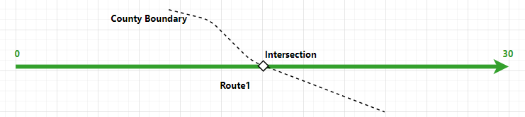
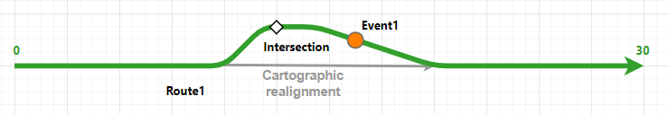
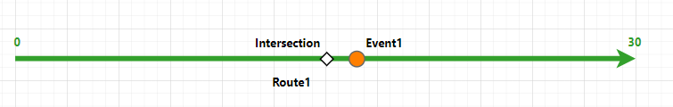
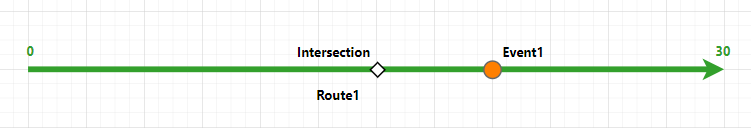
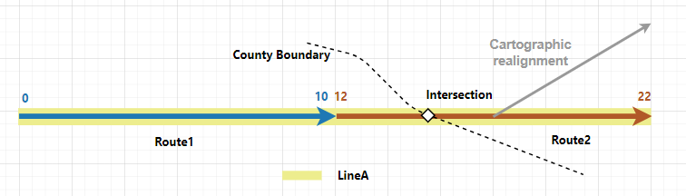
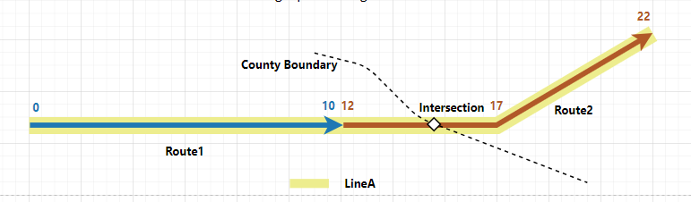
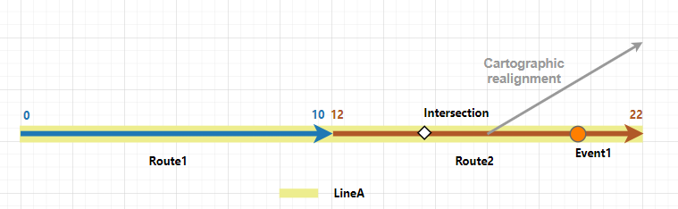
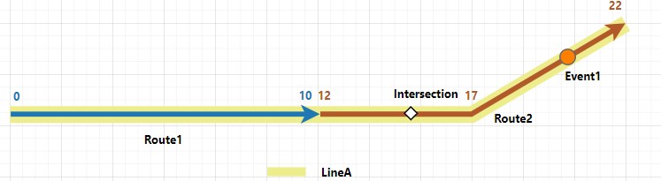
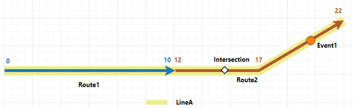

# Event Behavior for Cartographic Realignment

|   |   |
| --- | --- |
| **Kind** | Other · Pro |
| **Release** | — |
| **Source** | [cartorealignAPR_compare.docx](<https://esriis.sharepoint.com/sites/LocationReferencing/Shared%20Documents/General/Doc%20Reviews/5748_EB_topics/cartorealignAPR_compare.docx>) |
| **Edited** | 2024-04-14 01:50 by Claire Wang |
| **Extracted** | 2026-09-04 · lane `xmlstrip` |

<!-- metadata
```yaml
title: "Event Behavior for Cartographic Realignment"
source_file: "cartorealignAPR_compare.docx"
source_url: "https://esriis.sharepoint.com/sites/LocationReferencing/Shared%20Documents/General/Doc%20Reviews/5748_EB_topics/cartorealignAPR_compare.docx"
doc_id: 387
doc_kind: "Other"
surface: "Pro"
doc_revision: ""
target_release: ""
pe: ""
dev: ""
author: "Claire Wang"
last_edited_by: "Claire Wang"
last_edited: "2024-04-14T01:50:00Z"
extracted: 2026-09-04
extraction_lane: xmlstrip
prompt_version: "v2.0.2"
keywords: ["cartographic realignment", "event behavior", "route geometry", "point event", "line event", "referent location", "route measure"]
tools: ["Apply Event Behaviors"]
products: []
issues: []
related: [{"doc":383,"file":"event-behavior-for-cartographic-realignment__doc383.md","s":8.026},{"doc":386,"file":"event-behavior-for-cartographic-realignment__doc386.md","s":7.984},{"doc":407,"file":"event-behavior-for-cartographic-realignment__doc407.md","s":7.462},{"doc":382,"file":"event-behavior-for-cartographic-realignment__doc382.md","s":7.352},{"doc":406,"file":"event-behavior-for-cartographic-realignment__doc406.md","s":6.641}]
```
-->

## Summary

This document explains the effects of cartographic realignment on route geometry and associated events in a linear referencing system. It details how event behaviors such as Honor Route Measure and Honor Referent Location affect event measures and locations when routes are realigned. Examples illustrate the impact on point and line events before and after realignment in both single and line network scenarios.

## Related documents

<!-- related:begin -->
- [Event behavior for cartographic realignment](<https://esriis.sharepoint.com/sites/lrsworkspace/LRS Doc Index/Other/event-behavior-for-cartographic-realignment__doc383.md>) — similar text 0.75 · 4 title words · 2 filename words · same kind/surface/folder <!-- rel:383 -->
- [Event behavior for cartographic realignment](<https://esriis.sharepoint.com/sites/lrsworkspace/LRS Doc Index/Other/event-behavior-for-cartographic-realignment__doc386.md>) — similar text 0.81 · 4 title words · 2 filename words · same kind/surface/folder <!-- rel:386 -->
- [Event behavior for cartographic realignment](<https://esriis.sharepoint.com/sites/lrsworkspace/LRS Doc Index/Other/event-behavior-for-cartographic-realignment__doc407.md>) — similar text 0.77 · 4 title words · 2 filename words · same kind/surface <!-- rel:407 -->
- [Event behavior for cartographic realignment](<https://esriis.sharepoint.com/sites/lrsworkspace/LRS Doc Index/Other/event-behavior-for-cartographic-realignment__doc382.md>) — similar text 0.74 · 4 title words · 1 filename word · same kind/surface/folder <!-- rel:382 -->
- [Event behavior for cartographic realignment](<https://esriis.sharepoint.com/sites/lrsworkspace/LRS Doc Index/Other/event-behavior-for-cartographic-realignment__doc406.md>) — similar text 0.70 · 4 title words · 1 filename word · same kind/surface <!-- rel:406 -->
<!-- related:end -->

<!-- docs:begin -->
## Esri documentation

[Apply cartographic realignment](https://doc.esri.com/en/arcgis-pro/latest/help/production/location-referencing-pipelines/apply-cartographic-realignment.html) · [Event behavior](https://doc.esri.com/en/arcgis-pro/latest/help/production/location-referencing-pipelines/what-is-event-behavior.html) · [Storing referent and offset information for event location](https://doc.esri.com/en/arcgis-pro/latest/help/production/location-referencing-pipelines/storing-referent-and-offset-information-for-event-location.html)

_No page matched:_ [Apply Event Behaviors](https://www.google.com/search?q=%22Apply%20Event%20Behaviors%22+site%3Adoc.esri.com)
<!-- docs:end -->

---

## Event behavior for cartographic realignment
Cartographic realignment is the method of updating the route geometry based on aerial imagery, as-built drawings, or input from field data collectors. To do this, you can directly modify the centerline that is associated with the route.
Learn more about applying cartographic realignment
Note:
Events are not updated until the Apply Event Behaviors tool is run after route edits. If you are using conflict prevention on branch versioned data, you are prompted to run Apply Event Behaviors before posting to the default version.

### Cartographic realignment scenario
When cartographic realignment occurs, events are impacted depending on the configured event behavior for the event layer. The following are the results of running the Apply Event Behaviors tool on event features:

| Behavior | Description |
| --- | --- |
| Honor Route Measure | Preserves the measure of the event and changes shape according to the route. |
| Honor Referent Location | Changes both measure and geographic location to maintain the referent location of the event using a persistent offset value. |

Note:
When Update route measures in cartographic realignment is enabled in a network in which cartographic realignment is performed, the route's measures can change after cartographic realignment. Subsequently, the configured cartographic realignment event behavior and calibrate event behavior are both applied to events in impacted sections on the route.
You can review the configured event behaviors per edit type by viewing LRS event properties.
For all examples in this topic, Update route measures in cartographic realignment is disabled.

### Route cartographic realignment results
In this example, Route1 is active from 1/1/2000. The cartographic realignment is set to occur on 1/1/2005 from the middle to the end of Route1.where an incorrect curve is fixed. Route1's measures do not change because the Update route measures in cartographic realignment is disabled for the network. The graphics and tables in the following sections demonstrate the route information before and after the cartographic realignment.

#### Before route cartographic realignment
The following image shows the route before cartographic realignment:. There is an intersection on Route1 where Route1 intersects the County boundary. The intersection is the referent location in the Honor Referent Location event behavior scenario below.
The following image shows the route before cartographic realignment. The network for the route is configured with the Euclidean Distance calibration rule.

The following table provides details about the eventroute and intersection before cartographic realignment:

| Route Name | From Date | To Date | From Measure | To Measure |
| --- | --- | --- | --- | --- |
| Route1 | 1/1/2000 | <Null> | 0 | 20 30 |

| Intersection ID | From Date | To Date | Route Name | Measure |
| --- | --- | --- | --- | --- |
| Intersection | 1/1/2000 | <Null> | Route1 | 12 |

#### After route cartographic realignment
The following image shows the route and intersection after cartographic realignment:

The following table provides details about the route and intersection after cartographic realignment:

| Route Name | From Date | To Date | From Measure | To Measure |
| --- | --- | --- | --- | --- |
| Route1 | 1/1/2000 | <Null> | 0 | 20 30 |

| Intersection ID | From Date | To Date | Route Name | Measure |
| --- | --- | --- | --- | --- |
| Intersection | 1/1/2000 | <Null> | Route1 | 15 |

Note:
When the centerlines are edited, all routes in all networks, across all times, are modified accordingly. Hence, Route1 does not get a new time slice, but its shape is changed in the existing time slice.

#### Events before route cartographic realignment
There is a point event and a line event on Route1 and both haveit has a starting date (From Date) of 1/1/2000. The following image shows the route and eventsevent before cartographic realignment:

The following tables provide details about the eventsevent before cartographic realignment:
Point event:

| Event | Route Name | From Date | To Date | Measure |
| --- | --- | --- | --- | --- |
| Point1 Event1 | Route1 | 1/1/2000 | <Null> | 14 17 |

Line event:

| Event | Route Name | From Date | To Date | From Measure | To Measure |
| --- | --- | --- | --- | --- | --- |
| Event1 | Route1 | 1/1/2000 | <Null> | 5 | 18 |

The following sections detail how event behavior rules are enforced after running the Apply Event Behaviors tool with this route cartographic realignment scenario.
Note:
In all the scenarios below, Point1 is always configured with Honor Route Measure behavior, and Event1 is configured with different event behaviors.
For a line event, its start and end points follow the same cartographic realignment event behavior as a point event.

#### Honor Route Measure behavior
The Honor Route Measure event behavior preserves the measures of the event and updates the event's location if the route's measures have not changed because the Update route measures in cartographic realignment parameter is disabled for the network.
Note:
If the Update route measures in cartographic realignment parameter is enabled for the network and the route's measures are updated due to cartographic realignment, the resulting event behavior will be a combined behavior of cartographic realignment behavior and calibrate behavior. Events in the cartographic realignment area will move proportionally.
The route cartographic realignment edit activity with the Honor Route Measure event behavior (for both events) has the following effects:

- Point1Event1 is completely within cartographic realignment. Because the route's measures have not changed, the cartographic realignment Honor Route Measure event behavior is the only effective event behavior. Point1's geographic location is updated but its measure value remains the same, which is measure 14 on Route1.
- Event1 is partially within cartographic realignment. Because the route's measures have not changed, the cartographic realignment Honor Route Measure event behavior is the only effective event behavior. Event1's geographic location is updated to match the path of Route1, but its measure values remain value remains the same. Event1's start, which is measure value (From Measure) remains 5 and the end measure value (To Measure) remains 18,17 on Route1.
The following image shows the route and eventsevent after cartographic realignment:

Note:
Because cartographic realignment does not change a route's time slice, the time slices of the eventsevent on the route are not changed either.
The following tables provide details about the event after cartographic realignment:

| Event | Route Name | From Date | To Date |  | Measure |  |
| --- | --- | --- | --- | --- | --- | --- |
| Event1 | Route1 | 1/1/2000 | <Null> | 17 |  |  |

#### Honor Referent Location behavior
The Honor Referent Location event behavior preserves the referent offset of the event and updates the event's geographic location and measures.
Events can have https://prodev.arcgis.com/en/pro-app/3.3/help/production/roads-highways/events-data-model.htm  \hevent referent fields to derive its location using referent location information. The following referent locations can be stored:

- Offset distance from any point feature in the geodatabase
- Offset distance from an intersection point feature
- Offset distance from a point event feature
- Offset distance from an x,y coordinate
- Offset distance from a station
- The following table shows referent fields in Event1:

| Event | Route Name | Ref Location | Ref Offset |
| --- | --- | --- | --- |
| Event1 | Route1 | Intersection | 5 |

The route cartographic realignment edit activity with the Honor Referent Location event behavior has the following effects:

- Event1 was located 5 miles downstream of the intersection on Route1, resulting in a measure of 17. After the cartographic realignment is applied, the intersection's measure is updated to 15 on Route1. When the cartographic realignment Honor Referent Location behavior is applied to Event1, it still locates 5 miles downstream of the intersection. The measure of Event1 is updated to 20 on Route1.
The following image shows the route and event after cartographic realignment:

Note:
Because cartographic realignment does not change a route's time slice, the time slices of the event on the route are not changed either.
The following tables provide details about the event after cartographic realignment:

| Event | Route Name | From Date | To Date | Measure |
| --- | --- | --- | --- | --- |
| Point1 Event1 | Route1 | 1/1/2000 | <Null> | 14 20 |

Line event:

| Event | Route Name | From Date | To Date | From Measure | To Measure |
| --- | --- | --- | --- | --- | --- |
| Event1 | Route1 | 1/1/2000 | <Null> | 5 | 18 |

#### Honor Referent Location behavior
For the Honor Referent Location behavior, the geographic location and measures of the event can change to maintain the referent offset if the route's measures have not changed because the Update route measures in cartographic realignment parameter is disabled for the network.
Note:
If the Update route measures in cartographic realignment parameter is enabled for the network and the route's measures are updated due to cartographic realignment, the resulting event behavior will be a combined behavior of the cartographic realignment behavior and the calibrate behavior. Events in the cartographic realignment area will move proportionally.
Events can have https://prodev.arcgis.com/en/pro-app/3.3/help/production/location-referencing-pipelines/events-data-model.htm  \hevent referent fields to derive its location using referent location information. The following referent locations can be stored:

- Offset distance from any point feature in the geodatabase
- Offset distance from an intersection point feature
- Offset distance from a point event feature
- Offset distance from an x,y coordinate
- Offset distance from a station
The following table shows the edit activities involved in the route edit and their corresponding event behaviors:

| Edit activity | Event behavior |
| --- | --- |
| Cartographic realignment | Honor Route Measure (Point1) |
|  | Honor Route Measure (Event1) |

The following table shows referent fields in Event1:

| Event | Route Name | From Ref Location | From Ref Offset | To Ref Location | To Ref Offset |
| --- | --- | --- | --- | --- | --- |
| Event1 | Route1 | Point1 | -9 | Point1 | 4 |

The route cartographic realignment described above has the following effects:

- Point1 is completely within cartographic realignment. Because the route's measures have not changed, the cartographic realignment Honor Route Measure event behavior is the only effective event behavior. Point1's geographic location is updated but its measure value remains the same, which is measure 14 on Route1.
- Event1 is partially within cartographic realignment. Because the route's measures have not changed, the cartographic realignment Honor Referent Location event behavior is the only effective event behavior. Event1's geographic location is updated to match the path of Route1, but its measure values remain the same. Event1's start measure remains 5 and the end measure remains 18, on Route1.
The following image shows the route and events after cartographic realignment:

The following tables provide details about the events after cartographic realignment:
Point event:

| Event | Route Name | From Date |  | To Date | Measure |
| --- | --- | --- | --- | --- | --- |
| Point1 | Route1 | 1/1/2000 | <Null> | 14 |  |

Line event:

| Event | Route Name | From Date | To Date | From Measure | To Measure |
| --- | --- | --- | --- | --- | --- |
| Event1 | Route1 | 1/1/2000 | <Null> | 5 | 18 |

### Cartographic realignment on routes in a line network with events that span routes
Routes in a line network can also be cartographically realigned by modifying the associated centerline.
In the following example, there are two routes on LineA and the routes are active from 1/1/2000. The cartographic realignment is set to occur on 1/1/2005 from the middle to the end of Route2. Route2's measures remain unchanged because Update route measures in cartographic realignment is disabled for the network. The graphics and tables in the following sections demonstrate the route information before and after the cartographic realignment.

#### Before route cartographic realignment
The following image shows the routes before cartographic realignment:. There is an intersection on Route2 where Route2 intersects the County boundary. The intersection is the referent location in the Honor Referent Location event behavior scenario below.

The following table provides details about the routesroute and intersection before cartographic realignment:

| Route Name | Line Name | Line Order | From Date | To Date | From Measure | To Measure |
| --- | --- | --- | --- | --- | --- | --- |
| Route1 | LineA | 100 | 1/1/2000 | <Null> | 0 | 10 |
| Route2 | LineA | 200 | 1/1/2000 | <Null> | 12 | 22 |

#### After route cartographic realignment
The following image shows the routes after cartographic realignment:

The following table provides details about the routes after cartographic realignment:

| Route Name | Line Name | Line Order | From Date | To Date | From Measure | To Measure |
| --- | --- | --- | --- | --- | --- | --- |
| Route1 | LineA | 100 | 1/1/2000 | <Null> | 0 | 10 |
| Route2 | LineA | 200 | 1/1/2000 | <Null> | 12 | 22 |

| Intersection ID | From Date | To Date | Route ID | Measure |
| --- | --- | --- | --- | --- |
| Intersection | 1/1/2000 | <Null> | Route2 | 15 |

#### After route cartographic realignment
The following image shows the route and intersection after cartographic realignment:

The following table provides details about the routes and intersection after cartographic realignment:

| Route Name | Line Name | Line Order | From Date | To Date | From Measure | To Measure |
| --- | --- | --- | --- | --- | --- | --- |
| Route1 | LineA | 100 | 1/1/2000 | <Null> | 0 | 10 |
| Route2 | LineA | 200 | 1/1/2000 | <Null> | 12 | 22 |

| Intersection ID | From Date | To Date | Route ID | Measure |
| --- | --- | --- | --- | --- |
| Intersection | 1/1/2000 | <Null> | Route2 | 15 |

Note:
When the centerlines are edited, all routes in all networks, across all times, are modified accordingly. Hence, Route2 does not get a new time slice, but its shape is changed in the existing time slice.

#### Events before route cartographic realignment
There is a point event on Route2 and a line event on LineA and both of them haveit has a start date of 1/1/2000. The following image shows the routes and eventsevent before cartographic realignment:

The following tables provide details about the eventsevent before cartographic realignment:
Point event:

| Event | Route Name | From Date | To Date | Measure |
| --- | --- | --- | --- | --- |
| Point1 Event1 | Route2 | 1/1/2000 | <Null> | 16 20 |

Line event:

| Event | From Date | To Date | From Route Name | To Route Name | From Measure | To Measure |
| --- | --- | --- | --- | --- | --- | --- |
| Event1 | 1/1/2000 | <Null> | Route1 | Route2 | 0 | 20 |

The following sections detail how event behavior rules are enforced after running the Apply Event Behaviors tool under this route cartographic realignment scenario.
Note:
For a line event, its start and end points follow the same cartographic realignment event behavior as a point event.

#### Honor Route Measure behavior
The Honor Route Measure event behavior preserves the measures of the event and updates the event's location if the route's measures have not changed because the Update route measures in cartographic realignment parameter is disabled for the network.
Note:
If the Update route measures in cartographic realignment parameter is enabled for the network and the route's measures are updated due to cartographic realignment, the resulting event behavior will be a combined behavior of the cartographic realignment behavior and the calibrate behavior. Events in the cartographic realignment area will move proportionally.
The route cartographic realignment edit activity with the Honor Route Measure event behavior has the following effects:

- Point1 is not within the cartographic realignment area, so its geographic location and measure do not change.
- Event1 is partially within cartographic realignment. Because the route's measures have not changed, the cartographic realignment Honor Route Measure event behavior is the only effective event behavior. Event1's geographic location is updated to match the new path of Route2, but its measure values remainvalue remains the same. Event1's start measure value is still 0 on Route1 and its end measure value is still , which is measure 20 on Route2.
The following image shows the routes and eventsevent after cartographic realignment:

Note:

Note:
Because cartographic realignment does not change a route's time slice, the time slices of the eventsevent on the route are not changed either.
The following tables provide details about the eventsevent after cartographic realignment:
Point event:

| Event | Route Name | From Date | To Date | Measure |
| --- | --- | --- | --- | --- |
| Point1 Event1 | Route1 Route | 1/1/2000 | <Null> | 16 20 |

Line event:

| Event | From Date | To Date | From Route Name | To Route Name | From Measure | To Measure |
| --- | --- | --- | --- | --- | --- | --- |
| Event1 | 1/1/2000 | <Null> | Route1 | Route2 | 0 | 20 |

#### Honor Referent Location behavior
For theThe Honor Referent Location event behavior, the preserves the referent offset of the event and updates the event's geographic location and measures of the event can change to maintain the referent offset if the route's measures have not changed because the Update route measures in cartographic realignment parameter is disabled for the network.
Note:
If the Update route measures in cartographic realignment parameter is enabled for the network and the route's measures are updated due to cartographic realignment, the resulting event behavior will be a combined behavior of the cartographic realignment behavior and the calibrate behavior. Events in the cartographic realignment area will move proportionally.
Events can have event referent fields to derive its location using referent location information. The following referent locations can be stored:

- Offset distance from any point feature in the geodatabase
- Offset distance from an intersection point feature
- Offset distance from a point event feature
- Offset distance from an x,y coordinate
- Offset distance from a station

The following table shows referent fields in Event1:

| Event | Route ID | Ref Location | Ref Offset |
| --- | --- | --- | --- |
| Event1 | Route2 | Intersection | 5 |

- The following table shows referent fields in Event1:

| Event | Route Name | From Ref Location | From Ref Offset | To Ref Location | To Ref Offset |
| --- | --- | --- | --- | --- | --- |
| Event1 | Route1 | Point1 | -14 | Point1 | 4 |

The route cartographic realignment edit activity with the Honor Referent Location event behavior has the following effects:

- Point1 is not withinEvent1 was located 5 miles downstream of the intersection on Route2, resulting in a measure of 20. After the cartographic realignment area, so its geographic location and measure do not change.
- Event1 is partially within cartographic realignment. Because the route's measures have not changed, the cartographic realignment Honor Referent Location event behavior is the only effective event behavior. Event1's start measure value isis applied, it still calculated to be 14 units to the left of Point1, locating measure 0 on Route1. Event1's end measure value is still calculated to be 4 units to the right of Point1, locating locates 5 miles downstream of the intersection which is measure 20 on Route2. The shape and geographic location of Event1 areis updated to match the new path ofstay on Route2.
The following image shows the routes and eventsevent after cartographic realignment:

The following tables provide details about the eventsevent after cartographic realignment:
Point event:

| Event | Route Name | From Date | To Date | Measure |
| --- | --- | --- | --- | --- |
| Point1 Event1 | Route1 Route2 | 1/1/2000 | <Null> | 16 20 |

Line event:

| Event | From Date | To Date | From Route Name | To Route Name | From Measure | To Measure |
| --- | --- | --- | --- | --- | --- | --- |
| Event1 | 1/1/2000 | <Null> | Route1 | Route2 | 0 | 20 |

         
