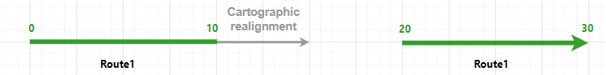
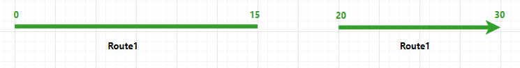
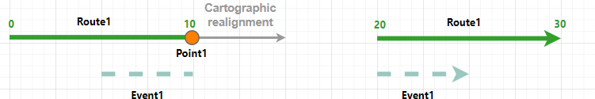
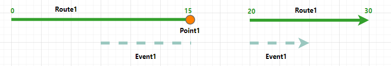
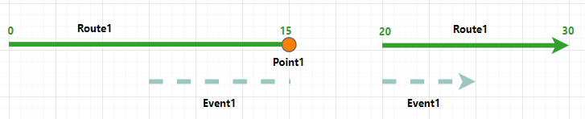
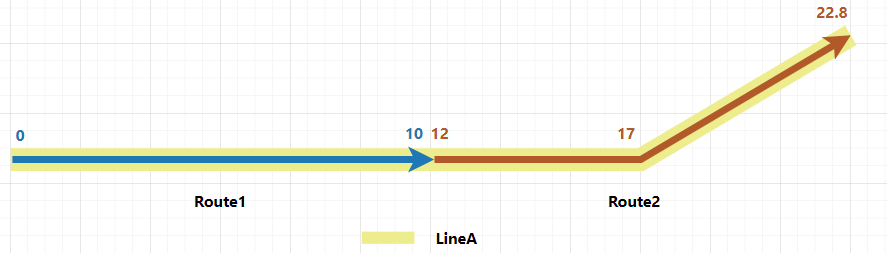
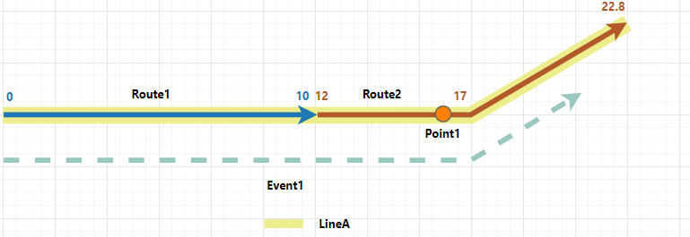
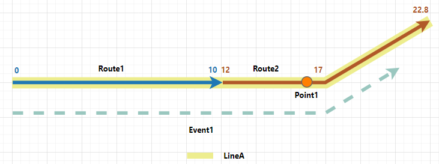

# Event behavior for cartographic realignment

|   |   |
| --- | --- |
| **Kind** | Other · Pro |
| **Release** | — |
| **Product** | Roads & Highways |
| **Source** | [cartorealign_RH.docx](<https://esriis.sharepoint.com/sites/LocationReferencing/Shared%20Documents/General/Doc%20Reviews/5667_CartoRealign/cartorealign_RH.docx>) |
| **Edited** | 2024-03-13 16:29 by Ignacia Galvan |
| **Extracted** | 2026-09-04 · lane `xmlstrip` |

<!-- metadata
```yaml
title: "Event behavior for cartographic realignment"
source_file: "cartorealign_RH.docx"
source_url: "https://esriis.sharepoint.com/sites/LocationReferencing/Shared%20Documents/General/Doc%20Reviews/5667_CartoRealign/cartorealign_RH.docx"
doc_id: 406
doc_kind: "Other"
surface: "Pro"
doc_revision: ""
target_release: ""
pe: ""
dev: ""
author: ""
last_edited_by: "Ignacia Galvan"
last_edited: "2024-03-13T16:29:10Z"
extracted: 2026-09-04
extraction_lane: xmlstrip
prompt_version: "v2.0.2"
keywords: ["cartographic realignment", "event behavior", "route geometry", "route measures", "point event", "line event", "referent location", "gapped route"]
tools: ["Apply Event Behaviors"]
products: ["Roads & Highways"]
issues: []
related: [{"doc":407,"file":"event-behavior-for-cartographic-realignment__doc407.md","s":7.506},{"doc":386,"file":"event-behavior-for-cartographic-realignment__doc386.md","s":7.216},{"doc":387,"file":"event-behavior-for-cartographic-realignment__doc387.md","s":6.641},{"doc":382,"file":"event-behavior-for-cartographic-realignment__doc382.md","s":6.398},{"doc":383,"file":"event-behavior-for-cartographic-realignment__doc383.md","s":6.236}]
```
-->

## Summary

This document explains the effects of cartographic realignment on route geometry and associated events in a linear referencing system. It details how event behaviors such as Honor Route Measure and Honor Referent Location are applied during and after cartographic realignment, including scenarios with gapped routes and line networks with events spanning multiple routes. The document includes examples with route and event data before and after realignment, illustrating measure adjustments and event behavior enforcement.

## Related documents

<!-- related:begin -->
- [Event behavior for cartographic realignment](<https://esriis.sharepoint.com/sites/lrsworkspace/LRS Doc Index/Other/event-behavior-for-cartographic-realignment__doc407.md>) — similar text 0.82 · 4 title words · 1 filename word · same kind/surface/folder <!-- rel:407 -->
- [Event behavior for cartographic realignment](<https://esriis.sharepoint.com/sites/lrsworkspace/LRS Doc Index/Other/event-behavior-for-cartographic-realignment__doc386.md>) — similar text 0.76 · 4 title words · 1 filename word · same kind/surface <!-- rel:386 -->
- [Event Behavior for Cartographic Realignment](<https://esriis.sharepoint.com/sites/lrsworkspace/LRS Doc Index/Other/event-behavior-for-cartographic-realignment__doc387.md>) — similar text 0.70 · 4 title words · 1 filename word · same kind/surface <!-- rel:387 -->
- [Event behavior for cartographic realignment](<https://esriis.sharepoint.com/sites/lrsworkspace/LRS Doc Index/Other/event-behavior-for-cartographic-realignment__doc382.md>) — similar text 0.72 · 4 title words · 1 filename word · same kind/surface <!-- rel:382 -->
- [Event behavior for cartographic realignment](<https://esriis.sharepoint.com/sites/lrsworkspace/LRS Doc Index/Other/event-behavior-for-cartographic-realignment__doc383.md>) — similar text 0.67 · 4 title words · 1 filename word · same kind/surface <!-- rel:383 -->
<!-- related:end -->

<!-- docs:begin -->
## Esri documentation

[Apply cartographic realignment](https://doc.esri.com/en/arcgis-pro/latest/help/production/roads-highways/apply-cartographic-realignment.html) · [Event behavior](https://doc.esri.com/en/arcgis-pro/latest/help/production/roads-highways/what-is-event-behavior.html) · [Storing referent and offset information for event location](https://doc.esri.com/en/arcgis-pro/latest/help/production/roads-highways/storing-referent-and-offset-information-for-event-location.html)

_No page matched:_ [Apply Event Behaviors](https://www.google.com/search?q=%22Apply%20Event%20Behaviors%22+site%3Adoc.esri.com)
<!-- docs:end -->

---

## Event behavior for cartographic realignment
Cartographic realignment is the method of updating the route geometry based on aerial imagery, as-built drawings, or input from field data collectors. To do this, you can directly modify the centerline that is associated with the route.
Learn more about applying cartographic realignment
Note:
Events are not updated until the Apply Event Behaviors tool is run after route edits. If you are using conflict prevention on branch versioned data, you are prompted to run Apply Event Behaviors before posting to the default version.

### Cartographic realignment scenario
When cartographic realignment occurs, events are impacted, depending on the configured event behavior for each event layer. The following are the results of executing the Apply Event Behaviors tool on event features.

| Behavior | Description |
| --- | --- |
| Honor Route Measure | Preserves the measure of the event and changes shape according to the route. |
| Honor Referent Location | Changes both measure and geographic location to maintain the referent location of the event using a persistent offset value. |

 Note:
When Update route measures in cartographic realignment is enabled in a network in which cartographic realignment is performed, the route's measures can change after cartographic realignment. Subsequently, the configured cartographic realignment event behavior and calibrate event behavior (I linked to prodev. Feel free to change if needed) are both applied to events in impacted sections on the route.
You can review the configured event behaviors per edit type by viewing LRS event properties.
For all examples in this topic, Update route measures in cartographic realignment is enabled. (I linked to prodev. Feel free to change if needed)

#### Route cartographic realignment results
In this example, the route Route1 is a gapped route and it is active from 1/1/2000. The cartographic realignment is set to occur on 1/1/2005 where the part of Route1 before the gap is lengthened by cartographic realignment. Route1's measures adjust to its new geometry as Update route measures in cartographic realignment is enabled for the network. The graphics and tables below in the following sections demonstrate the route information before and after the cartographic realignment.
(For all graphics in this doc, please use updated svgs from the draw.io I provided. Do not reuse any previous svgs. Please also use the title of each graphic for hover text.)

#### Before route cartographic realignment
The following image shows the route before cartographic realignment. The network for the route is configured with the Euclidean Distance calibration rule.

The following table provides details about the route before cartographic realignment:

| Route ID | From Date | To Date | From Measure | To Measure |
| --- | --- | --- | --- | --- |
| Route1 | 1/1/2000 | <Null> | 0 | 3 0 |

#### After route cartographic realignment
The following image shows the route after cartographic realignment:

The following table provides details about the route after cartographic realignment:

| Route ID | From Date | To Date | From Measure | To Measure |  |
| --- | --- | --- | --- | --- | --- |
| Route1 | 1/1/2000 | <Null> | 0 | 30 |  |

 Note:
When the centerlines are edited, all routes in all networks, across all times, are modified accordingly. Hence, Route1 does not get a new time slice, but its shape and measures are changed in the existing time slice.
Refer to Route Calibration Rules for more details. (I linked to prodev.)

#### Events before route cartographic realignment
There is a point event and a line event on Route1 and both of them have a starting date (From Date) of 1/1/2000. The following image shows the route and events before cartographic realignment:

The following tables provide details about the events before cartographic realignment:
Point eEvent:

| Event | Route ID | From Date | To Date | Measure |
| --- | --- | --- | --- | --- |
| Point 1 | Route1 | 1/1/2000 | <Null> | 1 0 |

Line Eevent:

| Event | Route ID | From Date | To Date | From Measure | To Measure |
| --- | --- | --- | --- | --- | --- |
| Event1 | Route1 | 1/1/2000 | <Null> | 5 | 2 5 |

The following sections detail how event behavior rules are enforced after running the Apply Event Behaviors tool under with this route cartographic realignment scenario.
Note:
In all the scenarios below, Point1 is always configured with Honor Route Measure behavior, and Event1 is configured with different event behaviors.

#### Honor Route Measure behavior
If the Update route measures in cartographic realignment parameter is enabled for the network and the route measures are updated due to cartographic realignment, the resulting event behavior will be a combined behavior of cartographic realignment behavior and calibrate behavior. Events in the cartographic realignment area will move proportionally.
Note:
If the route measures have not changed because theas Update route measures in cartographic realignment parameter is disabled for the network, the Honor Route Measure event behavior preserves the measures of the event and updates the event's location.
The following table shows the edit activities involved in the route edit and their corresponding event behaviors:

| Edit Activity | Event Behavior |
| --- | --- |
| Cartographic Realignment | Honor Route Measure (both events) |
| Calibrate | Stay Put |

The route cartographic realignment described above has the following effects:

- Point1 was located on Route1 at the beginning of the gap. Since Because it is completely within cartographic realignment and the route's measures have changed, both the cartographic realignment Honor Route Measure and the calibrate Stay Put behaviors are applied. Point1 is still at the beginning of the gap and its measure is updated to 15 on Route1.
- Event1 is a multi-part event. The first part of Event1 starts from measure 5, which is the middle of the first part of Route1, and ends at measure 10 at the beginning of the gap. Since Because this part of Event1 is completely within cartographic realignment and the route's measures have changed, both the cartographic realignment Honor Route Measure and the calibrate Stay Put behaviors are applied. This part of Event1 is proportionally lengthened. It still starts from the middle of the first part of Route1 and ends at the beginning of the gap. The two corresponding measure values are changed to measure 7.5 and 15 on Route1. The start location remains measure 7.5 on Route1 and the end location is updated to 15 on Route1.
- The second part of Event1 covers half of the second part of Route1 after the gap, from measure 20 to 25 on Route1. This part of Route1 is not within the cartographic realignment and not calibrated, so no event behavior is applied. As a result, Event1's start (From) measure is updated to 7.5, and its end (To) measure remains 25 on Route1.
The following image shows the route and events after cartographic realignment:

 Note:
Since Because cartographic realignment does not change a route's time slice, the time slices of the events on the route are not changed either.
The following tables provide details about the events after cartographic realignment:
Point Event:

| Event | Route ID | From Date | To Date | Measure |
| --- | --- | --- | --- | --- |
| Point 1 | Route1 | 1/1/2000 | <Null> | 15 |

Line Event:

| Event | Route ID | From Date | To Date | From Measure | To Measure |
| --- | --- | --- | --- | --- | --- |
| Event1 | Route1 | 1/1/2000 | <Null> | 7.5 | 2 5 |

#### Honor Referent Location behavior
If the Update route measures in cartographic realignment parameter is enabled for the network and the route measures are updated due to cartographic realignment, the resulting event behavior will be a combined behavior of the cartographic realignment behavior and the calibrate behavior. Events in the cartographic realignment area will move proportionally.
Note:
If the route measures have not changed as because the Update route measures in cartographic realignment parameter is disabled for the network, the Honor Referent Location event behavior preserves the referent offset of the event and updates the event's geographic location and measures.
Events can have event referent fields (I linked to prodev. Feel free to change if needed) to derive its location using referent location information. The following referent locations can be stored:

- Offset distance from any point feature in the geodatabase
- Offset distance from an intersection point feature
- Offset distance from a point event feature
- Offset distance from an x,y coordinate
- Offset distance from a station
The following table shows the edit activities involved in the route edit and their corresponding event behaviors:

| Edit a A ctivity | Event b B ehavior |
| --- | --- |
| Cartographic Realignment | Honor Route Measure (Point1) |
|  | Honor Referent Location (Event1) |
| Calibrate | Stay Put |

The following table shows referent fields in Event1:

| Event | Route Name | From Ref Location | From Ref Offset | To Ref Location | To Ref Offset |
| --- | --- | --- | --- | --- | --- |
| Event1 | Route1 | Point1 | -5 | Point1 | 5 |

The route cartographic realignment described above has the following effects:

- Point1 was located on Route1 at the beginning of the gap. Since Because it is completely within cartographic realignment and the route's measures have changed, both the cartographic realignment Honor Route Measure and the calibrate Stay Put behaviors are applied. Point1 is still at the beginning of the gap and its measure is updated to 15 on Route1.
- Event1 is a multi-part event. The first part of Event1 starts from measure 5, which is the middle of the first part of Route1, and ends at measure 10 at the beginning of the gap. Since Because this part of Event1 is completely within cartographic realignment and the route's measures have changed, both the cartographic realignment Honor Referent Location and the calibrate Stay Put behaviors are applied. The offset of this part of Event1 is proportionally lengthened, so Event1 becomes 7.5 units to the left of Point1, which locates measure 7.5 on Route1. This part of Event1 still ends at the beginning of the gap, which is measure 15 on Route1.
- The second part of Event1 covers half of the second part of Route1 after the gap, from measure 20 to 25 on Route1. This part of Route1 is not within the cartographic realignment and not calibrated, so no event behavior is applied. As a result, Event1's start (From) measure value is updated to 7.5, and its end (To) measure value remains 25, on Route1.
The following image shows the route and events after cartographic realignment:

The following tables provide details about the events after cartographic realignment:
Point Event:

| Event | Route ID | From Date | To Date | Measure |
| --- | --- | --- | --- | --- |
| Point 1 | Route1 | 1/1/2000 | <Null> | 15 |

Line Event:

| Event | Route ID | From Date | To Date | From Measure | To Measure |
| --- | --- | --- | --- | --- | --- |
| Event1 | Route1 | 1/1/2000 | <Null> | 7.5 | 2 5 |

### Cartographic realignment on routes in a line network with events that span routes
Routes in a line network can also be cartographically realigned by modifying the associated centerline.
In the following example, there are two routes on LineA and the routes are active from 1/1/2000. The cartographic realignment is set to occur on 1/1/2005 from the middle to the end of Route2. Route2's measures adjust to its new geometry as Update route measures in cartographic realignment is enabled for the network. The graphics and tables below in the following sections demonstrate the route information before and after the cartographic realignment.

#### Before route cartographic realignment
The following image shows the routes before cartographic realignment:

 Note:
The length of cartographic realignment is 1.155 times longer than the part of the route being cartographically realigned.
The following table provides details about the routes before cartographic realignment:

| Route Name | Line Name | Line Order | From Date | To Date | From Measure | To Measure |
| --- | --- | --- | --- | --- | --- | --- |
| Route1 | LineA | 100 | 1/1/2000 | <Null> | 0 | 10 |
| Route2 | LineA | 200 | 1/1/2000 | <Null> | 12 | 22 |

#### After route cartographic realignment
The following image shows the routes after cartographic realignment:

The following table provides details about the routes after cartographic realignment:

| Route Name | Line Name | Line Order | From Date | To Date | From Measure | To Measure |
| --- | --- | --- | --- | --- | --- | --- |
| Route1 | LineA | 100 | 1/1/2000 | <Null> | 0 | 10 |
| Route2 | LineA | 200 | 1/1/2000 | <Null> | 12 | 22 .8 |

 Note:
When the centerlines are edited, all routes in all networks, across all times, are modified accordingly. Hence, Route2 does not get a new time slice, but its shape and measures are changed in the existing time slice.

#### Events before route cartographic realignment
There is a point event and a line event on LineA and both of them have a From start Ddate of 1/1/2000. The following image shows the routes and events before cartographic realignment:

The following tables provide details about the events before cartographic realignment:
Point Event:

| Event | Route ID | From Date | To Date | Measure |
| --- | --- | --- | --- | --- |
| Point 1 | Route 2 | 1/1/2000 | <Null> | 1 6 |

Line Event:

| Event ID | From Date | To Date | From Route Name | To Route Name | From Measure | To Measure |
| --- | --- | --- | --- | --- | --- | --- |
| Event1 | 1/1/2000 | <Null> | Route1 | Route 2 | 0 | 20 |

The following sections detail how event behavior rules are enforced after running the Apply Event Behaviors tool under this route cartographic realignment scenario.

#### Honor Route Measure behavior
If the Update route measures in cartographic realignment parameter is enabled for the network and the route measures are updated due to cartographic realignment, the resulting event behavior will be a combined behavior of the cartographic realignment behavior and the calibrate behavior. Events in the cartographic realignment area will move proportionally.
Note:
If the route measures have not changed as because the Update route measures in cartographic realignment parameter is disabled for the network, the Honor Route Measure event behavior preserves the measures of the event and updates the event's location.
The following table shows the edit activities involved in the route edit and their corresponding event behaviors:

| Edit A a ctivity | Event b B ehavior |
| --- | --- |
| Cartographic r R ealignment | Honor Route Measure |
| Calibrate | Stay Put |

The route cartographic realignment described above has the following effects:

- Point1 is not within the cartographic realignment area, so its geographic location and measure do not change.
- Event1 is partially with in the cartographic realignment area, so only the part of it that is in the cartographic realignment has changed geographic location and measure. Since Because the route's measures are also updated, both the cartographic realignment Honor Route Measure and the calibrate Stay Put behaviors are applied. The part of Event1 after measure 17 of Route2 is proportionally lengthened and reshaped to match the path of Route2. As a result, Event1's start measure value remains 0 on Route1 and its end measure value is updated to 20.5 on Route2.
The following image shows the routes and events after cartographic realignment:

 Note:
Since Because cartographic realignment does not change a route's time slice, the time slices of the events on the route are not changed either.
The following tables provide details about the events after cartographic realignment:
Point Event:

| Event | Route ID | From Date | To Date | Measure |
| --- | --- | --- | --- | --- |
| Point 1 | Route1 | 1/1/2000 | <Null> | 1 6 |

Line Event:

| Event ID | From Date | To Date | From Route Name | To Route Name | From Measure | To Measure |
| --- | --- | --- | --- | --- | --- | --- |
| Event1 | 1/1/2000 | <Null> | Route1 | Route2 | 0 | 20.5 |

#### Honor Referent Location behavior
If the Update route measures in cartographic realignment parameter is enabled for the network and the route measures are updated due to cartographic realignment, the resulting event behavior will be a combined behavior of the cartographic realignment behavior and the calibrate behavior. Events in the cartographic realignment area will move proportionally.
Note:
If the route measures have not changed as because the Update route measures in cartographic realignment parameter is disabled for the network, the Honor Referent Location event behavior preserves the referent offset of the event and updates the event's geographic location and measures.
Events can have event referent fields (I linked to prodev. Feel free to change if needed) to derive its location using referent location information. The following referent locations can be stored:

- Offset distance from any point feature in the geodatabase
- Offset distance from an intersection point feature
- Offset distance from a point event feature
- Offset distance from an x,y coordinate
- Offset distance from a station
The following table shows the edit activities involved in the route edit and their corresponding event behaviors:

| Edit Activity | Event Behavior |
| --- | --- |
| Cartographic Realignment | Honor R eferent Location oute Measure |
| Calibrate | Stay Put |

The following table shows referent fields in Event1:

| Event | Route Name | From Ref Location | From Ref Offset | To Ref Location | To Ref Offset |
| --- | --- | --- | --- | --- | --- |
| Event1 | Route1 | Point1 | - 14 | Point1 | 4 |

The route cartographic realignment described above has the following effects:

- Point1 is not within the cartographic realignment area, so its geographic location and measure do not change.
- Event1 is partially with in the cartographic realignment area, so only the part of it that is in the cartographic realignment has changed geographic location and measure. Since Becausethe route's measures are also updated, both the cartographic realignment Honor Referent Location and the calibrate Stay Put behaviors are applied. The offset of the part of Event1 after measure 17 on Route2 is proportionally lengthened. As a result, Event1's start measure value remains 14 units to the left of Point1, which is 0 on Route1, and its end measure value is updated to 20.5 on Route2. It is also reshaped to match the path of Route2.
The following image shows the routes and events after cartographic realignment:

The following tables provide details about the events after cartographic realignment:
Point Event:

| Event | Route ID | From Date | To Date | Measure |
| --- | --- | --- | --- | --- |
| Point 1 | Route1 | 1/1/2000 | <Null> | 16 |

Line Event:

| Event ID | From Date | To Date | From Route Name | To Route Name | From Measure | To Measure |
| --- | --- | --- | --- | --- | --- | --- |
| Event1 | 1/1/2000 | <Null> | Route1 | Route2 | 0 | 20.5 |

         
