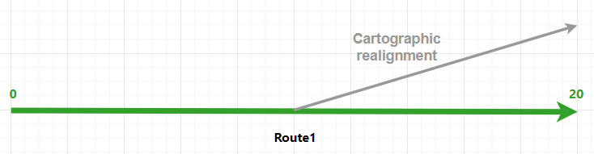
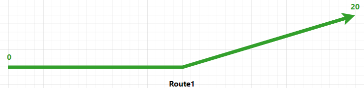
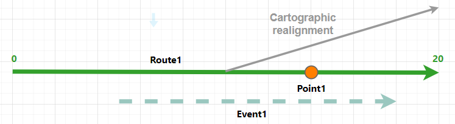
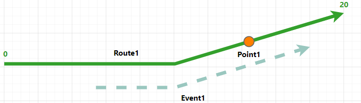
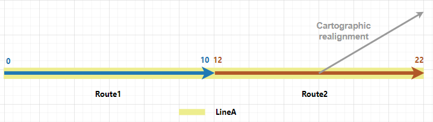
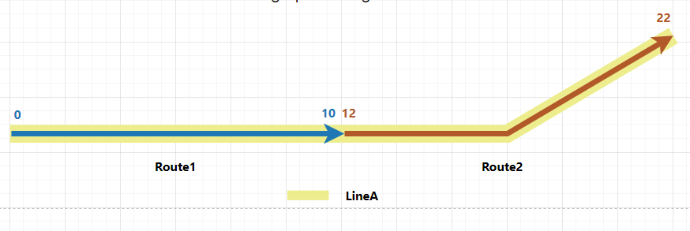
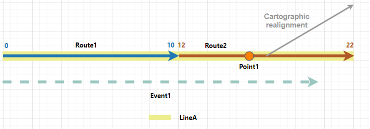
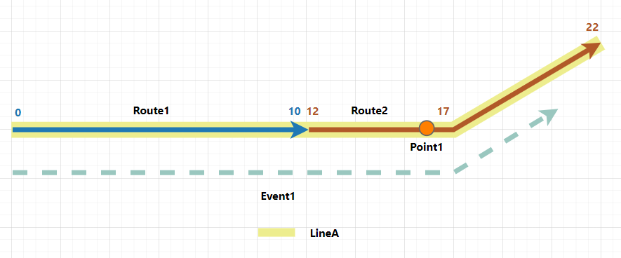

# Event behavior for cartographic realignment

|   |   |
| --- | --- |
| **Kind** | Other · Pro |
| **Release** | — |
| **Product** | Pipeline Referencing |
| **Source** | [cartorealign_APR.docx](<https://esriis.sharepoint.com/sites/LocationReferencing/Shared%20Documents/General/Doc%20Reviews/5667_CartoRealign/cartorealign_APR.docx>) |
| **Edited** | 2024-03-13 01:31 by unknown |
| **Extracted** | 2026-09-04 · lane `xmlstrip` |

<!-- metadata
```yaml
title: "Event behavior for cartographic realignment"
source_file: "cartorealign_APR.docx"
source_url: "https://esriis.sharepoint.com/sites/LocationReferencing/Shared%20Documents/General/Doc%20Reviews/5667_CartoRealign/cartorealign_APR.docx"
doc_id: 407
doc_kind: "Other"
surface: "Pro"
doc_revision: ""
target_release: ""
pe: ""
dev: ""
author: ""
last_edited_by: ""
last_edited: "2024-03-13T01:31:13.6107740Z"
extracted: 2026-09-04
extraction_lane: xmlstrip
prompt_version: "v2.0.2"
keywords: ["cartographic realignment", "event behavior", "route geometry", "point event", "line event", "referent location", "route measures"]
tools: ["Apply Event Behaviors"]
products: ["Pipeline Referencing"]
issues: []
related: [{"doc":386,"file":"event-behavior-for-cartographic-realignment__doc386.md","s":8.586},{"doc":406,"file":"event-behavior-for-cartographic-realignment__doc406.md","s":7.506},{"doc":387,"file":"event-behavior-for-cartographic-realignment__doc387.md","s":7.462},{"doc":383,"file":"event-behavior-for-cartographic-realignment__doc383.md","s":6.991},{"doc":382,"file":"event-behavior-for-cartographic-realignment__doc382.md","s":6.394}]
```
-->

## Summary

This document explains the effects of cartographic realignment on route geometry and associated events in a linear referencing system. It details how event behaviors such as Honor Route Measure and Honor Referent Location affect event measures and locations when routes are realigned without updating route measures. Examples illustrate the impact on point and line events before and after realignment in single and line network scenarios.

## Related documents

<!-- related:begin -->
- [Event behavior for cartographic realignment](<https://esriis.sharepoint.com/sites/lrsworkspace/LRS Doc Index/Other/event-behavior-for-cartographic-realignment__doc386.md>) — similar text 0.68 · 4 title words · 1 filename word · same kind/surface <!-- rel:386 -->
- [Event behavior for cartographic realignment](<https://esriis.sharepoint.com/sites/lrsworkspace/LRS Doc Index/Other/event-behavior-for-cartographic-realignment__doc406.md>) — similar text 0.82 · 4 title words · 1 filename word · same kind/surface/folder <!-- rel:406 -->
- [Event Behavior for Cartographic Realignment](<https://esriis.sharepoint.com/sites/lrsworkspace/LRS Doc Index/Other/event-behavior-for-cartographic-realignment__doc387.md>) — similar text 0.77 · 4 title words · 2 filename words · same kind/surface <!-- rel:387 -->
- [Event behavior for cartographic realignment](<https://esriis.sharepoint.com/sites/lrsworkspace/LRS Doc Index/Other/event-behavior-for-cartographic-realignment__doc383.md>) — similar text 0.71 · 4 title words · 2 filename words · same kind/surface <!-- rel:383 -->
- [Event behavior for cartographic realignment](<https://esriis.sharepoint.com/sites/lrsworkspace/LRS Doc Index/Other/event-behavior-for-cartographic-realignment__doc382.md>) — similar text 0.72 · 4 title words · 1 filename word · same kind/surface <!-- rel:382 -->
<!-- related:end -->

<!-- docs:begin -->
## Esri documentation

[Apply cartographic realignment](https://doc.esri.com/en/arcgis-pro/latest/help/production/location-referencing-pipelines/apply-cartographic-realignment.html) · [Event behavior](https://doc.esri.com/en/arcgis-pro/latest/help/production/location-referencing-pipelines/what-is-event-behavior.html) · [Storing referent and offset information for event location](https://doc.esri.com/en/arcgis-pro/latest/help/production/location-referencing-pipelines/storing-referent-and-offset-information-for-event-location.html)

_No page matched:_ [Apply Event Behaviors](https://www.google.com/search?q=%22Apply%20Event%20Behaviors%22+site%3Adoc.esri.com)
<!-- docs:end -->

---

## Event behavior for cartographic realignment
Cartographic realignment is the method of updating the route geometry based on aerial imagery, as-built drawings, or input from field data collectors. To do this, you can directly modify the centerline that is associated with the route.
Learn more about applying cartographic realignment
Note:
Events are not updated until the Apply Event Behaviors tool is run after route edits. If you are using conflict prevention on branch versioned data, you are prompted to run Apply Event Behaviors before posting to the default version.

### Cartographic realignment scenario
When cartographic realignment occurs, events are impacted, depending on the configured event behavior for each event layer. The following are the results of executing the Apply Event Behaviors tool on event features.

| Behavior | Description |
| --- | --- |
| Honor Route Measure | Preserves the measure of the event and changes shape according to the route. |
| Honor Referent Location | Changes both measure and geographic location to maintain the referent location of the event using a persistent offset value. |

 Note:
When Update route measures in cartographic realignment is enabled in a network in which cartographic realignment is performed, the route's measures can change after cartographic realignment. Subsequently, the configured cartographic realignment event behavior and calibrate event behavior (I linked to prodev. Feel free to change if needed) are both applied to events in impacted sections on the route.
You can review the configured event behaviors per edit type by viewing LRS event properties.
For all examples in this topic, https://prodev.arcgis.com/en/pro-app/latest/help/production/location-referencing-pipelines/view-lrs-network-properties.htm  \hUpdate route measures in cartographic realignment is disabled. (I linked to prodev. Feel free to change if needed)

#### Route cartographic realignment results
In this example, the route Route1 is active from 1/1/2000. The cartographic realignment is set to occur on 1/1/2005 from the middle to the end of Route1. Route1's measures do not change as Update route measures in cartographic realignment is disabled for the network. The graphics and tables in the following sections below demonstrate the route information before and after the cartographic realignment.
(For all graphics in this doc, please use updated svgs from the draw.io I provided. Do not reuse any previous svgs. Please also use the title of each graphic for hover text.)

#### Before route cartographic realignment
The following image shows the route before cartographic realignment:

The following table provides details about the route before cartographic realignment:

| Route ID Name | From Date | To Date | From Measure | To Measure |
| --- | --- | --- | --- | --- |
| Route1 | 1/1/2000 | <Null> | 0 | 20 |

#### After route cartographic realignment
The following image shows the route after cartographic realignment:

The following table provides details about the route after cartographic realignment:

| Route ID Name | From Date | To Date | From Measure | To Measure |
| --- | --- | --- | --- | --- |
| Route1 | 1/1/2000 | <Null> | 0 | 2 0 |

 Note:
When the centerlines are edited, all routes in all networks, across all times, are modified accordingly. Hence, Route1 does not get a new time slice, but its shape is changed in the existing time slice.

#### Events before route cartographic realignment
There is a point event and a line event on Route1 and both of them have a starting date (From Date) of 1/1/2000. The following image shows the route and events before cartographic realignment:

The following tables provide details about the events before cartographic realignment:
Point eEvent:

| Event | Route ID | From Date | To Date | Measure |
| --- | --- | --- | --- | --- |
| Point 1 | Route1 | 1/1/2000 | <Null> | 1 4 |

Line eEvent:

| Event | Route ID | From Date | To Date | From Measure | To Measure |
| --- | --- | --- | --- | --- | --- |
| Event1 | Route1 | 1/1/2000 | <Null> | 5 | 1 8 |

The following sections detail how event behavior rules are enforced after running the Apply Event Behaviors tool under with this route cartographic realignment scenario.
Note:
In all the scenarios below, Point1 is always configured with Honor Route Measure behavior, and Event1 is configured with different event behaviors.

#### Honor Route Measure behavior
The Honor Route Measure event behavior preserves the measures of the event and updates the event's location if the route's measures have not changed as Update route measures in cartographic realignment parameter is disabled for the network.
Note:
If the Update route measures in cartographic realignment parameter is enabled for the network and the route's measures are updated due to cartographic realignment, the resulting event behavior will be a combined behavior of cartographic realignment behavior and calibrate behavior. Events in the cartographic realignment area will move proportionally.
The route cartographic realignment edit activity with the Honor Route Measure event behavior (for both events) has the following effects:The following table shows the edit activities involved in the route edit and their corresponding event behaviors:

| Edit Activity | Event Behavior |
| --- | --- |
| Cartographic Realignment | Honor Route Measure (both events) |

The route cartographic realignment described above has the following effects:

- Point1 is completely within cartographic realignment. Since Because the route's measures have not changed, the cartographic realignment Honor Route Measure event behavior is the only effective event behavior. Point1's geographic location is updated but its measure value remains the same, which is measure 14 on Route1.
- Event1 is partially within cartographic realignment. Because Since the route's measures have not changed, the cartographic realignment Honor Route Measure event behavior is the only effective event behavior. Event1's geographic location is updated to match the path of Route1, but its measure values remain the same. Event1's start measure value (From Measure) remains 5 and the end (To) measures value (To Measure) remains 5 to 18, on Route1.
The following image shows the route and events after cartographic realignment:

 Note:
Because Since cartographic realignment does not change a route's time slice, the time slices of the events on the route are not changed either.
The following tables provide details about the events after cartographic realignment:
Point eEvent:

| Event | Route ID | From Date | To Date | Measure |
| --- | --- | --- | --- | --- |
| Point 1 | Route1 | 1/1/2000 | <Null> | 1 4 |

Line eEvent:

| Event | Route ID | From Date | To Date | From Measure | To Measure |
| --- | --- | --- | --- | --- | --- |
| Event1 | Route1 | 1/1/2000 | <Null> | 5 | 18 |

#### Honor Referent Location behavior
For the Honor Referent Location behavior, the geographic location and measures of the event can change to maintain the referent offset if the route's measures have not changed because theas Update route measures in cartographic realignment parameter is disabled for the network.
Note:
If the Update route measures in cartographic realignment parameter is enabled for the network and the route's measures are updated due to cartographic realignment, the resulting event behavior will be a combined behavior of the cartographic realignment behavior and the calibrate behavior. Events in the cartographic realignment area will move proportionally.
Events can have event referent fields (I linked to prodev. Feel free to change if needed) to derive its location using referent location information. The following referent locations can be stored:

- Offset distance from any point feature in the geodatabase
- Offset distance from an intersection point feature
- Offset distance from a point event feature
- Offset distance from an x,y coordinate
- Offset distance from a station
The following table shows the edit activities involved in the route edit and their corresponding event behaviors:

| Edit Activity | Event Behavior |
| --- | --- |
| Cartographic r R ealignment | Honor Route Measure (Point1) |
|  | Honor Referent Location (Event1) |

The following table shows referent fields in Event1:

| Event | Route Name | From Ref Location | From Ref Offset | To Ref Location | To Ref Offset |
| --- | --- | --- | --- | --- | --- |
| Event1 | Route1 | Point1 | - 9 | Point1 | 4 |

The route cartographic realignment described above has the following effects:

- Point1 is completely within cartographic realignment. Because Since the route's measures have not changed, the cartographic realignment Honor Route Measure event behavior is the only effective event behavior. Point1's geographic location is updated but its measure value remains the same, which is measure 14 on Route1.
- Event1 is partially within cartographic realignment. Because Since the route's measures have not changed, the cartographic realignment Honor Referent Location event behavior is the only effective event behavior. Event1's geographic location is updated to match the path of Route1, but its measure values remain the same. Event1's start measure remains 5 and the end measures remains 5 to 18, on Route1.
The following image shows the route and events after cartographic realignment:

The following tables provide details about the events after cartographic realignment:
Point eEvent:

| Event | Route ID | From Date | To Date | Measure |
| --- | --- | --- | --- | --- |
| Point 1 | Route1 | 1/1/2000 | <Null> | 1 4 |

Line eEvent:

| Event | Route ID | From Date | To Date | From Measure | To Measure |
| --- | --- | --- | --- | --- | --- |
| Event1 | Route1 | 1/1/2000 | <Null> | 5 | 18 |

### Cartographic realignment on routes in a line network with events that span routes
Routes in a line network can also be cartographically realigned by modifying the associated centerline.
In the following example, there are two routes on LineA and the routes are active from 1/1/2000. The cartographic realignment is set to occur on 1/1/2005 from the middle to the end of Route2. Route2's measures remain unchanged as Update route measures in cartographic realignment is disabled for the network. The graphics and tables below in the following sections demonstrate the route information before and after the cartographic realignment.

#### Before route cartographic realignment
The following image shows the routes before cartographic realignment:

The following table provides details about the routes before cartographic realignment:

| Route Name | Line Name | Line Order | From Date | To Date | From Measure | To Measure |
| --- | --- | --- | --- | --- | --- | --- |
| Route1 | LineA | 100 | 1/1/2000 | <Null> | 0 | 10 |
| Route2 | LineA | 200 | 1/1/2000 | <Null> | 12 | 22 |

#### After route cartographic realignment
The following image shows the routes after cartographic realignment:

The following table provides details about the routes after cartographic realignment:

| Route Name | Line Name | Line Order | From Date | To Date | From Measure | To Measure |
| --- | --- | --- | --- | --- | --- | --- |
| Route1 | LineA | 100 | 1/1/2000 | <Null> | 0 | 10 |
| Route2 | LineA | 200 | 1/1/2000 | <Null> | 12 | 22 |

 Note:
When the centerlines are edited, all routes in all networks, across all times, are modified accordingly. Hence, Route2 does not get a new time slice, but its shape is changed in the existing time slice.

#### Events before route cartographic realignment
There is a point event and a line event on LineA and both of them have a From start Ddate of 1/1/2000. The following image shows the routes and events before cartographic realignment:

The following tables provide details about the events before cartographic realignment:
Point Event:

| Event | Route ID | From Date | To Date | Measure |
| --- | --- | --- | --- | --- |
| Point 1 | Route 2 | 1/1/2000 | <Null> | 1 6 |

Line Event:

| Event ID | From Date | To Date | From Route Name | To Route Name | From Measure | To Measure |
| --- | --- | --- | --- | --- | --- | --- |
| Event1 | 1/1/2000 | <Null> | Route1 | Route 2 | 0 | 20 |

The following sections detail how event behavior rules are enforced after running the Apply Event Behaviors tool under this route cartographic realignment scenario.

#### Honor Route Measure behavior
The Honor Route Measure event behavior preserves the measures of the event and updates the event's location if the route's measures have not changed because theas Update route measures in cartographic realignment parameter is disabled for the network.
Note:
If the Update route measures in cartographic realignment parameter is enabled for the network and the route's measures are updated due to cartographic realignment, the resulting event behavior will be a combined behavior of the cartographic realignment behavior and the calibrate behavior. Events in the cartographic realignment area will move proportionally.
The route cartographic realignment edit activity with the Honor Route Measure event behavior has the following effects:The following table shows the edit activities involved in the route edit and their corresponding event behaviors:

| Edit Activity | Event Behavior |
| --- | --- |
| Cartographic Realignment | Honor Route Measure |

The route cartographic realignment described above has the following effects:

- Point1 is not within the cartographic realignment area, so its geographic location and measure do not change.
- Event1 is partially within cartographic realignment. Because Since the route's measures have not changed, the cartographic realignment Honor Route Measure event behavior is the only effective event behavior. Event1's geographic location is updated to match the new path of Route2, but its measure values remain the same. Event1's start measure value is still 0 on Route1 and its end measure value is still 20 on Route2.
The following image shows the routes and events after cartographic realignment:

 Note:
Since Because cartographic realignment does not change a route's time slice, the time slices of the events on the route are not changed either.
The following tables provide details about the events after cartographic realignment:
Point Event:

| Event | Route ID | From Date | To Date | Measure |
| --- | --- | --- | --- | --- |
| Point 1 | Route1 | 1/1/2000 | <Null> | 1 6 |

Line Event:

| Event ID | From Date | To Date | From Route Name | To Route Name | From Measure | To Measure |
| --- | --- | --- | --- | --- | --- | --- |
| Event1 | 1/1/2000 | <Null> | Route1 | Route2 | 0 | 20 |

#### Honor Referent Location behavior
For Honor Referent Location behavior, the geographic location and measures of the event can change to maintain the referent offset if the route's measures have not changed as because the Update route measures in cartographic realignment parameter is disabled for the network.
Note:
If the Update route measures in cartographic realignment parameter is enabled for the network and the route's measures are updated due to cartographic realignment, the resulting event behavior will be a combined behavior of the cartographic realignment behavior and the calibrate behavior. Events in the cartographic realignment area will move proportionally.
Events can have event referent fields (I linked to prodev. Feel free to change if needed) to derive its location using referent location information. The following referent locations can be stored:

- Offset distance from any point feature in the geodatabase
- Offset distance from an intersection point feature
- Offset distance from a point event feature
- Offset distance from an x,y coordinate
- Offset distance from a station
The following table shows the edit activities involved in the route edit and their corresponding event behaviors:

| Edit Activity | Event Behavior |
| --- | --- |
| Cartographic Realignment | Honor Route Measure |

The following table shows referent fields in Event1:

| Event | Route Name | From Ref Location | From Ref Offset | To Ref Location | To Ref Offset |
| --- | --- | --- | --- | --- | --- |
| Event1 | Route1 | Point1 | - 14 | Point1 | 4 |

The route cartographic realignment edit activity with the Honor Referent Location event behavior has the following effects:The route cartographic realignment described above has the following effects:

- Point1 is not within the cartographic realignment area, so its geographic location and measure do not change.
- Event1 is partially within cartographic realignment. Because Since the route's measures have not changed, the cartographic realignment Honor Referent Location event behavior is the only effective event behavior. Event1's start measure value is still calculated to be 14 units to the left of Point1, locating measure 0 on Route1. Event1's end measure value is still calculated to be 4 units to the right of Point1, locating measure 20 on Route2. The shape and geographic location of Event1 are updated to match the new path of Route2.
The following image shows the routes and events after cartographic realignment:

The following tables provide details about the events after cartographic realignment:
Point Event:

| Event | Route ID | From Date | To Date | Measure |
| --- | --- | --- | --- | --- |
| Point 1 | Route1 | 1/1/2000 | <Null> | 16 |

Line Event:

| Event ID | From Date | To Date | From Route Name | To Route Name | From Measure | To Measure |
| --- | --- | --- | --- | --- | --- | --- |
| Event1 | 1/1/2000 | <Null> | Route1 | Route2 | 0 | 20 |

       
