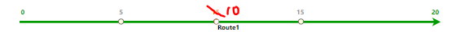
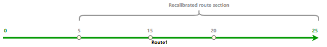
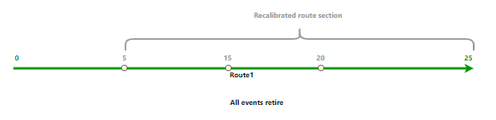
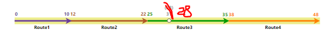
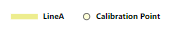
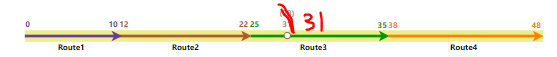

# Event Behavior for Route Calibration

|   |   |
| --- | --- |
| **Kind** | Other · Pro |
| **Release** | — |
| **Product** | Roads & Highways |
| **Source** | [calibrate_RH.docx](<https://esriis.sharepoint.com/sites/LocationReferencing/Shared%20Documents/General/Doc%20Reviews/5581_calibrate_behavior/calibrate_RH.docx>) |
| **Edited** | 2023-11-28 20:23 by Claire Wang |
| **Extracted** | 2026-09-04 · lane `xmlstrip` |

<!-- metadata
```yaml
title: "Event Behavior for Route Calibration"
source_file: "calibrate_RH.docx"
source_url: "https://esriis.sharepoint.com/sites/LocationReferencing/Shared%20Documents/General/Doc%20Reviews/5581_calibrate_behavior/calibrate_RH.docx"
doc_id: 447
doc_kind: "Other"
surface: "Pro"
doc_revision: ""
target_release: ""
pe: ""
dev: ""
author: ""
last_edited_by: "Claire Wang"
last_edited: "2023-11-28T20:23:00Z"
extracted: 2026-09-04
extraction_lane: xmlstrip
prompt_version: "v2.0.2"
keywords: ["route calibration", "event behavior", "calibration point", "event measures", "stay put", "move", "retire", "line network", "spanning events"]
tools: ["Apply Event Behaviors", "Generate Routes", "Location Referencing tab calibration tools", "Location Referencing route editing tools"]
products: ["Roads & Highways"]
issues: []
related: [{"doc":448,"file":"event-behavior-for-route-calibration__doc448.md","s":8.93},{"doc":449,"file":"event-behavior-for-route-calibration__doc449.md","s":7.615},{"doc":446,"file":"event-behavior-for-route-calibration__doc446.md","s":7.486},{"doc":425,"file":"event-behavior-for-route-retirement__doc425.md","s":5.391},{"doc":420,"file":"event-behavior-for-route-retirement__doc420.md","s":5.259}]
```
-->

## Summary

This document explains how route calibration affects events in a linear referencing system, detailing the impact of different event behaviors—Stay Put, Move, and Retire—on events upstream, downstream, and crossing calibration points. It includes scenarios for single routes and line networks with spanning events, illustrating changes before and after calibration with tables and examples.

## Related documents

<!-- related:begin -->
- [Event Behavior for Route Calibration](<https://esriis.sharepoint.com/sites/lrsworkspace/LRS Doc Index/Other/event-behavior-for-route-calibration__doc448.md>) — similar text 0.93 · 4 title words · 1 filename word · same kind/surface/folder <!-- rel:448 -->
- [Event Behavior for Route Calibration](<https://esriis.sharepoint.com/sites/lrsworkspace/LRS Doc Index/Other/event-behavior-for-route-calibration__doc449.md>) — similar text 0.82 · 4 title words · 1 filename word · same kind/surface/folder <!-- rel:449 -->
- [Event Behavior for Route Calibration](<https://esriis.sharepoint.com/sites/lrsworkspace/LRS Doc Index/Other/event-behavior-for-route-calibration__doc446.md>) — similar text 0.80 · 4 title words · 1 filename word · same kind/surface/folder <!-- rel:446 -->
- [Event Behavior for Route Retirement](<https://esriis.sharepoint.com/sites/lrsworkspace/LRS Doc Index/Other/event-behavior-for-route-retirement__doc425.md>) — similar text 0.55 · 3 title words · same kind/surface <!-- rel:425 -->
- [Event Behavior for Route Retirement](<https://esriis.sharepoint.com/sites/lrsworkspace/LRS Doc Index/Other/event-behavior-for-route-retirement__doc420.md>) — similar text 0.56 · 3 title words · same kind/surface <!-- rel:420 -->
<!-- related:end -->

<!-- docs:begin -->
## Esri documentation

[Event behavior](https://doc.esri.com/en/arcgis-pro/latest/help/production/roads-highways/what-is-event-behavior.html) · [Configure continuous measure networks and events to update with an engineering network](https://doc.esri.com/en/arcgis-pro/latest/help/production/location-referencing-pipelines/configure-continuous-measure-networks-and-events-to-update-with-an-engineering-network.html) · [Retire routes](https://doc.esri.com/en/arcgis-pro/latest/help/production/roads-highways/retire-routes.html)

_No page matched:_ [Apply Event Behaviors](https://www.google.com/search?q=%22Apply%20Event%20Behaviors%22+site%3Adoc.esri.com) · [Generate Routes](https://www.google.com/search?q=%22Generate%20Routes%22+site%3Adoc.esri.com) · [Location Referencing tab calibration tools](https://www.google.com/search?q=%22Location%20Referencing%20tab%20calibration%20tools%22+site%3Adoc.esri.com) · [Location Referencing route editing tools](https://www.google.com/search?q=%22Location%20Referencing%20route%20editing%20tools%22+site%3Adoc.esri.com)
<!-- docs:end -->

---

## Event behavior for route calibration
When route calibration occurs, events are impacted, depending on the configured event behavior for each event layer.
Note:
Events are not updated until the Apply Event Behaviors tool is run after route edits. If you are using conflict prevention on branch versioned data, you are prompted to run Apply Event Behaviors before posting to the default version.
Calibration can occur on a route when one or more calibration points are added, edited, deleted, or when recalibration downstream is selected for LRS route editing tools.
Calibration point changes can be made using Location Referencing tab calibration tools, by creating or editing calibration points using create features in ArcGIS Pro, by using Apply downstream recalibration in Location Referencing route editing tools, or by checking the Record calibration changes for event location updates option when running the Generate Routes tool.
The route calibration and corresponding event behaviors are described below.

### Route calibration scenario
A route can be calibrated at any location on the route.

#### Upstream and downstream sections
Route editing impacts upstream and downstream sections differently.
Refer to the following diagrams to understand the upstream and downstream section for the route calibration scenario:

The following table details how the calibration editing activity impacts upstream and downstream events according to the configured event behavior:

| Behavior | Events upstream of calibration point edit | Events crossing calibration point edit | Events downstream of calibration point edit |
| --- | --- | --- | --- |
| Stay Put | Measures on an event update to maintain the geographic location if the event crosses the section between the edited calibration point and the nearest upstream calibration point. | Measures on an event update to maintain the geographic location of the event. | Measures on an event update to maintain the geographic location of the event. If the event crosses the section between the edited calibration point and the nearest upstream calibration point, measures update due to calibration point values changing. |
| Move | The event polyline shape updates to the new location of measures on the route if the event crosses the section between the edited calibration point and the nearest upstream calibration point. | The event polyline shape is updated to the new location of measures on the route. | The event polyline shape is updated to the new location of measures on the route if crossing a section of the route with a calibration point with measures is updated. |
| Retire | The event retires if the event crosses the section between the edited calibration point and the nearest upstream calibration point. | The event retires; line events crossing the edited calibration point are not split. | The event retires if the event crosses a section of the route with a calibration point with measures updated. |

Note:
The network can contain events that span routes in a line network. The behaviors are still applied in the same manner.
Since the LRS is time aware, edit activities, such as calibrating a route, time slices routes and events.
If the route is calibrated the same day that it's created and the event behavior for calibrate is set to retire, the events are deleted and not retired.

#### Route Calibration results
In this example, the route Route1 is active from 1/1/2000. The calibration is set to occur on 1/1/2005 where A calibration point at existing measure 10 is changed to 15, resulting in recalibrated measures downstream. The graphics and tables below demonstrate the route information before and after the calibration.

#### Before route calibration
The following image shows the route before calibration: (create this graphic by 1. removing the events; 2. Changing the orange measure 15 to 10 and making the text size and color match 5 and 15; 3. Changing the orange dot to a white dot that matches the other calibration point symbology)

The following table provides details about the route before calibration:

| Route ID | From Date | To Date | From Measure | To Measure |
| --- | --- | --- | --- | --- |
| Route1 | 1/1/2000 | <Null> | 0 | 20 |

#### After route calibration
The following image shows the route after calibration:

Note:
The recalibrated section starts from the nearest upstream calibration point of the edited calibration point to the end of calibration.
The following table provides details about the route after calibration:

| Route ID | From Date | To Date | From Measure | To Measure |
| --- | --- | --- | --- | --- |
| Route1 | 1/1/2000 | 1/1/2005 | 0 | 20 |
| Route1 | 1/1/2005 | <Null> | 0 | 25 |

#### Events before route calibration
There are three events on Route1 and all of them have a From Date of 1/1/2000. The following image shows the route and events before calibration: (create this graphic by 1. Changing the orange measure 15 to 10 and making the text size and color match 5 and 15; 2. Changing the orange dot to a white dot that matches the other calibration point symbology)

The following table provides details about the events before calibration:

| Event | Route ID | From Date | To Date | From Measure | To Measure |
| --- | --- | --- | --- | --- | --- |
| Event1 | Route1 | 1/1/2000 | <Null> | 0 | 7 |
| Event2 | Route1 | 1/1/2000 | <Null> | 7 | 15 |
| Event3 | Route1 | 1/1/2000 | <Null> | 15 | 20 |

The following sections detail how event behavior rules are enforced after running the Apply Event Behaviors tool under this route calibration scenario.

#### Stay Put event behavior
Although the geographic location of the event is maintained, the measures can change.
The route calibration described above has the following effects:

- Event1 is retired on the date of calibration since it is partially within the recalibrated route section. A new event is created on the post-calibration route with the calibration date as the From Date. The From and To Measures are changed to 0 to 9 to accommodate the new measures of Route1.
- Event2 is retired on the date of calibration since it is completely within the recalibrated route section. A new event is created on the post-calibration route with the calibration date as the From Date. The From and To Measures are changed to 9 to 20 to accommodate the new measures of Route1.
- Event3 is retired on the date of calibration since it is completely within the recalibrated route section. A new event is created on the post-calibration route with the calibration date as the From Date. The From and To Measures are changed to 20 to 25 to accommodate the new measures of Route1.
The following image shows the route and events after calibration:

Note:
It is important to note that the retired event is not drawn in the graphic above.
The following table provides details about the events after calibration when Stay Put is the configured event behavior:

| Event | Route ID | From Date | To Date | From Measure | To Measure | Location Error |
| --- | --- | --- | --- | --- | --- | --- |
| Event1 | Route1 | 1/1/2000 | 1/1/2005 | 0 | 7 | No Error |
| Event1 | Route1 | 1/1/2005 | <Null> | 0 | 9 | No Error |
| Event2 | Route1 | 1/1/2000 | 1/1/2005 | 7 | 15 | No Error |
| Event2 | Route1 | 1/1/2005 | <Null> | 9 | 20 | No Error |
| Event3 | Route1 | 1/1/2000 | 1/1/2005 | 15 | 20 | No Error |
| Event3 | Route1 | 1/1/2005 | <Null> | 20 | 25 | No Error |

#### Move event behavior
Although the measures of the event are maintained, the geographic location can change.
The route calibration described above has the following effects:

- Event1 is retired on the date of calibration since it is partially within the recalibrated route section. A new event is created on the post-calibration route with the calibration date as the From Date. Because the measures do not change for the Move behavior, the event is slightly shortened on the end to maintain its original From and To Measures of 0 to 7.
- Event2 is retired on the date of calibration since it is completely within the recalibrated route section. A new event is created on the post-calibration route with the calibration date as the From Date. Because the measures do not change for the Move behavior, the event shifts to the left to maintain its original From and To Measures of 7 to 15.
- Event3 is retired on the date of calibration since it is completely within the recalibrated route section. A new event is created on the post-calibration route with the calibration date as the From Date. Because the measures do not change for the Move behavior, the event shifts to the left to maintain its original From and To Measures of 15 to 20.
The following image shows the route and events after calibration:

The following table provides details about the events after calibration when Move is the configured event behavior:

| Event | Route ID | From Date | To Date | From Measure | To Measure | Location Error |
| --- | --- | --- | --- | --- | --- | --- |
| Event1 | Route1 | 1/1/2000 | 1/1/2005 | 0 | 7 | No Error |
| Event1 | Route1 | 1/1/2005 | <Null> | 0 | 7 | No Error |
| Event2 | Route1 | 1/1/2000 | 1/1/2005 | 7 | 15 | No Error |
| Event2 | Route1 | 1/1/2005 | <Null> | 7 | 15 | No Error |
| Event3 | Route1 | 1/1/2000 | 1/1/2005 | 15 | 20 | No Error |
| Event3 | Route1 | 1/1/2005 | <Null> | 15 | 20 | No Error |

#### Retire event behavior
Events in the recalibrated route section are retired. All 3 events are retired.
The route calibration described above has the following effects:

- Event1 was partially within the recalibrated route section; it is retired on the date of calibration.
- Event2 was completely within the recalibrated route section; it is retired on the date of calibration.
- Event3 was completely within the recalibrated route section; it is retired on the date of calibration.
The following image shows the route and events after calibration:

The following table provides details about the events after calibration when Retire is the configured event behavior:

| Event | Route ID | From Date | To Date | From Measure | To Measure | Location Error |
| --- | --- | --- | --- | --- | --- | --- |
| Event1 | Route1 | 1/1/2000 | 1/1/2005 | 0 | 7 | No Error |
| Event2 | Route1 | 1/1/2000 | 1/1/2005 | 7 | 15 | No Error |
| Event3 | Route1 | 1/1/2000 | 1/1/2005 | 15 | 20 | No Error |

### Detailed behavior results on routes in a line network with events that span routes
In this example, there are four routes on the LineA and the routes are active from 1/1/2000. The calibration is set to occur on 1/1/2005 where a new calibration point is added to Route3 at existing measure 28 with a new measure value of 31. Recalibrate downstream is not applied. The graphics and tables below demonstrate the route information before and after the calibration.

#### Before route calibration
The following image shows the routes before calibration: (create this graphic by 1. removing the events from the graphic and legend; 2. Showing only 28 at the calibration point location and make the text size and color match the original grey text)

The following table provides details about the routes before calibration:

| Route Name | Line Name | Line Order | From Date | To Date | From Measure | To Measure |
| --- | --- | --- | --- | --- | --- | --- |
| Route1 | LineA | 100 | 1/1/2000 | <Null> | 0 | 10 |
| Route2 | LineA | 200 | 1/1/2000 | <Null> | 12 | 22 |
| Route3 | LineA | 300 | 1/1/2000 | <Null> | 25 | 35 |
| Route4 | LineA | 400 | 1/1/2000 | <Null> | 38 | 48 |

#### After route calibration
The following image shows the routes after calibration: (create this graphic by 1. removing the events; 2. Showing only 31 at the calibration point location and making the text size and color match the original grey text; 3. Drawing a Recalibrated route section bracket from the beginning for Route3 to the end of Route3 (mimic the grey bracket above))
----------------------------------------------------

The following table provides details about the routes after calibration:

| Route Name | Line Name | Line Order | From Date | To Date | From Measure | To Measure |
| --- | --- | --- | --- | --- | --- | --- |
| Route1 | LineA | 100 | 1/1/2000 | <Null> | 0 | 10 |
| Route2 | LineA | 200 | 1/1/2000 | <Null> | 12 | 22 |
| Route3 | LineA | 300 | 1/1/2000 | 1/1/2005 | 25 | 35 |
| Route3 | LineA | 300 | 1/1/200 5 | <Null> | 25 | 35 |
| Route4 | LineA | 400 | 1/1/2000 | <Null> | 38 | 48 |

Note:
Calibration points affect only the route on which they are added or updated.
Route3 did not change its end measure because recalibrate downstream is not applied.

#### Events before calibration
There are two spanning events on routes on LineA. The following image shows the routes and events before calibration: (create this graphic by 1. Showing only 28 at the calibration point location and make the text size and color match the original grey text; 2. Removing the (28) before calibration measure from the legend)

The following table provides details about the events before calibration:

| Event ID | From Date | To Date | From Route Name | To Route Name | From Measure | To Measure |
| --- | --- | --- | --- | --- | --- | --- |
| Event1 | 1/1/2000 | <Null> | Route1 | Route3 | 0 | 30 |
| Event2 | 1/1/2000 | <Null> | Route3 | Route4 | 30 | 48 |

The following sections describe how event behavior rules are enforced when a route on a line in a line network is calibrated.

#### Stay Put event behavior
Although the geographic location of the event is maintained, the measures can change.
The route calibration described above has the following effects:

- Event1 is retired on the date of calibration since it is partially within the recalibrated route section. A new event is created on the post-calibration route with the calibration date as the From Date. The From and To Measures are changed to measure 0 on Route1 to measure 33 on Route3 to accommodate the new measures of Route3.
- Event2 is retired on the date of calibration since it is partially within the recalibrated route section. A new event is created on the post-calibration route with the calibration date as the From Date. The From and To Measures are changed to measure 33 on Route3 to measure 48 on Route4 to accommodate the new measures of Route3.
The following image shows the routes and events after calibration: (create this graphic by 1. Showing only 31 at the calibration point location and making the text size and color match the original grey text; 2. Drawing a Recalibrated route section bracket from the beginning for Route3 to the end of Route3 (mimic the grey bracket above); 3. Removing the (33) from graphic and the (33) after calibration measure from the legend)
Note:
It is important to note that the retired event is not drawn in the graphic above.
The following table provides details about the events after calibration when Stay Put is the configured event behavior:

| Event ID | From Date | To Date | From Route Name | From Measure | To Route Name | To Measure |
| --- | --- | --- | --- | --- | --- | --- |
| Event1 | 1/1/2000 | 1/1/2005 | Route1 | 0 | Route3 | 30 |
| Event 1 | 1/1/2005 | <Null> | Route1 | 0 | Route3 | 3 3 |
| Event2 | 1/1/2000 | 1/1/2005 | Route3 | 30 | Route4 | 48 |
| Event 1 | 1/1/2005 | <Null> | Route3 | 3 3 | Route4 | 48 |

#### Move event behavior
Although the measures of the event are maintained, the geographic location can change.
The route calibration described above has the following effects:

- Event1 is retired on the date of calibration since it is partially within the recalibrated route section. A new event is created on the post-calibration route with the calibration date as the From Date. Because the measures do not change for the Move behavior, the event is slightly shortened on the end to maintain its original From and To Measures of measure 0 on Route1 to measure 30 on Route3.
- Event2 is retired on the date of calibration since it is completely within the recalibrated route section. A new event is created on the post-calibration route with the calibration date as the From Date. Because the measures do not change for the Move behavior, the event shifts to the left to maintain its original From and To Measures of measure 30 on Route3 to measure 48 on Route4.
The following image shows the route and events after calibration: (create this graphic by 1. Showing only 31 at the calibration point location and making the text size and color match the original grey text; 2. Drawing a Recalibrated route section bracket from the beginning for Route3 to the end of Route3 (mimic the grey bracket above); 3. Removing the (33) from graphic and the (33) after calibration measure from the legend)

The following table provides details about the events after calibration when Move is the configured event behavior:

| Event ID | From Date | To Date | From Route Name | From Measure | To Route Name | To Measure |
| --- | --- | --- | --- | --- | --- | --- |
| Event1 | 1/1/2000 | 1/1/2005 | Route1 | 0 | Route3 | 30 |
| Event 1 | 1/1/2005 | <Null> | Route1 | 0 | Route3 | 3 0 |
| Event2 | 1/1/2000 | 1/1/2005 | Route3 | 30 | Route4 | 48 |
| Event 1 | 1/1/2005 | <Null> | Route3 | 30 | Route4 | 48 |

#### Retire event behavior
Events in the recalibrated route section are retired. All 2 events are retired.
The route calibration described above has the following effects:

- Event1 was partially within the recalibrated route section; it is retired on the date of calibration.
- Event2 was partially within the recalibrated route section; it is retired on the date of calibration.
The following image shows the route and events after calibration:

The following table provides details about the events after calibration when Retire is the configured event behavior:

| Event ID | From Date | To Date | From Route Name | From Measure | To Route Name | To Measure | Location Error |
| --- | --- | --- | --- | --- | --- | --- | --- |
| Event1 | 1/1/2000 | 1/1/2005 | Route 1 | 0 | Route 3 | 30 | No Error |
| Event2 | 1/1/2000 | 1/1/2005 | Route 3 | 30 | Route 4 | 48 | No Error |

           
