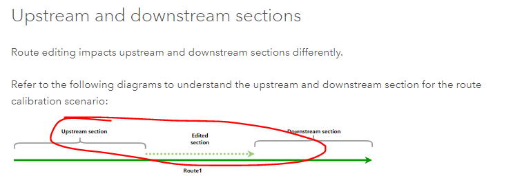

# Event Behavior for Route Realignment and Calibration

|   |   |
| --- | --- |
| **Kind** | Other · Pro |
| **Release** | — |
| **Source** | [final.change.docx](<https://esriis.sharepoint.com/sites/LocationReferencing/Shared%20Documents/General/Doc%20Reviews/5748_EB_topics/final.change.docx>) |
| **Edited** | 2024-04-12 18:12 by Claire Wang |
| **Extracted** | 2026-09-04 · lane `xmlstrip` |

<!-- metadata
```yaml
title: "Event Behavior for Route Realignment and Calibration"
source_file: "final.change.docx"
source_url: "https://esriis.sharepoint.com/sites/LocationReferencing/Shared%20Documents/General/Doc%20Reviews/5748_EB_topics/final.change.docx"
doc_id: 384
doc_kind: "Other"
surface: "Pro"
doc_revision: ""
target_release: ""
pe: ""
dev: ""
author: "Claire Wang"
last_edited_by: "Claire Wang"
last_edited: "2024-04-12T18:12:00Z"
extracted: 2026-09-04
extraction_lane: xmlstrip
prompt_version: "v2.0.2"
keywords: ["event behavior", "route realignment", "route calibration", "calibration point", "recalibrate downstream", "location referencing"]
tools: []
products: []
issues: []
related: [{"doc":448,"file":"event-behavior-for-route-calibration__doc448.md","s":3.813},{"doc":446,"file":"event-behavior-for-route-calibration__doc446.md","s":3.772},{"doc":449,"file":"event-behavior-for-route-calibration__doc449.md","s":3.727},{"doc":443,"file":"event-behavior-for-route-retirement__doc443.md","s":3.657},{"doc":442,"file":"event-behavior-for-route-retirement__doc442.md","s":3.595}]
```
-->

## Summary

This document provides updates and clarifications on event behavior related to route realignment and calibration in location referencing pipelines. It includes instructions to modify event behavior tables, replace notes with detailed explanations about recalibration options, and update graphics illustrating upstream and downstream calibration points.

## Related documents

<!-- related:begin -->
- [Event Behavior for Route Calibration](<https://esriis.sharepoint.com/sites/lrsworkspace/LRS Doc Index/Other/event-behavior-for-route-calibration__doc448.md>) — similar text 0.17 · 4 title words · same kind/surface <!-- rel:448 -->
- [Event Behavior for Route Calibration](<https://esriis.sharepoint.com/sites/lrsworkspace/LRS Doc Index/Other/event-behavior-for-route-calibration__doc446.md>) — similar text 0.22 · 4 title words · same kind/surface <!-- rel:446 -->
- [Event Behavior for Route Calibration](<https://esriis.sharepoint.com/sites/lrsworkspace/LRS Doc Index/Other/event-behavior-for-route-calibration__doc449.md>) — similar text 0.20 · 4 title words · same kind/surface <!-- rel:449 -->
- [Event Behavior for Route Retirement](<https://esriis.sharepoint.com/sites/lrsworkspace/LRS Doc Index/Other/event-behavior-for-route-retirement__doc443.md>) — similar text 0.20 · 3 title words · 1 filename word · same kind/surface <!-- rel:443 -->
- [Event Behavior for Route Retirement](<https://esriis.sharepoint.com/sites/lrsworkspace/LRS Doc Index/Other/event-behavior-for-route-retirement__doc442.md>) — similar text 0.18 · 3 title words · 1 filename word · same kind/surface <!-- rel:442 -->
<!-- related:end -->

<!-- docs:begin -->
## Esri documentation

[Event behavior](https://doc.esri.com/en/arcgis-pro/latest/help/production/location-referencing-pipelines/what-is-event-behavior.html) · [Realign routes](https://doc.esri.com/en/arcgis-pro/latest/help/production/location-referencing-pipelines/realign-routes.html) · [Set Location Referencing options](https://doc.esri.com/en/arcgis-pro/latest/help/production/location-referencing-pipelines/set-location-referencing-options.html)

_No page matched:_ [calibration point layer](https://www.google.com/search?q=%22calibration%20point%20layer%22+site%3Adoc.esri.com)
<!-- docs:end -->

---

https://prodev.arcgis.com/en/pro-app/latest/help/production/location-referencing-pipelines/what-is-event-behavior.htmhttps://prodev.arcgis.com/en/pro-app/latest/help/production/location-referencing-pipelines/what-is-event-behavior.htm
Remove duplicate note
https://prodev.arcgis.com/en/pro-app/latest/help/production/location-referencing-pipelines/event-behavior-for-route-realignment.htm and https://prodev.arcgis.com/en/pro-app/latest/help/production/roads-highways/event-behavior-for-route-realignment.htm
change the first 3 cells in this column to be No action. (so all 5 cells show No action.)
https://prodev.arcgis.com/en/pro-app/latest/help/production/location-referencing-pipelines/event-behavior-for-route-calibration.htm and https://prodev.arcgis.com/en/pro-app/latest/help/production/roads-highways/event-behavior-for-route-calibration.htm

- Remove this bullet
- Replace the Note with the text below

In this example, the Recalibrate downstream option is chosen, so the recalibrated route section starts from the nearest upstream calibration point of the edited calibration point to the end of the route. If the Recalibrate downstream option is not chosen, the recalibrated route section is between the nearest upstream and downstream calibration points of the edited calibration point.

- Replace the Upstream/Downstream graphic to be the one below (see attached draw.io)

     
