# Event Behavior for Route Reassignment – Form a New Route Method

|   |   |
| --- | --- |
| **Kind** | Other · Pro |
| **Release** | — |
| **Source** | [ReassignEB-FormANewRoute_doc.docx](<https://esriis.sharepoint.com/sites/LocationReferencing/Shared%20Documents/General/Doc%20Reviews/ReassignEventBehavior_3docs/ReassignEB-FormANewRoute_doc.docx>) |
| **Edited** | 2023-08-17 19:15 by Claire Wang |
| **Extracted** | 2026-09-04 · lane `xmlstrip` |

<!-- metadata
```yaml
title: "Event Behavior for Route Reassignment – Form a New Route Method"
source_file: "ReassignEB-FormANewRoute_doc.docx"
source_url: "https://esriis.sharepoint.com/sites/LocationReferencing/Shared%20Documents/General/Doc%20Reviews/ReassignEventBehavior_3docs/ReassignEB-FormANewRoute_doc.docx"
doc_id: 523
doc_kind: "Other"
surface: "Pro"
doc_revision: ""
target_release: ""
pe: ""
dev: ""
author: "Claire Wang"
last_edited_by: "Claire Wang"
last_edited: "2023-08-17T19:15:00Z"
extracted: 2026-09-04
extraction_lane: xmlstrip
prompt_version: "v2.0.2"
keywords: ["route reassignment", "event behavior", "form new route", "split route", "rename route", "upstream events", "downstream events", "line network", "spanning events"]
tools: ["Apply Event Behaviors"]
products: []
issues: []
related: [{"doc":36,"file":"event-behavior-for-route-reassignment-transfer-to-another-line-method__doc36.md","s":8.867},{"doc":522,"file":"event-behavior-for-route-reassignment-merge-to-adjacent-route-method__doc522.md","s":7.96},{"doc":425,"file":"event-behavior-for-route-retirement__doc425.md","s":4.901},{"doc":442,"file":"event-behavior-for-route-retirement__doc442.md","s":4.728},{"doc":441,"file":"event-behavior-for-route-retirement__doc441.md","s":4.704}]
```
-->

## Summary

This document explains how events are affected during route reassignment using the Form a New Route method in linear referencing. It details the impact on upstream and downstream events based on configured event behaviors such as Stay Put, Move, Retire, and Snap, including examples of splitting and renaming routes and handling events in a line network with spanning routes.

## Related documents

<!-- related:begin -->
- [Event Behavior for Route Reassignment – Transfer to Another Line Method](<https://esriis.sharepoint.com/sites/lrsworkspace/LRS Doc Index/Other/event-behavior-for-route-reassignment-transfer-to-another-line-method__doc36.md>) — similar text 0.69 · 5 title words · 1 filename word · same kind/surface/folder <!-- rel:36 -->
- [Event Behavior for Route Reassignment – Merge to Adjacent Route Method](<https://esriis.sharepoint.com/sites/lrsworkspace/LRS Doc Index/Other/event-behavior-for-route-reassignment-merge-to-adjacent-route-method__doc522.md>) — similar text 0.80 · 5 title words · 2 filename words · same kind/surface/folder <!-- rel:522 -->
- [Event Behavior for Route Retirement](<https://esriis.sharepoint.com/sites/lrsworkspace/LRS Doc Index/Other/event-behavior-for-route-retirement__doc425.md>) — similar text 0.54 · 3 title words · same kind/surface <!-- rel:425 -->
- [Event Behavior for Route Retirement](<https://esriis.sharepoint.com/sites/lrsworkspace/LRS Doc Index/Other/event-behavior-for-route-retirement__doc442.md>) — similar text 0.54 · 3 title words · same kind/surface <!-- rel:442 -->
- [Event Behavior for Route Retirement](<https://esriis.sharepoint.com/sites/lrsworkspace/LRS Doc Index/Other/event-behavior-for-route-retirement__doc441.md>) — similar text 0.53 · 3 title words · same kind/surface <!-- rel:441 -->
<!-- related:end -->

<!-- docs:begin -->
## Esri documentation

[Route reassignment](https://doc.esri.com/en/arcgis-pro/latest/help/production/location-referencing-pipelines/reassign-routes.html) · [Event behavior](https://doc.esri.com/en/arcgis-pro/latest/help/production/location-referencing-pipelines/what-is-event-behavior.html) · [Rename a route](https://doc.esri.com/en/arcgis-pro/latest/help/production/location-referencing-pipelines/rename-a-route.html)

_No page matched:_ [Apply Event Behaviors](https://www.google.com/search?q=%22Apply%20Event%20Behaviors%22+site%3Adoc.esri.com)
<!-- docs:end -->

---

## Event behavior for route reassignment – Form a new route Method
During route reassignment, events are impacted in the edit section, and upstream and downstream of the reassignment, depending on the configured event behavior for the event layer.
Note:
Events are not updated until the Apply Event Behaviors tool is run after route edits. If you are using conflict prevention on branch versioned data, you are prompted to run Apply Event Behaviors before posting to the default version .
Note:
When Recalibrate route downstream is chosen for an LRS route edit, the configured calibrate event behavior is applied to downstream sections. You can review configured event behaviors by viewing LRS event properties.
Running the Apply Event Behaviors tool on event features after a corresponding route edit is described below.
Form a new route Method

#### A new route is created by merging source routes if multiple routes are selected in source.

#### A new route is created by splitting source route if a partial route is selected in source.

#### Route is renamed by selecting an entire route and providing a new route name or id.

#### Upstream and downstream sections
Route editing impacts upstream and downstream sections differently.
The following image shows the upstream and downstream section for the route reassignment scenario:

The following table details how the reassignment editing activity impacts upstream and downstream events according to the configured event behavior:

| Behavior | Events upstream reassignment | Events intersecting reassignment | Events downstream reassignment |
| --- | --- | --- | --- |
| Stay Put | No action | Retire event. Line events crossing the edit section are split and the original event is retired. | If route calibration is changed, the calibrate event behavior is applied; otherwise, no action is taken. |
| Move | Shape regenerated, if needed, to new location of route measures | Shape regenerated to the new location of route measures. | If route calibration is changed, the calibrate event behavior is applied; otherwise, no action is taken. |
| Retire | No action | Retire event. Line events crossing the reassignment region do not split. | If route calibration is changed, the calibrate event behavior is applied; otherwise, no action is taken. |
| Snap | No action | Geographic location ( x,y ) is maintained. The event is migrated to the reassigned route. Line events crossing the edit section are split. | If route calibration is changed, the calibrate event behavior is applied; otherwise, no action is taken. |

Note:
The network can contain events that span routes in a line network; the behaviors are still applied in the same manner.
Since the LRS is time aware, edit activities—such as reassigning a route—time slice routes and events.
The following sections detail the last two capabilities in From a new route Method: splitting and renaming. The first capability, merging, works similarly to Merge to adjacent route Method. You can refer to this link for more examples and information.

### Form a new route by splitting an existing route
In this example, the routes are active from 1/1/2000, and the reassignment is set to occur on 1/1/2005 where the second half of Route1 splits out and forms a new route in 2005. The graphics and tables below demonstrate the route information before and after the reassignment.

##### Before Route Reassignment
The following image shows the routes before reassignment:

The following tables provide details about the routes before reassignment:

| Route Name | From Date | To Date | From Measure | To Measure |
| --- | --- | --- | --- | --- |
| Route1 | 1/1/2000 | <Null> | 0 | 10 |

##### After Route Reassignment
The following image shows the routes after reassignment:

The following tables provide details about the routes after reassignment:

| Route Name | From Date | To Date | From Measure | To Measure |
| --- | --- | --- | --- | --- |
| Route1 | 1/1/2000 | 1/1/2005 | 0 | 10 |
| Route1 | 1/1/200 5 | <Null> | 0 | 5 |
| Route New | 1/1/200 5 | <Null> | 0 | 5 |

##### Events before reassignment
The following image shows the routes and events before reassignment:

The following tables provide details about the events before reassignment:

| Event | Route Name | From Date | To Date | From Measure | To Measure |
| --- | --- | --- | --- | --- | --- |
| Event1 | Route1 | 1/1/2000 | <Null> | 0 | 7 |
| Event2 | Route1 | 1/1/2000 | <Null> | 7 | 10 |

The following sections detail how event behavior rules are enforced after running the Apply Event Behaviors geoprocessing tool, when a new route is created by splitting from the source route.

#### Stay Put event behavior
Although the geographic location of the event outside the reassign region is maintained, the measures can change. The event can also split if it crosses the reassign region. Portions in the reassign region are retired.
The route reassignment described above has the following effects:

- Event1 was partially in the edit section; it is retired on the date of reassignment, and a new event is created on the non-impacted portion with the reassignment date as the From Date. The To Measure is changed to accommodate the new ending measure (5) of Route1.
- Event2 is retired on the date of reassignment because it fell entirely within the edit section.
The following image shows the routes and events after reassignment:

The following tables provide details about the events after reassignment when Stay Put is the configured event behavior:

| Event | Route Name | From Date | To Date | From Measure | To Measure | Loc Error |
| --- | --- | --- | --- | --- | --- | --- |
| Event1 | Route1 | 1/1/2000 | 1/1/2005 | 0 | 7 | No Error |
| Event 1 | Route1 | 1/1/200 5 | <Null> | 0 | 5 | No Error |
| Event2 | Route1 | 1/1/2000 | 1/1/2005 | 7 | 10 | No Error |

Note:
It is important to note that retired events are not drawn in the graphic above

#### Move event behavior
Although the measures of the event are maintained, the geographic location can change.
The route reassignment described above has the following effects:

- Event1 was partially in the edit section; it is retired on the date of reassignment, and a new event with the reassignment date as the From Date is created on the non-impacted portion. Because the measures do not change for the Move behavior, there is a location error for the To Measure because that measure (7) no longer exists on Route1.
- Event2 is retired on the date of reassignment since it fell within the edit section. From the date of reassignment, a new event is created. Because the measures remain same, the newly produced event receives the location error because both its From and To measures cannot be found on Route1.
The following image shows the routes and events after reassignment:

The following tables provide details about the events after reassignment when Move is the configured event behavior:

| Event | Route Name | From Date | To Date | From Measure | To Measure | Location Error |
| --- | --- | --- | --- | --- | --- | --- |
| Event1 | Route1 | 1/1/2000 | 1/1/2005 | 0 | 7 | No Error |
| Event2 | Route1 | 1/1/2000 | 1/1/2005 | 7 | 10 | No Error |
| E vent1 | Route1 | 1/1/2005 | <Null> | 0 | 7 | Partial Match for the To Measure |
| Event2 | Route1 | 1/1/2005 | <Null> | 7 | 10 | Measure Extent Out of Route Measure Range |

#### Retire event behavior
Events intersecting the reassignment region are retired.

- Event1 was present in the edit section; it is retired on the date of reassignment.
- Event2 was present in the edit section; it is retired on the date of reassignment.
The following image shows the routes and events after reassignment:

The following tables provide details about the events after reassignment when Retire is the configured event behavior:

| Event | Route Name | From Date | To Date | From Measure | To Measure | Loc Error |
| --- | --- | --- | --- | --- | --- | --- |
| Event1 | Route1 | 1/1/2000 | 1/1/2005 | 0 | 7 | No Error |
| Event2 | Route1 | 1/1/2000 | 1/1/2005 | 7 | 10 | No Error |

#### Snap event behavior
Although the geographic location of the event is maintained by snapping to the route that it was reassigned to, the measures can change. The event can also split if it crosses the reassign region.
The route reassignment described above has the following effects:

- Event1 was partially in the edit section; it is retired on the date of reassignment, and a new event with the reassignment date as the From Date is created on the non-impacted portion of Route1.
- Part of Event1, that was in the impacted portion, gets snapped to the new route with the new measures underlying on RouteNew. It gets its From Date from the date of reassignment.
- Event2 is retired on the date of reassignment since it fell within the edit section. From the date of reassignment, a new event is created snapped to the new route with the new measures underlying on RouteNew. It gets its From Date from the date of reassignment.
The following image shows the routes and events after reassignment:

The following tables provide details about the events after reassignment when Snap is the configured event behavior:

| Event | Route Name | From Date | To Date | From Measure | To Measure | Location Error |
| --- | --- | --- | --- | --- | --- | --- |
| Event1 | Route1 | 1/1/2000 | 1/1/2005 | 0 | 7 | No Error |
| Event1 | Route1 | 1/1/2005 | <Null> | 0 | 5 | No Error |
| Event1 | Route New | 1/1/2005 | <Null> | 0 | 2 | No Error |
| Event2 | Route1 | 1/1/2000 | 1/1/2005 | 7 | 10 | No Error |
| Event2 | Route New | 1/1/2005 | <Null> | 2 | 5 | No Error |

### Form a new route by renaming an existing route
In this example, the routes are active from 1/1/2000, and the reassignment is set to occur on 1/1/2005 where Route1 is renamed to RouteNew while maintaining its measures in 2005. The graphics and tables below demonstrate the route information before and after the reassignment.

##### Before Route Reassignment
The following image shows the routes before reassignment:

The following tables provide details about the routes before reassignment:

| Route Name | From Date | To Date | From Measure | To Measure |
| --- | --- | --- | --- | --- |
| Route1 | 1/1/2000 | <Null> | 0 | 10 |

##### After Route Reassignment
The following image shows the routes after reassignment:

The following tables provide details about the routes after reassignment:

| Route Name | From Date | To Date | From Measure | To Measure |
| --- | --- | --- | --- | --- |
| Route1 | 1/1/2000 | 1/1/2005 | 0 | 10 |
| Route New | 1/1/200 5 | <Null> | 0 | 10 |

##### Events before reassignment
The following image shows the routes and events before reassignment:

The following tables provide details about the events before reassignment:

| Event | Route Name | From Date | To Date | From Measure | To Measure |
| --- | --- | --- | --- | --- | --- |
| Event1 | Route1 | 1/1/2000 | <Null> | 0 | 7 |
| Event2 | Route1 | 1/1/2000 | <Null> | 7 | 10 |

The following sections detail how event behavior rules are enforced after running the Apply Event Behaviors geoprocessing tool, when a new route is created by renaming a source route.

#### Stay Put event behavior
Although the geographic location of the event outside the reassign region is maintained, the measures can change. The event can also split if it crosses the reassign region. Portions in the reassign region are retired.
Since the entire route Route1 is reassigned to RouteNew, both the events retire.

- Event1 was entirely in the edit section; it is retired on the date of reassignment.
- Event2 was entirely in the edit section; it is retired on the date of reassignment.
The following image shows the routes and events after reassignment:

The following tables provide details about the events after reassignment when Stay Put is the configured event behavior: 

| Event | Route Name | From Date | To Date | From Measure | To Measure |
| --- | --- | --- | --- | --- | --- |
| Event1 | Route1 | 1/1/2000 | 1/1/2005 | 0 | 7 |
| Event2 | Route1 | 1/1/2000 | 1/1/2005 | 7 | 10 |

Note:
It is important to note that retired events are not drawn in the graphic above

#### Move event behavior
Although the measures of the event are maintained, the geographic location can change.
The route renaming scenario described above has the following effects:

- Event1 was entirely in the edit section; it is retired on the date of reassignment, and a new event with the reassignment date as the From Date is created. A location error is generated for the new event as the original route Route1 does not exist from 1/1/2005 as a new route RouteNew has taken its place although the measures remain the same.
- Event2 was entirely in the edit section; it is retired on the date of reassignment, and a new event with the reassignment date as the From Date is created. A location error is generated for the new event as the original route Route1 does not exist from 1/1/2005 as a new route RouteNew has taken its place although the measures remain the same.
The following image shows the routes and events after reassignment:

The following tables provide details about the events after reassignment when Move is the configured event behavior:

| Event | Route Name | From Date | To Date | From Measure | To Measure | Location Error |
| --- | --- | --- | --- | --- | --- | --- |
| Event1 | Route1 | 1/1/2000 | 1/1/2005 | 0 | 7 | No Error |
| Event2 | Route1 | 1/1/2000 | 1/1/2005 | 7 | 10 | No Error |
| Event1 | Route1 | 1/1/2005 | <Null> | 0 | 7 | Route not Found |
| Event2 | Route1 | 1/1/2005 | <Null> | 7 | 10 | Route not Found |

#### Retire event behavior
Events intersecting the reassignment region are retired. Since the entire route Route1 is reassigned to RouteNew, both the events retire.

- Event1 was entirely in the edit section; it is retired on the date of reassignment.
- Event2 was entirely in the edit section; it is retired on the date of reassignment.
The following image shows the routes and events after reassignment:

The following tables provide details about the events after reassignment when Retire is the configured event behavior:

| Event | Route Name | From Date | To Date | From Measure | To Measure |
| --- | --- | --- | --- | --- | --- |
| Event1 | Route1 | 1/1/2000 | 1/1/2005 | 0 | 7 |
| Event2 | Route1 | 1/1/2000 | 1/1/2005 | 7 | 10 |

#### Snap event behavior
Although the geographic location of the event is maintained by snapping to the route that it was reassigned to, the measures can change. The event can also split if it crosses the reassign region.
The route renaming scenario described above has the following effects:

- Event1 was entirely in the edit section; it is retired on the date of reassignment, and a new event with the reassignment date as the From Date is created on the new route with the new measures underlying on RouteNew. The geographic location of the event is maintained.
- Event2 is retired on the date of reassignment since it fell within the edit section. From the date of reassignment, a new event is created snapped to the new route with the new measures underlying on RouteNew.
The following image shows the routes and events after reassignment:

The following tables provide details about the events after reassignment when Snap is the configured event behavior:

| Event | Route Name | From Date | To Date | From Measure | To Measure | Location Error |
| --- | --- | --- | --- | --- | --- | --- |
| Event1 | Route1 | 1/1/2000 | 1/1/2005 | 0 | 7 | No Error |
| Event1 | Route New | 1/1/2005 | <Null> | 0 | 7 | No Error |
| Event2 | Route1 | 1/1/2000 | 1/1/2005 | 7 | 10 | No Error |
| Event2 | Route New | 1/1/2005 | <Null> | 7 | 10 | No Error |

### Detailed behavior results on routes in a line network with events that span routes
In this example, there are 4 routes on the same line and the routes are active from 1/1/2000. On 1/1/2005, 3 separate reassignments are set to occur.

- The first reassignment merges Route1 and Route2 into a new route, RouteM.
- The second reassignment splits Route3 at measure 28, and create a new route called RouteS out of the original measure 28 to 35 on Route3 with target values of 0 to 20.
- The Third reassignment renames Route4 to RouteR and maintain Route4's original measures.
The graphics and tables below demonstrate the route information before and after the reassignment.

##### Before Route Reassignment
The following image shows the routes before reassignment:

The following tables provide details about the routes before reassignment:

| Route Name | Line Name | Line Order | From Date | To Date | From Measure | To Measure |
| --- | --- | --- | --- | --- | --- | --- |
| Route1 | LineA | 100 | 1/1/2000 | <Null> | 0 | 10 |
| Route2 | LineA | 200 | 1/1/2000 | <Null> | 12 | 22 |
| Route 3 | LineA | 300 | 1/1/2000 | <Null> | 25 | 35 |
| Route 4 | LineA | 400 | 1/1/2000 | <Null> | 38 | 48 |

##### After Route Reassignment
The following image shows the routes after reassignment:

The following tables provide details about the routes after reassignment:

| Route Name | Line Name | Line Order | From Date | To Date | From Measure | To Measure |
| --- | --- | --- | --- | --- | --- | --- |
| Route1 | LineA | 100 | 1/1/2000 | 1/1/2005 | 0 | 10 |
| Route2 | LineA | 200 | 1/1/2000 | 1/1/2005 | 12 | 22 |
| Route M | LineA | 100 | 1/1/200 5 | <Null> | 0 | 20 |
| Route 3 | LineA | 300 | 1/1/2000 | 1/1/2005 | 25 | 35 |
| Route 3 | LineA | 200 | 1/1/200 5 | <Null> | 25 | 28 |
| Route S | LineA | 300 | 1/1/200 5 | <Null> | 0 | 20 |
| Route 4 | LineA | 400 | 1/1/2000 | 1/1/2005 | 38 | 48 |
| Route R | LineA | 400 | 1/1/200 5 | <Null> | 38 | 48 |

##### Events before reassignment
The following image shows the routes and event before reassignment:

The following table provides details about the spanning event before reassignment:

| Event ID | From Date | To Date | From Route Name | To Route Name | From Measure | To Measure |
| --- | --- | --- | --- | --- | --- | --- |
| Event1 | 1/1/2000 | <Null> | Route1 | Route 4 | 0 | 48 |

The following sections detail how event behavior rules are enforced when routes on a line in a line network are reassigned.

#### Stay Put behavior
The 3 separate reassignments described above will have the following effects:

- Event1 falls in the edit section; it is retired on the date of reassignment, and a new event with the reassignment date as the From Date is created. The new event is located only on part of the Route3 that was unimpacted by the three edits.
The following image shows the routes and event after reassignment:

The following table provides details about the event after reassignment when Stay Put is the configured event behavior:

| Event | From Route Name | To Route Name | From Date | To Date | From Measure | To Measure | Loc Error |
| --- | --- | --- | --- | --- | --- | --- | --- |
| Event1 | Route1 | Route4 | 1/1/2000 | 1/1/2005 | 0 | 48 | No Error |
| Event1 | Route3 | Route3 | 1/1/2005 | <Null> | 25 | 28 | No Error |

Note:
It is important to note that retired events are not drawn in the graphic above

#### Move behavior
The 3 separate reassignments described above will have the following effects:

- Event1 was partially in the edit section; it is retired on the date of reassignment, and a new event with the reassignment date as the From Date is created. The move behavior does not allow changing the From and To route IDs or measures of the event, hence it returns a location error because both the From and To routes (Route1 and Route4) do not exist as of 1/1/2005.
The following image shows the routes and event after reassignment:

The following table provides details about the event after reassignment when Move is the configured event behavior:

| Event ID | From Date | To Date | From Route Name | To Route Name | From Measure | To Measure | Location Error |
| --- | --- | --- | --- | --- | --- | --- | --- |
| Event1 | 1/1/2000 | 1/1/2005 | Route1 | Route 4 | 0 | 48 | No Error |
| Event1 | 1/1/2005 | <Null> | Route1 | Route 4 | 0 | 48 | Route not Found |

#### Retire behavior
The 3 separate reassignments described above will have the following effects:

- Event1 was present in the edit section; it is retired on the date of reassignment.
The following image shows the routes and event after reassignment:

The following table provides details about the event after reassignment when Retire is the configured event behavior:

| Event | From Route Name | To Route Name | From Date | To Date | From Measure | To Measure | Loc Error |
| --- | --- | --- | --- | --- | --- | --- | --- |
| Event1 | Route1 | Route4 | 1/1/2000 | 1/1/2005 | 0 | 48 | No Error |

#### Snap event behavior
The 3 separate reassignments described above will have the following effects:

- Event1 was present in the edit section; it is retired on the date of reassignment, and a new event with the reassignment date as the From Date is created on the new routes with the new underlying measures to maintain its geographic location.
The following image shows the routes and event after reassignment:

The following table provides details about the event after reassignment when Snap is the configured event behavior:

| Event | From Date | To Date | From Route Name | To Route Name | From Measure | To Measure | Location Error |
| --- | --- | --- | --- | --- | --- | --- | --- |
| Event1 | 1/1/2000 | 1/1/2005 | Route1 | Route 4 | 0 | 48 | No Error |
| Event1 | 1/1/2005 | <Null> | Route M | Route R | 0 | 48 | No Error |

 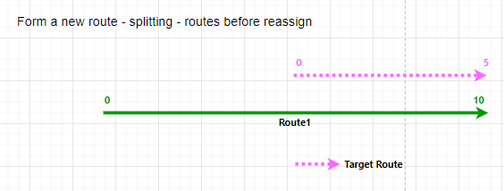 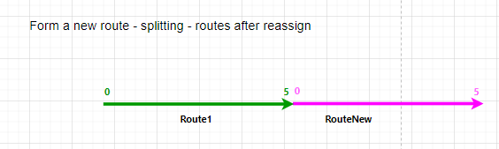 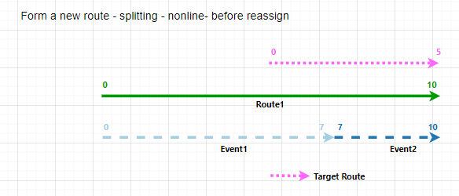 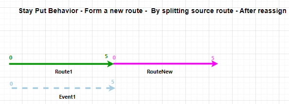 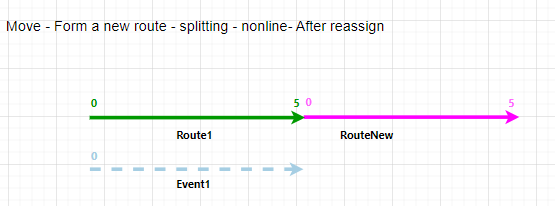 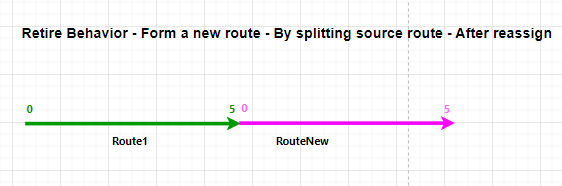 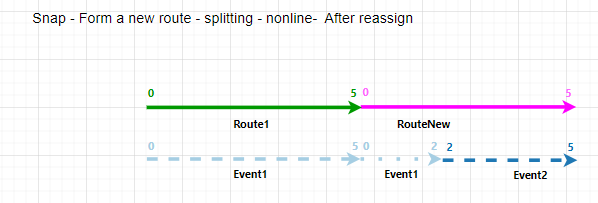 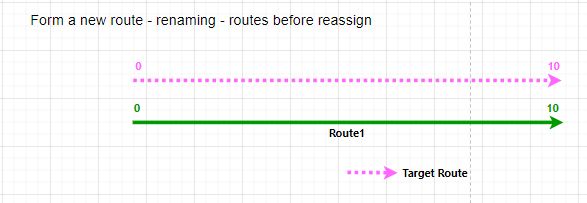 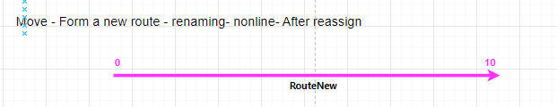 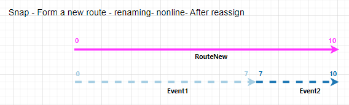 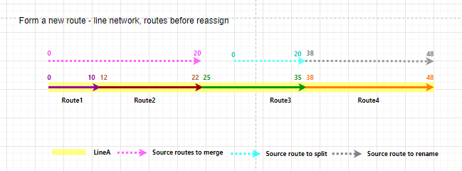
