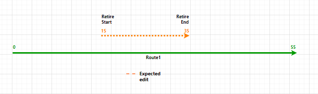
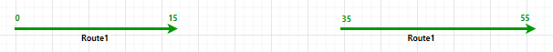
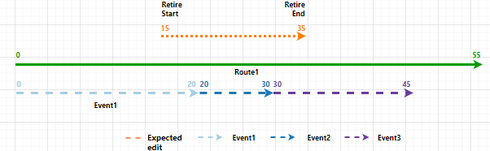
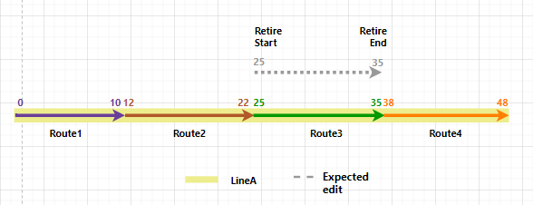
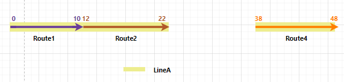
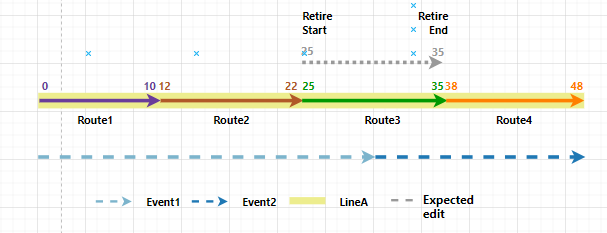
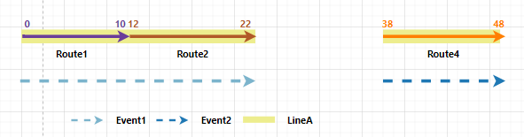

# Event Behavior for Route Retirement

|   |   |
| --- | --- |
| **Kind** | Other · Pro |
| **Release** | — |
| **Product** | Pipeline Referencing |
| **Source** | [TrackChange.EB.retire.APR.docx](<https://esriis.sharepoint.com/sites/LocationReferencing/Shared%20Documents/General/Doc%20Reviews/5515_retirement_behavior/TrackChange.EB.retire.APR.docx>) |
| **Edited** | 2024-01-03 18:55 by Ignacia Galvan |
| **Extracted** | 2026-09-04 · lane `xmlstrip` |

<!-- metadata
```yaml
title: "Event Behavior for Route Retirement"
source_file: "TrackChange.EB.retire.APR.docx"
source_url: "https://esriis.sharepoint.com/sites/LocationReferencing/Shared%20Documents/General/Doc%20Reviews/5515_retirement_behavior/TrackChange.EB.retire.APR.docx"
doc_id: 443
doc_kind: "Other"
surface: "Pro"
doc_revision: ""
target_release: ""
pe: ""
dev: ""
author: "Claire Wang"
last_edited_by: "Ignacia Galvan"
last_edited: "2024-01-03T18:55:00Z"
extracted: 2026-09-04
extraction_lane: xmlstrip
prompt_version: "v2.0.2"
keywords: ["route retirement", "event behavior", "stay put", "move", "retire", "time slice", "line network", "event splitting", "route calibration"]
tools: ["Apply Event Behaviors"]
products: ["Pipeline Referencing"]
issues: []
related: [{"doc":442,"file":"event-behavior-for-route-retirement__doc442.md","s":8.967},{"doc":441,"file":"event-behavior-for-route-retirement__doc441.md","s":7.685},{"doc":425,"file":"event-behavior-for-route-retirement__doc425.md","s":7.319},{"doc":420,"file":"event-behavior-for-route-retirement__doc420.md","s":7.271},{"doc":440,"file":"event-behavior-for-route-retirement__doc440.md","s":7.209}]
```
-->

## Summary

This document explains how event behaviors are applied when routes are retired in a linear referencing system. It details the effects of different event behaviors—Stay Put, Move, and Retire—on events associated with routes during retirement scenarios, including single routes and routes in a line network. The document also covers the impact on upstream and downstream events and the use of the Apply Event Behaviors tool.

## Related documents

<!-- related:begin -->
- [Event Behavior for Route Retirement](<https://esriis.sharepoint.com/sites/lrsworkspace/LRS Doc Index/Other/event-behavior-for-route-retirement__doc442.md>) — similar text 0.92 · 4 title words · 3 filename words · same kind/surface/folder <!-- rel:442 -->
- [Event Behavior for Route Retirement](<https://esriis.sharepoint.com/sites/lrsworkspace/LRS Doc Index/Other/event-behavior-for-route-retirement__doc441.md>) — similar text 0.72 · 4 title words · 2 filename words · same kind/surface/folder <!-- rel:441 -->
- [Event Behavior for Route Retirement](<https://esriis.sharepoint.com/sites/lrsworkspace/LRS Doc Index/Other/event-behavior-for-route-retirement__doc425.md>) — similar text 0.70 · 4 title words · 2 filename words · same kind/surface <!-- rel:425 -->
- [Event Behavior for Route Retirement](<https://esriis.sharepoint.com/sites/lrsworkspace/LRS Doc Index/Other/event-behavior-for-route-retirement__doc420.md>) — similar text 0.69 · 4 title words · 2 filename words · same kind/surface <!-- rel:420 -->
- [Event Behavior for Route Retirement](<https://esriis.sharepoint.com/sites/lrsworkspace/LRS Doc Index/Other/event-behavior-for-route-retirement__doc440.md>) — similar text 0.73 · 4 title words · 1 filename word · same kind/surface/folder <!-- rel:440 -->
<!-- related:end -->

<!-- docs:begin -->
## Esri documentation

[Retire routes](https://doc.esri.com/en/arcgis-pro/latest/help/production/location-referencing-pipelines/retire-routes.html) · [Event behavior](https://doc.esri.com/en/arcgis-pro/latest/help/production/location-referencing-pipelines/what-is-event-behavior.html)

_No page matched:_ [Apply Event Behaviors](https://www.google.com/search?q=%22Apply%20Event%20Behaviors%22+site%3Adoc.esri.com)
<!-- docs:end -->

---

## Event behavior for route retirement
When routes are  https://prodev.arcgis.com/en/pro-app/3.2/help/production/location-referencing-pipelines/retire-routes.htm  \h retired,  https://prodev.arcgis.com/en/pro-app/3.2/help/production/location-referencing-pipelines/what-is-event-behavior.htm \h events are impacted depending on the  https://prodev.arcgis.com/en/pro-app/3.2/help/production/location-referencing-pipelines/what-is-event-behavior.htm \h configured event behavior for each event layer.
When routes are  https://prodev.arcgis.com/en/pro-app/3.2/help/production/roads-highways/retire-routes.htm \h retired,  https://prodev.arcgis.com/en/pro-app/3.2/help/production/roads-highways/what-is-event-behavior.htm \h events are impacted, depending on the  https://prodev.arcgis.com/en/pro-app/3.2/help/production/roads-highways/what-is-event-behavior.htm  \h configured event behavior for each event layer.
Note:
Events are not updated until the Apply Event Behaviors tool is run after route edits. If you are using conflict prevention on branch versioned data, you are prompted to run Apply Event Behaviors before posting to the default version.
Note:
When Recalibrate route downstream is chosen for an LRS route edit, the configured calibrate event behavior is applied to downstream sections. You can review configured event behaviors by viewing LRS event properties.
Running the Apply Event Behaviors tool on event features after aThe route retirement and corresponding route edit isevent behaviors are described below.

### Route retirement scenario
The following retirement scenario involves oneA route and three events. The retirement starts in Event1, completely spans Event2, and ends in Event3.

#### Stay Put behavior
Whilecan be retired at the geographic locationbeginning, in the middle, or at the end of the event outside the retire region is preserved, the measures can change. The event can also split if it crosses the retire region. Portions of the reassign region are retired.

#### Move behavior
The measures and route. If the retirement takes place in the middle of the event are maintained;route, the geographic location can change.

#### Retire behavior
The geographic location and measure ofresultant route is a gapped route. For line network, You can fully or partially retire multiple adjoining routes that belong to the event are preserved; the event is retired. Events intersecting the retire region are retiredsame line.

#### Upstream and downstream sections
Route editing impacts upstream and downstream sections differently.
The following image shows the upstream and downstream sections for the route retirement scenario: (Please use updated svg and use the title as hover text)

The following table details how the retirement editing activity impacts upstream and downstream events according to the configured event behavior:

| Behavior | Events upstream | Events intersecting | Events downstream |
| --- | --- | --- | --- |
| Stay Put | No action. | Retire event; line events crossing the edit region are split and the original event is retired. | If route calibration is changed, the recalibrate calibrate event behavior is applied; otherwise, no action is taken. |
| Move | Shape regenerated, if needed, to new location of route measures. | Shape regenerated to new location of route measures. | If route calibration is changed, the recalibrate calibrate event behavior is applied; otherwise, no action is taken. |
| Retire | No action. | Retire event; line events crossing the edit region are not split. | If route calibration is changed, the recalibrate calibrate event behavior is applied; otherwise, no action is taken. |

Note:
Point events follow the same behavior as line events but don't need to be split.
If the  https://prodev.arcgis.com/en/pro-app/3.2/help/production/location-referencing-pipelines/reassign-routes.htm  \h Recalibrate route downstream option is chosen,  https://prodev.arcgis.com/en/pro-app/3.2/help/production/location-referencing-pipelines/event-behavior-for-route-calibration.htm \h calibrate route event behaviors are applied to the events downstream of the edited portion of the route.
The network can contain events that span multiple routes in a line network. In this case, theThe behaviors are still applied in the same manner.
Since the LRS is  https://prodev.arcgis.com/en/pro-app/3.2/help/production/location-referencing-pipelines/time-awareness-in-pipeline-referencing.htm \h time aware https://prodev.arcgis.com/en/pro-app/3.2/help/production/roads-highways/time-awareness-in-roads-and-highways.htm \h time aware, edit activities— such as retiring a route— will time slice routes and events.

#### Detailed behaviorRoute Retirement results
The following sections detail how event behavior rules are enforced when a route is retired.

#### Stay Put event behavior
The route In this example, the route Route1 is active from 1/1/2000, and if the. The retirement is set to occur in the middle of the route on 1/1/2005 and. Recalibrate route downstream option is not chosen, this has the following effects:

- Event1 is represented by two time slices. There is a time slice from 1/1/2000 to 1/1/2005, with the original measures from 0 to 20, . The graphics and tables below demonstrate the route information before and a time slice from 1/1/2005 to <Null>, with measures from 0 to 15, that stay the same location geographically.
- Event2 retires to maintain geographic location.
- Event3 is represented by two time slices. There is a time slice from 1/1/2000 to 1/1/2005, withafter the original measures from 30 to 45, and a time slice from 1/1/2005 to <Null>, with measures from 35 to 45, that stay the same geographicallyretirement.

#### Before Stay Put event behaviorroute retirement
The following image shows the route before retirement: (Please use updated svg and use the title as hover text
The following table provides details about the route before retirement:

| Route Name | From Date | To Date | From Measure | To Measure |
| --- | --- | --- | --- | --- |
| Route1 | 1/1/2000 | <Null> | 0 | 55 |

#### After route retirement
The following image shows the route after retirement. A gapped a route is created. (Please use updated svg and use the title as hover text

The following table provides details about the route after retirement:

| Route Name | From Date | To Date | From Measure | To Measure |
| --- | --- | --- | --- | --- |
| Route1 | 1/1/2000 | 1/1/2005 | 0 | 55 |
| Route1 | 1/1/2005 | <Null> | 0 | 55 |

#### Events before route retirement
There are three events on Route1 and all of them have a From Date of 1/1/2000. The following image shows the route and events before retirement: (Please use updated svg and use the title as hover text

The following table provides details about the events before retirement:

| Event | Route Name | From Date | To Date | From Measure | To Measure |
| --- | --- | --- | --- | --- | --- |
| Event1 | Route1 | 1/1/2000 | <Null> | 0 | 20 |
| Event2 | Route1 | 1/1/2000 | <Null> | 20 | 30 |
| Event3 | Route1 | 1/1/2000 | <Null> | 30 | 45 |

 The following sections detail how event behavior rules are enforced after running the  https://prodev.arcgis.com/en/pro-app/3.2/tool-reference/location-referencing/apply-event-behaviors.htm  \h Apply Event Behaviors tool under this route retirement scenario.

#### After Stay Put event behavior
Although the geographic location of the event is maintained, the measures can change. The event can also split if it crosses the retire region. Portions of the reassign region are retired.
The route retirement described above has the following effects:

- Event1 is retired on the date of retirement since part of it is in the edit section. A new event is created on the post-retirement route with the retirement date as the From Date. The From and To Measures are changed to 0 to 15 to accommodate the new measures of Route1.
- Event2 is retired on the date of retirement since it is completely in the edit section.
- Event3 is retired on the date of retirement since part of it is in the edit section. A new event is created on the post-retirement route with the retirement date as the From Date. The From and To Measures are changed to 35 to 45 to accommodate the new measures of Route1.
The following image shows the route and events after retirement: (Please use updated svg and use the title as hover text

Note:
It is important to note that the retired event is not drawn in the graphic above.
The following table provides details about the events after retirement when Stay Put is the configured event behavior:

| Event | Route Name | From Date | To Date | From Measure | To Measure | Location Error |
| --- | --- | --- | --- | --- | --- | --- |
| Event1 | Route1 | 1/1/2000 | 1/1/2005 | 0 | 20 | No Error |
| Event1 | Route1 | 1/1/2005 | <Null> | 0 | 15 | No Error |
| Event3 | Route1 | 1/1/2000 | 1/1/2005 | 30 | 45 | No Error |
| Event3 | Route1 | 1/1/2005 | <Null> | 35 | 45 | No Error |

####  

#### Move event behavior
Although the measures of the event are maintained, the geographic location can change.
The route is active from 1/1/2000, and if the retirement is set to occur on 1/1/2005 and Recalibrate route downstream is not chosen, thisdescribed above has the following effects:

- Event1 is represented by two time slices. There is a time slice from 1/1/2000 to 1/1/2005 and a time slice from 1/1/2005 to <Null>, both with the original measures from 0 to 20. This new time slice will only partially locate since the event time slice has measures from 0 to 20, but the underlying route time slice only has measures from 0 to 15 and 35 to 55, with a physical gap created due to retirement.
- Event2 is represented by two time slices. There is a time slice from Event1 is retired on the date of retirement since part of it is in the edit section. A new event is created on the post-retirement route with the retirement date as the From Date. Because the measures do not change for the Move behavior, there is a location error for the To Measure because that measure (20) no longer exists on Route1.
- Event2 is retired on the date of retirement since it is completely in the edit section. A new event is created on the post-retirement route with the retirement date as the From Date. Because the measures do not change for the Move behavior, there is a location error as both From Measure (20) and To Measure (30) no longer exist on Route1.
- Event1 is retired on the date of retirement since part of it is in the edit section. A new event is created on the post-retirement route with the retirement date as the From Date. Because the measures do not change for the Move behavior, there is a location error for the From Measure because that measure (30) no longer exists on Route1.
- 1/1/2000 to 1/1/2005 and a time slice from 1/1/2005 to <Null>, both with the measures from 20 to 30. This new time slice will not locate since the event time slice has measures from 20 to 30, but the underlying route does not have a route with those measures.
- Event3 is represented by two time slices. There is a time slice from 1/1/2000 to 1/1/2005 and a time slice from 1/1/2005 to <Null>, both with the original measures 30 to 45. This new time slice only partially locates since the event time slice has measures from 30 to 45, but the underlying route time slice only has measures from 0 to 15 and 35 to 55, with a physical gap created due to retirement.

##### Before Move event behavior
The following image shows the route before retirement:

The following table provides details about the and events before retirement:

| Event | Route Name | From Date | To Date | From Measure | To Measure |
| --- | --- | --- | --- | --- | --- |
| Event1 | Route1 | 1/1/2000 | <Null> | 0 | 20 |
| Event2 | Route1 | 1/1/2000 | <Null> | 20 | 30 |
| Event3 | Route1 | 1/1/2000 | <Null> | 30 | 45 |

##### After Move event behavior
The following image shows the route after retirement: (Please use updated svg and use the title as hover text

The following table provides details about the events after retirement when Move is the configured event behavior:

| Event |  | Route Name |  | From Date |  | To Date |  | From Measure |  | To Measure |  | Location Error |  |  |
| --- | --- | --- | --- | --- | --- | --- | --- | --- | --- | --- | --- | --- | --- | --- |
| Event1 |  | Route1 |  | 1/1/2000 |  | 1/1/2005 |  | 0 |  | 20 |  | No Error |  |  |
| Event1 |  | Route1 |  | 1/1/2005 |  | <Null> |  | 0 |  | 20 |  | Partial match for the to measure |  |  |
| Event 2 | Route1 | 1/1/2000 | 1/1/2005 | 20 | 3 0 | No Error |  |  |  |  |  |  |  |  |
| Event 2 | Route1 | 1/1/2005 | <Null> | 20 | 3 0 | Route Location Not Found |  |  |  |  |  |  |  |  |
| Event3 |  | Route1 |  | 1/1/2000 |  | 1/1/2005 |  | 30 |  | 45 |  | No Error |  |  |
| Event3 |  | Route1 |  | 1/1/2005 |  | <Null> |  | 30 |  | 45 |  | Partial match for the from measure |  |  |

#### Retire event behavior
The route is active from 1/1/2000, and if the retirement is set to occur on 1/1/2005 and Recalibrate route downstream is not chosen, this has the following effects:
Events intersecting the retire region are retired.

- Event1 retires on the date of retirement since it intersects the retired region.
- Event2 retires on the date of retirement since it is completely inside the retired region.
- Event3 retires on the date of retirement since it intersects the retired region.

##### Before Retire event behavior
The following image shows the route before retirement:

The following table provides details about the events before retirement:

| Event | Route Name | From Date | To Date | From Measure | To Measure |
| --- | --- | --- | --- | --- | --- |
| Event1 | Route1 | 1/1/2000 | <Null> | 0 | 20 |
| Event2 | Route1 | 1/1/2000 | <Null> | 20 | 30 |
| Event3 | Route1 | 1/1/2000 | <Null> | 30 | 45 |

##### After Retire event behavior
The following image shows the route and events after retirement: (Please use updated svg and use the title as hover text

The following table provides details about the events after retirement when Retire is the configured event behavior:

| Event | Route Name | From Date | To Date | From Measure | To Measure | Location Error |
| --- | --- | --- | --- | --- | --- | --- |
| Event1 | Route1 | 1/1/2000 | 1/1/2005 | 0 | 20 | No Error |
| Event2 | Route1 | 1/1/2000 | 1/1/2005 | 20 | 30 | No Error |
| Event3 | Route1 | 1/1/2000 | 1/1/2005 | 30 | 45 | No Error |

### Detailed behavior on routes in a line network with events that span routes

#### Stay Put event behavior
This retirement scenario involves In this example, there are four routes on athe same line in a line network and two events. Route3 will be retired. The retired route (depicted with a dotted line) impacts both Event1 and Event2.
Thethe routes are active from 1/1/2000 and if the. The retirement is set to occur on 1/1/2005 and where entire Route3 is retired. Recalibrate route downstream is unchecked, this will have the following effects:not chosen. The graphics and tables below demonstrate the route information before and after the retirement.

- Event1 will be represented by two time slices. There will be a time slice from 1/1/2000 to 1/1/2005, with the original measures of 0 to 30 on Route1 and Route3, and a time slice from 1/1/2005 to <null>, with measures of 0 on Route1 to 22 on Route2 as it stays in the same location geographically. The portion of the event on Route3 will be retired since there is no route to build that part of the event shape on any longer.
- Event2 will be represented by two time slices. There will be a time slice from 1/1/2000 to 1/1/2005, with the original measures of 30 on Route3 to 48 on Route4, and a time slice from 1/1/2005 to <null>, with measures of 38 on Route4 to 48 on Route4 as it stays in the same location geographically. The portion of the event on Route3 will be retired since there is no route to build that part of the event shape on any longer.

#### Before Stay Put event behaviorroute retirement
The following image shows the routes before retirement: (Please use updated svg and use the title as hover text

The following table provides details about the eventsroutes before retirement.:

| Event ID Route Name |  | From Date Line Name |  | To Date Line Order |  | From RouteID Date |  | To Route ID Date |  | From Measure |  | To Measure |  |  |
| --- | --- | --- | --- | --- | --- | --- | --- | --- | --- | --- | --- | --- | --- | --- |
| Event1 Route1 |  | 1/1/2000 LineA |  | <null> 100 |  | 1/1/2000 Route1 |  | Route3 <Null> |  | 0 |  | 30 10 |  |  |
| Route2 |  | LineA |  | 200 |  | 1/1/2000 |  | <Null> |  | 12 |  | 22 |  |  |
| Route3 |  | LineA |  | 300 |  | 1/1/2000 |  | <Null> |  | 25 |  | 35 |  |  |
| Route4 Event2 |  | 1/1/2000 LineA |  | <null> 400 |  | Route3 1/1/2000 |  | Route4 <Null> |  | 30 38 |  | 48 |  |  |

#### After Stay Put event behaviorroute retirement
The following image shows the routes after retirement: (Please use updated svg and use the title as hover text
The following table provides details about the routes after retirement:

| Route Name | Line Name | Line Order | From Date | To Date | From Measure | To Measure |
| --- | --- | --- | --- | --- | --- | --- |
| Route1 | LineA | 100 | 1/1/2000 | <Null> | 0 | 20 |
| Route2 | LineA | 200 | 1/1/2000 | <Null> | 12 | 22 |
| Route3 | LineA | 300 | 1/1/2000 | 1/1/2005 | 25 | 35 |
| Route4 | LineA | 400 | 1/1/2000 | 1/1/2005 | 38 | 48 |
| Route4 | LineA | 300 | 1/1/2005 | <Null> | 38 | 48 |

#### Events before retirement
There are two spanning events on routes on LineA. The following image shows the routes and events before retirement: (Please use updated svg and use the title as hover text

The following table provides details about the events before retirement:

| Event ID | From Date | To Date | From Route Name | To Route Name | From Measure | To Measure |
| --- | --- | --- | --- | --- | --- | --- |
| Event1 | 1/1/2000 | <Null> | Route1 | Route3 | 0 | 30 |
| Event2 | 1/1/2000 | <Null> | Route3 | Route4 | 30 | 48 |

The following sections describe how event behavior rules are enforced when a route on a line in a line network is retired.

#### Stay Put event behavior
Although the geographic location of the event is maintained, the measures can change.
The route retirement described above has the following effects:

- Event1 is retired on the date of retirement since part of it is in the edit section. A new event is created on the post-retirement route with the retirement date as the From Date. The From and To Measures are changed to measure 0 on Route1 to 22 on Route2, since Route3 is no longer present in the line.
- Event2 is retired on the date of retirement since part of it is in the edit section. A new event is created on the post-retirement route with the retirement date as the From Date. The From and To Measures are changed to measure 38 on Route4 to 48 on Route4, since Route3 is no longer present in the line.
The following image shows the routes and events after retirement: (Please use updated svg and use the title as hover text

Note:
It is important to note that the retired event is not drawn in the graphic above.
The following table provides details about the events after retirement when Stay Put is the configured event behavior.:

| Event ID | From Date | To Date | From RouteID Route Name | To Route ID Name | From Measure | To Measure | Location Error |
| --- | --- | --- | --- | --- | --- | --- | --- |
| Event1 | 1/1/2000 | 1/1/2005 | Route1 | Route3 | 0 | 30 | No Error |
| Event1 | 1/1/2005 | <null> | Route1 | Route2 | 0 | 22 | No Error |
| Event2 | 1/1/2000 | 1/1/2005 | Route3 | Route4 | 30 | 48 | No Error |
| Event2 | 1/1/2005 | <null> | Route4 | Route4 | 38 | 48 | No Error |

#### Move event behavior
The routes are active from 1/1/2000 and ifAlthough the measures of the event are maintained, the geographic location can change.
The route retirement is set to occur on 1/1/2005 and Recalibrate route downstream is unchecked, this will have described above has the following effects:

- Event1 will be represented by two time slices. There will be a time slice from 1/1/2000 to 1/1/2005 and a time slice from 1/1/2005 to <null>, both with the original measures 0 on Route1 to 30 on Route3. This new time slice will only partially locate since the event time slice has measures of 0 to 30 on Route1 to Route3, but Route3 has been retired, so there is no route in that location to build a shape.
- Event2 will be represented by two time slices. There will be a time slice from 1/1/2000 to 1/1/2005 and a time slice from 1/1/2005 to <null>, both with the measures of 30 on Route3 to 48 on Route4. This new time slice will not locate since the event time slice has measures of 30 to 48 on Route3 to Route4, but Route3 has been retired, so there is no route in that location to build a shape.

##### Before Move event behavior

- Event1 is retired on the date of retirement since part of it is in the edit section. A new event is created on the post-retirement route with the retirement date as the From Date. Because the measures do not change for the Move behavior, there is a location error for the To Measure because Route3 no longer exists in the line.
- Event2 is retired on the date of retirement since part of it is in the edit section. A new event is created on the post-retirement route with the retirement date as the From Date. Because the measures do not change for the Move behavior, there is a location error for the From Measure because Route3 no longer exists in the line.
The following image shows the routes before retirement:
route and
The following table provides details about the events before retirement.

| Event ID | From Date | To Date | From RouteID | To Route ID | From Measure | To Measure |
| --- | --- | --- | --- | --- | --- | --- |
| Event1 | 1/1/2000 | <null> | Route1 | Route3 | 0 | 30 |
| Event2 | 1/1/2000 | <null> | Route3 | Route4 | 30 | 48 |

##### After Move event behavior
The following image shows the routes after retirement: (Please use updated svg and use the title as hover text

The following table provides details about the events after retirement when Move is the configured event behavior.:

| Event ID | From Date | To Date | From RouteID Route Name | To Route ID Name | From Measure | To Measure | Location Error |
| --- | --- | --- | --- | --- | --- | --- | --- |
| Event1 | 1/1/2000 | 1/1/2005 | Route1 | Route3 | 0 | 30 | No Error |
| Event1 | 1/1/2005 | <null> | Route1 | Route3 | 0 | 30 | Partial Match for the To Measure |
| Event2 | 1/1/2000 | 1/1/2005 | Route3 | Route4 | 30 | 48 | No Error |
| Event2 | 1/1/2005 | <null> | Route3 | Route4 | 30 | 48 | Partial Match for the From Measure |

#### Retire event behavior
The routes are active from 1/1/2000 and if the retirement is set to occur on 1/1/2005 and Recalibrate route downstream is unchecked, this will have the following effects:
Event1 will retire Events intersecting the retire region are retired.

- Event1 retires on the date of retirement since it is located within the retired region.
- Event2 will retire since it is located withinintersects the retired region.

##### Before Retire event behavior

- Event2 retires on the date of retirement since it is completely inside the retired region.
- Event3 retires on the date of retirement since it intersects the retired region.
The following image shows the routes before retirement:

The following table provides details about the route and events before retirement.

| Event ID | From Date | To Date | From RouteID | To Route ID | From Measure | To Measure |
| --- | --- | --- | --- | --- | --- | --- |
| Event1 | 1/1/2000 | <null> | Route1 | Route3 | 0 | 30 |
| Event2 | 1/1/2000 | <null> | Route3 | Route4 | 30 | 48 |

##### After Retire event behavior
The following image shows the routes after retirement: (Please use updated svg and use the title as hover text

The following table provides details about the events after retirement when Retire is the configured event behavior.:

| Event ID | From Date | To Date | From RouteID Route Name | To Route ID Name | From Measure | To Measure | Location Error |
| --- | --- | --- | --- | --- | --- | --- | --- |
| Event1 | 1/1/2000 | 1/1/2005 | Route1 | Route3 | 0 | 30 | No Error |
| Event2 | 1/1/2000 | 1/1/2005 | Route3 | Route4 | 30 | 48 | No Error |

           
